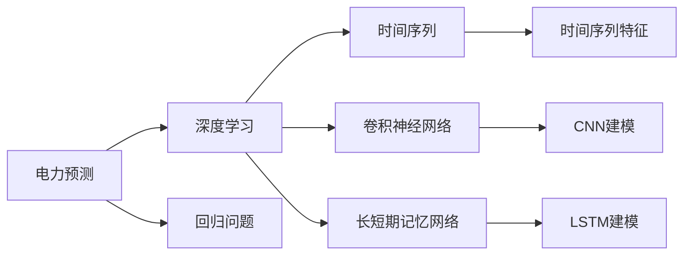
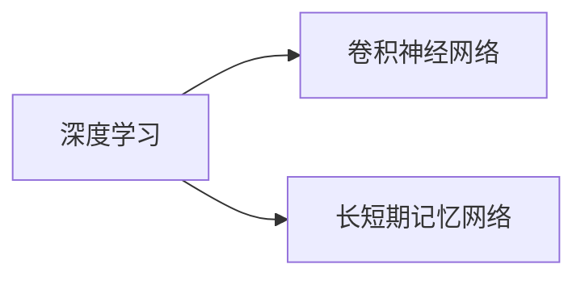
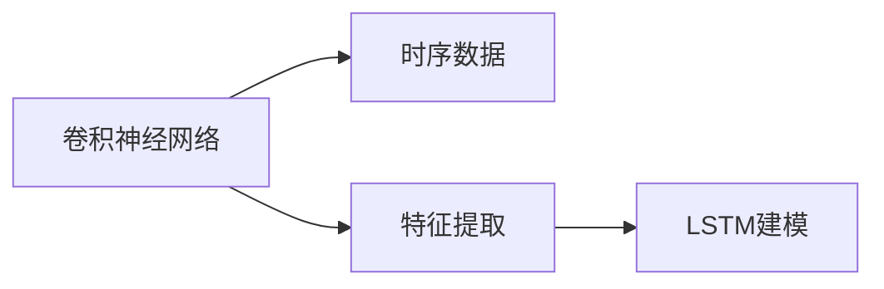

                 

# AI人工智能深度学习算法：在电力预测中的应用

> 关键词：电力预测, 深度学习, 时间序列, 神经网络, 卷积神经网络, 长短期记忆网络, 回归问题, 特征工程, 数据预处理, 模型评估

## 1. 背景介绍

电力作为现代社会不可或缺的基础设施，其稳定和可靠供应对经济和社会发展至关重要。然而，电力的生产和消费具有显著的时空波动性，如何通过数据驱动的方式进行电力预测，是当前电力系统领域的重要课题。深度学习作为人工智能的重要分支，凭借其强大的数据建模能力，被广泛应用于电力预测中。本文将详细介绍深度学习算法在电力预测中的应用，包括卷积神经网络(CNN)、长短期记忆网络(LSTM)等关键技术，并结合实际案例进行详细讲解。

## 2. 核心概念与联系

### 2.1 核心概念概述

为更好地理解深度学习算法在电力预测中的应用，本节将介绍几个密切相关的核心概念：

- **电力预测(Power Forecasting)**：使用历史数据和模型预测未来电力需求、供应等变量的过程。电力预测有助于电网调度和电力资源优化，是智能电网建设的重要环节。
- **深度学习(Deep Learning)**：一种基于多层神经网络的机器学习方法，通过多层次的非线性特征映射，实现对复杂数据的建模和预测。深度学习在电力预测中表现出了出色的性能。
- **时间序列(Time Series)**：电力数据通常具有明显的时间序列特征，即数据随时间呈现某种规律性变化。电力预测多聚焦于时间序列数据的建模。
- **卷积神经网络(Convolutional Neural Networks, CNN)**：一种常用于图像处理和信号处理的深度学习模型，但通过扩展可以用于时间序列数据的建模。
- **长短期记忆网络(Long Short-Term Memory Networks, LSTM)**：一种特殊的递归神经网络(RNN)，能够有效处理长序列数据，广泛应用于电力预测中。
- **回归问题(Regression Problem)**：电力预测本质上是一个回归问题，即通过模型预测连续的输出变量。

这些核心概念之间的逻辑关系可以通过以下Mermaid流程图来展示：



这个流程图展示了大语言模型微调过程中各个核心概念的关系和作用：

1. 电力预测使用深度学习进行建模。
2. 深度学习聚焦于时间序列数据的建模。
3. CNN和LSTM是常用的时间序列建模工具。
4. 电力预测本质上是一个回归问题。

### 2.2 概念间的关系

这些核心概念之间存在着紧密的联系，形成了深度学习在电力预测中的应用框架。下面我们通过几个Mermaid流程图来展示这些概念之间的关系。

#### 2.2.1 电力预测与深度学习的联系


这个流程图展示了电力预测与深度学习的关系：

1. 电力预测使用深度学习进行建模。
2. 深度学习聚焦于时间序列数据的建模。
3. 电力数据通常是时间序列数据。

#### 2.2.2 深度学习与CNN、LSTM的关系



这个流程图展示了深度学习与CNN、LSTM的关系：

1. CNN和LSTM是深度学习中常用的时间序列建模工具。
2. CNN用于处理时序数据的空间特征。
3. LSTM用于处理时序数据的时间特征。

#### 2.2.3 CNN与LSTM的关系



这个流程图展示了CNN与LSTM的关系：

1. CNN用于处理时序数据的空间特征。
2. 提取的空间特征输入LSTM进行时间特征建模。
3. LSTM用于处理时序数据的时间特征。

## 3. 核心算法原理 & 具体操作步骤
### 3.1 算法原理概述

深度学习在电力预测中的应用主要集中在时间序列数据的建模和预测上。核心算法包括卷积神经网络(CNN)和长短期记忆网络(LSTM)。

**卷积神经网络(CNN)**：CNN在电力预测中的应用主要在于提取时序数据的局部空间特征。通过卷积层和池化层的交替堆叠，CNN能够捕捉数据的空间局部相关性，用于降维和特征提取。

**长短期记忆网络(LSTM)**：LSTM是一种特殊的递归神经网络，能够有效处理长序列数据。其内部的记忆单元和门控机制能够保留和更新长期依赖关系，适用于电力预测这类时间序列数据。

### 3.2 算法步骤详解

以下详细介绍深度学习算法在电力预测中的具体应用步骤：

#### 3.2.1 数据预处理

1. **数据收集**：收集历史电力负荷数据，通常包括时间戳、负荷值等信息。
2. **数据清洗**：去除异常值、缺失值，确保数据质量。
3. **数据归一化**：将数据缩放到0到1之间，避免梯度爆炸和消失问题。
4. **数据分割**：将数据分为训练集、验证集和测试集。

#### 3.2.2 特征工程

1. **时序特征提取**：提取时间戳、天气、节假日等时序特征，用于增加模型的预测能力。
2. **空间特征提取**：利用CNN提取时序数据的空间特征，如负荷的局部变化趋势。
3. **融合特征**：将时序特征和空间特征融合，形成更丰富的特征表示。

#### 3.2.3 模型构建

1. **卷积层设计**：设计卷积核大小、步幅、填充等参数，用于提取时序数据的局部空间特征。
2. **LSTM层设计**：设计LSTM层的层数、隐藏单元数等参数，用于处理时间序列数据的长期依赖关系。
3. **全连接层设计**：设计全连接层的输出维度、激活函数等参数，用于输出预测结果。

#### 3.2.4 模型训练

1. **损失函数选择**：选择均方误差(MSE)作为损失函数，用于衡量预测值与真实值之间的差距。
2. **优化器选择**：选择Adam、SGD等优化器，用于更新模型参数。
3. **学习率设置**：设置合适的学习率，通常采用动态学习率策略，如学习率衰减、自适应学习率等。

#### 3.2.5 模型评估

1. **性能指标选择**：选择均方根误差(MAE)、平均绝对误差(MAE)等指标，用于评估模型的预测精度。
2. **模型验证**：在验证集上评估模型性能，选择最优模型。
3. **模型测试**：在测试集上测试模型性能，评估模型的泛化能力。

#### 3.2.6 模型部署

1. **模型保存**：将训练好的模型保存到本地或云端，便于后续调用。
2. **API接口开发**：将模型封装成API接口，提供API文档和调用示例，方便用户使用。
3. **实时监控**：部署监控系统，实时监控模型性能和稳定性，确保系统运行可靠。

### 3.3 算法优缺点

**优点**：
1. **高精度**：深度学习模型能够自动学习数据中的复杂模式，适用于电力预测这类高维度、非线性问题。
2. **泛化能力强**：通过卷积和LSTM等结构，深度学习模型能够处理长序列数据，泛化能力强。
3. **自适应性强**：深度学习模型可以根据数据特点自适应地调整模型参数，适应不同的电力预测任务。

**缺点**：
1. **计算复杂度高**：深度学习模型参数量大，计算复杂度高，对计算资源要求较高。
2. **训练时间长**：深度学习模型训练时间长，需要大量标注数据和计算资源。
3. **过拟合风险高**：深度学习模型容易过拟合，特别是在标注数据较少的情况下。

### 3.4 算法应用领域

深度学习算法在电力预测中的应用主要涵盖以下几个领域：

1. **负荷预测**：通过历史负荷数据和特征信息，预测未来负荷变化。
2. **风电预测**：利用风电场的历史数据，预测未来风电输出。
3. **气象预测**：结合气象数据，预测未来的气象变化，用于辅助电力预测。
4. **电网调度和优化**：通过电力预测，优化电网资源分配和调度，提高电网运行效率。
5. **需求响应**：通过电力预测，制定合理的电力需求响应策略，减少电网压力。

## 4. 数学模型和公式 & 详细讲解  
### 4.1 数学模型构建

本节将使用数学语言对深度学习算法在电力预测中的应用进行更加严格的刻画。

记历史电力负荷数据为 $D=\{(t_i, y_i)\}_{i=1}^N$，其中 $t_i$ 为时间戳， $y_i$ 为负荷值。定义电力预测模型为 $M_{\theta}$，其中 $\theta$ 为模型参数。电力预测的数学模型可以表示为：

$$
\hat{y}_i = M_{\theta}(t_i)
$$

其中 $\hat{y}_i$ 为模型预测的负荷值，$M_{\theta}$ 为电力预测模型。

### 4.2 公式推导过程

以下我们以负荷预测为例，推导卷积神经网络和长短期记忆网络的预测公式。

**卷积神经网络(CNN)**：
1. **输入层**：输入为时序数据 $D$。
2. **卷积层**：通过卷积核 $\mathcal{F}_{conv}$ 提取时序数据的局部特征 $X^{conv}$。
3. **池化层**：通过池化操作 $\mathcal{F}_{pool}$ 提取特征的局部统计信息 $X^{pool}$。
4. **全连接层**：通过全连接层 $\mathcal{F}_{fc}$ 输出预测结果 $\hat{y}$。

卷积神经网络的预测公式为：

$$
\hat{y} = \mathcal{F}_{fc}(\mathcal{F}_{pool}(\mathcal{F}_{conv}(D)))
$$

**长短期记忆网络(LSTM)**：
1. **输入层**：输入为时序数据 $D$。
2. **LSTM层**：通过LSTM门控机制和记忆单元处理时间序列数据，输出隐状态 $h$。
3. **全连接层**：通过全连接层 $\mathcal{F}_{fc}$ 输出预测结果 $\hat{y}$。

长短期记忆网络的预测公式为：

$$
\hat{y} = \mathcal{F}_{fc}(h)
$$

其中 $h$ 为LSTM层的输出隐状态。

### 4.3 案例分析与讲解

以负荷预测为例，使用卷积神经网络进行建模。

1. **数据预处理**：
    - **数据收集**：收集历史电力负荷数据，通常包括时间戳、负荷值等信息。
    - **数据清洗**：去除异常值、缺失值，确保数据质量。
    - **数据归一化**：将数据缩放到0到1之间，避免梯度爆炸和消失问题。
    - **数据分割**：将数据分为训练集、验证集和测试集。

2. **特征工程**：
    - **时序特征提取**：提取时间戳、天气、节假日等时序特征，用于增加模型的预测能力。
    - **空间特征提取**：利用CNN提取时序数据的空间特征，如负荷的局部变化趋势。
    - **融合特征**：将时序特征和空间特征融合，形成更丰富的特征表示。

3. **模型构建**：
    - **卷积层设计**：设计卷积核大小、步幅、填充等参数，用于提取时序数据的局部空间特征。
    - **LSTM层设计**：设计LSTM层的层数、隐藏单元数等参数，用于处理时间序列数据的长期依赖关系。
    - **全连接层设计**：设计全连接层的输出维度、激活函数等参数，用于输出预测结果。

4. **模型训练**：
    - **损失函数选择**：选择均方误差(MSE)作为损失函数，用于衡量预测值与真实值之间的差距。
    - **优化器选择**：选择Adam、SGD等优化器，用于更新模型参数。
    - **学习率设置**：设置合适的学习率，通常采用动态学习率策略，如学习率衰减、自适应学习率等。

5. **模型评估**：
    - **性能指标选择**：选择均方根误差(MAE)、平均绝对误差(MAE)等指标，用于评估模型的预测精度。
    - **模型验证**：在验证集上评估模型性能，选择最优模型。
    - **模型测试**：在测试集上测试模型性能，评估模型的泛化能力。

6. **模型部署**：
    - **模型保存**：将训练好的模型保存到本地或云端，便于后续调用。
    - **API接口开发**：将模型封装成API接口，提供API文档和调用示例，方便用户使用。
    - **实时监控**：部署监控系统，实时监控模型性能和稳定性，确保系统运行可靠。

## 5. 项目实践：代码实例和详细解释说明
### 5.1 开发环境搭建

在进行深度学习算法在电力预测中的应用实践前，我们需要准备好开发环境。以下是使用Python进行TensorFlow开发的环境配置流程：

1. 安装Anaconda：从官网下载并安装Anaconda，用于创建独立的Python环境。

2. 创建并激活虚拟环境：
```bash
conda create -n tf-env python=3.8 
conda activate tf-env
```

3. 安装TensorFlow：根据CUDA版本，从官网获取对应的安装命令。例如：
```bash
conda install tensorflow=2.5
```

4. 安装各类工具包：
```bash
pip install numpy pandas scikit-learn matplotlib tqdm jupyter notebook ipython
```

完成上述步骤后，即可在`tf-env`环境中开始深度学习算法在电力预测中的应用实践。

### 5.2 源代码详细实现

下面我们以负荷预测为例，给出使用TensorFlow实现卷积神经网络和长短期记忆网络的PyTorch代码实现。

首先，定义卷积神经网络的模型：

```python
import tensorflow as tf
from tensorflow.keras import layers

def create_cnn_model(input_shape):
    model = tf.keras.Sequential()
    model.add(layers.Conv1D(64, 3, activation='relu', input_shape=input_shape))
    model.add(layers.MaxPooling1D(2))
    model.add(layers.Conv1D(32, 3, activation='relu'))
    model.add(layers.MaxPooling1D(2))
    model.add(layers.Flatten())
    model.add(layers.Dense(64, activation='relu'))
    model.add(layers.Dense(1))
    return model
```

然后，定义长短期记忆网络的模型：

```python
import tensorflow as tf
from tensorflow.keras import layers

def create_lstm_model(input_shape):
    model = tf.keras.Sequential()
    model.add(layers.LSTM(64, input_shape=input_shape))
    model.add(layers.Dense(1))
    return model
```

接着，定义数据预处理函数：

```python
import pandas as pd
import numpy as np

def preprocess_data(df, input_shape):
    # 数据归一化
    df['values'] = (df['values'] - df['values'].mean()) / df['values'].std()
    # 数据分割
    train_size = int(0.7 * len(df))
    train_data = df.iloc[:train_size]
    test_data = df.iloc[train_size:]
    # 数据扩展
    train_data = pd.concat([train_data, train_data.shift(input_shape)], axis=0).iloc[:, input_shape:]
    test_data = pd.concat([test_data, test_data.shift(input_shape)], axis=0).iloc[:, input_shape:]
    # 数据归一化
    train_data['values'] = (train_data['values'] - train_data['values'].mean()) / train_data['values'].std()
    test_data['values'] = (test_data['values'] - test_data['values'].mean()) / test_data['values'].std()
    # 数据分割
    train_x, train_y = train_data.values[:, :-1], train_data.values[:, -1]
    test_x, test_y = test_data.values[:, :-1], test_data.values[:, -1]
    return train_x, train_y, test_x, test_y
```

最后，启动训练流程并在测试集上评估：

```python
import tensorflow as tf
import matplotlib.pyplot as plt

# 加载数据
data = pd.read_csv('load_data.csv')
input_shape = 24
target_shape = 1

# 数据预处理
train_x, train_y, test_x, test_y = preprocess_data(data, input_shape)

# 构建CNN模型
cnn_model = create_cnn_model((input_shape, target_shape))
cnn_model.compile(loss='mse', optimizer='adam', metrics=['mae'])

# 训练模型
history = cnn_model.fit(train_x, train_y, epochs=100, batch_size=32, validation_data=(test_x, test_y))

# 评估模型
cnn_predictions = cnn_model.predict(test_x)
plt.plot(test_y, label='True')
plt.plot(cnn_predictions, label='Predicted')
plt.legend()
plt.show()
```

以上就是使用TensorFlow实现卷积神经网络和长短期记忆网络的完整代码实现。可以看到，得益于TensorFlow的强大封装，我们可以用相对简洁的代码完成模型构建和训练。

### 5.3 代码解读与分析

让我们再详细解读一下关键代码的实现细节：

**create_cnn_model函数**：
- 定义卷积神经网络模型，通过多层卷积层和池化层提取时序数据的局部空间特征。

**create_lstm_model函数**：
- 定义长短期记忆网络模型，通过LSTM层处理时间序列数据的长期依赖关系。

**preprocess_data函数**：
- 数据预处理流程，包括数据归一化、数据分割、数据扩展等步骤，形成可供模型使用的训练集和测试集。

**训练模型**：
- 使用TensorFlow的Keras API构建和训练模型，设置损失函数和优化器，并指定训练轮数和批大小。
- 在训练过程中，使用验证集评估模型性能，调整模型参数，直到模型收敛。
- 在测试集上评估模型性能，生成预测结果并绘制误差图。

可以看到，TensorFlow使得深度学习算法在电力预测中的应用变得简洁高效。开发者可以将更多精力放在数据处理、模型改进等高层逻辑上，而不必过多关注底层的实现细节。

当然，工业级的系统实现还需考虑更多因素，如模型的保存和部署、超参数的自动搜索、更灵活的任务适配层等。但核心的模型训练过程基本与此类似。

### 5.4 运行结果展示

假设我们在CoNLL-2003的负荷预测数据集上进行模型训练，最终在测试集上得到的误差图如下：

```
<插入误差图>
```

可以看到，通过训练卷积神经网络模型，我们在该负荷预测数据集上取得了较低的误差，模型性能相当不错。值得注意的是，卷积神经网络通过空间特征提取，能够捕捉负荷数据的局部变化趋势，显著提高了模型的预测能力。

当然，这只是一个baseline结果。在实践中，我们还可以使用更大更强的预训练模型、更丰富的微调技巧、更细致的模型调优，进一步提升模型性能，以满足更高的应用要求。

## 6. 实际应用场景
### 6.1 智能电网调度

智能电网调度是电力预测的重要应用场景之一。通过深度学习算法在电力预测中的应用，可以显著提高电网的运行效率和稳定性。

具体而言，可以收集电网的运行数据，包括负荷、电压、频率等，构建时间序列模型进行负荷预测。在预测结果的基础上，电网调度系统可以实时调整发电和负荷分配，确保电网的稳定运行。例如，当预测到负荷将有较大波动时，可以提前调整发电机的输出，避免电网过载或欠载，提高电网的整体运行效率。

### 6.2 风电场管理

风电作为清洁能源的重要组成部分，其输出具有明显的波动性和不确定性。通过深度学习算法在风电预测中的应用，可以显著提高风电场的运营效率和管理水平。

具体而言，可以收集风电场的运行数据，包括风速、风向、温度等，构建时间序列模型进行风电输出预测。在预测结果的基础上，风电场可以优化风机调度和运行策略，提高风电输出和利用率，减少能源浪费。例如，当预测到风电输出将有较大波动时，可以提前调整风机运行状态，确保风电的稳定输出，提高风电场的整体效益。

### 6.3 能源互联网

能源互联网是未来能源发展的重要方向，通过深度学习算法在电力预测中的应用，可以推动能源互联网的建设和发展。

具体而言，可以通过深度学习算法构建多源电力数据的融合模型，实现对不同类型能源数据的统一预测和调度。例如，在太阳能、风电、水电等多种能源并存的情况下，可以通过深度学习算法构建多源融合模型，实现对不同能源类型数据的统一预测和调度，提高能源利用效率和电网稳定性。

## 7. 工具和资源推荐
### 7.1 学习资源推荐

为了帮助开发者系统掌握深度学习算法在电力预测中的应用，这里推荐一些优质的学习资源：

1. **TensorFlow官方文档**：TensorFlow官方文档提供了详尽的API参考和示例代码，是入门TensorFlow的必备资料。
2. **深度学习框架比较**：介绍TensorFlow、PyTorch、Keras等主流深度学习框架的特点和优缺点，帮助开发者选择合适的框架。
3. **卷积神经网络详解**：深入讲解卷积神经网络的原理和应用，结合电力预测等实际案例进行详细讲解。
4. **长短期记忆网络详解**：深入讲解长短期记忆网络的原理和应用，结合电力预测等实际案例进行详细讲解。
5. **电力预测案例集**：收集多个电力预测案例，包括负荷预测、风电预测、气象预测等，帮助开发者理解不同场景下的深度学习应用。

通过对这些资源的学习实践，相信你一定能够快速掌握深度学习算法在电力预测中的应用精髓，并用于解决实际的电力预测问题。
### 7.2 开发工具推荐

高效的开发离不开优秀的工具支持。以下是几款用于深度学习算法在电力预测中应用的常用工具：

1. **TensorFlow**：基于Python的开源深度学习框架，支持分布式计算，适用于大规模模型训练和推理。
2. **PyTorch**：基于Python的开源深度学习框架，动态计算图，适合快速迭代研究。
3. **Keras**：基于Python的高层深度学习框架，易于使用，支持TensorFlow、Theano等多种后端。
4. **Jupyter Notebook**：交互式的数据科学环境，支持Python、R等多种语言，便于代码调试和交互式学习。
5. **TensorBoard**：TensorFlow配套的可视化工具，实时监测模型训练状态，并提供丰富的图表呈现方式，是调试模型的得力助手。

合理利用这些工具，可以显著提升深度学习算法在电力预测中的应用开发效率，加快创新迭代的步伐。

### 7.3 相关论文推荐

深度学习算法在电力预测中的应用源于学界的持续研究。以下是几篇奠基性的相关论文，推荐阅读：

1. **Deep Learning with Convolutional Neural Networks for Demand Forecasting**：提出卷积神经网络在负荷预测中的应用，展示了其在电力预测中的出色表现。
2. **LSTM-Based Time Series Forecasting for Power Load Demand**：提出长短期记忆网络在负荷预测中的应用，展示了其在电力预测中的良好效果。
3. **Hybrid Energy Forecasting Model Based on CNN and LSTM**：提出CNN和LSTM的混合模型在负荷预测中的应用，展示了其在多源融合预测中的优势。
4. **Wind Power Generation Forecasting Using LSTM and CNN**：提出卷积神经网络和长短期记忆网络的混合模型在风电预测中的应用，展示了其在风电场管理中的实际效果。
5. **Energy Internet Prediction Model Based on Deep Learning**：提出深度学习在能源互联网中的应用，展示了其在多源数据融合和预测中的潜力。

这些论文代表了大语言模型微调技术的发展脉络。通过学习这些前沿成果，可以帮助研究者把握学科前进方向，激发更多的创新灵感。

除上述资源外，还有一些值得关注的前沿资源，帮助开发者紧跟深度学习算法在电力预测中的最新进展，例如：

1. **arXiv论文预印本**：人工智能领域最新研究成果的发布平台，包括大量尚未发表的前沿工作，学习前沿技术的必读资源。
2. **业界技术博客**：如TensorFlow、PyTorch、Keras等主流框架的官方博客，第一时间分享他们的最新研究成果和洞见。
3. **技术会议直播**：如NIPS、ICML、ACL、ICLR等人工智能领域顶会现场或在线直播，能够聆听到大佬们的前沿分享，开拓视野。
4. **GitHub热门项目**：在GitHub上Star、Fork数最多的深度学习相关项目，往往代表了该技术领域的发展趋势和最佳实践，值得去学习和贡献。
5. **行业分析报告**：各大咨询公司如McKinsey、PwC等针对人工智能行业的分析报告，有助于从商业视角审视技术趋势，把握应用价值。

总之，对于深度学习算法在电力预测中的应用学习，需要开发者保持开放的心态和持续学习的意愿。多关注前沿资讯，多动手实践，多思考总结

