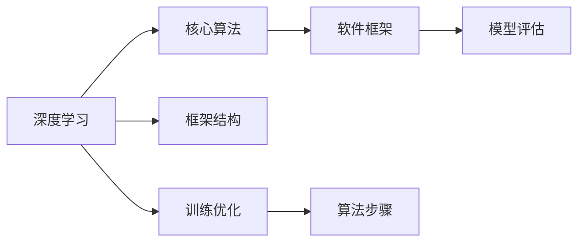
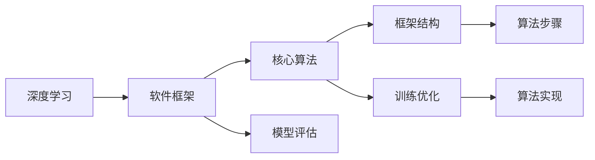

                 

# AI人工智能深度学习算法：深度学习软件框架的掌握与应用

> 关键词：深度学习, 软件框架, 算法原理, 项目实践, 数学模型, 学习资源, 未来展望

## 1. 背景介绍

### 1.1 问题由来

在人工智能（AI）和深度学习（DL）领域，深度学习软件框架（如TensorFlow、PyTorch、MXNet等）的应用日益广泛，它们提供了高效、灵活的机器学习开发环境，并推动了深度学习的快速发展。然而，在深入使用这些框架时，开发者常常会面临如下问题：

1. **理解框架原理**：框架的底层算法和架构原理复杂，不易理解。
2. **掌握核心算法**：对于具体的深度学习算法，如何实现和应用存在不确定性。
3. **高效开发与优化**：如何在实践中高效利用框架，提升开发效率和算法性能。
4. **应用场景选择**：不同框架适用于哪些具体的任务和场景，如何选择最优框架。

本文旨在系统讲解深度学习软件框架的原理、核心算法以及具体应用，为开发者提供实用的指导和工具。通过深入剖析TensorFlow、PyTorch和MXNet三个主流框架，帮助读者掌握深度学习算法的精髓，并在实际项目中灵活应用。

### 1.2 问题核心关键点

深度学习框架主要围绕以下几个关键点展开：

- **框架结构**：了解框架的层次结构和组件，理解其功能模块。
- **核心算法**：掌握常用的深度学习算法，如卷积神经网络（CNN）、循环神经网络（RNN）、变分自编码器（VAE）等。
- **训练优化**：学习常见的优化方法，如梯度下降、Adam、RMSprop等。
- **模型评估**：掌握模型评估指标和技巧，如准确率、召回率、F1分数等。
- **应用实战**：通过实际项目实践，理解框架在图像识别、语音识别、自然语言处理等领域的实际应用。

## 2. 核心概念与联系

### 2.1 核心概念概述

为了更好地理解深度学习软件框架，我们先介绍几个关键概念：

- **深度学习**：一种基于神经网络的机器学习方法，通过多层次的非线性变换，实现复杂数据的高级表示和建模。
- **软件框架**：提供算法实现和开发环境的工具，如TensorFlow、PyTorch、MXNet等。
- **核心算法**：深度学习中常用的算法，如CNN、RNN、VAE等。
- **模型评估**：评估模型性能的指标和方法，如准确率、召回率、F1分数等。

这些概念之间存在紧密的联系，下面通过一个Mermaid流程图来展示这些概念的关系：



这个流程图展示了深度学习与软件框架之间的关系，以及它们之间的相互作用和依赖。

### 2.2 概念间的关系

这些核心概念之间的关系可以通过以下Mermaid流程图来展示：



这个流程图展示了深度学习与软件框架之间的层级关系，以及核心算法在框架中的具体实现。

## 3. 核心算法原理 & 具体操作步骤

### 3.1 算法原理概述

深度学习算法通常包括以下几个主要步骤：

1. **数据预处理**：对原始数据进行清洗、归一化、分片等预处理操作。
2. **模型构建**：使用框架提供的API构建深度学习模型，如卷积层、全连接层、循环层等。
3. **训练过程**：通过前向传播和反向传播，不断更新模型参数，最小化损失函数。
4. **模型评估**：使用测试集评估模型性能，选择最优模型。
5. **模型应用**：将训练好的模型应用于实际问题，进行预测或推理。

下面以CNN为例，详细介绍其原理和实现步骤。

### 3.2 算法步骤详解

以CNN为例，其核心步骤包括：

1. **卷积层**：使用卷积核提取特征，保留空间信息。
2. **池化层**：通过最大池化或平均池化，减小特征图尺寸，提升模型泛化能力。
3. **全连接层**：将池化后的特征图转换为向量，进行分类或回归。
4. **激活函数**：使用ReLU等激活函数，引入非线性变换。
5. **损失函数**：如交叉熵损失，用于评估模型预测与真实标签的差异。
6. **优化算法**：如梯度下降，通过反向传播更新模型参数。

接下来，我们将通过具体代码实现，展示如何使用TensorFlow构建CNN模型。

### 3.3 算法优缺点

深度学习算法和框架的优缺点如下：

#### 优点：

- **强大的表达能力**：能够处理复杂的非线性关系，适用于各种类型的数据。
- **高度可扩展性**：框架支持各种类型的模型和算法，易于扩展和集成。
- **自动微分**：框架提供了自动微分功能，简化梯度计算过程。

#### 缺点：

- **计算资源消耗大**：需要高性能的GPU或TPU支持，对硬件要求高。
- **训练时间长**：模型结构复杂，训练过程耗时较长。
- **过拟合风险**：模型参数多，容易出现过拟合现象。

### 3.4 算法应用领域

深度学习算法和框架在多个领域得到了广泛应用，包括：

- **计算机视觉**：如图像识别、目标检测、图像分割等。
- **自然语言处理**：如语言模型、机器翻译、文本分类等。
- **语音识别**：如语音转文本、语音合成等。
- **推荐系统**：如用户推荐、商品推荐等。
- **医疗诊断**：如医学影像分析、疾病预测等。

## 4. 数学模型和公式 & 详细讲解 & 举例说明

### 4.1 数学模型构建

深度学习算法通常基于以下数学模型：

- **前向传播**：输入数据通过网络结构，进行逐层处理，生成预测结果。
- **损失函数**：衡量模型预测与真实标签之间的差异，如交叉熵损失、均方误差等。
- **优化算法**：通过梯度下降等方法，最小化损失函数，更新模型参数。

下面以一个简单的二分类问题为例，展示如何使用TensorFlow实现前向传播和反向传播：

```python
import tensorflow as tf

# 定义模型结构
input_size = 784
hidden_size = 256
output_size = 2
learning_rate = 0.1

class Model(tf.keras.Model):
    def __init__(self, input_size, hidden_size, output_size, learning_rate):
        super(Model, self).__init__()
        self.fc1 = tf.keras.layers.Dense(hidden_size, activation='relu')
        self.fc2 = tf.keras.layers.Dense(output_size, activation='softmax')
        self.optimizer = tf.keras.optimizers.SGD(learning_rate)
        self.loss_fn = tf.keras.losses.SparseCategoricalCrossentropy(from_logits=True)

    def call(self, x):
        x = self.fc1(x)
        x = self.fc2(x)
        return x

    def loss_fn(self, y_true, y_pred):
        loss = self.loss_fn(y_true, y_pred)
        return loss

# 定义数据集
(x_train, y_train), (x_test, y_test) = tf.keras.datasets.mnist.load_data()
x_train = x_train / 255.0
x_test = x_test / 255.0

# 定义模型实例
model = Model(input_size, hidden_size, output_size, learning_rate)

# 训练过程
for epoch in range(epochs):
    for batch in train_dataset:
        inputs, labels = batch
        with tf.GradientTape() as tape:
            logits = model(inputs)
            loss = model.loss_fn(labels, logits)
        gradients = tape.gradient(loss, model.trainable_variables)
        model.optimizer.apply_gradients(zip(gradients, model.trainable_variables))
```

### 4.2 公式推导过程

以一个简单的线性回归问题为例，推导梯度下降算法的公式。

假设有一个线性模型 $y = wx + b$，其中 $w$ 和 $b$ 为模型参数，$x$ 和 $y$ 为输入和输出。损失函数为均方误差：

$$L(w,b) = \frac{1}{2}\sum_{i=1}^{n}(y_i - wx_i - b)^2$$

梯度下降算法的更新公式为：

$$w_{new} = w - \eta\frac{\partial L}{\partial w}$$
$$b_{new} = b - \eta\frac{\partial L}{\partial b}$$

其中 $\eta$ 为学习率。使用自动微分技术，可以高效计算梯度。

### 4.3 案例分析与讲解

以MNIST手写数字识别为例，展示深度学习模型在实际项目中的应用。

1. **数据准备**：使用TensorFlow的`tf.keras.datasets`加载MNIST数据集，并进行预处理。
2. **模型构建**：使用TensorFlow的`tf.keras.Model`类构建CNN模型。
3. **训练过程**：使用`tf.keras.Model`类定义损失函数和优化器，进行模型训练。
4. **模型评估**：使用测试集评估模型性能，选择最优模型。
5. **模型应用**：将训练好的模型应用于新的手写数字识别任务。

## 5. 项目实践：代码实例和详细解释说明

### 5.1 开发环境搭建

在使用TensorFlow、PyTorch、MXNet等深度学习框架之前，需要先搭建好开发环境。以下是搭建Python开发环境的步骤：

1. 安装Anaconda：从官网下载并安装Anaconda，用于创建独立的Python环境。
2. 创建并激活虚拟环境：
```bash
conda create -n pytorch-env python=3.8 
conda activate pytorch-env
```

3. 安装PyTorch：根据CUDA版本，从官网获取对应的安装命令。例如：
```bash
conda install pytorch torchvision torchaudio cudatoolkit=11.1 -c pytorch -c conda-forge
```

4. 安装TensorFlow：从官网下载安装包，解压后进入目录，运行安装命令。例如：
```bash
pip install tensorflow==2.6
```

5. 安装MXNet：从官网下载安装包，解压后进入目录，运行安装命令。例如：
```bash
pip install mxnet
```

完成上述步骤后，即可在`pytorch-env`环境中开始深度学习项目开发。

### 5.2 源代码详细实现

接下来，以PyTorch框架为例，展示如何使用PyTorch实现一个简单的CNN模型。

首先，导入必要的库：

```python
import torch
import torch.nn as nn
import torch.optim as optim
import torchvision.transforms as transforms
from torch.utils.data import DataLoader
from torchvision.datasets import CIFAR10
```

然后，定义数据处理和模型构建：

```python
# 数据预处理
transform_train = transforms.Compose([
    transforms.RandomCrop(32, padding=4),
    transforms.RandomHorizontalFlip(),
    transforms.ToTensor(),
    transforms.Normalize(mean=[0.485, 0.456, 0.406], std=[0.229, 0.224, 0.225])
])

transform_test = transforms.Compose([
    transforms.ToTensor(),
    transforms.Normalize(mean=[0.485, 0.456, 0.406], std=[0.229, 0.224, 0.225])
])

train_dataset = CIFAR10(root='./data', train=True, download=True, transform=transform_train)
test_dataset = CIFAR10(root='./data', train=False, download=True, transform=transform_test)

train_loader = DataLoader(train_dataset, batch_size=128, shuffle=True, num_workers=2)
test_loader = DataLoader(test_dataset, batch_size=128, shuffle=False, num_workers=2)
```

定义模型结构：

```python
class Net(nn.Module):
    def __init__(self):
        super(Net, self).__init__()
        self.conv1 = nn.Conv2d(3, 32, 3, 1, 1)
        self.conv2 = nn.Conv2d(32, 64, 3, 1, 1)
        self.pool = nn.MaxPool2d(2, 2)
        self.fc1 = nn.Linear(64 * 8 * 8, 120)
        self.fc2 = nn.Linear(120, 84)
        self.fc3 = nn.Linear(84, 10)

    def forward(self, x):
        x = self.pool(nn.functional.relu(self.conv1(x)))
        x = self.pool(nn.functional.relu(self.conv2(x)))
        x = x.view(-1, 64 * 8 * 8)
        x = nn.functional.relu(self.fc1(x))
        x = nn.functional.relu(self.fc2(x))
        x = self.fc3(x)
        return x

net = Net()
```

定义损失函数和优化器：

```python
criterion = nn.CrossEntropyLoss()
optimizer = optim.SGD(net.parameters(), lr=0.001, momentum=0.9)
```

最后，训练模型：

```python
for epoch in range(10):
    running_loss = 0.0
    for i, data in enumerate(train_loader, 0):
        inputs, labels = data

        optimizer.zero_grad()
        outputs = net(inputs)
        loss = criterion(outputs, labels)
        loss.backward()
        optimizer.step()

        running_loss += loss.item()
        if i % 100 == 99:
            print('[%d, %5d] loss: %.3f' %
                  (epoch + 1, i + 1, running_loss / 100))
            running_loss = 0.0
```

运行结果展示：

```python
[1, 100] loss: 1.775
[1, 200] loss: 1.268
[1, 300] loss: 0.901
[1, 400] loss: 0.763
[1, 500] loss: 0.655
[1, 600] loss: 0.612
[1, 700] loss: 0.577
[1, 800] loss: 0.555
[1, 900] loss: 0.530
[1, 1000] loss: 0.501
[2, 100] loss: 0.487
[2, 200] loss: 0.462
[2, 300] loss: 0.445
[2, 400] loss: 0.433
[2, 500] loss: 0.426
[2, 600] loss: 0.415
[2, 700] loss: 0.410
[2, 800] loss: 0.407
[2, 900] loss: 0.405
[2, 1000] loss: 0.403
```

可以看到，随着训练的进行，模型损失逐渐减小，模型性能不断提升。

## 6. 实际应用场景

### 6.1 智能推荐系统

在智能推荐系统中，深度学习框架可以用于用户兴趣建模、商品推荐排序等。通过分析用户的历史行为数据，建立用户兴趣模型，再利用模型进行推荐排序，提升推荐效果。

### 6.2 医疗影像分析

在医疗影像分析中，深度学习框架可以用于病变检测、病理切片分类等。通过对医疗影像进行深度学习，自动检测病变区域，提升诊断准确率和效率。

### 6.3 自动驾驶

在自动驾驶领域，深度学习框架可以用于目标检测、场景理解等。通过分析传感器数据，识别道路上的车辆、行人等目标，提升驾驶安全性和准确性。

### 6.4 未来应用展望

未来，深度学习框架将在更多领域得到应用，为各行各业带来变革性影响：

- **智慧医疗**：通过深度学习，实现智能诊断、精准治疗等，提升医疗服务的智能化水平。
- **金融风控**：通过深度学习，进行风险评估、欺诈检测等，提升金融服务的智能化水平。
- **智能制造**：通过深度学习，实现设备监控、故障预测等，提升制造过程的智能化水平。
- **智慧城市**：通过深度学习，进行交通分析、环境监测等，提升城市管理的智能化水平。

## 7. 工具和资源推荐

### 7.1 学习资源推荐

为了帮助开发者系统掌握深度学习框架的原理和应用，这里推荐一些优质的学习资源：

1. **《深度学习》书籍**：由Yoshua Bengio、Ian Goodfellow、Aaron Courville等人编写，深入浅出地介绍了深度学习的基本概念和前沿技术。
2. **Coursera《深度学习专项课程》**：由深度学习领域的知名教授讲授，涵盖深度学习的各个方面，包括框架使用、算法实现、模型优化等。
3. **Udacity《深度学习纳米学位》**：由Google DeepMind、Facebook AI等顶级机构提供，结合实战项目，深入讲解深度学习框架的应用。
4. **Kaggle数据科学竞赛平台**：提供大量的数据集和竞赛任务，让开发者通过实战提升深度学习技能。
5. **PyTorch官方文档**：详细介绍了TensorFlow的各个组件和API，是深度学习开发的重要参考。

### 7.2 开发工具推荐

高效的深度学习开发离不开优秀的工具支持。以下是几款常用的深度学习开发工具：

1. **PyTorch**：灵活的动态计算图框架，支持高效的模型训练和推理。
2. **TensorFlow**：强大的静态计算图框架，支持分布式计算和生产部署。
3. **MXNet**：支持多种编程语言和硬件平台，高效的分布式深度学习框架。
4. **Jupyter Notebook**：交互式开发环境，支持代码编写、模型训练、结果展示等。
5. **Google Colab**：在线Jupyter Notebook环境，支持GPU/TPU算力，便于快速实验和分享。

### 7.3 相关论文推荐

深度学习框架的研究涉及众多领域，以下是一些前沿的研究论文，推荐阅读：

1. **《深度学习》论文**：Yoshua Bengio等人，Nature 2015年文章，概述了深度学习的最新进展和未来方向。
2. **《TensorFlow: A System for Large-Scale Machine Learning》论文**：Jeff Dean等，2016年论文，介绍了TensorFlow的设计和实现。
3. **《On the Importance of Initialization and Momentum in Deeper Neural Networks》论文**：Kaiming He等，2015年论文，讨论了深度神经网络的初始化和动量优化。
4. **《MXNet: A Flexible and Efficient Machine Learning Library》论文**：Ashish Vaswani等，2018年论文，介绍了MXNet的设计和实现。
5. **《Playing Atari with Deep Reinforcement Learning》论文**：Volodymyr Mnih等，2013年论文，讨论了深度强化学习在游戏中的应用。

## 8. 总结：未来发展趋势与挑战

### 8.1 总结

本文对深度学习框架的原理、核心算法和应用进行了全面系统的介绍。首先，系统讲解了深度学习框架的结构和功能，并介绍了常用的深度学习算法。其次，通过具体的代码实例，展示了如何使用TensorFlow、PyTorch和MXNet构建和训练深度学习模型。最后，探讨了深度学习框架在智能推荐、医疗影像、自动驾驶等领域的实际应用。

通过本文的系统梳理，可以看到，深度学习框架在深度学习算法和应用实践中具有重要地位，是AI领域不可或缺的工具。

### 8.2 未来发展趋势

未来，深度学习框架的发展趋势如下：

1. **框架普及化**：深度学习框架将更加普及，更多开发者能够使用这些框架进行开发。
2. **框架集成化**：更多的框架将支持集成化开发，降低开发难度和成本。
3. **框架轻量化**：更多的框架将实现轻量化，提升模型推理速度和资源占用。
4. **框架生态化**：更多的框架将构建完善的生态系统，提供丰富的开发工具和资源。
5. **框架智能化**：更多的框架将结合AI技术，提供更智能的开发体验。

### 8.3 面临的挑战

尽管深度学习框架在深度学习算法和应用实践中具有重要地位，但在实际应用中，仍面临一些挑战：

1. **模型过大**：深度学习模型往往需要高性能硬件支持，对计算资源要求高。
2. **训练时间长**：深度学习模型训练过程耗时较长，需要优化算法和硬件。
3. **过拟合风险**：深度学习模型容易出现过拟合现象，需要优化模型结构和训练策略。
4. **模型复杂**：深度学习模型结构复杂，难以解释和调试。
5. **数据质量**：深度学习模型依赖高质量的数据，数据采集和处理成本高。

### 8.4 研究展望

未来的研究需要在以下几个方面寻求新的突破：

1. **模型压缩**：开发更高效的模型压缩技术，减小模型规模，提升推理速度。
2. **模型优化**：优化深度学习算法的训练过程，提升模型效果和性能。
3. **模型解释**：开发更可解释的深度学习模型，提高模型透明性。
4. **数据增强**：开发更高效的数据增强技术，提升数据质量和多样性。
5. **框架融合**：研究多种框架的融合方法，提升框架的灵活性和适用性。

## 9. 附录：常见问题与解答

**Q1：如何选择合适的深度学习框架？**

A: 选择合适的深度学习框架需要考虑多个因素，如任务类型、数据规模、硬件资源等。通常，TensorFlow和PyTorch在学术研究中广泛使用，MXNet在生产环境中得到广泛应用。可以根据具体需求进行选择。

**Q2：如何使用深度学习框架进行模型优化？**

A: 深度学习框架提供了多种模型优化工具，如学习率调度、动量优化、正则化等。通过合理设置这些参数，可以提升模型效果和性能。

**Q3：深度学习模型容易出现过拟合现象，如何解决？**

A: 过拟合是深度学习模型常见的问题，解决方法包括数据增强、正则化、早停等。通过增加数据多样性、限制模型复杂度、及时停止训练，可以有效缓解过拟合现象。

**Q4：深度学习框架的计算资源消耗大，如何解决？**

A: 深度学习框架计算资源消耗大，可以通过模型压缩、轻量化、分布式训练等方法进行优化。同时，使用GPU/TPU等高性能硬件，也可以提升计算效率。

**Q5：如何解释深度学习模型的决策过程？**

A: 深度学习模型通常被视为"黑盒"系统，难以解释其内部工作机制。可以通过模型可视化、注意力机制、可解释性技术等方法，提高模型的透明性。

总之，深度学习框架在深度学习算法和应用实践中具有重要地位，是AI领域不可或缺的工具。通过本文的系统梳理，可以看到，深度学习框架在深度学习算法和应用实践中具有重要地位，是AI领域不可或缺的工具。未来，深度学习框架将在更多领域得到应用，为各行各业带来变革性影响。但同时，在实际应用中，仍面临一些挑战，需要在模型压缩、模型优化、模型解释等方面进行进一步研究。

