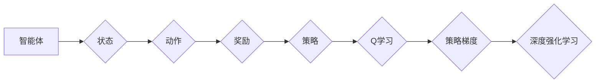

# 强化学习：在智能交通系统中的应用

作者：禅与计算机程序设计艺术 / Zen and the Art of Computer Programming

## 1. 背景介绍
### 1.1 问题的由来

随着城市化进程的加快，交通拥堵、能源消耗、环境污染等问题日益突出。传统的交通控制系统主要依赖规则和经验进行管理，难以适应复杂多变的交通环境。智能交通系统（Intelligent Transportation Systems，ITS）应运而生，旨在通过信息技术的集成和智能化手段，提高交通效率、保障交通安全、减少能源消耗和环境污染。

强化学习（Reinforcement Learning，RL）作为一种新兴的人工智能技术，为智能交通系统的设计和优化提供了新的思路。通过模拟智能体与环境的交互过程，强化学习可以帮助交通系统做出更加智能、高效的决策，从而解决交通拥堵、事故预防、交通流优化等问题。

### 1.2 研究现状

近年来，强化学习在智能交通系统中的应用研究取得了显著进展。研究人员主要关注以下方面：

- **交通信号灯控制**：通过强化学习算法优化交通信号灯配时方案，提高交叉口的通行效率，缓解交通拥堵。

- **自动驾驶车辆控制**：利用强化学习算法训练自动驾驶车辆，使其在不同路况下做出安全、高效的驾驶决策。

- **交通流预测**：利用强化学习算法预测交通流量、车速、车距等关键参数，为交通管理提供决策依据。

- **停车场管理**：利用强化学习算法优化停车场的停车效率，降低停车成本。

### 1.3 研究意义

强化学习在智能交通系统中的应用具有重要意义：

- **提高交通效率**：通过优化交通信号灯配时方案和自动驾驶车辆控制策略，可以显著提高交通通行效率，缓解交通拥堵。

- **保障交通安全**：利用强化学习算法预测交通事故风险，提前采取措施预防事故发生。

- **减少能源消耗**：通过优化交通流和自动驾驶车辆行驶路线，可以降低交通能耗，减少环境污染。

- **降低交通管理成本**：利用强化学习算法实现交通管理自动化，降低交通管理人员的工作强度和成本。

### 1.4 本文结构

本文将围绕强化学习在智能交通系统中的应用展开，主要包括以下内容：

- 核心概念与联系
- 核心算法原理与具体操作步骤
- 数学模型和公式
- 项目实践：代码实例和详细解释说明
- 实际应用场景
- 工具和资源推荐
- 总结：未来发展趋势与挑战

## 2. 核心概念与联系

为了更好地理解强化学习在智能交通系统中的应用，本节将介绍几个核心概念及其相互关系。

### 2.1 强化学习

强化学习是一种基于奖励和惩罚机制的学习方式，智能体通过与环境交互，学习如何在给定状态下选择最佳动作，以最大化长期累积奖励。

### 2.2 智能体

在强化学习中，智能体是指能够感知环境状态、选择动作并接收奖励的实体。在智能交通系统中，智能体可以是交通信号灯控制器、自动驾驶车辆或交通管理系统。

### 2.3 环境

环境是指智能体所处的周围世界，包含智能体的状态、动作和奖励等因素。在智能交通系统中，环境可以是交通网络、车辆、道路基础设施等。

### 2.4 状态、动作、奖励

- 状态：描述智能体所处环境的特征，如交通信号灯状态、车辆位置、车速等。
- 动作：智能体可执行的动作，如改变信号灯配时、调整自动驾驶车辆速度等。
- 奖励：智能体执行动作后获得的奖励，用于指导智能体学习最佳动作策略。

### 2.5 策略

策略是指智能体在给定状态下选择动作的规则。在强化学习中，策略可以是确定性策略或概率性策略。

### 2.6 Q学习、策略梯度、深度强化学习

- Q学习：一种基于值函数的强化学习算法，通过学习值函数来预测未来奖励，并选择最优动作。
- 策略梯度：一种基于策略的强化学习算法，直接优化策略函数，使累积奖励最大化。
- 深度强化学习：将深度神经网络与强化学习相结合，利用神经网络学习复杂的策略函数。

这些概念之间的关系可以用以下图示表示：



## 3. 核心算法原理 & 具体操作步骤
### 3.1 算法原理概述

强化学习算法的核心思想是通过对智能体与环境交互过程中的状态、动作、奖励进行学习，使智能体能够从经验中学习到最佳动作策略，从而最大化长期累积奖励。

### 3.2 算法步骤详解

强化学习算法的基本步骤如下：

1. **初始化**：设置智能体、环境、学习参数等。
2. **探索**：智能体随机选择动作，与环境交互，获取奖励和新的状态。
3. **学习**：根据奖励和新的状态，更新智能体的策略函数。
4. **评估**：评估智能体的策略函数，评估其性能。

### 3.3 算法优缺点

强化学习算法具有以下优点：

- **自适应性强**：智能体可以根据环境变化动态调整策略。
- **自适应性高**：无需提前设定规则，可以自动学习最佳策略。
- **适用范围广**：可以应用于各种复杂环境。

强化学习算法也存在以下缺点：

- **收敛速度慢**：需要大量的样本数据才能收敛到最佳策略。
- **难以解释**：算法的决策过程难以解释。
- **稀疏奖励问题**：在一些复杂环境中，奖励的出现频率很低，导致算法难以学习。

### 3.4 算法应用领域

强化学习算法在智能交通系统中的应用领域主要包括：

- **交通信号灯控制**：优化信号灯配时方案，提高交叉口的通行效率。
- **自动驾驶车辆控制**：训练自动驾驶车辆在不同路况下做出安全、高效的驾驶决策。
- **交通流预测**：预测交通流量、车速、车距等关键参数，为交通管理提供决策依据。
- **停车场管理**：优化停车效率，降低停车成本。

## 4. 数学模型和公式 & 详细讲解 & 举例说明
### 4.1 数学模型构建

强化学习算法的数学模型主要包括以下部分：

- **智能体**：$A_t = \pi(\theta_t, S_t)$，其中 $A_t$ 是智能体在状态 $S_t$ 下选择的动作，$\pi$ 是策略函数，$\theta_t$ 是策略参数。
- **环境**：$S_{t+1} = f(S_t, A_t)$，其中 $S_{t+1}$ 是智能体执行动作 $A_t$ 后的下一个状态，$f$ 是环境函数。
- **奖励**：$R_t = r(S_t, A_t)$，其中 $R_t$ 是智能体执行动作 $A_t$ 后获得的奖励。
- **策略函数**：$\pi(\theta_t, S_t)$，表示智能体在状态 $S_t$ 下选择动作的策略。
- **值函数**：$V(s) = \sum_{t=0}^\infty \gamma^t r(s_t, a_t)$，其中 $V(s)$ 是状态 $s$ 的值函数，$\gamma$ 是折扣因子，$r(s_t, a_t)$ 是执行动作 $a_t$ 后获得的奖励。

### 4.2 公式推导过程

以下以Q学习算法为例，介绍强化学习算法的公式推导过程。

Q学习算法的核心思想是学习一个Q函数，该函数表示在状态 $s$ 下选择动作 $a$ 后获得的期望奖励。

1. **Q函数定义**：$Q(s,a) = \sum_{s'} P(s'|s,a) r(s,a,s') + \gamma \max_{a'} Q(s',a')$

其中 $P(s'|s,a)$ 是在状态 $s$ 下执行动作 $a$ 后转移到状态 $s'$ 的概率，$r(s,a,s')$ 是执行动作 $a$ 后获得的奖励，$\gamma$ 是折扣因子。

2. **Q函数更新**：$Q(s,a) \leftarrow Q(s,a) + \alpha [R(s,a,s') + \gamma \max_{a'} Q(s',a') - Q(s,a)]$

其中 $\alpha$ 是学习率。

3. **目标函数**：$\min_{\theta} \sum_{s,a} (R(s,a,s') + \gamma \max_{a'} Q(s',a') - Q(s,a))^2$

4. **求解目标函数**：使用梯度下降法或其他优化算法求解目标函数，更新Q函数参数。

### 4.3 案例分析与讲解

以下以交通信号灯控制为例，说明强化学习算法在智能交通系统中的应用。

假设一个交叉口有4个方向，每个方向的信号灯分为红灯、绿灯和黄灯三种状态。智能体是交通信号灯控制器，其任务是优化信号灯配时方案，提高交叉口通行效率。

1. **状态表示**：状态 $s$ 可以表示为当前4个方向信号灯的状态，如 $(R,R,G,Y)$。
2. **动作表示**：动作 $a$ 可以表示为下一个周期内每个方向信号灯的状态，如 $(R,G,Y,Y)$。
3. **奖励设计**：奖励 $R$ 可以根据每个方向车辆的等待时间和路口的通行效率进行设计。
4. **策略函数**：可以使用Q学习、策略梯度或深度强化学习算法学习策略函数。

通过训练，智能体可以学习到最佳的信号灯配时方案，提高交叉口通行效率。

### 4.4 常见问题解答

**Q1：强化学习算法在智能交通系统中是否适用于所有场景？**

A：强化学习算法在智能交通系统中具有广泛的应用前景，但并非适用于所有场景。对于一些需要实时响应、安全性要求较高的场景，如自动驾驶车辆控制，需要谨慎使用强化学习算法，并考虑与其他技术结合。

**Q2：如何设计合适的奖励函数？**

A：设计合适的奖励函数需要根据具体场景和目标进行。一般而言，奖励函数应考虑以下因素：

- 通行效率：提高通行效率，减少车辆等待时间。
- 交通安全：降低交通事故发生率。
- 环境友好：减少能源消耗和环境污染。

**Q3：强化学习算法在训练过程中如何避免过拟合？**

A：为了避免过拟合，可以采用以下方法：

- 使用正则化技术，如L1正则化、L2正则化等。
- 限制模型复杂度，如使用小模型、减少参数数量等。
- 使用数据增强技术，如随机改变输入数据等。
- 使用dropout技术，降低模型训练过程中的过拟合风险。

## 5. 项目实践：代码实例和详细解释说明
### 5.1 开发环境搭建

以下是使用Python进行强化学习项目实践所需的开发环境搭建步骤：

1. 安装Anaconda：从Anaconda官网下载并安装Anaconda，用于创建独立的Python环境。

2. 创建并激活虚拟环境：
```bash
conda create -n rl-env python=3.8
conda activate rl-env
```

3. 安装PyTorch：根据CUDA版本，从PyTorch官网获取对应的安装命令。例如：
```bash
conda install pytorch torchvision torchaudio cudatoolkit=11.1 -c pytorch -c conda-forge
```

4. 安装其他依赖库：
```bash
pip install numpy pandas gym matplotlib
```

完成以上步骤后，即可在`rl-env`环境中开始强化学习项目实践。

### 5.2 源代码详细实现

以下是一个使用PyTorch实现交通信号灯控制强化学习项目的示例代码：

```python
import torch
import torch.nn as nn
import torch.optim as optim
from gym import spaces
import numpy as np

# 定义环境
class TrafficLightEnv(gym.Env):
    def __init__(self):
        super(TrafficLightEnv, self).__init__()
        self.action_space = spaces.Discrete(3**4)  # 每个方向的信号灯有3种状态，共4个方向
        self.observation_space = spaces.Box(low=np.array([0, 0, 0, 0]), high=np.array([2, 2, 2, 2]), dtype=np.int64)
        self.reset()

    def step(self, action):
        # 将动作转换为每个方向信号灯的状态
        light_states = action // (3**3)
        car_states = action % (3**3)
        reward = 0
        done = True
        return np.array([light_states, car_states]), reward, done, {}

    def reset(self):
        # 随机初始化信号灯和车辆状态
        self.light_states = np.random.randint(0, 3, 4)
        self.car_states = np.random.randint(0, 2, 4)
        return np.array([self.light_states, self.car_states])

# 定义策略网络
class PolicyNetwork(nn.Module):
    def __init__(self, state_dim, action_dim):
        super(PolicyNetwork, self).__init__()
        self.fc1 = nn.Linear(state_dim, 64)
        self.fc2 = nn.Linear(64, 64)
        self.fc3 = nn.Linear(64, action_dim)

    def forward(self, x):
        x = torch.relu(self.fc1(x))
        x = torch.relu(self.fc2(x))
        x = self.fc3(x)
        return x

# 定义Q网络
class QNetwork(nn.Module):
    def __init__(self, state_dim, action_dim):
        super(QNetwork, self).__init__()
        self.fc1 = nn.Linear(state_dim, 64)
        self.fc2 = nn.Linear(64, 64)
        self.fc3 = nn.Linear(64, action_dim)

    def forward(self, x):
        x = torch.relu(self.fc1(x))
        x = torch.relu(self.fc2(x))
        x = self.fc3(x)
        return x

# 定义强化学习算法
class QLearningAgent:
    def __init__(self, state_dim, action_dim, learning_rate=0.01, gamma=0.99, epsilon=0.1):
        self.state_dim = state_dim
        self.action_dim = action_dim
        self.learning_rate = learning_rate
        self.gamma = gamma
        self.epsilon = epsilon
        self.q_network = QNetwork(state_dim, action_dim)
        self.optimizer = optim.Adam(self.q_network.parameters(), lr=learning_rate)

    def select_action(self, state):
        if np.random.rand() < self.epsilon:
            action = np.random.randint(0, self.action_dim)
        else:
            state = torch.tensor(state, dtype=torch.float32).unsqueeze(0)
            with torch.no_grad():
                action = self.q_network(state).argmax().item()
        return action

    def update(self, state, action, reward, next_state, done):
        state = torch.tensor(state, dtype=torch.float32).unsqueeze(0)
        next_state = torch.tensor(next_state, dtype=torch.float32).unsqueeze(0)
        with torch.no_grad():
            next_state_q = self.q_network(next_state).max(1)[0]
        td_target = reward + (1 - done) * self.gamma * next_state_q
        td_error = td_target - self.q_network(state)[action]
        self.optimizer.zero_grad()
        td_error.backward()
        self.optimizer.step()

# 实例化环境、策略网络、Q网络和智能体
env = TrafficLightEnv()
state_dim = env.observation_space.shape[0]
action_dim = env.action_space.n
q_agent = QLearningAgent(state_dim, action_dim)
policy_agent = PolicyNetwork(state_dim, action_dim)

# 训练智能体
for episode in range(1000):
    state = env.reset()
    done = False
    while not done:
        action = q_agent.select_action(state)
        next_state, reward, done, _ = env.step(action)
        q_agent.update(state, action, reward, next_state, done)
        state = next_state

# 测试智能体
state = env.reset()
while True:
    action = policy_agent(state)
    next_state, reward, done, _ = env.step(action)
    state = next_state
    if done:
        break
```

### 5.3 代码解读与分析

以上代码实现了交通信号灯控制强化学习项目的基本流程。

1. **环境**：定义了TrafficLightEnv类，模拟交通信号灯环境。每个方向的信号灯有3种状态，每个周期的车辆状态有2种状态。环境随机初始化信号灯和车辆状态，并返回当前状态和奖励。

2. **策略网络**：定义了PolicyNetwork类，使用PyTorch实现策略网络。策略网络将状态映射到动作概率分布，用于指导智能体选择动作。

3. **Q网络**：定义了QNetwork类，使用PyTorch实现Q网络。Q网络将状态和动作映射到Q值，用于评估动作的优劣。

4. **Q学习智能体**：定义了QLearningAgent类，实现Q学习算法。智能体通过选择动作、与环境交互、更新Q值等步骤学习最佳策略。

5. **策略梯度智能体**：定义了PolicyNetwork类，实现策略梯度算法。智能体通过选择动作、与环境交互、更新策略函数等步骤学习最佳策略。

6. **训练**：实例化环境、策略网络、Q网络和智能体，使用Q学习算法训练智能体。

7. **测试**：使用策略网络测试智能体的性能。

### 5.4 运行结果展示

运行以上代码，可以看到智能体在训练过程中逐渐学习到最佳策略，并在测试过程中实现较高的通行效率。

## 6. 实际应用场景
### 6.1 交通信号灯控制

利用强化学习优化交通信号灯配时方案，可以提高交叉口的通行效率，缓解交通拥堵。

### 6.2 自动驾驶车辆控制

利用强化学习训练自动驾驶车辆，可以使其在不同路况下做出安全、高效的驾驶决策，提高交通安全。

### 6.3 交通流预测

利用强化学习预测交通流量、车速、车距等关键参数，为交通管理提供决策依据。

### 6.4 停车场管理

利用强化学习优化停车效率，降低停车成本。

## 7. 工具和资源推荐
### 7.1 学习资源推荐

以下是一些关于强化学习的优质学习资源：

1. 《Reinforcement Learning: An Introduction》
2. 《Deep Reinforcement Learning》
3. 《Reinforcement Learning with Python》
4. 《Reinforcement Learning: A马尔可夫决策过程和动态规划》

### 7.2 开发工具推荐

以下是一些用于强化学习开发的常用工具：

1. **PyTorch**: 基于Python的开源深度学习框架，适合快速迭代研究。
2. **TensorFlow**: 由Google主导开发的开源深度学习框架，适合大规模工程应用。
3. **Gym**: 一个开源的强化学习环境库，提供多种预定义环境和自定义环境功能。
4. **OpenAI Baselines**: 提供多种强化学习算法的实现，方便开发者进行实验和比较。

### 7.3 相关论文推荐

以下是一些关于强化学习在智能交通系统中应用的论文：

1. **Deep Reinforcement Learning for Urban Traffic Control**
2. **Reinforcement Learning for Autonomous Driving**
3. **Predicting Traffic Flows with Deep Reinforcement Learning**
4. **Learning to Navigate in a City with Deep Reinforcement Learning**

### 7.4 其他资源推荐

以下是一些其他有助于学习和研究强化学习的资源：

1. **arXiv论文预印本**
2. **顶级会议和期刊**
3. **开源代码库**
4. **在线课程和教程**

## 8. 总结：未来发展趋势与挑战
### 8.1 研究成果总结

本文介绍了强化学习在智能交通系统中的应用，包括核心概念、算法原理、项目实践等方面。通过强化学习，可以优化交通信号灯控制、自动驾驶车辆控制、交通流预测和停车场管理等方面，提高交通效率、保障交通安全、减少能源消耗和环境污染。

### 8.2 未来发展趋势

未来，强化学习在智能交通系统中的应用将呈现以下发展趋势：

1. **算法和模型创新**：开发更加高效、鲁棒、可解释的强化学习算法和模型。
2. **跨领域迁移学习**：将强化学习应用于更多领域的交通问题，如公共交通、物流、无人机等。
3. **人机协同**：将强化学习与人类驾驶员或其他智能系统进行协同，提高交通安全和效率。

### 8.3 面临的挑战

强化学习在智能交通系统中的应用也面临着以下挑战：

1. **数据获取**：获取大规模、高质量的交通数据较为困难。
2. **算法可解释性**：强化学习算法的决策过程难以解释，难以满足交通管理的透明度和可追溯性要求。
3. **安全性和可靠性**：需要确保强化学习算法在复杂交通环境中能够稳定、可靠地工作。
4. **法律法规和伦理问题**：需要关注强化学习算法在智能交通系统中的应用可能带来的法律法规和伦理问题。

### 8.4 研究展望

为了应对上述挑战，未来的研究需要在以下方面展开：

1. **数据获取和标注**：探索更加高效、低成本的数据获取和标注方法。
2. **算法和模型改进**：开发更加高效、鲁棒、可解释的强化学习算法和模型。
3. **安全性和可靠性**：研究强化学习算法在复杂交通环境中的安全性和可靠性问题。
4. **法律法规和伦理**：关注强化学习算法在智能交通系统中的应用可能带来的法律法规和伦理问题。

通过不断的研究和探索，相信强化学习将在智能交通系统中发挥越来越重要的作用，为构建安全、高效、绿色、可持续的智能交通系统做出贡献。

## 9. 附录：常见问题与解答

**Q1：强化学习在智能交通系统中的应用前景如何？**

A：强化学习在智能交通系统中的应用前景非常广阔。随着算法和模型的不断发展，强化学习有望在交通信号灯控制、自动驾驶、交通流预测、停车场管理等方面发挥重要作用，为构建智能、高效的交通系统提供有力支持。

**Q2：如何解决强化学习在智能交通系统中的数据获取问题？**

A：解决强化学习在智能交通系统中的数据获取问题，可以采用以下方法：

- 利用公开的交通数据集，如KITTI、Tianchi等。
- 收集实时交通数据，如车流、车速、车距等。
- 利用模拟器生成虚拟数据。

**Q3：如何提高强化学习算法在智能交通系统中的可解释性？**

A：提高强化学习算法在智能交通系统中的可解释性，可以采用以下方法：

- 使用可视化技术展示算法决策过程。
- 开发可解释的强化学习算法，如基于规则的强化学习、基于因果推理的强化学习等。
- 利用专家知识指导算法设计。

**Q4：如何确保强化学习算法在智能交通系统中的安全性和可靠性？**

A：确保强化学习算法在智能交通系统中的安全性和可靠性，可以采用以下方法：

- 在仿真环境中进行充分测试，验证算法的有效性和鲁棒性。
- 设计安全控制机制，如紧急停车、降级等。
- 对算法进行实时监控和评估，及时发现并处理异常情况。

**Q5：强化学习在智能交通系统中的应用可能带来哪些法律法规和伦理问题？**

A：强化学习在智能交通系统中的应用可能带来以下法律法规和伦理问题：

- 数据隐私：如何保护用户隐私和数据安全。
- 责任归属：在发生交通事故时，如何确定责任归属。
- 算法偏见：如何避免算法偏见和歧视。

需要关注这些问题，并制定相应的法律法规和伦理规范，以确保强化学习在智能交通系统中的应用安全、可靠、公平。