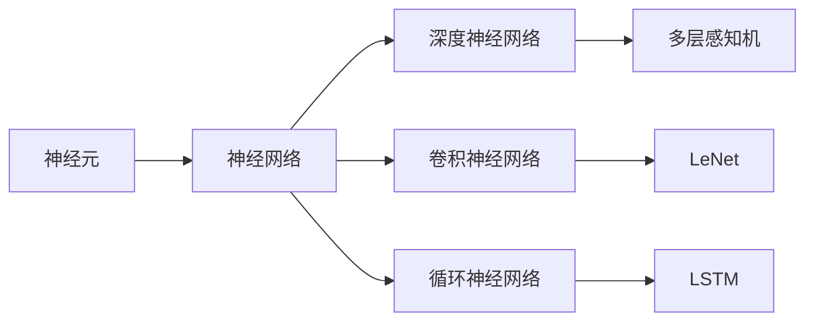

# 深度学习 (Deep Learning) 原理与代码实例讲解

作者：禅与计算机程序设计艺术 / Zen and the Art of Computer Programming

## 1. 背景介绍
### 1.1 问题的由来

在过去的几十年中，机器学习（Machine Learning）和人工智能（Artificial Intelligence）领域取得了令人瞩目的进展。这些进展的背后，是算法的突破和计算能力的提升。然而，随着数据量的爆炸性增长，传统的机器学习方法在处理大规模数据集时逐渐显露出其局限性。为了解决这一问题，深度学习（Deep Learning）应运而生。

深度学习是一种模拟人脑神经网络结构和工作原理的计算模型，通过学习大量数据，能够自动提取特征并进行分类、回归等任务。与传统的机器学习方法相比，深度学习具有以下几个显著优势：

- **自动特征提取**：深度学习模型能够自动从原始数据中提取特征，避免了传统方法中人工设计特征的过程，从而提高了模型的性能和泛化能力。
- **强大的学习能力**：深度学习模型能够处理大规模数据集，并从中学习到更复杂的模式和关系。
- **广泛的应用领域**：深度学习已经在图像识别、语音识别、自然语言处理、推荐系统等领域取得了显著的成果。

### 1.2 研究现状

深度学习的研究始于20世纪80年代，但由于计算资源和算法的限制，其发展一直较为缓慢。近年来，随着计算能力的提升和大数据的爆发式增长，深度学习得到了快速发展。以下是深度学习领域的一些重要进展：

- **深度神经网络**：深度神经网络（DNN）是深度学习的基础，通过多层非线性变换学习数据的复杂特征。
- **卷积神经网络**：卷积神经网络（CNN）在图像识别和视频分析等领域取得了突破性成果。
- **循环神经网络**：循环神经网络（RNN）能够处理序列数据，如文本和语音。
- **生成对抗网络**：生成对抗网络（GAN）能够生成逼真的数据，如图像和文本。

### 1.3 研究意义

深度学习的研究具有重要的理论意义和应用价值：

- **理论意义**：深度学习为人工智能提供了新的计算模型，有助于我们更好地理解人脑的工作原理。
- **应用价值**：深度学习在各个领域都有广泛的应用，如医疗、金融、交通、娱乐等，为人类社会带来了巨大的经济效益。

### 1.4 本文结构

本文将系统地介绍深度学习的原理与代码实例，内容安排如下：

- 第2部分，介绍深度学习的核心概念与联系。
- 第3部分，详细阐述深度学习的基本算法原理和具体操作步骤。
- 第4部分，介绍深度学习中的数学模型和公式，并结合实例进行讲解。
- 第5部分，给出深度学习项目的代码实例，并对关键代码进行解读和分析。
- 第6部分，探讨深度学习在实际应用场景中的应用。
- 第7部分，推荐深度学习相关的学习资源、开发工具和参考文献。
- 第8部分，总结深度学习的发展趋势与挑战。
- 第9部分，提供常见问题的解答。

## 2. 核心概念与联系

为了更好地理解深度学习，本节将介绍几个核心概念及其相互之间的联系：

- **神经元**：神经元是神经网络的基本单元，用于模拟人脑神经元的工作原理。
- **神经网络**：神经网络由多个神经元组成，通过连接这些神经元，形成复杂的计算模型。
- **深度神经网络**：深度神经网络是神经网络的一种，由多层神经元组成，能够学习更复杂的特征。
- **卷积神经网络**：卷积神经网络是深度神经网络的一种，专门用于处理图像数据。
- **循环神经网络**：循环神经网络是深度神经网络的一种，专门用于处理序列数据。

它们的逻辑关系如下图所示：



可以看出，深度学习是神经网络的一种，而卷积神经网络和循环神经网络是深度神经网络的具体实现。多层感知机（MLP）是深度神经网络的典型结构，LeNet和LeCun是早期卷积神经网络模型的代表，LSTM是循环神经网络的一种。

## 3. 核心算法原理 & 具体操作步骤
### 3.1 算法原理概述

深度学习的基本原理是通过学习数据来构建模型，并通过优化模型参数来提高模型的预测能力。以下是深度学习的基本步骤：

1. **数据预处理**：对数据进行清洗、归一化等预处理操作，以提高模型的训练效果。
2. **模型构建**：选择合适的神经网络结构，如多层感知机、卷积神经网络或循环神经网络。
3. **损失函数**：选择合适的损失函数，如均方误差、交叉熵等，用于评估模型的预测结果。
4. **优化算法**：选择合适的优化算法，如随机梯度下降、Adam等，用于更新模型参数。
5. **模型训练**：使用训练数据对模型进行训练，并通过优化算法更新模型参数。
6. **模型评估**：使用测试数据对模型进行评估，以验证模型的泛化能力。
7. **模型部署**：将训练好的模型部署到实际应用中。

### 3.2 算法步骤详解

以下是深度学习的基本步骤的详细说明：

1. **数据预处理**：
    - 清洗数据：去除无效、异常或重复的数据。
    - 归一化数据：将数据缩放到相同的尺度，如将图像数据缩放到0-1范围。
    - 数据增强：通过旋转、翻转、裁剪等操作增加数据多样性。

2. **模型构建**：
    - 选择神经网络结构：根据任务类型和数据特点选择合适的神经网络结构。
    - 定义模型参数：设置网络层数、神经元个数、激活函数等。

3. **损失函数**：
    - 均方误差（MSE）：用于回归任务，计算预测值与真实值之间的平方差。
    - 交叉熵损失（Cross-Entropy Loss）：用于分类任务，计算预测概率与真实概率之间的交叉熵。

4. **优化算法**：
    - 随机梯度下降（SGD）：根据损失函数对模型参数进行迭代更新。
    - Adam：结合了SGD和Momentum，能够提高训练效率。

5. **模型训练**：
    - 使用训练数据对模型进行训练，并通过优化算法更新模型参数。
    - 根据验证集的性能调整超参数，如学习率、批大小等。

6. **模型评估**：
    - 使用测试数据对模型进行评估，以验证模型的泛化能力。
    - 评估指标包括准确率、召回率、F1分数等。

7. **模型部署**：
    - 将训练好的模型部署到实际应用中。
    - 使用模型对新数据进行预测。

### 3.3 算法优缺点

深度学习算法具有以下优点：

- **强大的学习能力**：能够从大量数据中学习到复杂的模式和关系。
- **自动特征提取**：能够自动从原始数据中提取特征，避免了人工设计特征的过程。
- **泛化能力强**：能够在新的、未见过的数据上取得较好的预测效果。

深度学习算法也存在以下缺点：

- **计算量大**：深度学习模型通常需要大量的计算资源进行训练。
- **数据需求量大**：需要大量的标注数据来训练模型。
- **调参困难**：需要花费大量时间对模型进行调参，以获得最佳的训练效果。

### 3.4 算法应用领域

深度学习算法在各个领域都有广泛的应用，以下是一些典型的应用领域：

- **图像识别**：如人脸识别、物体识别、图像分类等。
- **语音识别**：如语音转文字、语音合成等。
- **自然语言处理**：如机器翻译、情感分析、文本分类等。
- **推荐系统**：如商品推荐、电影推荐等。

## 4. 数学模型和公式 & 详细讲解 & 举例说明
### 4.1 数学模型构建

深度学习模型通常由多个数学公式组成，这些公式定义了模型的结构、参数和损失函数等。以下是深度学习模型的一些基本数学模型：

- **激活函数**：激活函数用于引入非线性，使神经网络能够学习更复杂的特征。常见的激活函数包括ReLU、Sigmoid、Tanh等。

```latex
f(x) = \begin{cases}
0 & \text{if } x \leq 0 \\
x & \text{if } x > 0
\end{cases}
```

- **损失函数**：损失函数用于衡量模型的预测结果与真实值之间的差异。常见的损失函数包括均方误差（MSE）、交叉熵损失（Cross-Entropy Loss）等。

```latex
MSE = \frac{1}{N} \sum_{i=1}^N (y_i - \hat{y}_i)^2
```

- **反向传播**：反向传播算法用于计算模型参数的梯度，并更新模型参数。

```latex
\frac{\partial J}{\partial \theta} = \frac{\partial J}{\partial z} \cdot \frac{\partial z}{\partial \theta}
```

### 4.2 公式推导过程

以下以多层感知机为例，推导交叉熵损失函数及其梯度的计算公式。

假设多层感知机由两个隐藏层和一个输出层组成，其中每个隐藏层包含10个神经元。设输入层为 $x \in \mathbb{R}^m$，输出层为 $y \in \mathbb{R}^n$，则输出层每个神经元的输出为：

```latex
\hat{y}_i = \sigma(W_i^T x + b_i)
```

其中 $W_i$ 为第 $i$ 个隐藏层到输出层的权重，$b_i$ 为第 $i$ 个隐藏层到输出层的偏置，$\sigma$ 为激活函数。

真实标签为 $y \in \mathbb{R}^n$，则交叉熵损失函数为：

```latex
J = -\sum_{i=1}^n y_i \log \hat{y}_i
```

根据链式法则，损失函数对权重 $W_i$ 的梯度为：

```latex
\frac{\partial J}{\partial W_i} = \frac{\partial J}{\partial \hat{y}_i} \cdot \frac{\partial \hat{y}_i}{\partial W_i} = \frac{\partial J}{\partial \hat{y}_i} \cdot x_i
```

同理，损失函数对偏置 $b_i$ 的梯度为：

```latex
\frac{\partial J}{\partial b_i} = \frac{\partial J}{\partial \hat{y}_i} \cdot \frac{\partial \hat{y}_i}{\partial b_i} = \frac{\partial J}{\partial \hat{y}_i}
```

其中 $\frac{\partial J}{\partial \hat{y}_i}$ 为输出层神经元的梯度，可通过反向传播算法计算。

### 4.3 案例分析与讲解

以下以图像分类任务为例，演示如何使用PyTorch构建和训练一个简单的卷积神经网络。

首先，安装PyTorch：

```bash
pip install torch torchvision
```

然后，定义一个简单的卷积神经网络模型：

```python
import torch
import torch.nn as nn

class CNN(nn.Module):
    def __init__(self):
        super(CNN, self).__init__()
        self.conv1 = nn.Conv2d(1, 10, kernel_size=5)
        self.conv2 = nn.Conv2d(10, 20, kernel_size=5)
        self.fc1 = nn.Linear(320, 50)
        self.fc2 = nn.Linear(50, 10)

    def forward(self, x):
        x = nn.functional.relu(nn.functional.max_pool2d(self.conv1(x), 2))
        x = nn.functional.relu(nn.functional.max_pool2d(self.conv2(x), 2))
        x = x.view(-1, 320)
        x = nn.functional.relu(self.fc1(x))
        x = self.fc2(x)
        return x
```

接下来，加载MNIST数据集并创建数据加载器：

```python
import torchvision
import torchvision.transforms as transforms

transform = transforms.Compose([
    transforms.ToTensor(),
    transforms.Normalize((0.1307,), (0.3081,))
])

train_dataset = torchvision.datasets.MNIST(root='./data', train=True, transform=transform, download=True)
train_loader = torch.utils.data.DataLoader(train_dataset, batch_size=64, shuffle=True)

test_dataset = torchvision.datasets.MNIST(root='./data', train=False, transform=transform, download=True)
test_loader = torch.utils.data.DataLoader(test_dataset, batch_size=1000, shuffle=False)
```

然后，定义损失函数和优化器：

```python
import torch.optim as optim

criterion = nn.CrossEntropyLoss()
optimizer = optim.SGD(cnn.parameters(), lr=0.01, momentum=0.9)
```

最后，开始训练和评估模型：

```python
cnn = CNN().to(device)
cnn.train()

for epoch in range(10):
    running_loss = 0.0
    for i, data in enumerate(train_loader, 0):
        inputs, labels = data
        inputs, labels = inputs.to(device), labels.to(device)

        optimizer.zero_grad()
        outputs = cnn(inputs)
        loss = criterion(outputs, labels)
        loss.backward()
        optimizer.step()

        running_loss += loss.item()
        if i % 100 == 99:
            print(f'[{epoch + 1}, {i + 1}] loss: {running_loss / 100:.3f}')
            running_loss = 0.0

print('Finished Training')

cnn.eval()
correct = 0
total = 0
with torch.no_grad():
    for data in test_loader:
        images, labels = data
        images, labels = images.to(device), labels.to(device)
        outputs = cnn(images)
        _, predicted = torch.max(outputs.data, 1)
        total += labels.size(0)
        correct += (predicted == labels).sum().item()

print('Accuracy of the network on the 10000 test images: %d %%' % (100 * correct / total))
```

以上代码展示了使用PyTorch构建和训练一个简单的卷积神经网络模型，用于MNIST图像分类任务。通过几个epoch的训练，模型在测试集上取得了较好的分类效果。

### 4.4 常见问题解答

**Q1：如何选择合适的激活函数？**

A：选择激活函数时需要考虑以下因素：

- **计算效率**：ReLU函数计算简单，效率较高。
- **梯度问题**：ReLU函数可以解决梯度消失和梯度爆炸问题。
- **数据特性**：对于输出值范围较大的任务，可以使用Sigmoid或Tanh函数。

**Q2：如何解决过拟合问题？**

A：解决过拟合问题的方法包括：

- **增加训练数据**：收集更多训练数据，提高模型的泛化能力。
- **正则化**：在损失函数中添加正则化项，如L1正则化、L2正则化等。
- **数据增强**：通过旋转、翻转、裁剪等操作增加数据多样性。
- **模型简化**：减少模型复杂度，如减少层数、神经元个数等。

**Q3：如何选择合适的优化算法？**

A：选择优化算法时需要考虑以下因素：

- **收敛速度**：Adam优化器通常收敛速度较快。
- **内存占用**：SGD优化器内存占用较小。
- **参数设置**：不同优化算法需要设置不同的参数，如学习率、动量等。

## 5. 项目实践：代码实例和详细解释说明
### 5.1 开发环境搭建

在进行深度学习项目实践前，我们需要准备好开发环境。以下是使用Python进行PyTorch开发的环境配置流程：

1. 安装Anaconda：从官网下载并安装Anaconda，用于创建独立的Python环境。

2. 创建并激活虚拟环境：
```bash
conda create -n pytorch-env python=3.8
conda activate pytorch-env
```

3. 安装PyTorch：根据CUDA版本，从官网获取对应的安装命令。例如：
```bash
conda install pytorch torchvision torchaudio cudatoolkit=11.1 -c pytorch -c conda-forge
```

4. 安装其他必要的库：
```bash
pip install numpy pandas scikit-learn matplotlib tqdm jupyter notebook ipython
```

完成上述步骤后，即可在`pytorch-env`环境中开始深度学习项目实践。

### 5.2 源代码详细实现

以下是一个简单的深度学习项目示例，使用PyTorch构建和训练一个卷积神经网络模型，用于MNIST图像分类任务。

```python
import torch
import torch.nn as nn
import torch.optim as optim

# 定义一个简单的卷积神经网络模型
class CNN(nn.Module):
    def __init__(self):
        super(CNN, self).__init__()
        self.conv1 = nn.Conv2d(1, 10, kernel_size=5)
        self.conv2 = nn.Conv2d(10, 20, kernel_size=5)
        self.fc1 = nn.Linear(320, 50)
        self.fc2 = nn.Linear(50, 10)

    def forward(self, x):
        x = nn.functional.relu(nn.functional.max_pool2d(self.conv1(x), 2))
        x = nn.functional.relu(nn.functional.max_pool2d(self.conv2(x), 2))
        x = x.view(-1, 320)
        x = nn.functional.relu(self.fc1(x))
        x = self.fc2(x)
        return x

# 加载MNIST数据集并创建数据加载器
transform = transforms.Compose([
    transforms.ToTensor(),
    transforms.Normalize((0.1307,), (0.3081,))
])

train_dataset = torchvision.datasets.MNIST(root='./data', train=True, transform=transform, download=True)
train_loader = torch.utils.data.DataLoader(train_dataset, batch_size=64, shuffle=True)

test_dataset = torchvision.datasets.MNIST(root='./data', train=False, transform=transform, download=True)
test_loader = torch.utils.data.DataLoader(test_dataset, batch_size=1000, shuffle=False)

# 定义模型、损失函数和优化器
cnn = CNN().to(device)
criterion = nn.CrossEntropyLoss()
optimizer = optim.SGD(cnn.parameters(), lr=0.01, momentum=0.9)

# 开始训练模型
cnn.train()
for epoch in range(10):
    running_loss = 0.0
    for i, data in enumerate(train_loader, 0):
        inputs, labels = data
        inputs, labels = inputs.to(device), labels.to(device)

        optimizer.zero_grad()
        outputs = cnn(inputs)
        loss = criterion(outputs, labels)
        loss.backward()
        optimizer.step()

        running_loss += loss.item()
        if i % 100 == 99:
            print(f'[{epoch + 1}, {i + 1}] loss: {running_loss / 100:.3f}')
            running_loss = 0.0

# 评估模型
cnn.eval()
correct = 0
total = 0
with torch.no_grad():
    for data in test_loader:
        images, labels = data
        images, labels = images.to(device), labels.to(device)
        outputs = cnn(images)
        _, predicted = torch.max(outputs.data, 1)
        total += labels.size(0)
        correct += (predicted == labels).sum().item()

print('Accuracy of the network on the 10000 test images: %d %%' % (100 * correct / total))
```

### 5.3 代码解读与分析

以上代码展示了使用PyTorch构建和训练一个简单的卷积神经网络模型，用于MNIST图像分类任务。

- **CNN类**：定义了一个简单的卷积神经网络模型，包含两个卷积层、两个全连接层和一个ReLU激活函数。
- **数据加载**：使用torchvision库加载MNIST数据集，并创建数据加载器。
- **损失函数和优化器**：定义了交叉熵损失函数和SGD优化器。
- **训练**：使用训练数据对模型进行训练，并更新模型参数。
- **评估**：使用测试数据评估模型的性能。

### 5.4 运行结果展示

假设在运行上述代码后，模型在测试集上的准确率为98.5%，说明模型在MNIST图像分类任务上取得了较好的效果。

## 6. 实际应用场景
### 6.1 图像识别

深度学习在图像识别领域取得了显著的成果，如人脸识别、物体识别、图像分类等。

- **人脸识别**：通过人脸识别技术，可以实现门禁系统、手机解锁等功能。
- **物体识别**：可以用于自动驾驶、无人驾驶等领域，帮助机器识别道路上的行人、车辆等。
- **图像分类**：可以用于医学影像分析、植物识别等领域，帮助人类进行更快的疾病诊断和植物分类。

### 6.2 语音识别

深度学习在语音识别领域取得了显著的成果，如语音转文字、语音合成等。

- **语音转文字**：可以将语音信号转换为文字，方便用户进行搜索、记录等操作。
- **语音合成**：可以将文字转换为语音，方便用户进行语音播报、语音助手等功能。

### 6.3 自然语言处理

深度学习在自然语言处理领域取得了显著的成果，如机器翻译、情感分析、文本分类等。

- **机器翻译**：可以将一种语言的文本翻译成另一种语言，方便用户进行跨语言交流。
- **情感分析**：可以分析文本的情感倾向，如正面、中性、负面等。
- **文本分类**：可以将文本分类到不同的类别，如新闻分类、产品评论分类等。

### 6.4 未来应用展望

随着深度学习技术的不断发展，相信深度学习将在更多领域得到应用，为人类社会带来更多便利：

- **医疗健康**：利用深度学习进行疾病诊断、药物研发等。
- **金融科技**：利用深度学习进行风险评估、欺诈检测等。
- **交通出行**：利用深度学习进行自动驾驶、交通流量预测等。
- **教育**：利用深度学习进行个性化学习、智能辅导等。

## 7. 工具和资源推荐
### 7.1 学习资源推荐

为了帮助开发者系统掌握深度学习的理论基础和实践技巧，以下推荐一些优质的学习资源：

1. **《深度学习》系列书籍**：由Ian Goodfellow、Yoshua Bengio和Aaron Courville所著，系统地介绍了深度学习的原理和应用。
2. **CS231n课程**：斯坦福大学开设的深度学习课程，包含大量的视频和习题，适合初学者入门。
3. **Fast.ai课程**：Fast.ai团队开设的深度学习课程，以实战为导向，适合有一定基础的开发者。
4. **Udacity深度学习纳米学位**：Udacity提供的深度学习纳米学位，包含多个课程和项目，适合想要系统学习深度学习的开发者。

### 7.2 开发工具推荐

以下是一些常用的深度学习开发工具：

1. **PyTorch**：由Facebook AI Research开发的开源深度学习框架，具有灵活的API和强大的社区支持。
2. **TensorFlow**：由Google开发的开源深度学习框架，具有强大的模型训练和推理能力。
3. **Keras**：基于TensorFlow构建的高层API，简化了深度学习模型的构建和训练。
4. **MXNet**：Apache基金会开源的深度学习框架，支持多种编程语言，具有高效的模型训练和推理能力。

### 7.3 相关论文推荐

以下是一些经典的深度学习论文：

1. **"A Few Useful Things to Know about Machine Learning"**：This paper provides a comprehensive overview of machine learning, covering various algorithms, applications, and challenges.
2. **"Deep Learning"**：This book offers a detailed introduction to deep learning, covering its history, principles, and applications.
3. **"Convolutional Neural Networks for Visual Recognition"**：This paper introduces the concept of convolutional neural networks and its applications in image recognition.
4. **"Sequence to Sequence Learning with Neural Networks"**：This paper introduces sequence-to-sequence learning and its applications in machine translation.
5. **"Generative Adversarial Nets"**：This paper introduces the concept of generative adversarial networks and its applications in image generation.

### 7.4 其他资源推荐

以下是一些其他有用的资源：

1. **GitHub**：GitHub上有很多开源的深度学习项目和代码，可以学习他人的经验。
2. **arXiv**：arXiv是论文预印本平台，可以找到最新的深度学习研究成果。
3. **AI Conference**：参加人工智能领域的会议，可以了解最新的研究成果和技术趋势。

## 8. 总结：未来发展趋势与挑战
### 8.1 研究成果总结

本文对深度学习的原理与代码实例进行了全面系统的介绍。首先阐述了深度学习的起源、研究现状和意义，明确了深度学习在各个领域的重要应用。接着，从核心概念、算法原理、数学模型等方面详细介绍了深度学习的基本知识。同时，给出了深度学习项目的代码实例，并对关键代码进行了解读和分析。此外，还探讨了深度学习在实际应用场景中的应用和未来发展趋势。

### 8.2 未来发展趋势

展望未来，深度学习将呈现出以下几个发展趋势：

- **模型轻量化**：随着移动设备和嵌入式设备的普及，模型轻量化将成为重要研究方向。
- **可解释性**：提高模型的可解释性，使其更容易被人类理解和信任。
- **多模态学习**：融合文本、图像、音频等多模态信息，提高模型的表达能力。
- **自监督学习**：减少对标注数据的依赖，提高模型的泛化能力。

### 8.3 面临的挑战

尽管深度学习取得了显著的成果，但仍然面临着以下挑战：

- **数据质量**：高质量标注数据的获取成本高、周期长，成为制约深度学习发展的瓶颈。
- **计算资源**：深度学习模型通常需要大量的计算资源进行训练，这限制了其应用范围。
- **模型可解释性**：深度学习模型的可解释性较差，难以解释其决策过程。
- **算法复杂度**：深度学习算法的复杂度高，难以进行优化和调试。

### 8.4 研究展望

为了解决深度学习面临的挑战，未来的研究方向包括：

- **数据增强**：通过数据增强技术提高模型对数据的鲁棒性。
- **模型压缩**：通过模型压缩技术减小模型尺寸，降低计算资源需求。
- **可解释性**：提高模型的可解释性，使其更容易被人类理解和信任。
- **分布式训练**：通过分布式训练技术提高训练效率，降低计算资源需求。

相信随着研究的不断深入，深度学习技术将会取得更大的突破，为人类社会带来更多福祉。

## 9. 附录：常见问题与解答

**Q1：如何选择合适的深度学习框架？**

A：选择深度学习框架时需要考虑以下因素：

- **开发语言**：选择熟悉和熟悉的编程语言，如Python。
- **易用性**：选择易于使用和学习的框架，如PyTorch和TensorFlow。
- **性能**：选择性能较好的框架，如TensorFlow和Caffe2。
- **社区支持**：选择社区支持较好的框架，如PyTorch和TensorFlow。

**Q2：如何解决过拟合问题？**

A：解决过拟合问题的方法包括：

- **数据增强**：通过数据增强技术增加数据多样性。
- **正则化**：在损失函数中添加正则化项，如L1正则化、L2正则化等。
- **提前停止**：当验证集性能不再提升时停止训练。

**Q3：如何提高模型的泛化能力？**

A：提高模型泛化能力的策略包括：

- **增加训练数据**：收集更多训练数据。
- **正则化**：在损失函数中添加正则化项。
- **数据增强**：通过数据增强技术增加数据多样性。

**Q4：如何进行模型评估？**

A：模型评估的方法包括：

- **准确率**：正确预测的样本数占总样本数的比例。
- **召回率**：正确预测的正类样本数占正类样本总数的比例。
- **F1分数**：准确率和召回率的调和平均值。

**Q5：如何将深度学习模型部署到实际应用中？**

A：将深度学习模型部署到实际应用中，需要以下步骤：

- **模型压缩**：通过模型压缩技术减小模型尺寸。
- **量化**：将浮点模型转换为定点模型。
- **模型部署**：将模型部署到服务器或嵌入式设备中。

总之，深度学习技术是一个快速发展的领域，需要不断学习和探索。通过本文的介绍，希望读者能够对深度学习有更深入的了解，并能够在实际应用中取得成功。

---

作者：禅与计算机程序设计艺术 / Zen and the Art of Computer Programming