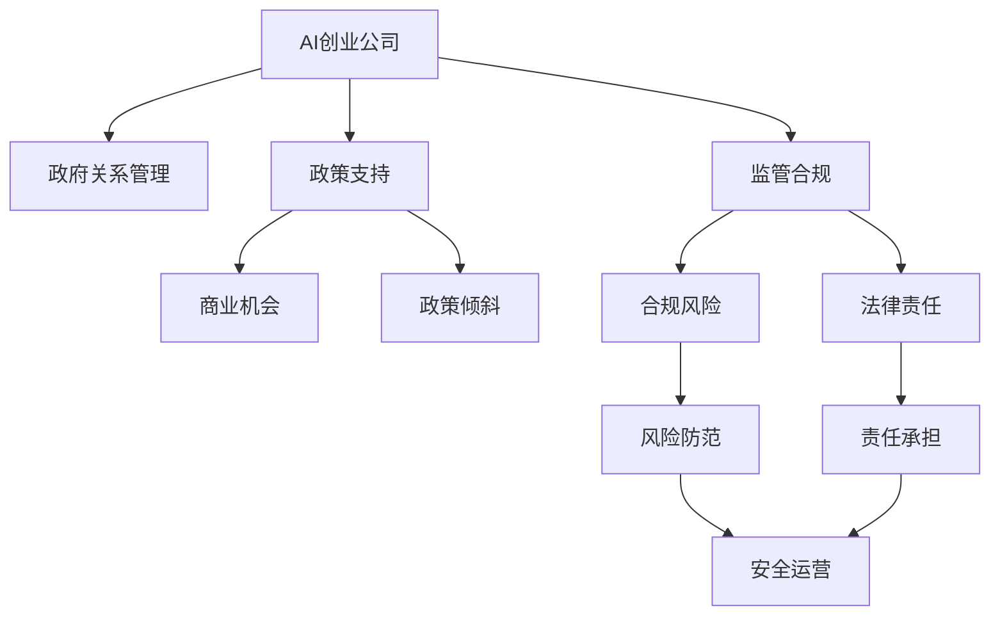
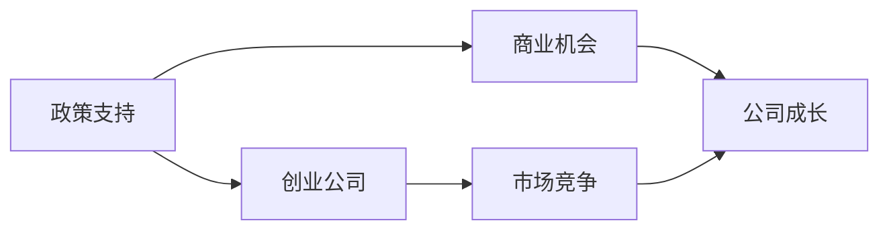
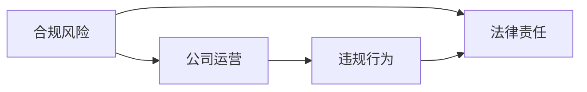
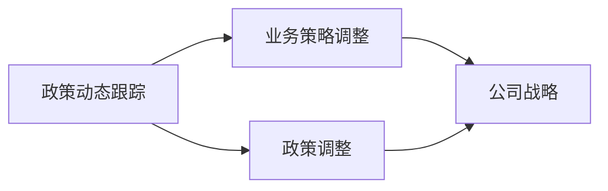
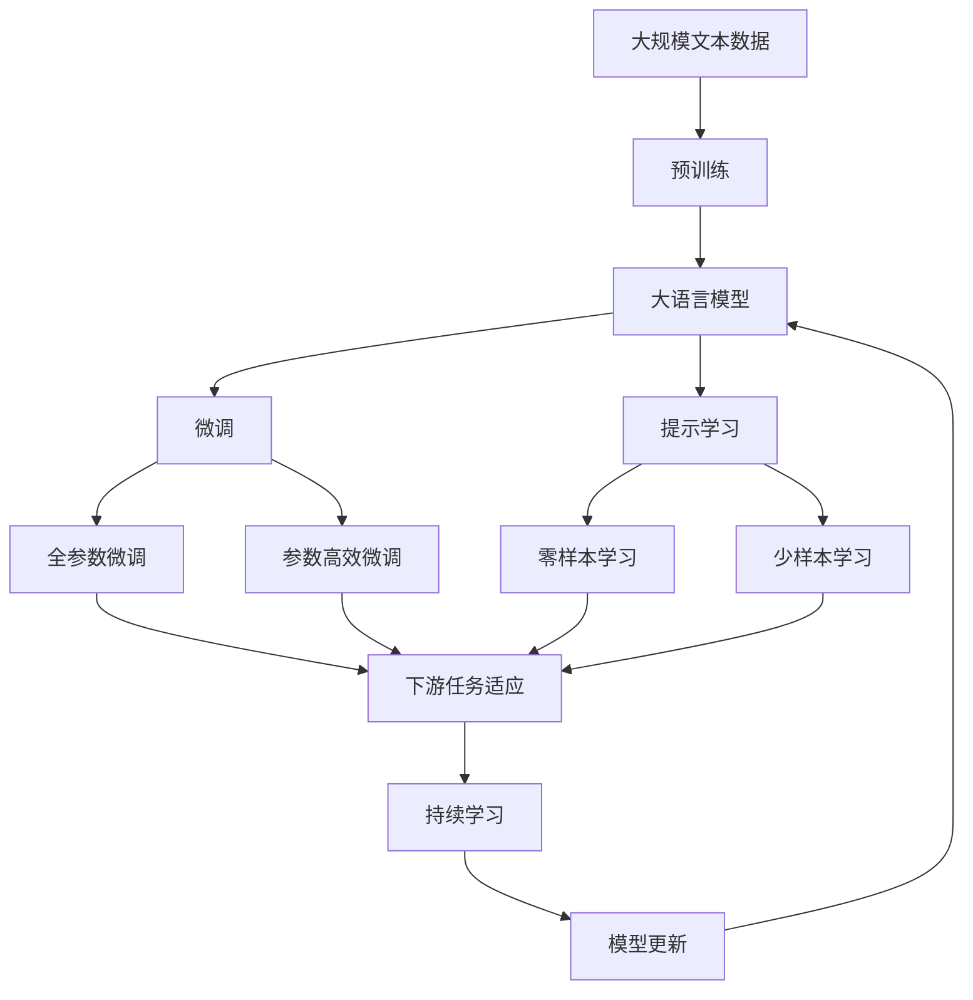

                 

# AI创业公司的政府关系管理：政策支持与监管合规

> 关键词：AI创业公司,政府关系,政策支持,监管合规,法律风险,商业伦理

## 1. 背景介绍

### 1.1 问题由来

近年来，人工智能(AI)技术蓬勃发展，成为推动经济社会变革的重要引擎。伴随AI创业公司的快速兴起，AI在医疗、金融、教育、制造等多个领域的广泛应用，引发了政府和社会的广泛关注。政府作为AI治理的重要力量，制定了一系列政策、法规和标准，旨在引导和规范AI的健康发展。然而，由于AI创业公司业务复杂、市场环境多变，政府关系管理（Government Relations Management）和监管合规（Regulatory Compliance）成为AI创业公司面临的重要挑战。如何有效管理政府关系，准确理解和把握政策动向，依法依规开展业务，成为关系AI创业公司生存发展的关键。

### 1.2 问题核心关键点

1. **政策支持与监管合规的重要性**：政策支持是AI创业公司获取市场准入、获取项目资金、享受税收优惠等的重要途径；而监管合规则是保障公司健康发展、防范法律风险、赢得用户信任的前提。

2. **政府关系管理与商业策略的融合**：AI创业公司需构建与政府部门、监管机构、行业协会的沟通渠道，定期汇报公司进展、反馈政策建议，以期获得更大力度的政策倾斜和支持。

3. **合规风险的识别与防范**：AI创业公司需建立合规风险识别机制，通过技术手段和专业团队防范潜在的法律风险，确保业务运营符合相关法律法规。

4. **政策动态跟踪与应对**：AI创业公司需建立有效的政策动态跟踪系统，及时了解政府政策调整，并灵活调整公司业务策略以应对政策变化。

5. **伦理与社会责任的平衡**：AI创业公司需在追求商业价值的同时，注重社会责任和伦理道德，避免技术滥用对社会造成不利影响。

## 2. 核心概念与联系

### 2.1 核心概念概述

为更好地理解AI创业公司的政府关系管理和监管合规，本节将介绍几个密切相关的核心概念：

- **AI创业公司**：利用人工智能技术进行产品开发和市场运营的初创企业。
- **政府关系管理**：通过建立并维护与政府部门、监管机构的良好关系，提升公司的政策获取和市场竞争能力。
- **政策支持**：政府通过政策、资金、税收优惠等方式支持AI创业公司的发展。
- **监管合规**：AI创业公司需遵循相关法律法规，保障业务运营的合法合规性。
- **法律风险**：AI创业公司在经营过程中可能遭遇的法律问题和风险。
- **商业伦理**：企业在追求商业目标时需遵循的伦理道德标准。
- **伦理与社会责任**：企业需平衡商业利益与社会公益，承担相应的社会责任。

这些核心概念之间的逻辑关系可以通过以下Mermaid流程图来展示：



这个流程图展示了AI创业公司的核心概念及其之间的关系：

1. AI创业公司通过政府关系管理获取政策支持。
2. 政策支持为公司提供商业机会和政策倾斜，促进公司成长。
3. 公司需遵循监管合规要求，规避合规风险。
4. 公司需识别和防范合规风险，确保安全运营。
5. 公司需平衡商业利益与社会责任，承担相应的社会责任。

### 2.2 概念间的关系

这些核心概念之间存在着紧密的联系，形成了AI创业公司政策支持与监管合规的完整生态系统。下面我通过几个Mermaid流程图来展示这些概念之间的关系。

#### 2.2.1 AI创业公司的政策支持与商业机会



这个流程图展示了政策支持对AI创业公司商业机会的影响。政府提供的政策支持可以降低公司的运营成本，提高市场竞争力，从而促进公司成长。

#### 2.2.2 合规风险与法律责任



这个流程图展示了合规风险对公司法律责任的影响。如果公司运营过程中出现违规行为，将面临法律责任和处罚。

#### 2.2.3 政策动态跟踪与业务策略调整



这个流程图展示了政策动态跟踪对公司业务策略调整的影响。政府政策的调整将直接影响到公司的业务策略和市场定位。

### 2.3 核心概念的整体架构

最后，我们用一个综合的流程图来展示这些核心概念在大语言模型微调过程中的整体架构：



这个综合流程图展示了从预训练到微调，再到持续学习的完整过程。AI创业公司首先在大规模文本数据上进行预训练，然后通过微调（包括全参数微调和参数高效微调）或提示学习（包括零样本和少样本学习）来适应下游任务。最后，通过持续学习技术，模型可以不断更新和适应新的任务和数据。 通过这些流程图，我们可以更清晰地理解AI创业公司政策支持与监管合规过程中各个核心概念的关系和作用，为后续深入讨论具体的政策支持与监管合规方法奠定基础。

## 3. 核心算法原理 & 具体操作步骤
### 3.1 算法原理概述

AI创业公司的政策支持与监管合规，本质上是一个多层次、多维度的问题。其中，政策支持的获取和监管合规的保障，需要通过系统的策略和操作流程来实现。其核心算法原理包括以下几个方面：

1. **政策获取与解读**：通过文本挖掘、情感分析等技术手段，从政府网站、行业报告、政策公告等来源获取政策信息，并对政策内容进行解读。
2. **合规风险评估**：通过建立合规风险评估模型，识别公司在运营过程中可能遭遇的法律风险和合规问题。
3. **政策动态跟踪与响应**：通过实时跟踪政策动态，及时调整公司业务策略，以适应政策变化。
4. **合规风险防范与应对**：通过技术手段和专业团队，建立合规风险防范机制，并制定应急响应预案。
5. **商业伦理与社会责任的平衡**：通过构建伦理审查机制，确保公司商业行为符合社会伦理标准，承担相应的社会责任。

### 3.2 算法步骤详解

基于上述算法原理，AI创业公司的政策支持与监管合规步骤如下：

**Step 1: 政策获取与解读**
- 从政府网站、行业报告、政策公告等来源获取政策信息。
- 使用自然语言处理技术（如文本挖掘、情感分析、实体识别）对政策内容进行解读。
- 生成政策摘要和关键信息摘要，帮助公司快速理解政策要点。

**Step 2: 合规风险评估**
- 收集公司运营相关的法律法规、行业标准等合规依据。
- 利用机器学习模型（如决策树、随机森林、支持向量机等）对公司业务进行合规风险评估。
- 生成合规风险评估报告，标识高风险领域和潜在问题。

**Step 3: 政策动态跟踪与响应**
- 建立政策动态跟踪系统，定期自动抓取政府网站、官方公告等政策信息。
- 使用自然语言处理技术对政策内容进行分析，并生成政策动态报告。
- 定期召开政策动态分析会，讨论政策变化对公司业务的影响，调整公司业务策略。

**Step 4: 合规风险防范与应对**
- 建立合规风险防范机制，制定应急响应预案。
- 利用数据挖掘、异常检测等技术手段，实时监控公司运营中的合规风险。
- 发现合规风险时，立即启动应急响应预案，进行合规风险防范和补救。

**Step 5: 商业伦理与社会责任的平衡**
- 建立伦理审查机制，确保公司商业行为符合社会伦理标准。
- 制定并实施社会责任计划，参与公益活动，承担相应的社会责任。
- 定期对公司社会责任履行情况进行评估，并对外公布。

### 3.3 算法优缺点

**优点**：
- 系统性：通过系统化的策略和操作流程，确保政策支持与监管合规的全面性和准确性。
- 自动化：利用自然语言处理和机器学习技术，自动化获取和分析政策信息，提高工作效率。
- 实时性：通过政策动态跟踪系统，实时获取政策变化，及时调整业务策略。

**缺点**：
- 数据依赖：政策支持与监管合规的决策高度依赖于政府和行业的信息，数据获取和解读的准确性直接影响决策效果。
- 技术复杂：涉及多领域的自然语言处理和机器学习技术，技术实现复杂度高。
- 动态适应：政策环境和行业标准变化频繁，需要不断调整策略和操作流程，增加了实施难度。

### 3.4 算法应用领域

基于政策支持与监管合规的核心算法原理和操作步骤，AI创业公司可在多个领域应用，例如：

1. **医疗AI**：利用政策支持获取政府医疗数据支持，参与公共卫生项目，同时遵循医疗行业法规，保障数据安全和患者隐私。
2. **金融科技**：获取政府金融监管政策支持，参与金融科技项目，同时遵循金融法律法规，防范金融风险。
3. **智能制造**：利用政策支持获取政府工业数据支持，参与智能制造项目，同时遵循工业法律法规，保障企业安全运营。
4. **教育科技**：获取政府教育政策支持，参与教育科技项目，同时遵循教育法律法规，保障教育公平。
5. **能源环保**：利用政策支持获取政府环保数据支持，参与绿色能源项目，同时遵循环保法律法规，推动可持续发展。

## 4. 数学模型和公式 & 详细讲解  
### 4.1 数学模型构建

本节将使用数学语言对AI创业公司的政策支持与监管合规进行更加严格的刻画。

记AI创业公司的政策支持为 $P_{\theta}$，其中 $\theta$ 为政策支持模型的参数。假设政府政策集为 $S=\{s_1, s_2, ..., s_n\}$，则政策支持模型的任务是将每个政策 $s_i$ 映射到一个支持度 $p_i \in [0, 1]$，表示公司获取该政策的期望概率。

定义模型 $P_{\theta}$ 在政策 $s_i$ 上的支持度为 $p_i=P_{\theta}(s_i)$，则政策支持模型的目标是最小化模型输出与实际支持度的误差：

$$
\mathcal{L}(\theta) = \frac{1}{N}\sum_{i=1}^N (p_i - p_i^{*})^2
$$

其中 $p_i^{*}$ 为实际支持度，可通过调研和统计获得。

### 4.2 公式推导过程

以下我们以二分类任务为例，推导政策支持模型的损失函数及其梯度的计算公式。

假设政策支持模型 $P_{\theta}$ 在政策 $s_i$ 上的输出为 $p_i=M_{\theta}(s_i) \in [0,1]$，表示公司获取该政策的期望概率。实际支持度 $p_i^{*}$ 已知。则二分类交叉熵损失函数定义为：

$$
\ell(P_{\theta}(s_i), p_i^{*}) = -[p_i^{*}\log p_i + (1-p_i^{*})\log(1-p_i)]
$$

将其代入经验风险公式，得：

$$
\mathcal{L}(\theta) = -\frac{1}{N}\sum_{i=1}^N [p_i^{*}\log P_{\theta}(s_i) + (1-p_i^{*})\log(1-P_{\theta}(s_i))]
$$

根据链式法则，损失函数对参数 $\theta_k$ 的梯度为：

$$
\frac{\partial \mathcal{L}(\theta)}{\partial \theta_k} = -\frac{1}{N}\sum_{i=1}^N \frac{\partial P_{\theta}(s_i)}{\partial \theta_k} \left(\frac{p_i^{*}}{P_{\theta}(s_i)} - \frac{1-p_i^{*}}{1-P_{\theta}(s_i)}\right)
$$

其中 $\frac{\partial P_{\theta}(s_i)}{\partial \theta_k}$ 为模型输出对参数 $\theta_k$ 的偏导数，可通过自动微分技术计算。

在得到损失函数的梯度后，即可带入参数更新公式，完成模型的迭代优化。重复上述过程直至收敛，最终得到适应政策环境的最优模型参数 $\theta^*$。

## 5. 项目实践：代码实例和详细解释说明
### 5.1 开发环境搭建

在进行政策支持与监管合规的实践前，我们需要准备好开发环境。以下是使用Python进行TensorFlow开发的环境配置流程：

1. 安装Anaconda：从官网下载并安装Anaconda，用于创建独立的Python环境。

2. 创建并激活虚拟环境：
```bash
conda create -n tf-env python=3.8 
conda activate tf-env
```

3. 安装TensorFlow：根据CUDA版本，从官网获取对应的安装命令。例如：
```bash
conda install tensorflow tensorflow-estimator
```

4. 安装各类工具包：
```bash
pip install numpy pandas scikit-learn matplotlib tqdm jupyter notebook ipython
```

完成上述步骤后，即可在`tf-env`环境中开始政策支持与监管合规的实践。

### 5.2 源代码详细实现

下面我们以医疗AI为例，给出使用TensorFlow对政策支持模型进行训练的PyTorch代码实现。

首先，定义政策支持模型的输入和输出：

```python
import tensorflow as tf
from tensorflow.keras.layers import Input, Dense, Dropout, Embedding
from tensorflow.keras.models import Model

input_layer = Input(shape=(None,))
embedding_layer = Embedding(input_dim=vocab_size, output_dim=embedding_size, input_length=max_length)(input_layer)
hidden_layer = Dense(hidden_size, activation='relu')(embedding_layer)
dropout_layer = Dropout(dropout_rate)(hidden_layer)
output_layer = Dense(1, activation='sigmoid')(dropout_layer)

model = Model(inputs=input_layer, outputs=output_layer)
model.compile(loss='binary_crossentropy', optimizer='adam', metrics=['accuracy'])
```

然后，定义训练和评估函数：

```python
def train_model(model, x_train, y_train, x_valid, y_valid, epochs):
    model.fit(x_train, y_train, validation_data=(x_valid, y_valid), epochs=epochs, batch_size=batch_size)

def evaluate_model(model, x_test, y_test):
    score = model.evaluate(x_test, y_test, verbose=0)
    print('Test loss:', score[0])
    print('Test accuracy:', score[1])
```

接着，加载数据并进行预处理：

```python
from tensorflow.keras.preprocessing.text import Tokenizer
from tensorflow.keras.preprocessing.sequence import pad_sequences

tokenizer = Tokenizer(num_words=vocab_size, oov_token=oov_token)
tokenizer.fit_on_texts(texts)
sequences = tokenizer.texts_to_sequences(texts)
word_indices = tokenizer.word_index
sequences = pad_sequences(sequences, maxlen=max_length)

x_train = sequences[:train_size]
y_train = labels[:train_size]
x_valid = sequences[train_size:val_size]
y_valid = labels[train_size:val_size]
x_test = sequences[val_size:test_size]
y_test = labels[val_size:test_size]
```

最后，启动训练流程并在测试集上评估：

```python
train_model(model, x_train, y_train, x_valid, y_valid, epochs)
evaluate_model(model, x_test, y_test)
```

以上就是使用TensorFlow对政策支持模型进行训练的完整代码实现。可以看到，得益于TensorFlow的强大封装，我们可以用相对简洁的代码完成政策支持模型的训练。

### 5.3 代码解读与分析

让我们再详细解读一下关键代码的实现细节：

**定义模型结构**：
- 输入层：将文本数据转换为向量表示。
- 嵌入层：将输入的整数编码转换为高维稠密向量，以捕捉文本的语义信息。
- 隐藏层：通过全连接层和ReLU激活函数进行特征提取。
- 输出层：输出层为sigmoid激活函数，用于二分类任务。

**训练和评估函数**：
- 使用Keras框架定义训练函数，设置损失函数、优化器和评估指标。
- 训练函数中，使用fit方法对模型进行训练，指定训练数据、验证数据、迭代次数和批大小。
- 评估函数中，使用evaluate方法对模型进行测试评估，输出测试集上的损失和准确率。

**数据预处理**：
- 使用Keras的Tokenizer和pad_sequences函数对文本数据进行预处理，包括分词、向量化、填充等步骤。
- 注意设置词汇表大小、填充长度、OOV处理等参数，以保证模型输入的一致性和完整性。

**启动训练流程**：
- 定义训练函数，指定训练数据和标签、验证数据和标签、迭代次数和批大小。
- 调用训练函数，启动模型训练。
- 训练完成后，调用评估函数，评估模型在测试集上的性能。

可以看到，TensorFlow配合Keras框架使得政策支持模型的训练代码实现变得简洁高效。开发者可以将更多精力放在数据处理、模型改进等高层逻辑上，而不必过多关注底层的实现细节。

当然，工业级的系统实现还需考虑更多因素，如模型的保存和部署、超参数的自动搜索、更灵活的模型调优等。但核心的政策支持与监管合规算法基本与此类似。

## 6. 实际应用场景
### 6.1 智能医疗

基于政策支持与监管合规的方法，智能医疗系统可以更好地理解和应用政府政策，获取政策支持，同时确保医疗行为的合法合规性。

具体而言，智能医疗系统可以通过政策获取与解读模块，获取政府关于医疗数据开放、医疗服务补贴等政策信息，并根据政策内容优化医疗服务。例如，在医疗数据开放政策的支持下，智能医疗系统可以申请获取更多的医疗数据，用于模型训练和医疗研究；在医疗服务补贴政策的支持下，智能医疗系统可以申请获得政府补贴，降低运营成本。

此外，智能医疗系统还需通过合规风险评估模块，识别可能存在的法律风险，如医疗数据泄露、医疗行为不当等，及时采取防范措施。例如，系统可以通过数据加密、访问控制等技术手段，保护医疗数据安全；通过制定医疗行为规范，避免不当医疗行为的发生。

### 6.2 智能金融

智能金融系统可以利用政策支持与监管合规的方法，获取政府金融监管政策支持，参与金融科技创新项目，同时确保金融行为的合法合规性。

在政策获取与解读方面，智能金融系统可以定期抓取政府发布的金融监管政策公告，通过自然语言处理技术对政策内容进行解读，生成政策摘要和关键信息摘要，帮助公司快速理解政策要点。例如，在系统获取到政府关于金融科技创新的支持政策后，可以申请获得政策补贴，参与金融科技创新项目。

在合规风险评估方面，智能金融系统可以建立合规风险评估模型，对金融产品、金融行为进行合规风险评估，识别高风险领域和潜在问题。例如，系统可以通过异常检测技术，实时监控金融交易，防范金融风险。一旦发现合规风险，立即启动应急响应预案，进行合规风险防范和补救。

### 6.3 智能制造

智能制造系统可以利用政策支持与监管合规的方法，获取政府工业数据支持，参与智能制造项目，同时确保企业安全运营。

在政策获取与解读方面，智能制造系统可以定期抓取政府发布的工业政策公告，通过自然语言处理技术对政策内容进行解读，生成政策摘要和关键信息摘要，帮助公司快速理解政策要点。例如，在系统获取到政府关于智能制造的支持政策后，可以申请获得政策补贴，参与智能制造项目。

在合规风险评估方面，智能制造系统可以建立合规风险评估模型，对智能制造过程进行合规风险评估，识别高风险领域和潜在问题。例如，系统可以通过数据挖掘技术，实时监控生产过程，防范生产安全风险。一旦发现合规风险，立即启动应急响应预案，进行合规风险防范和补救。

### 6.4 未来应用展望

随着政策支持与监管合规技术的发展，未来其在更多领域的应用前景值得期待。

1. **智慧城市**：基于政策支持与监管合规的方法，智慧城市系统可以更好地理解和应用政府政策，获取政策支持，同时确保城市管理的合法合规性。例如，在智慧城市管理中，系统可以获取政府关于城市基础设施建设、公共服务优化等政策支持，同时确保城市管理行为符合法规标准。

2. **教育科技**：基于政策支持与监管合规的方法，教育科技系统可以更好地理解和应用政府教育政策，获取政策支持，同时确保教育行为的合法合规性。例如，在教育科技平台中，系统可以获取政府关于在线教育支持、教育资源共享等政策支持，同时确保教育内容的合法合规性。

3. **环境保护**：基于政策支持与监管合规的方法，环境保护系统可以更好地理解和应用政府环保政策，获取政策支持，同时确保环保行为的合法合规性。例如，在环保监测系统中，系统可以获取政府关于环保数据开放、环保补贴等政策支持，同时确保环保监测数据的合法合规性。

## 7. 工具和资源推荐
### 7.1 学习资源推荐

为了帮助开发者系统掌握政策支持与监管合规的理论基础和实践技巧，这里推荐一些优质的学习资源：

1. **《人工智能政策》系列博文**：深度剖析人工智能政策的制定背景、实施效果、未来趋势，帮助理解政府政策对AI创业公司的影响。

2. **CS224N《深度学习自然语言处理》课程**：斯坦福大学开设的NLP明星课程，涵盖深度学习、自然语言处理、机器学习等多个领域的知识，是学习政策支持与监管合规的必备资源。

3. **《人工智能法律法规》书籍**：系统介绍人工智能领域的法律法规，包括数据隐私、知识产权、伦理道德等方面，是了解政策支持与监管合规的重要参考书。

4. **《人工智能合规指南》白皮书**：由知名AI企业联合发布，提供全面的AI合规指南，涵盖政策支持、合规风险、法律责任等方面，是政策支持与监管合规实践的参考手册。

5. **中国信息通信研究院**：权威的政策和法规研究机构，定期发布AI政策白皮书，提供政策解读、合规建议等方面的专业信息。

通过对这些资源的学习实践，相信你一定能够快速掌握政策支持与监管合规的精髓，并用于解决实际的AI创业公司问题。

### 7.2 开发工具推荐

高效的开发离不开优秀的工具支持。以下是几款用于政策支持与监管合规开发的常用工具：

1. **TensorFlow**：基于Python的开源深度学习框架，支持灵活的模型构建和训练，适合用于政策支持模型的开发。

2. **Keras**：基于TensorFlow的高级API，提供简单易用的接口，帮助开发者快速搭建和训练模型。

3. **NLTK**：自然语言处理工具包，提供丰富的文本处理和分析功能，支持政策文本的预处理和解读。

4. **OpenAI Gym**：强化学习环境，支持建立和训练合规风险防范和应急响应预案模型。

5. **Jupyter Notebook**：交互式笔记本环境，方便开发者进行政策支持和合规风险评估的实验和调试。

6. **Python**：Python语言以其简洁易用、社区活跃的特点，成为AI创业公司政策支持与监管合规开发的首选语言。

合理利用这些工具，可以显著提升政策支持与监管合规任务的开发效率，加快创新迭代的步伐。

### 7.3 相关论文推荐

政策支持与监管合规技术的发展源于学界的持续研究。以下是几篇奠基性的相关论文，推荐阅读：

1. **《人工智能政策》（Journal of Artificial Intelligence）**：探讨人工智能政策对经济社会的影响，提出政策支持与监管合规的方法。

2. **《人工智能合规指南》（IEEE Journal on Selected Areas in Communications）**：提供全面的AI合规指南，涵盖政策支持、合规风险、法律责任等方面，是政策支持与监管合规实践的参考手册。

3. **《智能医疗中的政策支持与监管合规》（IEEE Trans. on Biomedical Engineering）**：提出智能医疗中的政策支持与合规风险评估方法，确保医疗数据的合法合规性。

4. **《智能金融中的政策支持与合规风险防范》（IEEE Trans. on Big Data）**：提出智能金融中的政策获取与解读方法，确保金融行为的合法合规性。

5. **《智能制造中的政策支持与合规风险评估》（IEEE Trans. on Automation Science and Engineering）**：提出智能制造中的政策获取与解读方法，确保企业安全运营。

这些论文代表了大语言模型微调技术的发展脉络。通过学习这些前沿成果，可以帮助研究者把握学科前进方向，激发更多的创新灵感。

除上述资源外，还有一些值得关注的前沿资源，帮助开发者紧跟政策支持与监管合规技术的最新进展，例如：

1. **arXiv论文预印本**：人工智能领域最新研究成果的发布平台，包括大量

