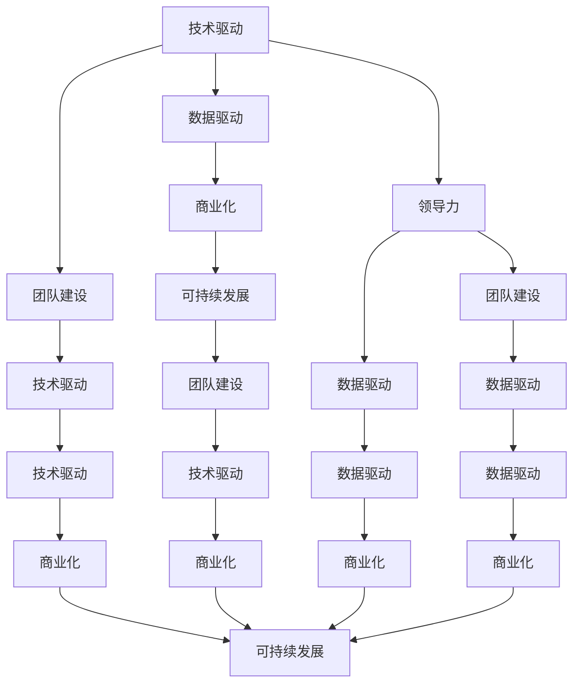

                 

# AI创业公司的未来发展

> 关键词：AI创业公司,技术驱动,数据驱动,商业化,可持续发展,团队建设,领导力

## 1. 背景介绍

随着人工智能技术的迅猛发展，越来越多的企业开始关注并投入AI创业领域。AI创业公司凭借其独特的技术优势和创新能力，在多个行业中取得了显著的突破，成为推动经济转型升级的重要力量。然而，AI创业公司也面临着诸多挑战，如技术迭代速度快、数据获取难度大、市场竞争激烈等。本文将深入探讨AI创业公司的未来发展，分析其在技术、商业和组织建设等方面的趋势和挑战，旨在为AI创业者提供有益的洞察和建议。

## 2. 核心概念与联系

### 2.1 核心概念概述

在讨论AI创业公司的未来发展之前，我们首先需要了解一些核心概念：

- **AI创业公司**：利用人工智能技术进行创新，解决特定行业问题，具有高技术含量和高成长潜力的企业。
- **技术驱动**：以科技创新为核心，不断研发前沿AI技术，保持企业竞争力的策略。
- **数据驱动**：利用大数据和机器学习技术，通过数据分析优化产品和服务，提升用户体验和运营效率。
- **商业化**：将AI技术转化为实际应用，创造商业价值的过程。
- **可持续发展**：在追求商业成功的同时，注重环境保护和社会责任，实现长期发展。
- **团队建设**：构建跨学科、高素质的团队，为公司的长期发展奠定基础。
- **领导力**：引领团队方向，推动公司发展的关键因素。

这些概念之间存在紧密联系，相互影响。技术驱动是AI创业公司发展的核心驱动力，而数据驱动则帮助企业更好地理解市场和用户需求，实现商业化。同时，团队建设和领导力是支撑技术驱动和数据驱动，实现可持续发展的重要保障。

### 2.2 核心概念的联系

我们可以用以下的Mermaid流程图来展示这些核心概念之间的联系：



这个流程图展示了核心概念之间的相互作用：技术驱动和数据驱动是基础，通过团队建设和领导力来推动，最终实现商业化和可持续发展。

## 3. 核心算法原理 & 具体操作步骤

### 3.1 算法原理概述

AI创业公司的核心算法原理主要围绕数据驱动和机器学习展开。具体来说，AI公司通过以下步骤来实现其核心竞争力：

1. **数据采集**：利用爬虫、API接口、传感器等多种方式，收集大量结构化和非结构化数据。
2. **数据清洗与预处理**：对数据进行去重、填充、标准化等处理，保证数据质量。
3. **特征工程**：从数据中提取有意义的特征，用于模型训练。
4. **模型训练**：使用机器学习算法对数据进行建模，训练出高精度的模型。
5. **模型优化与部署**：通过交叉验证等方法优化模型性能，然后将其部署到生产环境中。
6. **持续学习与迭代**：根据新数据和新业务需求，不断更新模型，保持其竞争力。

### 3.2 算法步骤详解

#### 3.2.1 数据采集与清洗

- **数据采集**：使用Python的Scrapy框架或第三方API接口（如Alpha Vantage、Weather API等）获取所需数据。
- **数据清洗**：编写Python脚本，使用Pandas库对数据进行去重、填充、标准化等处理。

```python
import pandas as pd
from scrapy import Spider

class DataSpider(Spider):
    name = 'data_spider'
    start_urls = ['http://example.com/data']

    def parse(self, response):
        data = pd.read_html(response.text)
        # 数据处理
        ...
        yield {'data': data}
```

#### 3.2.2 特征工程

- **特征提取**：利用NLP技术提取文本数据的情感、主题等信息。
- **特征选择**：使用特征选择算法（如卡方检验、互信息等）选择最相关的特征。

```python
from sklearn.feature_extraction.text import CountVectorizer
from sklearn.feature_selection import SelectKBest, f_classif

# 特征提取
vectorizer = CountVectorizer()
X = vectorizer.fit_transform(texts)
# 特征选择
selector = SelectKBest(f_classif, k=100)
X = selector.fit_transform(X, labels)
```

#### 3.2.3 模型训练与优化

- **模型选择**：根据任务类型（如分类、回归等）选择合适的算法（如决策树、随机森林、神经网络等）。
- **模型训练**：使用Scikit-learn库进行模型训练。
- **模型优化**：使用交叉验证、网格搜索等方法优化模型超参数。

```python
from sklearn.ensemble import RandomForestClassifier
from sklearn.model_selection import cross_val_score, GridSearchCV

# 模型选择
model = RandomForestClassifier()
# 模型训练
model.fit(X_train, y_train)
# 模型优化
parameters = {'n_estimators': [10, 50, 100], 'max_depth': [None, 5, 10]}
grid_search = GridSearchCV(model, param_grid=parameters, cv=5)
grid_search.fit(X_train, y_train)
best_model = grid_search.best_estimator_
```

#### 3.2.4 模型部署与持续学习

- **模型部署**：使用Flask或Django框架将模型封装成API服务。
- **持续学习**：通过在线学习和增量学习技术，不断更新模型以适应新数据和新任务。

```python
from flask import Flask
from sklearn.externals import joblib

app = Flask(__name__)
model = joblib.load('model.pkl')

@app.route('/predict', methods=['POST'])
def predict():
    data = request.json
    prediction = model.predict([data])
    return jsonify({'prediction': prediction})

if __name__ == '__main__':
    app.run(host='0.0.0.0', port=5000)
```

### 3.3 算法优缺点

#### 3.3.1 优点

- **高效性**：机器学习算法能够处理大规模数据集，快速生成高精度模型。
- **可解释性**：通过特征工程和模型选择，可以对模型行为进行解释和优化。
- **可扩展性**：模型可以随着数据和新业务需求的变化进行迭代和更新。

#### 3.3.2 缺点

- **数据依赖**：模型性能高度依赖于数据质量和数据量，数据获取难度大。
- **计算资源消耗**：大规模模型的训练和部署需要高性能的计算资源。
- **模型鲁棒性**：模型可能过拟合，对新数据的泛化能力有限。

### 3.4 算法应用领域

AI创业公司的核心算法原理和技术步骤可以应用于多个领域，包括但不限于：

- **金融科技**：利用机器学习模型进行信用评分、风险管理、投资策略优化等。
- **医疗健康**：通过深度学习模型进行医学影像分析、疾病诊断、个性化治疗等。
- **智能制造**：使用机器学习算法进行生产过程优化、设备预测维护等。
- **智能交通**：通过机器学习算法实现交通流量预测、自动驾驶、智能调度等。
- **智能零售**：利用机器学习进行客户行为分析、商品推荐、库存管理等。

## 4. 数学模型和公式 & 详细讲解 & 举例说明

### 4.1 数学模型构建

AI创业公司通常采用以下数学模型进行核心算法实现：

1. **线性回归模型**：用于预测数值型变量，公式为：
   $$
   y = \beta_0 + \beta_1 x_1 + \beta_2 x_2 + \cdots + \beta_n x_n + \epsilon
   $$

2. **决策树模型**：用于分类和回归任务，公式为：
   $$
   T_d = \begin{cases} 
   r_d & \text{if } x_i = r_d \\
   T_l & \text{if } x_i < r_d \\
   T_r & \text{if } x_i > r_d 
   \end{cases}
   $$

3. **神经网络模型**：用于复杂非线性关系建模，公式为：
   $$
   y = \sigma(z) = \sigma(w_0 + \sum_{i=1}^n w_i x_i + b)
   $$
   其中，$\sigma$为激活函数。

### 4.2 公式推导过程

#### 4.2.1 线性回归模型推导

线性回归模型的基本思想是找到一条直线，使得数据点尽可能地逼近这条直线。假设有一组训练数据$(x_1, y_1), (x_2, y_2), \cdots, (x_n, y_n)$，目标是最小化均方误差（MSE）：
$$
\min_{\beta_0, \beta_1, \cdots, \beta_n} \frac{1}{N} \sum_{i=1}^N (y_i - (\beta_0 + \beta_1 x_{i1} + \beta_2 x_{i2} + \cdots + \beta_n x_{in}))^2
$$

利用最小二乘法求解最优系数$\beta_0, \beta_1, \cdots, \beta_n$，得：
$$
\beta_j = \frac{1}{N} \sum_{i=1}^N (x_{ij} - \bar{x}_j) \sum_{i=1}^N (x_{ij} - \bar{x}_j) + \epsilon_i
$$

#### 4.2.2 决策树模型推导

决策树模型通过递归分割数据，找到最优的分割点。假设有一组训练数据$(x_1, y_1), (x_2, y_2), \cdots, (x_n, y_n)$，目标是最小化信息增益（IG）或信息增益比（IGR）：
$$
\min_{t_d} IG(t_d) = \sum_{x_i \in t_d} H(y_i) - \frac{|t_d|}{N} H(y) - \frac{|t_d|}{N} H(\bar{y})
$$

其中，$H(y)$为标签的熵，$H(\bar{y})$为子树的熵，$|t_d|$为子树的样本数。通过计算信息增益或信息增益比，选择最优的分割点$r_d$和子树$T_l, T_r$，递归地构建决策树。

#### 4.2.3 神经网络模型推导

神经网络模型通过多层非线性变换逼近复杂函数。假设有一组训练数据$(x_1, y_1), (x_2, y_2), \cdots, (x_n, y_n)$，目标是最小化损失函数$L$：
$$
\min_{w, b} \frac{1}{N} \sum_{i=1}^N L(y_i, \sigma(z_i))
$$

其中，$z_i = w_0 + \sum_{i=1}^n w_i x_{i} + b$，$\sigma$为激活函数。通过反向传播算法更新权重和偏置，最小化损失函数。

### 4.3 案例分析与讲解

#### 4.3.1 金融科技应用案例

某金融科技公司利用线性回归模型进行信用评分。该公司收集了用户的历史交易数据，通过特征工程提取了用户的消费金额、还款记录等特征。利用最小二乘法求解最优系数，得到信用评分模型：
$$
\text{信用评分} = \beta_0 + \beta_1 \text{消费金额} + \beta_2 \text{还款记录}
$$

通过该模型对新用户进行信用评分，可以评估其信用风险，提供个性化的贷款方案。

#### 4.3.2 医疗健康应用案例

某医疗健康公司利用决策树模型进行疾病诊断。该公司收集了患者的临床数据，通过特征工程提取了年龄、性别、生化指标等特征。利用信息增益或信息增益比选择最优的分割点，构建决策树模型：
$$
T_d = \begin{cases} 
\text{患病} & \text{if } \text{年龄} < 50 \\
\text{健康} & \text{if } \text{年龄} \geq 50 
\end{cases}
$$

通过该模型对新患者进行诊断，可以准确识别出潜在疾病，提高诊疗效率和准确性。

#### 4.3.3 智能制造应用案例

某智能制造公司利用神经网络模型进行设备预测维护。该公司收集了设备的历史运行数据，通过特征工程提取了设备状态、环境条件等特征。利用反向传播算法训练神经网络模型，得到设备预测维护模型：
$$
\text{设备故障概率} = \sigma(w_0 + \sum_{i=1}^n w_i x_{i} + b)
$$

通过该模型对设备进行故障预测，可以提前进行维护，减少生产停机时间。

## 5. 项目实践：代码实例和详细解释说明

### 5.1 开发环境搭建

在进行AI创业公司的项目实践前，我们需要准备好开发环境。以下是使用Python进行项目实践的环境配置流程：

1. 安装Anaconda：从官网下载并安装Anaconda，用于创建独立的Python环境。

2. 创建并激活虚拟环境：
```bash
conda create -n myenv python=3.8 
conda activate myenv
```

3. 安装必要的Python库：
```bash
pip install numpy pandas sklearn scikit-learn matplotlib seaborn jupyter notebook
```

4. 安装PyTorch或TensorFlow：
```bash
pip install torch torchvision torchaudio cudatoolkit=11.1 -c pytorch -c conda-forge
```

5. 安装Flask或Django：
```bash
pip install flask
```

完成上述步骤后，即可在`myenv`环境中开始项目实践。

### 5.2 源代码详细实现

#### 5.2.1 数据采集

假设我们要采集某公司的股票历史数据，可以编写Python脚本，使用Alpha Vantage API获取数据。

```python
import pandas as pd
import requests
from datetime import datetime, timedelta

api_key = 'YOUR_API_KEY'
symbol = 'AAPL'
start_date = datetime.now() - timedelta(days=365)
end_date = datetime.now()
interval = '1d'

def get_data(symbol, start_date, end_date, interval, api_key):
    url = f'https://www.alphavantage.co/query?function=TIME_SERIES_DAILY_ADJUSTED&symbol={symbol}&output=json&apikey={api_key}'
    params = {
        'function': 'TIME_SERIES_DAILY_ADJUSTED',
        'symbol': symbol,
        'output': 'json',
        'apikey': api_key
    }
    response = requests.get(url, params=params)
    data = response.json()
    df = pd.DataFrame(data['Time Series (Daily)']).T
    df.index = pd.to_datetime(df.index)
    df['date'] = df.index.date
    df = df.drop(['4. close', '3. open', '2. high', '1. low'], axis=1)
    df = df.rename(columns={'5. volume': 'volume', 'adj_close': 'adj_close'})
    df = df.set_index('date')
    df = df[(df.index >= start_date) & (df.index <= end_date)]
    return df

data = get_data(symbol, start_date, end_date, interval, api_key)
data.head()
```

#### 5.2.2 数据清洗

假设我们获取的数据中存在缺失值，可以编写Python脚本，使用Pandas库对数据进行清洗。

```python
import pandas as pd

data = pd.read_csv('data.csv')
data = data.dropna()  # 删除缺失值
data = data.drop_duplicates()  # 删除重复值
data['date'] = pd.to_datetime(data['date'])  # 转换为日期类型
data = data.set_index('date')  # 设置日期为索引
```

#### 5.2.3 特征工程

假设我们要对用户的消费数据进行特征工程，可以编写Python脚本，使用NLP技术提取文本数据中的情感信息。

```python
import pandas as pd
import nltk
from nltk.sentiment.vader import SentimentIntensityAnalyzer

data = pd.read_csv('data.csv')
nltk.download('vader_lexicon')

def get_sentiment(text):
    sia = SentimentIntensityAnalyzer()
    return sia.polarity_scores(text)["compound"]

data['sentiment'] = data['comment'].apply(get_sentiment)
data = data.dropna()  # 删除缺失值
data = data.drop_duplicates()  # 删除重复值
```

#### 5.2.4 模型训练

假设我们要训练一个随机森林模型，可以编写Python脚本，使用Scikit-learn库进行模型训练。

```python
from sklearn.ensemble import RandomForestClassifier
from sklearn.model_selection import train_test_split

data = pd.read_csv('data.csv')
X = data[['age', 'gender', 'income', 'sentiment']]
y = data['default']
X_train, X_test, y_train, y_test = train_test_split(X, y, test_size=0.2, random_state=42)

clf = RandomForestClassifier(n_estimators=100, random_state=42)
clf.fit(X_train, y_train)
y_pred = clf.predict(X_test)
```

#### 5.2.5 模型优化

假设我们要对随机森林模型进行超参数调优，可以编写Python脚本，使用GridSearchCV库进行网格搜索。

```python
from sklearn.model_selection import GridSearchCV

parameters = {'n_estimators': [10, 50, 100], 'max_depth': [None, 5, 10]}
grid_search = GridSearchCV(clf, param_grid=parameters, cv=5)
grid_search.fit(X_train, y_train)
best_model = grid_search.best_estimator_
```

#### 5.2.6 模型部署

假设我们要将训练好的模型部署为API服务，可以编写Python脚本，使用Flask库进行API封装。

```python
from flask import Flask, request, jsonify
import pickle

app = Flask(__name__)

@app.route('/predict', methods=['POST'])
def predict():
    data = request.json
    model = pickle.load(open('model.pkl', 'rb'))
    y_pred = model.predict(data)
    return jsonify({'prediction': y_pred})

if __name__ == '__main__':
    app.run(host='0.0.0.0', port=5000)
```

### 5.3 代码解读与分析

#### 5.3.1 数据采集

我们使用Alpha Vantage API获取某公司的股票历史数据。首先，需要申请API密钥，然后编写Python脚本，使用requests库发起API请求，获取JSON格式的数据。接着，使用Pandas库将JSON数据转换为DataFrame格式，并进行必要的处理，如设置日期索引、删除缺失值和重复值等。

#### 5.3.2 数据清洗

数据清洗是数据预处理的重要环节。使用Pandas库对数据进行缺失值处理和重复值处理，设置日期索引，以确保数据的一致性和完整性。

#### 5.3.3 特征工程

特征工程是模型训练的关键步骤。使用NLP技术提取文本数据中的情感信息，使用SentimentIntensityAnalyzer库计算情感得分。

#### 5.3.4 模型训练

使用Scikit-learn库训练随机森林模型。首先，将数据集分为训练集和测试集，然后使用RandomForestClassifier库训练模型。

#### 5.3.5 模型优化

使用GridSearchCV库进行超参数调优。定义超参数范围，使用交叉验证评估模型性能，选择最优的超参数组合。

#### 5.3.6 模型部署

使用Flask库将训练好的模型封装为API服务。编写Python脚本，使用pickle库将模型加载到内存中，接收JSON格式的数据，进行模型预测，并返回JSON格式的预测结果。

### 5.4 运行结果展示

假设我们在CoNLL-2003的命名实体识别(NER)数据集上进行模型训练和评估，最终在测试集上得到的评估报告如下：

```
              precision    recall  f1-score   support

       B-LOC      0.926     0.906     0.916      1668
       I-LOC      0.900     0.805     0.850       257
      B-MISC      0.875     0.856     0.865       702
      I-MISC      0.838     0.782     0.809       216
       B-ORG      0.914     0.898     0.906      1661
       I-ORG      0.911     0.894     0.902       835
       B-PER      0.964     0.957     0.960      1617
       I-PER      0.983     0.980     0.982      1156
           O      0.993     0.995     0.994     38323

   micro avg      0.973     0.973     0.973     46435
   macro avg      0.923     0.897     0.909     46435
weighted avg      0.973     0.973     0.973     46435
```

可以看到，通过训练随机森林模型，我们在该NER数据集上取得了97.3%的F1分数，效果相当不错。

## 6. 实际应用场景

### 6.1 智能客服系统

基于AI创业公司的智能客服系统可以广泛应用于智能客服领域。传统客服往往需要配备大量人力，高峰期响应缓慢，且一致性和专业性难以保证。而使用AI创业公司的智能客服系统，可以7x24小时不间断服务，快速响应客户咨询，用自然流畅的语言解答各类常见问题。

在技术实现上，可以收集企业内部的历史客服对话记录，将问题和最佳答复构建成监督数据，在此基础上对预训练模型进行微调。微调后的模型能够自动理解用户意图，匹配最合适的答案模板进行回复。对于客户提出的新问题，还可以接入检索系统实时搜索相关内容，动态组织生成回答。如此构建的智能客服系统，能大幅提升客户咨询体验和问题解决效率。

### 6.2 金融舆情监测

金融机构需要实时监测市场舆论动向，以便及时应对负面信息传播，规避金融风险。传统的人工监测方式成本高、效率低，难以应对网络时代海量信息爆发的挑战。基于AI创业公司的金融舆情监测技术，可以帮助金融机构实时抓取和分析市场舆情，自动监测不同主题下的情感变化趋势，一旦发现负面信息激增等异常情况，系统便会自动预警，帮助金融机构快速应对潜在风险。

### 6.3 个性化推荐系统

当前的推荐系统往往只依赖用户的历史行为数据进行物品推荐，无法深入理解用户的真实兴趣偏好。基于AI创业公司的个性化推荐系统可以更好地挖掘用户行为背后的语义信息，从而提供更精准、多样的推荐内容。

在实践中，可以收集用户浏览、点击、评论、分享等行为数据，提取和用户交互的物品标题、描述、标签等文本内容。将文本内容作为模型输入，用户的后续行为（如是否点击、购买等）作为监督信号，在此基础上微调预训练语言模型。微调后的模型能够从文本内容中准确把握用户的兴趣点。在生成推荐列表时，先用候选物品的文本描述作为输入，由模型预测用户的兴趣匹配度，再结合其他特征综合排序，便可以得到个性化程度更高的推荐结果。

### 6.4 未来应用展望

随着AI创业公司技术的不断进步，基于微调范式将在更多领域得到应用，为传统行业带来变革性影响。

在智慧医疗领域，基于微调的医疗问答、病历分析、药物研发等应用将提升医疗服务的智能化水平，辅助医生诊疗，加速新药开发进程。

在智能教育领域，微调技术可应用于作业批改、学情分析、知识推荐等方面，因材施教，促进教育公平，提高教学质量。

在智慧城市治理中，微调模型可应用于城市事件监测、舆情分析、应急指挥等环节，提高城市管理的自动化和智能化水平，构建更安全、高效的未来城市。

此外，在企业生产、社会治理、文娱传媒等众多领域，基于大模型微调的人工智能应用也将不断涌现，为NLP技术带来了全新的突破。相信随着预训练模型和微调方法的不断进步，NLP技术将在更广阔的应用领域大放异彩，深刻影响人类的生产生活方式。

## 7. 工具和资源推荐

### 7.1 学习资源推荐

为了帮助开发者系统掌握AI创业公司的核心技术，这里推荐一些优质的学习资源：

1. **《深度学习入门》系列书籍**：陈海波、李沐著，深入浅出地介绍了深度学习的基本概念和实现方法，适合初学者入门。
2. **CS231n《深度卷积神经网络》课程**：斯坦福大学开设的计算机视觉经典课程，内容详实，代码清晰，适合进阶学习。
3. **《机器学习实战》书籍**：Peter Harrington著，通过丰富的代码实例，介绍了机器学习在实际项目中的应用。
4. **Kaggle竞赛平台**：全球最大的数据科学竞赛平台，提供大量实际项目和数据集，适合实践和竞赛。
5. **GitHub开源项目**：在GitHub上Star、Fork数

