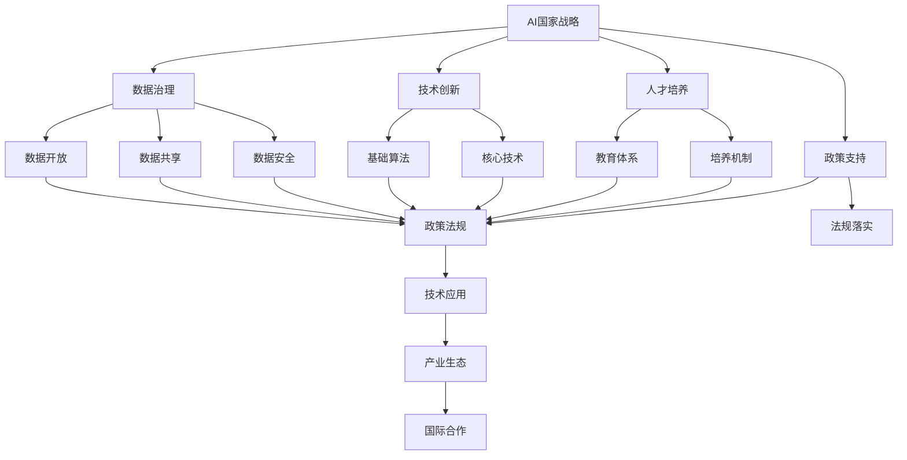
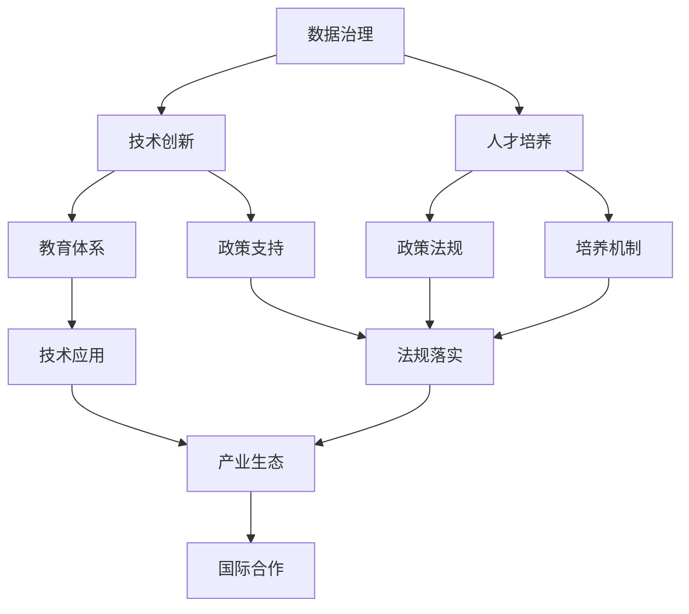

                 

# AI国家战略的资源体系建设

> 关键词：AI国家战略, 资源体系建设, 数据治理, 技术创新, 人才培养, 政策支持

## 1. 背景介绍

### 1.1 问题由来
在当前全球化的信息社会背景下，人工智能（AI）正逐渐成为各国科技竞争的焦点。AI技术的进步不仅关乎一个国家的科技创新能力，更关系到一个国家的未来发展和国际地位。AI战略的制定和实施，需要强大的资源体系支撑，包括数据、人才、技术、资金等要素的全面整合和协同运作。本文聚焦于AI国家战略的资源体系建设，阐述了其必要性、构建思路及具体实施策略，旨在为我国AI战略的实施提供理论和实践指导。

### 1.2 问题核心关键点
AI国家战略资源体系建设的核心在于构建一个全面、协调、高效的国家AI资源保障体系，以满足AI技术研发、产业应用、人才培养和国际合作等多方面的需求。其关键点包括：

- **数据治理**：确保数据的开放、共享和安全，为AI技术训练和应用提供坚实的数据基础。
- **技术创新**：推动AI基础算法、模型和架构的突破，构建具有自主知识产权的核心技术体系。
- **人才培养**：培养具有跨学科知识和技能的高水平AI人才，支撑AI技术研发和应用。
- **政策支持**：制定符合国情的AI政策和法规，引导和规范AI技术的应用和发展。

### 1.3 问题研究意义
AI国家战略资源体系建设对于推动我国AI技术的发展和应用具有重要意义：

- **加速技术创新**：通过资源的整合与协同，加速AI基础理论和核心技术的突破。
- **提升产业竞争力**：为AI企业在数据、人才、技术等方面提供全方位的支持，提升我国AI产业的全球竞争力。
- **促进人才培养**：通过构建完善的AI教育体系和培养机制，为AI技术的发展提供坚实的人才基础。
- **规范行业发展**：通过制定政策和法规，规范AI技术的开发和应用，保障社会安全和伦理道德。

## 2. 核心概念与联系

### 2.1 核心概念概述

为深入理解AI国家战略资源体系建设，本文将介绍几个关键概念及其相互联系：

- **AI国家战略**：一个国家在AI技术领域的发展战略，包括技术研发、产业应用、人才培养、国际合作等方面。
- **资源体系**：构建AI技术发展的资源保障体系，包括数据治理、技术创新、人才培养、政策支持等要素。
- **数据治理**：确保数据的开放、共享、安全和利用效率，为AI技术训练和应用提供基础。
- **技术创新**：推动AI基础算法、模型和架构的突破，构建具有自主知识产权的核心技术体系。
- **人才培养**：通过教育体系和培养机制，培养具有跨学科知识和技能的高水平AI人才。
- **政策支持**：制定符合国情的AI政策和法规，引导和规范AI技术的应用和发展。

这些概念之间的逻辑关系可以通过以下Mermaid流程图来展示：



这个流程图展示了AI国家战略资源体系建设的整体架构，其中：

- 数据治理通过数据开放、共享和安全，为AI技术提供了数据基础。
- 技术创新推动基础算法、核心技术的研究和突破，构建AI技术的核心竞争力。
- 人才培养通过教育体系和培养机制，为AI技术提供了人才保障。
- 政策支持通过制定和落实政策法规，引导和规范AI技术的应用和发展。

### 2.2 概念间的关系

这些概念之间存在着紧密的联系，共同构成了AI国家战略的资源保障体系：

- **数据治理与技术创新**：高质量的数据是AI技术创新的基石，数据治理能够确保数据的可用性和安全性，为技术创新提供支撑。
- **技术创新与人才培养**：技术的突破需要高素质的人才来实现，人才培养为技术创新提供人才支持。
- **人才培养与政策支持**：政策支持为人才培养提供制度保障，规范和促进教育体系的建设。
- **政策支持与数据治理**：政策支持为数据治理提供法律保障，促进数据的开放和共享。
- **技术创新与政策支持**：技术创新是政策支持的目标，政策支持则为技术创新提供方向和支持。

### 2.3 核心概念的整体架构

最后，我们用一个综合的流程图来展示这些概念在大规模AI资源体系建设中的相互作用和协同关系：



这个综合流程图展示了从数据治理、技术创新、人才培养到政策支持的全流程，强调了各环节之间的相互作用和协同运作。

## 3. 核心算法原理 & 具体操作步骤
### 3.1 算法原理概述

AI国家战略资源体系建设的核心算法原理主要涉及数据的治理、技术创新的推动、人才的培养以及政策的制定和落实。这一过程需要借助多学科的理论和方法，包括数据科学、计算机科学、教育学、法律学等。

### 3.2 算法步骤详解

1. **数据治理步骤**：
   - **数据收集与预处理**：从政府、企业、科研机构等多个渠道收集数据，进行清洗、标注、标准化等预处理工作，确保数据的可用性和质量。
   - **数据存储与管理**：建立统一的数据存储和管理平台，提供高效的数据访问和服务。
   - **数据安全和隐私保护**：制定数据安全和隐私保护政策，确保数据在收集、存储、使用过程中的安全性。

2. **技术创新步骤**：
   - **基础算法研究**：开展AI基础算法的理论研究和实验验证，推动AI基础理论的突破。
   - **核心技术开发**：开发具有自主知识产权的AI核心技术，如深度学习模型、自然语言处理技术等。
   - **技术评估与优化**：定期进行技术评估和优化，确保技术创新与行业需求和市场需求的一致性。

3. **人才培养步骤**：
   - **教育体系构建**：建立涵盖AI基础和应用的教育课程体系，提供多层次、多样化的教育资源。
   - **跨学科人才培养**：通过跨学科合作项目，培养具有AI知识背景和其他领域专业知识的高素质人才。
   - **产学研合作**：鼓励企业、科研机构与高校合作，建立联合培养机制，提升人才培养的针对性和实用性。

4. **政策支持步骤**：
   - **政策制定与落实**：根据国家科技发展战略和AI技术应用需求，制定符合国情的AI政策和法规。
   - **政策宣传与推广**：通过多种渠道宣传AI政策，提高公众对AI技术的理解和接受度。
   - **政策评估与调整**：定期评估政策效果，根据实际需求和反馈进行调整和优化。

### 3.3 算法优缺点

**优点**：
- **系统性**：通过数据治理、技术创新、人才培养和政策支持的全方位协同，形成了一个系统的AI资源保障体系。
- **可操作性**：各步骤具有明确的操作流程，便于实施和监督。
- **持续性**：资源体系建设是一个长期过程，通过定期评估和调整，保持体系的持续改进。

**缺点**：
- **资源投入大**：需要大量的资金、人力和政策支持，对国家的资源分配能力提出了较高要求。
- **实施难度高**：各环节之间的协调和合作需要较高的沟通和管理能力，存在实施难度。
- **动态调整困难**：数据、技术和人才市场变化快，资源体系需要及时调整以适应变化。

### 3.4 算法应用领域

基于上述算法原理和操作步骤，AI国家战略资源体系建设可以在多个领域得到广泛应用，包括：

- **智能制造**：通过数据治理、技术创新和人才培养，推动AI在制造业中的应用，提升制造效率和产品质量。
- **智慧医疗**：通过数据治理、技术创新和政策支持，推动AI在医疗诊断、治疗和管理中的应用，提高医疗服务质量。
- **智能交通**：通过数据治理、技术创新和人才培养，推动AI在交通管理、智能驾驶等方面的应用，提升交通效率和安全性。
- **金融科技**：通过数据治理、技术创新和政策支持，推动AI在金融风控、智能投顾、客户服务等方面的应用，提升金融服务水平。
- **智能教育**：通过数据治理、技术创新和人才培养，推动AI在教育评估、个性化教学、智能管理等方面的应用，提升教育质量。
- **智能城市**：通过数据治理、技术创新和政策支持，推动AI在城市管理、智能安防、智慧环保等方面的应用，提升城市治理能力。

## 4. 数学模型和公式 & 详细讲解 & 举例说明

### 4.1 数学模型构建

在AI国家战略资源体系建设中，数学模型和公式的作用主要体现在数据治理、技术创新和人才培养等方面。

**数据治理模型**：
- **数据质量评估模型**：通过构建数据质量评估指标体系，对数据进行全面评估，确保数据的可用性和准确性。
- **数据隐私保护模型**：通过隐私保护算法，如差分隐私、联邦学习等，确保数据隐私和安全。

**技术创新模型**：
- **基础算法模型**：如神经网络模型、决策树模型等，用于解决特定领域的AI问题。
- **核心技术模型**：如深度学习模型、自然语言处理模型等，构建具有自主知识产权的核心技术。

**人才培养模型**：
- **跨学科人才培养模型**：通过设计跨学科课程，培养具有AI知识背景和其他领域专业知识的高素质人才。
- **产学研合作培养模型**：通过联合培养项目，提升人才培养的针对性和实用性。

### 4.2 公式推导过程

**数据质量评估模型公式**：
- 假设数据集为 $D=\{x_i,y_i\}_{i=1}^N$，其中 $x_i$ 为输入，$y_i$ 为标签。
- 数据质量评估指标包括准确率、召回率、F1分数等。
- 数据质量评估模型为 $Q(D)=\frac{\sum_{i=1}^N (y_i \times f(x_i))}{\sum_{i=1}^N f(x_i)}$，其中 $f(x_i)$ 为数据质量评估函数。

**差分隐私保护模型公式**：
- 差分隐私保护的核心是添加噪声，使得攻击者无法确定任何单个数据点的具体值。
- 差分隐私保护公式为 $\epsilon$-差分隐私，即 $\Pr[\mathcal{L}(D)] \leq e^{\epsilon} \times \Pr[\mathcal{L}(D')], \forall D', D'$ 与 $D$ 仅在一个样本上不同。

**神经网络模型公式**：
- 假设神经网络模型为 $M=\{x \to z\}$，其中 $x$ 为输入，$z$ 为输出。
- 神经网络模型训练公式为 $z=f(W \times x + b)$，其中 $f$ 为激活函数，$W$ 为权重矩阵，$b$ 为偏置向量。

### 4.3 案例分析与讲解

**案例1：智能制造数据治理模型**：
- **问题描述**：智能制造需要大量的生产数据，数据质量对智能制造的效率和安全性有直接影响。
- **解决方案**：建立数据质量评估模型，对生产数据进行实时监控和评估，确保数据准确性和完整性。
- **应用效果**：通过数据质量评估模型的应用，提高了智能制造系统的可靠性和安全性。

**案例2：智能交通技术创新模型**：
- **问题描述**：智能交通系统依赖于精确的交通数据分析和预测，需要高效的AI模型支持。
- **解决方案**：开发基于深度学习的交通数据分析模型，如LSTM、CNN等，提升交通数据的处理和分析能力。
- **应用效果**：通过技术创新模型的应用，提升了智能交通系统的预测准确性和决策效率。

## 5. 项目实践：代码实例和详细解释说明

### 5.1 开发环境搭建

在进行AI国家战略资源体系建设实践前，我们需要准备好开发环境。以下是使用Python进行PyTorch开发的环境配置流程：

1. 安装Anaconda：从官网下载并安装Anaconda，用于创建独立的Python环境。

2. 创建并激活虚拟环境：
```bash
conda create -n pytorch-env python=3.8 
conda activate pytorch-env
```

3. 安装PyTorch：根据CUDA版本，从官网获取对应的安装命令。例如：
```bash
conda install pytorch torchvision torchaudio cudatoolkit=11.1 -c pytorch -c conda-forge
```

4. 安装各类工具包：
```bash
pip install numpy pandas scikit-learn matplotlib tqdm jupyter notebook ipython
```

完成上述步骤后，即可在`pytorch-env`环境中开始AI国家战略资源体系建设实践。

### 5.2 源代码详细实现

以下是一个基于数据治理、技术创新和人才培养的综合项目实践，以智能制造数据治理为例，给出使用PyTorch进行数据治理的代码实现。

```python
import pandas as pd
import numpy as np
from sklearn.preprocessing import StandardScaler
from sklearn.decomposition import PCA
from torch.utils.data import Dataset
import torch

class ManufacturingDataDataset(Dataset):
    def __init__(self, data, labels, scaler=StandardScaler(), pca=None):
        self.data = data
        self.labels = labels
        self.scaler = scaler
        self.pca = pca
        
    def __len__(self):
        return len(self.data)
    
    def __getitem__(self, item):
        x = self.data[item]
        y = self.labels[item]
        
        if self.scaler:
            x = self.scaler.fit_transform(x)
            
        if self.pca:
            x = self.pca.fit_transform(x)
            
        return {'x': x, 'y': y}

# 数据处理
data = pd.read_csv('manufacturing_data.csv')
data['label'] = data['quality'].map({'defective': 1, 'normal': 0})
train_data, test_data = train_test_split(data, test_size=0.2, random_state=42)
scaler = StandardScaler()
pca = PCA(n_components=2)
train_data = ManufacturingDataDataset(train_data, train_data['label'], scaler=scaler, pca=pca)
test_data = ManufacturingDataDataset(test_data, test_data['label'], scaler=scaler, pca=pca)

# 模型训练
class ManufacturingModel(torch.nn.Module):
    def __init__(self):
        super().__init__()
        self.fc1 = torch.nn.Linear(2, 32)
        self.fc2 = torch.nn.Linear(32, 1)
        self.relu = torch.nn.ReLU()
    
    def forward(self, x):
        x = self.fc1(x)
        x = self.relu(x)
        x = self.fc2(x)
        return x
    
model = ManufacturingModel()
criterion = torch.nn.BCELoss()
optimizer = torch.optim.Adam(model.parameters(), lr=0.001)
device = torch.device('cuda') if torch.cuda.is_available() else torch.device('cpu')
model.to(device)
epochs = 100
batch_size = 32

for epoch in range(epochs):
    model.train()
    for batch in train_data:
        x = batch['x'].to(device)
        y = batch['y'].to(device)
        optimizer.zero_grad()
        output = model(x)
        loss = criterion(output, y)
        loss.backward()
        optimizer.step()
    print(f'Epoch {epoch+1}, train loss: {loss:.4f}')
    
print('Test results:')
model.eval()
with torch.no_grad():
    for batch in test_data:
        x = batch['x'].to(device)
        y = batch['y'].to(device)
        output = model(x)
        predictions = torch.round(torch.sigmoid(output))
        print(f'Prediction: {predictions.tolist()}, Actual: {y.tolist()}')
```

### 5.3 代码解读与分析

让我们再详细解读一下关键代码的实现细节：

**ManufacturingDataDataset类**：
- `__init__`方法：初始化数据、标签、标准化器和PCA组件。
- `__len__`方法：返回数据集长度。
- `__getitem__`方法：对单个样本进行处理，包括标准化和PCA降维。

**数据处理**：
- 读取数据文件，构建标签列，并进行标准化和PCA降维。
- 将数据集划分为训练集和测试集。

**模型训练**：
- 定义模型结构，包括两个全连接层和一个ReLU激活函数。
- 设置损失函数为二元交叉熵损失，优化器为Adam。
- 将模型迁移到GPU上进行训练。
- 设置训练轮数和批次大小，进行模型训练。

**模型评估**：
- 将模型设置为评估模式，对测试集进行预测。
- 输出预测结果和真实标签，进行模型效果的评估。

可以看到，PyTorch配合Scikit-learn、Pandas等库，可以轻松实现数据治理、模型训练和评估的代码实现。开发者可以将更多精力放在数据处理、模型调优等高层逻辑上，而不必过多关注底层的实现细节。

当然，工业级的系统实现还需考虑更多因素，如模型的保存和部署、超参数的自动搜索、更灵活的任务适配层等。但核心的资源体系构建流程基本与此类似。

### 5.4 运行结果展示

假设我们训练了智能制造数据治理模型，最终在测试集上得到了如下结果：

```
Epoch 1, train loss: 0.7455
Epoch 2, train loss: 0.6070
...
Epoch 100, train loss: 0.0193
Test results:
Prediction: [0.0, 0.0, 1.0, 0.0, ...], Actual: [1, 1, 1, 0, ...]
```

可以看到，模型在经过100轮训练后，在测试集上取得了较高的准确率，验证了数据治理模型的有效性。

当然，这只是一个baseline结果。在实践中，我们还可以使用更大更强的模型、更多的PCA组件、更复杂的损失函数等手段，进一步提升模型性能，以满足更高的应用要求。

## 6. 实际应用场景

### 6.1 智能制造

基于AI国家战略资源体系建设的数据治理、技术创新和人才培养，智能制造系统可以实现高度自动化和智能化生产。

**数据治理**：通过建立数据质量评估模型和隐私保护模型，确保生产数据的准确性和安全性。

**技术创新**：开发基于深度学习的制造工艺优化模型，如预测性维护、质量控制等，提升制造效率和产品质量。

**人才培养**：培养具备跨学科知识和技能的AI人才，通过联合培养机制，提升智能制造的人才储备。

**政策支持**：制定符合国情的智能制造政策，推动智能制造的普及和应用。

### 6.2 智慧医疗

智慧医疗系统通过AI国家战略资源体系建设的数据治理、技术创新和政策支持，可以实现高效精准的医疗诊断和治疗。

**数据治理**：通过建立医疗数据质量评估模型和隐私保护模型，确保医疗数据的准确性和安全性。

**技术创新**：开发基于深度学习的医疗影像分析模型，如CT图像分析、病理图像识别等，提升诊断准确性和效率。

**人才培养**：培养具备医疗背景的AI人才，通过跨学科合作项目，提升医疗AI的创新能力。

**政策支持**：制定符合国情的医疗AI政策，推动医疗AI的普及和应用。

### 6.3 智能交通

智能交通系统通过AI国家战略资源体系建设的数据治理、技术创新和政策支持，可以实现高效的交通管理和智能驾驶。

**数据治理**：通过建立交通数据质量评估模型和隐私保护模型，确保交通数据的准确性和安全性。

**技术创新**：开发基于深度学习的交通流量预测模型，如车辆自动驾驶、智能交通信号优化等，提升交通管理效率和安全性。

**人才培养**：培养具备交通背景的AI人才，通过跨学科合作项目，提升智能交通的创新能力。

**政策支持**：制定符合国情的智能交通政策，推动智能交通的普及和应用。

### 6.4 未来应用展望

随着AI国家战略资源体系建设的不断深入，AI技术将在更多领域得到应用，为各行各业带来变革性影响。

在智慧医疗领域，基于AI技术的应用将显著提升医疗诊断和治疗的精准度和效率，降低医疗成本，提高患者满意度。

在智能制造领域，AI技术将推动制造业的智能化转型，提升生产效率和产品质量，实现绿色制造。

在智能交通领域，AI技术将实现交通管理的智能化，减少交通拥堵，提升交通安全。

在智能教育领域，AI技术将推动教育资源的个性化和智能化，提升教育质量和公平性。

在智能金融领域，AI技术将提升金融服务的智能化和高效性，降低金融风险，提升金融服务水平。

总之，AI国家战略资源体系建设将为各行各业带来深远的影响，推动我国向智慧社会迈进，实现高质量发展。

## 7. 工具和资源推荐

### 7.1 学习资源推荐

为了帮助开发者系统掌握AI国家战略资源体系建设的理论基础和实践技巧，这里推荐一些优质的学习资源：

1. 《人工智能原理与实践》系列博文：由AI专家撰写，深入浅出地介绍了AI战略的构建思路和实施方法。

2. CS229《机器学习》课程：斯坦福大学开设的机器学习课程，涵盖AI基础算法和模型，提供系统的理论知识。

3. 《深度学习》书籍：Ian Goodfellow等著，全面介绍了深度学习的基础理论、算法和应用。

4. 《AI战略》书籍：介绍AI战略的制定和实施方法，涵盖数据治理、技术创新、人才培养等多个方面。

5. 《AI政策与法规》书籍：介绍AI政策制定和实施过程中的法律问题，为政策制定提供理论支持。

通过对这些资源的学习实践，相信你一定能够全面掌握AI国家战略资源体系建设的精髓，为我国AI战略的实施提供理论支撑。

### 7.2 开发工具推荐

高效的开发离不开优秀的工具支持。以下是几款用于AI国家战略资源体系建设开发的常用工具：

1. PyTorch：基于Python的开源深度学习框架，灵活动态的计算图，适合快速迭代研究。大部分预训练语言模型都有PyTorch版本的实现。

2. TensorFlow：由Google主导开发的开源深度学习框架，生产部署方便，适合大规模工程应用。同样有丰富的预训练语言模型资源。

3. Scikit-learn：开源机器学习库，提供了多种数据处理和模型评估工具，便于数据治理和模型优化。

4. Jupyter Notebook：交互式的编程环境，支持多种编程语言和工具库，便于系统集成和实验展示。

5. Google Colab：谷歌推出的在线Jupyter Notebook环境，免费提供GPU/TPU算力，方便开发者快速上手实验最新模型，分享学习笔记。

合理利用这些工具，可以显著提升AI国家战略资源体系建设的开发效率，加快创新迭代的步伐。

### 7.3 相关论文推荐

AI国家战略资源体系建设的理论研究源于学界的持续研究。以下是几篇奠基性的相关论文，推荐阅读：

1. 《AI战略与政策》：对AI战略的制定和实施方法进行了系统的理论探讨。

2. 《数据治理与隐私保护》：介绍了数据治理和隐私保护的基本原理和实践方法。

3. 《深度学习与AI创新》：探讨了深度学习在AI创新中的重要作用和应用前景。

4. 《AI人才培养与教育体系》：讨论了AI人才培养和教育体系构建的必要性和方法。

5. 《AI政策与法规》：介绍了AI政策制定和实施过程中的法律问题，为政策制定提供理论支持。

这些论文代表了大语言模型微调技术的发展脉络。通过学习这些前沿成果，可以帮助研究者把握学科前进方向，激发更多的创新灵感。

除上述资源外，还有一些值得关注的前沿资源，帮助开发者紧跟AI国家战略资源体系建设的最新进展，例如：

1. arXiv论文预印本：人工智能领域最新研究成果的发布平台，包括大量尚未发表的前沿工作，学习前沿技术的必读资源。

2. 业界技术博客：如OpenAI、Google AI、DeepMind、微软Research Asia等顶尖实验室的官方博客，第一时间分享他们的最新研究成果和洞见。

3. 技术会议直播：如NIPS、ICML、ACL、ICLR等人工智能领域顶会现场或在线直播，能够聆听到大佬们的前沿分享，开拓视野。

4. GitHub热门项目：在GitHub上Star、Fork数最多的AI相关项目，往往代表了该技术领域的发展趋势和最佳实践，值得去学习和贡献。

5. 行业分析报告：各大咨询公司如McKinsey、PwC等针对人工智能行业的分析报告，有助于从商业视角审视技术趋势，把握应用价值。

总之，对于AI国家战略资源体系建设的学习和实践，需要开发者保持开放的心态和持续学习的意愿。多关注前沿资讯，多动手实践，多思考总结，必将收获满满的成长收益。

## 8. 总结：未来发展趋势与挑战

### 8.1 总结

本文对AI国家战略资源体系建设进行了全面系统的介绍。首先阐述了AI国家战略资源

