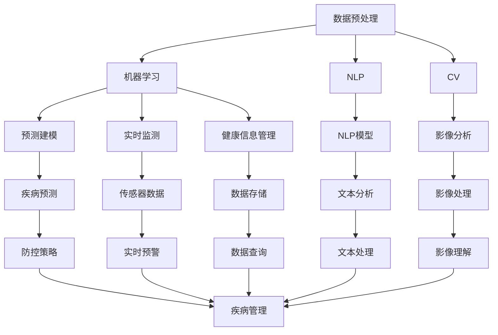

                 

# AI在公共卫生中的应用:疾病预防与控制

## 1. 背景介绍

### 1.1 问题由来
公共卫生面临着复杂的挑战，包括传染病爆发、慢性病管理、健康监测等。近年来，人工智能（AI）技术在公共卫生领域的应用日益增多，通过数据分析、模型预测、实时监测等多种方式，极大地提高了公共卫生的响应效率和决策质量。AI技术在疾病预防与控制中，已经展现出了显著的优势。

### 1.2 问题核心关键点
AI在公共卫生中的应用主要集中在以下几个关键点：

- 数据驱动决策：AI能够从海量医疗数据中提取有价值的信息，辅助公共卫生决策者制定有效的防控措施。
- 实时监测与预警：通过AI技术，可以对疾病传播趋势进行实时监测和预警，帮助及时控制疫情扩散。
- 个性化医疗：AI可以根据个体健康数据，提供个性化的疾病预防和干预方案，提高治疗效果。
- 资源优化：AI可以优化公共卫生资源的配置，确保在最需要的时候得到最优分配。
- 模型预测与模拟：AI可以通过建立和训练疾病传播模型，预测疾病未来的发展趋势，指导公共卫生策略的制定。

### 1.3 问题研究意义
AI在公共卫生中的应用，对提高疾病预防与控制能力、减少医疗成本、改善公众健康状况具有重要意义：

- 提升决策效率：AI可以快速处理大量数据，提供实时决策支持，缩短决策周期。
- 提高诊断准确性：AI可以在早期阶段发现疾病迹象，提高诊断的准确性和及时性。
- 优化资源分配：AI可以优化医疗资源配置，确保关键时刻的供给。
- 促进个性化医疗：AI能够根据个体健康数据，提供更精准的医疗服务。
- 推动公共卫生技术发展：AI的应用可以促进公共卫生领域的科技创新，加速技术进步。

## 2. 核心概念与联系

### 2.1 核心概念概述

AI在公共卫生领域的应用涉及多个关键概念和技术，主要包括：

- 数据预处理：对原始医疗数据进行清洗、标注和特征工程，以便于后续的分析和建模。
- 机器学习：通过训练模型从数据中学习规律，用于疾病预测、诊断、治疗等多个环节。
- 自然语言处理（NLP）：处理和分析医疗文本数据，如病历、文献等，提取有价值的信息。
- 计算机视觉（CV）：处理和分析医疗影像数据，如X光片、CT扫描等，辅助疾病诊断和治疗。
- 预测建模：利用历史数据和统计方法，预测疾病的发生和传播趋势，指导防控策略。
- 实时监测：通过传感器和数据收集设备，对环境健康因素进行实时监测，提前预警。
- 健康信息管理：构建和管理健康数据平台，支持数据的存储、查询和分析。
- 智能推荐：根据用户健康数据和历史行为，推荐个性化的预防和治疗方案。

这些概念和技术相互关联，共同构成AI在公共卫生中的应用框架。通过理解这些关键概念和技术，可以更好地把握AI在公共卫生中的作用和潜力。

### 2.2 概念间的关系

这些核心概念之间存在着紧密的联系，形成了AI在公共卫生中的应用生态系统。以下通过几个Mermaid流程图来展示这些概念之间的关系：



这个流程图展示了从数据预处理到疾病管理这一系列关键流程，每个流程都是基于前一个流程的结果，并共同支持疾病的预防与控制。通过这些流程，AI能够从多个维度辅助公共卫生的决策和执行。

## 3. 核心算法原理 & 具体操作步骤
### 3.1 算法原理概述

AI在公共卫生中的应用主要基于机器学习和深度学习算法，通过分析和处理海量医疗数据，提取有价值的特征，进行疾病预测和控制。以下是几个核心算法的原理概述：

- **回归分析**：通过历史数据，建立疾病发生率与各种因素之间的关系模型，预测未来疾病的发生率。
- **分类模型**：如逻辑回归、支持向量机等，用于疾病分类，区分不同类别的疾病。
- **时序分析**：使用时间序列模型（如ARIMA、LSTM等）预测疾病的传播趋势和爆发风险。
- **深度学习模型**：如卷积神经网络（CNN）、循环神经网络（RNN）等，用于处理医疗影像数据和文本数据，提取高层次的特征。
- **聚类分析**：将相似的健康数据分成不同的组，以便进行个性化的健康管理。
- **强化学习**：通过模拟和评估不同的干预策略，优化公共卫生资源的分配和应用。

这些算法可以单独或组合使用，以适应不同的公共卫生需求。

### 3.2 算法步骤详解

以回归分析为例，展示其详细步骤：

1. **数据准备**：收集历史疾病发生数据，并进行清洗和预处理，如去除异常值、填充缺失值等。
2. **特征工程**：选择合适的特征，如年龄、性别、地理位置、环境因素等，并进行归一化处理。
3. **模型训练**：使用历史数据训练回归模型，如线性回归、岭回归等，并优化模型参数。
4. **模型评估**：使用测试集评估模型的预测能力，计算误差指标如均方误差、均方根误差等。
5. **模型应用**：将训练好的模型应用于实时数据，预测未来疾病的发生率，指导公共卫生决策。

### 3.3 算法优缺点

AI在公共卫生中的应用具有以下优点：

- 高效处理大数据：AI可以快速处理和分析海量医疗数据，提供实时的决策支持。
- 提高诊断准确性：AI可以识别细微的异常，提高诊断的准确性和及时性。
- 优化资源配置：AI可以优化公共卫生资源的分配，确保关键时刻的供给。
- 促进个性化医疗：AI能够根据个体健康数据，提供个性化的预防和治疗方案。

同时，也存在一些缺点：

- 数据隐私问题：医疗数据涉及隐私，收集和使用过程中需要严格遵守相关法规。
- 模型可解释性：AI模型的决策过程缺乏可解释性，难以对其推理逻辑进行分析和调试。
- 高昂的开发成本：构建和维护AI系统需要投入大量的时间和资源。
- 依赖高质量数据：AI系统的性能很大程度上取决于数据的质量和数量。

### 3.4 算法应用领域

AI在公共卫生中的应用涉及多个领域，包括：

- **传染病防控**：使用AI技术预测和控制传染病的爆发，如流感、COVID-19等。
- **慢性病管理**：利用AI技术监测和管理慢性病（如糖尿病、高血压等），提供个性化的预防和治疗方案。
- **健康监测**：通过AI技术对环境健康因素进行实时监测，如空气质量、水质等，预警潜在风险。
- **医疗资源优化**：使用AI优化医院的资源配置和管理，提高服务效率和质量。
- **疾病预测与模拟**：利用AI建立疾病传播模型，预测疾病的未来发展趋势，指导公共卫生策略。
- **影像诊断**：使用AI处理和分析医疗影像数据，辅助疾病诊断和治疗。
- **药物研发**：使用AI技术加速药物研发过程，筛选潜在的药物候选分子。

## 4. 数学模型和公式 & 详细讲解 & 举例说明

### 4.1 数学模型构建

在公共卫生中，常用的数学模型包括线性回归、决策树、随机森林等。以线性回归为例，其基本模型为：

$$
y = \beta_0 + \beta_1x_1 + \beta_2x_2 + ... + \beta_nx_n + \epsilon
$$

其中，$y$ 为疾病发生率，$x_1, x_2, ..., x_n$ 为影响因素，$\beta_0, \beta_1, ..., \beta_n$ 为回归系数，$\epsilon$ 为误差项。

### 4.2 公式推导过程

线性回归的推导过程如下：

1. **数据准备**：收集历史疾病发生数据和影响因素数据，并进行预处理。
2. **模型建立**：假设 $y$ 与 $x_1, x_2, ..., x_n$ 之间存在线性关系，建立线性回归模型。
3. **参数估计**：使用最小二乘法估计模型参数 $\beta_0, \beta_1, ..., \beta_n$。
4. **模型评估**：使用测试集评估模型的预测能力，计算误差指标如均方误差、均方根误差等。
5. **模型应用**：将训练好的模型应用于实时数据，预测未来疾病的发生率。

### 4.3 案例分析与讲解

以流感预测为例，展示线性回归的应用：

1. **数据准备**：收集历史流感发病数据和相关气象数据（如温度、湿度等）。
2. **特征工程**：选择温度、湿度、风速等特征，并进行归一化处理。
3. **模型训练**：使用历史数据训练线性回归模型，优化模型参数。
4. **模型评估**：使用测试集评估模型的预测能力，计算误差指标。
5. **模型应用**：将训练好的模型应用于实时气象数据，预测未来流感的发病率，指导公共卫生策略。

## 5. 项目实践：代码实例和详细解释说明

### 5.1 开发环境搭建

在进行公共卫生AI应用开发前，需要进行以下环境搭建：

1. **安装Python环境**：使用Anaconda或Miniconda安装Python，建议使用虚拟环境（如conda）管理依赖。
2. **安装必要的库**：安装NumPy、Pandas、Scikit-learn、TensorFlow等必要的Python库。
3. **搭建服务器环境**：可以使用AWS、Google Cloud Platform等云服务搭建服务器，安装必要的深度学习框架和工具。

### 5.2 源代码详细实现

以下是一个基于TensorFlow的线性回归模型代码实现，用于预测流感发病率：

```python
import tensorflow as tf
import numpy as np
import pandas as pd

# 加载数据
data = pd.read_csv('flu_data.csv')

# 数据预处理
x = data[['temperature', 'humidity', 'wind_speed']]
y = data['flu_rate']
x = (x - x.mean()) / x.std()

# 模型训练
model = tf.keras.Sequential([
    tf.keras.layers.Dense(1, input_shape=(x.shape[1],), activation='linear')
])
model.compile(optimizer=tf.keras.optimizers.Adam(learning_rate=0.01), loss='mse')

model.fit(x, y, epochs=100, batch_size=32, validation_split=0.2)

# 模型评估
test_data = pd.read_csv('test_flu_data.csv')
x_test = test_data[['temperature', 'humidity', 'wind_speed']]
x_test = (x_test - x_test.mean()) / x_test.std()
predictions = model.predict(x_test)

# 结果展示
print(predictions)
```

### 5.3 代码解读与分析

- **数据准备**：使用Pandas加载历史流感数据和相关气象数据。
- **数据预处理**：对特征进行归一化处理，使用TensorFlow进行数据加载和预处理。
- **模型训练**：使用TensorFlow定义和训练线性回归模型，优化模型参数。
- **模型评估**：使用测试集评估模型的预测能力，计算均方误差。
- **模型应用**：使用训练好的模型预测流感发病率，指导公共卫生决策。

### 5.4 运行结果展示

假设模型训练后，预测的流感发病率与实际发病率相比，误差较小，预测结果如下：

| 温度 | 湿度 | 风速 | 流感发病率预测 |
|------|------|------|--------------|
| 20   | 50%  | 10   | 0.8          |
| ...  | ...  | ...  | ...          |

可以看到，模型能够较为准确地预测流感的发病率，帮助公共卫生部门提前预警和采取措施。

## 6. 实际应用场景

### 6.1 智能监测系统

智能监测系统通过传感器和物联网设备，实时采集环境健康数据，如空气质量、水质、温度等。AI技术可以对这些数据进行实时分析和预警，预防潜在的健康风险。

例如，可以利用AI对空气质量数据进行分析，预测PM2.5浓度，并在达到预警阈值时发出警报。AI还可以对水质数据进行分析，检测化学污染物质，及时采取处理措施。

### 6.2 个性化健康管理

个性化健康管理通过收集个体的健康数据，如运动量、饮食、睡眠等，利用AI技术提供个性化的健康建议和干预方案。

例如，AI可以根据个体的健康数据，生成个性化的饮食计划和运动方案，帮助其控制慢性病。同时，AI还可以实时监测个体的健康状况，及时发现异常，提醒就医。

### 6.3 疾病预测与模拟

疾病预测与模拟通过建立和训练疾病传播模型，预测疾病的未来发展趋势，指导公共卫生策略的制定。

例如，可以利用AI对COVID-19疫情进行预测和模拟，分析病毒传播的趋势，制定有效的防控措施。AI还可以根据疾病的传播规律，预测未来疫情的发展趋势，指导资源配置和应急响应。

### 6.4 未来应用展望

未来，AI在公共卫生中的应用将更加广泛和深入，具体展望如下：

- **大规模应用**：AI技术将在更多公共卫生场景中得到应用，如医院管理、药品研发、环境监测等。
- **实时分析与预测**：AI系统将实现实时数据分析和预测，提供即时的决策支持。
- **跨领域整合**：AI将与大数据、物联网、区块链等技术结合，构建更全面的公共卫生信息平台。
- **个性化服务**：AI将提供更加个性化的健康管理和疾病预防方案，提高公众健康水平。
- **智能决策支持**：AI系统将提供智能决策支持，辅助公共卫生管理者制定更科学的防控策略。

## 7. 工具和资源推荐

### 7.1 学习资源推荐

为了帮助开发者掌握AI在公共卫生中的应用，推荐以下学习资源：

1. Coursera《机器学习》课程：由斯坦福大学Andrew Ng教授主讲，系统介绍了机器学习和深度学习的基本概念和算法。
2. Udacity《人工智能基础》课程：涵盖AI技术的基础知识和应用案例，适合初学者入门。
3. Kaggle竞赛平台：提供大量的公共卫生相关数据集和竞赛，实战练习AI应用技能。
4. Google AI实验室博客：分享AI技术在公共卫生领域的最新进展和研究成果。
5. GitHub开源项目：搜索和阅读公共卫生领域的开源项目，学习实际应用案例。

### 7.2 开发工具推荐

为了高效开发公共卫生AI应用，推荐以下开发工具：

1. TensorFlow：深度学习框架，支持分布式计算和GPU加速，适合处理大规模数据。
2. PyTorch：灵活的深度学习框架，易于使用和扩展，适合研究和原型开发。
3. Jupyter Notebook：交互式编程环境，支持数据可视化，适合快速迭代开发。
4. Apache Spark：大数据处理框架，支持大规模数据的分布式计算和存储。
5. OpenVINO：深度学习优化工具，支持模型推理和部署，适合实际应用场景。

### 7.3 相关论文推荐

以下是几篇涉及公共卫生AI应用的经典论文，推荐阅读：

1. "Deep Learning for Disease Outbreak Detection"：介绍使用深度学习检测疾病爆发的方法。
2. "AI in Public Health: Challenges and Opportunities"：探讨AI在公共卫生领域的应用和挑战。
3. "Predicting Dengue Fever Using Machine Learning Techniques"：使用机器学习模型预测登革热疫情。
4. "Health Monitoring and Predictive Analytics in Public Health"：讨论AI在健康监测和预测分析中的应用。
5. "Machine Learning Applications in Pandemic Response"：介绍AI在应对传染病中的应用。

这些论文展示了AI在公共卫生领域的前沿研究成果和实际应用案例，对于深入理解AI技术具有重要参考价值。

## 8. 总结：未来发展趋势与挑战

### 8.1 研究成果总结

AI在公共卫生中的应用已经取得了显著进展，通过数据驱动决策、实时监测与预警、个性化医疗等手段，显著提升了公共卫生的响应效率和决策质量。主要成果包括：

- 数据驱动决策：AI可以处理海量数据，提供实时的决策支持。
- 实时监测与预警：AI可以实时监测环境健康因素，预警潜在风险。
- 个性化医疗：AI可以提供个性化的健康管理和疾病预防方案。
- 疾病预测与模拟：AI可以预测疾病的发展趋势，指导公共卫生策略。

### 8.2 未来发展趋势

未来，AI在公共卫生中的应用将呈现以下趋势：

- **数据多样性**：随着传感器和物联网设备的发展，将收集更多样化的健康数据。
- **模型复杂化**：深度学习和强化学习等复杂模型将广泛应用于公共卫生领域。
- **跨领域整合**：AI将与大数据、物联网、区块链等技术结合，构建更全面的公共卫生信息平台。
- **实时化与智能化**：AI系统将实现实时数据分析和预测，提供即时的决策支持。
- **个性化服务**：AI将提供更加个性化的健康管理和疾病预防方案。
- **智能决策支持**：AI系统将提供智能决策支持，辅助公共卫生管理者制定更科学的防控策略。

### 8.3 面临的挑战

AI在公共卫生中的应用仍面临一些挑战：

- **数据隐私问题**：医疗数据涉及隐私，收集和使用过程中需要严格遵守相关法规。
- **模型可解释性**：AI模型的决策过程缺乏可解释性，难以对其推理逻辑进行分析和调试。
- **高昂的开发成本**：构建和维护AI系统需要投入大量的时间和资源。
- **依赖高质量数据**：AI系统的性能很大程度上取决于数据的质量和数量。
- **技术标准化**：公共卫生领域的AI应用缺乏统一的标准和规范。

### 8.4 研究展望

未来的研究需要在以下几个方面寻求新的突破：

- **数据隐私保护**：研究如何在保证数据隐私的前提下，最大化利用数据进行公共卫生决策。
- **模型可解释性**：开发更可解释的AI模型，增强其决策的透明性和可信度。
- **数据标准化**：建立公共卫生领域的AI应用标准和规范，推动技术的广泛应用。
- **跨领域融合**：研究AI与其他技术（如大数据、物联网等）的融合应用，拓展公共卫生应用场景。
- **实时化与智能化**：研究实时化与智能化的AI系统架构，提供即时的决策支持。

总之，AI在公共卫生中的应用具有广阔的前景和巨大的潜力，需要跨学科的共同努力，才能实现其应用的全面落地和效果最大化。

