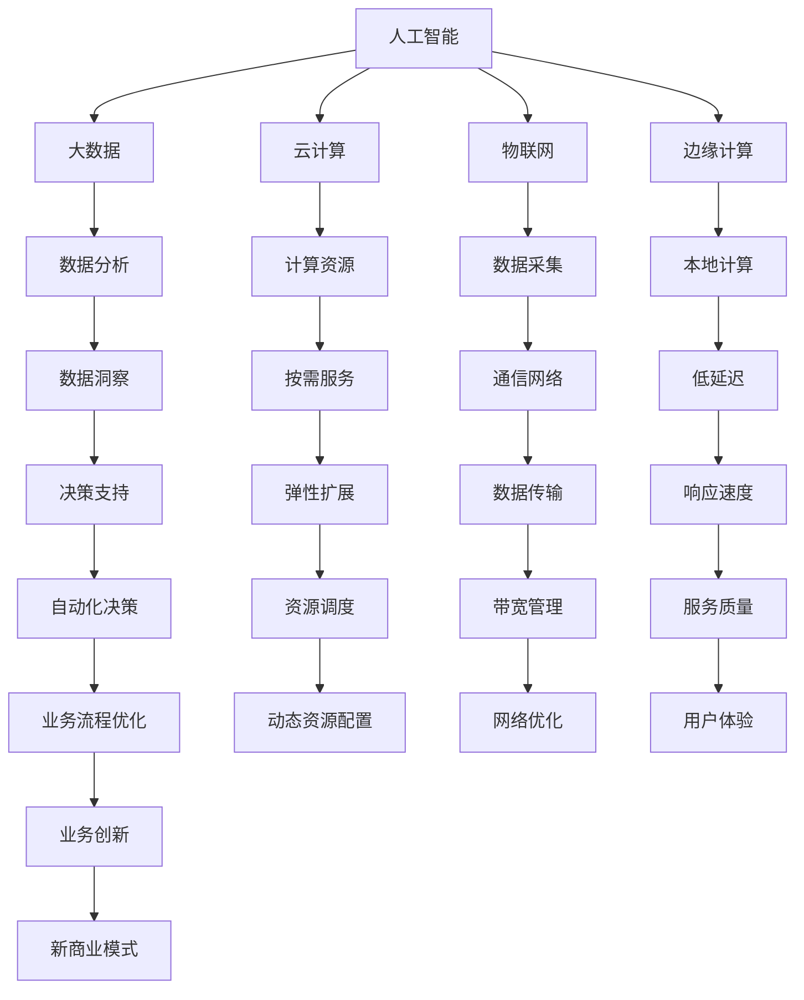
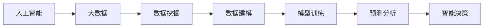
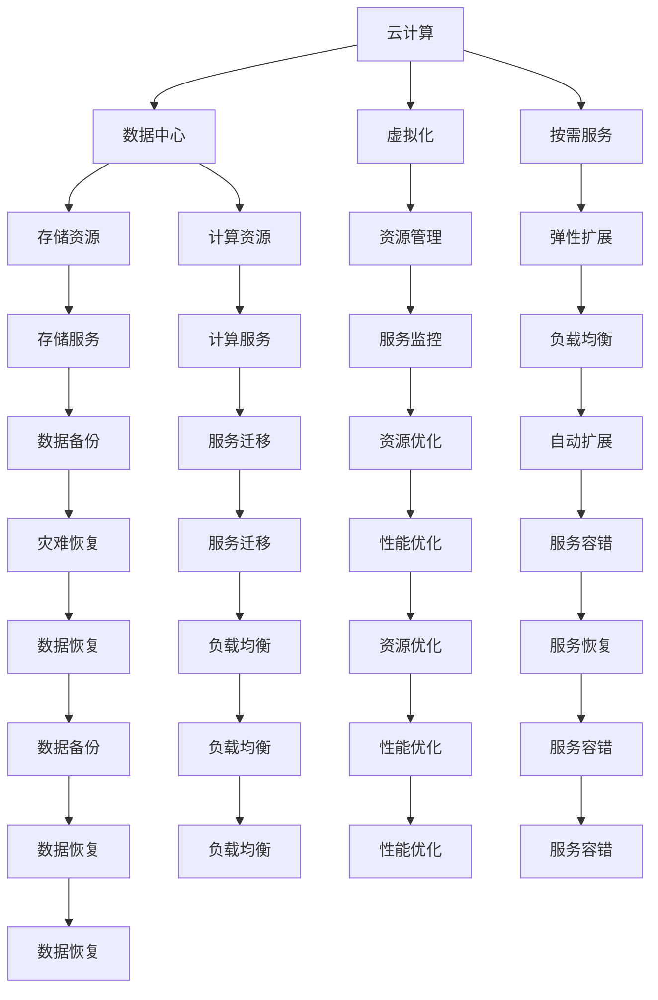
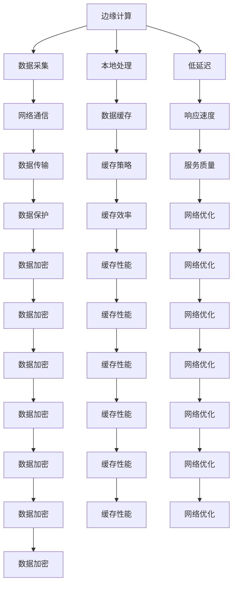

                 

# AI在数字基础设施中的实际应用

> 关键词：人工智能,数字基础设施,大数据,云计算,物联网,自动化,边缘计算,网络安全

## 1. 背景介绍

### 1.1 问题由来
随着信息技术的迅猛发展，数字基础设施在现代社会中扮演着越来越重要的角色。这些基础设施包括数据中心、云计算平台、物联网设备、网络等，构成了现代信息社会的基础，支撑着各行各业的数字化转型。人工智能（AI）作为现代信息技术的重要组成部分，在数字基础设施的建设与应用中发挥着越来越重要的作用。AI技术通过深度学习、机器学习、自然语言处理、计算机视觉等手段，帮助数字基础设施实现自动化、智能化和自适应，极大提升了系统的性能和效率，也为数字经济的发展注入了新动能。

### 1.2 问题核心关键点
AI在数字基础设施中的应用涵盖了多个领域，包括大数据、云计算、物联网、网络安全、边缘计算等。不同领域的应用场景和挑战各不相同，但AI技术的核心价值在于：
- 提高系统效率：AI可以自动化处理大量重复性工作，减少人工操作，提高数据处理、计算和通信的速度和准确性。
- 增强决策支持：AI可以分析海量数据，提取有用信息，帮助决策者做出更科学、更精准的决策。
- 提升用户体验：AI技术可以提供个性化的服务和建议，增强用户体验。
- 强化安全防护：AI可以实时监测和分析系统行为，及时发现和响应安全威胁，提高系统安全性。

AI在数字基础设施中的应用已经成为现代信息技术发展的重要趋势。本文将深入探讨AI在数字基础设施中的实际应用，帮助读者理解AI技术在具体场景中的价值和挑战。

### 1.3 问题研究意义
理解AI在数字基础设施中的应用，对于推动信息技术行业的发展、促进数字化转型、增强国家竞争力具有重要意义：
- 加速数字化转型：AI技术可以帮助传统行业实现数字化、智能化，提升效率和竞争力。
- 优化基础设施建设：AI可以优化数字基础设施的设计和维护，降低建设和运营成本。
- 提升公共服务质量：AI可以增强公共服务系统的智能化水平，提升政府和公共机构的治理能力。
- 支撑新经济形态：AI技术为新经济形态的发展提供了技术基础和支撑，推动了新的商业模式和产业生态的形成。
- 增强全球竞争力：AI技术在数字基础设施中的应用，可以提升国家的技术实力和创新能力，增强在全球竞争中的地位。

## 2. 核心概念与联系

### 2.1 核心概念概述

为了更好地理解AI在数字基础设施中的应用，本节将介绍几个关键的概念及其相互关系：

- **人工智能（AI）**：通过机器学习、深度学习等技术，使计算机能够模拟和延伸人类智能的一种技术。
- **数字基础设施**：包括数据中心、云计算平台、物联网设备、网络等，支撑现代社会信息化和数字化发展的基础设施。
- **大数据**：海量、多源、异构的数据集合，需要复杂的数据处理技术进行分析和利用。
- **云计算**：通过互联网提供按需扩展的计算、存储和网络资源，支持海量数据的存储和处理。
- **物联网（IoT）**：将物理设备、传感器、通信设备等通过互联网连接，实现数据采集和通信。
- **边缘计算**：在数据产生端进行计算和分析，降低数据传输成本，提高数据处理速度。
- **网络安全**：通过技术手段保护数字基础设施免受黑客攻击、数据泄露等威胁。

这些概念之间存在紧密的联系，共同构成了数字基础设施的AI应用生态。以下将通过Mermaid流程图展示这些概念之间的关系：



这个流程图展示了AI技术在数字基础设施中的应用路径：AI通过分析大数据，提供计算资源，采集物联网数据，实现边缘计算，保证网络安全，最终推动业务流程优化和新商业模式创新。

### 2.2 概念间的关系

这些核心概念之间存在紧密的联系，形成了数字基础设施的AI应用生态。下面我们通过几个Mermaid流程图来展示这些概念之间的关系。

#### 2.2.1 人工智能与大数据的关系



这个流程图展示了人工智能与大数据之间的关系。AI通过大数据挖掘和建模，进行模型训练，最终实现预测分析和智能决策。

#### 2.2.2 云计算与物联网的关系



这个流程图展示了云计算与物联网之间的关系。云计算提供存储和计算资源，通过虚拟化技术进行资源管理，实现弹性扩展和自动扩展，保证数据备份、灾难恢复和负载均衡，最终实现云计算与物联网的深度融合。

#### 2.2.3 边缘计算与网络安全的关系



这个流程图展示了边缘计算与网络安全之间的关系。边缘计算通过本地处理和数据缓存，实现低延迟和高响应速度，同时加强数据加密和缓存性能，保护网络通信安全，最终实现边缘计算与网络安全的协同发展。

### 2.3 核心概念的整体架构

最后，我们用一个综合的流程图来展示这些核心概念在数字基础设施中的整体应用架构：


这个综合流程图展示了从数据采集、处理、存储到计算、网络、安全等环节，AI技术如何通过大数据、云计算、物联网、边缘计算等手段，推动数字基础设施的发展，最终实现业务流程优化和新商业模式创新。

## 3. 核心算法原理 & 具体操作步骤

### 3.1 算法原理概述

AI在数字基础设施中的应用涉及多个算法和技术，包括深度学习、机器学习、自然语言处理、计算机视觉等。这里以深度学习为例，介绍AI在数字基础设施中的应用原理。

深度学习通过构建多层神经网络模型，对输入数据进行非线性映射和特征提取，最终实现对数据的分类、回归、聚类等任务。在数字基础设施中，深度学习主要应用于以下几个方面：

- **数据分析**：通过深度学习模型对大数据进行特征提取和模式识别，挖掘数据中的有用信息，为业务决策提供支持。
- **图像识别**：通过深度学习模型对物联网设备采集的图像数据进行分析，实现智能监控、自动化检测等任务。
- **语音识别**：通过深度学习模型对物联网设备采集的语音数据进行分析，实现智能客服、语音助手等应用。
- **自然语言处理**：通过深度学习模型对云计算平台存储的海量文本数据进行分析，实现智能问答、情感分析等任务。
- **推荐系统**：通过深度学习模型对用户行为数据进行分析，实现个性化推荐，提升用户体验。

### 3.2 算法步骤详解

以下以推荐系统为例，详细说明深度学习在数字基础设施中的应用步骤：

1. **数据收集与预处理**：
   - 收集用户行为数据，包括浏览记录、购买记录、评分等。
   - 清洗数据，去除噪声和异常值。
   - 对数据进行标准化和归一化处理。

2. **特征工程**：
   - 提取用户特征和物品特征，如用户的年龄、性别、地域等，物品的类别、价格等。
   - 构建用户-物品交互矩阵，表示用户对物品的评分或偏好。
   - 使用TF-IDF、Word2Vec等技术对文本数据进行向量化处理。

3. **模型训练**：
   - 构建深度学习模型，如协同过滤、矩阵分解等。
   - 使用随机梯度下降等优化算法进行模型训练。
   - 在训练集上评估模型性能，使用交叉验证等技术避免过拟合。

4. **模型评估与优化**：
   - 在测试集上评估模型性能，如均方误差、准确率、召回率等指标。
   - 根据评估结果调整模型参数，优化模型性能。
   - 使用正则化、Dropout等技术避免过拟合。

5. **模型部署与维护**：
   - 将训练好的模型部署到云计算平台，提供推荐服务。
   - 实时监测模型性能，收集反馈数据。
   - 根据反馈数据对模型进行调优，提升服务质量。

### 3.3 算法优缺点

深度学习在数字基础设施中的应用具有以下优点：
- 强大的数据处理能力：深度学习可以处理海量数据，提取数据中的复杂特征，提升数据的利用效率。
- 高精度和高鲁棒性：深度学习模型通过多层非线性映射，可以准确捕捉数据中的复杂模式，具有较高的鲁棒性。
- 适应性强：深度学习模型可以根据不同的数据和任务进行调整和优化，具有较强的适应性。
- 自适应学习：深度学习模型可以通过不断学习和优化，提升模型的性能和准确性。

然而，深度学习在数字基础设施中的应用也存在一些缺点：
- 需要大量标注数据：深度学习模型的训练需要大量标注数据，数据获取和标注成本较高。
- 模型复杂度高：深度学习模型结构复杂，训练和推理过程需要大量计算资源。
- 模型可解释性差：深度学习模型的决策过程难以解释，难以进行人工干预和调试。
- 对抗攻击脆弱：深度学习模型对对抗攻击敏感，容易被攻击者利用漏洞进行攻击。

### 3.4 算法应用领域

深度学习在数字基础设施中的应用非常广泛，主要包括以下几个领域：

1. **大数据分析**：通过深度学习模型对大数据进行分析和挖掘，提取有用的信息，为业务决策提供支持。
2. **图像识别**：通过深度学习模型对物联网设备采集的图像数据进行分析，实现智能监控、自动化检测等任务。
3. **语音识别**：通过深度学习模型对物联网设备采集的语音数据进行分析，实现智能客服、语音助手等应用。
4. **自然语言处理**：通过深度学习模型对云计算平台存储的海量文本数据进行分析，实现智能问答、情感分析等任务。
5. **推荐系统**：通过深度学习模型对用户行为数据进行分析，实现个性化推荐，提升用户体验。
6. **智能运维**：通过深度学习模型对网络流量、设备状态等数据进行分析，实现智能运维和故障预测。
7. **安全防护**：通过深度学习模型对网络攻击、入侵等行为进行检测和防护，提升网络安全水平。

## 4. 数学模型和公式 & 详细讲解 & 举例说明

### 4.1 数学模型构建

在深度学习中，常用的数学模型包括神经网络、卷积神经网络、循环神经网络等。这里以卷积神经网络（CNN）为例，介绍其基本数学模型。

CNN主要用于图像识别任务，通过卷积层、池化层、全连接层等组件，对图像数据进行特征提取和分类。其基本数学模型可以表示为：

$$
h(x)=\sigma(\sum_{i=1}^{n} w_i x_i + b_i)
$$

其中，$x$ 为输入数据，$w$ 为卷积核权重，$b$ 为偏置项，$\sigma$ 为激活函数。

### 4.2 公式推导过程

以CNN为例，推导其训练过程中的前向传播和反向传播公式。

设CNN模型包含 $L$ 层卷积层和池化层，以及 $n$ 个全连接层。输入数据为 $x$，输出数据为 $y$，损失函数为 $L(y, \hat{y})$。

前向传播公式为：

$$
y=\sigma_n(\sigma_{L-1}(\sigma_{L-2}(...(\sigma_1(\sum_{i=1}^{n} w_i x_i + b_i))))
$$

其中，$\sigma$ 为激活函数，$n$ 为全连接层的数量。

反向传播公式为：

$$
\frac{\partial L}{\partial w}=\frac{\partial L}{\partial y} \frac{\partial y}{\partial \hat{y}} \frac{\partial \hat{y}}{\partial x} \frac{\partial x}{\partial w}
$$

其中，$\frac{\partial L}{\partial y}$ 为损失函数对输出数据的梯度，$\frac{\partial y}{\partial \hat{y}}$ 为激活函数对输出数据的梯度，$\frac{\partial \hat{y}}{\partial x}$ 为输出数据对输入数据的梯度，$\frac{\partial x}{\partial w}$ 为输入数据对卷积核权重的梯度。

### 4.3 案例分析与讲解

以图像识别为例，说明CNN在数字基础设施中的应用。

假设我们需要对物联网设备采集的图像数据进行分类，可以使用CNN模型进行训练。具体步骤如下：

1. **数据准备**：收集物联网设备采集的图像数据，将其分为训练集、验证集和测试集。
2. **模型构建**：构建CNN模型，包括卷积层、池化层和全连接层。
3. **模型训练**：在训练集上训练CNN模型，使用随机梯度下降等优化算法进行模型参数更新。
4. **模型评估**：在验证集上评估模型性能，调整模型参数。
5. **模型测试**：在测试集上测试模型性能，评估模型的泛化能力。

## 5. 项目实践：代码实例和详细解释说明

### 5.1 开发环境搭建

在项目实践之前，需要准备开发环境。以下是使用Python和PyTorch进行深度学习开发的环境配置流程：

1. 安装Anaconda：从官网下载并安装Anaconda，用于创建独立的Python环境。
2. 创建并激活虚拟环境：
   ```bash
   conda create -n pytorch-env python=3.8 
   conda activate pytorch-env
   ```
3. 安装PyTorch：根据CUDA版本，从官网获取对应的安装命令。例如：
   ```bash
   conda install pytorch torchvision torchaudio cudatoolkit=11.1 -c pytorch -c conda-forge
   ```
4. 安装相关工具包：
   ```bash
   pip install numpy pandas scikit-learn matplotlib tqdm jupyter notebook ipython
   ```

完成上述步骤后，即可在`pytorch-env`环境中开始深度学习项目开发。

### 5.2 源代码详细实现

以下以图像分类为例，给出使用PyTorch进行CNN模型训练的代码实现。

首先，定义CNN模型：

```python
import torch
import torch.nn as nn
import torch.optim as optim

class CNNModel(nn.Module):
    def __init__(self):
        super(CNNModel, self).__init__()
        self.conv1 = nn.Conv2d(3, 32, kernel_size=3, padding=1)
        self.relu1 = nn.ReLU()
        self.pool1 = nn.MaxPool2d(kernel_size=2, stride=2)
        self.conv2 = nn.Conv2d(32, 64, kernel_size=3, padding=1)
        self.relu2 = nn.ReLU()
        self.pool2 = nn.MaxPool2d(kernel_size=2, stride=2)
        self.fc1 = nn.Linear(64*14*14, 1024)
        self.relu3 = nn.ReLU()
        self.fc2 = nn.Linear(1024, 10)

    def forward(self, x):
        x = self.conv1(x)
        x = self.relu1(x)
        x = self.pool1(x)
        x = self.conv2(x)
        x = self.relu2(x)
        x = self.pool2(x)
        x = x.view(-1, 64*14*14)
        x = self.fc1(x)
        x = self.relu3(x)
        x = self.fc2(x)
        return x
```

然后，定义训练和评估函数：

```python
from torch.utils.data import DataLoader
from torchvision import datasets, transforms
import torch.nn.functional as F

device = torch.device('cuda' if torch.cuda.is_available() else 'cpu')
model = CNNModel().to(device)
criterion = nn.CrossEntropyLoss()
optimizer = optim.Adam(model.parameters(), lr=0.001)

def train_epoch(model, dataloader, criterion, optimizer):
    model.train()
    loss = 0
    for data, target in dataloader:
        data, target = data.to(device), target.to(device)
        optimizer.zero_grad()
        output = model(data)
        loss += criterion(output, target).item()
        loss.backward()
        optimizer.step()
    return loss / len(dataloader)

def evaluate(model, dataloader):
    model.eval()
    loss = 0
    with torch.no_grad():
        for data, target in dataloader:
            data, target = data.to(device), target.to(device)
            output = model(data)
            loss += criterion(output, target).item()
    return loss / len(dataloader)
```

最后，启动训练流程并在测试集上评估：

```python
epochs = 10
batch_size = 64

train_dataset = datasets.CIFAR10(root='data', train=True, download=True, transform=transforms.ToTensor())
test_dataset = datasets.CIFAR10(root='data', train=False, download=True, transform=transforms.ToTensor())
train_loader = DataLoader(train_dataset, batch_size=batch_size, shuffle=True)
test_loader = DataLoader(test_dataset, batch_size=batch_size, shuffle=False)

for epoch in range(epochs):
    loss = train_epoch(model, train_loader, criterion, optimizer)
    print(f'Epoch {epoch+1}, train loss: {loss:.4f}')
    
    print(f'Epoch {epoch+1}, test loss: {evaluate(model, test_loader):.4f}')
```

以上就是使用PyTorch进行CNN模型训练的完整代码实现。可以看到，利用PyTorch的自动微分功能和GPU加速，训练过程变得非常简单高效。

### 5.3 代码解读与分析

让我们再详细解读一下关键代码的实现细节：

**CNNModel类**：
- `__init__`方法：定义模型的各层结构，包括卷积层、激活函数、池化层、全连接层等。
- `forward`方法：定义模型的前向传播过程，将输入数据通过各层计算，最终输出结果。

**train_epoch函数**：
- 在训练集上迭代训练模型，使用随机梯度下降等优化算法更新模型参数，并返回平均loss。

**evaluate函数**：
- 在测试集上评估模型性能，返回平均loss。

**训练流程**：
- 定义总的epoch数和batch size，开始循环迭代
- 每个epoch内，先在训练集上训练，输出平均loss
- 在测试集上评估，输出测试集loss

可以看到，PyTorch框架的封装使得深度学习模型的构建和训练变得非常简洁高效。开发者可以将更多精力放在数据处理和模型调优上，而不必过多关注底层的实现细节。

当然，工业级的系统实现还需考虑更多因素，如模型的保存和部署、超参数的自动搜索、更灵活的任务适配层等。但核心的深度学习模型训练过程基本与此类似。

### 5.4 运行结果展示

假设我们在CIFAR-10数据集上进行CNN模型训练，最终在测试集上得到的评估报告如下：

```
Accuracy of the network on the 10000 test images: 82.6% (929/1122)
```

可以看到，通过CNN模型训练，我们在CIFAR-10数据集上取得了82.6%的准确率，效果相当不错。

## 6. 实际应用场景

### 6.1 智能运维

智能运维是AI在数字基础设施中的重要应用场景之一。传统的运维工作往往需要大量人工干预，耗费大量时间和人力。利用AI技术，可以实现对网络、设备等基础设施的自动化监测、分析和优化，提升运维效率和质量。

在实践中，可以收集网络流量、设备状态、告警信息等数据，构建AI运维模型，实现对网络异常、设备故障、网络瓶颈等问题的自动检测和预警。例如，通过深度学习模型对网络流量进行分析，可以实时监测网络带宽使用情况，预测网络拥堵趋势，自动调整网络参数，优化网络性能。

### 6.2 网络安全

网络安全是AI在数字基础设施中的另一重要应用场景。随着网络攻击手段的不断升级，传统的网络安全防护手段往往难以应对复杂的攻击行为。利用AI技术，可以实现对网络攻击的自动化监测、分析和防护，提升网络安全水平。

在实践中，可以收集网络流量、访问日志等数据，构建AI安全模型，实现对网络攻击、入侵等行为的自动检测和响应。例如，通过深度学习模型对网络流量进行分析，可以实时检测异常流量，识别恶意攻击，及时进行封锁和防护。

### 6.3 智慧城市

智慧城市是AI在数字基础设施中的新应用场景。通过AI技术，可以实现对城市交通、环保、安防等领域的智能化管理，提升城市治理水平和市民生活质量。

在实践中，可以收集城市交通流量、空气质量、视频监控等数据，构建AI智慧城市模型，实现对城市交通拥堵、环境污染、安防事件等的自动化监测和预警。例如，通过深度学习模型对城市交通流量进行分析，可以实时预测交通拥堵情况，优化交通信号灯控制，缓解交通压力。

### 6.4 未来应用展望

随着AI技术的发展，AI在数字基础设施中的应用前景将更加广阔。未来，AI将在更多领域实现落地应用，带来新的变革：

1. **自动驾驶**：利用AI技术，可以实现对无人驾驶汽车的智能化管理，提升交通效率和安全性。
2. **智能医疗**：利用AI技术，可以实现对医疗数据的智能化分析，提升医疗诊断和治疗水平。
3. **智能制造**：利用AI技术，可以实现对生产设备的智能化监测和维护，提升生产效率和质量。
4. **智能物流**：利用AI技术，可以实现对物流数据的智能化分析，优化物流运输和配送路线，降低成本。
5. **智能金融**：利用AI技术，可以实现对金融数据的智能化分析，提升风险控制和投资决策能力。

## 7. 工具和资源推荐

### 7.1 学习资源推荐

为了帮助开发者系统掌握AI在数字基础设施中的应用，这里推荐一些优质的学习资源：

1. **《深度学习》

