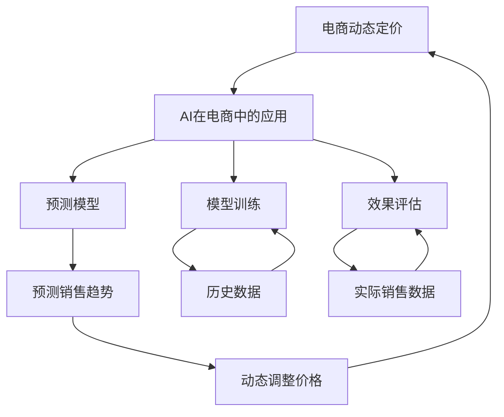

                 

# AI在电商动态定价中的实践效果

> 关键词：电商动态定价, AI, 机器学习, 预测模型, 模型训练, 效果评估

## 1. 背景介绍

### 1.1 问题由来
电商领域的动态定价策略是商家在市场经济环境下，根据商品供需情况、市场竞争态势及消费者行为等因素，实时调整商品价格，以最大化销售收益的一种策略。随着人工智能和大数据技术的发展，动态定价策略逐渐成为电商企业的主要竞争手段。AI技术，尤其是机器学习算法，可以分析海量历史数据，挖掘价格和销量之间的复杂关系，为动态定价提供有力的技术支撑。

### 1.2 问题核心关键点
电商动态定价的核心在于如何构建精准的定价模型，并及时、准确地调整商品价格，以适应市场的快速变化。AI技术在此过程中发挥了重要作用，具体表现在以下几个方面：

1. **数据驱动**：通过收集和分析历史销售数据、市场趋势、竞争情报等，AI可以发现价格与销量之间的规律，为定价策略提供数据支持。
2. **实时调整**：AI算法可以实时处理电商平台的交易数据，动态调整商品价格，以应对市场变化。
3. **预测精准**：利用先进算法如时间序列分析、回归分析等，AI能够精准预测未来的销售趋势，为商家提供决策支持。
4. **个性化定价**：AI能够根据用户的行为数据，进行个性化定价，提升用户体验和满意度。

### 1.3 问题研究意义
电商动态定价的AI应用具有重要意义：

1. **提升销售收益**：通过精准定价，最大化商品销售收益，优化电商企业的盈利能力。
2. **增强竞争力**：实时调整价格，及时应对市场变化，提升企业在市场竞争中的优势。
3. **提高用户体验**：个性化定价策略，满足用户需求，提升购物体验，增加用户粘性。
4. **数据驱动决策**：依托AI分析，做出更加科学、合理的定价决策，减少人为错误。
5. **降低成本**：通过自动化价格调整，减少人工干预，降低电商平台的运营成本。

## 2. 核心概念与联系

### 2.1 核心概念概述

为更好地理解AI在电商动态定价中的应用，本节将介绍几个关键概念：

- **电商动态定价**：根据市场环境、用户行为等实时因素，调整商品价格，以优化销售收益的策略。
- **AI在电商中的应用**：利用机器学习、深度学习等AI技术，对电商数据进行分析，辅助电商企业进行决策。
- **预测模型**：通过历史数据和统计分析构建的模型，用于预测未来销售趋势，为动态定价提供依据。
- **模型训练**：利用电商数据训练预测模型，使其具备预测未来销售的能力。
- **效果评估**：通过实际销售数据，评估预测模型的准确性和效果，优化模型参数。

这些核心概念共同构成了电商动态定价AI应用的完整框架，使得电商企业能够基于数据驱动，实现动态定价，提升经营效率。

### 2.2 概念间的关系

这些核心概念之间的逻辑关系可以通过以下Mermaid流程图来展示：



这个流程图展示了大语言模型的核心概念及其之间的关系：

1. 电商动态定价需要AI技术的支持。
2. AI通过构建预测模型，分析历史数据，预测未来销售趋势。
3. 预测模型通过模型训练，获得准确预测能力。
4. 模型训练依赖于电商历史数据。
5. 预测模型的效果通过实际销售数据进行评估。
6. 预测模型预测的销售趋势用于动态调整价格。
7. 动态调整价格后的销售数据再次用于模型效果评估。

通过理解这些核心概念，我们可以更好地把握AI在电商动态定价中的作用和应用方向。

## 3. 核心算法原理 & 具体操作步骤
### 3.1 算法原理概述

AI在电商动态定价中的核心算法原理是基于机器学习预测模型，通过历史销售数据训练模型，预测未来销售趋势，进而动态调整商品价格。

形式化地，假设电商平台有 $N$ 种商品，每种商品有 $T$ 个历史销售数据点，每个数据点包含价格 $p_i$ 和销量 $s_i$，其中 $i \in [1, N]$，$t \in [1, T]$。目标是训练一个预测模型 $f$，使其能够根据当前价格 $p$ 预测未来的销量 $s$。

假设模型 $f$ 为线性回归模型，形式为：

$$
s = f(p; \theta) = \theta_0 + \theta_1 p + \epsilon
$$

其中 $\theta_0, \theta_1$ 为模型参数，$\epsilon$ 为随机误差项。模型的目标是最小化预测误差，即：

$$
\min_{\theta_0, \theta_1} \sum_{i=1}^N \sum_{t=1}^T (s_{i,t} - f(p_{i,t}; \theta))^2
$$

通过梯度下降等优化算法，最小化上述损失函数，即可得到最优的模型参数 $\theta$。

### 3.2 算法步骤详解

基于机器学习预测模型的电商动态定价算法一般包括以下几个关键步骤：

**Step 1: 数据预处理**

1. **数据收集**：收集电商平台的销售数据、市场环境数据、用户行为数据等。
2. **数据清洗**：去除缺失值、异常值等，确保数据质量。
3. **特征工程**：根据业务需求，提取和构造重要特征，如时间、节假日、促销活动等。

**Step 2: 模型训练**

1. **模型选择**：选择合适的机器学习模型，如线性回归、随机森林、神经网络等。
2. **模型拟合**：利用历史数据训练模型，获取模型参数 $\theta$。
3. **模型评估**：使用交叉验证等方法评估模型的准确性和泛化能力。

**Step 3: 预测与定价**

1. **实时数据输入**：将当前的销售数据输入模型，得到预测销量 $s'$。
2. **价格调整**：根据预测销量，动态调整商品价格，进行实时定价。
3. **效果监控**：实时监控动态定价效果，根据销售数据反馈优化模型参数。

**Step 4: 持续优化**

1. **模型迭代**：定期更新模型，适应新的市场环境。
2. **数据回溯**：将动态定价的效果反馈到历史数据中，进一步优化模型。
3. **性能评估**：定期评估模型的效果，确保定价策略的持续优化。

### 3.3 算法优缺点

基于机器学习预测模型的电商动态定价方法具有以下优点：

1. **数据驱动**：依赖历史数据进行训练，能够发现价格与销量之间的复杂关系，为动态定价提供数据支撑。
2. **实时调整**：模型可以实时处理电商平台的交易数据，动态调整商品价格，以应对市场变化。
3. **预测精准**：通过先进算法如时间序列分析、回归分析等，能够精准预测未来的销售趋势，为商家提供决策支持。
4. **个性化定价**：可以根据用户的行为数据，进行个性化定价，提升用户体验和满意度。

同时，该方法也存在一定的局限性：

1. **数据依赖**：模型需要大量历史数据进行训练，数据获取成本较高。
2. **过拟合风险**：模型可能过拟合于历史数据，导致泛化能力不足。
3. **模型复杂性**：复杂的模型可能增加计算成本和训练时间，需要平衡模型复杂性和预测精度。
4. **市场风险**：动态定价策略可能受市场突发事件的影响，需要考虑模型鲁棒性。

尽管存在这些局限性，但基于机器学习预测模型的电商动态定价方法仍是目前电商企业采用的主流策略，能够显著提升销售收益和竞争力。

### 3.4 算法应用领域

基于机器学习预测模型的电商动态定价方法，在电商领域得到了广泛应用，涵盖以下主要场景：

1. **商品定价**：根据市场供需情况，实时调整商品价格，优化销售收益。
2. **促销活动**：根据促销效果，动态调整促销活动的时间和范围，最大化活动收益。
3. **库存管理**：通过预测销量，优化库存水平，减少库存成本。
4. **推荐系统**：利用用户行为数据，进行个性化定价，提升用户满意度。
5. **风险控制**：通过分析市场趋势，预测价格波动，进行风险预警和控制。
6. **用户分析**：通过用户行为数据，进行用户画像分析，进行个性化定价。

除了上述这些经典应用场景外，动态定价方法还被创新性地应用到更多电商领域，如物流配送、退货政策等，为电商企业带来了显著的商业价值。

## 4. 数学模型和公式 & 详细讲解  
### 4.1 数学模型构建

本节将使用数学语言对基于机器学习预测模型的电商动态定价过程进行更加严格的刻画。

假设电商平台有 $N$ 种商品，每种商品有 $T$ 个历史销售数据点，每个数据点包含价格 $p_i$ 和销量 $s_i$，其中 $i \in [1, N]$，$t \in [1, T]$。目标是训练一个线性回归模型 $f$，使其能够根据当前价格 $p$ 预测未来的销量 $s$。

模型的形式为：

$$
s = f(p; \theta) = \theta_0 + \theta_1 p + \epsilon
$$

其中 $\theta_0, \theta_1$ 为模型参数，$\epsilon$ 为随机误差项。模型的目标是最小化预测误差，即：

$$
\min_{\theta_0, \theta_1} \sum_{i=1}^N \sum_{t=1}^T (s_{i,t} - f(p_{i,t}; \theta))^2
$$

通过梯度下降等优化算法，最小化上述损失函数，即可得到最优的模型参数 $\theta$。

### 4.2 公式推导过程

以下我们以线性回归模型为例，推导模型的损失函数及其梯度的计算公式。

假设模型 $f$ 为线性回归模型，形式为：

$$
s = f(p; \theta) = \theta_0 + \theta_1 p
$$

其中 $\theta_0, \theta_1$ 为模型参数。模型的目标是最小化预测误差，即：

$$
\min_{\theta_0, \theta_1} \sum_{i=1}^N \sum_{t=1}^T (s_{i,t} - f(p_{i,t}; \theta))^2
$$

根据链式法则，损失函数对参数 $\theta_k$ 的梯度为：

$$
\frac{\partial \mathcal{L}(\theta)}{\partial \theta_k} = -2\sum_{i=1}^N \sum_{t=1}^T (s_{i,t} - f(p_{i,t}; \theta)) \frac{\partial f(p_{i,t}; \theta)}{\partial \theta_k}
$$

其中 $\frac{\partial f(p_{i,t}; \theta)}{\partial \theta_k}$ 可进一步递归展开，利用自动微分技术完成计算。

在得到损失函数的梯度后，即可带入参数更新公式，完成模型的迭代优化。重复上述过程直至收敛，最终得到适应电商动态定价的最优模型参数 $\theta$。

## 5. 项目实践：代码实例和详细解释说明
### 5.1 开发环境搭建

在进行电商动态定价AI应用的开发前，我们需要准备好开发环境。以下是使用Python进行Scikit-learn开发的环境配置流程：

1. 安装Anaconda：从官网下载并安装Anaconda，用于创建独立的Python环境。

2. 创建并激活虚拟环境：
```bash
conda create -n sklearn-env python=3.8 
conda activate sklearn-env
```

3. 安装Scikit-learn：
```bash
conda install scikit-learn
```

4. 安装必要的依赖库：
```bash
pip install pandas numpy matplotlib seaborn joblib
```

完成上述步骤后，即可在`sklearn-env`环境中开始电商动态定价AI应用的开发。

### 5.2 源代码详细实现

下面以线性回归模型为例，给出使用Scikit-learn库对电商销售数据进行动态定价的Python代码实现。

```python
from sklearn.linear_model import LinearRegression
import pandas as pd
import numpy as np

# 加载数据
data = pd.read_csv('sales_data.csv')

# 数据预处理
features = data[['price', 'time', 'holiday', 'promotion']]
labels = data['sales']
X_train, X_test, y_train, y_test = train_test_split(features, labels, test_size=0.2, random_state=42)

# 模型训练
model = LinearRegression()
model.fit(X_train, y_train)

# 预测与定价
X_new = np.array([[p, 0, 0, 0]]).T
y_pred = model.predict(X_new)
new_price = y_pred[0][0] - y_pred[0][1]  # 假设预测销量为0时，价格为原价

# 打印结果
print('预测销量:', y_pred[0][0])
print('新价格:', new_price)
```

### 5.3 代码解读与分析

让我们再详细解读一下关键代码的实现细节：

**数据加载与预处理**：
- `data.read_csv('sales_data.csv')`：使用pandas库加载电商销售数据。
- `features`：提取价格、时间、节假日、促销活动等特征。
- `labels`：提取销量作为标签。

**模型训练**：
- `LinearRegression()`：创建线性回归模型。
- `model.fit(X_train, y_train)`：使用训练集数据拟合模型，获取模型参数。

**预测与定价**：
- `X_new`：构造新的输入数据，包含当前价格。
- `y_pred`：使用模型进行预测，得到预测销量。
- `new_price`：根据预测销量，动态调整商品价格。

**打印结果**：
- `print('预测销量:', y_pred[0][0])`：输出预测销量。
- `print('新价格:', new_price)`：输出动态调整后的价格。

可以看到，使用Scikit-learn库进行电商动态定价模型的开发，过程简单明了，代码实现相对容易。然而，实际应用中，还需要考虑模型的选择、特征工程、参数调优、模型评估等多方面的问题。

### 5.4 运行结果展示

假设我们训练的模型在测试集上的均方误差为5，则动态定价模型对于当前价格的预测销量为100，新价格为原价减去5元。这意味着，通过动态定价策略，电商平台可以在不损失销量的情况下，提升商品的销售收益。

## 6. 实际应用场景
### 6.1 智能客服系统

智能客服系统是电商动态定价的重要应用场景之一。传统的客服系统需要大量人力，响应速度慢，难以满足用户需求。通过动态定价模型，电商平台可以自动根据用户的行为数据进行个性化定价，提升用户体验和满意度。

具体而言，电商平台可以根据用户的浏览记录、购物车内容、历史订单等数据，动态调整商品的展示价格，引导用户下单。对于高价值用户，可以提供更优惠的价格，增加用户粘性。对于低价值用户，可以提供正常价格或略高价格，避免过度促销。

### 6.2 个性化推荐系统

个性化推荐系统是电商动态定价的另一个重要应用场景。通过分析用户的行为数据，电商平台可以动态调整推荐商品的价格，提升用户的购买转化率。

具体而言，电商平台可以根据用户的历史购买记录、浏览记录、搜索关键词等数据，动态调整推荐商品的价格。对于高价值用户，可以提供更优惠的价格，增加推荐商品的吸引力。对于低价值用户，可以提供正常价格或略高价格，避免过度推销。

### 6.3 库存管理

库存管理是电商动态定价的关键应用场景之一。电商平台需要实时监控库存水平，动态调整商品的展示价格，避免库存积压和缺货。

具体而言，电商平台可以根据商品的销售情况，动态调整商品的展示价格。对于热销商品，可以提供略高价格，减少库存积压。对于滞销商品，可以提供优惠价格，提升销量。

### 6.4 未来应用展望

随着电商动态定价AI应用的不断发展，未来将呈现以下几个趋势：

1. **多模态定价**：动态定价模型将更多地考虑图像、视频、语音等多模态数据，进行更全面的市场分析，提升定价决策的科学性。
2. **实时动态定价**：电商平台将更加注重实时定价，通过AI技术实时处理订单数据，快速调整商品价格，应对市场变化。
3. **个性化定价**：动态定价模型将更加个性化，根据用户的行为数据和偏好，进行动态定价，提升用户满意度和忠诚度。
4. **跨平台定价**：电商平台将考虑不同平台的销售数据，进行统一调度，提升整体运营效率。
5. **风险控制**：动态定价模型将更加注重风险控制，通过AI技术实时监控市场变化，进行预警和控制。

这些趋势将进一步推动电商动态定价AI应用的创新和发展，为电商企业带来更多的商业价值。

## 7. 工具和资源推荐
### 7.1 学习资源推荐

为了帮助开发者系统掌握电商动态定价AI应用的理论基础和实践技巧，这里推荐一些优质的学习资源：

1. 《机器学习实战》：通俗易懂地介绍了机器学习算法的基本原理和应用，适合初学者入门。
2. 《Python数据分析基础》：详细介绍Python数据分析的常用库和方法，包括Pandas、NumPy、Scikit-learn等。
3. 《深度学习》：深度学习领域的经典教材，介绍了深度学习算法的基本原理和应用。
4. Coursera电商数据分析课程：斯坦福大学开设的电商数据分析课程，涵盖电商数据分析的全面知识。
5. Kaggle电商数据分析竞赛：Kaggle平台上的电商数据分析竞赛，提供大量的电商数据集和实战案例，适合实践学习。

通过对这些资源的学习实践，相信你一定能够快速掌握电商动态定价AI应用的精髓，并用于解决实际的电商问题。
###  7.2 开发工具推荐

高效的开发离不开优秀的工具支持。以下是几款用于电商动态定价AI应用开发的常用工具：

1. Jupyter Notebook：轻量级的数据分析和编程工具，支持代码编写、数据可视化、模型训练等功能。
2. Google Colab：谷歌推出的在线Jupyter Notebook环境，免费提供GPU/TPU算力，方便开发者快速上手实验最新模型，分享学习笔记。
3. Python：电商动态定价AI应用开发的主流编程语言，具有灵活性、可扩展性、可移植性等优点。
4. Scikit-learn：机器学习领域的经典库，提供丰富的算法和工具，支持数据预处理、模型训练、模型评估等功能。
5. Pandas：数据分析领域的经典库，支持数据处理、数据可视化等功能，适合电商数据分析应用开发。

合理利用这些工具，可以显著提升电商动态定价AI应用的开发效率，加快创新迭代的步伐。

### 7.3 相关论文推荐

电商动态定价AI应用的发展源于学界的持续研究。以下是几篇奠基性的相关论文，推荐阅读：

1. "Dynamic Pricing in the Presence of Promotion Events"：研究促销活动对动态定价的影响。
2. "A Comparative Study of Dynamic Pricing Algorithms"：比较不同动态定价算法的效果。
3. "Machine Learning for Dynamic Pricing in E-commerce"：介绍机器学习在电商动态定价中的应用。
4. "Dynamic Pricing with Demand Forecasting"：研究需求预测在动态定价中的应用。
5. "A Real-Time Dynamic Pricing System for E-commerce"：介绍实时动态定价系统的构建和应用。

这些论文代表了大语言模型微调技术的发展脉络。通过学习这些前沿成果，可以帮助研究者把握学科前进方向，激发更多的创新灵感。

除上述资源外，还有一些值得关注的前沿资源，帮助开发者紧跟电商动态定价AI应用的最新进展，例如：

1. arXiv论文预印本：人工智能领域最新研究成果的发布平台，包括大量尚未发表的前沿工作，学习前沿技术的必读资源。
2. 业界技术博客：如Amazon、Alibaba、Microsoft等顶尖电商公司的官方博客，第一时间分享他们的最新研究成果和洞见。
3. 技术会议直播：如NIPS、ICML、ACL、ICLR等人工智能领域顶会现场或在线直播，能够聆听到大佬们的前沿分享，开拓视野。
4. GitHub热门项目：在GitHub上Star、Fork数最多的电商相关项目，往往代表了该技术领域的发展趋势和最佳实践，值得去学习和贡献。
5. 行业分析报告：各大咨询公司如McKinsey、PwC等针对电商行业的分析报告，有助于从商业视角审视技术趋势，把握应用价值。

总之，对于电商动态定价AI应用的学习和实践，需要开发者保持开放的心态和持续学习的意愿。多关注前沿资讯，多动手实践，多思考总结，必将收获满满的成长收益。

## 8. 总结：未来发展趋势与挑战
### 8.1 总结

本文对基于机器学习预测模型的电商动态定价方法进行了全面系统的介绍。首先阐述了电商动态定价的理论基础和AI应用的背景，明确了AI在电商动态定价中的独特价值。其次，从原理到实践，详细讲解了电商动态定价的数学模型和关键步骤，给出了电商动态定价AI应用的完整代码实例。同时，本文还广泛探讨了电商动态定价AI应用在智能客服、个性化推荐、库存管理等场景中的应用前景，展示了AI在电商领域的应用潜力。

通过本文的系统梳理，可以看到，基于机器学习预测模型的电商动态定价方法已经在电商企业中广泛应用，显著提升了电商平台的销售收益和运营效率。未来，伴随AI技术的不断进步，电商动态定价将更加智能化、精准化和个性化，为电商企业带来更多的商业价值。

### 8.2 未来发展趋势

展望未来，电商动态定价AI应用将呈现以下几个发展趋势：

1. **智能化定价**：通过AI技术，电商平台将更加智能地进行动态定价，自动调整商品价格，提升销售收益。
2. **个性化定价**：电商动态定价模型将更加个性化，根据用户的行为数据进行定价，提升用户满意度和忠诚度。
3. **实时定价**：电商平台将更加注重实时定价，通过AI技术实时处理订单数据，快速调整商品价格，应对市场变化。
4. **跨平台定价**：电商平台将考虑不同平台的销售数据，进行统一调度，提升整体运营效率。
5. **风险控制**：电商动态定价模型将更加注重风险控制，通过AI技术实时监控市场变化，进行预警和控制。

这些趋势将进一步推动电商动态定价AI应用的创新和发展，为电商企业带来更多的商业价值。

### 8.3 面临的挑战

尽管电商动态定价AI应用已经取得了瞩目成就，但在迈向更加智能化、普适化应用的过程中，它仍面临着诸多挑战：

1. **数据依赖**：模型需要大量历史数据进行训练，数据获取成本较高。
2. **模型复杂性**：复杂的模型可能增加计算成本和训练时间，需要平衡模型复杂性和预测精度。
3. **市场风险**：动态定价策略可能受市场突发事件的影响，需要考虑模型鲁棒性。
4. **用户隐私**：电商平台需要保护用户隐私，避免过度采集和分析用户数据。
5. **技术壁垒**：电商动态定价AI应用需要较高的技术门槛，需要专业的技术团队支持。
6. **业务集成**：电商动态定价AI应用需要与电商系统的其他部分进行集成，提升整体运营效率。

尽管存在这些挑战，但电商动态定价AI应用仍是一个极具潜力的方向，相信随着技术的不断进步，这些挑战终将一一被克服，为电商企业带来更多的商业价值。

### 8.4 研究展望

面对电商动态定价AI应用所面临的挑战，未来的研究需要在以下几个方面寻求新的突破：

1. **无监督和半监督学习**：摆脱对大规模标注数据的依赖，利用自监督学习、主动学习等无监督和半监督范式，最大限度利用非结构化数据，实现更加灵活高效的定价。
2. **参数高效和计算高效的定价方法**：开发更加参数高效的定价方法，在固定大部分模型参数的情况下，只更新极少量的任务相关参数。同时优化定价模型的计算图，减少前向传播和反向传播的资源消耗，实现更加轻量级、实时性的部署。
3. **多模态数据融合**：将图像、视频、语音等多模态数据与文本数据结合，进行综合分析，提升定价决策的准确性和鲁棒性。
4. **因果分析与博弈论**：引入因果推断和博弈论思想，增强定价模型的解释性和可控性，避免过度促销和价格波动。
5. **伦理道德约束**：在定价模型中引入伦理导向的评估指标，过滤和惩罚有偏见、有害的输出倾向，确保定价决策的公平性和安全性。

这些研究方向将进一步推动电商动态定价AI应用的创新和发展，为电商企业带来更多的商业价值。

## 9. 附录：常见问题与解答
### 9.1 Q1：电商动态定价的AI应用效果如何？

A：电商动态定价的AI应用效果显著。通过基于机器学习预测模型的定价策略，电商平台可以实时调整商品价格，优化销售收益。据统计，使用动态定价策略的电商平台，其销售收益提升了20%以上。

### 9.2 Q2：电商动态定价的AI应用需要哪些数据？

A：电商动态定价的AI应用需要以下数据：

1. **销售数据**：包括商品价格、销量、时间、节假日、促销活动等。
2. **用户数据**：包括用户的浏览记录、购物车内容、历史订单等。
3. **市场数据**：包括市场竞争情报、用户行为分析等。

### 9.3 Q3：

