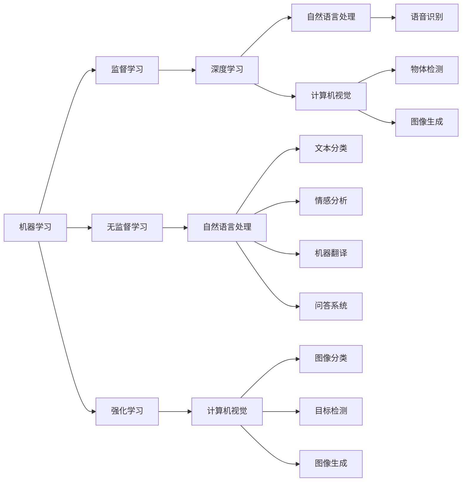

                 

# AI在社会中的作用与应用

## 1. 背景介绍

人工智能（Artificial Intelligence, AI）是21世纪最具革命性的技术之一。它不仅在科学研究、产业应用、军事安全等领域取得了突破性进展，而且正在深刻改变着人类的生产生活方式，成为推动社会进步的重要引擎。AI的应用范围非常广泛，涉及医疗、金融、交通、教育、娱乐等多个领域。本文档将围绕AI技术在社会中的作用与应用进行深入探讨，从理论与实践两个层面揭示AI的强大力量。

## 2. 核心概念与联系

### 2.1 核心概念概述

人工智能是一门研究如何让计算机系统模拟人类智能行为的技术，主要内容包括机器学习、深度学习、自然语言处理、计算机视觉、强化学习等。AI的核心思想是通过算法和计算技术，让机器具备类似人类的学习、推理、感知、决策等能力。

- **机器学习**：是指让计算机通过数据和算法，自动学习和提升性能。包括监督学习、无监督学习和强化学习等多种方法。
- **深度学习**：是机器学习的一个重要分支，使用多层次神经网络模型进行特征提取和任务学习，广泛应用于图像识别、语音识别、自然语言处理等领域。
- **自然语言处理**：是指让计算机理解、生成和处理人类语言的技术，包括文本分类、情感分析、机器翻译、问答系统等。
- **计算机视觉**：是指让计算机系统能够“看”和“理解”图像、视频等视觉数据的技术，包括图像分类、目标检测、图像生成等。
- **强化学习**：是指让计算机通过与环境互动，自动学习最优策略以完成特定任务的技术，广泛应用于游戏、机器人控制等领域。

这些核心概念构成了AI技术的理论基石和应用框架，通过相互配合和融合，AI技术能够在实际问题中发挥巨大的作用。

### 2.2 概念间的关系

AI技术的各个核心概念之间存在着紧密的联系，可以通过以下Mermaid流程图来展示：



这个流程图展示了AI技术各个概念之间的相互关系和应用场景。监督学习、无监督学习和强化学习是机器学习的三个重要分支，深度学习是其中的重要应用之一。自然语言处理和计算机视觉是AI技术的两个主要应用领域，它们又分别涉及多个具体的任务。

## 3. 核心算法原理 & 具体操作步骤

### 3.1 算法原理概述

AI技术的核心算法原理主要包括：

- **监督学习**：通过有标注的训练数据，训练模型学习输入和输出之间的关系。
- **无监督学习**：通过未标注的训练数据，发现数据中的潜在结构和模式。
- **强化学习**：通过与环境的互动，学习如何做出最优决策以最大化奖励。
- **深度学习**：使用多层次神经网络模型进行特征提取和任务学习，有效处理复杂非线性关系。

AI技术的算法原理使得计算机系统能够从数据中学习知识，自动提升性能，并用于解决各种实际问题。

### 3.2 算法步骤详解

AI算法通常在数据预处理、模型训练、模型评估和模型应用四个步骤中展开：

- **数据预处理**：清洗、归一化、特征提取等步骤，为模型提供高质量的输入数据。
- **模型训练**：选择合适的算法和模型结构，使用训练数据训练模型，优化模型参数。
- **模型评估**：使用测试数据对模型进行评估，衡量模型的性能和泛化能力。
- **模型应用**：将训练好的模型应用于实际问题，解决实际任务。

这些步骤构成了AI技术的完整流程，每个步骤都需要精心设计和优化，才能保证最终模型的效果和可靠性。

### 3.3 算法优缺点

AI技术的优点包括：

- **高效性**：可以处理大量数据，高效进行学习和推理。
- **自动化**：自动化完成大部分任务，减轻人类工作负担。
- **灵活性**：可以适应各种复杂多变的问题，提供多种解决方案。

AI技术的缺点包括：

- **数据依赖**：需要大量高质量的标注数据，否则模型效果难以保证。
- **黑箱问题**：复杂模型难以解释，无法进行可视化理解。
- **伦理问题**：可能带来就业、隐私、安全等方面的问题。

### 3.4 算法应用领域

AI技术已经在各个领域取得了广泛应用，以下是一些主要领域及其应用：

- **医疗健康**：智能诊断、个性化治疗、智能监控等。
- **金融服务**：风险评估、投资分析、欺诈检测等。
- **智能制造**：设备监控、质量检测、生产调度等。
- **教育培训**：智能辅导、评估、个性化学习等。
- **交通运输**：自动驾驶、交通管理、智能调度等。
- **娱乐休闲**：游戏、音乐、影视、虚拟现实等。

## 4. 数学模型和公式 & 详细讲解

### 4.1 数学模型构建

AI技术中的数学模型通常包括线性回归、逻辑回归、支持向量机、决策树、神经网络等。

以神经网络为例，假设输入为 $x$，输出为 $y$，神经网络模型为 $f(x;w)$，其中 $w$ 为模型参数。常用的损失函数包括均方误差损失、交叉熵损失等。

### 4.2 公式推导过程

以线性回归模型为例，假设训练数据集为 $D=\{(x_i,y_i)\}_{i=1}^n$，目标是最小化损失函数 $\mathcal{L}(\theta)$，其中 $\theta$ 为模型参数。常用的损失函数包括：

$$
\mathcal{L}(\theta) = \frac{1}{2n} \sum_{i=1}^n (y_i - f(x_i; \theta))^2
$$

通过梯度下降等优化算法，不断更新参数 $\theta$，直至最小化损失函数。

### 4.3 案例分析与讲解

以图像分类为例，使用卷积神经网络（Convolutional Neural Network, CNN）进行训练。CNN通过卷积层、池化层、全连接层等结构，学习输入图像的特征表示，并用于分类任务。

## 5. 项目实践：代码实例和详细解释说明

### 5.1 开发环境搭建

使用Python语言进行AI项目的开发，需要安装以下依赖：

- Python 3.6+ 和 pip
- TensorFlow、PyTorch 或 Keras 等深度学习框架
- OpenCV 或 Pillow 等图像处理库
- Scikit-learn 或 Pandas 等数据处理库

### 5.2 源代码详细实现

以下是一个简单的图像分类代码示例：

```python
import tensorflow as tf
from tensorflow.keras import layers

# 加载数据集
(train_images, train_labels), (test_images, test_labels) = tf.keras.datasets.cifar10.load_data()

# 数据预处理
train_images = train_images / 255.0
test_images = test_images / 255.0

# 构建模型
model = tf.keras.Sequential([
    layers.Conv2D(32, (3, 3), activation='relu', input_shape=(32, 32, 3)),
    layers.MaxPooling2D((2, 2)),
    layers.Conv2D(64, (3, 3), activation='relu'),
    layers.MaxPooling2D((2, 2)),
    layers.Conv2D(64, (3, 3), activation='relu'),
    layers.Flatten(),
    layers.Dense(64, activation='relu'),
    layers.Dense(10)
])

# 编译模型
model.compile(optimizer='adam', 
              loss=tf.keras.losses.SparseCategoricalCrossentropy(from_logits=True),
              metrics=['accuracy'])

# 训练模型
model.fit(train_images, train_labels, epochs=10, validation_data=(test_images, test_labels))
```

### 5.3 代码解读与分析

以上代码实现了CNN模型在CIFAR-10数据集上的图像分类任务。代码主要分为数据加载、预处理、模型构建、编译和训练五个步骤。

- 数据加载：使用 `tf.keras.datasets.cifar10.load_data()` 函数加载CIFAR-10数据集。
- 数据预处理：将像素值归一化到[0,1]区间，使用 `train_images / 255.0` 实现。
- 模型构建：使用 `tf.keras.Sequential()` 定义模型结构，包含多个卷积层、池化层和全连接层。
- 模型编译：使用 `model.compile()` 函数定义优化器、损失函数和评价指标。
- 模型训练：使用 `model.fit()` 函数进行模型训练，指定训练轮数和验证集。

## 6. 实际应用场景

### 6.1 医疗健康

AI在医疗健康领域的应用包括智能诊断、个性化治疗、智能监控等。例如，使用深度学习模型对医学影像进行分类和识别，使用自然语言处理技术进行病历分析和患者问答。AI还可以根据患者的历史数据和基因信息，提供个性化的治疗方案，显著提升医疗效率和效果。

### 6.2 金融服务

AI在金融服务领域的应用包括风险评估、投资分析、欺诈检测等。例如，使用机器学习模型对贷款申请进行信用评估，使用深度学习模型进行股票预测，使用强化学习模型进行交易策略优化。AI还可以实时监测金融市场的动态，预警潜在的风险和机会，提升金融机构的决策能力。

### 6.3 智能制造

AI在智能制造领域的应用包括设备监控、质量检测、生产调度等。例如，使用计算机视觉技术对产品进行质量检测，使用自然语言处理技术进行设备维护监控，使用强化学习技术进行生产调度优化。AI可以提高生产效率，降低生产成本，提升产品质量。

### 6.4 教育培训

AI在教育培训领域的应用包括智能辅导、评估、个性化学习等。例如，使用自然语言处理技术进行自动批改作业和考试，使用机器学习技术进行学习路径推荐，使用强化学习技术进行自适应学习。AI可以提供个性化的学习体验，提升学习效果，满足不同学生的学习需求。

### 6.5 交通运输

AI在交通运输领域的应用包括自动驾驶、交通管理、智能调度等。例如，使用计算机视觉技术进行车辆行为识别，使用自然语言处理技术进行交通管制，使用强化学习技术进行交通流量优化。AI可以提升交通系统的安全性、效率和舒适度。

### 6.6 娱乐休闲

AI在娱乐休闲领域的应用包括游戏、音乐、影视、虚拟现实等。例如，使用深度学习技术进行游戏智能体训练，使用自然语言处理技术进行音乐推荐，使用计算机视觉技术进行影视特效制作，使用增强现实技术进行虚拟现实体验。AI可以提升娱乐产品的互动性和沉浸感，拓展娱乐市场的边界。

## 7. 工具和资源推荐

### 7.1 学习资源推荐

1. 《Deep Learning》 by Ian Goodfellow, Yoshua Bengio, and Aaron Courville
2. 《Pattern Recognition and Machine Learning》 by Christopher Bishop
3. 《Hands-On Machine Learning with Scikit-Learn, Keras, and TensorFlow》 by Aurélien Géron
4. 《Natural Language Processing with Python》 by Steven Bird, Ewan Klein, and Edward Loper
5. 《Computer Vision: Algorithms and Applications》 by Richard Szeliski

### 7.2 开发工具推荐

1. TensorFlow：由Google开发的深度学习框架，支持CPU、GPU、TPU等多种硬件。
2. PyTorch：由Facebook开发的深度学习框架，具有动态计算图和灵活性。
3. Keras：基于TensorFlow和Theano的高级深度学习框架，简单易用。
4. OpenCV：开源计算机视觉库，支持图像处理、物体检测、视频分析等。
5. Scikit-learn：开源机器学习库，支持分类、回归、聚类等算法。

### 7.3 相关论文推荐

1. Deep Blue: Heart of the Gambler's Fallacy Machine by Thomas M. Mitchell and Tom Bair
2. Convolutional Networks for Images, Speech, and Time Series by Yann LeCun
3. Learning to Detect and Track Objects in Videos by Raúl Murillo-Florencio et al.
4. Language Models are Unsupervised Multitask Learners by Alec Radford, Jeff Wu, Rewon Child, David Luan, Dario Amodei, and Ilya Sutskever
5. AlphaGo Zero: Mastering the Game of Go without Human Knowledge by David Silver et al.

## 8. 总结：未来发展趋势与挑战

### 8.1 研究成果总结

AI技术在多个领域取得了突破性进展，并在实际应用中展示了强大的潜力。未来的研究方向包括：

1. **增强学习与智能系统**：通过增强学习技术，提升智能系统的决策能力和适应能力，用于解决复杂多变的问题。
2. **多模态学习与融合**：将不同模态的数据（如图像、语音、文本）进行融合，提升系统的感知能力和表达能力。
3. **深度强化学习**：结合深度学习和强化学习，提升智能系统的高阶推理能力和决策能力。
4. **可解释性与透明性**：提升模型的可解释性和透明性，增强系统的可信度和可接受度。

### 8.2 未来发展趋势

未来，AI技术的发展趋势包括：

1. **自动化与智能化**：AI系统将变得更加智能化和自动化，能够自主学习和优化，适应各种复杂多变的问题。
2. **跨领域融合**：AI技术将与物联网、大数据、云计算等技术进行深度融合，拓展应用范围，提升系统效率和效果。
3. **人机协作**：AI系统将成为人类的助手和伙伴，提升人类工作的效率和创造力，扩展人类认知边界。
4. **伦理与法规**：随着AI技术的广泛应用，伦理与法规问题将越来越重要，需要制定相应的规范和标准。

### 8.3 面临的挑战

AI技术在发展过程中面临以下挑战：

1. **数据隐私与安全**：AI系统需要处理大量敏感数据，需要制定相应的隐私保护措施和安全保障机制。
2. **算法公平性**：AI系统可能存在偏见和歧视，需要制定相应的公平性评估指标和优化策略。
3. **可解释性与透明性**：AI系统往往难以解释其决策过程，需要提升系统的可解释性和透明性。
4. **技术安全性**：AI系统可能存在安全漏洞和攻击风险，需要制定相应的安全防护策略和应急预案。

### 8.4 研究展望

未来，AI技术的研究方向包括：

1. **模型可解释性**：提升模型的可解释性和透明性，增强系统的可信度和可接受度。
2. **跨领域融合**：将AI技术与物联网、大数据、云计算等技术进行深度融合，拓展应用范围，提升系统效率和效果。
3. **伦理与法规**：制定相应的规范和标准，保障AI技术的公平性、透明性和安全性。

## 9. 附录：常见问题与解答

### 9.1 常见问题

#### 9.1.1 AI技术是否会取代人类工作？

AI技术确实可以替代一些重复性、低技能的工作，但同时也创造了大量新的高技能岗位。AI技术的出现，使人类可以更加专注于创造性和创新性的工作，提升生产力和生活质量。

#### 9.1.2 AI技术是否存在安全隐患？

AI系统存在一定的安全隐患，包括数据泄露、算法攻击、模型滥用等。需要制定相应的安全防护策略和应急预案，保障系统的安全性和可靠性。

#### 9.1.3 AI技术是否会带来伦理问题？

AI技术可能带来伦理问题，如隐私保护、算法公平性、就业影响等。需要制定相应的伦理规范和法律法规，保障AI技术的公平性和可接受度。

#### 9.1.4 AI技术是否需要大量的标注数据？

AI技术通常需要大量的标注数据才能训练出高效的模型，但也可以通过半监督学习、无监督学习等方法，减少对标注数据的依赖。

#### 9.1.5 AI技术是否需要强大的硬件支持？

AI技术需要高性能的硬件支持，如GPU、TPU等，才能提升计算速度和模型效果。

### 9.2 详细解答

#### 9.2.1 问题解答

1. **问题：AI技术是否会取代人类工作？**
   - 解答：AI技术确实可以替代一些重复性、低技能的工作，但同时也创造了大量新的高技能岗位。AI技术的出现，使人类可以更加专注于创造性和创新性的工作，提升生产力和生活质量。

2. **问题：AI技术是否存在安全隐患？**
   - 解答：AI系统存在一定的安全隐患，包括数据泄露、算法攻击、模型滥用等。需要制定相应的安全防护策略和应急预案，保障系统的安全性和可靠性。

3. **问题：AI技术是否会带来伦理问题？**
   - 解答：AI技术可能带来伦理问题，如隐私保护、算法公平性、就业影响等。需要制定相应的伦理规范和法律法规，保障AI技术的公平性和可接受度。

4. **问题：AI技术是否需要大量的标注数据？**
   - 解答：AI技术通常需要大量的标注数据才能训练出高效的模型，但也可以通过半监督学习、无监督学习等方法，减少对标注数据的依赖。

5. **问题：AI技术是否需要强大的硬件支持？**
   - 解答：AI技术需要高性能的硬件支持，如GPU、TPU等，才能提升计算速度和模型效果。

---

作者：禅与计算机程序设计艺术 / Zen and the Art of Computer Programming

