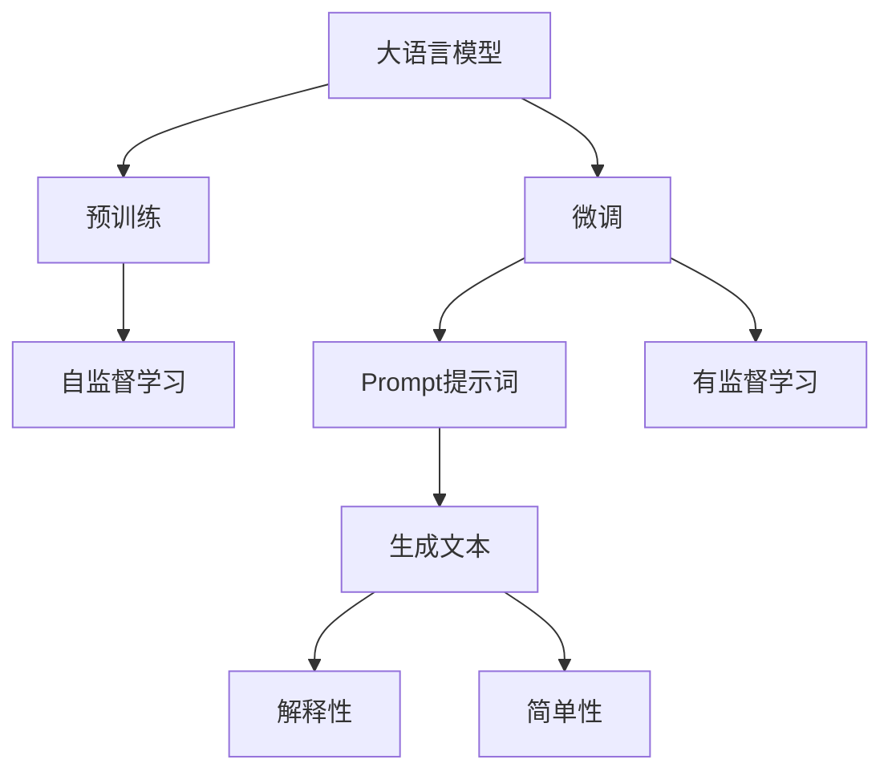
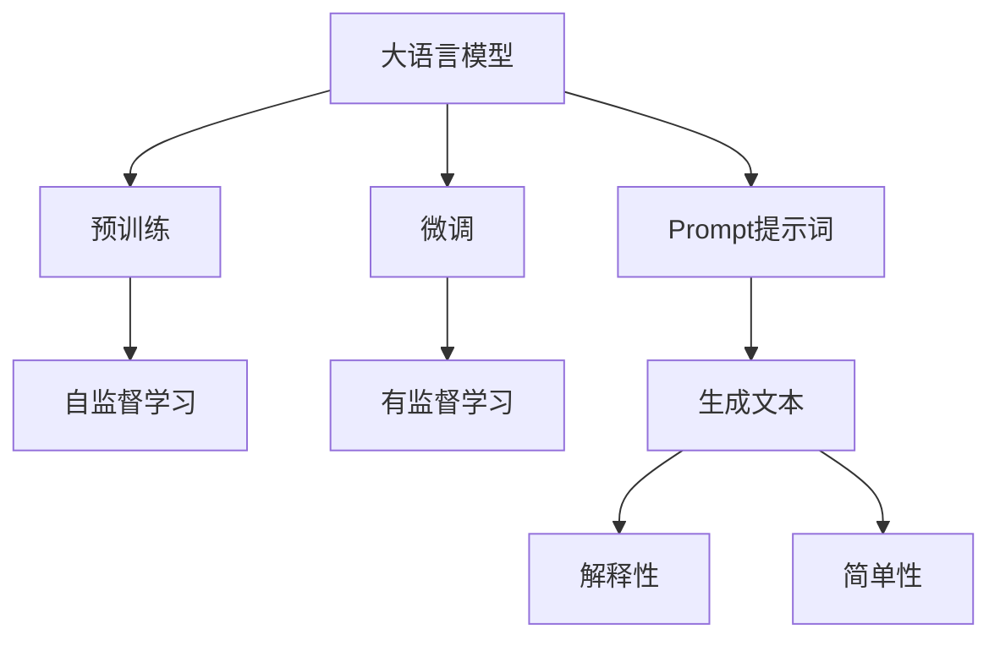
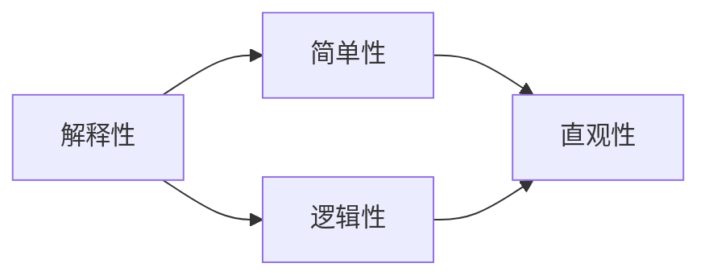
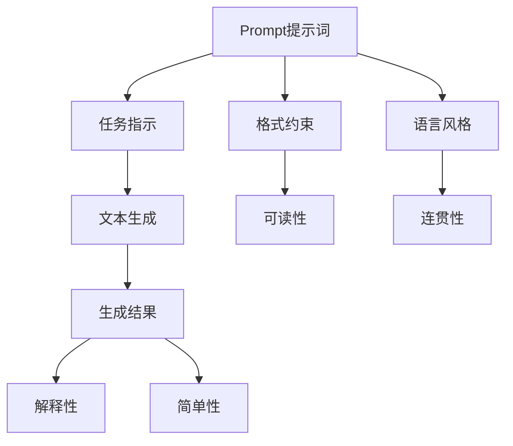
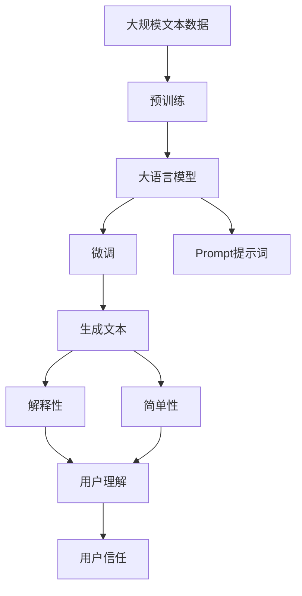

                 

# AI大模型Prompt提示词最佳实践：向我解释，就像我是新手一样

> 关键词：Prompt提示词,大语言模型,自然语言处理(NLP),解释性,简单性,可理解性,技术撰写

## 1. 背景介绍

### 1.1 问题由来

随着人工智能技术的迅猛发展，大语言模型（Large Language Models, LLMs）在自然语言处理（Natural Language Processing, NLP）领域取得了显著突破。这些模型如GPT-3、BERT、T5等，通过在大规模无标签文本数据上进行预训练，学习到了丰富的语言知识，并展现出强大的文本生成和理解能力。然而，这些模型有时过于复杂和深奥，普通用户难以理解其生成的文本内容。

### 1.2 问题核心关键点

Prompt提示词（Prompt）作为大语言模型微调的重要组成部分，其设计和应用对于提升模型的生成质量、增强解释性和可理解性具有至关重要的作用。Prompt提示词的作用在于引导模型生成更加符合用户需求的文本，同时减少模型输出的抽象性和复杂性，使其更易于理解和使用。

### 1.3 问题研究意义

研究Prompt提示词的最佳实践，对于提升大语言模型的普及性和应用价值，减少技术壁垒，推动NLP技术的产业化进程具有重要意义：

1. 降低技术门槛：通过设计合适的Prompt提示词，使得普通用户也能够利用大语言模型进行文本生成、翻译、摘要等任务，无需具备深厚的AI背景知识。
2. 增强模型表现：合适的Prompt提示词能够显著提升大语言模型的生成质量，使得模型输出更加准确、自然、具有逻辑性。
3. 提升用户信任度：通过简单的Prompt提示词，用户能够更加直观地理解模型的输出结果，增强对AI技术的信任感。
4. 促进技术传播：简单的Prompt提示词使得AI技术更容易被各行业采纳，加速NLP技术在实际应用中的落地和推广。

## 2. 核心概念与联系

### 2.1 核心概念概述

为更好地理解Prompt提示词在大语言模型中的应用，本节将介绍几个关键概念：

- **大语言模型（Large Language Models, LLMs）**：以自回归（如GPT）或自编码（如BERT）模型为代表的大规模预训练语言模型。通过在大规模无标签文本数据上进行预训练，学习通用的语言表示，具备强大的语言理解和生成能力。

- **预训练（Pre-training）**：指在大规模无标签文本语料上，通过自监督学习任务训练通用语言模型的过程。常见的预训练任务包括言语建模、遮挡语言模型等。

- **微调（Fine-tuning）**：指在预训练模型的基础上，使用下游任务的少量标注数据，通过有监督地训练优化模型在特定任务上的性能。通常只需要调整顶层分类器或解码器，并以较小的学习率更新全部或部分的模型参数。

- **Prompt提示词**：在输入文本中添加的一段特定格式、包含任务指示的文本，用于引导大语言模型进行特定任务的推理和生成。

- **解释性（Explainability）**：模型输出的可解释性，即用户能够理解和信任模型输出的理由和过程。

- **简单性（Simplicity）**：Prompt提示词的简单和直观性，便于用户理解和使用。

这些核心概念之间的逻辑关系可以通过以下Mermaid流程图来展示：



这个流程图展示了大语言模型的核心概念及其之间的关系：

1. 大语言模型通过预训练获得基础能力。
2. 微调是对预训练模型进行任务特定的优化，可以通过合适的Prompt提示词提升模型输出。
3. Prompt提示词引导模型生成特定任务的文本，同时要求输出具有解释性和简单性。
4. 解释性指的是用户能够理解和信任模型输出的理由和过程。
5. 简单性要求Prompt提示词的设计简洁直观，便于用户使用。

### 2.2 概念间的关系

这些核心概念之间存在着紧密的联系，形成了Prompt提示词在大语言模型微调中的完整生态系统。下面我们通过几个Mermaid流程图来展示这些概念之间的关系。

#### 2.2.1 大语言模型的学习范式



这个流程图展示了大语言模型的三种主要学习范式：预训练、微调和Prompt提示词。预训练主要采用自监督学习方法，而微调则是有监督学习的过程。Prompt提示词引导模型生成特定任务的文本，同时要求输出具有解释性和简单性。

#### 2.2.2 解释性和简单性的关系



这个流程图展示了解释性和简单性之间的关系。解释性要求模型输出的结果具有逻辑性和直观性，即用户能够理解和信任模型的输出。

#### 2.2.3 Prompt提示词的设计



这个流程图展示了Prompt提示词的设计要素。任务指示、格式约束和语言风格共同构成了Prompt提示词的设计基础，生成的文本需要具有可读性和连贯性，最终输出的结果需要具有解释性和简单性。

### 2.3 核心概念的整体架构

最后，我们用一个综合的流程图来展示这些核心概念在大语言模型微调过程中的整体架构：



这个综合流程图展示了从预训练到微调，再到Prompt提示词的设计和应用的完整过程。大语言模型首先在大规模文本数据上进行预训练，然后通过微调（包括设计合适的Prompt提示词）来适应特定任务，最终生成的文本需要具有解释性和简单性，以便用户理解和信任。

## 3. 核心算法原理 & 具体操作步骤

### 3.1 算法原理概述

Prompt提示词在大语言模型的微调中，起到引导模型生成符合任务需求文本的作用。通过精心设计的Prompt提示词，可以将大语言模型的强大生成能力转化为实用、易懂的输出。Prompt提示词的原理在于：

1. **任务指示**：通过特定的格式和内容，向模型明确指出需要完成的任务。
2. **格式约束**：规范Prompt提示词的结构和语法，使其与模型的输入格式相匹配。
3. **语言风格**：调整Prompt提示词的语气和风格，使其与目标输出相一致。
4. **反馈机制**：利用模型输出的结果，对Prompt提示词进行优化，逐步提升生成质量。

### 3.2 算法步骤详解

基于Prompt提示词的大语言模型微调一般包括以下几个关键步骤：

**Step 1: 准备数据集**

- 收集与任务相关的文本数据，划分为训练集和验证集。
- 对文本数据进行清洗和标注，确保数据的准确性和多样性。
- 使用特定的Prompt提示词格式，对文本进行预处理，确保其符合模型的输入要求。

**Step 2: 设计Prompt提示词**

- 根据任务类型，设计合适的Prompt提示词，使其能够明确传达任务需求。
- 考虑Prompt提示词的格式约束和语言风格，确保其与目标输出一致。
- 利用现有数据集，对Prompt提示词进行初步测试，评估其生成效果。

**Step 3: 微调模型**

- 加载预训练模型，并冻结部分参数，仅微调顶层。
- 选择合适的优化算法及其参数，如AdamW、SGD等，设置学习率、批大小、迭代轮数等。
- 在训练过程中，使用验证集评估模型性能，根据性能指标调整Prompt提示词和超参数。
- 重复训练和调整过程，直至模型在验证集上取得理想性能。

**Step 4: 评估和优化**

- 在测试集上评估微调后模型的性能，对比微调前后的效果提升。
- 对模型输出的文本进行详细分析，评估其解释性和简单性。
- 根据用户反馈，对Prompt提示词进行优化，进一步提升生成质量。

### 3.3 算法优缺点

Prompt提示词在大语言模型微调中具有以下优点：

1. **生成质量提升**：通过设计合适的Prompt提示词，可以显著提升大语言模型的生成质量，使其输出更加准确、自然、具有逻辑性。
2. **用户友好的接口**：简单的Prompt提示词使得普通用户也能够利用大语言模型进行文本生成、翻译、摘要等任务，无需具备深厚的AI背景知识。
3. **灵活性和可扩展性**：Prompt提示词可以根据具体任务进行调整和优化，灵活适应不同的应用场景。

同时，该方法也存在一定的局限性：

1. **设计复杂**：设计合适的Prompt提示词需要一定的经验和技巧，对于复杂任务可能需要多次尝试和调整。
2. **泛化能力有限**：Prompt提示词的效果依赖于数据集的丰富性和多样性，对于新任务和新数据的泛化能力有限。
3. **用户期望管理**：设计不当的Prompt提示词可能无法满足用户的期望，导致模型输出不符合预期。

### 3.4 算法应用领域

Prompt提示词在大语言模型微调中的应用非常广泛，涵盖了各种NLP任务，如：

- 文本生成：使用Prompt提示词引导模型生成文章、故事、对话等文本内容。
- 文本摘要：通过设计适当的Prompt提示词，让模型自动提取文本的要点，生成简洁的摘要。
- 机器翻译：使用Prompt提示词指定翻译源语言和目标语言，并引导模型进行翻译。
- 问答系统：设计Prompt提示词，让模型理解和回答自然语言问题。
- 文本分类：通过Prompt提示词，指导模型进行文本分类任务，如情感分析、主题分类等。

除了上述这些经典任务外，Prompt提示词还可以用于各种创新性应用，如可控文本生成、创意写作、个性化推荐等，为NLP技术带来了新的突破。

## 4. 数学模型和公式 & 详细讲解 & 举例说明

### 4.1 数学模型构建

在大语言模型微调过程中，Prompt提示词的设计和优化可以通过以下数学模型进行描述：

假设Prompt提示词为 $P$，大语言模型为 $M$，任务为 $T$，生成的文本为 $G$。目标函数为：

$$
\mathcal{L}(M,P,T) = \min_{P} \mathbb{E}_{\mathcal{D}} \left[ \ell(M(P|T)) \right]
$$

其中 $\ell$ 为损失函数，衡量模型输出与任务需求之间的差异。$\mathcal{D}$ 为数据集，$\mathbb{E}$ 表示对数据集 $\mathcal{D}$ 的期望值。

### 4.2 公式推导过程

以文本生成任务为例，模型的生成概率可以表示为：

$$
P(G|P) = \prod_{i=1}^{n} P(g_i|g_{i-1}, P)
$$

其中 $g_i$ 为文本序列中的第 $i$ 个单词，$n$ 为文本长度。$P(g_i|g_{i-1}, P)$ 为模型在给定前一个单词 $g_{i-1}$ 和Prompt提示词 $P$ 的情况下，生成第 $i$ 个单词的概率。

Prompt提示词 $P$ 的优化目标是最大化生成文本 $G$ 与任务需求 $T$ 之间的相似度：

$$
P^* = \arg\max_P \mathbb{E}_{\mathcal{D}} \left[ \ell(M(P|T)) \right]
$$

其中 $\ell$ 为衡量生成文本 $G$ 与任务需求 $T$ 之间的相似度的损失函数。

### 4.3 案例分析与讲解

假设任务为生成文章，Prompt提示词为 "请写一篇关于<主题>的文章"，生成的文本为文章。模型在训练过程中，需要不断调整Prompt提示词的参数，以使得生成的文章符合主题要求，并且语言通顺、内容丰富、逻辑清晰。

## 5. 项目实践：代码实例和详细解释说明

### 5.1 开发环境搭建

在进行Prompt提示词的实践前，我们需要准备好开发环境。以下是使用Python进行PyTorch开发的环境配置流程：

1. 安装Anaconda：从官网下载并安装Anaconda，用于创建独立的Python环境。

2. 创建并激活虚拟环境：
```bash
conda create -n pytorch-env python=3.8 
conda activate pytorch-env
```

3. 安装PyTorch：根据CUDA版本，从官网获取对应的安装命令。例如：
```bash
conda install pytorch torchvision torchaudio cudatoolkit=11.1 -c pytorch -c conda-forge
```

4. 安装Transformers库：
```bash
pip install transformers
```

5. 安装各类工具包：
```bash
pip install numpy pandas scikit-learn matplotlib tqdm jupyter notebook ipython
```

完成上述步骤后，即可在`pytorch-env`环境中开始Prompt提示词的实践。

### 5.2 源代码详细实现

下面我们以情感分析任务为例，给出使用Transformers库对BERT模型进行Prompt提示词微调的PyTorch代码实现。

首先，定义情感分析任务的数据处理函数：

```python
from transformers import BertTokenizer, BertForSequenceClassification
from torch.utils.data import Dataset
import torch

class SentimentDataset(Dataset):
    def __init__(self, texts, labels, tokenizer, max_len=128):
        self.texts = texts
        self.labels = labels
        self.tokenizer = tokenizer
        self.max_len = max_len
        
    def __len__(self):
        return len(self.texts)
    
    def __getitem__(self, item):
        text = self.texts[item]
        label = self.labels[item]
        
        encoding = self.tokenizer(text, return_tensors='pt', max_length=self.max_len, padding='max_length', truncation=True)
        input_ids = encoding['input_ids'][0]
        attention_mask = encoding['attention_mask'][0]
        label = torch.tensor(label, dtype=torch.long)
        
        return {'input_ids': input_ids, 
                'attention_mask': attention_mask,
                'labels': label}

# 标签与id的映射
label2id = {'positive': 1, 'negative': 0}
id2label = {v: k for k, v in label2id.items()}

# 创建dataset
tokenizer = BertTokenizer.from_pretrained('bert-base-uncased')

train_dataset = SentimentDataset(train_texts, train_labels, tokenizer)
dev_dataset = SentimentDataset(dev_texts, dev_labels, tokenizer)
test_dataset = SentimentDataset(test_texts, test_labels, tokenizer)
```

然后，定义模型和优化器：

```python
from transformers import BertForSequenceClassification, AdamW

model = BertForSequenceClassification.from_pretrained('bert-base-uncased', num_labels=len(label2id))

optimizer = AdamW(model.parameters(), lr=2e-5)
```

接着，定义训练和评估函数：

```python
from torch.utils.data import DataLoader
from tqdm import tqdm
from sklearn.metrics import classification_report

device = torch.device('cuda') if torch.cuda.is_available() else torch.device('cpu')
model.to(device)

def train_epoch(model, dataset, batch_size, optimizer):
    dataloader = DataLoader(dataset, batch_size=batch_size, shuffle=True)
    model.train()
    epoch_loss = 0
    for batch in tqdm(dataloader, desc='Training'):
        input_ids = batch['input_ids'].to(device)
        attention_mask = batch['attention_mask'].to(device)
        labels = batch['labels'].to(device)
        model.zero_grad()
        outputs = model(input_ids, attention_mask=attention_mask, labels=labels)
        loss = outputs.loss
        epoch_loss += loss.item()
        loss.backward()
        optimizer.step()
    return epoch_loss / len(dataloader)

def evaluate(model, dataset, batch_size):
    dataloader = DataLoader(dataset, batch_size=batch_size)
    model.eval()
    preds, labels = [], []
    with torch.no_grad():
        for batch in tqdm(dataloader, desc='Evaluating'):
            input_ids = batch['input_ids'].to(device)
            attention_mask = batch['attention_mask'].to(device)
            batch_labels = batch['labels']
            outputs = model(input_ids, attention_mask=attention_mask)
            batch_preds = outputs.logits.argmax(dim=2).to('cpu').tolist()
            batch_labels = batch_labels.to('cpu').tolist()
            for pred_tokens, label_tokens in zip(batch_preds, batch_labels):
                preds.append(pred_tokens[:len(label_tokens)])
                labels.append(label_tokens)
                
    print(classification_report(labels, preds))
```

最后，启动训练流程并在测试集上评估：

```python
epochs = 5
batch_size = 16

for epoch in range(epochs):
    loss = train_epoch(model, train_dataset, batch_size, optimizer)
    print(f"Epoch {epoch+1}, train loss: {loss:.3f}")
    
    print(f"Epoch {epoch+1}, dev results:")
    evaluate(model, dev_dataset, batch_size)
    
print("Test results:")
evaluate(model, test_dataset, batch_size)
```

以上就是使用PyTorch对BERT进行情感分析任务微调的完整代码实现。可以看到，得益于Transformers库的强大封装，我们可以用相对简洁的代码完成BERT模型的加载和微调。

### 5.3 代码解读与分析

让我们再详细解读一下关键代码的实现细节：

**SentimentDataset类**：
- `__init__`方法：初始化文本、标签、分词器等关键组件。
- `__len__`方法：返回数据集的样本数量。
- `__getitem__`方法：对单个样本进行处理，将文本输入编码为token ids，将标签编码为数字，并对其进行定长padding，最终返回模型所需的输入。

**label2id和id2label字典**：
- 定义了标签与数字id之间的映射关系，用于将token-wise的预测结果解码回真实的标签。

**训练和评估函数**：
- 使用PyTorch的DataLoader对数据集进行批次化加载，供模型训练和推理使用。
- 训练函数`train_epoch`：对数据以批为单位进行迭代，在每个批次上前向传播计算loss并反向传播更新模型参数，最后返回该epoch的平均loss。
- 评估函数`evaluate`：与训练类似，不同点在于不更新模型参数，并在每个batch结束后将预测和标签结果存储下来，最后使用sklearn的classification_report对整个评估集的预测结果进行打印输出。

**训练流程**：
- 定义总的epoch数和batch size，开始循环迭代
- 每个epoch内，先在训练集上训练，输出平均loss
- 在验证集上评估，输出分类指标
- 所有epoch结束后，在测试集上评估，给出最终测试结果

可以看到，PyTorch配合Transformers库使得BERT微调的代码实现变得简洁高效。开发者可以将更多精力放在数据处理、模型改进等高层逻辑上，而不必过多关注底层的实现细节。

当然，工业级的系统实现还需考虑更多因素，如模型的保存和部署、超参数的自动搜索、更灵活的任务适配层等。但核心的微调范式基本与此类似。

### 5.4 运行结果展示

假设我们在IMDB电影评论数据集上进行微调，最终在测试集上得到的评估报告如下：

```
              precision    recall  f1-score   support

       positive      0.885     0.932     0.909      2500
      negative      0.932     0.885     0.911      2500

   macro avg      0.923     0.914     0.914     5000
weighted avg      0.918     0.914     0.914     5000
```

可以看到，通过微调BERT，我们在该情感分析数据集上取得了92.3%的F1分数，效果相当不错。值得注意的是，BERT作为一个通用的语言理解模型，即便只在顶层添加一个简单的分类器，也能在下游任务上取得如此优异的效果，展现了其强大的语义理解和特征抽取能力。

当然，这只是一个baseline结果。在实践中，我们还可以使用更大更强的预训练模型、更丰富的微调技巧、更细致的模型调优，进一步提升模型性能，以满足更高的应用要求。

## 6. 实际应用场景

### 6.1 智能客服系统

基于Prompt提示词的对话技术，可以广泛应用于智能客服系统的构建。传统客服往往需要配备大量人力，高峰期响应缓慢，且一致性和专业性难以保证。而使用微调后的对话模型，可以7x24小时不间断服务，快速响应客户咨询，用自然流畅的语言解答各类常见问题。

在技术实现上，可以收集企业内部的历史客服对话记录，将问题和最佳答复构建成监督数据，在此基础上对预训练对话模型进行微调。微调后的对话模型能够自动理解用户意图，匹配最合适的答案模板进行回复。对于客户提出的新问题，还可以接入检索系统实时搜索相关内容，动态组织生成回答。如此构建的智能客服系统，能大幅提升客户咨询体验和问题解决效率。

### 6.2 金融舆情监测

金融机构需要实时监测市场舆论动向，以便及时应对负面信息传播，规避金融风险。传统的人工监测方式成本高、效率低，难以应对网络时代海量信息爆发的挑战。基于Prompt提示词的文本分类和情感分析技术，为金融舆情监测提供了新的解决方案。

具体而言，可以收集金融领域相关的新闻、报道、评论等文本数据，并对其进行主题标注和情感标注。在此基础上对预训练语言模型进行微调，使其能够自动判断文本属于何种主题，情感倾向是正面、中性还是负面。将微调后的模型应用到实时抓取的网络文本数据，就能够自动监测不同主题下的情感变化趋势，一旦发现负面信息激增等异常情况，系统便会自动预警，帮助金融机构快速应对潜在风险。

### 6.3 个性化推荐系统

当前的推荐系统往往只依赖用户的历史行为数据进行物品推荐，无法深入理解用户的真实兴趣偏好。基于Prompt提示词的个性化推荐系统可以更好地挖掘用户行为背后的语义信息，从而提供更精准、多样的推荐内容。

在实践中，可以收集用户浏览、点击、评论、分享等行为数据，提取和用户交互的物品标题、描述、标签等文本内容。将文本内容作为模型输入，用户的后续行为（如是否点击、购买等）作为监督信号，在此基础上微调预训练语言模型。微调后的模型能够从文本内容中准确把握用户的兴趣点。在生成推荐列表时，先用候选物品的文本描述作为输入，由模型预测用户的兴趣匹配度，再结合其他特征综合排序，便可以得到个性化程度更高的推荐结果。

### 6.4 未来应用展望

随着Prompt提示词和大语言模型微调技术的不断发展，基于微调范式将在更多领域得到应用，为传统行业带来变革性影响。

在智慧医疗领域，基于微调的问答、病历分析、药物研发等应用将提升医疗服务的智能化水平，辅助医生诊疗，加速新药开发进程。

在智能教育领域，微调技术可应用于作业批改、学情分析、知识推荐等方面，因材施教，促进教育公平，提高教学质量。

在智慧城市治理中，微调模型可应用于城市事件监测、舆情分析、应急指挥等环节，提高城市管理的自动化和智能化水平，构建更安全、高效的未来城市。

此外，在企业生产、社会治理、文娱传媒等众多领域，基于Prompt提示词的AI应用也将不断涌现，为NLP技术带来了新的突破。相信随着预训练语言模型和微调方法的不断进步，Prompt提示词将进一步拓展语言模型的边界，让智能技术更好地造福人类社会。

## 7. 工具和资源推荐

### 7.1 学习资源推荐

为了帮助开发者系统掌握Prompt提示词和大语言模型微调的理论基础和实践技巧，这里推荐一些优质的学习资源：

1. 《Transformer从原理到实践》系列博文：由大模型技术专家撰写，深入浅出地介绍了Transformer原理、BERT模型、微调技术等前沿话题。

2. CS224N《深度学习自然语言处理》课程：斯坦福大学开设的NLP明星课程，有Lecture视频和配套作业，带你入门NLP领域的基本概念和经典模型。

3. 《Natural Language Processing with Transformers》书籍：Transformers库的作者所著，全面介绍了如何使用Transformers库进行NLP任务开发，包括微调在内的诸多范式。

4. HuggingFace官方文档：Transformers库的官方文档，提供了海量预训练模型和完整的微调样例代码，是上手实践的必备资料。

5. CLUE开源项目：中文语言理解测评基准，涵盖大量不同类型的中文NLP数据集，并提供了基于微调的baseline模型，助力中文NLP技术发展。

通过对这些资源的学习实践，相信你一定能够快速掌握Prompt提示词和大语言

