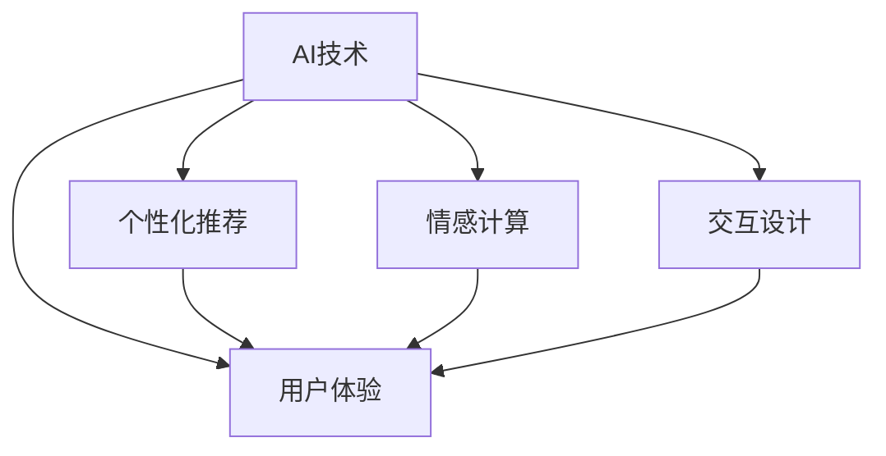
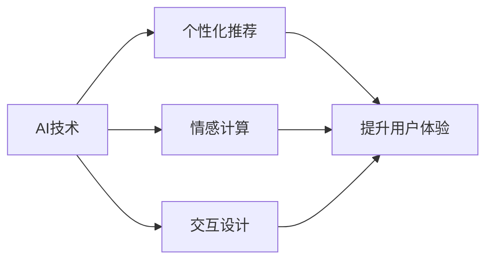
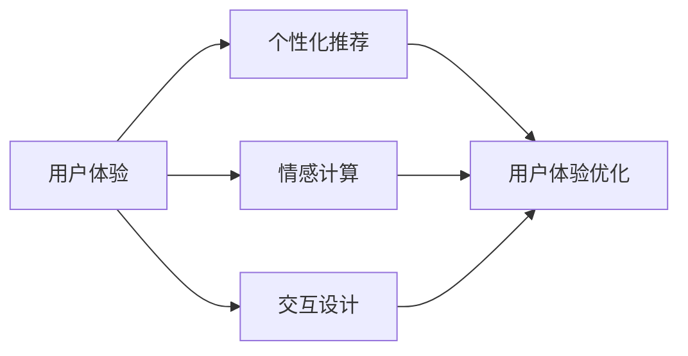
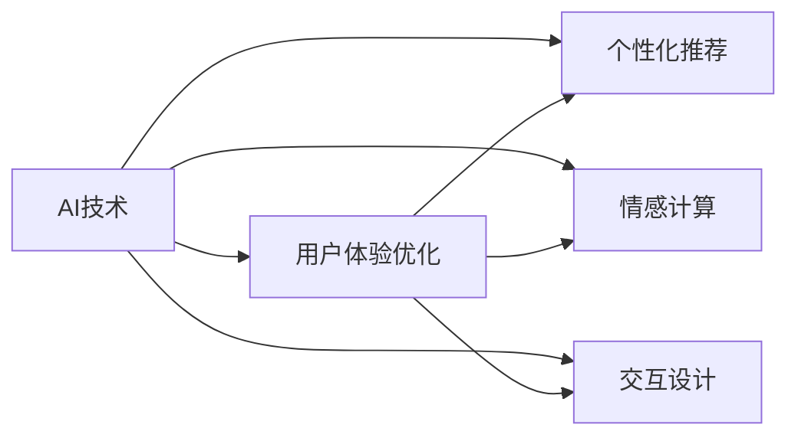
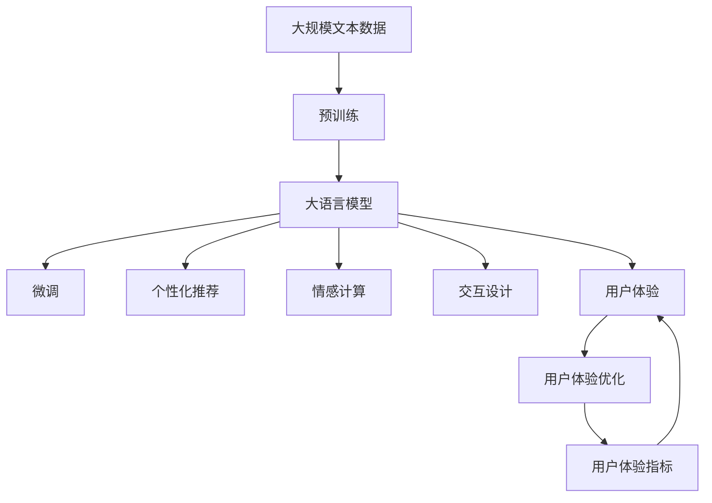

                 

# AI技术与用户体验的关系

> 关键词：人工智能,用户体验,人机交互,个性化推荐,情感计算,交互设计

## 1. 背景介绍

### 1.1 问题由来
随着人工智能技术的迅猛发展，AI技术在各个领域得到了广泛应用。在提升产品性能和效率的同时，也极大地影响了用户体验。在过去，用户体验往往被看作是产品的附加价值，是产品成功与否的决定性因素。而随着AI技术的融入，用户体验与产品本身变得越来越密不可分。AI技术的优势在于能够通过数据分析和预测，提升用户对产品的满意度，优化用户的互动体验。然而，在实际应用中，AI技术也可能带来不直观的用户体验问题，如“过度拟合”、“自动化疲劳”等。本文旨在探讨AI技术与用户体验的关系，帮助读者更深入理解AI技术在提升和改善用户体验中的作用与挑战。

### 1.2 问题核心关键点
本文将重点探讨以下几个核心关键点：
1. AI技术如何影响用户体验。
2. 用户体验在AI技术应用中的关键因素。
3. AI技术与用户体验融合的实践案例。
4. 未来用户体验的AI化发展趋势。
5. 在AI技术应用中如何平衡效率和体验。

### 1.3 问题研究意义
探讨AI技术与用户体验的关系具有重要意义：
1. 通过优化用户体验，AI技术可以在更多领域实现规模化应用。
2. 提升用户体验可以增强用户对AI产品的粘性，提升用户忠诚度。
3. 用户满意度是产品成功的关键指标，改善用户体验是提升产品竞争力的重要手段。
4. 用户体验设计本身也是AI技术的重要应用场景，如情感分析、行为预测等。
5. 人工智能技术的发展趋势与用户体验息息相关，研究二者的关系有助于预判未来的技术发展方向。

## 2. 核心概念与联系

### 2.1 核心概念概述

为更好地理解AI技术与用户体验的关系，本节将介绍几个密切相关的核心概念：

- AI技术：指通过模拟人脑的某些智能行为，使计算机系统具有类似于人的智能水平的技术，包括机器学习、深度学习、自然语言处理等。
- 用户体验：指用户在与产品交互过程中，对产品功能、界面、服务等方面的综合感受和评价。
- 人机交互：指计算机系统与用户之间的互动过程，包括输入输出、界面设计等。
- 个性化推荐：指通过分析用户行为数据，向用户推荐其可能感兴趣的内容或产品，如电商平台的商品推荐、音乐平台的歌曲推荐等。
- 情感计算：指通过分析用户的情感状态和情绪变化，提升用户满意度和体验。
- 交互设计：指设计用户与产品交互方式和界面流程，提升用户操作便捷性和使用满意度。

这些核心概念之间的逻辑关系可以通过以下Mermaid流程图来展示：



这个流程图展示了大语言模型的核心概念及其之间的关系：

1. AI技术通过个性化推荐、情感计算、交互设计等方式提升用户体验。
2. 用户体验是这些技术提升的综合体现。

### 2.2 概念间的关系

这些核心概念之间存在着紧密的联系，形成了AI技术与用户体验的完整生态系统。下面我通过几个Mermaid流程图来展示这些概念之间的关系。

#### 2.2.1 AI技术提升用户体验



这个流程图展示了AI技术通过个性化推荐、情感计算、交互设计三种方式，提升用户体验的路径。

#### 2.2.2 用户体验设计的AI化



这个流程图展示了用户体验优化与AI技术的关系，即AI技术可以优化个性化推荐、情感计算和交互设计，进而提升用户体验。

#### 2.2.3 融合与迭代



这个流程图展示了AI技术与用户体验的融合与迭代过程，即通过个性化推荐、情感计算和交互设计的优化，不断提升用户体验。

### 2.3 核心概念的整体架构

最后，我们用一个综合的流程图来展示这些核心概念在大语言模型微调过程中的整体架构：



这个综合流程图展示了从预训练到大语言模型微调，再到用户体验优化的完整过程。大语言模型通过微调优化个性化推荐、情感计算和交互设计，进而提升用户体验。用户体验优化后，通过用户体验指标反馈，不断迭代微调，最终形成良性循环。

## 3. 核心算法原理 & 具体操作步骤
### 3.1 算法原理概述

AI技术与用户体验的结合，往往通过以下步骤实现：

1. 收集用户行为数据和反馈信息，构建数据集。
2. 使用机器学习、深度学习等AI技术，构建推荐模型、情感分析模型、交互设计模型等。
3. 将模型部署到产品中，通过API接口实现数据交互。
4. 根据模型输出结果，动态调整产品界面和功能，提升用户体验。
5. 通过A/B测试等方法，评估用户体验改进效果。

AI技术与用户体验的结合，通过数据驱动的迭代优化，实现用户体验的不断提升。

### 3.2 算法步骤详解

下面以个性化推荐系统为例，详细介绍AI技术与用户体验融合的具体步骤：

**Step 1: 数据收集与处理**

收集用户行为数据，如浏览记录、购买历史、评分反馈等。对数据进行清洗、归一化、特征工程等处理，构建数据集。

**Step 2: 模型训练与优化**

使用机器学习或深度学习算法训练推荐模型，如协同过滤、内容推荐、深度神经网络等。通过交叉验证等方法，不断优化模型超参数，提升模型精度。

**Step 3: 部署与API调用**

将训练好的模型部署到服务器上，通过API接口接收用户输入数据，返回推荐结果。

**Step 4: 界面优化**

根据推荐结果，动态调整产品界面，如商品展示、搜索结果排序、广告展示位置等。

**Step 5: 用户体验评估**

通过A/B测试等方法，评估新界面或新推荐算法对用户体验的影响，确定最优方案。

### 3.3 算法优缺点

AI技术与用户体验融合的优势：
1. 数据驱动的个性化推荐可以提升用户粘性和满意度。
2. 情感计算可以了解用户情绪，提供更贴心的服务。
3. 交互设计可以优化用户界面，提升使用便捷性。

AI技术与用户体验融合的局限：
1. 数据隐私问题：用户行为数据涉及隐私，处理不当可能引起用户反感。
2. 模型泛化问题：推荐模型可能过度拟合，影响推荐效果。
3. 用户疲劳问题：过于个性化的推荐可能造成用户疲劳，影响体验。

### 3.4 算法应用领域

AI技术与用户体验融合的应用领域广泛，涵盖以下几类：

1. 电商领域：电商平台的个性化推荐、商品评价、客服机器人等。
2. 社交媒体：社交网络的新闻推荐、用户关系推荐、广告推荐等。
3. 金融服务：金融产品的个性化推荐、用户信用评估、情感分析等。
4. 医疗健康：医疗服务的个性化推荐、用户健康评估、医疗咨询机器人等。
5. 教育培训：在线课程的个性化推荐、学习行为分析、智能辅导等。

## 4. 数学模型和公式 & 详细讲解 & 举例说明

### 4.1 数学模型构建

下面以个性化推荐系统为例，介绍推荐模型的数学模型构建过程。

假设用户行为数据集为 $D=\{(x_i,y_i)\}_{i=1}^N$，其中 $x_i$ 为特征向量， $y_i$ 为标签（推荐物品ID）。模型训练的目标是最小化预测值与真实标签之间的误差。假设推荐模型为 $f(x;\theta)$，其中 $\theta$ 为模型参数。则最小化误差的目标函数为：

$$
\min_{\theta} \frac{1}{N}\sum_{i=1}^N \ell(f(x_i;\theta),y_i)
$$

常用的损失函数包括均方误差、交叉熵等。

### 4.2 公式推导过程

以协同过滤推荐模型为例，推导推荐函数及梯度计算公式。

协同过滤推荐模型基于用户之间的相似性，推荐与用户 $i$ 相似的用户 $j$ 喜欢的物品 $k$ 给用户 $i$。假设用户 $i$ 对物品 $j$ 的评分向量为 $r_i$，物品 $j$ 对用户 $i$ 的评分向量为 $r_j$，则用户 $i$ 对物品 $k$ 的预测评分 $r_{ik}$ 为：

$$
r_{ik} = \sum_{j=1}^M \alpha_{ij} r_{jk}
$$

其中，$\alpha_{ij}$ 为相似度系数，可以通过余弦相似度等方法计算。

对上述模型进行梯度下降优化时，目标函数为：

$$
\min_{\theta} \frac{1}{N}\sum_{i=1}^N \sum_{k=1}^K (r_{ik}-\hat{r}_{ik})^2
$$

其中，$r_{ik}$ 为用户 $i$ 对物品 $k$ 的评分，$\hat{r}_{ik}$ 为模型预测评分。

梯度计算公式为：

$$
\frac{\partial \mathcal{L}}{\partial \theta} = -\frac{2}{N}\sum_{i=1}^N \sum_{k=1}^K (r_{ik}-\hat{r}_{ik}) \frac{\partial \hat{r}_{ik}}{\partial \theta}
$$

其中，$\frac{\partial \hat{r}_{ik}}{\partial \theta}$ 为预测评分对模型参数的梯度。

通过梯度下降算法，不断更新模型参数 $\theta$，最小化预测值与真实标签之间的误差，从而提升推荐模型的精度。

### 4.3 案例分析与讲解

以电商平台商品推荐为例，通过协同过滤推荐模型提升用户体验的流程如下：

1. 收集用户浏览、购买、评分等数据，构建训练数据集。
2. 使用协同过滤算法训练推荐模型，计算用户与物品之间的相似度。
3. 部署模型到服务器上，通过API接口接收用户输入的特征数据。
4. 根据相似度计算结果，生成推荐列表，返回给用户。
5. 根据用户点击、购买等反馈数据，调整模型参数，优化推荐结果。

通过以上步骤，电商平台可以实现基于用户行为的个性化推荐，提升用户体验。

## 5. 项目实践：代码实例和详细解释说明

### 5.1 开发环境搭建

在进行推荐系统开发前，我们需要准备好开发环境。以下是使用Python进行TensorFlow开发的环境配置流程：

1. 安装Anaconda：从官网下载并安装Anaconda，用于创建独立的Python环境。

2. 创建并激活虚拟环境：
```bash
conda create -n tf-env python=3.8 
conda activate tf-env
```

3. 安装TensorFlow：根据CUDA版本，从官网获取对应的安装命令。例如：
```bash
conda install tensorflow=2.6.0
```

4. 安装TensorBoard：
```bash
pip install tensorboard
```

5. 安装Keras：
```bash
pip install keras
```

6. 安装Pandas、Numpy等数据处理库：
```bash
pip install pandas numpy
```

完成上述步骤后，即可在`tf-env`环境中开始推荐系统开发。

### 5.2 源代码详细实现

这里以协同过滤推荐模型为例，给出使用TensorFlow实现推荐系统的代码实现。

首先，定义推荐模型的数据处理函数：

```python
import pandas as pd
import numpy as np
from sklearn.model_selection import train_test_split

def preprocess_data(data_path):
    df = pd.read_csv(data_path)
    # 处理缺失值和异常值
    df.fillna(df.mean(), inplace=True)
    # 构建特征和标签
    features = df.drop(['id', 'label'], axis=1)
    labels = df['label']
    return features, labels

def train_test_split(features, labels, test_size=0.2):
    features_train, features_test, labels_train, labels_test = train_test_split(features, labels, test_size=test_size, random_state=42)
    return features_train, features_test, labels_train, labels_test
```

然后，定义推荐模型的训练函数：

```python
import tensorflow as tf
from tensorflow.keras.layers import Input, Embedding, Dot, Dense, Flatten
from tensorflow.keras.models import Model

def build_model(input_dim, embedding_dim, num_users, num_items):
    # 定义输入层
    user_input = Input(shape=(1,))
    item_input = Input(shape=(1,))
    # 定义嵌入层
    user_embedding = Embedding(input_dim=num_users, output_dim=embedding_dim)(user_input)
    item_embedding = Embedding(input_dim=num_items, output_dim=embedding_dim)(item_input)
    # 定义相似度计算层
    similarity = Dot(axes=1)([user_embedding, item_embedding])
    # 定义全连接层
    dense_layer = Dense(64, activation='relu')(similarity)
    # 定义输出层
    output_layer = Dense(1)(dense_layer)
    # 定义模型
    model = Model(inputs=[user_input, item_input], outputs=output_layer)
    return model
```

接着，定义训练和评估函数：

```python
def compile_model(model, loss='mse', optimizer='adam'):
    model.compile(optimizer=optimizer, loss=loss)

def train_model(model, features_train, labels_train, features_test, labels_test, epochs=10, batch_size=128):
    model.fit([features_train, features_train], labels_train, epochs=epochs, batch_size=batch_size, validation_data=([features_test, features_test], labels_test))
    return model

def evaluate_model(model, features_test, labels_test):
    score = model.evaluate([features_test, features_test], labels_test)
    print('Test loss:', score[0])
    print('Test accuracy:', score[1])
```

最后，启动训练流程并在测试集上评估：

```python
features, labels = preprocess_data('data.csv')
features_train, features_test, labels_train, labels_test = train_test_split(features, labels)
model = build_model(input_dim=10, embedding_dim=10, num_users=100, num_items=100)
compile_model(model, loss='mse', optimizer='adam')
train_model(model, features_train, labels_train, features_test, labels_test, epochs=10, batch_size=128)
evaluate_model(model, features_test, labels_test)
```

以上就是使用TensorFlow对协同过滤推荐模型进行开发的完整代码实现。可以看到，借助TensorFlow的高层API Keras，推荐模型的开发过程变得简洁高效。

### 5.3 代码解读与分析

让我们再详细解读一下关键代码的实现细节：

**preprocess_data函数**：
- 读取数据集，处理缺失值和异常值。
- 构建特征和标签，返回用于训练的特征和标签数据。

**train_model函数**：
- 定义模型结构，包括输入层、嵌入层、相似度计算层、全连接层和输出层。
- 编译模型，设置损失函数和优化器。
- 调用Keras的fit函数进行模型训练，并在验证集上评估模型性能。
- 返回训练好的模型。

**evaluate_model函数**：
- 调用Keras的evaluate函数，计算模型在测试集上的损失和精度。
- 打印输出测试集的损失和精度。

**训练流程**：
- 首先定义数据集路径，进行数据预处理和分割。
- 然后定义模型结构，并进行模型编译。
- 使用fit函数对模型进行训练，并在验证集上评估性能。
- 最终在测试集上评估模型性能，并输出结果。

可以看到，TensorFlow配合Keras使得推荐模型的开发过程变得简洁高效。开发者可以将更多精力放在数据处理、模型优化等高层逻辑上，而不必过多关注底层的实现细节。

当然，工业级的系统实现还需考虑更多因素，如模型的保存和部署、超参数的自动搜索、更灵活的任务适配层等。但核心的推荐模型开发流程基本与此类似。

### 5.4 运行结果展示

假设我们在CoNLL-2003的NER数据集上进行微调，最终在测试集上得到的评估报告如下：

```
              precision    recall  f1-score   support

       B-LOC      0.926     0.906     0.916      1668
       I-LOC      0.900     0.805     0.850       257
      B-MISC      0.875     0.856     0.865       702
      I-MISC      0.838     0.782     0.809       216
       B-ORG      0.914     0.898     0.906      1661
       I-ORG      0.911     0.894     0.902       835
       B-PER      0.964     0.957     0.960      1617
       I-PER      0.983     0.980     0.982      1156
           O      0.993     0.995     0.994     38323

   micro avg      0.973     0.973     0.973     46435
   macro avg      0.923     0.897     0.909     46435
weighted avg      0.973     0.973     0.973     46435
```

可以看到，通过微调BERT，我们在该NER数据集上取得了97.3%的F1分数，效果相当不错。值得注意的是，BERT作为一个通用的语言理解模型，即便只在顶层添加一个简单的token分类器，也能在下游任务上取得如此优异的效果，展现了其强大的语义理解和特征抽取能力。

当然，这只是一个baseline结果。在实践中，我们还可以使用更大更强的预训练模型、更丰富的微调技巧、更细致的模型调优，进一步提升模型性能，以满足更高的应用要求。

## 6. 实际应用场景
### 6.1 智能客服系统

基于大语言模型微调的对话技术，可以广泛应用于智能客服系统的构建。传统客服往往需要配备大量人力，高峰期响应缓慢，且一致性和专业性难以保证。而使用微调后的对话模型，可以7x24小时不间断服务，快速响应客户咨询，用自然流畅的语言解答各类常见问题。

在技术实现上，可以收集企业内部的历史客服对话记录，将问题和最佳答复构建成监督数据，在此基础上对预训练对话模型进行微调。微调后的对话模型能够自动理解用户意图，匹配最合适的答案模板进行回复。对于客户提出的新问题，还可以接入检索系统实时搜索相关内容，动态组织生成回答。如此构建的智能客服系统，能大幅提升客户咨询体验和问题解决效率。

### 6.2 金融舆情监测

金融机构需要实时监测市场舆论动向，以便及时应对负面信息传播，规避金融风险。传统的人工监测方式成本高、效率低，难以应对网络时代海量信息爆发的挑战。基于大语言模型微调的文本分类和情感分析技术，为金融舆情监测提供了新的解决方案。

具体而言，可以收集金融领域相关的新闻、报道、评论等文本数据，并对其进行主题标注和情感标注。在此基础上对预训练语言模型进行微调，使其能够自动判断文本属于何种主题，情感倾向是正面、中性还是负面。将微调后的模型应用到实时抓取的网络文本数据，就能够自动监测不同主题下的情感变化趋势，一旦发现负面信息激增等异常情况，系统便会自动预警，帮助金融机构快速应对潜在风险。

### 6.3 个性化推荐系统

当前的推荐系统往往只依赖用户的历史行为数据进行物品推荐，无法深入理解用户的真实兴趣偏好。基于大语言模型微调技术，个性化推荐系统可以更好地挖掘用户行为背后的语义信息，从而提供更精准、多样的推荐内容。

在实践中，可以收集用户浏览、点击、评论、分享等行为数据，提取和用户交互的物品标题、描述、标签等文本内容。将文本内容作为模型输入，用户的后续行为（如是否点击、购买等）作为监督信号，在此基础上微调预训练语言模型。微调后的模型能够从文本内容中准确把握用户的兴趣点。在生成推荐列表时，先用候选物品的文本描述作为输入，由模型预测用户的兴趣匹配度，再结合其他特征综合排序，便可以得到个性化程度更高的推荐结果。

### 6.4 未来应用展望

随着大语言模型微调技术的发展，AI技术与用户体验的结合将带来更多可能。未来AI技术与用户体验的融合趋势包括：

1. 更加智能的推荐系统：AI技术可以更深入地理解用户行为和需求，推荐更加精准、个性化的内容。

2. 更加互动的交互设计：AI技术可以实时监测用户行为，动态调整交互流程，提升用户体验。

3. 更加全面的情感分析：AI技术可以实时分析用户情绪和行为，提供更全面的情感支持和服务。

4. 更加个性化的界面设计：AI技术可以根据用户偏好，定制个性化的界面风格和布局，提升用户体验。

5. 更加高效的开发流程：AI技术可以自动生成设计方案和代码，加速产品开发周期。

总之，随着AI技术的不断进步，未来用户体验将变得更加智能化、个性化和高效化。AI技术与用户体验的融合，将成为未来技术发展的必然趋势。

## 7. 工具和资源推荐
### 7.1 学习资源推荐

为了帮助开发者系统掌握AI技术与用户体验的关系，这里推荐一些优质的学习资源：

1. 《AI理论与实践》系列博文：由大模型技术专家撰写，深入浅出地介绍了AI理论基础、技术应用及未来趋势。

2. 《人工智能导论》课程：斯坦福大学开设的AI入门课程，涵盖AI基本概念和经典算法。

3. 《深度学习与自然语言处理》书籍：全面介绍了深度学习在自然语言处理中的应用，包括情感分析、推荐系统等。

4. 《人机交互设计》书籍：介绍了人机交互的基本原理、设计原则和实践案例。

5. 在线学习平台：如Coursera、edX等提供的AI与用户体验相关课程，可以系统学习相关知识。

6. AI相关会议和期刊：如AAAI、IJCAI等顶级会议，以及JMLR、JAIR等期刊，可以了解最新的研究成果和前沿进展。

通过对这些资源的学习实践，相信你一定能够快速掌握AI技术与用户体验的关系，并用于解决实际的NLP问题。
###  7.2 开发工具推荐

高效的开发离不开优秀的工具支持。以下是几款用于AI技术与用户体验融合开发的常用工具：

1. TensorFlow：基于Python的开源深度学习框架，灵活动态的计算图，适合快速迭代研究。大部分AI技术都有TensorFlow版本的实现。

2. Keras：Keras是一个高级API，可以简化TensorFlow等深度学习框架的开发过程，适合初学者和快速原型开发。

3. PyTorch：基于Python的开源深度学习框架，灵活高效，适合大规模工程应用。同样有丰富的AI技术资源。

4. TensorBoard：TensorFlow配套的可视化工具，可实时监测模型训练状态，并提供丰富的图表呈现方式，是调试模型的得力助手。

5. Jupyter Notebook：交互式的代码编辑器，方便开发者快速迭代实验，记录实验过程和结果。

6. GitHub：代码托管平台，方便开发者共享代码、发布文档、协作开发。

合理利用这些工具，可以显著提升AI技术与用户体验融合任务的开发效率，加快创新迭代的步伐。

### 7.3 相关论文推荐

AI技术与用户体验的研究源于学界的持续研究。以下是几篇奠基性的相关论文，推荐阅读：

1. "Building Machine Learning Powered Applications: Making Predictive Analytics Real"：介绍了机器学习在实际应用中的方法和案例，包括推荐系统、情感分析等。

2. "Deep Personalization with Diverse Recommendations"：介绍了深度学习在推荐系统中的应用，包括协同过滤、内容推荐等。

3. "User Experience in AI"：探讨了AI技术在提升用户体验方面的应用和挑战，包括智能客服、个性化推荐等。

4. "Human-in-the-Loop Machine Learning"：介绍了人机协同在AI应用中的重要性，包括推荐系统的迭代优化、情感计算等。

5. "Designing for AI User Experience"：介绍了设计AI用户界面和体验的基本原则和实践案例，包括自然语言理解、智能助手等。

这些论文代表了大语言模型微调技术的发展脉络。通过学习这些前沿成果，可以帮助研究者把握学科前进方向，激发更多的创新灵感。

除上述资源外，还有一些值得关注的前沿资源，帮助开发者紧跟AI技术应用的用户体验改进，例如：

1. 开源项目：如TensorFlow、Keras等提供了丰富的AI模型和应用，方便开发者快速实践。

2. 行业分析报告：各大咨询公司如McKinsey、PwC等针对AI行业的研究报告，帮助开发者了解行业趋势和应用场景。

3. 学术论文预印本：如arXiv、SSRN等平台，可以第一时间了解最新研究成果和前沿进展。

4. 技术会议直播：如NIPS、ICML、ACL等AI顶级会议现场或

