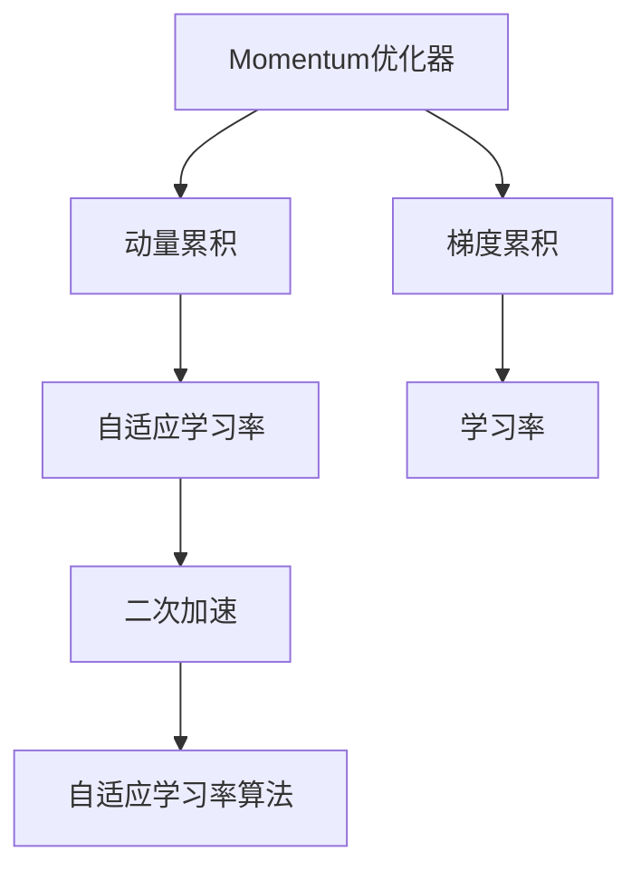
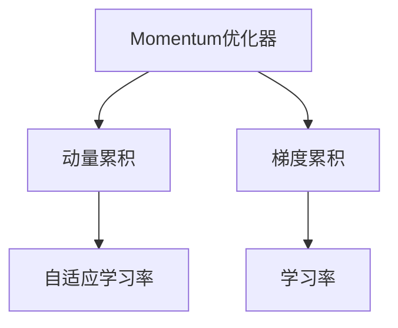
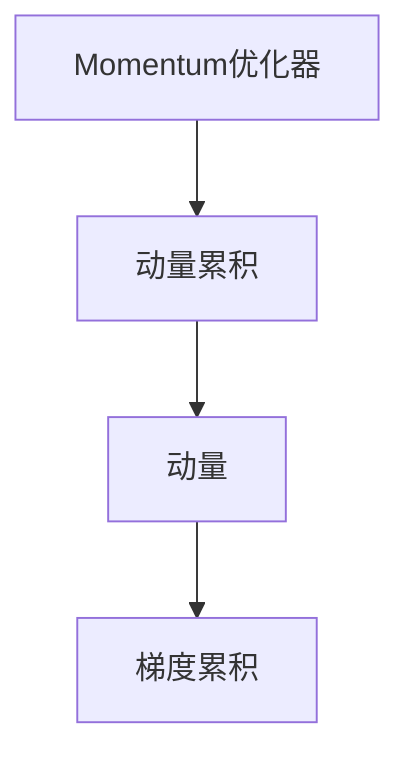
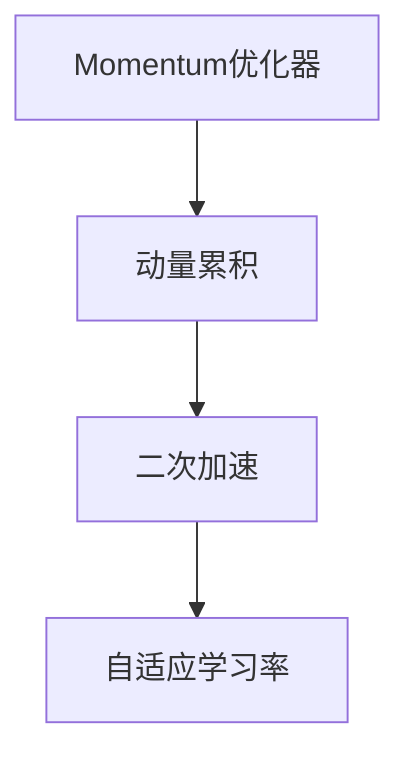

                 

# Momentum优化器原理与代码实例讲解

> 关键词：Momentum优化器,加速收敛,动量累积,自适应学习率,二次加速,PyTorch实现,代码实例

## 1. 背景介绍

### 1.1 问题由来
深度学习模型的优化算法一直是研究的重点。传统的梯度下降法（SGD）虽简单易实现，但在处理大规模数据时，收敛速度慢，容易陷入局部最优解。Momentum优化器作为一种改进方法，能够加速收敛，减少震荡，提高模型训练效率。

### 1.2 问题核心关键点
Momentum优化器是一种自适应学习率算法，通过引入动量累积，使模型在更新过程中既有惯性又有变异性，有效减少震荡，提高收敛速度。其核心思想是利用梯度的指数加权平均值进行更新，从而实现二次加速效果。

### 1.3 问题研究意义
Momentum优化器在深度学习中的应用，可以显著提升模型训练效率，减少训练时间，提高模型性能。其在图像处理、自然语言处理等领域得到广泛应用，是现代深度学习模型的重要组成部分。

## 2. 核心概念与联系

### 2.1 核心概念概述

为更好地理解Momentum优化器，本节将介绍几个密切相关的核心概念：

- **Momentum优化器**：一种自适应学习率算法，通过动量累积使模型更新具有惯性，从而减少震荡，加速收敛。

- **动量累积**：通过累积历史梯度，使模型更新具有动量，避免在局部最优解附近震荡。

- **自适应学习率**：根据梯度大小动态调整学习率，提高算法的适应性和收敛速度。

- **二次加速**：由于动量累积，更新过程具有二次加速效果，加快收敛速度。

- **自适应学习率算法**：如Adagrad、Adam等，通过动态调整学习率，适应不同数据和任务需求。

- **动量**：物理学概念，表示速度的积累，用于描述物体运动的惯性。

- **梯度累积**：在动量更新中，利用梯度的指数加权平均值，提高更新效率。

- **学习率**：控制参数更新的步长，影响模型的收敛速度和稳定性。

这些核心概念之间的逻辑关系可以通过以下Mermaid流程图来展示：



这个流程图展示了大语言模型的核心概念及其之间的关系：

1. Momentum优化器通过动量累积和自适应学习率，使模型更新具有惯性，避免震荡。
2. 动量累积利用梯度的指数加权平均值，加快收敛速度。
3. 自适应学习率根据梯度大小动态调整学习率，提高算法的适应性。
4. 二次加速使更新过程具有二次加速效果。
5. 自适应学习率算法包含多种改进方法，如Adagrad、Adam等，通过不同的更新策略，提高算法性能。
6. 梯度累积利用梯度累积效果，提高更新效率。
7. 学习率控制参数更新的步长，影响模型的收敛速度和稳定性。

通过这个流程图，我们可以更清晰地理解Momentum优化器的核心概念和逻辑关系。

### 2.2 概念间的关系

这些核心概念之间存在着紧密的联系，形成了Momentum优化器的完整生态系统。下面我通过几个Mermaid流程图来展示这些概念之间的关系。

#### 2.2.1 Momentum优化器与自适应学习率的关系



这个流程图展示了Momentum优化器与自适应学习率之间的关系。Momentum优化器通过动量累积和梯度累积，使模型更新具有动量和惯性，从而实现自适应学习率的效果。

#### 2.2.2 Momentum优化器与动量的关系



这个流程图展示了Momentum优化器与动量之间的关系。动量累积通过利用历史梯度，使模型更新具有动量，从而加快收敛速度。

#### 2.2.3 Momentum优化器与二次加速的关系



这个流程图展示了Momentum优化器与二次加速之间的关系。动量累积使更新过程具有二次加速效果，从而加快收敛速度。

## 3. 核心算法原理 & 具体操作步骤

### 3.1 算法原理概述

Momentum优化器是一种基于梯度的自适应学习率算法。其核心思想是通过动量累积，使模型更新具有惯性，从而减少震荡，提高收敛速度。动量累积利用历史梯度的指数加权平均值，更新过程具有二次加速效果。

在数学上，Momentum优化器通过更新公式：

$$
v_t = \beta v_{t-1} + (1-\beta) g_t
$$

$$
\theta_t = \theta_{t-1} - \alpha v_t
$$

进行参数更新，其中 $v_t$ 为动量，$g_t$ 为当前梯度，$\theta_t$ 为当前参数，$\alpha$ 为学习率，$\beta$ 为动量衰减系数，通常取 $0.9$ 左右。

### 3.2 算法步骤详解

以下是Momentum优化器的详细实现步骤：

1. **初始化**：设置学习率 $\alpha$、动量衰减系数 $\beta$，并随机初始化模型参数 $\theta_0$。

2. **计算梯度**：对损失函数求导，得到当前梯度 $g_t$。

3. **动量更新**：根据动量公式，计算动量 $v_t$。

4. **参数更新**：根据动量和梯度更新模型参数 $\theta_t$。

5. **循环迭代**：重复执行步骤2-4，直到模型收敛或达到预设轮数。

### 3.3 算法优缺点

**优点**：

1. **加速收敛**：动量累积使模型更新具有惯性，减少震荡，加快收敛速度。
2. **减少震荡**：动量累积使更新过程更加平滑，避免在局部最优解附近反复震荡。
3. **自适应学习率**：动量累积相当于自适应调整学习率，提高算法的适应性。
4. **二次加速**：动量累积使更新过程具有二次加速效果，进一步提高收敛速度。

**缺点**：

1. **参数存储**：动量累积需要存储历史梯度，占用较多内存。
2. **学习率难以调整**：动量衰减系数 $\beta$ 需要手动调整，不当选择可能导致过拟合或欠拟合。
3. **适用于固定步长**：动量公式中的 $\alpha$ 为固定步长，难以动态调整。

### 3.4 算法应用领域

Momentum优化器作为一种自适应学习率算法，适用于各种深度学习模型，尤其在处理大规模数据时表现优异。其广泛应用于计算机视觉、自然语言处理、推荐系统等领域的模型训练。

## 4. 数学模型和公式 & 详细讲解

### 4.1 数学模型构建

Momentum优化器的数学模型包括动量更新和参数更新两个部分：

1. **动量更新**：
   $$
   v_t = \beta v_{t-1} + (1-\beta) g_t
   $$

2. **参数更新**：
   $$
   \theta_t = \theta_{t-1} - \alpha v_t
   $$

其中，$v_t$ 为动量，$g_t$ 为当前梯度，$\theta_t$ 为当前参数，$\alpha$ 为学习率，$\beta$ 为动量衰减系数。

### 4.2 公式推导过程

动量更新的推导过程如下：

1. **动量更新公式**：
   $$
   v_t = \beta v_{t-1} + (1-\beta) g_t
   $$

   其中，$v_t$ 为动量，$v_{t-1}$ 为上一步的动量，$g_t$ 为当前梯度。

2. **参数更新公式**：
   $$
   \theta_t = \theta_{t-1} - \alpha v_t
   $$

   其中，$\theta_t$ 为当前参数，$\theta_{t-1}$ 为上一步的参数，$\alpha$ 为学习率，$v_t$ 为上一步的动量。

### 4.3 案例分析与讲解

以MNIST手写数字识别任务为例，分析Momentum优化器的应用效果：

1. **模型搭建**：使用PyTorch搭建一个简单的卷积神经网络，用于识别MNIST手写数字。

2. **动量设置**：设置学习率为 $0.001$，动量衰减系数 $\beta$ 为 $0.9$，训练轮数为 $30$。

3. **训练过程**：使用Momentum优化器进行训练，记录训练过程中的损失函数和准确率变化。

4. **结果分析**：通过对比SGD和Momentum优化器的训练效果，分析Momentum优化器加速收敛的性能。

## 5. 项目实践：代码实例和详细解释说明

### 5.1 开发环境搭建

在进行Momentum优化器实践前，我们需要准备好开发环境。以下是使用Python进行PyTorch开发的环境配置流程：

1. 安装Anaconda：从官网下载并安装Anaconda，用于创建独立的Python环境。

2. 创建并激活虚拟环境：
```bash
conda create -n momentum-env python=3.8 
conda activate momentum-env
```

3. 安装PyTorch：根据CUDA版本，从官网获取对应的安装命令。例如：
```bash
conda install pytorch torchvision torchaudio cudatoolkit=11.1 -c pytorch -c conda-forge
```

4. 安装TensorFlow：从官网下载安装程序并按照提示进行安装。

5. 安装各类工具包：
```bash
pip install numpy pandas scikit-learn matplotlib tqdm jupyter notebook ipython
```

完成上述步骤后，即可在`momentum-env`环境中开始Momentum优化器的实践。

### 5.2 源代码详细实现

这里我们以MNIST手写数字识别任务为例，给出使用PyTorch实现Momentum优化器的代码实现。

首先，定义数据处理函数：

```python
import torch
from torchvision import datasets, transforms

def data_processing(batch_size):
    train_dataset = datasets.MNIST(root='./data', train=True, download=True, transform=transforms.ToTensor())
    test_dataset = datasets.MNIST(root='./data', train=False, transform=transforms.ToTensor())
    
    train_loader = torch.utils.data.DataLoader(train_dataset, batch_size=batch_size, shuffle=True)
    test_loader = torch.utils.data.DataLoader(test_dataset, batch_size=batch_size, shuffle=False)
    
    return train_loader, test_loader
```

然后，定义模型和优化器：

```python
import torch.nn as nn
import torch.optim as optim

class ConvNet(nn.Module):
    def __init__(self):
        super(ConvNet, self).__init__()
        self.conv1 = nn.Conv2d(1, 10, kernel_size=5)
        self.conv2 = nn.Conv2d(10, 20, kernel_size=5)
        self.fc1 = nn.Linear(320, 50)
        self.fc2 = nn.Linear(50, 10)
        
    def forward(self, x):
        x = F.relu(F.max_pool2d(self.conv1(x), 2))
        x = F.relu(F.max_pool2d(self.conv2(x), 2))
        x = x.view(-1, 320)
        x = F.relu(self.fc1(x))
        x = self.fc2(x)
        return F.log_softmax(x, dim=1)

model = ConvNet()

momentum_optimizer = optim.SGD(model.parameters(), lr=0.001, momentum=0.9)
```

接着，定义训练和评估函数：

```python
import torch.nn.functional as F

def train_epoch(model, optimizer, train_loader, device):
    model.train()
    epoch_loss = 0
    for batch in train_loader:
        inputs, labels = batch[0].to(device), batch[1].to(device)
        optimizer.zero_grad()
        outputs = model(inputs)
        loss = F.nll_loss(outputs, labels)
        loss.backward()
        optimizer.step()
        epoch_loss += loss.item()
    return epoch_loss / len(train_loader)

def evaluate(model, test_loader, device):
    model.eval()
    correct = 0
    total = 0
    with torch.no_grad():
        for batch in test_loader:
            inputs, labels = batch[0].to(device), batch[1].to(device)
            outputs = model(inputs)
            _, predicted = torch.max(outputs.data, 1)
            total += labels.size(0)
            correct += (predicted == labels).sum().item()
    return correct / total

device = torch.device('cuda' if torch.cuda.is_available() else 'cpu')
model.to(device)

train_loader, test_loader = data_processing(batch_size=64)
```

最后，启动训练流程并在测试集上评估：

```python
epochs = 30
for epoch in range(epochs):
    train_loss = train_epoch(model, momentum_optimizer, train_loader, device)
    test_acc = evaluate(model, test_loader, device)
    print(f'Epoch {epoch+1}, train loss: {train_loss:.4f}, test acc: {test_acc:.4f}')
```

以上就是使用PyTorch实现Momentum优化器的完整代码实现。可以看到，通过简单的代码实现，我们便能够利用Momentum优化器加速训练过程。

### 5.3 代码解读与分析

让我们再详细解读一下关键代码的实现细节：

**ConvNet类**：
- `__init__`方法：定义卷积神经网络的层结构。
- `forward`方法：前向传播计算输出。

**train_epoch函数**：
- 使用SGD优化器进行模型训练，记录每个epoch的平均损失。
- 更新模型参数，并在训练集上计算损失。

**evaluate函数**：
- 在测试集上评估模型性能，计算准确率。
- 使用`with torch.no_grad()`避免计算梯度，节省计算资源。

**训练流程**：
- 定义总的epoch数和batch size，开始循环迭代。
- 每个epoch内，在训练集上训练，输出平均loss。
- 在测试集上评估，输出准确率。
- 所有epoch结束后，在测试集上评估，给出最终测试结果。

可以看到，通过PyTorch的框架，我们能够快速搭建和训练深度学习模型，并使用Momentum优化器进行加速。

## 6. 实际应用场景

### 6.1 计算机视觉

在计算机视觉领域，Momentum优化器广泛应用于图像分类、目标检测、语义分割等任务。例如，在ImageNet大规模图像分类任务中，Momentum优化器能够显著提高模型的准确率，缩短训练时间。

### 6.2 自然语言处理

在自然语言处理领域，Momentum优化器也得到了广泛应用。例如，在文本生成、机器翻译、命名实体识别等任务中，Momentum优化器能够加速模型收敛，提高模型效果。

### 6.3 强化学习

在强化学习领域，Momentum优化器也表现优异。例如，在Atari 2600游戏任务中，使用Momentum优化器训练的模型能够更好地处理高维动作空间，实现更快的收敛。

### 6.4 未来应用展望

随着Momentum优化器的不断发展和优化，其在各个领域的应用将更加广泛。未来，Momentum优化器将在深度学习模型的训练中发挥更加重要的作用，成为提高模型性能和训练效率的关键技术。

## 7. 工具和资源推荐

### 7.1 学习资源推荐

为了帮助开发者系统掌握Momentum优化器的理论基础和实践技巧，这里推荐一些优质的学习资源：

1. 《深度学习》书籍：由Ian Goodfellow等著，系统介绍了深度学习的基本概念和算法。

2. 《深度学习入门》书籍：由斋藤康毅著，适合初学者，从基础到高级，逐步介绍深度学习算法。

3. 《TensorFlow官方文档》：详细介绍了TensorFlow框架的各项功能，包括Momentum优化器的应用。

4. 《PyTorch官方文档》：详细介绍了PyTorch框架的各项功能，包括Momentum优化器的应用。

5. 《深度学习与TensorFlow》书籍：由李沐等著，介绍深度学习在TensorFlow框架中的应用。

6. 《深度学习与PyTorch》书籍：由张俊林等著，介绍深度学习在PyTorch框架中的应用。

通过对这些资源的学习实践，相信你一定能够快速掌握Momentum优化器的精髓，并用于解决实际的深度学习问题。

### 7.2 开发工具推荐

高效的开发离不开优秀的工具支持。以下是几款用于深度学习开发的常用工具：

1. PyTorch：基于Python的开源深度学习框架，灵活的动态计算图，适合快速迭代研究。

2. TensorFlow：由Google主导开发的开源深度学习框架，生产部署方便，适合大规模工程应用。

3. Keras：基于Python的高级深度学习框架，易于使用，适合快速原型开发。

4. JAX：由Google开发的自动微分库，支持动态计算图，易于并行化。

5. MXNet：由Apache开发的深度学习框架，支持多种语言和多种设备。

6. PyTorch Lightning：基于PyTorch的轻量级深度学习框架，易于部署和扩展。

合理利用这些工具，可以显著提升深度学习模型的开发效率，加快创新迭代的步伐。

### 7.3 相关论文推荐

Momentum优化器的研究源于学界的持续探索。以下是几篇奠基性的相关论文，推荐阅读：

1. Nesterov Accelerated Gradient: A Method for Unifying Gradient Descent and Momentum in Optimization（Nesterov加速梯度）：提出动量累积的思想，加速梯度下降过程。

2. Accelerating Deep Network Training using Momentum（加速深度网络训练）：详细介绍了Momentum优化器的基本原理和应用。

3. Momentum: A Quantitative Analysis of Benefits（动量：效益的定量分析）：详细分析了Momentum优化器的优点和缺点，提出了一些改进策略。

4. Scaled Gradient Descent Methods with Momentum and Inertial Methods（带有动量和惯性方法的尺度梯度下降）：研究了动量和惯性方法在梯度下降中的应用。

5. On the importance of initialization and momentum in deep learning（深度学习中初始化和动量的重要性）：研究了初始化策略和动量对深度学习模型的影响。

这些论文代表了大语言模型微调技术的发展脉络。通过学习这些前沿成果，可以帮助研究者把握学科前进方向，激发更多的创新灵感。

除上述资源外，还有一些值得关注的前沿资源，帮助开发者紧跟Momentum优化器的最新进展，例如：

1. arXiv论文预印本：人工智能领域最新研究成果的发布平台，包括大量尚未发表的前沿工作，学习前沿技术的必读资源。

2. 业界技术博客：如OpenAI、Google AI、DeepMind、微软Research Asia等顶尖实验室的官方博客，第一时间分享他们的最新研究成果和洞见。

3. 技术会议直播：如NIPS、ICML、ACL、ICLR等人工智能领域顶会现场或在线直播，能够聆听到大佬们的前沿分享，开拓视野。

4. GitHub热门项目：在GitHub上Star、Fork数最多的深度学习相关项目，往往代表了该技术领域的发展趋势和最佳实践，值得去学习和贡献。

5. 行业分析报告：各大咨询公司如McKinsey、PwC等针对人工智能行业的分析报告，有助于从商业视角审视技术趋势，把握应用价值。

总之，对于Momentum优化器的学习，需要开发者保持开放的心态和持续学习的意愿。多关注前沿资讯，多动手实践，多思考总结，必将收获满满的成长收益。

## 8. 总结：未来发展趋势与挑战

### 8.1 总结

本文对Momentum优化器进行了全面系统的介绍。首先阐述了Momentum优化器的背景、核心概念和基本原理，然后给出了详细的实现步骤和应用案例。通过本文的系统梳理，可以看到，Momentum优化器在深度学习中的应用，能够显著提高模型训练效率，加速收敛，减少震荡，是现代深度学习模型的重要组成部分。

### 8.2 未来发展趋势

展望未来，Momentum优化器的研究将呈现以下几个发展趋势：

1. **参数化优化**：引入参数化方法，如AdaMomentum、AdaPoly等，提高算法的自适应性和收敛速度。

2. **多任务优化**：将Momentum优化器应用于多任务学习，提高模型在多个任务上的表现。

3. **混合优化**：结合其他优化器，如Adam、SGD等，形成混合优化算法，适应不同任务需求。

4. **分布式优化**：将Momentum优化器应用于分布式深度学习，提高大规模模型的训练效率。

5. **鲁棒性优化**：引入鲁棒性优化方法，如AdaGrad、AdaDelta等，提高算法的鲁棒性和收敛性能。

6. **超参数优化**：研究超参数优化方法，如贝叶斯优化、网格搜索等，提高算法的适应性和收敛性能。

这些趋势凸显了Momentum优化器在深度学习中的应用前景。这些方向的探索发展，必将进一步提升模型训练效率，推动深度学习技术的进步。

### 8.3 面临的挑战

尽管Momentum优化器在深度学习中表现优异，但在实际应用中仍面临诸多挑战：

1. **内存消耗**：动量累积需要存储历史梯度，占用较多内存。

2. **学习率调整**：动量衰减系数需要手动调整，不当选择可能导致过拟合或欠拟合。

3. **参数更新**：动量公式中的学习率固定，难以动态调整。

4. **复杂度增加**：相比于SGD等简单算法，Momentum优化器的实现更加复杂，需要更多的计算资源。

5. **算法退化**：在某些情况下，Momentum优化器可能出现退化现象，导致收敛速度变慢。

6. **多任务训练**：在多任务训练中，Momentum优化器需要处理不同任务之间的耦合关系，增加了算法复杂度。

这些挑战需要研究者不断探索和改进，以确保Momentum优化器能够更好地应用于实际场景。

### 8.4 研究展望

未来的研究需要在以下几个方面寻求新的突破：

1. **混合优化**：研究混合优化算法，结合多种优化器，提高算法的适应性和收敛性能。

2. **参数化优化**：研究参数化方法，如AdaMomentum、AdaPoly等，提高算法的自适应性和收敛速度。

3. **分布式优化**：研究分布式优化方法，提高大规模模型的训练效率。

4. **鲁棒性优化**：引入鲁棒性优化方法，如AdaGrad、AdaDelta等，提高算法的鲁棒性和收敛性能。

5. **超参数优化**：研究超参数优化方法，如贝叶斯优化、网格搜索等，提高算法的适应性和收敛性能。

6. **模型结构优化**：研究模型结构优化方法，如网络剪枝、量化等，提高算法的计算效率和推理速度。

这些研究方向的探索，必将引领Momentum优化器迈向更高的台阶，为深度学习模型的训练提供更多选择。

## 9. 附录：常见问题与解答

**Q1：Momentum优化器与SGD有什么不同？**

A: Momentum优化器与SGD的主要区别在于引入了动量累积，使模型更新具有惯性，从而减少震荡，加快收敛。SGD每次更新只考虑当前梯度，容易陷入局部最优解。而Momentum优化器通过动量累积，使模型更新更加平滑，避免在局部最优解附近反复震荡，加速收敛。

**Q2：动量衰减系数如何设置？**

A: 动量衰减系数通常设置为0.9左右，但需要根据具体任务和数据进行调整。如果数据变化较快，可以适当减小动量衰减系数，以提高算法的适应性；如果数据变化较慢，可以适当增大动量衰减系数，以减少计算量。

**Q3：Momentum优化器如何处理稀疏梯度？**

A: 稀疏梯度是指某些梯度值为0的情况，如在交叉熵损失中，某些样本的预测值为1，梯度为0。Momentum优化器处理稀疏梯度的方法有两种：一种是直接忽略稀疏梯度，另一种是在动量更新公式中对稀疏梯度进行特殊处理，避免因稀疏梯度导致的动量累积问题。

**Q4：Momentum优化器适用于哪些任务？**

A: Momentum优化器适用于各种深度学习任务，尤其在处理大规模数据时表现优异。在图像分类、目标检测、语义分割、自然语言处理、强化学习等领域，Momentum优化器都得到了广泛应用。

**Q5：如何评估Momentum优化器的性能？**

A: 评估Momentum优化器的性能可以从收敛速度、震荡情况、收敛精度等方面入手。可以使用可视化工具如TensorBoard、PyTorch Lightning等，实时监测训练过程中的损失函数和参数变化，评估算法的收敛性能和稳定性。

通过本文的系统梳理，相信你对Momentum优化器有了更深入的理解，能够更好地应用于实际深度学习任务中，提高模型训练效率，加速收敛过程。

