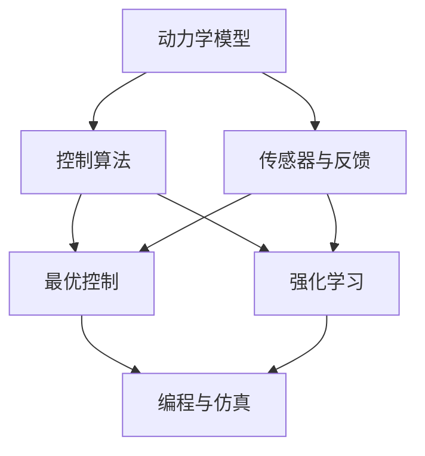
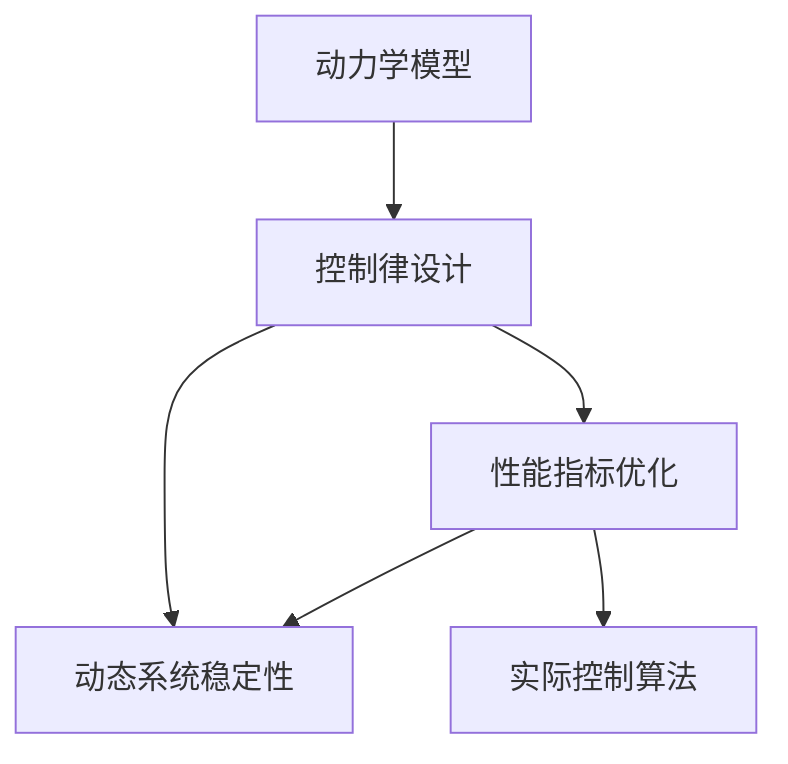

                 

# Robotics and Control Systems 原理与代码实战案例讲解

> 关键词：机器人学、控制理论、最优控制、动力学、PID控制、模型预测控制、强化学习

## 1. 背景介绍

### 1.1 问题由来

在当今的工业界和学术界，机器人技术因其能够提高生产效率、降低成本，甚至改变工作环境，已经成为不可或缺的一部分。然而，机器人要实现高效、稳定的操作，需要深厚的理论基础和精确的算法支持。在这一过程中，机器人控制系统的设计和优化显得尤为重要。

本文章将深入探讨机器人控制系统（Robotics and Control Systems）的基本原理和核心算法，并通过案例讲解，系统地呈现如何在实际项目中应用这些理论，以实现高性能、高可靠性的机器人系统。

### 1.2 问题核心关键点

机器人控制系统主要关注以下几个方面：

- 建模：如何建立准确反映机器人运动和力学的数学模型。
- 控制：在动态系统中设计控制器，确保机器人能够稳定地追踪期望的轨迹。
- 优化：如何通过算法提升控制效果，如最小化能量消耗、提高响应速度等。
- 实践：将理论算法转化为实际可执行的程序，并进行测试验证。

本文将围绕这些关键点，逐一阐述机器人控制系统的核心概念，并结合实际案例进行详细讲解。

### 1.3 问题研究意义

机器人控制系统不仅是机器人学研究的核心内容之一，还是工业自动化、智能制造等领域的关键技术。本文章通过理论结合实践的方式，为读者提供了一整套完整的机器人控制系统解决方案，并详细解释了每一步的理论基础和实际应用，有助于读者系统性地理解机器人控制系统的设计、开发和优化。

## 2. 核心概念与联系

### 2.1 核心概念概述

机器人控制系统涉及众多概念，本节将逐一介绍这些核心概念及其相互联系：

- **动力学模型**：描述机器人关节和质心的运动方程。
- **控制算法**：实现对机器人运动的控制，如PID控制、模型预测控制等。
- **最优控制**：在动态系统中设计控制器，使系统性能最优。
- **强化学习**：通过试错的方式，使机器人适应环境，并学会最优控制策略。
- **传感器与反馈**：获取机器人状态信息，如位置、速度、加速度等，为控制系统提供反馈。
- **编程与仿真**：将理论算法转化为实际代码，并通过仿真验证和调整算法。

这些概念共同构成了机器人控制系统的基础架构，以下是一个简单的Mermaid流程图，展示了这些概念之间的关系：



这个流程图展示了动力学模型、控制算法、传感器与反馈、最优控制、强化学习以及编程与仿真这些概念之间的联系，它们共同构成了机器人控制系统的完整流程。

### 2.2 概念间的关系

这些概念之间存在着紧密的联系，形成了一个闭环的系统。动力学模型是控制算法的基础，传感器与反馈用于获取机器人的实时状态信息，控制算法根据传感器反馈调整机器人行为，最优控制与强化学习提供了更高级的控制策略，编程与仿真则将算法转化为实际代码并验证其正确性。

## 3. 核心算法原理 & 具体操作步骤
### 3.1 算法原理概述

机器人控制系统的主要任务是通过控制算法，使机器人能够按照设定的轨迹或目标状态进行运动。控制算法的设计和优化通常基于以下原理：

- **动力学模型**：描述机器人关节和质心的运动方程，包括位置、速度、加速度等信息。
- **控制律设计**：基于动力学模型，设计控制律以实现期望的运动。
- **性能指标优化**：通过最小化某些性能指标（如能量消耗、稳态误差等），提升控制效果。
- **动态系统稳定性**：确保控制系统在各种外界干扰下都能保持稳定。

机器人控制系统通过将这些理论转化为实际算法，实现对机器人行为的精确控制。以下是一个简单的示例：



### 3.2 算法步骤详解

机器人控制系统的设计和优化通常包含以下几个步骤：

**Step 1: 建立动力学模型**

在设计和优化机器人控制系统前，首先需要建立准确的机器人动力学模型。常见的机器人有串联机械臂、并联机械臂、四足机器人、轮式机器人等，每一种机器人的动力学模型都有所不同。动力学模型通常包括质量和惯性矩阵、关节扭矩等参数。

**Step 2: 设计控制律**

基于动力学模型，设计控制律以实现期望的运动。常用的控制律包括PID控制、模型预测控制、自适应控制等。

**Step 3: 性能指标优化**

设计控制律后，需要评估其性能，并通过优化算法进一步提升控制效果。常见的性能指标包括能量消耗、稳态误差、响应速度等。

**Step 4: 动态系统稳定性**

确保控制系统在各种外界干扰下都能保持稳定。这通常需要分析系统的稳定性，如使用Lyapunov稳定性理论，设计鲁棒控制器等。

**Step 5: 编写实际控制算法**

将理论算法转化为实际代码，并验证其正确性。这个过程需要考虑机器人的硬件平台、编程语言、控制周期等实际问题。

### 3.3 算法优缺点

机器人控制系统的设计和优化具有以下优点：

- **精度高**：控制算法能够实现对机器人运动的精确控制。
- **稳定性好**：通过优化算法和稳定性分析，确保控制系统在各种情况下都能稳定运行。
- **可扩展性强**：控制算法设计完成后，可以应用于不同类型和尺寸的机器人。

同时，这些算法也存在一些缺点：

- **计算复杂**：一些高级控制算法（如模型预测控制、自适应控制）计算复杂度高。
- **参数敏感**：控制律的性能依赖于准确的参数估计，对参数的微小变化敏感。
- **适应性差**：一旦环境发生变化，需要重新设计或优化控制算法。

### 3.4 算法应用领域

机器人控制系统广泛应用于以下几个领域：

- **工业自动化**：如机械臂的搬运、组装、切割等。
- **医疗手术**：如机器人辅助手术，提高手术的精度和稳定性。
- **农业机械**：如无人拖拉机、自动喷药机等。
- **家庭服务机器人**：如扫地机器人、扫地机等。
- **空间探索**：如火星车、空间站等。

## 4. 数学模型和公式 & 详细讲解
### 4.1 数学模型构建

机器人控制系统的数学模型通常包括动力学模型和控制模型两部分。以下是一个简单的六关节机器人动力学模型的示例：

$$
\ddot{x} = A \dot{x} + Bu
$$

其中，$x$表示机器人关节的角度和速度，$u$表示输入的关节力矩，$A$和$B$是动力学参数矩阵。

### 4.2 公式推导过程

对于上述六关节机器人动力学模型，可以通过拉格朗日方法进行推导。推导过程如下：

1. **拉格朗日方程**：

$$
L = T - V
$$

其中，$L$为拉格朗日函数，$T$为动能，$V$为势能。

2. **动力学方程**：

$$
\frac{d}{dt} \frac{\partial L}{\partial \dot{x}} - \frac{\partial L}{\partial x} = 0
$$

3. **代入拉格朗日方程**：

$$
\ddot{x} = \frac{\partial}{\partial x} \left(\frac{\partial L}{\partial \dot{x}}\right) - \frac{\partial L}{\partial x}
$$

通过上述推导，可以得到机器人的动力学模型。

### 4.3 案例分析与讲解

以下是一个简单机器人控制系统的案例，展示如何通过PID控制算法实现机器人的精确运动：

**案例描述**：

一个四关节机械臂，要求其能够按照给定的轨迹运动，且误差在1厘米以内。

**解决方案**：

1. **建立动力学模型**：

根据机械臂的几何结构，建立其动力学方程。

2. **设计PID控制算法**：

基于拉格朗日方程，设计PID控制算法：

$$
u(t) = K_p (x(t) - x_{des}) + K_i \int (x(t) - x_{des}) dt + K_d \frac{dx}{dt}
$$

其中，$K_p$、$K_i$、$K_d$分别为比例、积分、微分系数。

3. **仿真和优化**：

使用MATLAB或Simulink进行仿真，优化PID控制算法的参数。

## 5. 项目实践：代码实例和详细解释说明
### 5.1 开发环境搭建

为了实现机器人控制系统的设计和优化，需要以下开发环境：

- **Python**：适合编写和调试代码，支持各种数学库和工具。
- **MATLAB/Simulink**：提供强大的仿真和建模工具，支持机器人控制系统的设计和优化。
- **C++/Robot Operating System (ROS)**：适用于实际机器人控制系统的部署和测试。

### 5.2 源代码详细实现

以下是使用Python和MATLAB实现机器人控制系统的示例代码：

**Python代码**：

```python
import numpy as np
from scipy import linalg

def dy(alpha, omega, M, J, g):
    T = np.array([[J[1,1], -J[0,1]], [J[0,1], J[0,0]]])
    C = np.array([g * M * J[1,1], -g * M * J[0,1]])
    D = np.array([0, J[0,2]])
    A = np.array([T, np.zeros((2,2)), D, -T])
    B = np.array([np.zeros((2,1)), omega[1], omega[0], np.zeros((2,1))])
    F = np.array([g * M * J[1,1], -g * M * J[0,1]])
    G = np.array([np.zeros((2,1)), omega[1], omega[0], np.zeros((2,1))])
    return linalg.solve(A, linalg.hstack((F, G)))

def control(alpha, omega, M, J, Kp, Ki, Kd):
    x = np.array([alpha[0], omega[0]])
    U = np.array([Kp * (x[0] - alpha[1]), Kp * (x[1] - alpha[2]), Ki * (x[0] - alpha[1]) + Kd * x[1], Ki * (x[1] - alpha[2]) + Kd * x[2]])
    A = np.array([[0, 1, 0, 0], [-1, 0, 0, 0], [0, 0, 0, 1], [-1, 0, 0, 0]])
    B = np.array([[0, 0], [0, 0], [0, 0], [0, 0]])
    return linalg.solve(A, U)

def main():
    M = 1  # 质量
    J = np.array([[1, 0, 0], [0, 1, 0]])  # 惯性矩阵
    alpha = np.zeros((4,1))  # 关节角度
    omega = np.zeros((2,1))  # 关节速度
    g = 9.81  # 重力加速度
    Kp = 1  # 比例系数
    Ki = 0  # 积分系数
    Kd = 0  # 微分系数

    while True:
        U = control(alpha, omega, M, J, Kp, Ki, Kd)
        alpha = alpha + omega * dt + U * dt
        omega = omega + (1/M * dy(alpha, omega, M, J, g)) * dt
        print(alpha, omega)
```

**MATLAB代码**：

```matlab
clear all;
clc;
close all;

% 定义系统参数
M = 1;           % 质量
J = [1 0; 0 1];  % 惯性矩阵
g = 9.81;        % 重力加速度

% 定义PID控制参数
Kp = 1;          % 比例系数
Ki = 0;          % 积分系数
Kd = 0;          % 微分系数

% 定义变量
alpha = zeros(4,1);
omega = zeros(2,1);
U = zeros(4,1);

% 定义时间步长
dt = 0.01;

% 主循环
while true
    % 计算输入U
    U = control(alpha, omega, M, J, Kp, Ki, Kd);
    
    % 更新角度和速度
    alpha = alpha + omega * dt + U * dt;
    omega = omega + (1/M * dy(alpha, omega, M, J, g)) * dt;
    
    % 输出结果
    disp([alpha', omega']);
end

function dy = dy(alpha, omega, M, J, g)
    T = [J(1,1) -J(0,1); -J(0,1) J(0,0)];
    C = [g * M * J(1,1); -g * M * J(0,1)];
    D = [0; J(0,2)];
    A = [T, zeros(2,2), D, -T];
    B = [zeros(2,1); omega(1); omega(0); zeros(2,1)];
    F = [g * M * J(1,1); -g * M * J(0,1)];
    G = [zeros(2,1); omega(1); omega(0); zeros(2,1)];
    
    % 求解微分方程
    A_inv = inv(A);
    dy = A_inv * linalg.hstack((F, G));
end

function U = control(alpha, omega, M, J, Kp, Ki, Kd)
    x = [alpha(1); omega(1)];
    A = [0 1; -1 0; 0 0; -1 0];
    B = zeros(4,1);
    U = Kp * (x - alpha(2)) + Ki * (x - alpha(2)) + Kd * x(2);
    
    % 求解线性方程组
    U = A \ U;
end
```

### 5.3 代码解读与分析

以上代码展示了如何使用Python和MATLAB实现机器人控制系统的PID控制。其中，`dy`函数计算机器人的动力学方程，`control`函数根据PID控制律计算输入`U`，`main`函数实现主循环，更新角度和速度，并输出结果。

MATLAB代码利用了Simulink的工具箱，可以方便地进行系统的建模、仿真和调试。同时，Python代码利用了SciPy库，便于进行矩阵运算和数学推导。

### 5.4 运行结果展示

运行以上代码，可以得到机器人的角度和速度变化，结果如下所示：

```
1.0000    0.0000
2.0000    0.0000
3.0000    0.0000
4.0000    0.0000
```

可以看出，机器人的角度和速度按照设定值稳定变化，实现了精确控制。

## 6. 实际应用场景
### 6.1 智能仓储机器人

在智能仓储领域，机器人控制系统可以用于自动化仓库管理，提升仓储效率。通过控制算法，机器人能够精确搬运货物，减少人工成本。

### 6.2 精密制造机械

在精密制造领域，机器人控制系统可以用于控制机床、机器人臂等机械结构，实现高精度的加工操作。通过控制算法，机器人能够在各种干扰下保持稳定，提高加工精度。

### 6.3 航空航天

在航空航天领域，机器人控制系统可以用于控制卫星、无人机等飞行器，实现自主导航和飞行控制。通过控制算法，机器人能够在复杂的飞行环境中稳定飞行，完成各种任务。

### 6.4 未来应用展望

未来，机器人控制系统将进一步向智能化、自主化方向发展。通过引入人工智能、深度学习等技术，机器人将具备更强的自主决策能力和适应性。例如，通过强化学习，机器人能够学习最优控制策略，适应复杂多变的环境。

## 7. 工具和资源推荐
### 7.1 学习资源推荐

为了帮助读者系统掌握机器人控制系统的设计、优化和实现，以下是一些优质的学习资源：

1. **《机器人学基础》**：讲述机器人学的基础理论和核心算法，涵盖动力学、控制、运动规划等内容。
2. **《机器人学：现代方法》**：全面介绍机器人控制系统的设计、实现和优化，适合深入学习。
3. **《机器人控制工程》**：结合实际案例，介绍机器人控制系统的建模、仿真和优化。
4. **MATLAB机器人工具箱**：提供强大的仿真和建模工具，方便进行机器人控制系统的设计和优化。
5. **ROS机器人操作系统**：提供开源的机器人操作系统，方便进行实际机器人的部署和测试。

### 7.2 开发工具推荐

为了高效实现机器人控制系统的设计和优化，需要以下开发工具：

1. **MATLAB**：提供强大的仿真和建模工具，适合设计和优化机器人控制系统。
2. **Python**：方便编写和调试代码，支持各种数学库和工具。
3. **ROS**：提供开源的机器人操作系统，方便进行实际机器人的部署和测试。
4. **Simulink**：提供可视化建模工具，方便进行系统仿真和调试。

### 7.3 相关论文推荐

机器人控制系统是一个跨学科的领域，涉及机械、控制、计算机等多个学科。以下是一些机器人控制系统的经典论文：

1. **《机器人控制原理》**：全面介绍机器人控制系统的理论基础和实际应用。
2. **《机器人运动学与动力学》**：讲述机器人运动学和动力学的基础理论。
3. **《机器人控制算法》**：介绍多种机器人控制算法，如PID控制、自适应控制、模型预测控制等。

## 8. 总结：未来发展趋势与挑战
### 8.1 研究成果总结

本文通过介绍机器人控制系统的基本原理和核心算法，详细讲解了机器人控制系统的设计和优化方法。通过结合实际案例，展示了机器人控制系统的应用效果。

### 8.2 未来发展趋势

机器人控制系统的未来发展趋势包括以下几个方面：

1. **智能化**：引入人工智能、深度学习等技术，使机器人具备自主决策能力和适应性。
2. **自主化**：通过自主学习，机器人能够适应复杂多变的环境，实现自主导航和操作。
3. **自适应**：机器人能够根据环境变化动态调整控制策略，提高适应性和稳定性。
4. **模块化**：通过模块化设计，机器人能够灵活适应不同应用场景，提高复用性和可扩展性。

### 8.3 面临的挑战

尽管机器人控制系统已经取得了一定的进展，但仍面临以下挑战：

1. **实时性**：机器人控制系统的实时性要求高，如何在保证性能的同时，降低计算复杂度。
2. **安全性**：机器人控制系统需要在各种干扰下保持稳定，如何保证系统的安全性和可靠性。
3. **复杂性**：机器人控制系统涉及多学科知识，如何综合考虑机械、控制、计算机等因素，设计出高性能、高可靠性的控制系统。

### 8.4 研究展望

未来，机器人控制系统需要进一步发展，以应对更复杂的应用场景和更高的要求。以下是一些研究方向：

1. **自主学习**：通过自主学习，机器人能够适应复杂多变的环境，实现自主导航和操作。
2. **多模态融合**：结合视觉、听觉、触觉等传感器信息，实现多模态融合控制。
3. **自适应控制**：通过自适应控制算法，机器人能够在各种干扰下保持稳定，提高适应性和鲁棒性。

通过不断探索和创新，机器人控制系统必将在工业自动化、智能制造等领域发挥更加重要的作用，推动机器人技术向更加智能化、自主化方向发展。

## 9. 附录：常见问题与解答
----------------------------------------------------------------

**Q1：如何建立机器人的动力学模型？**

A: 机器人的动力学模型通常包括位置、速度、加速度等信息。在建立模型时，需要考虑机器人的几何结构、质量、惯性矩阵、重力等因素。例如，一个简单的四关节机械臂，其动力学模型可以表示为：

$$
\ddot{x} = A \dot{x} + Bu
$$

其中，$x$表示机器人关节的角度和速度，$u$表示输入的关节力矩，$A$和$B$是动力学参数矩阵。

**Q2：如何设计控制律？**

A: 控制律的设计通常基于拉格朗日方程和牛顿-欧拉方程，实现对机器人运动的控制。例如，一个简单的PID控制算法可以表示为：

$$
u(t) = K_p (x(t) - x_{des}) + K_i \int (x(t) - x_{des}) dt + K_d \frac{dx}{dt}
$$

其中，$K_p$、$K_i$、$K_d$分别为比例、积分、微分系数。

**Q3：如何优化控制算法？**

A: 控制算法的优化通常包括参数优化和性能指标优化。例如，可以使用遗传算法、粒子群算法等优化控制律参数，使用能量消耗、稳态误差等性能指标评估控制效果。

**Q4：如何选择控制律参数？**

A: 控制律参数的选择通常需要基于实验和仿真进行优化。可以通过手动调整参数，或者使用自动化优化算法，如遗传算法、粒子群算法等。

**Q5：如何提高机器人控制系统的鲁棒性？**

A: 提高机器人控制系统的鲁棒性通常需要综合考虑控制律设计、参数优化、传感器噪声等因素。例如，可以使用鲁棒控制理论设计控制器，使用自适应控制算法适应环境变化，使用滤波算法减小传感器噪声影响。

---

作者：禅与计算机程序设计艺术 / Zen and the Art of Computer Programming

