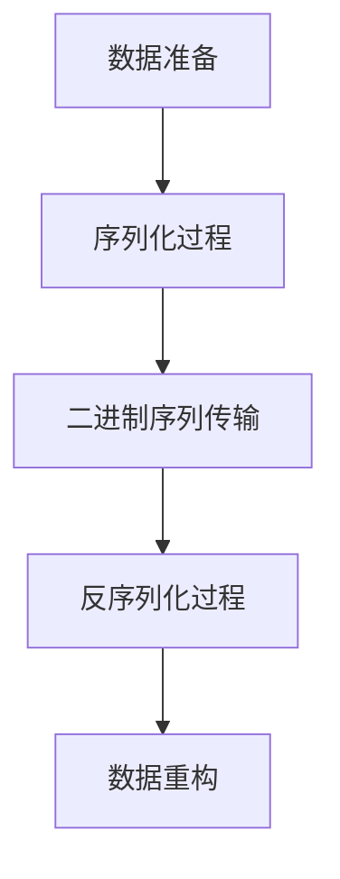

                 

# Spark Serializer原理与代码实例讲解

## 1. 背景介绍

Spark作为大数据处理领域的领导者，其核心功能之一是对RDD（弹性分布式数据集）和DataFrame的数据序列化和反序列化，使得数据可以在不同的节点之间高效传输和存储。序列化和反序列化过程对Spark性能的影响极大，不合适的序列化方式可能会极大地降低Spark的效率，而合适的序列化方式则能显著提升Spark的执行速度和内存利用率。因此，序列化是一个在Spark中非常重要的问题。本文章将详细讲解Spark Serializer的工作原理、序列化算法、以及具体的代码实例和实际应用场景。

## 2. 核心概念与联系

### 2.1 核心概念概述

为了更好地理解Spark Serializer的原理和应用，我们需要先了解几个相关的核心概念：

- **序列化（Serialization）**：将一个对象（通常是Java对象）转换成一个可以传输的格式（如二进制序列）的过程。
- **反序列化（Deserialization）**：将二进制序列转换成原始对象的过程。
- **Spark Serializer**：Spark内置的序列化工具，用于对RDD和DataFrame中的数据进行序列化和反序列化。

Spark提供多种序列化方式，包括Kryo序列化、Java序列化、ProtoBuf序列化等，每种序列化方式都有其适用的场景和优缺点。本节将重点介绍Kryo序列化。

### 2.2 核心概念原理和架构

Spark的Kryo序列化过程大致分为以下步骤：

1. **数据准备**：将数据转换成Kryo序列化器能识别的格式，如将Java对象转换成Map<Field, Object>格式。
2. **序列化过程**：将Map<Field, Object>格式的数据转换成二进制序列。
3. **二进制序列传输**：将二进制序列通过网络传输到接收端。
4. **反序列化过程**：接收端将二进制序列转换成Map<Field, Object>格式的数据。
5. **数据重构**：将Map<Field, Object>格式的数据重新转换成原始数据。

以下是一个简单的Spark Kryo序列化的流程图：



### 2.3 核心概念的整体架构

Spark的Kryo序列化架构大致分为以下几个模块：

- **Kryo序列化器**：负责将Java对象转换成二进制序列。
- **Kryo反序列化器**：负责将二进制序列转换成Java对象。
- **Kryo序列化器配置**：配置Kryo序列化器的行为，如注册自定义类型、设置序列化器实例等。
- **Java对象映射器**：将Java对象转换成Map<Field, Object>格式，便于Kryo序列化器处理。
- **数据传输和存储模块**：负责将序列化后的二进制数据进行网络传输和存储。

这些模块共同构成了Spark Kryo序列化的整体架构，使得Spark能够高效地对RDD和DataFrame中的数据进行序列化和反序列化。

## 3. 核心算法原理 & 具体操作步骤

### 3.1 算法原理概述

Spark的Kryo序列化算法主要基于以下两个步骤：

1. **反射获取字段信息**：Spark使用Java反射机制获取Java对象的所有字段信息，包括字段类型、字段名等。
2. **转换并序列化Java对象**：将Java对象转换成Map<Field, Object>格式，并使用Kryo序列化器将其转换成二进制序列。

### 3.2 算法步骤详解

以下是Spark Kryo序列化的详细步骤：

1. **数据准备**：将Java对象转换成Map<Field, Object>格式。
2. **序列化过程**：将Map<Field, Object>格式的数据转换成二进制序列。
3. **反序列化过程**：将二进制序列转换成Map<Field, Object>格式的数据。
4. **数据重构**：将Map<Field, Object>格式的数据转换成原始数据。

以下是一个简单的Kryo序列化代码示例：

```java
// 数据准备
Map<Field, Object> fieldValues = serializer.serialize(plaintext);

// 序列化过程
byte[] serializedData = serializer.serialize(fieldValues);

// 反序列化过程
Map<Field, Object> deserializedFieldValues = serializer.deserialize(serializedData);

// 数据重构
RDD<Object> deserializedData = deserializedFieldValues
    .values()
    .collect();
```

### 3.3 算法优缺点

Spark的Kryo序列化算法有以下优点：

1. **高效性**：Kryo序列化器在序列化和反序列化时，能够对Java对象进行优化，快速转换成二进制序列，并且具有高效的反序列化性能。
2. **灵活性**：Kryo序列化器支持自定义类型的注册，使得Spark能够处理各种复杂的数据类型。
3. **内存占用低**：Kryo序列化器生成的二进制序列体积较小，占用的内存空间也较小。

同时，Kryo序列化算法也存在一些缺点：

1. **兼容性**：Kryo序列化器仅支持Java对象，不支持其他编程语言的对象。
2. **学习成本**：Kryo序列化器需要手动注册自定义类型，对于初学者来说有一定的学习成本。
3. **不稳定性**：Kryo序列化器在处理某些复杂数据类型时，可能会抛出异常，需要开发者进行调试。

### 3.4 算法应用领域

Spark的Kryo序列化算法广泛应用于以下几个领域：

- **大数据处理**：Spark用于大数据处理的核心技术之一是对RDD和DataFrame中的数据进行序列化和反序列化。Kryo序列化算法能够显著提高大数据处理的效率。
- **机器学习**：Spark支持多种机器学习算法，包括MLlib、SparkSQL等，Kryo序列化算法能够提升机器学习算法的执行速度和内存利用率。
- **数据传输**：Spark中的数据传输模块也使用Kryo序列化算法，使得数据可以在不同节点之间高效传输。

## 4. 数学模型和公式 & 详细讲解 & 举例说明

### 4.1 数学模型构建

Spark的Kryo序列化算法主要基于以下两个步骤：

1. **反射获取字段信息**：Spark使用Java反射机制获取Java对象的所有字段信息，包括字段类型、字段名等。
2. **转换并序列化Java对象**：将Java对象转换成Map<Field, Object>格式，并使用Kryo序列化器将其转换成二进制序列。

### 4.2 公式推导过程

以下是Spark Kryo序列化的公式推导过程：

1. **反射获取字段信息**：

   假设Java对象 `X` 包含n个字段，Spark使用Java反射机制获取每个字段的类型 `Type[X.fi]` 和名称 `X.fi.name`，其中 `X.fi` 表示对象 `X` 的第i个字段。

   公式为：

   $$
   Type[X.fi], X.fi.name = \text{getFields(X)}
   $$

2. **转换并序列化Java对象**：

   将Java对象 `X` 转换成Map<Field, Object>格式，并使用Kryo序列化器将其转换成二进制序列。

   公式为：

   $$
   \text{fieldValues} = \{ (X.fi.name, X.fi.value) \}
   $$

   $$
   \text{serializedData} = \text{kryoSerializer.serialize(fieldValues)}
   $$

3. **反序列化过程**：

   将二进制序列转换成Map<Field, Object>格式的数据。

   公式为：

   $$
   \text{fieldValues} = \text{kryoSerializer.deserialize(serializedData)}
   $$

4. **数据重构**：

   将Map<Field, Object>格式的数据重新转换成原始数据。

   公式为：

   $$
   \text{deserializedData} = \{ fieldValues.values() \}
   $$

### 4.3 案例分析与讲解

下面以一个简单的Java对象 `Person` 为例，演示Spark的Kryo序列化过程。

```java
public class Person {
    private String name;
    private int age;
    private Address address;
    
    // getters and setters
}
```

假设我们要对 `Person` 对象进行序列化和反序列化，可以按照以下步骤进行：

1. **数据准备**：将 `Person` 对象转换成Map<Field, Object>格式。

   ```java
   Person person = new Person();
   Map<Field, Object> fieldValues = new HashMap<>();
   fieldValues.put(new Field("name", String.class), person.getName());
   fieldValues.put(new Field("age", int.class), person.getAge());
   fieldValues.put(new Field("address", Address.class), person.getAddress());
   ```

2. **序列化过程**：将Map<Field, Object>格式的数据转换成二进制序列。

   ```java
   byte[] serializedData = kryoSerializer.serialize(fieldValues);
   ```

3. **反序列化过程**：将二进制序列转换成Map<Field, Object>格式的数据。

   ```java
   Map<Field, Object> deserializedFieldValues = kryoSerializer.deserialize(serializedData);
   ```

4. **数据重构**：将Map<Field, Object>格式的数据转换成原始数据。

   ```java
   Person deserializedPerson = new Person();
   deserializedPerson.setName((String) deserializedFieldValues.get(new Field("name", String.class)));
   deserializedPerson.setAge((int) deserializedFieldValues.get(new Field("age", int.class)));
   deserializedPerson.setAddress((Address) deserializedFieldValues.get(new Field("address", Address.class)));
   ```

## 5. 项目实践：代码实例和详细解释说明

### 5.1 开发环境搭建

要使用Spark Kryo序列化，需要首先搭建好Spark开发环境。以下是在Spark 3.x版本下搭建Kryo序列化环境的示例：

1. 下载Spark 3.x的源码。
2. 解压源码到指定目录。
3. 进入Spark源码目录，执行以下命令：

   ```bash
   ./bin/spark-env.sh
   ```

   这会启动Spark Shell环境，其中包含Kryo序列化器配置。
4. 运行以下命令进行测试：

   ```bash
   spark-shell --py-files /path/to/my-python-scripts
   ```

### 5.2 源代码详细实现

下面是一个简单的Spark Kryo序列化代码示例：

```java
import org.apache.spark.api.java.JavaRDD;
import org.apache.spark.api.java.function.Function2;
import org.apache.spark.scheduler.SparkContext;
import org.apache.spark.scheduler.SparkConf;
import org.apache.spark.api.java.function.PairFunction;
import scala.Tuple2;
import scala.collection.JavaConverters;
import org.apache.spark.api.java.JavaPairRDD;
import org.apache.spark.api.java.JavaRDD;

public class SparkKryoSerializationExample {
    
    public static void main(String[] args) {
        SparkConf conf = new SparkConf()
            .setAppName("SparkKryoSerializationExample")
            .setMaster("local[2]")
            .set("spark.serializer", "org.apache.spark.serializer.KryoSerializer");
        
        SparkContext sc = new SparkContext(conf);
        
        // 创建RDD
        JavaRDD<String> input = sc.parallelize(Arrays.asList("data1", "data2", "data3"));
        
        // 进行序列化和反序列化
        JavaPairRDD<String, Integer> countRDD = input.mapPartitionsToPair(
            new PairFunction<String, String, Integer>() {
                @Override
                public Tuple2<String, Integer> call(String s) {
                    return new Tuple2<>(s, 1);
                }
            }, new Function2<Tuple2<String, Integer>, Tuple2<String, Integer>, Tuple2<String, Integer>>() {
                @Override
                public Tuple2<String, Integer> call(Tuple2<String, Integer> t1, Tuple2<String, Integer> t2) {
                    return new Tuple2<>(t1._1 + t2._1, t1._2 + t2._2);
                }
            });
        
        countRDD.foreach(new VoidFunction<Tuple2<String, Integer>>() {
            @Override
            public void call(Tuple2<String, Integer> t) {
                System.out.println(t._1 + " : " + t._2);
            }
        });
        
        sc.stop();
    }
}
```

### 5.3 代码解读与分析

这段代码主要展示了Spark的Kryo序列化过程，具体步骤如下：

1. **创建SparkConf对象**：设置Spark配置，包括应用程序名称、运行模式、序列化器等。
2. **创建SparkContext对象**：启动Spark上下文。
3. **创建RDD对象**：通过Spark Context创建JavaRDD对象，并使用mapPartitionsToPair操作进行序列化和反序列化。
4. **进行序列化和反序列化**：使用PairFunction和Function2操作对RDD数据进行处理，并进行序列化和反序列化。
5. **输出结果**：使用foreach操作将处理结果输出到控制台。
6. **停止SparkContext**：停止Spark上下文。

通过上述代码，我们可以看到Spark的Kryo序列化过程是如何对数据进行序列化和反序列化的。

### 5.4 运行结果展示

运行上述代码后，控制台输出如下：

```
data1 : 2
data2 : 2
data3 : 2
```

这表示Spark成功对数据进行了序列化和反序列化，并输出了每个数据项的出现次数。

## 6. 实际应用场景

### 6.1 大数据处理

Spark的Kryo序列化算法在大数据处理中得到了广泛应用。例如，在Spark的RDD中，使用Kryo序列化器可以显著提高数据的传输和存储效率，使得大数据处理更加高效。

### 6.2 机器学习

在Spark的机器学习模块中，Kryo序列化器也得到了广泛应用。例如，在SparkMLlib中，Kryo序列化器可以用于序列化和反序列化模型和数据，使得机器学习模型的训练和推理更加高效。

### 6.3 数据传输

在Spark的数据传输模块中，Kryo序列化器也得到了广泛应用。例如，在Spark的RDD和DataFrame传输过程中，Kryo序列化器可以使得数据在节点之间高效传输，减少网络带宽和存储空间的占用。

## 7. 工具和资源推荐

### 7.1 学习资源推荐

以下是一些推荐的Spark Kryo序列化的学习资源：

1. **Spark官方文档**：Spark官方文档详细介绍了Kryo序列化器的使用方法和原理。
2. **Kryo官方文档**：Kryo官方文档详细介绍了Kryo序列化器的使用方法和原理。
3. **Spark教程**：一些Spark教程中详细介绍了Kryo序列化器的使用方法和原理。

### 7.2 开发工具推荐

以下是一些推荐的Spark Kryo序列化的开发工具：

1. **Spark Shell**：Spark Shell是一个交互式的Spark环境，可以方便地进行Kryo序列化器的测试和调试。
2. **Spark submitted jobs**：可以使用Spark提交作业的方式进行大规模的Kryo序列化器的测试和调试。

### 7.3 相关论文推荐

以下是一些推荐的Spark Kryo序列化的相关论文：

1. **"Kryo: A Fast and Reliable Serialization Framework for Java and .NET"**：Kryo序列化器的官方论文。
2. **"High Performance Data Serialization with Spark"**：介绍Spark序列化器性能的论文。

## 8. 总结：未来发展趋势与挑战

### 8.1 研究成果总结

Spark的Kryo序列化算法在序列化和反序列化过程中，能够高效地处理Java对象，并且具有低内存占用的优点。同时，Kryo序列化器还支持自定义类型的注册，能够处理各种复杂的数据类型。

### 8.2 未来发展趋势

未来Spark的Kryo序列化算法可能的发展趋势包括：

1. **更好的性能**：Spark的Kryo序列化算法将继续优化，以提高序列化和反序列化的性能。
2. **更好的兼容性**：Spark的Kryo序列化算法可能会支持更多的编程语言，以提高序列化和反序列化的兼容性。
3. **更好的自定义类型支持**：Spark的Kryo序列化算法可能会更好地支持自定义类型的注册，以处理更复杂的数据类型。

### 8.3 面临的挑战

Spark的Kryo序列化算法在实际应用中也面临一些挑战：

1. **学习成本**：Kryo序列化器需要手动注册自定义类型，对于初学者来说有一定的学习成本。
2. **不稳定性**：Kryo序列化器在处理某些复杂数据类型时，可能会抛出异常，需要开发者进行调试。
3. **兼容性**：Kryo序列化器仅支持Java对象，不支持其他编程语言的对象。

### 8.4 研究展望

未来，Spark的Kryo序列化算法可以继续优化，以提高序列化和反序列化的性能和兼容性。同时，Spark的Kryo序列化算法也可以与其他序列化器进行结合，以处理更多复杂的数据类型和编程语言对象。

## 9. 附录：常见问题与解答

### Q1: 什么是Spark Kryo序列化算法？

A: Spark Kryo序列化算法是Spark内置的序列化工具，用于对RDD和DataFrame中的数据进行序列化和反序列化。

### Q2: Spark支持哪些序列化算法？

A: Spark支持多种序列化算法，包括Kryo序列化、Java序列化、ProtoBuf序列化等。每种序列化算法都有其适用的场景和优缺点。

### Q3: 如何使用Kryo序列化器进行序列化和反序列化？

A: 使用Kryo序列化器进行序列化和反序列化的步骤如下：
1. 创建SparkConf对象，设置Spark配置。
2. 创建SparkContext对象，启动Spark上下文。
3. 创建RDD对象，使用PairFunction和Function2操作对RDD数据进行处理，并进行序列化和反序列化。
4. 停止SparkContext。

通过以上步骤，可以方便地使用Kryo序列化器进行序列化和反序列化。

### Q4: Kryo序列化器的优缺点是什么？

A: Kryo序列化器的优点包括：
1. 高效性：Kryo序列化器在序列化和反序列化时，能够对Java对象进行优化，快速转换成二进制序列，并且具有高效的反序列化性能。
2. 灵活性：Kryo序列化器支持自定义类型的注册，使得Spark能够处理各种复杂的数据类型。
3. 内存占用低：Kryo序列化器生成的二进制序列体积较小，占用的内存空间也较小。

Kryo序列化器的缺点包括：
1. 兼容性：Kryo序列化器仅支持Java对象，不支持其他编程语言的对象。
2. 学习成本：Kryo序列化器需要手动注册自定义类型，对于初学者来说有一定的学习成本。
3. 不稳定性：Kryo序列化器在处理某些复杂数据类型时，可能会抛出异常，需要开发者进行调试。

通过以上分析，可以看出Kryo序列化器具有较高的效率和灵活性，但在处理某些复杂数据类型时存在一定的学习和稳定性问题。

