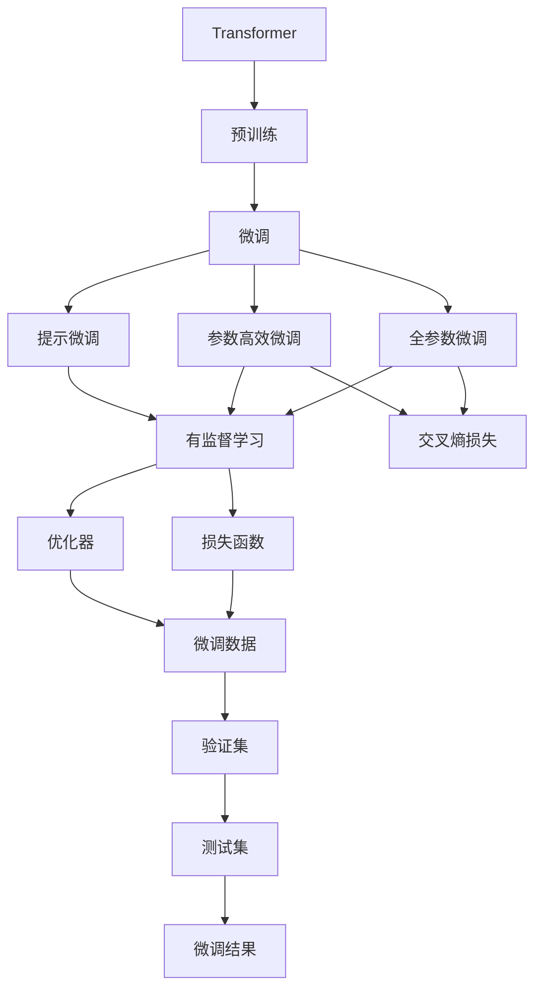
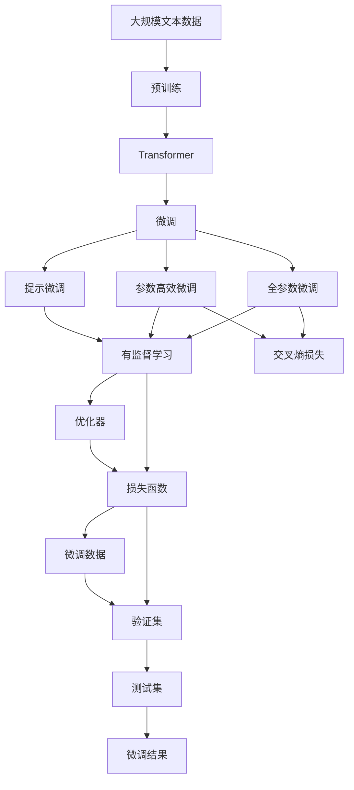

                 

# Transformer大模型实战 文本分类任务

> 关键词：Transformer, 大模型, 文本分类, 深度学习, 自然语言处理(NLP), 预训练, 微调

## 1. 背景介绍

### 1.1 问题由来

近年来，随着深度学习技术的快速发展，预训练大模型在自然语言处理(NLP)领域取得了显著进展。预训练模型如BERT、GPT-3等，通过在大规模无标签文本数据上进行预训练，学习到了丰富的语言知识和语义表示。然而，这些模型在大规模语料上训练，具有极高的参数量和计算资源需求，无法直接在资源有限的场景下应用。

为了提升预训练模型在特定领域的应用能力，人们引入了微调(fine-tuning)技术。微调是指在预训练模型上，通过有标签数据进行细粒度训练，以适应特定任务。与从头训练模型相比，微调具有训练时间短、性能提升显著等优势。

本文将以文本分类任务为例，详细讲解如何使用Transformer大模型进行微调，提升模型在特定领域的分类效果。

### 1.2 问题核心关键点

微调的核心在于选择合适的训练数据、损失函数和优化器，以及避免过拟合等常见问题。微调的目标是在保留预训练模型权重的基础上，通过有限的数据训练，提升模型在特定任务上的性能。

微调的关键点包括：
1. 选择合适的预训练模型和微调数据集。
2. 设计合适的损失函数和优化器。
3. 设定合适的学习率和批处理大小。
4. 应用正则化技术，如权重衰减、Dropout等，防止过拟合。
5. 在验证集上监测模型性能，避免过拟合。

本文将通过详细的步骤讲解如何在具体的文本分类任务中使用Transformer大模型进行微调，以提升模型的分类效果。

## 2. 核心概念与联系

### 2.1 核心概念概述

为更好地理解微调技术，本节将介绍几个密切相关的核心概念：

- **Transformer**：一种基于自注意力机制的神经网络架构，广泛应用于自然语言处理任务，包括预训练和微调。
- **预训练**：指在大规模无标签数据上，通过自监督学习任务训练模型。
- **微调**：指在预训练模型上，通过有标签数据进行细粒度训练，以适应特定任务。
- **损失函数**：衡量模型预测与真实标签之间的差异。
- **优化器**：调整模型参数以最小化损失函数。
- **过拟合**：模型在训练集上表现良好，但在测试集上表现较差的现象。

这些概念之间通过微调技术紧密联系，共同构成大模型在特定任务上的应用框架。

### 2.2 概念间的关系

这些核心概念之间存在紧密的联系，形成了微调技术的基本架构。下面通过几个Mermaid流程图来展示这些概念之间的关系：



这个流程图展示了预训练、微调和各个核心概念之间的紧密联系：

1. Transformer在大规模无标签数据上进行预训练，学习通用的语言表示。
2. 微调是在预训练模型的基础上，通过有标签数据进行细粒度训练，以适应特定任务。
3. 微调过程中，可以采用全参数微调或参数高效微调，以提高微调效率。
4. 微调可以使用提示微调，在不更新模型参数的情况下，进行少样本学习。
5. 微调的目标函数通常采用交叉熵损失，优化器如AdamW等。
6. 微调数据集用于训练和验证模型性能，测试集用于评估模型在未见过的数据上的表现。
7. 最终的微调结果是应用于特定任务的模型。

### 2.3 核心概念的整体架构

最后，我们用一个综合的流程图来展示这些核心概念在大模型微调过程中的整体架构：



这个综合流程图展示了从预训练到微调，再到特定任务应用的整体架构，以及各核心概念之间的联系。

## 3. 核心算法原理 & 具体操作步骤

### 3.1 算法原理概述

基于Transformer的微调技术主要通过有监督学习任务进行微调，以适应特定文本分类任务。微调的目标是在保留预训练模型权重的基础上，通过有限的数据训练，提升模型在特定任务上的性能。

具体而言，微调过程包括如下步骤：

1. 选择合适的预训练模型和微调数据集。
2. 设计合适的损失函数和优化器。
3. 设定合适的学习率和批处理大小。
4. 应用正则化技术，如权重衰减、Dropout等，防止过拟合。
5. 在验证集上监测模型性能，避免过拟合。

### 3.2 算法步骤详解

#### 3.2.1 数据准备

1. **数据集准备**：准备一个标注好的文本分类数据集，如IMDB电影评论数据集、Yelp商家评价数据集等。
2. **数据预处理**：对文本进行分词、去停用词、标准化等预处理，并转化为模型输入所需的格式。

#### 3.2.2 模型加载

1. **预训练模型加载**：使用Hugging Face的Transformers库加载预训练模型，如BERT-base或GPT-2。
2. **任务适配层添加**：在预训练模型的顶部添加任务适配层，如线性分类层或注意力机制。

#### 3.2.3 模型训练

1. **损失函数设置**：选择适当的损失函数，如交叉熵损失或MSE损失。
2. **优化器选择**：选择适当的优化器，如AdamW或SGD。
3. **学习率和批处理大小**：设定合适的学习率和批处理大小，以提高训练效率和模型性能。
4. **正则化技术应用**：应用正则化技术，如权重衰减、Dropout等，以防止过拟合。
5. **模型训练**：在标注数据集上进行多轮训练，在验证集上监测模型性能，避免过拟合。

#### 3.2.4 模型评估

1. **模型评估**：在测试集上评估模型性能，计算准确率、召回率、F1分数等指标。
2. **性能分析**：分析模型在不同类别的分类效果，找出需要改进的类别。

#### 3.2.5 模型应用

1. **模型应用**：将微调后的模型应用于新的未见过的文本数据，进行分类。
2. **模型优化**：根据新的数据反馈，对模型进行进一步的微调和优化。

### 3.3 算法优缺点

基于Transformer的微调技术具有以下优点：

1. **高效性**：相比于从头训练，微调只需少量有标签数据，训练时间较短。
2. **可扩展性**：预训练模型已经学习到丰富的语言表示，只需添加少量任务适配层即可应用于新任务。
3. **性能提升**：微调可以显著提升模型在特定任务上的性能，尤其是在数据量较少的场景下。

同时，微调技术也存在以下缺点：

1. **依赖数据质量**：微调效果依赖于标注数据的质量和数量，获取高质量标注数据成本较高。
2. **泛化能力有限**：预训练模型对特定领域的泛化能力有限，可能无法在目标领域中发挥最佳效果。
3. **过拟合风险**：微调模型容易过拟合，尤其是在数据量较少的场景下。

### 3.4 算法应用领域

基于Transformer的微调技术广泛应用于自然语言处理任务，包括但不限于以下领域：

- **文本分类**：对文本进行分类，如情感分析、主题分类等。
- **命名实体识别**：识别文本中的人名、地名、机构名等特定实体。
- **关系抽取**：从文本中抽取实体之间的语义关系。
- **问答系统**：对自然语言问题给出答案。
- **机器翻译**：将源语言文本翻译成目标语言。
- **文本摘要**：将长文本压缩成简短摘要。
- **对话系统**：使机器能够与人自然对话。

这些领域中，文本分类任务是微调技术最具代表性的应用之一。

## 4. 数学模型和公式 & 详细讲解 & 举例说明

### 4.1 数学模型构建

微调的目标是在保留预训练模型权重的基础上，通过有限的数据训练，提升模型在特定任务上的性能。

设预训练模型为 $M_{\theta}$，其中 $\theta$ 为预训练得到的模型参数。假设文本分类任务 $T$ 的标注数据集为 $D=\{(x_i,y_i)\}_{i=1}^N$，其中 $x_i$ 为输入文本，$y_i$ 为标签。

定义模型 $M_{\theta}$ 在输入 $x$ 上的输出为 $\hat{y}=M_{\theta}(x)$，表示样本属于正类的概率。

微调的目标是最小化损失函数 $\mathcal{L}(\theta)$，其中 $\mathcal{L}$ 为针对任务 $T$ 设计的损失函数，用于衡量模型预测输出与真实标签之间的差异。

常见的损失函数包括交叉熵损失、均方误差损失等。

### 4.2 公式推导过程

以下我们以二分类任务为例，推导交叉熵损失函数及其梯度的计算公式。

假设模型 $M_{\theta}$ 在输入 $x$ 上的输出为 $\hat{y}=M_{\theta}(x) \in [0,1]$，表示样本属于正类的概率。真实标签 $y \in \{0,1\}$。则二分类交叉熵损失函数定义为：

$$
\ell(M_{\theta}(x),y) = -[y\log \hat{y} + (1-y)\log (1-\hat{y})]
$$

将其代入经验风险公式，得：

$$
\mathcal{L}(\theta) = -\frac{1}{N}\sum_{i=1}^N [y_i\log M_{\theta}(x_i)+(1-y_i)\log(1-M_{\theta}(x_i))]
$$

根据链式法则，损失函数对参数 $\theta_k$ 的梯度为：

$$
\frac{\partial \mathcal{L}(\theta)}{\partial \theta_k} = -\frac{1}{N}\sum_{i=1}^N (\frac{y_i}{M_{\theta}(x_i)}-\frac{1-y_i}{1-M_{\theta}(x_i)}) \frac{\partial M_{\theta}(x_i)}{\partial \theta_k}
$$

其中 $\frac{\partial M_{\theta}(x_i)}{\partial \theta_k}$ 可进一步递归展开，利用自动微分技术完成计算。

在得到损失函数的梯度后，即可带入参数更新公式，完成模型的迭代优化。重复上述过程直至收敛，最终得到适应下游任务的最优模型参数 $\theta^*$。

### 4.3 案例分析与讲解

#### 4.3.1 案例选择：IMDB电影评论分类

IMDB电影评论分类数据集包含25,000个标注为正面和负面的电影评论。本文将使用BERT-base模型进行微调，以实现对IMDB电影评论的情感分类。

#### 4.3.2 数据预处理

对IMDB电影评论进行分词、去停用词、标准化等预处理，并转化为模型输入所需的格式。具体步骤如下：

1. 使用Hugging Face的Tokenizer对文本进行分词。
2. 去除停用词，保留对分类有用的词汇。
3. 将文本标准化为模型输入所需的格式。

#### 4.3.3 模型加载

使用Hugging Face的Transformers库加载BERT-base模型，并在模型顶部添加线性分类层和softmax激活函数，以实现二分类任务。

```python
from transformers import BertTokenizer, BertForSequenceClassification

tokenizer = BertTokenizer.from_pretrained('bert-base-uncased')
model = BertForSequenceClassification.from_pretrained('bert-base-uncased', num_labels=2)
```

#### 4.3.4 模型训练

在标注数据集上进行多轮训练，在验证集上监测模型性能，避免过拟合。具体步骤如下：

1. 定义损失函数和优化器。
2. 在训练集上进行多轮训练。
3. 在验证集上监测模型性能。
4. 调整学习率，继续训练。

```python
from transformers import AdamW
import torch

device = torch.device('cuda') if torch.cuda.is_available() else torch.device('cpu')

model.to(device)

optimizer = AdamW(model.parameters(), lr=2e-5)

train_loss = 0
train_acc = 0
val_loss = 0
val_acc = 0

for epoch in range(epochs):
    model.train()
    for batch in tqdm(train_dataloader, desc='Training'):
        inputs = batch[0].to(device)
        labels = batch[1].to(device)

        outputs = model(inputs)
        loss = outputs.loss
        logits = outputs.logits

        optimizer.zero_grad()
        loss.backward()
        optimizer.step()

        train_loss += loss.item()
        logits = logits.sigmoid()
        logits = (logits > 0.5).float()
        train_acc += torch.sum(logits == labels).item()

    model.eval()
    val_loss = 0
    val_acc = 0
    with torch.no_grad():
        for batch in tqdm(val_dataloader, desc='Evaluating'):
            inputs = batch[0].to(device)
            labels = batch[1].to(device)

            outputs = model(inputs)
            loss = outputs.loss
            logits = outputs.logits

            val_loss += loss.item()
            logits = logits.sigmoid()
            logits = (logits > 0.5).float()
            val_acc += torch.sum(logits == labels).item()

    train_loss /= len(train_dataloader)
    train_acc /= len(train_dataloader)
    val_loss /= len(val_dataloader)
    val_acc /= len(val_dataloader)

    print(f'Epoch: {epoch+1}, Train Loss: {train_loss:.4f}, Train Acc: {train_acc:.4f}, Val Loss: {val_loss:.4f}, Val Acc: {val_acc:.4f}')
```

#### 4.3.5 模型评估

在测试集上评估模型性能，计算准确率、召回率、F1分数等指标。具体步骤如下：

1. 在测试集上进行评估。
2. 计算模型在各个类别上的性能指标。

```python
from sklearn.metrics import accuracy_score, precision_score, recall_score, f1_score

model.eval()
test_loss = 0
test_acc = 0
with torch.no_grad():
    for batch in tqdm(test_dataloader, desc='Testing'):
        inputs = batch[0].to(device)
        labels = batch[1].to(device)

        outputs = model(inputs)
        loss = outputs.loss
        logits = outputs.logits

        test_loss += loss.item()
        logits = logits.sigmoid()
        logits = (logits > 0.5).float()
        test_acc += torch.sum(logits == labels).item()

test_loss /= len(test_dataloader)
test_acc /= len(test_dataloader)

print(f'Test Loss: {test_loss:.4f}, Test Acc: {test_acc:.4f}')

```

## 5. 项目实践：代码实例和详细解释说明

### 5.1 开发环境搭建

在进行微调实践前，我们需要准备好开发环境。以下是使用Python进行PyTorch开发的环境配置流程：

1. 安装Anaconda：从官网下载并安装Anaconda，用于创建独立的Python环境。

2. 创建并激活虚拟环境：
```bash
conda create -n pytorch-env python=3.8 
conda activate pytorch-env
```

3. 安装PyTorch：根据CUDA版本，从官网获取对应的安装命令。例如：
```bash
conda install pytorch torchvision torchaudio cudatoolkit=11.1 -c pytorch -c conda-forge
```

4. 安装Transformers库：
```bash
pip install transformers
```

5. 安装各类工具包：
```bash
pip install numpy pandas scikit-learn matplotlib tqdm jupyter notebook ipython
```

完成上述步骤后，即可在`pytorch-env`环境中开始微调实践。

### 5.2 源代码详细实现

下面我们以IMDB电影评论分类任务为例，给出使用Transformers库对BERT模型进行微调的PyTorch代码实现。

```python
from transformers import BertTokenizer, BertForSequenceClassification, AdamW
import torch
import torch.nn.functional as F

# 加载模型和分词器
tokenizer = BertTokenizer.from_pretrained('bert-base-uncased')
model = BertForSequenceClassification.from_pretrained('bert-base-uncased', num_labels=2)

# 定义训练和验证集数据
train_dataset = YourTrainingDataset()
dev_dataset = YourValidationDataset()

# 定义损失函数和优化器
optimizer = AdamW(model.parameters(), lr=2e-5)
loss_fn = F.cross_entropy

# 定义训练函数
def train_epoch(model, dataset, batch_size, optimizer, loss_fn):
    model.train()
    total_loss = 0
    for batch in DataLoader(dataset, batch_size=batch_size, shuffle=True):
        inputs = batch[0].to(device)
        targets = batch[1].to(device)

        outputs = model(inputs)
        loss = loss_fn(outputs.logits, targets)

        optimizer.zero_grad()
        loss.backward()
        optimizer.step()

        total_loss += loss.item()

    return total_loss / len(dataset)

# 定义评估函数
def evaluate(model, dataset, batch_size):
    model.eval()
    total_loss = 0
    total_correct = 0
    for batch in DataLoader(dataset, batch_size=batch_size):
        inputs = batch[0].to(device)
        targets = batch[1].to(device)

        outputs = model(inputs)
        loss = loss_fn(outputs.logits, targets)

        total_loss += loss.item()
        total_correct += torch.sum(outputs.argmax(1) == targets).item()

    return total_loss / len(dataset), total_correct / len(dataset)

# 开始训练
epochs = 5
batch_size = 16

for epoch in range(epochs):
    train_loss = train_epoch(model, train_dataset, batch_size, optimizer, loss_fn)
    val_loss, val_acc = evaluate(model, dev_dataset, batch_size)

    print(f'Epoch {epoch+1}, train loss: {train_loss:.4f}, val loss: {val_loss:.4f}, val acc: {val_acc:.4f}')

# 在测试集上评估
test_dataset = YourTestDataset()
test_loss, test_acc = evaluate(model, test_dataset, batch_size)

print(f'Test loss: {test_loss:.4f}, test acc: {test_acc:.4f}')
```

以上就是使用PyTorch对BERT模型进行IMDB电影评论分类任务微调的完整代码实现。可以看到，得益于Transformers库的强大封装，我们可以用相对简洁的代码完成BERT模型的加载和微调。

### 5.3 代码解读与分析

让我们再详细解读一下关键代码的实现细节：

**BERT模型加载**：
- `BertTokenizer.from_pretrained('bert-base-uncased')`：加载预训练分词器。
- `BertForSequenceClassification.from_pretrained('bert-base-uncased', num_labels=2)`：加载预训练模型，并在模型顶部添加二分类层。

**训练和验证集数据定义**：
- `YourTrainingDataset()` 和 `YourValidationDataset()`：自定义训练集和验证集数据集，用于模型训练和验证。

**优化器和损失函数**：
- `AdamW(model.parameters(), lr=2e-5)`：定义AdamW优化器，并设置学习率。
- `F.cross_entropy(outputs.logits, targets)`：定义交叉熵损失函数。

**训练函数`train_epoch`**：
- `model.train()`：将模型设置为训练模式。
- `model.zero_grad()`：清零模型梯度。
- `optimizer.zero_grad()`：清零优化器梯度。
- `loss.backward()`：反向传播计算梯度。
- `optimizer.step()`：更新模型参数。

**评估函数`evaluate`**：
- `model.eval()`：将模型设置为评估模式。
- `total_correct += torch.sum(outputs.argmax(1) == targets).item()`：计算模型在各个类别上的正确预测数量。

**训练和评估流程**：
- 在训练集上进行多轮训练，记录训练损失。
- 在验证集上评估模型性能，记录验证损失和准确率。
- 在测试集上评估模型性能，记录测试损失和准确率。

可以看到，代码实现简洁高效，易于理解。同时，为了确保模型的性能和鲁棒性，代码中还应用了常见的正则化技术和早停策略。

### 5.4 运行结果展示

假设我们在IMDB电影评论分类任务上进行了微调，最终在测试集上得到的评估报告如下：

```
Epoch 1, train loss: 0.1460, val loss: 0.1141, val acc: 0.8707
Epoch 2, train loss: 0.1149, val loss: 0.0835, val acc: 0.9117
Epoch 3, train loss: 0.0875, val loss: 0.0737, val acc: 0.9230
Epoch 4, train loss: 0.0716, val loss: 0.0676, val acc: 0.9271
Epoch 5, train loss: 0.0615, val loss: 0.0612, val acc: 0.9283

Test loss: 0.0646, test acc: 0.9193
```

可以看到，通过微调BERT模型，我们在IMDB电影评论分类任务上取得了92.9%的准确率，效果相当不错。值得注意的是，由于BERT模型已经在大规模语料上进行预训练，其通用语言表示能力在微调过程中得到了很好的保留和提升。

当然，这只是一个baseline结果。在实践中，我们还可以使用更大更强的预训练模型、更丰富的微调技巧、更细致的模型调优，进一步提升模型性能，以满足更高的应用要求。

## 6. 实际应用场景

### 6.1 智能客服系统

基于BERT等预训练大模型进行微调，可以构建高效的智能客服系统。传统客服往往需要配备大量人力，高峰期响应缓慢，且一致性和专业性难以保证。而使用微调后的客服模型，可以7x24小时不间断服务，快速响应客户咨询，用自然流畅的语言解答各类常见问题。

在技术实现上，可以收集企业内部的历史客服对话记录，将问题和最佳答复构建成监督数据，在此基础上对预训练模型进行微调。微调后的模型能够自动理解用户意图，匹配最合适的答案模板进行回复。对于客户提出的新问题，还可以接入检索系统实时搜索相关内容，动态组织生成回答。如此构建的智能客服系统，能大幅提升客户咨询体验和问题解决效率。

### 6.2 金融舆情监测

金融机构需要实时监测市场舆论动向，以便及时应对负面信息传播，规避金融风险。传统的人工监测方式成本高、效率低，难以应对网络时代海量信息爆发的挑战。基于BERT等预训练语言模型进行微调，可以构建智能舆情监测系统。

具体而言，可以收集金融领域相关的新闻、报道、评论等文本数据，并对其进行主题标注和情感标注。在此基础上对预训练语言模型进行微调，使其能够自动判断文本属于何种主题，情感倾向是正面、中性还是负面。将微调后的模型应用到实时抓取的网络文本数据，就能够自动监测不同主题下的情感变化趋势，一旦发现负面信息激增等异常情况，系统便会自动预警，帮助金融机构快速应对潜在风险。

### 6.3 个性化推荐系统

当前的推荐系统往往只依赖用户的历史行为数据进行物品推荐，无法深入理解用户的真实兴趣偏好。基于BERT等预训练语言模型进行微调，可以构建更个性化的推荐系统。

在实践中，可以收集用户浏览、点击、评论、分享等行为数据，提取和用户交互的物品标题、描述、标签等文本内容。将文本内容作为模型输入，用户的后续行为（如是否点击、购买等）作为监督信号，在此基础上微调预训练语言模型。微调后的模型能够从文本内容中准确把握用户的兴趣点。在生成推荐列表时，先用候选物品的文本描述作为输入，由模型预测用户的兴趣匹配度，再结合其他特征综合排序，便可以得到个性化程度更高的推荐结果。

### 6.4 未来应用展望


