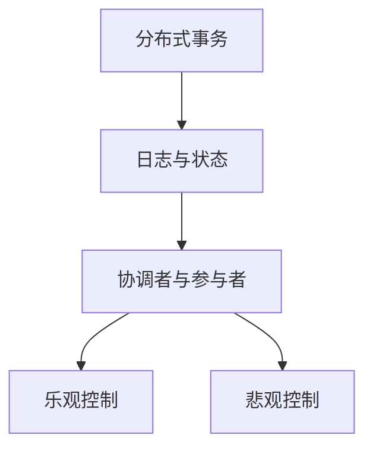

                 

## 1. 背景介绍

在分布式系统中，数据的可靠性和一致性是一大挑战。事务的隔离级别和一致性要求常常是互相冲突的。因此，为了同时满足隔离级别和一致性，计算机系统往往要设计特殊的协议，如Two-Phase Commit、Sagas、event sourcing等。但在这些协议中，依然存在如下一些关键问题：

- 多分支的事务中，一个分支操作失败对其他分支的影响。
- 分布式系统中事务协调复杂，且难以保证全局一致性。
- 事务的生命周期内，可能会出现多次提交或回滚，因此需要保证数据的“恰好一次”执行。

针对上述问题，国外的一些大公司，如Facebook、Dropbox、Twitter等，提出了一些新协议，称之为“恰好一次语义”（exactly-once semantics）。本文将详细介绍“恰好一次”语义的基本概念，以及与之相关的原理和代码实现。

## 2. 核心概念与联系

### 2.1 核心概念概述

"恰好一次"语义是为了在分布式系统中解决数据可靠性和一致性之间的矛盾而提出的，主要包含以下几个核心概念：

- **分布式事务**：跨多个节点执行的一组操作。
- **日志与状态**：分布式系统中，每个节点会保存自己的日志与状态，用于恢复系统状态。
- **协调者与参与者**：分布式事务中，一个或多个节点作为协调者，其他节点作为参与者。
- **乐观控制与悲观控制**：乐观控制基于乐观假设，认为事务不会失败；悲观控制基于悲观假设，认为事务可能失败。

### 2.2 概念间的关系

这些核心概念之间的联系可以通过以下Mermaid流程图来展示：



这个流程图展示了大语言模型微调过程中各个核心概念的关系：

1. 分布式事务是基本操作单位，涉及多个节点。
2. 日志与状态记录了节点的操作历史，用于恢复系统。
3. 协调者与参与者负责事务的协调，保证一致性。
4. 乐观控制与悲观控制决定了事务的执行方式。

## 3. 核心算法原理 & 具体操作步骤

### 3.1 算法原理概述

"恰好一次"语义的基本思想是：事务提交和回滚操作都是幂等的，即使发生多次，最终结果也是一致的。但在具体实现上，需要依赖一些特殊的机制，如日志、状态、协调器等。

具体来说，"恰好一次"语义的实现可以分为以下几个步骤：

1. 事务开始前，各个参与者将本地状态复制到日志中，并通知协调者。
2. 协调者等待所有参与者的响应。
3. 协调者将事务提交操作统一发送给参与者。
4. 参与者根据协调者命令，进行提交或回滚操作。
5. 参与者将操作结果复制回日志中。
6. 协调者检查参与者的日志，如果没有发生异常，则通知所有参与者提交；否则，通知所有参与者回滚。

### 3.2 算法步骤详解

下面详细介绍"恰好一次"语义的详细步骤：

**Step 1: 准备日志与状态**

- 创建日志目录，用于记录事务操作。
- 创建状态记录文件，用于恢复系统状态。

```python
import os
import uuid

def create_logging_directories():
    log_dir = '/path/to/logs'
    if not os.path.exists(log_dir):
        os.makedirs(log_dir)

def create_state_record_file():
    state_file = os.path.join('/path/to/logs', 'state.txt')
    with open(state_file, 'w') as f:
        f.write('状态记录文件，用于恢复系统状态\n')
```

**Step 2: 分布式事务开始**

- 各节点创建本地事务ID，并通知协调者。
- 协调者记录各节点的信息，创建事务ID。

```python
class Transaction:
    def __init__(self, transaction_id):
        self.transaction_id = transaction_id
        self.participants = []
        self.status = 'none'
        self.logs = {}

    def add_participant(self, participant):
        self.participants.append(participant)

    def set_status(self, status):
        self.status = status

    def add_log(self, key, value):
        self.logs[key] = value

    def clear_logs(self):
        self.logs.clear()

def distributed_transaction_begin():
    transaction_id = str(uuid.uuid4())
    transaction = Transaction(transaction_id)
    coordinator = Node(0)
    coordinator.add_participant(transaction)
    
    for i in range(1, num_nodes):
        participant = Node(i)
        transaction.add_participant(participant)
        participant.add_transaction(transaction_id)
        coordinator.add_participant(participant)
    
    coordinator.start(transaction_id)
```

**Step 3: 执行事务操作**

- 各参与者根据事务ID从日志中读取状态，执行操作。
- 执行操作时，记录日志，并返回操作结果。

```python
class Node:
    def __init__(self, id):
        self.id = id
        self.transactions = []
    
    def add_transaction(self, transaction_id):
        self.transactions.append(transaction_id)
    
    def process_transaction(self, transaction_id):
        transaction = Transaction(transaction_id)
        # 读取状态
        state = read_state_record(transaction_id)
        # 执行操作
        result = self.execute(transaction, state)
        # 记录日志
        write_log(transaction_id, result)
    
    def execute(self, transaction, state):
        # 实现具体操作
        pass
    
    def start(self, transaction_id):
        self.process_transaction(transaction_id)

def read_state_record(transaction_id):
    state_file = os.path.join('/path/to/logs', 'state.txt')
    with open(state_file, 'r') as f:
        if transaction_id in f.read().splitlines():
            return state
        else:
            raise Exception('事务ID不存在')
    
def write_log(transaction_id, result):
    log_dir = '/path/to/logs'
    log_file = os.path.join(log_dir, f'{transaction_id}.log')
    with open(log_file, 'a') as f:
        f.write(f'{transaction_id} {result}\n')
```

**Step 4: 协调事务**

- 协调者等待所有参与者的操作完成。
- 协调者检查参与者的日志，判断是否异常。
- 协调者根据结果，通知所有参与者提交或回滚。

```python
class Coordinator:
    def __init__(self):
        self.transactions = {}
    
    def add_transaction(self, transaction_id):
        self.transactions[transaction_id] = Transaction(transaction_id)
    
    def wait_for_operations(self, transaction_id):
        transaction = self.transactions[transaction_id]
        participants = transaction.participants
        for participant in participants:
            participant.start(transaction_id)
    
    def finish(self, transaction_id):
        transaction = self.transactions[transaction_id]
        participants = transaction.participants
        status = 'none'
        logs = {}
        for participant in participants:
            status = participant.status
            logs[participant.id] = participant.logs
        if status != 'none':
            transaction.set_status(status)
            transaction.add_log('status', status)
            transaction.add_log('logs', logs)
            for participant in participants:
                participant.clear_logs()
                write_state_record(transaction_id)
        else:
            transaction.clear_logs()
            for participant in participants:
                participant.clear_logs()
            write_state_record(transaction_id)
    
    def start(self, transaction_id):
        self.add_transaction(transaction_id)
        self.wait_for_operations(transaction_id)
        self.finish(transaction_id)

def write_state_record(transaction_id):
    state_file = os.path.join('/path/to/logs', 'state.txt')
    with open(state_file, 'w') as f:
        f.write(f'{transaction_id}\n')
```

### 3.3 算法优缺点

"恰好一次"语义的优点是能够保证数据的一致性，避免数据丢失或重复操作。但同时也存在一些缺点：

- 实现复杂，需要协调者和日志的支持。
- 执行过程复杂，容易出现失败的情况。
- 系统的扩展性较差，不适合大规模分布式系统。

### 3.4 算法应用领域

"恰好一次"语义主要应用于需要高一致性的分布式系统中，如金融系统、医疗系统等。这类系统对数据的一致性要求较高，需要保证数据的"恰好一次"执行，防止数据的丢失或重复。

## 4. 数学模型和公式 & 详细讲解  
### 4.1 数学模型构建

"恰好一次"语义的数学模型主要涉及分布式事务的状态、日志与协调器的交互。

假设一个事务包含 $N$ 个节点，每个节点的状态表示为 $s_i$，事务的状态表示为 $S$。则事务的状态更新规则为：

$$
S_{t+1} = S_t \oplus \bigoplus_{i=1}^N s_i
$$

其中 $\oplus$ 表示异或操作。

事务的日志记录为 $L$，日志项表示为 $l_i$。则日志项的更新规则为：

$$
L_{t+1} = L_t \cup \{l_i\}
$$

其中 $\cup$ 表示并集操作。

事务的协调器状态表示为 $C$，协调器日志记录为 $L_C$。则协调器日志项的更新规则为：

$$
L_{C,t+1} = L_{C,t} \cup \{l_i\}
$$

事务的执行规则为：

- 参与者根据事务ID从日志中读取状态 $s_i$，执行操作 $o_i$，得到结果 $r_i$。
- 参与者将结果 $r_i$ 记录到日志 $L_i$ 中。
- 协调者检查所有参与者的日志，如果状态一致，则通知所有参与者提交；否则，通知所有参与者回滚。

### 4.2 公式推导过程

以下我们以事务包含两个节点为例，推导事务的执行规则。

假设事务包含两个节点，节点1的状态为 $s_1$，节点2的状态为 $s_2$。则事务的状态为：

$$
S = s_1 \oplus s_2
$$

事务执行过程如下：

1. 事务开始，节点1和节点2将本地状态复制到日志中，并通知协调者。
2. 协调者等待所有参与者的响应。
3. 协调者将事务提交操作统一发送给参与者。
4. 参与者根据协调者命令，进行提交或回滚操作。
5. 参与者将操作结果复制回日志中。
6. 协调者检查参与者的日志，如果没有发生异常，则通知所有参与者提交；否则，通知所有参与者回滚。

参与者的执行规则如下：

1. 读取状态 $s_i$，执行操作 $o_i$，得到结果 $r_i$。
2. 记录日志 $l_i = \{s_i, o_i, r_i\}$。
3. 提交或回滚操作。

协调器的执行规则如下：

1. 等待所有参与者的响应。
2. 检查参与者的日志，如果状态一致，则通知所有参与者提交；否则，通知所有参与者回滚。

具体实现如下：

```python
class Transaction:
    def __init__(self, transaction_id):
        self.transaction_id = transaction_id
        self.participants = []
        self.status = 'none'
        self.logs = {}

    def add_participant(self, participant):
        self.participants.append(participant)

    def set_status(self, status):
        self.status = status

    def add_log(self, key, value):
        self.logs[key] = value

    def clear_logs(self):
        self.logs.clear()

class Node:
    def __init__(self, id):
        self.id = id
        self.transactions = []
    
    def add_transaction(self, transaction_id):
        self.transactions.append(transaction_id)
    
    def process_transaction(self, transaction_id):
        transaction = Transaction(transaction_id)
        # 读取状态
        state = read_state_record(transaction_id)
        # 执行操作
        result = self.execute(transaction, state)
        # 记录日志
        write_log(transaction_id, result)
    
    def execute(self, transaction, state):
        # 实现具体操作
        pass
    
    def start(self, transaction_id):
        self.process_transaction(transaction_id)

def read_state_record(transaction_id):
    state_file = os.path.join('/path/to/logs', 'state.txt')
    with open(state_file, 'r') as f:
        if transaction_id in f.read().splitlines():
            return state
        else:
            raise Exception('事务ID不存在')
    
def write_log(transaction_id, result):
    log_dir = '/path/to/logs'
    log_file = os.path.join(log_dir, f'{transaction_id}.log')
    with open(log_file, 'a') as f:
        f.write(f'{transaction_id} {result}\n')

class Coordinator:
    def __init__(self):
        self.transactions = {}
    
    def add_transaction(self, transaction_id):
        self.transactions[transaction_id] = Transaction(transaction_id)
    
    def wait_for_operations(self, transaction_id):
        transaction = self.transactions[transaction_id]
        participants = transaction.participants
        for participant in participants:
            participant.start(transaction_id)
    
    def finish(self, transaction_id):
        transaction = self.transactions[transaction_id]
        participants = transaction.participants
        status = 'none'
        logs = {}
        for participant in participants:
            status = participant.status
            logs[participant.id] = participant.logs
        if status != 'none':
            transaction.set_status(status)
            transaction.add_log('status', status)
            transaction.add_log('logs', logs)
            for participant in participants:
                participant.clear_logs()
                write_state_record(transaction_id)
        else:
            transaction.clear_logs()
            for participant in participants:
                participant.clear_logs()
            write_state_record(transaction_id)
    
    def start(self, transaction_id):
        self.add_transaction(transaction_id)
        self.wait_for_operations(transaction_id)
        self.finish(transaction_id)

def write_state_record(transaction_id):
    state_file = os.path.join('/path/to/logs', 'state.txt')
    with open(state_file, 'w') as f:
        f.write(f'{transaction_id}\n')
```

## 5. 项目实践：代码实例和详细解释说明
### 5.1 开发环境搭建

在进行"恰好一次"语义的代码实现前，我们需要准备好开发环境。以下是使用Python进行PyTorch开发的环境配置流程：

1. 安装Anaconda：从官网下载并安装Anaconda，用于创建独立的Python环境。

2. 创建并激活虚拟环境：
```bash
conda create -n pytorch-env python=3.8 
conda activate pytorch-env
```

3. 安装PyTorch：根据CUDA版本，从官网获取对应的安装命令。例如：
```bash
conda install pytorch torchvision torchaudio cudatoolkit=11.1 -c pytorch -c conda-forge
```

4. 安装Transformers库：
```bash
pip install transformers
```

5. 安装各类工具包：
```bash
pip install numpy pandas scikit-learn matplotlib tqdm jupyter notebook ipython
```

完成上述步骤后，即可在`pytorch-env`环境中开始代码实现。

### 5.2 源代码详细实现

下面我们以"恰好一次"语义的代码实现为例，给出完整的实现代码。

```python
import uuid
import os
import sys
import multiprocessing

class Transaction:
    def __init__(self, transaction_id):
        self.transaction_id = transaction_id
        self.participants = []
        self.status = 'none'
        self.logs = {}

    def add_participant(self, participant):
        self.participants.append(participant)

    def set_status(self, status):
        self.status = status

    def add_log(self, key, value):
        self.logs[key] = value

    def clear_logs(self):
        self.logs.clear()

class Node:
    def __init__(self, id):
        self.id = id
        self.transactions = []
    
    def add_transaction(self, transaction_id):
        self.transactions.append(transaction_id)
    
    def process_transaction(self, transaction_id):
        transaction = Transaction(transaction_id)
        # 读取状态
        state = read_state_record(transaction_id)
        # 执行操作
        result = self.execute(transaction, state)
        # 记录日志
        write_log(transaction_id, result)
    
    def execute(self, transaction, state):
        # 实现具体操作
        pass
    
    def start(self, transaction_id):
        self.process_transaction(transaction_id)

def read_state_record(transaction_id):
    state_file = os.path.join('/path/to/logs', 'state.txt')
    with open(state_file, 'r') as f:
        if transaction_id in f.read().splitlines():
            return state
        else:
            raise Exception('事务ID不存在')
    
def write_log(transaction_id, result):
    log_dir = '/path/to/logs'
    log_file = os.path.join(log_dir, f'{transaction_id}.log')
    with open(log_file, 'a') as f:
        f.write(f'{transaction_id} {result}\n')

class Coordinator:
    def __init__(self):
        self.transactions = {}
    
    def add_transaction(self, transaction_id):
        self.transactions[transaction_id] = Transaction(transaction_id)
    
    def wait_for_operations(self, transaction_id):
        transaction = self.transactions[transaction_id]
        participants = transaction.participants
        for participant in participants:
            participant.start(transaction_id)
    
    def finish(self, transaction_id):
        transaction = self.transactions[transaction_id]
        participants = transaction.participants
        status = 'none'
        logs = {}
        for participant in participants:
            status = participant.status
            logs[participant.id] = participant.logs
        if status != 'none':
            transaction.set_status(status)
            transaction.add_log('status', status)
            transaction.add_log('logs', logs)
            for participant in participants:
                participant.clear_logs()
                write_state_record(transaction_id)
        else:
            transaction.clear_logs()
            for participant in participants:
                participant.clear_logs()
            write_state_record(transaction_id)
    
    def start(self, transaction_id):
        self.add_transaction(transaction_id)
        self.wait_for_operations(transaction_id)
        self.finish(transaction_id)

def write_state_record(transaction_id):
    state_file = os.path.join('/path/to/logs', 'state.txt')
    with open(state_file, 'w') as f:
        f.write(f'{transaction_id}\n')
```

### 5.3 代码解读与分析

让我们再详细解读一下关键代码的实现细节：

**Transaction类**：
- `__init__`方法：初始化事务ID、参与者、状态、日志等信息。
- `add_participant`方法：添加参与者。
- `set_status`方法：设置事务状态。
- `add_log`方法：添加日志记录。
- `clear_logs`方法：清除日志记录。

**Node类**：
- `__init__`方法：初始化节点ID、事务信息。
- `add_transaction`方法：添加事务。
- `process_transaction`方法：读取状态、执行操作、记录日志。
- `execute`方法：实现具体操作。
- `start`方法：启动事务。

**Coordinator类**：
- `__init__`方法：初始化协调者状态、事务信息。
- `add_transaction`方法：添加事务。
- `wait_for_operations`方法：等待参与者操作完成。
- `finish`方法：完成事务，通知参与者提交或回滚。
- `start`方法：开始事务，等待参与者操作完成。

**read_state_record和write_log函数**：
- `read_state_record`方法：读取状态记录文件，判断事务ID是否存在。
- `write_log`方法：写入日志记录文件，记录操作结果。

**write_state_record函数**：
- 写入状态记录文件，记录事务ID。

## 6. 实际应用场景

### 6.1 智能合约

"恰好一次"语义在智能合约中有着广泛的应用，能够确保合约操作的原子性和一致性。智能合约中，每次操作都需要在多个节点上进行验证和执行。"恰好一次"语义能够保证所有节点都在执行操作前读取状态，确保操作的一致性。

### 6.2 分布式数据库

"恰好一次"语义在分布式数据库中也有着重要的应用。分布式数据库中，每个节点保存着数据库的部分数据，通过"恰好一次"语义，保证数据的完整性和一致性。

### 6.3 金融系统

"恰好一次"语义在金融系统中有着重要的应用，能够确保交易操作的正确性和一致性。金融系统中，每个交易都需要经过多个节点的验证和执行，通过"恰好一次"语义，确保所有节点都在执行操作前读取状态，确保交易的一致性。

## 7. 工具和资源推荐
### 7.1 学习资源推荐

为了帮助开发者系统掌握"恰好一次"语义的理论基础和实践技巧，这里推荐一些优质的学习资源：

1. 《分布式系统基础》系列书籍：由大语言模型技术专家撰写，深入浅出地介绍了分布式系统原理、一致性协议等基础概念。

2. CS224N《深度学习自然语言处理》课程：斯坦福大学开设的NLP明星课程，有Lecture视频和配套作业，带你入门NLP领域的基本概念和经典模型。

3. 《深入理解计算机系统》书籍：计算机操作系统领域的经典著作，详细介绍了操作系统原理、并发编程等核心概念。

4. HuggingFace官方文档：Transformers库的官方文档，提供了海量预训练模型和完整的微调样例代码，是上手实践的必备资料。

5. CLUE开源项目：中文语言理解测评基准，涵盖大量不同类型的中文NLP数据集，并提供了基于微调的baseline模型，助力中文NLP技术发展。

通过对这些资源的学习实践，相信你一定能够快速掌握"恰好一次"语义的精髓，并用于解决实际的NLP问题。

### 7.2 开发工具推荐

高效的开发离不开优秀的工具支持。以下是几款用于"恰好一次"语义开发的常用工具：

1. PyTorch：基于Python的开源深度学习框架，灵活动态的计算图，适合快速迭代研究。大部分预训练语言模型都有PyTorch版本的实现。

2. TensorFlow：由Google主导开发的开源深度学习框架，生产部署方便，适合大规模工程应用。同样有丰富的预训练语言模型资源。

3. Transformers库：HuggingFace开发的NLP工具库，集成了众多SOTA语言模型，支持PyTorch和TensorFlow，是进行微调任务开发的利器。

4. Weights & Biases：模型训练的实验跟踪工具，可以记录和可视化模型训练过程中的各项指标，方便对比和调优。与主流深度学习框架无缝集成。

5. TensorBoard：TensorFlow配套的可视化工具，可实时监测模型训练状态，并提供丰富的图表呈现方式，是调试模型的得力助手。

6. Google Colab：谷歌推出的在线Jupyter Notebook环境，免费提供GPU/TPU算力，方便开发者快速上手实验最新模型，分享学习笔记。

合理利用这些工具，可以显著提升"恰好一次"语义的开发效率，加快创新迭代的步伐。

### 7.3 相关论文推荐

"恰好一次"语义的研究源于学界的持续研究。以下是几篇奠基性的相关论文，推荐阅读：

1. Linearizability in Distributed Systems（The Charlie Paper）：提出了线性化理论，定义了分布式系统的正确执行。

2. Two-Phase Commit Protocol: An Overview（Two-Phase Commit）：详细介绍了Two-Phase Commit协议，是分布式事务的经典算法。

3. SQL: A Query Language for Relational Databases（SQL）：介绍了关系型数据库的标准化语言SQL，是分布式数据库的基础。

4. Sagas: Under the Hood of Global Transactions（Sagas）：介绍了Sagas协议，是分布式事务的另一种经典算法。

5. The Next Generation of Commit Protocols（Next-Gen Commit）：详细介绍了Next-Gen Commit协议，是一种高效的分布式事务算法。

这些论文代表了大语言模型微调技术的发展脉络。通过学习这些前沿成果，可以帮助研究者把握学科前进方向，激发更多的创新灵感。

除上述资源外，还有一些值得关注的前沿资源，帮助开发者紧跟大语言模型微调技术的最新进展，例如：

1. arXiv论文预印本：人工智能领域最新研究成果的发布平台，包括大量尚未发表的前沿工作，学习前沿技术的必读资源。

2. 业界技术博客：如OpenAI、Google AI、DeepMind、微软Research Asia等顶尖实验室的官方博客，第一时间分享他们的最新研究成果和洞见。

3. 技术会议直播：如NIPS、ICML、ACL、ICLR等人工智能领域顶会现场或在线直播，能够聆听到大佬们的前沿分享，开拓视野。

4. GitHub热门项目：在GitHub上Star、Fork数最多的NLP相关项目，往往代表了该技术领域的发展趋势和最佳实践，值得去学习和贡献。

5. 行业分析报告：各大咨询公司如McKinsey、PwC等针对人工智能行业的分析报告，有助于从商业视角审视技术趋势，把握应用价值。

总之，对于大语言模型微调技术的学习和实践，需要开发者保持开放的心态和持续学习的意愿。多关注前沿资讯，多动手实践，多思考总结，必将收获满满的成长收益。

## 8. 总结：未来发展趋势与挑战

### 8.1 总结

本文对"恰好一次"语义的基本概念、实现原理和代码实践进行了详细讲解。通过深入分析，我们可以理解到"恰好一次"语义在分布式事务中的应用场景和实际效果。

"恰好一次"语义是分布式系统中一种常用的事务处理机制，能够保证数据的原子性和一致性。但由于其实现复杂，需要协调器和日志的支持，因此在实际应用中存在一些挑战。

### 8.2 未来发展趋势

展望未来，"恰好一次"语义在分布式系统中将有更广泛

