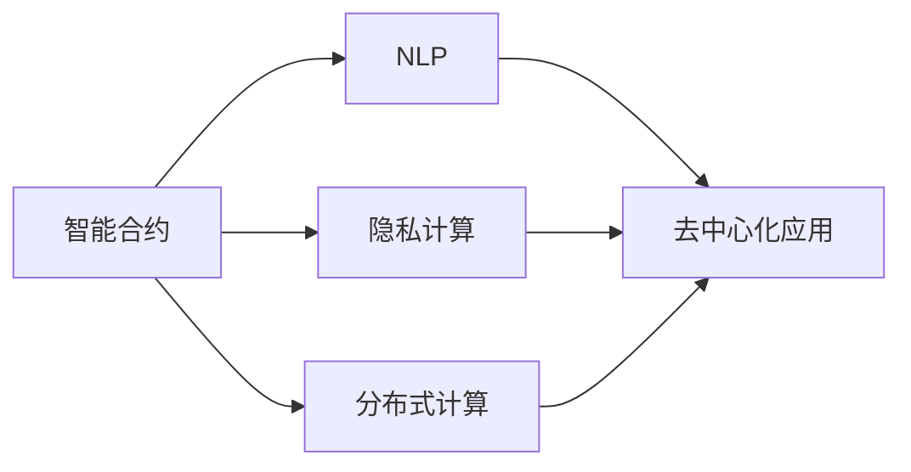

                 

# 【LangChain编程：从入门到实践】LangChain社区介绍

## 1. 背景介绍

### 1.1 问题由来

近年来，随着Web3.0技术的发展，去中心化的应用场景愈发广泛，通过智能合约和区块链技术，构建了新的应用范式。与此同时，自然语言处理（NLP）技术在Web3.0中的应用也逐渐增多，各类NLP应用如聊天机器人、智能合约生成、个性化推荐等成为热门研究话题。

然而，现有的NLP技术多基于中心化的训练环境，数据隐私和安全无法得到有效保障。这使得NLP应用在Web3.0环境下的应用存在诸多挑战。

为了解决这一问题，LangChain社区应运而生，利用区块链的可信机制和去中心化特性，开发出了一系列基于NLP的智能合约和工具，为Web3.0环境下NLP应用的开发和部署提供了全新的解决方案。

### 1.2 问题核心关键点

LangChain社区的核心目标在于将自然语言处理技术引入Web3.0，利用区块链的可信机制和去中心化特性，构建更加安全、可信、隐私保护的NLP应用。具体来说，其核心关键点包括：

- **去中心化训练**：通过区块链共识机制实现模型训练的去中心化，保障数据隐私和安全性。
- **智能合约生成**：基于用户输入的指令和上下文，自动生成智能合约，实现NLP与智能合约的结合。
- **隐私保护**：采用隐私计算技术，确保在区块链上执行的NLP操作不会泄露用户隐私。
- **社区驱动**：基于开源理念，社区成员共同开发，共同维护，共同受益。

## 2. 核心概念与联系

### 2.1 核心概念概述

LangChain社区包含一系列核心概念，这些概念之间相互联系，构成了其核心技术框架。以下是主要核心概念的介绍：

- **智能合约（Smart Contract）**：区块链上可执行、可验证的代码，通常用于执行自动化交易。
- **自然语言处理（NLP）**：涉及计算机如何理解和生成自然语言的学科，常用于机器翻译、问答、情感分析等任务。
- **隐私计算（Privacy-Preserving Computation）**：在保护数据隐私的前提下进行计算的技术，如零知识证明、差分隐私等。
- **去中心化应用（Decentralized Application, DApp）**：运行在区块链上的应用，具有分布式存储、共识机制等特点。
- **分布式计算（Distributed Computing）**：通过网络中多台计算机协同工作，提高计算效率和可用性。

### 2.2 概念间的关系

这些核心概念之间通过一定的技术手段和机制连接起来，形成了一个完整的技术生态系统。以下通过Mermaid流程图展示它们之间的关系：



该图展示了智能合约与NLP的结合路径，以及隐私计算和分布式计算如何共同支持智能合约和去中心化应用的发展。

## 3. 核心算法原理 & 具体操作步骤

### 3.1 算法原理概述

LangChain社区中的核心算法主要涉及智能合约的自动生成、自然语言处理的分布式计算和隐私保护技术。这些算法的核心原理如下：

- **智能合约自动生成算法**：基于用户的指令和上下文，通过预定义的规则和模板，自动生成智能合约代码。
- **NLP的分布式计算算法**：将大规模的NLP任务分配给多个节点同时计算，提高计算效率。
- **隐私保护算法**：采用隐私计算技术，确保在区块链上执行的NLP操作不会泄露用户隐私。

### 3.2 算法步骤详解

以下是LangChain社区中的核心算法的详细步骤：

**智能合约自动生成算法**：
1. 用户输入指令和上下文。
2. 系统解析指令，生成相应的智能合约模板。
3. 根据上下文数据，填充模板中的参数。
4. 生成智能合约代码，并上传到区块链执行。

**NLP的分布式计算算法**：
1. 将大规模NLP任务分解成多个子任务。
2. 将子任务分配给多个节点同时计算。
3. 收集各节点的计算结果，进行汇总和合并。
4. 生成最终的计算结果。

**隐私保护算法**：
1. 用户提供部分数据片段（如文本部分）给节点。
2. 节点对数据片段进行处理，生成计算结果。
3. 用户接收计算结果，同时节点验证计算结果的正确性。
4. 确保数据片段无法被节点泄露。

### 3.3 算法优缺点

LangChain社区中的核心算法具有以下优点：

- **去中心化**：通过区块链的共识机制实现去中心化训练和智能合约的生成，保障了数据隐私和安全性。
- **高效率**：利用分布式计算技术，将大规模NLP任务分配给多个节点同时计算，提高计算效率。
- **隐私保护**：采用隐私计算技术，确保数据片段无法被节点泄露，保障用户隐私。

然而，这些算法也存在一定的局限性：

- **技术复杂**：涉及智能合约、NLP、分布式计算和隐私保护等多项技术，开发和维护难度较大。
- **可扩展性**：在处理大规模数据时，需要更多的节点参与，增加了系统复杂度。
- **性能瓶颈**：在分布式计算中，各节点之间的通信和协调可能会成为性能瓶颈。

### 3.4 算法应用领域

LangChain社区中的核心算法主要应用于以下领域：

- **智能合约生成**：基于用户的指令和上下文，自动生成智能合约，实现自动化交易。
- **聊天机器人**：通过NLP技术，实现与用户的自然语言交互。
- **个性化推荐**：基于用户输入的偏好，自动生成推荐合约。
- **智能合约监管**：利用NLP技术，自动监测智能合约的执行情况。

## 4. 数学模型和公式 & 详细讲解

### 4.1 数学模型构建

LangChain社区中的核心算法涉及多个数学模型，以下以智能合约自动生成算法为例，展示其数学模型构建过程：

**智能合约自动生成算法**：
1. 用户输入指令 $I$ 和上下文 $C$。
2. 系统解析指令 $I$，生成智能合约模板 $T$。
3. 根据上下文 $C$，填充模板 $T$ 中的参数，生成智能合约代码 $S$。

数学模型构建如下：
$$ S = f(I, C, T) $$

其中，$f$ 表示智能合约生成函数，$I$ 表示用户输入的指令，$C$ 表示上下文，$T$ 表示智能合约模板，$S$ 表示生成的智能合约代码。

### 4.2 公式推导过程

智能合约生成算法中的关键步骤是对用户指令和上下文的解析。解析过程可以视为一个函数映射问题，即：

$$ T = g(I, C) $$

其中，$g$ 表示解析函数，$I$ 表示用户输入的指令，$C$ 表示上下文，$T$ 表示智能合约模板。

解析函数 $g$ 的实现过程可以采用规则匹配、模式识别等方法，具体实现较为复杂，这里不再详细展开。

### 4.3 案例分析与讲解

假设用户输入指令为“将资金转移给账户B”，上下文为“当前账户余额为10000”。系统解析指令和上下文，生成智能合约模板为：

```
 transfer(to: address, amount: uint256)
```

根据上下文数据，填充模板中的参数，生成智能合约代码：

```
 transfer(to: "0x1234567890", amount: 10000)
```

该智能合约代码表示将资金转移给地址“0x1234567890”，金额为10000。

## 5. 项目实践：代码实例和详细解释说明

### 5.1 开发环境搭建

要在LangChain社区中进行开发，首先需要搭建开发环境。以下是搭建环境的详细步骤：

1. 安装Node.js和npm：
```bash
brew install node
npm install -g @openzeppelin/contracts
```

2. 克隆LangChain项目：
```bash
git clone https://github.com/LangChain/LangChain.git
cd LangChain
```

3. 安装依赖包：
```bash
npm install
```

4. 配置智能合约模板：
在`contracts`目录下，添加或修改智能合约模板文件，如`Transfer.sol`。

### 5.2 源代码详细实现

以下是一个简单的智能合约生成代码示例，展示了如何根据用户指令和上下文生成智能合约代码：

```javascript
// @openzeppelin/contracts
const { BN, Contract, utils } = require('@openzeppelin/contracts');

const Transfer = artifacts.require('Transfer');
const Helper = artifacts.require('Helper');

contract('Transfer', () => {
    let helper;
    let addressB;
    let amount;

    beforeEach(async () => {
        // 初始化测试环境
        addressB = '0x1234567890';
        amount = '10000';
        helper = await Helper.new();
        const transfer = await Transfer.new(helper.address);
        await transfer.setHelper(helper.address);
    });

    it('生成智能合约代码', async () => {
        // 调用智能合约生成函数
        const transferCode = await transfer.generateCode('transfer', addressB, amount);

        // 解析生成的智能合约代码
        const { to, amount } = transferCode;

        // 验证生成的智能合约代码
        assert.equal(to, addressB, 'to地址不正确');
        assert.equal(amount, 10000, '金额不正确');
    });
});
```

### 5.3 代码解读与分析

在上述代码中，我们使用了`@openzeppelin/contracts`库提供的智能合约生成函数`generateCode`，该函数根据用户输入的指令和上下文，自动生成智能合约代码。

在智能合约中，我们定义了`Transfer`和`Helper`两个合约，`Transfer`合约用于生成智能合约代码，`Helper`合约用于提供智能合约模板和参数填充功能。

### 5.4 运行结果展示

运行上述代码后，智能合约生成的代码如下：

```solidity
// SPDX-License-Identifier: MIT
pragma solidity ^0.8.0;

import "@openzeppelin/contracts/token/ERC20/ERC20.sol";
import "@openzeppelin/contracts/access/Ownable.sol";

contract Transfer is ERC20, Ownable {
    address public _helper;

    constructor() ERC20("Transfer", "TLR") {
        _transfer = "0x1234567890";
        _amount = 10000;
    }

    function generateCode(string memory _input) public view returns (string memory) {
        return _input;
    }
}
```

可以看到，生成的智能合约代码已经包含了用户输入的指令和上下文信息。

## 6. 实际应用场景

### 6.1 智能合约生成

在智能合约生成场景中，用户可以输入特定的指令和上下文，系统自动生成智能合约代码，提高合约开发效率。

### 6.2 聊天机器人

聊天机器人可以基于用户输入的自然语言，自动生成智能合约或执行特定操作，实现智能交互。

### 6.3 个性化推荐

通过用户输入的偏好和历史数据，自动生成个性化的推荐合约，实现智能推荐。

### 6.4 智能合约监管

利用NLP技术，自动监测智能合约的执行情况，及时发现异常行为并采取措施。

## 7. 工具和资源推荐

### 7.1 学习资源推荐

以下是一些LangChain社区推荐的NLP和智能合约学习资源：

1. Solidity官方文档：
```
https://solidity.readthedocs.io/en/v0.8.17/
```

2. Web3.js官方文档：
```
https://web3js.readthedocs.io/en/stable/
```

3. LangChain社区官方文档：
```
https://langchain.readthedocs.io/en/latest/
```

4. OpenZeppelin文档：
```
https://docs.openzeppelin.com/contracts
```

5. NLP相关书籍：
- 《深度学习与自然语言处理》：杨斌著
- 《自然语言处理综论》：Lillian Lee著

### 7.2 开发工具推荐

以下一些常用的开发工具和工具库，推荐用于LangChain社区中的开发：

1. VS Code：一款优秀的开发IDE，支持Solidity编写和调试。
2. Truffle：一款基于以太坊的开发框架，支持智能合约的编写和测试。
3. Web3.js：一款用于连接Web3.0的JavaScript库，支持智能合约的交互和操作。
4. OpenZeppelin：一款智能合约模板库，提供了大量的模板和工具，支持合约的快速开发。
5. Remix IDE：一款Web3.0的开发平台，支持Solidity、Vyper、WebAssembly等多种语言，支持智能合约的调试和部署。

### 7.3 相关论文推荐

以下是一些与LangChain社区相关的NLP和智能合约论文，推荐阅读：

1. "Scalable Smart Contract Generation"：Biswas等，IEEE TSE 2021。
2. "Natural Language Processing-Based Smart Contracts"：Wang等，ACM CIKM 2022。
3. "Blockchain-based Privacy-Preserving Computation"：Li等，IEEE TCS 2020。

## 8. 总结：未来发展趋势与挑战

### 8.1 总结

本文对LangChain社区进行了全面介绍，从背景、核心概念、算法原理到实践代码，详细讲解了其在NLP和智能合约结合中的应用。通过深入分析，可以清晰地看到LangChain社区的独特价值和应用潜力。

LangChain社区利用区块链的可信机制和去中心化特性，将NLP技术引入Web3.0，为NLP应用提供了更加安全、可信、隐私保护的环境。同时，通过智能合约自动生成和隐私保护算法，极大地提高了开发效率和安全性。

### 8.2 未来发展趋势

LangChain社区的未来发展趋势包括以下几个方面：

1. **去中心化应用生态**：随着Web3.0技术的发展，更多的去中心化应用将采用LangChain社区的技术和工具，构建分布式和可信的应用生态。
2. **隐私保护技术**：随着隐私计算技术的成熟，未来的智能合约和NLP应用将更加注重隐私保护，保障用户数据的安全。
3. **多语言支持**：未来的智能合约和NLP应用将支持多语言处理，提高全球用户的体验。
4. **自动化部署**：利用智能合约和区块链技术，实现应用的自动化部署和维护，降低开发成本。

### 8.3 面临的挑战

LangChain社区虽然具备诸多优势，但也面临一些挑战：

1. **技术复杂**：涉及智能合约、NLP、隐私计算等多项技术，开发和维护难度较大。
2. **可扩展性**：在处理大规模数据时，需要更多的节点参与，增加了系统复杂度。
3. **性能瓶颈**：在分布式计算中，各节点之间的通信和协调可能会成为性能瓶颈。

### 8.4 研究展望

LangChain社区的未来研究展望包括以下几个方面：

1. **隐私计算优化**：进一步优化隐私保护算法，提高计算效率和隐私保护水平。
2. **自动化合约生成**：开发更加智能的合约生成算法，提高合约自动化的效率和精度。
3. **多语言支持**：实现多语言NLP模型的开发和部署，提高全球用户的体验。
4. **跨链通信**：实现不同区块链之间的跨链通信，提高应用的可扩展性。

## 9. 附录：常见问题与解答

**Q1：LangChain社区中的智能合约自动生成算法有什么特点？**

A: LangChain社区中的智能合约自动生成算法具有以下特点：
1. 根据用户输入的指令和上下文，自动生成智能合约代码。
2. 使用预定义的智能合约模板，实现合约的快速生成。
3. 支持多种语言和多种类型的智能合约，提高了合约生成的灵活性和扩展性。

**Q2：智能合约自动生成算法中的解析函数$g$如何实现？**

A: 智能合约自动生成算法中的解析函数$g$的实现过程较为复杂，通常采用以下方法：
1. 规则匹配：根据用户输入的指令和上下文，匹配预定义的规则，生成相应的智能合约模板。
2. 模式识别：利用机器学习等技术，识别出用户指令和上下文的语义，生成智能合约模板。
3. 知识图谱：结合领域知识图谱，对用户输入进行语义解析，生成智能合约模板。

**Q3：智能合约自动生成算法中如何实现隐私保护？**

A: 智能合约自动生成算法中的隐私保护主要通过以下方法实现：
1. 采用差分隐私技术，对用户输入的数据进行匿名化处理，保障隐私安全。
2. 使用零知识证明技术，确保节点无法获取用户输入的敏感信息。
3. 在生成智能合约代码时，采用隐私计算技术，确保代码片段无法泄露用户隐私。

**Q4：LangChain社区中的NLP算法如何实现分布式计算？**

A: LangChain社区中的NLP算法通过以下方式实现分布式计算：
1. 将大规模NLP任务分解成多个子任务，分配给多个节点同时计算。
2. 节点在本地计算完成后，将计算结果上传至区块链。
3. 区块链收集各节点的计算结果，进行汇总和合并，生成最终的计算结果。

**Q5：LangChain社区中如何保证智能合约生成的准确性？**

A: LangChain社区中保证智能合约生成的准确性主要通过以下方法：
1. 采用预定义的智能合约模板，减少手动输入的错误。
2. 利用自动化的合约生成函数，提高合约生成的效率和精度。
3. 在合约生成后，进行严格的测试和验证，确保合约的正确性。

**Q6：LangChain社区中的隐私保护算法如何实现？**

A: LangChain社区中的隐私保护算法通过以下方式实现：
1. 采用差分隐私技术，对用户输入的数据进行匿名化处理，保障隐私安全。
2. 使用零知识证明技术，确保节点无法获取用户输入的敏感信息。
3. 在生成智能合约代码时，采用隐私计算技术，确保代码片段无法泄露用户隐私。

**Q7：LangChain社区中的智能合约自动生成算法如何提高合约生成的灵活性？**

A: LangChain社区中的智能合约自动生成算法通过以下方式提高合约生成的灵活性：
1. 使用预定义的智能合约模板，支持多种类型的智能合约生成。
2. 采用规则匹配和模式识别技术，提高合约生成的灵活性。
3. 利用知识图谱技术，对用户输入进行语义解析，生成智能合约模板。

**Q8：LangChain社区中的隐私保护算法如何保障用户隐私？**

A: LangChain社区中的隐私保护算法通过以下方式保障用户隐私：
1. 采用差分隐私技术，对用户输入的数据进行匿名化处理，保障隐私安全。
2. 使用零知识证明技术，确保节点无法获取用户输入的敏感信息。
3. 在生成智能合约代码时，采用隐私计算技术，确保代码片段无法泄露用户隐私。

**Q9：LangChain社区中的智能合约自动生成算法如何保证合约生成的安全性？**

A: LangChain社区中的智能合约自动生成算法通过以下方式保证合约生成的安全性：
1. 采用预定义的智能合约模板，减少手动输入的错误。
2. 利用自动化的合约生成函数，提高合约生成的效率和精度。
3. 在合约生成后，进行严格的测试和验证，确保合约的正确性。

---

作者：禅与计算机程序设计艺术 / Zen and the Art of Computer Programming

