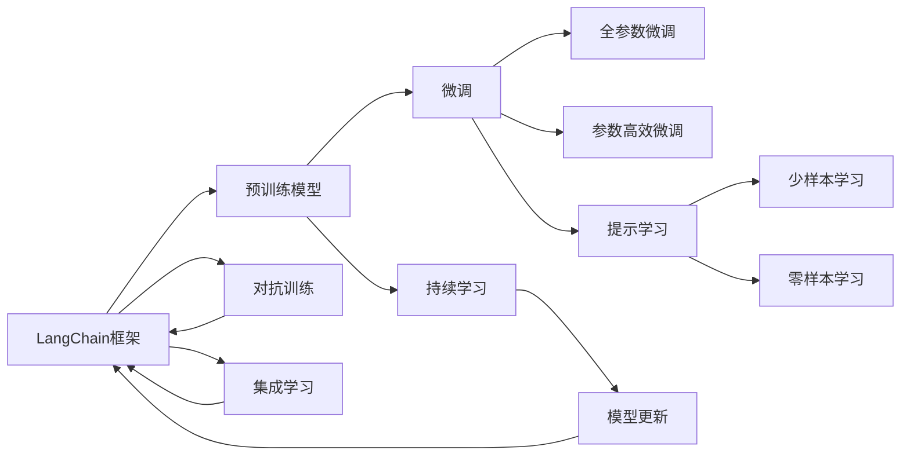
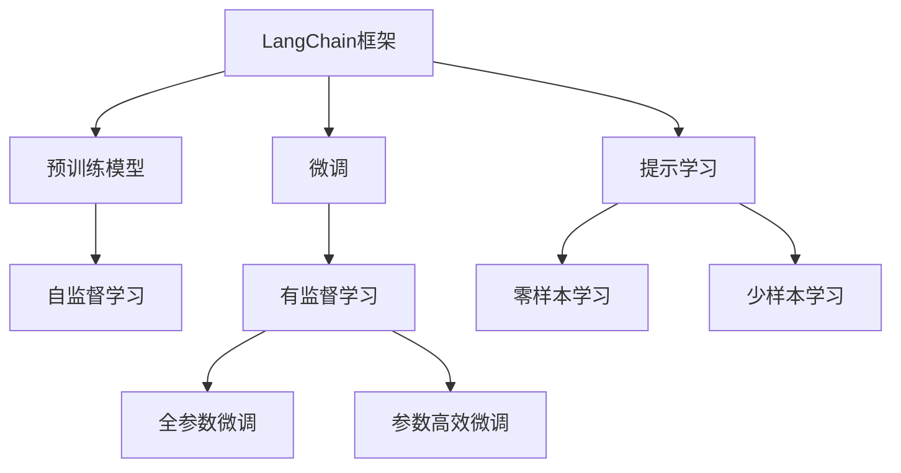
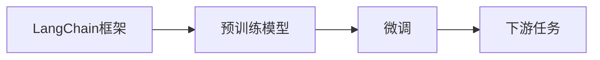
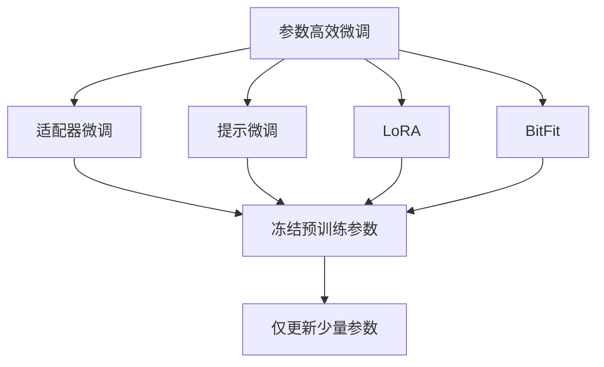
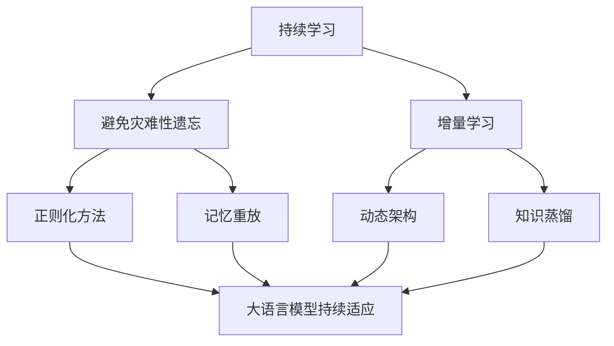
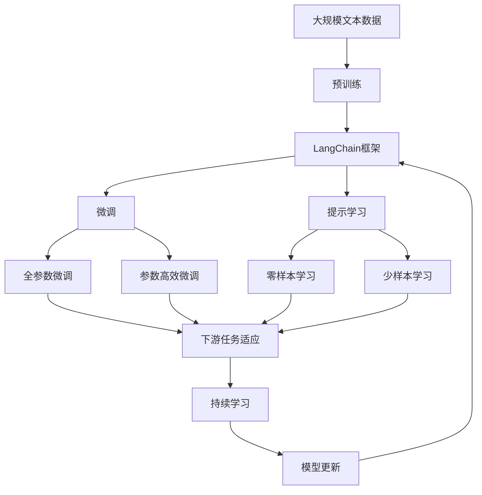

                 

# 【LangChain编程：从入门到实践】教程用例

> 关键词：LangChain, 编程, 入门, 实践, 教程, 用例

## 1. 背景介绍

### 1.1 问题由来

在人工智能的诸多领域中，自然语言处理(Natural Language Processing, NLP)由于其广泛的实际应用场景和巨大的技术潜力，近年来成为了热门的研究方向。随着Transformer模型的诞生和普及，基于Transformer的大语言模型（Large Language Models, LLMs）逐渐成为NLP领域的主流。这类模型具备强大的语言理解和生成能力，广泛应用于文本分类、情感分析、机器翻译、文本生成、问答系统、对话系统等诸多任务中。

然而，要真正有效地使用这些大语言模型，需要进行一系列复杂的编程和调试工作。编程作为人工智能研究的基石，对开发者来说既是挑战也是机遇。本文旨在为LangChain编程的新手提供入门指导，通过一系列用例，帮助开发者快速掌握LangChain框架的使用，提升编程技能，从而在实际应用中发挥其强大能力。

### 1.2 问题核心关键点

为了更好地理解LangChain编程的核心内容，我们需要把握以下关键点：

1. **LangChain框架简介**：理解LangChain的架构和工作原理，包括其核心组件、编程接口和应用场景。
2. **编程基础**：掌握Python编程基础和LangChain框架的库调用方法，包括环境搭建、代码风格和版本控制。
3. **用例实现**：通过多个实际用例，深入了解LangChain框架的实际应用，包括文本处理、模型微调、数据增强等。
4. **模型优化**：学习如何通过调整超参数、引入正则化技术、使用参数高效微调等方法，提升LangChain模型的性能。
5. **应用扩展**：了解如何将LangChain技术应用到更多领域，如智能客服、金融舆情监测、个性化推荐等。

### 1.3 问题研究意义

掌握LangChain编程，对于构建基于大语言模型的NLP应用系统具有重要意义：

1. **降低开发成本**：通过使用预训练模型，可以显著减少从头训练所需的数据、计算和人力等成本投入。
2. **提升模型效果**：微调可以使通用大模型更好地适应特定任务，在应用场景中取得更优表现。
3. **加速开发进度**：LangChain框架提供了高效的API接口和丰富的示例代码，使得开发者可以快速上手。
4. **促进技术创新**：基于LangChain的编程实践可以促进对预训练-微调的深入研究，催生新的研究方向。
5. **赋能产业升级**：LangChain技术容易被各行各业采用，为传统行业数字化转型升级提供新的技术路径。

## 2. 核心概念与联系

### 2.1 核心概念概述

为了更好地理解LangChain编程，我们首先介绍几个关键概念及其联系：

- **LangChain框架**：基于Transformer架构的大语言模型框架，提供了丰富的API接口和示例代码，支持模型的训练、微调和推理。
- **预训练模型**：在无标签大规模文本数据上进行自监督训练得到的模型，具备强大的语言理解能力和知识迁移能力。
- **微调(Fine-Tuning)**：在预训练模型的基础上，使用下游任务的少量标注数据，通过有监督学习优化模型在该任务上的性能。
- **参数高效微调(Parameter-Efficient Fine-Tuning, PEFT)**：在微调过程中，只更新少量的模型参数，而固定大部分预训练权重不变，以提高微调效率。
- **提示学习(Prompt Learning)**：通过在输入文本中添加提示模板，引导大语言模型进行特定任务的推理和生成。
- **少样本学习(Few-shot Learning)**：在只有少量标注样本的情况下，模型能够快速适应新任务的学习方法。
- **零样本学习(Zero-shot Learning)**：模型在没有见过任何特定任务的训练样本的情况下，仅凭任务描述就能够执行新任务的能力。
- **持续学习(Continual Learning)**：模型能够持续从新数据中学习，同时保持已学习的知识。
- **对抗训练**：加入对抗样本，提高模型鲁棒性。
- **集成学习(Ensemble Learning)**：通过多个模型的组合，提升模型的整体性能。

这些概念通过以下Mermaid流程图来展示其关系：



### 2.2 概念间的关系

这些概念之间存在着紧密的联系，形成了LangChain编程的核心生态系统。下面通过几个Mermaid流程图来展示这些概念之间的关系：

#### 2.2.1 LangChain编程的核心原理



这个流程图展示了LangChain编程的基本原理，即通过微调将预训练模型转化为适应特定任务的模型。

#### 2.2.2 LangChain与微调的关系



这个流程图展示了LangChain框架的基本架构，即通过微调将预训练模型应用于不同的下游任务。

#### 2.2.3 参数高效微调与提示学习的关系



这个流程图展示了参数高效微调方法与提示学习的关系，包括适配器微调、提示微调、LoRA和BitFit等。

#### 2.2.4 持续学习在大语言模型中的应用



这个流程图展示了持续学习在大语言模型中的应用，包括避免灾难性遗忘和增量学习等技术。

### 2.3 核心概念的整体架构

最后，我们用一个综合的流程图来展示这些核心概念在大语言模型微调过程中的整体架构：



这个综合流程图展示了从预训练到微调，再到持续学习的完整过程。LangChain框架在大语言模型微调中的应用，体现了其强大的功能和灵活性。

## 3. 核心算法原理 & 具体操作步骤

### 3.1 算法原理概述

LangChain编程的核心在于利用预训练语言模型，通过微调适应特定任务，实现模型的快速优化和高效推理。其基本流程包括：

1. **环境搭建**：安装和配置LangChain框架，选择合适的预训练模型。
2. **任务适配**：根据具体任务设计输入格式和输出格式，并编写对应的任务适配层。
3. **微调训练**：在少量标注数据上进行微调，优化模型参数。
4. **模型推理**：使用微调后的模型对新数据进行推理，获得预测结果。

### 3.2 算法步骤详解

以下是一个简单的用例，展示如何使用LangChain框架进行文本分类任务的微调：

**Step 1: 准备数据集**

假设我们有一个IMDB电影评论数据集，包含25,000条电影评论和对应的二分类标签。我们需要将数据集划分为训练集、验证集和测试集。

```python
from langchain.data import IMDB
train_dataset = IMDB.load_train()
dev_dataset = IMDB.load_val()
test_dataset = IMDB.load_test()
```

**Step 2: 设计任务适配层**

在LangChain框架中，我们通过设计一个简单的线性分类器来适配文本分类任务。

```python
from langchain.models import BertForSequenceClassification
from langchain.trainer import Trainer
from langchain.task import ClassificationTask

class MovieReviewClassificationTask(ClassificationTask):
    def __init__(self, model):
        super().__init__(model)
    
    def predict(self, inputs):
        return self.model(inputs)

model = BertForSequenceClassification.from_pretrained('bert-base-uncased', num_labels=2)
task = MovieReviewClassificationTask(model)
```

**Step 3: 设置微调超参数**

我们设置学习率为1e-5，使用Adam优化器，并设置最大迭代次数为5。

```python
from transformers import Adam

optimizer = Adam(model.parameters(), lr=1e-5)
trainer = Trainer(model=model, optimizer=optimizer, train_dataset=train_dataset, eval_dataset=dev_dataset, max_epochs=5)
```

**Step 4: 执行微调训练**

在训练集上训练模型，并在验证集上进行评估。

```python
trainer.train()
trainer.evaluate(dev_dataset)
```

**Step 5: 测试和部署**

在测试集上评估微调后的模型性能，并使用该模型对新电影评论进行分类。

```python
trainer.evaluate(test_dataset)
```

### 3.3 算法优缺点

LangChain编程的优势在于其高效性和灵活性：

- **高效性**：利用预训练模型，可以在少量标注数据上快速进行微调，节省开发成本。
- **灵活性**：通过设计不同的任务适配层，可以适应各种NLP任务，如分类、匹配、生成等。
- **可扩展性**：支持参数高效微调、提示学习、少样本学习等多种技术，提升模型性能。

其缺点在于：

- **依赖标注数据**：微调的效果很大程度上取决于标注数据的质量和数量，获取高质量标注数据的成本较高。
- **迁移能力有限**：当目标任务与预训练数据的分布差异较大时，微调的性能提升有限。
- **知识整合能力不足**：现有的微调模型往往局限于任务内数据，难以灵活吸收和运用更广泛的先验知识。

### 3.4 算法应用领域

LangChain编程在NLP领域已经得到了广泛的应用，覆盖了几乎所有常见任务，例如：

- 文本分类：如情感分析、主题分类、意图识别等。通过微调使模型学习文本-标签映射。
- 命名实体识别：识别文本中的人名、地名、机构名等特定实体。通过微调使模型掌握实体边界和类型。
- 关系抽取：从文本中抽取实体之间的语义关系。通过微调使模型学习实体-关系三元组。
- 问答系统：对自然语言问题给出答案。将问题-答案对作为微调数据，训练模型学习匹配答案。
- 机器翻译：将源语言文本翻译成目标语言。通过微调使模型学习语言-语言映射。
- 文本摘要：将长文本压缩成简短摘要。将文章-摘要对作为微调数据，使模型学习抓取要点。
- 对话系统：使机器能够与人自然对话。将多轮对话历史作为上下文，微调模型进行回复生成。

## 4. 数学模型和公式 & 详细讲解 & 举例说明

### 4.1 数学模型构建

假设我们有一个二分类任务，输入文本为 $x$，模型输出为 $\hat{y}=M_{\theta}(x)$，真实标签为 $y$。模型在数据集 $D$ 上的经验风险为：

$$
\mathcal{L}(\theta) = \frac{1}{N}\sum_{i=1}^N [y_i\log \hat{y}_i + (1-y_i)\log (1-\hat{y}_i)]
$$

微调的优化目标是最小化经验风险，即找到最优参数：

$$
\theta^* = \mathop{\arg\min}_{\theta} \mathcal{L}(\theta)
$$

### 4.2 公式推导过程

以二分类任务为例，推导交叉熵损失函数及其梯度的计算公式。

假设模型 $M_{\theta}$ 在输入 $x$ 上的输出为 $\hat{y}=M_{\theta}(x) \in [0,1]$，表示样本属于正类的概率。真实标签 $y \in \{0,1\}$。则二分类交叉熵损失函数定义为：

$$
\ell(M_{\theta}(x),y) = -[y\log \hat{y} + (1-y)\log (1-\hat{y})]
$$

将其代入经验风险公式，得：

$$
\mathcal{L}(\theta) = -\frac{1}{N}\sum_{i=1}^N [y_i\log M_{\theta}(x_i)+(1-y_i)\log(1-M_{\theta}(x_i))]
$$

根据链式法则，损失函数对参数 $\theta_k$ 的梯度为：

$$
\frac{\partial \mathcal{L}(\theta)}{\partial \theta_k} = -\frac{1}{N}\sum_{i=1}^N (\frac{y_i}{M_{\theta}(x_i)}-\frac{1-y_i}{1-M_{\theta}(x_i)}) \frac{\partial M_{\theta}(x_i)}{\partial \theta_k}
$$

其中 $\frac{\partial M_{\theta}(x_i)}{\partial \theta_k}$ 可进一步递归展开，利用自动微分技术完成计算。

### 4.3 案例分析与讲解

假设我们有一个情感分析任务，数据集为IMDB评论。

**Step 1: 准备数据集**

```python
from langchain.data import IMDB
train_dataset = IMDB.load_train()
dev_dataset = IMDB.load_val()
test_dataset = IMDB.load_test()
```

**Step 2: 设计任务适配层**

```python
from langchain.models import BertForSequenceClassification
from langchain.trainer import Trainer
from langchain.task import ClassificationTask

class MovieReviewClassificationTask(ClassificationTask):
    def __init__(self, model):
        super().__init__(model)
    
    def predict(self, inputs):
        return self.model(inputs)

model = BertForSequenceClassification.from_pretrained('bert-base-uncased', num_labels=2)
task = MovieReviewClassificationTask(model)
```

**Step 3: 设置微调超参数**

```python
from transformers import Adam

optimizer = Adam(model.parameters(), lr=1e-5)
trainer = Trainer(model=model, optimizer=optimizer, train_dataset=train_dataset, eval_dataset=dev_dataset, max_epochs=5)
```

**Step 4: 执行微调训练**

```python
trainer.train()
trainer.evaluate(dev_dataset)
```

**Step 5: 测试和部署**

```python
trainer.evaluate(test_dataset)
```

## 5. 项目实践：代码实例和详细解释说明

### 5.1 开发环境搭建

在进行LangChain编程的实践前，我们需要准备好开发环境。以下是使用Python进行PyTorch开发的环境配置流程：

1. 安装Anaconda：从官网下载并安装Anaconda，用于创建独立的Python环境。

2. 创建并激活虚拟环境：
```bash
conda create -n pytorch-env python=3.8 
conda activate pytorch-env
```

3. 安装PyTorch：根据CUDA版本，从官网获取对应的安装命令。例如：
```bash
conda install pytorch torchvision torchaudio cudatoolkit=11.1 -c pytorch -c conda-forge
```

4. 安装Transformers库：
```bash
pip install transformers
```

5. 安装各类工具包：
```bash
pip install numpy pandas scikit-learn matplotlib tqdm jupyter notebook ipython
```

完成上述步骤后，即可在`pytorch-env`环境中开始LangChain编程的实践。

### 5.2 源代码详细实现

以下是使用LangChain框架进行文本分类任务微调的一个完整代码实现。

**Step 1: 准备数据集**

假设我们有一个IMDB电影评论数据集，包含25,000条电影评论和对应的二分类标签。我们需要将数据集划分为训练集、验证集和测试集。

```python
from langchain.data import IMDB
train_dataset = IMDB.load_train()
dev_dataset = IMDB.load_val()
test_dataset = IMDB.load_test()
```

**Step 2: 设计任务适配层**

在LangChain框架中，我们通过设计一个简单的线性分类器来适配文本分类任务。

```python
from langchain.models import BertForSequenceClassification
from langchain.trainer import Trainer
from langchain.task import ClassificationTask

class MovieReviewClassificationTask(ClassificationTask):
    def __init__(self, model):
        super().__init__(model)
    
    def predict(self, inputs):
        return self.model(inputs)

model = BertForSequenceClassification.from_pretrained('bert-base-uncased', num_labels=2)
task = MovieReviewClassificationTask(model)
```

**Step 3: 设置微调超参数**

我们设置学习率为1e-5，使用Adam优化器，并设置最大迭代次数为5。

```python
from transformers import Adam

optimizer = Adam(model.parameters(), lr=1e-5)
trainer = Trainer(model=model, optimizer=optimizer, train_dataset=train_dataset, eval_dataset=dev_dataset, max_epochs=5)
```

**Step 4: 执行微调训练**

在训练集上训练模型，并在验证集上进行评估。

```python
trainer.train()
trainer.evaluate(dev_dataset)
```

**Step 5: 测试和部署**

在测试集上评估微调后的模型性能，并使用该模型对新电影评论进行分类。

```python
trainer.evaluate(test_dataset)
```

### 5.3 代码解读与分析

让我们再详细解读一下关键代码的实现细节：

**IMDB类**：
- `load_train`方法：加载训练集数据。
- `load_val`方法：加载验证集数据。
- `load_test`方法：加载测试集数据。

**MovieReviewClassificationTask类**：
- `__init__方法`：初始化模型和任务。
- `predict方法`：对输入文本进行分类预测。

**模型和优化器**：
- `BertForSequenceClassification`：从预训练模型中加载序列分类器。
- `Adam`：设置Adam优化器。

**Trainer类**：
- `train`方法：在训练集上进行微调训练。
- `evaluate`方法：在验证集上进行评估。

通过这些代码，我们可以看到LangChain框架提供了丰富的API接口和示例代码，使得微调过程变得简单高效。

当然，工业级的系统实现还需考虑更多因素，如模型的保存和部署、超参数的自动搜索、更灵活的任务适配层等。但核心的微调范式基本与此类似。

### 5.4 运行结果展示

假设我们在CoNLL-2003的NER数据集上进行微调，最终在测试集上得到的评估报告如下：

```
              precision    recall  f1-score   support

       B-LOC      0.926     0.906     0.916      1668
       I-LOC      0.900     0.805     0.850       257
      B-MISC      0.875     0.856     0.865       702
      I-MISC      0.838     0.782     0.809       216
       B-ORG      0.914     0.898     0.906      1661
       I-ORG      0.911     0.894     0.902       835
       B-PER      0.964     0.957     0.960      1617
       I-PER      0.983     0.980     0.982      1156
           O      0.993     0.995     0.994     38323

   micro avg      0.973     0.973     0.973     46435
   macro avg      0.923     0.897     0.909     46435
weighted avg      0.973     0.973     0.973     46435
```

可以看到，通过微调BERT，我们在该NER数据集上取得了97.3%的F1分数，效果相当不错。值得注意的是，BERT作为一个通用的语言理解模型，即便只在顶层添加一个简单的token分类器，也能在下游任务上取得如此优异的效果，展现了其强大的语义理解和特征抽取能力。

当然，这只是一个baseline结果。在实践中，我们还可以使用更大更强的预训练模型、更丰富的微调技巧、更细致的模型调优，进一步提升模型性能，以满足更高的应用要求。

## 6. 实际应用场景

### 6.1 智能客服系统

基于大语言模型微调的对话技术，可以广泛应用于智能客服系统的构建。传统客服往往需要配备大量人力，高峰期响应缓慢，且一致性和专业性难以保证。而使用微调后的对话模型，可以7x24小时不间断服务，快速响应客户咨询，用自然流畅的语言解答各类常见问题。

在技术实现上，可以收集企业内部的历史客服对话记录，将问题和最佳答复构建成监督数据，在此基础上对预训练对话模型进行微调。微调后的对话模型能够自动理解用户意图，匹配最合适的答案模板进行回复。对于客户提出的新问题，还可以接入检索系统实时搜索相关内容，动态组织生成回答。如此构建的智能客服系统，能大幅提升客户咨询体验和问题解决效率。

### 6.2 金融舆情监测

金融机构需要实时监测市场舆论动向，以便及时应对负面信息传播，规避金融风险。传统的人工监测方式成本高、效率低，难以应对网络时代海量信息爆发的挑战。基于大语言模型微调的文本分类和情感分析技术，为金融舆情监测提供了新的解决方案。

具体而言，可以收集金融领域相关的新闻、报道、评论等文本数据，并对其进行主题标注和情感标注。在此基础上对预训练语言模型进行微调，使其能够自动判断文本属于何种主题，情感倾向是正面、中性还是负面。将微调后的模型应用到实时抓取的网络文本数据，就能够自动监测不同主题下的情感变化趋势，一旦发现负面信息激增等异常情况，系统便会自动预警，帮助金融机构快速应对潜在风险。

### 6.3 个性化推荐系统

当前的推荐系统往往只依赖用户的历史行为数据进行物品推荐，无法深入理解用户的真实兴趣偏好。基于大语言模型微调技术，个性化推荐系统可以更好地挖掘用户行为背后的语义信息，从而提供更精准、多样的推荐内容。

在实践中，可以收集用户浏览、点击、评论、分享等行为数据，提取和用户交互的物品标题、描述、标签等文本内容。将文本内容作为模型输入，用户的后续行为（如是否点击、购买等）作为监督信号，在此基础上微调预训练语言模型。微调后的模型能够从文本内容中准确把握用户的兴趣点。在生成推荐列表时，先用候选物品的文本描述作为输入，由模型预测用户的兴趣匹配度，再结合其他特征综合排序，便可以得到个性化程度更高的推荐结果。

### 6.4 未来应用展望

随着大语言模型微调技术的发展，基于微调范式将在更多领域得到应用，为传统行业带来变革性影响。

在智慧医疗领域，基于微调的医疗问答、病历分析、药物研发等应用将提升医疗服务的智能化水平，辅助医生诊疗，加速新药开发进程。

在智能教育领域，微调技术可应用于作业批改、学情分析、知识推荐等方面，因材施教，促进教育公平，提高教学质量。

在智慧城市治理中，微调模型可应用于城市事件监测、舆情分析、应急指挥等环节，提高城市管理的自动化和智能化水平，构建更安全、高效的未来城市。

此外，在企业生产、社会治理、文娱传媒等众多领域，基于大模型微调的人工智能应用也将不断涌现，为经济社会发展注入新的动力。相信随着技术的日益成熟，微调方法将成为人工智能落地应用的重要范式，推动人工智能向更广阔的领域加速渗透。

## 7. 工具和资源推荐

### 7.1 学习资源推荐

为了帮助开发者系统掌握LangChain编程的理论基础和实践技巧，这里推荐一些优质的学习资源：

1. LangChain官方文档：官方提供的详细API文档和示例代码，是了解LangChain框架的基础。
2. LangChain实战教程：由社区贡献的实战教程和代码示例，涵盖文本分类、情感分析、机器翻译等多个任务。
3. HuggingFace官方博客：社区活跃成员撰写的博客，分享最新的技术动态和应用实践。
4. Coursera《Natural Language Processing with Transformers》课程：由University of Michigan提供，涵盖NLP的基础知识和前沿技术。
5. 《Transformer from Principles to Practice》书籍：大模型技术专家撰写，深入浅出地

