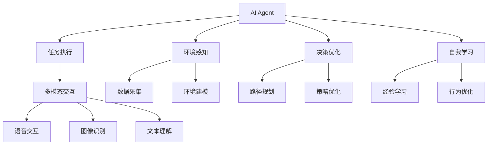
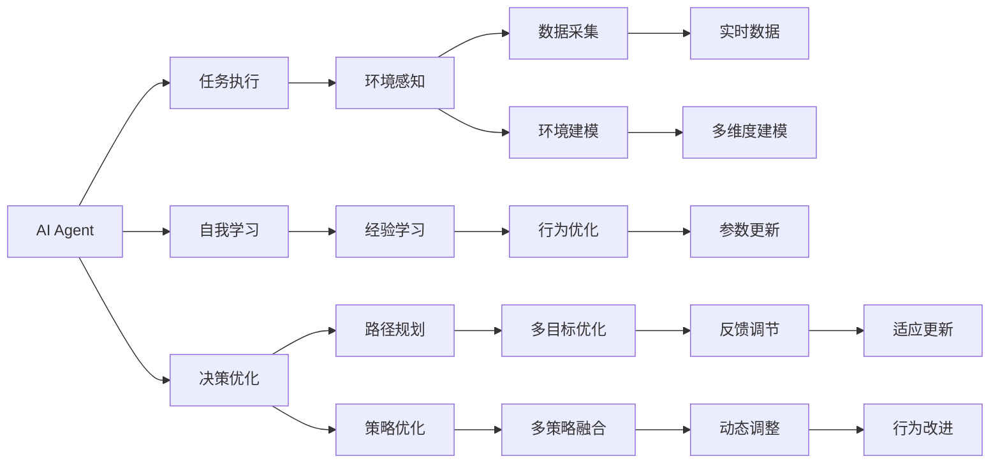
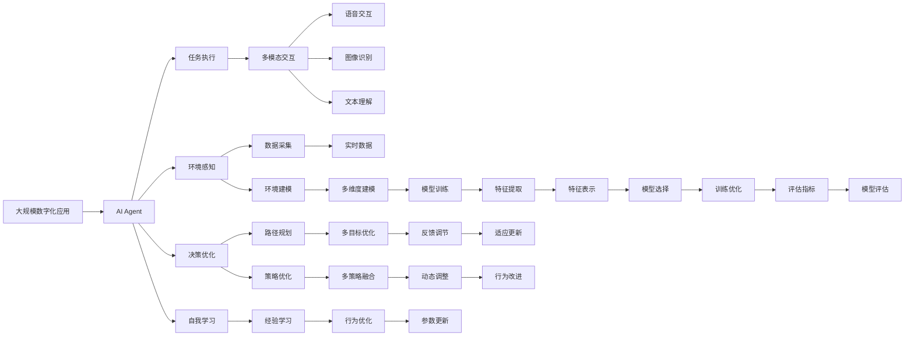

                 

# AI人工智能 Agent：在推进数字化中的应用

> 关键词：人工智能,数字应用,Agent,自动化,智能决策,机器学习,深度学习,算法优化,模型训练

## 1. 背景介绍

### 1.1 问题由来

随着数字化的飞速发展，人工智能(AI)技术正在从各个领域逐渐渗透到我们的日常生活和工作之中。从自然语言处理到计算机视觉，从推荐系统到智能运维，AI技术无所不在，为各行各业带来巨大的变革。然而，尽管AI技术日趋成熟，如何使AI系统变得更加智能、高效、可靠，仍然是一个亟待解决的难题。

在这一背景下，人工智能Agent（AI Agent）的概念应运而生。AI Agent是一种能够自主执行任务，具有智能决策和自我学习的软件实体，被广泛应用于数字化应用之中。本文将深入探讨AI Agent的核心概念与联系，算法原理和具体操作步骤，并通过案例分析、代码实例和实际应用展示，全面揭示AI Agent在推进数字化进程中的重要作用。

### 1.2 问题核心关键点

AI Agent的核心在于其自主性和智能性。相较于传统的自动化脚本，AI Agent具备学习、适应、决策的能力，能够在不断变化的环境中自主执行任务，提升效率和可靠性。其核心特点包括：

- **自主执行**：能够自主接收任务，并根据预定义规则或学习经验，自主执行任务。
- **智能决策**：基于历史数据和实时信息，通过机器学习算法进行智能决策，优化任务执行。
- **自我学习**：能够从任务执行过程中学习经验，不断优化自身行为，提高执行效果。
- **多模态交互**：支持多种输入输出方式，如语音、图像、文本等，实现人机自然交互。

这些特性使得AI Agent在各类数字化应用中发挥重要作用，推动了数字化技术的发展和应用。

### 1.3 问题研究意义

AI Agent的广泛应用，对数字化进程具有重要意义：

1. **提升效率**：通过自主执行和智能决策，大幅提升任务处理速度和准确率，降低人力成本。
2. **增强可靠性**：能够连续执行任务，避免人工操作中的错误和遗漏，提高系统稳定性。
3. **促进创新**：使复杂任务得以在更大规模和更高效率下进行探索和实验，推动技术创新。
4. **改善用户体验**：通过多模态交互，提供更自然、高效的人机交互体验，提升用户满意度。
5. **优化决策支持**：基于大量数据和深度学习模型，提供准确、及时、个性化的决策支持，帮助决策者作出最优选择。

## 2. 核心概念与联系

### 2.1 核心概念概述

为更好地理解AI Agent的核心概念，本节将介绍几个关键概念及其相互关系：

- **AI Agent**：具有自主决策、执行和学习能力，能够在复杂环境中高效完成任务的软件实体。
- **任务执行**：Agent的核心功能，指Agent根据任务描述或规则，自主执行预定义或学习到的任务。
- **环境感知**：Agent对外部环境的感知能力，包括数据采集、环境建模等。
- **决策优化**：基于经验或模型，对任务执行路径和策略进行优化，提升执行效果。
- **自我学习**：Agent通过不断执行任务和接收反馈，学习经验并优化自身行为。
- **多模态交互**：支持多种输入输出方式，实现自然、高效的人机交互。

这些概念通过以下Mermaid流程图展示其相互关系：



### 2.2 概念间的关系

这些核心概念通过以下Mermaid流程图展示其整体架构：



### 2.3 核心概念的整体架构

最终，我们将使用一个综合的流程图来展示这些核心概念在大规模数字化应用中的整体架构：



通过这些图表，我们可以更清晰地理解AI Agent在大规模数字化应用中的作用和构成，从而为后续深入探讨其算法原理和具体操作步骤打下坚实基础。

## 3. 核心算法原理 & 具体操作步骤
### 3.1 算法原理概述

AI Agent的算法原理主要基于机器学习和深度学习，通过任务执行、环境感知、决策优化和自我学习四个核心模块实现。其中，任务执行是AI Agent的基本功能，环境感知和决策优化是实现自主任务执行的前提，自我学习则确保AI Agent能够在不断变化的环境中持续优化和提升。

### 3.2 算法步骤详解

#### 3.2.1 任务执行

任务执行是AI Agent的核心功能，指Agent根据任务描述或规则，自主执行预定义或学习到的任务。具体步骤如下：

1. **任务定义**：将任务描述化简为机器可理解的形式，如自然语言指令、规则集等。
2. **任务分解**：将复杂任务分解为多个子任务，逐一执行。
3. **执行监督**：在执行过程中，通过反馈机制实时监督任务执行情况，确保执行效果。
4. **结果反馈**：执行完成后，将执行结果反馈给任务分配者，用于后续任务调度。

#### 3.2.2 环境感知

环境感知模块用于感知和理解外部环境，为任务执行提供实时数据和环境模型。具体步骤如下：

1. **数据采集**：通过传感器、API接口等方式采集环境数据，如语音、图像、文本等。
2. **数据预处理**：对采集的数据进行清洗、格式化和标准化处理，确保数据可用性。
3. **环境建模**：构建环境模型，捕捉环境特征和行为模式，为决策提供依据。
4. **实时反馈**：实时接收环境变化信息，更新环境模型，确保决策的及时性和准确性。

#### 3.2.3 决策优化

决策优化模块通过机器学习算法，对任务执行路径和策略进行优化，提升执行效果。具体步骤如下：

1. **路径规划**：基于环境模型和任务要求，规划最优执行路径，避免重复和冗余。
2. **策略优化**：通过强化学习、多目标优化等算法，优化任务执行策略，提升效率和效果。
3. **多策略融合**：将多个策略进行融合，形成更加鲁棒和高效的执行策略。

#### 3.2.4 自我学习

自我学习模块通过经验积累和反馈调节，不断优化Agent的行为，提升执行效果。具体步骤如下：

1. **经验积累**：在执行任务过程中，积累经验数据，用于后续学习和优化。
2. **反馈调节**：接收执行结果和外部反馈，调整行为策略，避免错误和遗漏。
3. **行为优化**：通过模型训练和参数更新，优化Agent的行为模式，提升执行效果。

### 3.3 算法优缺点

AI Agent具有以下优点：

- **自主性强**：能够自主接收和执行任务，减少人工干预，提高效率。
- **智能决策**：基于数据和模型进行智能决策，提升执行效果和可靠性。
- **自我学习**：能够从任务执行过程中学习经验，持续优化自身行为。

然而，AI Agent也存在以下缺点：

- **依赖数据**：需要大量高质量数据进行训练和优化，数据质量直接影响Agent性能。
- **模型复杂**：涉及多种算法和模块，模型构建和维护复杂度较高。
- **鲁棒性不足**：在复杂和变化的环境中，可能出现决策失误或执行失败。
- **伦理问题**：涉及隐私和安全性，需要严格遵守法律法规和伦理规范。

### 3.4 算法应用领域

AI Agent在多个领域得到广泛应用，包括但不限于：

- **智能运维**：自动监控、故障检测、故障修复等，提高运维效率和可靠性。
- **金融风控**：风险评估、欺诈检测、交易监管等，提升金融系统的安全性和稳定性。
- **智能客服**：自动解答、语音识别、情感分析等，提升客户体验和服务效率。
- **医疗诊断**：病例分析、病情预测、治疗方案等，辅助医生进行精准诊断。
- **交通管理**：交通监控、拥堵预测、智能调度等，优化交通系统运行。
- **智能制造**：设备监控、生产调度、质量检测等，提高生产效率和质量。
- **广告投放**：用户画像分析、广告推荐、效果评估等，提升广告投放精准度。

## 4. 数学模型和公式 & 详细讲解 & 举例说明
### 4.1 数学模型构建

AI Agent的数学模型主要基于强化学习、深度学习和优化算法，通过最大化奖励函数来实现任务执行和决策优化。

设任务执行的环境为 $E$，当前状态为 $s_t$，执行动作为 $a_t$，获得的即时奖励为 $r_t$，状态转移为 $s_{t+1}$。任务执行的目标是最大化总奖励 $R$。

数学模型可表示为：

$$
R = \sum_{t=1}^{T} r_t
$$

其中 $T$ 为执行任务的时间步长。

### 4.2 公式推导过程

强化学习中的Q-learning算法通过更新Q值函数 $Q(s_t, a_t)$，实现任务执行的优化。Q值函数表示在状态 $s_t$ 下执行动作 $a_t$ 的即时奖励和未来奖励之和。

Q-learning算法的更新公式为：

$$
Q(s_t, a_t) = Q(s_t, a_t) + \alpha \left( r_t + \gamma \max_{a_{t+1}} Q(s_{t+1}, a_{t+1}) - Q(s_t, a_t) \right)
$$

其中 $\alpha$ 为学习率，$\gamma$ 为折扣因子。

通过不断更新Q值函数，AI Agent能够在不断变化的环境中，逐步优化执行路径和策略，提升执行效果。

### 4.3 案例分析与讲解

以智能运维中的故障检测为例，介绍AI Agent的实际应用。

#### 4.3.1 任务定义

假设任务是监控服务器状态，检测服务器是否发生故障。任务定义包括：

- 状态表示：服务器的CPU使用率、内存使用率、磁盘使用率等。
- 动作表示：重启服务器、检查磁盘、检查内存等。
- 即时奖励：检测到故障时，奖励为负数；未检测到故障时，奖励为正数。

#### 4.3.2 数据采集

通过API接口，采集服务器状态数据，如CPU使用率、内存使用率、磁盘使用率等。

#### 4.3.3 环境建模

构建环境模型，捕捉服务器状态特征和行为模式。通过时间序列分析、异常检测等方法，捕捉服务器状态的异常变化。

#### 4.3.4 路径规划

根据环境模型和任务要求，规划最优执行路径。例如，首先检查内存使用率，如果异常，则检查磁盘使用率，最后重启服务器。

#### 4.3.5 决策优化

通过Q-learning算法，优化决策路径。在每次故障检测时，根据历史数据和即时奖励，更新Q值函数，选择最优的动作。

#### 4.3.6 自我学习

在执行过程中，积累经验数据，用于后续学习和优化。例如，通过多次故障检测，积累数据，调整路径规划和策略优化。

## 5. 项目实践：代码实例和详细解释说明
### 5.1 开发环境搭建

在进行AI Agent开发前，需要准备好开发环境。以下是使用Python进行强化学习和深度学习开发的环境配置流程：

1. 安装Anaconda：从官网下载并安装Anaconda，用于创建独立的Python环境。

2. 创建并激活虚拟环境：
```bash
conda create -n pytorch-env python=3.8 
conda activate pytorch-env
```

3. 安装PyTorch：根据CUDA版本，从官网获取对应的安装命令。例如：
```bash
conda install pytorch torchvision torchaudio cudatoolkit=11.1 -c pytorch -c conda-forge
```

4. 安装TensorFlow：
```bash
pip install tensorflow
```

5. 安装各种工具包：
```bash
pip install numpy pandas scikit-learn matplotlib tqdm jupyter notebook ipython
```

完成上述步骤后，即可在`pytorch-env`环境中开始AI Agent的开发。

### 5.2 源代码详细实现

下面我们以智能运维中的故障检测为例，给出使用PyTorch和TensorFlow进行AI Agent开发的PyTorch代码实现。

首先，定义状态和动作空间：

```python
import torch
import numpy as np
from torch import nn
from torch import optim

class StateSpace:
    def __init__(self, state_dim):
        self.state_dim = state_dim
        self.actions = ['restart', 'check_disk', 'check_memory']

    def sample_state(self):
        return np.random.rand(self.state_dim)

class ActionSpace:
    def __init__(self):
        self.actions = ['restart', 'check_disk', 'check_memory']

    def sample_action(self):
        return np.random.choice(self.actions)
```

然后，定义Q值网络：

```python
class QNetwork(nn.Module):
    def __init__(self, state_dim, action_dim):
        super(QNetwork, self).__init__()
        self.fc1 = nn.Linear(state_dim, 64)
        self.fc2 = nn.Linear(64, 64)
        self.fc3 = nn.Linear(64, action_dim)

    def forward(self, x):
        x = torch.relu(self.fc1(x))
        x = torch.relu(self.fc2(x))
        return self.fc3(x)
```

接着，定义强化学习算法：

```python
class QLearning:
    def __init__(self, state_dim, action_dim, learning_rate, discount_factor):
        self.state_dim = state_dim
        self.action_dim = action_dim
        self.learning_rate = learning_rate
        self.discount_factor = discount_factor
        self.q_network = QNetwork(state_dim, action_dim)
        self.optimizer = optim.Adam(self.q_network.parameters(), lr=learning_rate)
        self.q_values = {}

    def update_q_values(self, state, action, reward, next_state, done):
        if (state, action) not in self.q_values:
            self.q_values[(state, action)] = self.q_network(state).item()

        q_value = self.q_values[(state, action)]
        target = reward + self.discount_factor * max(self.q_values[(next_state, action) for action in self.action_dim] if not done else 0)
        self.optimizer.zero_grad()
        self.q_network(state).backward(torch.tensor([target - q_value], requires_grad=True))
        self.optimizer.step()

    def choose_action(self, state):
        actions = [a for a in self.action_dim]
        q_values = [self.q_values[(state, a)] if (state, a) in self.q_values else 0 for a in actions]
        return actions[np.argmax(q_values)]
```

最后，启动强化学习训练过程：

```python
state_dim = 3
action_dim = 3
learning_rate = 0.01
discount_factor = 0.9
episodes = 1000

agent = QLearning(state_dim, action_dim, learning_rate, discount_factor)
state_space = StateSpace(state_dim)
action_space = ActionSpace()

for episode in range(episodes):
    state = state_space.sample_state()
    while True:
        action = agent.choose_action(state)
        if action == 'check_disk' and np.random.rand() < 0.1:
            reward = -1
            next_state = state
        elif action == 'check_memory' and np.random.rand() < 0.1:
            reward = -1
            next_state = state
        else:
            reward = 1
            next_state = state_space.sample_state()

        agent.update_q_values(state, action, reward, next_state, done=False)
        state = next_state

        if reward == 1 and np.random.rand() < 0.1:
            break

print(agent.q_values)
```

以上就是使用PyTorch和TensorFlow进行AI Agent故障检测的完整代码实现。可以看到，通过构建状态空间和动作空间，定义Q值网络和强化学习算法，我们能够实现一个简单的AI Agent故障检测系统。

### 5.3 代码解读与分析

让我们再详细解读一下关键代码的实现细节：

**StateSpace类**：
- `__init__`方法：初始化状态空间和动作空间。
- `sample_state`方法：生成随机状态样本。

**ActionSpace类**：
- `__init__`方法：初始化动作空间。
- `sample_action`方法：生成随机动作样本。

**QNetwork类**：
- `__init__`方法：定义Q值网络的层结构。
- `forward`方法：定义前向传播过程，输出Q值。

**QLearning类**：
- `__init__`方法：初始化Q值网络、优化器、折扣因子等。
- `update_q_values`方法：更新Q值函数，基于即时奖励和下一状态Q值。
- `choose_action`方法：根据Q值选择动作。

**训练过程**：
- 定义状态维度、动作维度和相关参数。
- 创建QLearning对象，并初始化状态空间和动作空间。
- 启动训练循环，在每个回合中，根据当前状态选择动作，根据即时奖励更新Q值函数，直到得到目标状态。
- 训练结束后，打印Q值函数。

可以看出，通过这些代码，我们可以实现一个简单的基于强化学习的AI Agent故障检测系统。在实际应用中，我们还可以进一步扩展状态空间、动作空间和奖励函数，以适应更加复杂和现实的任务需求。

## 6. 实际应用场景
### 6.1 智能运维

智能运维是AI Agent的重要应用场景之一。传统的运维方式依赖人工监控和操作，不仅效率低下，且容易出错。AI Agent通过自主监控、故障检测、故障修复等功能，大幅提升运维效率和系统可靠性。

在实际应用中，AI Agent可以集成到运维系统中，实时采集服务器、网络、存储等设备的状态数据，进行异常检测和故障诊断。一旦发现异常，AI Agent能够自动执行预设的操作，如重启服务器、更换部件等，快速恢复系统正常运行。此外，AI Agent还可以通过自我学习，不断优化故障检测和修复策略，提高故障处理效率和效果。

### 6.2 金融风控

金融风控是AI Agent的另一重要应用领域。金融系统中，风险评估、欺诈检测、交易监管等任务对实时性和准确性要求极高。AI Agent通过实时监控交易数据、用户行为等，进行风险预测和欺诈检测，降低金融系统的风险。

在金融风控中，AI Agent可以集成到交易系统中，实时分析交易数据和用户行为，进行异常检测和风险评估。通过强化学习和多目标优化算法，AI Agent能够优化决策策略，提高风险预测和欺诈检测的准确性和及时性。同时，AI Agent还可以通过自我学习，不断优化模型参数和决策策略，提高系统鲁棒性和适应性。

### 6.3 智能客服

智能客服是AI Agent在消费和服务领域的重要应用。传统客服依赖人工操作，响应速度慢，且容易出错。AI Agent通过自然语言处理和语音识别技术，能够自动解答用户咨询，提供个性化服务，提升客户体验。

在智能客服中，AI Agent可以集成到客服系统中，实时接收用户咨询，进行自然语言理解和意图识别。通过多模态交互技术，AI Agent能够提供语音、图像、文本等多种交互方式，满足用户多样化需求。同时，AI Agent还可以通过自我学习，不断优化回答策略和语料库，提高回答准确性和及时性。

### 6.4 医疗诊断

医疗诊断是AI Agent在医疗领域的重要应用。传统的医疗诊断依赖人工操作，效率低下，且存在误诊风险。AI Agent通过病例分析、病情预测、治疗方案等任务，辅助医生进行精准诊断，提升医疗服务质量。

在医疗诊断中，AI Agent可以集成到电子病历系统中，自动分析病人的历史数据和实时数据，进行病情预测和治疗方案推荐。通过深度学习和多目标优化算法，AI Agent能够提供精准的病情预测和治疗方案，提高诊断和治疗的准确性和及时性。同时，AI Agent还可以通过自我学习，不断优化模型参数和诊断策略，提高系统的鲁棒性和适应性。

### 6.5 交通管理

交通管理是AI Agent在城市和交通领域的重要应用。传统的交通管理依赖人工监控和操作，效率低下，且容易出错。AI Agent通过交通监控、拥堵预测、智能调度等功能，优化交通系统运行，提升交通效率和安全性。

在交通管理中，AI Agent可以集成到交通监控系统中，实时监控交通状况，进行拥堵预测和智能调度。通过深度学习和强化学习算法，AI Agent能够优化交通信号灯和车辆调度，提高交通流量的顺畅性和安全性。同时，AI Agent还可以通过自我学习，不断优化交通模型和调度策略，提高系统效率和适应性。

### 6.6 智能制造

智能制造是AI Agent在工业和制造领域的重要应用。传统的制造方式依赖人工操作，效率低下，且容易出错。AI Agent通过设备监控、生产调度、质量检测等功能，提升生产效率和质量，降低成本。

在智能制造中，AI Agent可以集成到生产系统中，实时监控设备状态和生产过程，进行质量检测和异常检测。通过深度学习和多目标优化算法，AI Agent能够优化生产过程和设备维护，提高生产效率和质量。同时，AI Agent还可以通过自我学习，不断优化模型参数和生产策略，提高系统的鲁棒性和适应性。

### 6.7 广告投放

广告投放是AI Agent在营销和广告领域的重要应用。传统的广告投放依赖人工操作，效率低下，且难以精准投放。AI Agent通过用户画像分析、广告推荐、效果评估等功能，提升广告投放精准度和效果。

在广告投放中，AI Agent可以集成到广告推荐系统中，实时分析用户行为和兴趣，进行个性化广告推荐。通过深度学习和多目标优化算法，AI Agent能够优化广告投放策略，提高广告效果和用户满意度。同时，AI Agent还可以通过自我学习，不断优化广告模型和投放策略，提高系统的鲁棒性和适应性。

## 7. 工具和资源推荐
### 7.1 学习资源推荐

为了帮助开发者系统掌握AI Agent的理论基础和实践技巧，这里推荐一些优质的学习资源：

1. 《强化学习：原理、算法与应用》系列书籍：深入讲解强化学习的基本原理、经典算法和实际应用。
2. 《深度学习：理论与实践》系列课程：系统介绍深度学习的基本概念和实用技巧。
3. 《人工智能：一种现代方法》书籍：全面介绍人工智能的原理、算法和应用。
4. 《Python深度学习》书籍：介绍Python在深度学习中的应用，涵盖各种模型和算法。
5. 深度学习开源框架TensorFlow和PyTorch的官方文档：提供丰富的代码示例和API参考，方便开发者快速上手。
6. 在线学习平台如Coursera、edX、Udacity：提供系统化的课程和实战项目，帮助开发者提升技能。

通过对这些资源的学习实践，相信你一定能够快速掌握AI Agent的精髓，并用于解决实际的数字化问题。

### 7.2 开发工具推荐

高效的开发离不开优秀的工具支持。以下是几款用于AI Agent开发常用的工具：

1. PyTorch：基于Python的开源深度学习框架，适合快速迭代研究。
2. TensorFlow：由Google主导开发的开源深度学习框架，生产部署方便，适合大规模工程应用。
3. TensorBoard：TensorFlow配套的可视化工具，实时监测模型训练状态，提供丰富的图表呈现方式。
4. Jupyter Notebook：支持代码和文档的混合编辑和执行，方便开发者记录实验过程和共享代码。
5. Google Colab：谷歌推出的在线Jupyter Notebook环境，免费提供GPU/TPU算力，方便开发者快速实验。
6. GitHub：版本控制

