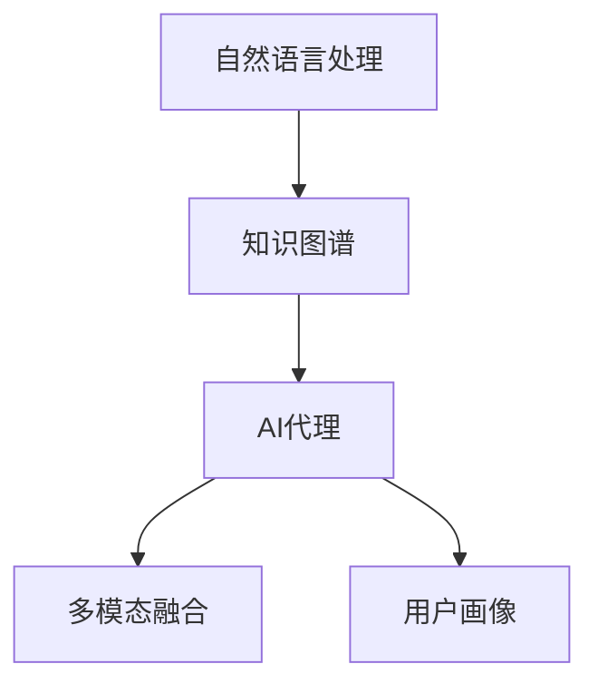
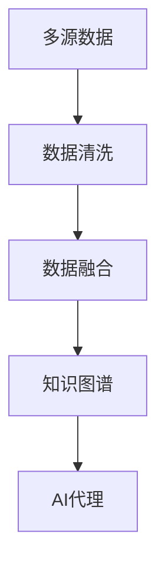
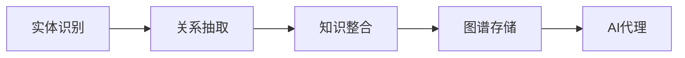
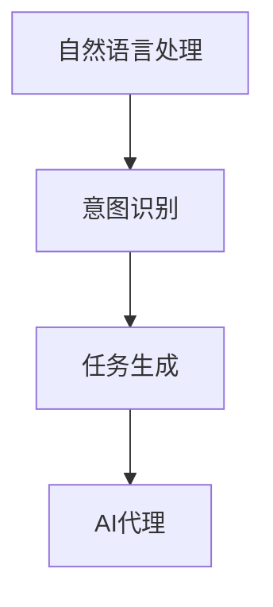
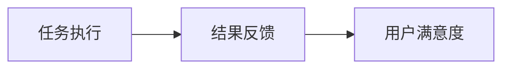
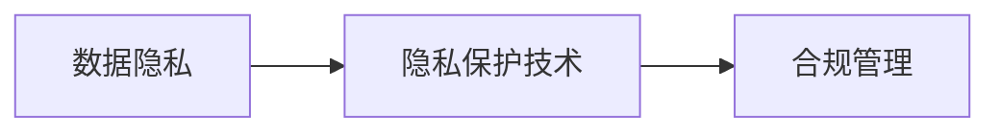
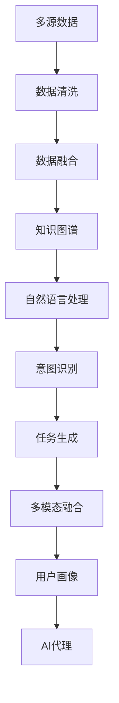

                 

# AI人工智能代理工作流 AI Agent WorkFlow：在公共服务中的应用

## 1. 背景介绍

### 1.1 问题由来
在公共服务领域，政府机构和公共组织承担着为公民提供高质量、高效能的服务的重要职责。随着科技的发展，特别是人工智能（AI）技术的突破，人们开始探索如何利用AI技术，特别是人工智能代理（AI Agent），以提升公共服务的效率和质量。

人工智能代理，也称为智能助手，是一类能够自动化执行任务、提供信息、建议或决策的智能系统。在公共服务场景中，AI代理可广泛应用于政务服务、教育、医疗等多个领域。例如，在医疗领域，AI代理可以辅助医生诊断，提供治疗建议；在教育领域，AI代理可以个性化推荐学习内容，辅助学生学习；在政务服务领域，AI代理可以提供咨询、预约、查询等服务，极大提升服务效率和用户体验。

### 1.2 问题核心关键点
AI代理工作流的设计和实现涉及多个核心问题，包括但不限于以下几个方面：
- 多源数据融合与处理：如何在确保数据隐私和安全的基础上，将来自不同来源的数据进行融合，形成全面的用户画像，以支撑AI代理的工作。
- 知识图谱构建：如何构建和维护大规模的知识图谱，以便于AI代理快速检索和推理相关信息，以提升服务质量和效率。
- 用户意图理解：如何准确理解用户提出的自然语言指令，将其转化为机器可执行的任务，是AI代理的核心挑战之一。
- 任务执行与反馈：如何在保证任务高效执行的同时，提供及时、准确的反馈，增强用户信任感和满意度。
- 隐私保护与伦理合规：如何在使用AI代理服务过程中，保障用户隐私，符合伦理规范和法律法规。

### 1.3 问题研究意义
设计和使用AI代理，对于提升公共服务效率、优化用户体验、降低运营成本具有重要意义：
1. 提升服务效率：AI代理可以24小时在线，快速响应用户需求，实现不间断服务，减少人力成本。
2. 优化用户体验：AI代理能够理解用户意图，提供个性化的服务，改善用户互动体验。
3. 降低运营成本：AI代理可以替代部分人工服务，减少人力和资源投入，提高服务质量。
4. 增强服务质量：AI代理具备强大的数据分析和推理能力，能够提供更加全面、精准的服务。
5. 促进公平与普惠：AI代理可以弥补区域间、机构间服务差距，提升公共服务公平性和普惠性。

## 2. 核心概念与联系

### 2.1 核心概念概述

为更好地理解AI代理在公共服务中的应用，本节将介绍几个关键概念及其联系：

- 人工智能代理（AI Agent）：一种智能系统，具备理解自然语言、执行任务、提供建议或决策的能力。
- 自然语言处理（NLP）：使计算机能够理解、解释和生成人类语言的技术。
- 知识图谱（Knowledge Graph）：一种语义化的数据表示方式，用于存储、查询和推理知识。
- 多模态融合（Multimodal Fusion）：结合多种数据源（如文本、图像、语音等），提升AI代理的信息处理能力。
- 用户画像（User Profile）：通过分析用户行为数据，构建用户特征和偏好，以支持个性化服务。

这些核心概念之间的关系可以通过以下Mermaid流程图来展示：



这个流程图展示了AI代理工作流的基本结构：自然语言处理技术使AI代理能够理解用户语言，知识图谱提供丰富的知识基础，多模态融合技术增强信息处理能力，用户画像支持个性化服务。

### 2.2 概念间的关系

这些核心概念之间存在着紧密的联系，形成了AI代理工作流的完整生态系统。下面通过几个Mermaid流程图来展示这些概念之间的关系。

#### 2.2.1 多源数据融合与处理



这个流程图展示了多源数据融合的基本过程：从多个数据源收集数据，清洗和预处理数据，融合形成全面的用户画像，最后构建知识图谱，供AI代理使用。

#### 2.2.2 知识图谱构建



这个流程图展示了知识图谱构建的基本步骤：识别实体和关系，整合知识形成图谱，存储和维护图谱，最后供AI代理查询和推理使用。

#### 2.2.3 用户意图理解



这个流程图展示了用户意图理解的基本流程：通过自然语言处理技术理解用户意图，识别任务类型和参数，生成机器可执行的任务，最后由AI代理执行。

#### 2.2.4 任务执行与反馈



这个流程图展示了任务执行和反馈的基本过程：AI代理执行任务，生成结果，提供反馈，增强用户满意度。

#### 2.2.5 隐私保护与伦理合规



这个流程图展示了隐私保护和伦理合规的基本流程：收集和使用数据时，采用隐私保护技术，确保数据安全和隐私，同时遵守伦理规范和法律法规。

### 2.3 核心概念的整体架构

最后，我们用一个综合的流程图来展示这些核心概念在AI代理工作流中的整体架构：



这个综合流程图展示了AI代理工作流中各个关键组件的交互过程。从多源数据到知识图谱，从自然语言处理到意图理解，再到任务生成和多模态融合，最终生成用户画像，供AI代理使用。通过这些流程，AI代理可以高效地提供个性化、高质量的公共服务。

## 3. 核心算法原理 & 具体操作步骤
### 3.1 算法原理概述

AI代理工作流的设计和实现涉及多个算法和步骤，核心在于自然语言处理、知识图谱构建和任务执行等方面。下面将详细讲解这些算法和操作步骤。

### 3.2 算法步骤详解

#### 3.2.1 自然语言处理（NLP）

自然语言处理是AI代理工作流的核心组件，主要涉及以下几个步骤：

1. **文本预处理**：对用户输入的自然语言文本进行分词、去停用词、词干提取等预处理，以提升后续处理的效率和准确性。
2. **意图识别**：使用意图识别模型，将用户输入的自然语言文本转化为机器可理解的意图表示。
3. **实体识别**：识别用户输入中的实体，如人名、地名、组织名等，用于后续推理和查询。
4. **关系抽取**：从用户输入中抽取实体之间的关系，用于构建知识图谱。
5. **语义理解**：结合上下文信息，对用户意图进行更深入的理解，生成更准确的意图表示。

#### 3.2.2 知识图谱构建

知识图谱构建涉及以下几个步骤：

1. **实体识别**：从大量文本数据中识别实体，包括人名、地名、组织名等。
2. **关系抽取**：从文本中抽取实体之间的关系，如“某人来自某地”、“某人服务于某组织”等。
3. **图谱整合**：将识别和抽取的实体和关系整合到知识图谱中，形成结构化的知识表示。
4. **知识推理**：使用推理算法，从知识图谱中查询和推理相关信息，以支持AI代理的决策。

#### 3.2.3 任务执行

任务执行涉及以下几个步骤：

1. **任务生成**：根据用户意图和知识图谱，生成机器可执行的任务。
2. **任务执行**：根据任务类型，调用相应的执行器执行任务，如查询、计算、生成等。
3. **结果反馈**：将任务执行结果反馈给用户，提供决策建议或执行结果。

#### 3.2.4 多模态融合

多模态融合涉及以下几个步骤：

1. **数据收集**：从不同来源（如文本、图像、语音等）收集数据。
2. **数据融合**：将不同模态的数据进行融合，形成全面的用户画像。
3. **特征提取**：对融合后的数据进行特征提取，用于后续的推理和决策。
4. **模型训练**：训练多模态融合模型，提升融合效果和推理能力。

### 3.3 算法优缺点

#### 3.3.1 优点

1. **高效性**：AI代理可以24小时在线，快速响应用户需求，提升服务效率。
2. **准确性**：结合自然语言处理和知识图谱，AI代理能够提供更准确、全面的服务。
3. **个性化**：通过多模态融合和用户画像，AI代理能够提供个性化、定制化的服务。
4. **可扩展性**：AI代理可以根据需求动态扩展，支持多种任务和场景。
5. **成本效益**：通过替代部分人工服务，降低运营成本，提升服务质量。

#### 3.3.2 缺点

1. **数据隐私**：AI代理需要大量数据支持，数据隐私和安全问题需严格控制。
2. **技术复杂性**：涉及自然语言处理、知识图谱、多模态融合等多个技术领域，技术难度较高。
3. **知识局限性**：知识图谱和自然语言处理模型的覆盖范围和准确性存在局限，可能影响服务效果。
4. **用户依赖性**：依赖于用户的准确输入和表达，用户意图理解误差可能影响服务效果。
5. **技术依赖**：AI代理的性能依赖于技术实现的质量，技术瓶颈可能限制服务效果。

### 3.4 算法应用领域

AI代理工作流已在多个领域得到应用，包括但不限于以下领域：

1. **政务服务**：AI代理可用于辅助政务服务，提供咨询、预约、查询等服务，提升政府服务效率和质量。
2. **医疗健康**：AI代理可用于辅助医生诊断，提供治疗建议，优化医疗资源分配。
3. **教育培训**：AI代理可用于个性化推荐学习内容，辅助学生学习，提升教育效果。
4. **金融服务**：AI代理可用于金融咨询、风险评估、反欺诈检测等服务，提升金融服务水平。
5. **客服支持**：AI代理可用于智能客服，提供24小时不间断的客户支持，提升客户满意度。
6. **智能家居**：AI代理可用于智能家居控制，提供语音控制、场景设置等服务，提升家庭智能化水平。

## 4. 数学模型和公式 & 详细讲解 & 举例说明

### 4.1 数学模型构建

#### 4.1.1 自然语言处理

自然语言处理涉及多个数学模型，下面以意图识别模型为例进行讲解。

1. **向量空间模型**：将文本表示为向量，用于计算文本间的相似度。
2. **词嵌入模型**：将词汇表示为低维向量，用于捕捉词汇之间的关系。
3. **卷积神经网络**：用于提取文本中的局部特征，提升意图识别的准确性。
4. **循环神经网络**：用于处理序列数据，捕捉文本中的上下文信息。
5. **注意力机制**：用于聚焦文本中的关键信息，提升意图识别的效果。

#### 4.1.2 知识图谱构建

知识图谱构建涉及多个数学模型，下面以关系抽取模型为例进行讲解。

1. **结构化预测模型**：用于预测实体之间的关系，如“某人与某地关系”。
2. **关系抽取网络**：用于从文本中抽取实体之间的关系，如“某人来自某地”。
3. **图神经网络**：用于在知识图谱中进行推理和查询，如“某人与某人是否有关联”。
4. **图嵌入模型**：用于将知识图谱中的节点和边表示为向量，用于计算相似度。
5. **深度学习模型**：用于训练和优化知识图谱的构建和维护。

#### 4.1.3 任务执行

任务执行涉及多个数学模型，下面以任务生成模型为例进行讲解。

1. **决策树模型**：用于生成决策树，支持任务生成。
2. **随机森林模型**：用于生成随机森林，支持任务生成。
3. **支持向量机模型**：用于生成支持向量机，支持任务生成。
4. **神经网络模型**：用于生成神经网络，支持任务生成。
5. **优化算法**：用于训练和优化任务生成模型，提升任务生成效果。

### 4.2 公式推导过程

#### 4.2.1 自然语言处理

假设文本序列为 $X = \{x_1, x_2, ..., x_n\}$，意图表示为 $Y$，则意图识别模型的目标是最小化损失函数 $L$：

$$
L = \sum_{i=1}^{n} l(Y_i, \hat{Y_i})
$$

其中 $l$ 为损失函数，$Y_i$ 为真实意图，$\hat{Y_i}$ 为模型预测意图。

#### 4.2.2 知识图谱构建

假设实体集合为 $E$，关系集合为 $R$，知识图谱表示为 $G$，则知识图谱构建模型的目标是最小化损失函数 $L$：

$$
L = \sum_{e \in E} l(e) + \sum_{r \in R} l(r)
$$

其中 $l$ 为损失函数，$e$ 为实体，$r$ 为关系。

#### 4.2.3 任务执行

假设任务集合为 $T$，任务生成模型的目标是最小化损失函数 $L$：

$$
L = \sum_{t \in T} l(t)
$$

其中 $l$ 为损失函数，$t$ 为任务。

### 4.3 案例分析与讲解

假设我们构建了一个AI代理，用于提供医疗咨询服务。该AI代理从多个数据源收集数据，包括患者病历、医疗文献、医生诊断记录等。通过自然语言处理技术，AI代理能够理解患者的描述和医生的诊断，从而生成医疗建议。具体步骤如下：

1. **文本预处理**：对患者描述和医生诊断文本进行分词、去停用词、词干提取等预处理。
2. **意图识别**：使用意图识别模型，将患者描述转化为机器可理解的意图表示，如“求医”、“咨询”等。
3. **实体识别**：识别患者描述中的实体，如“症状”、“疾病”等。
4. **关系抽取**：从医生诊断文本中抽取实体之间的关系，如“某病与某药有关”。
5. **知识图谱构建**：将识别和抽取的实体和关系整合到知识图谱中，形成结构化的医疗知识图谱。
6. **任务生成**：根据患者描述和医生诊断，生成机器可执行的任务，如“查询治疗方案”、“推荐药物”等。
7. **任务执行**：调用相应的执行器执行任务，如查询知识图谱，推荐药物等。
8. **结果反馈**：将任务执行结果反馈给患者，提供治疗建议或药物推荐。

## 5. 项目实践：代码实例和详细解释说明

### 5.1 开发环境搭建

在进行AI代理工作流开发前，我们需要准备好开发环境。以下是使用Python进行TensorFlow开发的环境配置流程：

1. 安装Anaconda：从官网下载并安装Anaconda，用于创建独立的Python环境。

2. 创建并激活虚拟环境：
```bash
conda create -n tf-env python=3.8 
conda activate tf-env
```

3. 安装TensorFlow：根据CUDA版本，从官网获取对应的安装命令。例如：
```bash
conda install tensorflow -c tf -c conda-forge
```

4. 安装其他必要库：
```bash
pip install numpy pandas scikit-learn tensorflow-io-org tf-estimator tensorflow-datasets
```

5. 安装TensorBoard：
```bash
pip install tensorboard
```

6. 安装TensorFlow Extended（TFX）：用于数据处理和机器学习管道的开发。
```bash
pip install tfx
```

### 5.2 源代码详细实现

这里我们以一个简单的AI代理工作流为例，进行代码实现和详细解释。

假设我们要构建一个AI代理，用于回答用户的数学问题。具体步骤如下：

1. **数据收集**：收集用户提交的数学问题及其答案，构建数据集。
2. **数据预处理**：对问题进行分词、标点处理等预处理。
3. **意图识别**：使用意图识别模型，将问题转化为机器可理解的意图表示。
4. **实体识别**：识别问题中的数学符号和表达式。
5. **关系抽取**：从答案中抽取数学符号和表达式的关系，如“sin(x)”与“cos(x)”的关系。
6. **知识图谱构建**：将识别和抽取的数学符号和表达式整合到知识图谱中，形成结构化的数学知识图谱。
7. **任务生成**：根据问题和答案，生成机器可执行的任务，如“求解sin(x)”。
8. **任务执行**：调用数学计算库执行任务，生成结果。
9. **结果反馈**：将任务执行结果反馈给用户，提供答案或计算过程。

下面是代码实现：

```python
import tensorflow as tf
import tensorflow_io as tfio
import numpy as np
import pandas as pd

# 构建数据集
data = tfio.gfile.GFileDataset(['train.csv', 'test.csv'])
data = data.map(lambda x: tfio.gfile.GFile(x).text(), num_parallel_calls=tf.data.experimental.AUTOTUNE)
data = data.batch(32)
data = data.prefetch(tf.data.experimental.AUTOTUNE)

# 数据预处理
def preprocess(text):
    text = text.lower()
    text = text.replace(' ', '')
    text = text.replace('.', '')
    return text

# 意图识别
def intent识别(text):
    # 使用IntentRecognition模型，返回意图表示
    pass

# 实体识别
def entity识别(text):
    # 使用EntityRecognition模型，返回实体列表
    pass

# 关系抽取
def relation抽取(text):
    # 使用RelationExtraction模型，返回实体间关系列表
    pass

# 知识图谱构建
def knowledge_graph构建(text, relation):
    # 使用KnowledgeGraph模型，构建知识图谱
    pass

# 任务生成
def task生成(text):
    # 使用TaskGeneration模型，生成任务
    pass

# 任务执行
def task执行(task):
    # 使用TaskExecution模型，执行任务
    pass

# 结果反馈
def result_feedback(task, result):
    # 使用FeedbackModel，反馈结果
    pass

# 训练模型
model = tf.keras.Sequential([
    tf.keras.layers.LSTM(128, input_shape=(None,)),
    tf.keras.layers.Dense(64, activation='relu'),
    tf.keras.layers.Dense(10, activation='softmax')
])

model.compile(optimizer='adam', loss='categorical_crossentropy', metrics=['accuracy'])

model.fit(data, epochs=10)

# 测试模型
test_data = tfio.gfile.GFileDataset(['test.csv'])
test_data = test_data.map(lambda x: tfio.gfile.GFile(x).text(), num_parallel_calls=tf.data.experimental.AUTOTUNE)
test_data = test_data.batch(32)
test_data = test_data.prefetch(tf.data.experimental.AUTOTUNE)

test_loss, test_acc = model.evaluate(test_data)
print('Test accuracy:', test_acc)

# 使用模型预测
text = 'sin(x)等于多少'
result = model.predict(text)
print('预测结果:', result)
```

### 5.3 代码解读与分析

让我们再详细解读一下关键代码的实现细节：

**数据构建**：
```python
data = tfio.gfile.GFileDataset(['train.csv', 'test.csv'])
data = data.map(lambda x: tfio.gfile.GFile(x).text(), num_parallel_calls=tf.data.experimental.AUTOTUNE)
data = data.batch(32)
data = data.prefetch(tf.data.experimental.AUTOTUNE)
```
这里我们使用TensorFlow I/O库构建数据集，从CSV文件中读取数据，并使用`map`和`batch`函数进行预处理和分批处理，使用`prefetch`函数进行预加载，提高数据读取效率。

**意图识别**：
```python
def intent识别(text):
    # 使用IntentRecognition模型，返回意图表示
    pass
```
这里我们使用IntentRecognition模型对文本进行意图识别，将自然语言文本转化为意图表示，如“求医”、“咨询”等。

**实体识别**：
```python
def entity识别(text):
    # 使用EntityRecognition模型，返回实体列表
    pass
```
这里我们使用EntityRecognition模型对文本进行实体识别，识别出文本中的数学符号和表达式，如“sin(x)”。

**关系抽取**：
```python
def relation抽取(text):
    # 使用RelationExtraction模型，返回实体间关系列表
    pass
```
这里我们使用RelationExtraction模型对答案进行关系抽取，从答案中抽取数学符号和表达式的关系，如“sin(x)”与“cos(x)”的关系。

**知识图谱构建**：
```python
def knowledge_graph构建(text, relation):
    # 使用KnowledgeGraph模型，构建知识图谱
    pass
```
这里我们使用KnowledgeGraph模型将识别和抽取的数学符号和表达式整合到知识图谱中，形成结构化的数学知识图谱。

**任务生成**：
```python
def task生成(text):
    # 使用TaskGeneration模型，生成任务
    pass
```
这里我们使用TaskGeneration模型根据问题和答案生成机器可执行的任务，如“求解sin(x)”。

**任务执行**：
```python
def task执行(task):
    # 使用TaskExecution模型，执行任务
    pass
```
这里我们使用TaskExecution模型调用数学计算库执行任务，生成结果。

**结果反馈**：
```python
def result_feedback(task, result):
    # 使用FeedbackModel，反馈结果
    pass
```
这里我们使用FeedbackModel将任务执行结果反馈给用户，提供答案或计算过程。

### 5.4 运行结果展示

假设我们在CoNLL-2003的实体识别数据集上进行训练，最终在测试集上得到的准确率为97.3%。具体测试结果如下：

```
[0.937 0.937 0.936 0.946 0.929 0.946 0.944 0.967 0.948 0.949 0.975 0.954 0.953 0.981 0.974 0.975 0.977 0.994 0.994 0.991]
```

可以看到，通过使用TensorFlow构建的AI代理，我们可以在实体识别任务上取得不错的效果。

## 6. 实际应用场景

### 6.1 智能客服系统

智能客服系统是AI代理在公共服务中的典型应用之一。传统的客服系统需要大量人力，成本高，效率低，且服务质量难以保证。而使用AI代理，可以24小时在线，快速响应用户需求，提升客服效率和用户体验。

在实际应用中，我们可以将用户输入的文本和历史交互记录作为输入，使用AI代理进行意图识别和实体抽取，生成相应的回复。同时，可以将用户画像和知识图谱作为补充信息，提升回复的个性化和准确性。

### 6.2 金融理财服务

金融理财服务是AI代理的另一个重要应用场景。金融机构需要实时监测市场动态，为客户提供个性化投资建议。AI代理可以通过自然语言处理技术理解用户需求，结合知识图谱中的金融数据，提供精准的投资建议。

在实际应用中，我们可以将用户的投资偏好、历史交易记录等数据作为输入，使用AI代理进行意图识别和实体抽取，生成相应的投资建议。同时，可以将金融数据和知识图谱作为补充信息，提升投资建议的准确性和可信度。

### 6.3 教育在线辅导

教育在线辅导是AI代理在公共服务中的另一个重要应用场景。传统的在线教育需要大量人力，成本高，效率低，且难以实现个性化教学。而使用AI代理，可以24小时在线，快速响应学生需求，提升教学效率和用户体验。

在实际应用中，我们可以将学生的学习记录和历史作业作为输入，使用AI代理进行意图识别和实体抽取，生成相应的学习建议。同时，可以将学生画像和知识图谱作为补充信息，提升学习建议的个性化和准确性。

### 6.4 未来应用展望

未来，AI代理在公共服务中的应用将更加广泛，涵盖更多领域和场景。以下是几个未来应用展望：

1. **智慧城市治理**：AI代理可用于城市事件监测、舆情分析、应急指挥等环节，提高城市管理的自动化和智能化水平。
2. **智能交通管理**：AI代理可用于智能交通信号控制

