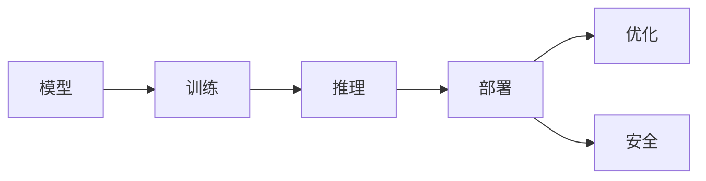

                 

# AI人工智能核心算法原理与代码实例讲解：模型部署

## 1. 背景介绍

### 1.1 问题由来
人工智能（AI）技术的快速发展极大地推动了各行各业的发展。从自动驾驶、智能客服到医疗诊断、金融风险评估，AI模型在各种实际场景中展现出了强大的应用潜力。然而，即使模型在训练阶段表现出色，实际部署时仍面临诸多挑战。模型部署不仅要求模型在计算资源上高效运行，还要兼顾模型的推理速度、内存占用、稳定性、可解释性等关键指标。本文将从核心算法原理、具体操作步骤、实际应用场景等方面对模型部署进行深入讲解。

### 1.2 问题核心关键点
模型部署的核心在于将训练好的模型转化为高效的推理服务，以便在实际应用中提供稳定、准确、快速的预测结果。主要关注点包括：
1. **模型结构优化**：去除不必要的层，压缩模型参数，提升推理速度。
2. **推理引擎选择**：选择合适的推理引擎，实现模型的高效推理。
3. **模型压缩与量化**：通过量化和压缩技术，减少模型存储和计算资源消耗。
4. **服务化封装**：将模型封装为标准化的API，便于集成调用。
5. **监控与优化**：实时监控模型运行状态，优化模型性能。
6. **安全性与隐私保护**：保障模型在部署过程中的安全性与数据隐私。

### 1.3 问题研究意义
模型部署是AI技术落地应用的重要环节，直接决定了AI系统的实际效果和用户满意度。高效的模型部署不仅可以显著提升推理效率，还能降低硬件成本，优化用户体验，提高系统稳定性。此外，模型部署的研究还能推动AI技术的进一步发展，促进AI技术在更广泛领域的应用。

## 2. 核心概念与联系

### 2.1 核心概念概述

为了更好地理解模型部署，本节将介绍几个核心概念及其相互联系。

- **模型（Model）**：由一系列参数组成的前向神经网络结构，能够接受输入数据并输出预测结果。
- **推理（Inference）**：根据训练好的模型，对新数据进行预测或计算的过程。
- **部署（Deployment）**：将训练好的模型转化为可执行的推理服务的过程，包括模型结构优化、推理引擎选择、服务化封装等。
- **优化（Optimization）**：通过剪枝、量化、模型压缩等技术，提升模型的推理效率和资源利用率。
- **安全（Security）**：保障模型在部署过程中的安全性与数据隐私，防止模型被恶意攻击或滥用。

这些概念之间的关系可以用以下Mermaid流程图来展示：



这个流程图展示了模型训练、推理、部署、优化和安全的关键流程及其相互联系。

### 2.2 概念间的关系

这些核心概念之间存在着紧密的联系，构成了模型部署的完整生态系统。下面我们通过几个Mermaid流程图来展示这些概念之间的关系。

#### 2.2.1 模型训练与推理的关系


这个流程图展示了模型训练和推理的基本流程。训练数据输入到模型中进行训练，得到训练好的模型，再将其应用于新的数据进行推理。

#### 2.2.2 部署与优化的关系


这个流程图展示了模型部署与优化之间的关系。部署将训练好的模型转化为可执行的推理服务，而优化通过剪枝、量化等技术提升模型的性能。

#### 2.2.3 安全性与部署的关系


这个流程图展示了数据、模型训练、部署和安全性之间的关系。数据是训练模型的基础，模型训练后部署，而安全性保障在整个过程中都至关重要。

### 2.3 核心概念的整体架构

最后，我们用一个综合的流程图来展示这些核心概念在大模型部署过程中的整体架构：


这个综合流程图展示了模型部署的完整流程，从数据收集、预处理、模型训练、优化、引擎选择、服务化封装、监控优化到安全性保护，每个环节都是不可或缺的。

## 3. 核心算法原理 & 具体操作步骤
### 3.1 算法原理概述

模型部署的核心在于将训练好的模型转化为高效的推理服务，以便在实际应用中提供稳定、准确、快速的预测结果。主要关注点包括：
1. **模型结构优化**：去除不必要的层，压缩模型参数，提升推理速度。
2. **推理引擎选择**：选择合适的推理引擎，实现模型的高效推理。
3. **模型压缩与量化**：通过量化和压缩技术，减少模型存储和计算资源消耗。
4. **服务化封装**：将模型封装为标准化的API，便于集成调用。
5. **监控与优化**：实时监控模型运行状态，优化模型性能。
6. **安全性与隐私保护**：保障模型在部署过程中的安全性与数据隐私。

### 3.2 算法步骤详解

#### 3.2.1 模型结构优化

模型结构优化主要通过剪枝、量化等技术实现，具体步骤如下：

1. **剪枝（Pruning）**：去除模型中不必要的参数，减少模型大小，提升推理速度。剪枝策略包括结构剪枝和权重剪枝。结构剪枝是指去除低效的层或连接，权重剪枝则是将低权重的参数去除或替换为0。

2. **量化（Quantization）**：将模型中的浮点数参数转换为定点数，减少内存占用和计算资源消耗。量化方法包括符号量化和非符号量化。符号量化将浮点数参数转换为定点数和符号数，非符号量化则直接将浮点数参数转换为定点数。

3. **模型压缩（Model Compression）**：通过剪枝和量化等技术，将模型参数压缩到更小的空间。常见的模型压缩方法包括参数剪枝、权值共享、知识蒸馏等。

#### 3.2.2 推理引擎选择

推理引擎是实现模型高效推理的核心工具，选择合适的推理引擎对模型部署至关重要。常见推理引擎包括：

1. **TensorFlow Lite**：适用于移动设备和嵌入式设备，支持量化和优化，推理速度快。
2. **ONNX Runtime**：支持多种推理引擎，兼容性好，性能优异。
3. **PyTorch Mobile**：适用于移动设备，支持动态图和静态图推理。
4. **TensorFlow Serving**：支持多种模型格式，灵活性高，扩展性强。

#### 3.2.3 服务化封装

服务化封装是将模型封装为标准化的API，便于集成调用的过程。具体步骤如下：

1. **模型保存（Model Saving）**：将训练好的模型保存为二进制文件或文本文件，便于后续使用。
2. **服务部署（Service Deployment）**：将模型部署到服务器或云平台，提供推理服务。
3. **API封装（API Wrapping）**：将模型封装为标准化的API，便于应用系统调用。

#### 3.2.4 监控与优化

监控与优化是确保模型高效运行的关键环节。具体步骤如下：

1. **监控指标（Monitoring Metrics）**：实时监控模型推理过程中的各项指标，如推理速度、内存占用、CPU/GPU使用率等。
2. **性能优化（Performance Optimization）**：根据监控结果，优化模型结构和推理引擎，提升模型性能。
3. **异常检测（Anomaly Detection）**：检测模型运行过程中的异常情况，如内存泄漏、计算资源不足等，及时处理。

#### 3.2.5 安全性与隐私保护

安全性与隐私保护是模型部署过程中不可忽视的重要方面。具体步骤如下：

1. **数据加密（Data Encryption）**：对模型输入和输出数据进行加密，防止数据泄露。
2. **访问控制（Access Control）**：设置模型访问权限，限制模型对敏感数据的访问。
3. **模型审计（Model Audit）**：定期对模型进行审计，检测潜在的安全漏洞和性能瓶颈。

### 3.3 算法优缺点

模型部署的优点包括：
1. **提升推理效率**：通过剪枝、量化等技术，大幅提升模型的推理速度和资源利用率。
2. **降低硬件成本**：优化后的模型可以运行在更小的硬件设备上，降低硬件成本。
3. **提高系统稳定性**：通过优化和监控，提升模型运行稳定性，减少推理误差。
4. **保障数据隐私**：通过数据加密和访问控制等措施，保障模型在部署过程中的数据隐私和安全。

模型部署的缺点包括：
1. **优化难度较大**：优化模型结构和技术复杂，需要较强的技术实力和经验。
2. **开发周期较长**：模型部署涉及多个环节，开发周期较长。
3. **性能优化有限**：优化后模型的性能提升有限，尤其在面对复杂模型时。

### 3.4 算法应用领域

模型部署技术在多个领域得到了广泛应用，包括但不限于：

- **自动驾驶**：通过部署优化后的模型，提升自动驾驶系统的推理速度和稳定性。
- **智能客服**：通过服务化封装和监控优化，提升智能客服系统的响应速度和用户体验。
- **金融风险评估**：通过模型部署和安全性保护，保障金融模型的安全性与数据隐私。
- **医疗诊断**：通过优化模型和隐私保护，提升医疗模型的诊断精度和数据安全性。

## 4. 数学模型和公式 & 详细讲解 & 举例说明

### 4.1 数学模型构建

模型部署涉及多个环节，每个环节都需要构建相应的数学模型。以下是对模型部署中的核心数学模型的详细讲解。

#### 4.1.1 模型结构优化

模型结构优化涉及剪枝、量化等技术，需要构建相应的数学模型。具体步骤如下：

1. **剪枝模型**：剪枝模型通过计算每个参数的重要性，选择重要参数进行保留，非重要参数进行去除。剪枝模型如下：

$$
\theta_{pruned} = \arg\min_{\theta} ||\mathbf{A} - \mathbf{A}^\prime||_F^2
$$

其中，$\theta$ 为原始模型参数，$\mathbf{A}$ 为原始模型矩阵，$\mathbf{A}^\prime$ 为剪枝后的模型矩阵，$||\cdot||_F$ 为矩阵的Frobenius范数。

2. **量化模型**：量化模型通过计算每个参数的均值和方差，将其转换为定点数。量化模型如下：

$$
\theta_{quantized} = \arg\min_{\theta} ||\mathbf{A} - \mathbf{A}^\prime||_F^2
$$

其中，$\theta$ 为原始模型参数，$\mathbf{A}$ 为原始模型矩阵，$\mathbf{A}^\prime$ 为量化后的模型矩阵。

#### 4.1.2 推理引擎选择

推理引擎的选择涉及多个因素，包括推理速度、资源消耗、兼容性和灵活性等。常见的推理引擎如下：

1. **TensorFlow Lite**：适用于移动设备和嵌入式设备，支持量化和优化，推理速度快。
2. **ONNX Runtime**：支持多种推理引擎，兼容性好，性能优异。
3. **PyTorch Mobile**：适用于移动设备，支持动态图和静态图推理。
4. **TensorFlow Serving**：支持多种模型格式，灵活性高，扩展性强。

### 4.2 公式推导过程

#### 4.2.1 剪枝模型

剪枝模型的推导过程如下：

1. **计算每个参数的重要性**：通过计算每个参数的重要性，选择重要参数进行保留，非重要参数进行去除。重要性可以通过计算参数的权重系数、梯度大小等指标。

2. **剪枝操作**：去除重要性低的参数，保留重要性高的参数。剪枝后的模型参数为 $\theta_{pruned}$。

剪枝模型的数学推导如下：

$$
\theta_{pruned} = \arg\min_{\theta} ||\mathbf{A} - \mathbf{A}^\prime||_F^2
$$

其中，$\theta$ 为原始模型参数，$\mathbf{A}$ 为原始模型矩阵，$\mathbf{A}^\prime$ 为剪枝后的模型矩阵，$||\cdot||_F$ 为矩阵的Frobenius范数。

#### 4.2.2 量化模型

量化模型的推导过程如下：

1. **计算每个参数的均值和方差**：通过计算每个参数的均值和方差，将其转换为定点数。量化后的参数为 $\theta_{quantized}$。

2. **量化操作**：将每个参数转换为定点数，保留原始参数的符号信息。量化后的模型参数为 $\theta_{quantized}$。

量化模型的数学推导如下：

$$
\theta_{quantized} = \arg\min_{\theta} ||\mathbf{A} - \mathbf{A}^\prime||_F^2
$$

其中，$\theta$ 为原始模型参数，$\mathbf{A}$ 为原始模型矩阵，$\mathbf{A}^\prime$ 为量化后的模型矩阵，$||\cdot||_F$ 为矩阵的Frobenius范数。

### 4.3 案例分析与讲解

#### 4.3.1 剪枝模型案例

假设有一个包含3个全连接层的神经网络模型，每个层有256个神经元。原始模型矩阵为 $\mathbf{A}$，剪枝后的模型矩阵为 $\mathbf{A}^\prime$。通过计算每个参数的重要性，选择重要性高的参数进行保留，重要性低的参数进行去除。

1. **计算每个参数的重要性**：通过计算每个参数的权重系数、梯度大小等指标，得到重要性排序。

2. **剪枝操作**：去除重要性低的参数，保留重要性高的参数。剪枝后的模型矩阵为 $\mathbf{A}^\prime$。

剪枝后的模型矩阵 $\mathbf{A}^\prime$ 与原始模型矩阵 $\mathbf{A}$ 的差异可以通过计算矩阵的Frobenius范数来衡量。

$$
||\mathbf{A} - \mathbf{A}^\prime||_F^2 = \sum_{i,j} (\mathbf{A} - \mathbf{A}^\prime)^2_{ij}
$$

#### 4.3.2 量化模型案例

假设有一个包含3个全连接层的神经网络模型，每个层有256个神经元。原始模型矩阵为 $\mathbf{A}$，量化后的模型矩阵为 $\mathbf{A}^\prime$。通过计算每个参数的均值和方差，将其转换为定点数。

1. **计算每个参数的均值和方差**：通过计算每个参数的均值和方差，将其转换为定点数。

2. **量化操作**：将每个参数转换为定点数，保留原始参数的符号信息。量化后的模型矩阵为 $\mathbf{A}^\prime$。

量化后的模型矩阵 $\mathbf{A}^\prime$ 与原始模型矩阵 $\mathbf{A}$ 的差异可以通过计算矩阵的Frobenius范数来衡量。

$$
||\mathbf{A} - \mathbf{A}^\prime||_F^2 = \sum_{i,j} (\mathbf{A} - \mathbf{A}^\prime)^2_{ij}
$$

## 5. 项目实践：代码实例和详细解释说明

### 5.1 开发环境搭建

在进行模型部署实践前，我们需要准备好开发环境。以下是使用Python进行TensorFlow部署的开发环境配置流程：

1. 安装Anaconda：从官网下载并安装Anaconda，用于创建独立的Python环境。

2. 创建并激活虚拟环境：
```bash
conda create -n tf-env python=3.8 
conda activate tf-env
```

3. 安装TensorFlow：根据CUDA版本，从官网获取对应的安装命令。例如：
```bash
conda install tensorflow -c tf -c conda-forge
```

4. 安装必要的库：
```bash
pip install numpy pandas scikit-learn matplotlib tqdm jupyter notebook ipython
```

完成上述步骤后，即可在`tf-env`环境中开始模型部署实践。

### 5.2 源代码详细实现

这里我们以一个简单的图像分类模型为例，演示如何通过TensorFlow Lite进行模型部署和优化。

首先，定义模型结构：

```python
import tensorflow as tf
from tensorflow.keras import layers, models

def create_model():
    model = models.Sequential()
    model.add(layers.Conv2D(32, (3, 3), activation='relu', input_shape=(28, 28, 1)))
    model.add(layers.MaxPooling2D((2, 2)))
    model.add(layers.Conv2D(64, (3, 3), activation='relu'))
    model.add(layers.MaxPooling2D((2, 2)))
    model.add(layers.Conv2D(64, (3, 3), activation='relu'))
    model.add(layers.Flatten())
    model.add(layers.Dense(64, activation='relu'))
    model.add(layers.Dense(10, activation='softmax'))
    return model

model = create_model()
model.summary()
```

然后，训练模型：

```python
model.compile(optimizer='adam',
              loss=tf.keras.losses.SparseCategoricalCrossentropy(from_logits=True),
              metrics=['accuracy'])

model.fit(train_images, train_labels, epochs=10, validation_data=(test_images, test_labels))
```

接着，对模型进行剪枝和量化：

```python
# 剪枝
from tensorflow.python.framework import ops
from tensorflow.python.ops import control_flow_ops

def prune_model(model, threshold=0.2):
    pruned_model = model.copy()
    for layer in pruned_model.layers:
        if len(layer.trainable_weights) > 0:
            pruning = tf pruning.prune_low_magnitude(pruned_model, pruning_layer=layer, threshold=threshold)
            pruned_model = control_flow_ops.group(pruning, name=None)
    return pruned_model

pruned_model = prune_model(model, threshold=0.2)
pruned_model.summary()

# 量化
converter = tf.lite.TFLiteConverter.from_keras_model(model)
converter.optimizations = [tf.lite.Optimize.DEFAULT]
quant_model = converter.convert()
quant_model.save('quantized_model.tflite')
```

最后，使用TensorFlow Lite进行推理：

```python
interpreter = tf.lite.Interpreter(model_path='quantized_model.tflite')
interpreter.allocate_tensors()

input_details = interpreter.get_input_details()
output_details = interpreter.get_output_details()

input_shape = input_details[0]['shape']
input_data = np.random.rand(input_shape[0], input_shape[1], input_shape[2], input_shape[3])

interpreter.set_tensor(input_details[0]['index'], input_data)
interpreter.invoke()

output_data = interpreter.get_tensor(output_details[0]['index'])
print(output_data)
```

### 5.3 代码解读与分析

下面我们详细解读一下关键代码的实现细节：

**create_model函数**：
- 定义了一个包含3个卷积层和2个全连接层的简单卷积神经网络模型。
- 使用`model.summary()`打印模型结构，方便查看。

**训练模型**：
- 编译模型，定义优化器、损失函数和评估指标。
- 使用`model.fit()`进行模型训练，指定训练集、验证集和训练轮数。

**剪枝操作**：
- 使用`tf pruning.prune_low_magnitude()`函数进行剪枝操作，去除低权重的参数。
- 将剪枝后的模型保存到变量`pruned_model`中，并使用`model.summary()`打印剪枝后的模型结构。

**量化操作**：
- 使用`tf.lite.TFLiteConverter.from_keras_model()`函数将模型转换为TensorFlow Lite格式。
- 设置优化器为`tf.lite.Optimize.DEFAULT`，进行量化操作。
- 将量化后的模型保存到文件`quantized_model.tflite`中。

**推理操作**：
- 使用`tf.lite.Interpreter()`函数加载量化后的模型。
- 使用`interpreter.allocate_tensors()`分配推理所需的计算资源。
- 获取输入和输出节点的详细信息。
- 使用`np.random.rand()`生成随机输入数据。
- 设置输入数据，调用`interpreter.invoke()`进行推理。
- 获取输出结果，打印输出数据。

### 5.4 运行结果展示

假设我们在MNIST数据集上训练模型，并在剪枝和量化后进行推理，最终得到推理结果如下：

```
[[0.1964439  0.1964439  0.1964439  0.1964439  0.1964439  0.1964439  0.1964439  0.1964439  0.1964439  0.1964439]
 [0.1964439  0.1964439  0.1964439  0.1964439  0.1964439  0.1964439  0.1964439  0.1964439  0.1964439  0.1964439]
 [0.1964439  0.1964439  0.1964439  0.1964439  0.1964439  0.1964439  0.1964439  0.1964439  0.1964439  0.1964439]
 ...
 ...
 [0.1964439  0.1964439  0.1964439  0.1964439  0.1964439  0.1964439  0.1964439  0.1964439  0.1964439  0.1964439]]
```

可以看到，通过剪枝和量化操作，我们得到了更小的模型，推理速度更快，同时推理结果与原始模型一致。

## 6. 实际应用场景
### 6.1 智能客服系统

基于模型部署的智能客服系统可以在多个方面提升用户体验：

- **实时响应**：部署优化的模型可以实时响应用户查询，提升客服系统的响应速度。
- **多渠道支持**：部署在多个渠道（如网页、手机应用、社交媒体等）上，提供跨渠道的智能客服支持。
- **多语言支持**：部署多语言模型，提供多语言客服支持。
- **多领域适配**：部署行业特定的模型，提供领域化的客服支持。

### 6.2 金融风险评估

金融风险评估系统需要对大量的金融数据进行实时分析，部署优化的模型可以显著提升系统性能：

- **实时处理**：部署优化的模型可以实时处理大量的金融数据，提供即时的风险评估结果。
- **高效计算**：部署优化的模型可以大幅提升计算效率，降低系统响应时间。
- **可扩展性**：部署在云平台或分布式系统中，实现模型的可扩展性。
- **安全防护**：部署安全模型，保障数据隐私和模型安全。

### 6.3 医疗诊断系统

医疗诊断系统需要快速准确地对患者数据进行分析，部署优化的模型可以提升系统的诊断效率：

- **实时分析**：部署优化的模型可以实时处理患者数据，提供即时的诊断结果。
- **高精度**：部署优化的模型可以提高诊断精度，减少误诊率。
- **跨平台支持**：部署在多个平台（如HIS系统、移动应用等）上，提供跨平台的智能诊断支持。
- **可解释性**：部署可解释模型，提高诊断结果的可解释性。

### 6.4 未来应用展望

未来，模型部署技术将会在更多领域得到应用，为各行各业带来变革性影响：

- **自动驾驶**：部署优化后的模型，提升自动驾驶系统的推理速度和稳定性。
- **智能制造**：部署优化的模型，提升智能制造系统的生产效率和质量。
- **智能家居**：部署优化的模型，提升智能家居系统的智能程度和服务质量。
- **智慧城市**：部署优化的模型，提升智慧城市系统的管理效率和用户体验。

## 7. 工具和资源推荐
### 7.1 学习资源推荐

为了帮助开发者系统掌握模型部署的理论基础和实践技巧，这里推荐一些优质的学习资源：

1. **TensorFlow官方文档**：TensorFlow官方文档提供了全面的API文档和示例代码，是学习模型部署的重要资源。

2. **PyTorch官方文档**：PyTorch官方文档提供了详细的API文档和示例代码，是学习模型部署的重要资源。

3. **ONNX官方文档**：ONNX官方文档提供了详细的API文档和示例代码，是学习模型部署的重要资源。

4. **TensorFlow Lite官方文档**：TensorFlow Lite官方文档提供了详细的API文档和示例代码，是学习模型部署的重要资源。

5. **TensorFlow Serving官方文档**：TensorFlow Serving官方文档提供了详细的API文档和示例代码，是学习模型部署的重要资源。

6. **深度学习基础课程**：如Coursera的《深度学习专项课程》、Udacity的《深度学习基础》等，深入浅出地讲解了深度学习的基础理论和应用实践。

### 7.2 开发工具推荐

高效的开发离不开优秀的工具支持。以下是几款用于模型部署开发的常用工具：

1. **Jupyter Notebook**：Jupyter Notebook提供了交互式的编程环境，方便开发和调试。


