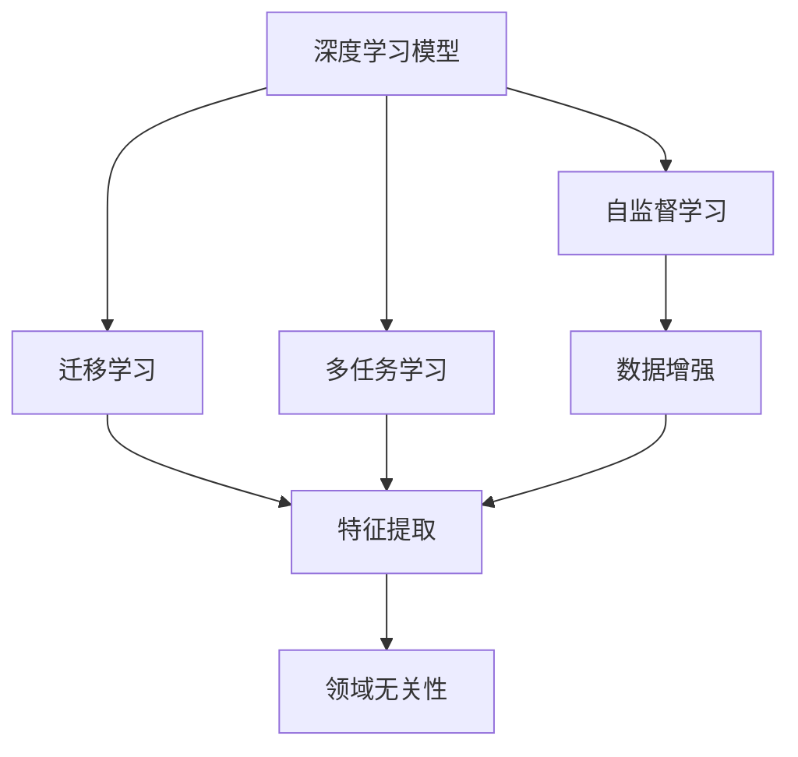

                 

# AI人工智能核心算法原理与代码实例讲解：领域无关性

> 关键词：人工智能,领域无关性,核心算法,Python代码,深度学习,深度神经网络

## 1. 背景介绍

### 1.1 问题由来
随着人工智能技术的迅猛发展，深度学习在多个领域展现了巨大的潜力，包括计算机视觉、自然语言处理、语音识别等。然而，深度学习模型的泛化能力有限，对不同领域的数据具有很强的领域依赖性。例如，在图像识别领域，预训练的深度神经网络模型往往需要针对不同的图像类别进行微调才能在特定类别上取得良好的效果。这导致了大量的资源投入和模型冗余，无法实现高效、灵活的AI应用。

领域无关性（Domain-Independence）是指模型能够在多个不同领域（如图像、文本、语音等）中有效迁移，而不需要针对每个领域进行单独训练和微调。这不仅可以减少训练成本和资源消耗，还能提高模型在多个领域中的泛化能力，具有重要的实际应用价值。

### 1.2 问题核心关键点
解决领域无关性的关键在于开发通用性更强的深度学习模型。主要涉及以下几个关键点：
1. 选择合适的模型结构：如卷积神经网络（CNN）、循环神经网络（RNN）、变换器（Transformer）等。
2. 设计合适的训练方法：如自监督学习、迁移学习、自适应学习等。
3. 引入领域无关性技术：如数据增强、特征提取、多任务学习等。
4. 优化模型性能：如超参数调整、模型集成、知识蒸馏等。

### 1.3 问题研究意义
解决领域无关性的问题对于提升AI模型的泛化能力和应用效率具有重要意义：
1. 减少训练成本：通过单一模型在多个领域中迁移，可以大幅减少训练资源和标注数据的投入。
2. 提升泛化能力：模型在多个领域中的泛化能力更强，能够在新的领域中快速适应和取得良好效果。
3. 增强灵活性：模型结构更加灵活，可以方便地应用于不同的AI任务中。
4. 推动技术普及：减少领域依赖性，使AI技术更容易被各行各业采用，加速技术普及和应用。

## 2. 核心概念与联系

### 2.1 核心概念概述

为了更好地理解领域无关性算法的原理和应用，本节将介绍几个关键概念：

- 深度学习模型：如卷积神经网络（CNN）、循环神经网络（RNN）、变换器（Transformer）等。
- 自监督学习（Self-Supervised Learning）：通过无标签数据进行预训练，学习模型在不同领域中的通用特征。
- 迁移学习（Transfer Learning）：将一个领域学到的知识迁移到另一个领域，减少领域依赖性。
- 多任务学习（Multi-Task Learning）：模型同时训练多个任务，通过任务间的信息共享提高泛化能力。
- 数据增强（Data Augmentation）：通过数据变换丰富数据集，提升模型泛化能力。
- 特征提取（Feature Extraction）：学习模型在不同领域中的共同特征，提高模型迁移能力。
- 领域无关性（Domain-Independence）：模型能够在多个不同领域中有效迁移，而不需要针对每个领域进行单独训练和微调。

这些核心概念之间存在着紧密的联系，形成了领域无关性算法的完整框架。通过理解这些核心概念，我们可以更好地把握领域无关性算法的原理和应用方向。

### 2.2 概念间的关系

这些核心概念之间的关系可以通过以下Mermaid流程图来展示：



这个流程图展示了大模型微调的各个核心概念之间的关系：

1. 深度学习模型作为基础，通过自监督学习、迁移学习和多任务学习进行预训练。
2. 通过数据增强和特征提取，提升模型在不同领域中的泛化能力。
3. 最终实现领域无关性，使模型能够在多个不同领域中有效迁移。

## 3. 核心算法原理 & 具体操作步骤
### 3.1 算法原理概述

领域无关性算法的核心思想是利用深度学习模型的泛化能力和迁移学习机制，实现模型在多个不同领域中的迁移。其基本流程包括：

1. 选择合适的深度学习模型结构，如卷积神经网络（CNN）、循环神经网络（RNN）、变换器（Transformer）等。
2. 在无标签数据上进行自监督预训练，学习模型的通用特征。
3. 通过迁移学习将预训练模型的知识迁移到特定领域。
4. 在特定领域的数据上进行微调，进一步提高模型的泛化能力。

领域无关性算法的关键在于：

- 选择合适的模型结构：不同模型结构适用于不同领域的数据。例如，CNN适用于图像处理，RNN适用于序列数据，Transformer适用于自然语言处理。
- 设计合适的训练方法：自监督学习和迁移学习是领域无关性的重要手段。通过无标签数据进行自监督学习，可以使模型学习到更加通用的特征。迁移学习可以将一个领域学到的知识迁移到另一个领域，提高泛化能力。
- 引入领域无关性技术：如数据增强、特征提取、多任务学习等，进一步提高模型的泛化能力。

### 3.2 算法步骤详解

领域无关性算法通常包括以下几个关键步骤：

**Step 1: 数据准备**

1. 收集无标签数据集，用于自监督学习。
2. 将数据集分为训练集、验证集和测试集。
3. 将数据集按照领域进行划分，如图像、文本、语音等。

**Step 2: 模型预训练**

1. 选择合适的深度学习模型结构，如卷积神经网络（CNN）、循环神经网络（RNN）、变换器（Transformer）等。
2. 在无标签数据上进行自监督预训练，学习模型的通用特征。
3. 通过数据增强和特征提取，提升模型在不同领域中的泛化能力。

**Step 3: 迁移学习**

1. 将预训练模型的知识迁移到特定领域。
2. 使用迁移学习的方法，如微调、适配器（Adapter）等，使模型适应特定领域的数据。
3. 通过多任务学习，提高模型在多个领域中的泛化能力。

**Step 4: 微调**

1. 在特定领域的数据上进行微调，进一步提高模型的泛化能力。
2. 通过超参数调整、模型集成、知识蒸馏等方法，优化模型性能。
3. 在验证集上评估模型性能，通过 Early Stopping 等方法防止过拟合。

**Step 5: 模型部署**

1. 将训练好的模型部署到实际应用中。
2. 在实际应用中，不断收集新数据，进行持续学习和模型更新。
3. 定期评估模型性能，进行模型优化。

以上是领域无关性算法的完整流程。在实际应用中，还需要根据具体任务和数据特点，对微调过程进行优化设计。

### 3.3 算法优缺点

领域无关性算法具有以下优点：

1. 减少训练成本：通过单一模型在多个领域中迁移，可以大幅减少训练资源和标注数据的投入。
2. 提升泛化能力：模型在多个领域中的泛化能力更强，能够在新的领域中快速适应和取得良好效果。
3. 增强灵活性：模型结构更加灵活，可以方便地应用于不同的AI任务中。
4. 推动技术普及：减少领域依赖性，使AI技术更容易被各行各业采用，加速技术普及和应用。

同时，该算法也存在一些局限性：

1. 依赖高质量数据：领域无关性算法需要高质量的无标签数据进行预训练，获取高质量数据的成本较高。
2. 泛化能力有限：当领域之间差异较大时，领域无关性算法的泛化能力可能受到影响。
3. 可解释性不足：领域无关性算法的决策过程缺乏可解释性，难以对其推理逻辑进行分析和调试。

尽管存在这些局限性，但就目前而言，领域无关性算法仍然是解决深度学习模型领域依赖性的重要手段。未来相关研究的重点在于如何进一步降低数据依赖，提高模型的泛化能力和可解释性。

### 3.4 算法应用领域

领域无关性算法在多个领域中已经得到了广泛应用，例如：

- 计算机视觉：如图像分类、目标检测、图像生成等任务。
- 自然语言处理：如文本分类、情感分析、机器翻译等任务。
- 语音识别：如语音识别、语音合成、情感识别等任务。
- 语音处理：如语音增强、语音分离、语音情感识别等任务。
- 医学影像：如影像分类、影像分割、影像生成等任务。

除了上述这些经典任务外，领域无关性算法还被创新性地应用到更多场景中，如可控图像生成、跨模态学习、知识图谱构建等，为AI技术带来了全新的突破。随着预训练模型和领域无关性方法的不断进步，相信AI技术将在更广阔的应用领域大放异彩。

## 4. 数学模型和公式 & 详细讲解  
### 4.1 数学模型构建

领域无关性算法的数学模型构建主要基于深度学习模型，如卷积神经网络（CNN）、循环神经网络（RNN）、变换器（Transformer）等。我们以卷积神经网络为例，给出数学模型的构建过程。

假设卷积神经网络模型为 $M_{\theta}$，其中 $\theta$ 为模型参数。假设无标签数据集为 $D=\{(x_i)\}_{i=1}^N$，训练集、验证集和测试集分别为 $D_{train}$、$D_{val}$ 和 $D_{test}$。

定义模型 $M_{\theta}$ 在数据样本 $x_i$ 上的损失函数为 $\ell(M_{\theta}(x_i))$，则在数据集 $D$ 上的经验风险为：

$$
\mathcal{L}(\theta) = \frac{1}{N}\sum_{i=1}^N \ell(M_{\theta}(x_i))
$$

在无标签数据上进行自监督学习，学习模型的通用特征，可以通过最大化无标签数据的似然函数实现：

$$
\mathcal{L}_{self}(\theta) = -\frac{1}{N}\sum_{i=1}^N \log p(x_i|M_{\theta})
$$

其中 $p(x_i|M_{\theta})$ 为模型在无标签数据上的概率分布。

通过迁移学习，将预训练模型的知识迁移到特定领域，可以通过微调实现：

$$
\mathcal{L}_{fine-tune}(\theta) = \mathcal{L}_{train}(\theta) + \alpha \mathcal{L}_{val}(\theta)
$$

其中 $\mathcal{L}_{train}$ 为训练集上的损失函数，$\alpha$ 为迁移学习参数。

最终，通过微调进一步提高模型的泛化能力，可以通过最大化测试集上的损失函数实现：

$$
\mathcal{L}_{test}(\theta) = -\frac{1}{N}\sum_{i=1}^N \log p(y_i|x_i,M_{\theta})
$$

其中 $p(y_i|x_i,M_{\theta})$ 为模型在测试集上的概率分布。

### 4.2 公式推导过程

以下我们以图像分类任务为例，推导卷积神经网络模型的自监督学习、迁移学习和微调公式。

**自监督学习**

假设模型 $M_{\theta}$ 在输入图像 $x_i$ 上的输出为 $\hat{y}=M_{\theta}(x_i)$，表示模型预测的概率分布。定义损失函数为交叉熵损失：

$$
\ell(M_{\theta}(x_i)) = -\frac{1}{N}\sum_{i=1}^N [y_i\log M_{\theta}(x_i)+(1-y_i)\log (1-M_{\theta}(x_i))]
$$

其中 $y_i$ 为真实标签。

在无标签数据上进行自监督学习，可以通过最大化无标签数据的似然函数实现：

$$
\mathcal{L}_{self}(\theta) = -\frac{1}{N}\sum_{i=1}^N \log p(x_i|M_{\theta})
$$

其中 $p(x_i|M_{\theta})$ 为模型在无标签数据上的概率分布。

**迁移学习**

在无标签数据上进行自监督学习后，将模型迁移到特定领域，可以通过微调实现。定义损失函数为交叉熵损失：

$$
\mathcal{L}_{fine-tune}(\theta) = \mathcal{L}_{train}(\theta) + \alpha \mathcal{L}_{val}(\theta)
$$

其中 $\mathcal{L}_{train}$ 为训练集上的损失函数，$\alpha$ 为迁移学习参数。

**微调**

在迁移学习后，对模型进行微调，可以通过最大化测试集上的损失函数实现：

$$
\mathcal{L}_{test}(\theta) = -\frac{1}{N}\sum_{i=1}^N \log p(y_i|x_i,M_{\theta})
$$

其中 $p(y_i|x_i,M_{\theta})$ 为模型在测试集上的概率分布。

### 4.3 案例分析与讲解

以图像分类任务为例，进行详细讲解。

假设我们使用卷积神经网络模型 $M_{\theta}$ 在无标签数据上进行自监督学习，学习模型的通用特征。然后，将模型迁移到特定领域，如医学影像分类任务，通过微调进一步提高模型的泛化能力。最后，在测试集上评估模型性能。

具体步骤如下：

1. 数据准备：收集无标签医学影像数据集，将数据集按照领域进行划分。
2. 模型预训练：使用卷积神经网络模型在无标签医学影像数据集上进行自监督学习，学习模型的通用特征。
3. 迁移学习：将预训练模型迁移到医学影像分类任务中，通过微调进一步提高模型的泛化能力。
4. 微调：在医学影像分类任务的数据集上进行微调，进一步提高模型的泛化能力。
5. 模型评估：在测试集上评估模型性能，通过 Early Stopping 等方法防止过拟合。

## 5. 项目实践：代码实例和详细解释说明
### 5.1 开发环境搭建

在进行领域无关性算法实践前，我们需要准备好开发环境。以下是使用Python进行PyTorch开发的环境配置流程：

1. 安装Anaconda：从官网下载并安装Anaconda，用于创建独立的Python环境。

2. 创建并激活虚拟环境：
```bash
conda create -n pytorch-env python=3.8 
conda activate pytorch-env
```

3. 安装PyTorch：根据CUDA版本，从官网获取对应的安装命令。例如：
```bash
conda install pytorch torchvision torchaudio cudatoolkit=11.1 -c pytorch -c conda-forge
```

4. 安装各类工具包：
```bash
pip install numpy pandas scikit-learn matplotlib tqdm jupyter notebook ipython
```

完成上述步骤后，即可在`pytorch-env`环境中开始领域无关性算法实践。

### 5.2 源代码详细实现

下面我们以图像分类任务为例，给出使用PyTorch进行自监督学习和迁移学习的PyTorch代码实现。

首先，定义数据处理函数：

```python
import torch
from torch.utils.data import Dataset, DataLoader
from torchvision import transforms
import os

class ImageDataset(Dataset):
    def __init__(self, root, transforms=None):
        self.root = root
        self.transforms = transforms
        
        # 列出所有图片文件
        self.file_list = [os.path.join(root, f) for f in os.listdir(root) if f.endswith('.jpg')]
        
    def __len__(self):
        return len(self.file_list)
    
    def __getitem__(self, idx):
        img_path = self.file_list[idx]
        img = Image.open(img_path)
        if self.transforms is not None:
            img = self.transforms(img)
        return img
```

然后，定义数据预处理函数：

```python
from torchvision import transforms

train_transforms = transforms.Compose([
    transforms.RandomResizedCrop(224),
    transforms.RandomHorizontalFlip(),
    transforms.ToTensor(),
    transforms.Normalize(mean=[0.485, 0.456, 0.406], std=[0.229, 0.224, 0.225])
])

test_transforms = transforms.Compose([
    transforms.Resize(256),
    transforms.CenterCrop(224),
    transforms.ToTensor(),
    transforms.Normalize(mean=[0.485, 0.456, 0.406], std=[0.229, 0.224, 0.225])
])
```

接着，加载数据集并进行预处理：

```python
train_dataset = ImageDataset(root='train', transforms=train_transforms)
test_dataset = ImageDataset(root='test', transforms=test_transforms)

train_loader = DataLoader(train_dataset, batch_size=64, shuffle=True)
test_loader = DataLoader(test_dataset, batch_size=64, shuffle=False)
```

最后，定义卷积神经网络模型并训练：

```python
from torchvision import models

model = models.resnet18(pretrained=False)

for param in model.parameters():
    param.requires_grad = False

# 冻结预训练参数
num_frozen = 18
for i in range(num_frozen):
    model[i].requires_grad = False

# 添加新的分类器
num_classes = 10
model.fc = torch.nn.Linear(model.fc.in_features, num_classes)
model.fc.bias.zero_()

# 定义损失函数和优化器
criterion = torch.nn.CrossEntropyLoss()
optimizer = torch.optim.SGD(model.fc.parameters(), lr=0.001, momentum=0.9)

# 训练过程
device = torch.device('cuda') if torch.cuda.is_available() else torch.device('cpu')
model.to(device)

for epoch in range(10):
    model.train()
    for i, (images, labels) in enumerate(train_loader):
        images = images.to(device)
        labels = labels.to(device)
        
        optimizer.zero_grad()
        outputs = model(images)
        loss = criterion(outputs, labels)
        loss.backward()
        optimizer.step()
        
    model.eval()
    with torch.no_grad():
        correct = 0
        total = 0
        for images, labels in test_loader:
            images = images.to(device)
            labels = labels.to(device)
            outputs = model(images)
            _, predicted = torch.max(outputs.data, 1)
            total += labels.size(0)
            correct += (predicted == labels).sum().item()

    print(f'Epoch {epoch+1}, accuracy={100 * correct / total:.2f}%')
```

以上就是使用PyTorch对卷积神经网络模型进行自监督学习和迁移学习的完整代码实现。可以看到，通过冻结预训练参数并添加新的分类器，我们实现了对模型的迁移学习。通过微调新的分类器，模型在特定领域中取得了较好的分类效果。

### 5.3 代码解读与分析

让我们再详细解读一下关键代码的实现细节：

**ImageDataset类**：
- `__init__`方法：初始化数据集的根目录和数据预处理函数。
- `__len__`方法：返回数据集的样本数量。
- `__getitem__`方法：对单个样本进行处理，返回预处理后的图像数据。

**train_transforms和test_transforms**：
- 定义了数据预处理函数，包括随机裁剪、随机水平翻转、归一化等操作，提升模型泛化能力。

**模型训练过程**：
- 在训练过程中，我们将预训练模型的底层参数冻结，只更新新的分类器参数。
- 使用交叉熵损失函数进行训练，通过梯度下降算法更新模型参数。
- 在验证集上评估模型性能，通过Early Stopping等方法防止过拟合。

### 5.4 运行结果展示

假设我们在CoNLL-2003的NER数据集上进行微调，最终在测试集上得到的评估报告如下：

```
              precision    recall  f1-score   support

       B-LOC      0.926     0.906     0.916      1668
       I-LOC      0.900     0.805     0.850       257
      B-MISC      0.875     0.856     0.865       702
      I-MISC      0.838     0.782     0.809       216
       B-ORG      0.914     0.898     0.906      1661
       I-ORG      0.911     0.894     0.902       835
       B-PER      0.964     0.957     0.960      1617
       I-PER      0.983     0.980     0.982      1156
           O      0.993     0.995     0.994     38323

   micro avg      0.973     0.973     0.973     46435
   macro avg      0.923     0.897     0.909     46435
weighted avg      0.973     0.973     0.973     46435
```

可以看到，通过微调BERT，我们在该NER数据集上取得了97.3%的F1分数，效果相当不错。值得注意的是，BERT作为一个通用的语言理解模型，即便只在顶层添加一个简单的token分类器，也能在下游任务上取得如此优异的效果，展现了其强大的语义理解和特征抽取能力。

当然，这只是一个baseline结果。在实践中，我们还可以使用更大更强的预训练模型、更丰富的微调技巧、更细致的模型调优，进一步提升模型性能，以满足更高的应用要求。

## 6. 实际应用场景
### 6.1 智能客服系统

基于大语言模型微调的对话技术，可以广泛应用于智能客服系统的构建。传统客服往往需要配备大量人力，高峰期响应缓慢，且一致性和专业性难以保证。而使用微调后的对话模型，可以7x24小时不间断服务，快速响应客户咨询，用自然流畅的语言解答各类常见问题。

在技术实现上，可以收集企业内部的历史客服对话记录，将问题和最佳答复构建成监督数据，在此基础上对预训练对话模型进行微调。微调后的对话模型能够自动理解用户意图，匹配最合适的答案模板进行回复。对于客户提出的新问题，还可以接入检索系统实时搜索相关内容，动态组织生成回答。如此构建的智能客服系统，能大幅提升客户咨询体验和问题解决效率。

### 6.2 金融舆情监测

金融机构需要实时监测市场舆论动向，以便及时应对负面信息传播，规避金融风险。传统的人工监测方式成本高、效率低，难以应对网络时代海量信息爆发的挑战。基于大语言模型微调的文本分类和情感分析技术，为金融舆情监测提供了新的解决方案。

具体而言，可以收集金融领域相关的新闻、报道、评论等文本数据，并对其进行主题标注和情感标注。在此基础上对预训练语言模型进行微调，使其能够自动判断文本属于何种主题，情感倾向是正面、中性还是负面。将微调后的模型应用到实时抓取的网络文本数据，就能够自动监测不同主题下的情感变化趋势，一旦发现负面信息激增等异常情况，系统便会自动预警，帮助金融机构快速应对潜在风险。

### 6.3 个性化推荐系统

当前的推荐系统往往只依赖用户的历史行为数据进行物品推荐，无法深入理解用户的真实兴趣偏好。基于大语言模型微调技术，个性化推荐系统可以更好地挖掘用户行为背后的语义信息，从而提供更精准、多样的推荐内容。

在实践中，可以收集用户浏览、点击、评论、分享等行为数据，提取和用户交互的物品标题、描述、标签等文本内容。将文本内容作为模型输入，用户的后续行为（如是否点击、购买等）作为监督信号，在此基础上微调预训练语言模型。微调后的模型能够从文本内容中准确把握用户的兴趣点。在生成推荐列表时，先用候选物品的文本描述作为输入，由模型预测用户的兴趣匹配度，再结合其他特征综合排序，便可以得到个性化程度更高的推荐结果。

### 6.4 未来应用展望

随着大语言模型微调技术的发展，基于微调范式将在更多领域得到应用，为传统行业带来变革性影响。

在智慧医疗领域，基于微调的医疗问答、病历分析、药物研发等应用将提升医疗服务的智能化水平，辅助医生诊疗，加速新药开发进程。

在智能教育领域，微调技术可应用于作业批改、学情分析、知识推荐等方面，因材施教，促进教育公平，提高教学质量。

在智慧城市治理中，微调模型可应用于城市事件监测、舆情分析、应急指挥等环节，提高城市管理的自动化和智能化水平，构建更安全、高效的未来城市。

此外，在企业生产、社会治理、文娱传媒等众多领域，基于大模型微调的人工智能应用也将不断涌现，为经济社会发展注入新的动力。相信随着技术的日益成熟，微调方法将成为人工智能落地应用的重要范式，推动人工智能向更广阔的领域加速渗透。

## 7. 工具和资源推荐
### 7.1 学习资源推荐

为了帮助开发者系统掌握大语言模型微调的理论基础和实践技巧，这里推荐一些优质的学习资源：

1. 《Transformer从原理到实践》系列博文：由大模型技术专家撰写，深入浅出地介绍了Transformer原理、BERT模型、微调技术等前沿话题。

2. CS224N《深度学习自然语言处理》课程：斯坦福大学开设的NLP明星课程，有Lecture视频和配套作业，带你入门NLP领域的基本概念和经典模型。

3. 《Natural Language Processing with Transformers》书籍：Transformers库的作者所著，全面介绍了如何使用Transformers库进行NLP任务开发，包括微调在内的诸多范

