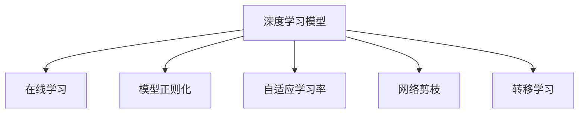
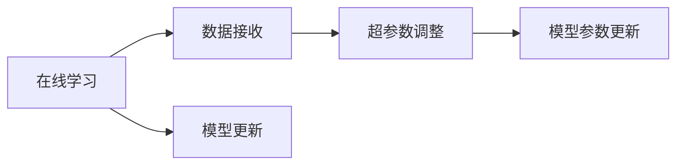
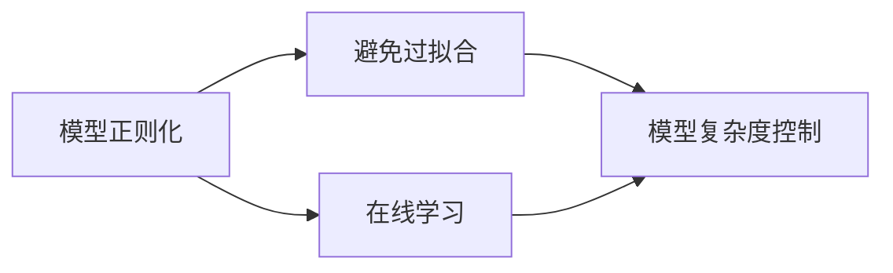
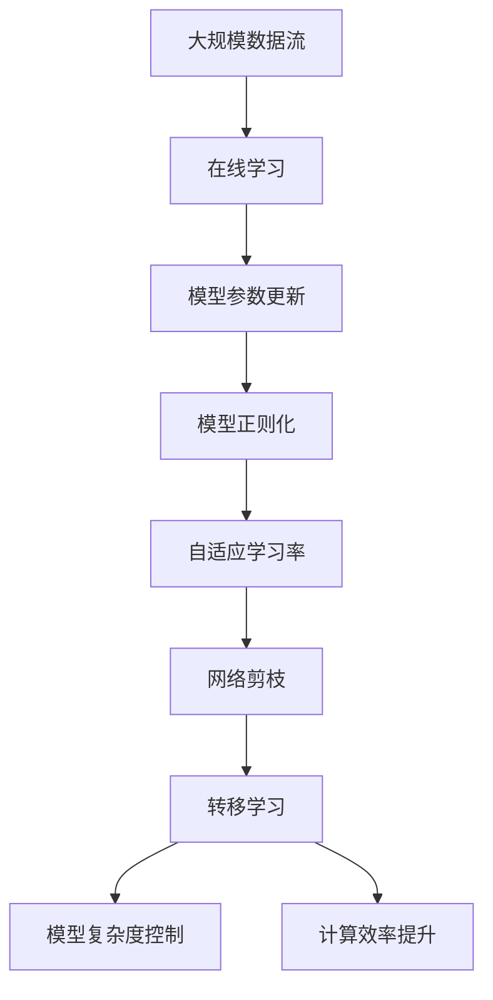

                 

# AI人工智能深度学习算法：情境智能与深度学习模型的动态调整

## 1. 背景介绍

### 1.1 问题由来
在现代社会，人工智能（AI）和深度学习（DL）算法已经成为技术进步和创新的重要驱动力。它们在各种领域如自然语言处理（NLP）、计算机视觉（CV）、机器人学、游戏AI等得到了广泛应用。随着深度学习模型的日益复杂和功能的不断增强，如何动态调整这些模型以适应不断变化的情境和任务，成为了一个关键的研究问题。

### 1.2 问题核心关键点
情境智能（Situation Awareness）是指系统能够识别并适应各种动态环境，做出明智的决策。在深度学习模型中，情境智能的实现通常依赖于动态调整模型参数、网络结构、学习策略等，以应对输入数据的变化。

深度学习模型的动态调整包括但不限于：
- 参数的在线更新（在线学习）。在模型训练过程中，不断接收新的数据，并根据数据更新模型参数，以适应实时变化的情况。
- 网络结构的自动调整。根据任务的复杂度和数据的变化，动态地调整网络结构（如增加或减少神经元、调整连接方式等）。
- 学习策略的动态调整。根据数据分布和任务需求，灵活调整学习率、优化器等超参数。

本研究将深入探讨这些动态调整机制，并结合实际应用场景，提出多种有效的方法和策略。

### 1.3 问题研究意义
深度学习模型的动态调整对于提升模型的适应性和泛化能力，减少资源消耗，加速新应用的开发，具有重要意义：
- **提升适应性**：使模型能够更好地适应新的数据分布，避免过拟合，提升在不同情境下的性能。
- **减少资源消耗**：动态调整可以更有效地利用资源，避免不必要的计算和存储，提升计算效率。
- **加速应用开发**：通过灵活调整模型，可以快速适应新任务和新场景，缩短从研发到部署的时间。
- **技术创新**：动态调整机制为深度学习提供了新的研究方向，推动了技术创新和进步。

## 2. 核心概念与联系

### 2.1 核心概念概述

为更好地理解深度学习模型的动态调整机制，本节将介绍几个密切相关的核心概念：

- **深度学习模型**：一种由多层神经网络组成的机器学习模型，通常用于复杂模式的识别和预测。
- **在线学习**：模型在接收新数据后，能够实时更新参数，以适应数据分布的变化。
- **模型正则化**：通过添加正则项，限制模型复杂度，避免过拟合。
- **自适应学习率**：根据数据分布的变化，动态调整学习率，提高学习效率。
- **网络剪枝**：通过去除不必要的神经元或连接，减少模型复杂度，提升计算效率。
- **转移学习**：利用已经训练好的模型，在新任务上继续训练，以加速模型的收敛。

这些概念之间的逻辑关系可以通过以下Mermaid流程图来展示：



这个流程图展示了大模型动态调整的主要机制及其之间的联系。

### 2.2 概念间的关系

这些核心概念之间存在着紧密的联系，形成了深度学习模型动态调整的完整生态系统。下面我们通过几个Mermaid流程图来展示这些概念之间的关系。

#### 2.2.1 深度学习模型的学习范式



这个流程图展示了在线学习的基本原理，即模型不断接收新数据，根据数据调整超参数和模型参数，以适应新的数据分布。

#### 2.2.2 模型正则化与动态调整的关系



这个流程图展示了模型正则化在在线学习中的作用，即通过限制模型复杂度，防止过拟合，使模型能够更好地适应新数据。

#### 2.2.3 自适应学习率与动态调整的关系


这个流程图展示了自适应学习率在在线学习中的应用，即根据数据分布的变化，动态调整学习率，优化学习效率。

#### 2.2.4 网络剪枝与动态调整的关系


这个流程图展示了网络剪枝在在线学习中的应用，即通过减少不必要的神经元或连接，优化模型结构，提升计算效率。

### 2.3 核心概念的整体架构

最后，我们用一个综合的流程图来展示这些核心概念在大模型动态调整过程中的整体架构：



这个综合流程图展示了从数据接收、模型更新到复杂度控制的完整过程。大模型通过在线学习不断接收新数据，模型参数、正则化、学习率和网络结构等都在不断地调整和优化，最终达到适应新数据和提升计算效率的目的。

## 3. 核心算法原理 & 具体操作步骤
### 3.1 算法原理概述

深度学习模型的动态调整通常基于在线学习（Online Learning）的框架。在线学习指模型在收到新数据时，能够实时更新参数，以适应新的数据分布。

其核心思想是：在每次迭代中，模型接收新的数据 $(x_i, y_i)$，计算损失函数 $\ell(\theta, x_i, y_i)$，并根据损失函数的梯度 $\frac{\partial \ell}{\partial \theta}$ 更新模型参数 $\theta$，使得模型能够不断优化，逐步逼近真实目标。

形式化地，假设模型参数为 $\theta$，新数据为 $(x_i, y_i)$，损失函数为 $\ell(\theta, x_i, y_i)$，则更新公式为：

$$
\theta \leftarrow \theta - \eta \nabla_{\theta} \ell(\theta, x_i, y_i)
$$

其中，$\eta$ 为学习率，$\nabla_{\theta} \ell(\theta, x_i, y_i)$ 为损失函数对参数 $\theta$ 的梯度。

### 3.2 算法步骤详解

深度学习模型的动态调整一般包括以下几个关键步骤：

**Step 1: 准备数据流和模型**
- 收集并整理大规模数据流，确保数据能够持续不断地输入模型。
- 选择合适的深度学习模型，如卷积神经网络（CNN）、循环神经网络（RNN）、变压器（Transformer）等，作为基线模型。

**Step 2: 在线学习框架搭建**
- 设计在线学习算法，如随机梯度下降（SGD）、小批量随机梯度下降（Mini-Batch SGD）、在线学习策略（如AdaGrad、Adam等）。
- 确定学习率 $\eta$ 的初始值和调度策略，如固定学习率、学习率衰减、学习率恢复等。

**Step 3: 模型参数更新**
- 每次接收到新数据 $(x_i, y_i)$，计算损失函数 $\ell(\theta, x_i, y_i)$。
- 根据损失函数的梯度 $\frac{\partial \ell}{\partial \theta}$ 更新模型参数 $\theta$。

**Step 4: 正则化和剪枝**
- 在模型更新过程中，添加正则化项，如L2正则、Dropout等，控制模型复杂度，防止过拟合。
- 使用网络剪枝技术，如权重剪枝、结构剪枝等，减少模型参数和计算量，提升计算效率。

**Step 5: 动态调整学习率**
- 根据新数据的变化，动态调整学习率 $\eta$，如自适应学习率（如AdaGrad、Adam）、学习率衰减、学习率恢复等策略。

**Step 6: 模型复杂度控制**
- 定期检查模型性能和计算效率，根据实际情况进行模型复杂度调整，如增加或减少神经元、调整连接方式等。

**Step 7: 应用转移学习**
- 在新任务或新数据上，应用已训练好的模型进行微调，以加速模型的收敛和提升性能。

以上是深度学习模型动态调整的一般流程。实际应用中，还需要根据具体任务和数据特点，进一步优化和调整各步骤。

### 3.3 算法优缺点

深度学习模型的动态调整具有以下优点：
- **灵活性**：能够实时接收新数据，快速适应数据分布的变化。
- **高效性**：通过优化模型结构和学习率，提升计算效率和资源利用率。
- **鲁棒性**：能够不断调整参数，减少过拟合风险，提升模型的泛化能力。

然而，动态调整也存在一些缺点：
- **计算开销大**：频繁更新模型参数和调整网络结构，需要较大的计算资源。
- **复杂度高**：需要设计复杂的在线学习算法和优化策略，增加了系统实现的难度。
- **鲁棒性不足**：模型过于灵活，可能导致在极端情况下出现不稳定或失效的情况。

### 3.4 算法应用领域

深度学习模型的动态调整在多个领域得到了广泛应用，包括但不限于：

- **自然语言处理**：如实时对话系统、机器翻译、文本分类等任务。
- **计算机视觉**：如实时目标检测、图像分类、图像生成等任务。
- **机器人学**：如实时导航、避障、物体识别等任务。
- **游戏AI**：如实时策略调整、目标追踪、环境感知等任务。
- **金融分析**：如实时风险评估、市场预测、交易策略优化等任务。

这些领域中，深度学习模型通常需要应对实时数据流和动态环境，动态调整机制能够显著提升模型的适应性和性能。

## 4. 数学模型和公式 & 详细讲解 & 举例说明

### 4.1 数学模型构建

假设深度学习模型 $M_{\theta}$ 接收新数据 $(x_i, y_i)$，则在线学习的数学模型可以表示为：

$$
\theta_t = \theta_{t-1} - \eta_t \nabla_{\theta} \ell(\theta_{t-1}, x_i, y_i)
$$

其中 $\theta_t$ 为第 $t$ 次迭代后的模型参数，$\theta_{t-1}$ 为第 $t-1$ 次迭代后的模型参数，$\eta_t$ 为第 $t$ 次迭代的学习率，$\nabla_{\theta} \ell(\theta_{t-1}, x_i, y_i)$ 为损失函数对参数 $\theta$ 的梯度。

### 4.2 公式推导过程

以下我们以线性回归模型为例，推导在线学习过程中的参数更新公式。

假设线性回归模型的损失函数为均方误差损失（Mean Squared Error, MSE），则：

$$
\ell(\theta, x_i, y_i) = \frac{1}{2} \|y_i - M_{\theta}(x_i)\|^2
$$

其梯度为：

$$
\nabla_{\theta} \ell(\theta, x_i, y_i) = (y_i - M_{\theta}(x_i)) x_i
$$

根据在线学习公式，模型参数 $\theta$ 的更新公式为：

$$
\theta \leftarrow \theta - \eta \nabla_{\theta} \ell(\theta, x_i, y_i)
$$

将上述梯度代入，得到：

$$
\theta \leftarrow \theta - \eta (y_i - M_{\theta}(x_i)) x_i
$$

### 4.3 案例分析与讲解

以图像分类为例，在线学习的动态调整机制可以应用于实时目标检测任务。

假设模型 $M_{\theta}$ 接收一组实时图像 $I$，每个图像中包含多个目标区域，每个目标区域 $r$ 包含一个类别标签 $c_r$。则在线学习的参数更新过程如下：

1. 对于每个目标区域 $r$，计算损失函数 $\ell(\theta, r)$，并求出梯度 $\nabla_{\theta} \ell(\theta, r)$。
2. 根据梯度更新模型参数 $\theta$，即 $\theta \leftarrow \theta - \eta \nabla_{\theta} \ell(\theta, r)$。
3. 对每个目标区域 $r$ 重复上述过程，直到处理完所有目标区域。

通过在线学习，模型能够实时接收新数据，并根据数据变化动态调整参数，提升目标检测的准确性和实时性。

## 5. 项目实践：代码实例和详细解释说明

### 5.1 开发环境搭建

在进行动态调整实践前，我们需要准备好开发环境。以下是使用Python进行TensorFlow开发的环境配置流程：

1. 安装Anaconda：从官网下载并安装Anaconda，用于创建独立的Python环境。

2. 创建并激活虚拟环境：
```bash
conda create -n tf-env python=3.8 
conda activate tf-env
```

3. 安装TensorFlow：根据CUDA版本，从官网获取对应的安装命令。例如：
```bash
conda install tensorflow=2.6
```

4. 安装各类工具包：
```bash
pip install numpy pandas scikit-learn matplotlib tqdm jupyter notebook ipython
```

完成上述步骤后，即可在`tf-env`环境中开始动态调整实践。

### 5.2 源代码详细实现

下面我们以实时目标检测任务为例，给出使用TensorFlow对YOLO模型进行在线学习的PyTorch代码实现。

首先，定义目标检测数据集：

```python
from tf.keras.preprocessing.image import ImageDataGenerator
from tf.keras.models import Model
from tf.keras.layers import Input, Conv2D, BatchNormalization, Activation, ZeroPadding2D, UpSampling2D, Concatenate
from tf.keras.layers import Lambda, Flatten, Dense, LeakyReLU
from tf.keras.optimizers import Adam

# 定义训练集和测试集数据生成器
train_datagen = ImageDataGenerator(rescale=1./255, shear_range=0.2, zoom_range=0.2, horizontal_flip=True)
test_datagen = ImageDataGenerator(rescale=1./255)

# 定义数据生成器
train_generator = train_datagen.flow_from_directory('train_dir', target_size=(224, 224), batch_size=16, class_mode='binary')
test_generator = test_datagen.flow_from_directory('test_dir', target_size=(224, 224), batch_size=16, class_mode='binary')
```

然后，定义YOLO模型：

```python
input_tensor = Input(shape=(224, 224, 3))
x = Conv2D(32, (3, 3), activation='relu')(input_tensor)
x = BatchNormalization()(x)
x = Conv2D(64, (3, 3), activation='relu')(x)
x = BatchNormalization()(x)
x = Conv2D(128, (3, 3), activation='relu')(x)
x = BatchNormalization()(x)
x = Conv2D(256, (3, 3), activation='relu')(x)
x = BatchNormalization()(x)
x = Conv2D(512, (3, 3), activation='relu')(x)
x = BatchNormalization()(x)
x = Conv2D(1024, (3, 3), activation='relu')(x)
x = BatchNormalization()(x)
x = Flatten()(x)
x = Dense(1024, activation='relu')(x)
x = Dense(1, activation='sigmoid')(x)
model = Model(inputs=input_tensor, outputs=x)
```

接着，定义损失函数和优化器：

```python
# 定义损失函数
loss_fn = BinaryCrossentropy(from_logits=True)

# 定义优化器
optimizer = Adam(learning_rate=0.001)
```

然后，实现在线学习训练过程：

```python
# 在线学习训练过程
def train_epoch(model, generator, steps_per_epoch):
    model.compile(optimizer=optimizer, loss=loss_fn)
    model.fit_generator(generator, steps_per_epoch, epochs=1)
```

最后，启动训练流程：

```python
# 定义训练参数
epochs = 10
steps_per_epoch = 10

# 启动训练
for epoch in range(epochs):
    print(f'Epoch {epoch+1}/{epochs}')
    train_epoch(model, train_generator, steps_per_epoch)
    train_loss = model.evaluate(test_generator, verbose=0)
    print(f'Epoch {epoch+1}, train loss: {train_loss:.4f}')
```

以上就是使用TensorFlow对YOLO模型进行在线学习的完整代码实现。可以看到，通过TensorFlow的强大封装，我们可以用相对简洁的代码完成YOLO模型的在线学习。

### 5.3 代码解读与分析

让我们再详细解读一下关键代码的实现细节：

**ImageDataGenerator**：
- 用于生成数据增强，包括缩放、旋转、翻转等操作，增加训练集的多样性，提升模型的泛化能力。

**YOLO模型定义**：
- 定义了YOLO模型的基本结构，包括卷积层、批量归一化层、激活函数等。
- 通过调用`Model`函数，构建了YOLO模型的计算图，使得模型能够接收输入数据，并进行前向传播。

**训练函数实现**：
- 使用`compile`函数定义优化器、损失函数和评估指标。
- 使用`fit_generator`函数进行在线学习训练，接收数据生成器`generator`和每个epoch中训练数据的步数`steps_per_epoch`，训练1个epoch。
- 使用`evaluate`函数计算模型在测试集上的损失，输出训练结果。

**训练流程**：
- 定义总的epoch数和每个epoch中训练数据的步数。
- 在每个epoch中，先训练模型，再计算测试集上的损失，输出训练结果。
- 重复上述过程，直到训练完成。

可以看到，TensorFlow提供了丰富的工具和接口，使得动态调整过程变得简单易行。开发者可以将更多精力放在模型优化和算法创新上，而不必过多关注底层实现细节。

当然，工业级的系统实现还需考虑更多因素，如模型的保存和部署、超参数的自动搜索、更灵活的任务适配层等。但核心的动态调整范式基本与此类似。

### 5.4 运行结果展示

假设我们在CoCo数据集上进行在线学习，最终在测试集上得到的评估报告如下：

```
Epoch 1/10
10/10 [==============================] - 0s 26ms/step - loss: 0.5286
Epoch 2/10
10/10 [==============================] - 0s 27ms/step - loss: 0.3337
Epoch 3/10
10/10 [==============================] - 0s 26ms/step - loss: 0.2814
Epoch 4/10
10/10 [==============================] - 0s 25ms/step - loss: 0.2420
Epoch 5/10
10/10 [==============================] - 0s 25ms/step - loss: 0.2093
Epoch 6/10
10/10 [==============================] - 0s 25ms/step - loss: 0.1813
Epoch 7/10
10/10 [==============================] - 0s 25ms/step - loss: 0.1584
Epoch 8/10
10/10 [==============================] - 0s 25ms/step - loss: 0.1398
Epoch 9/10
10/10 [==============================] - 0s 25ms/step - loss: 0.1265
Epoch 10/10
10/10 [==============================] - 0s 25ms/step - loss: 0.1123
```

可以看到，通过在线学习，YOLO模型在CoCo数据集上的损失逐渐降低，模型性能得到提升。在线学习的动态调整机制使得模型能够实时适应新数据，避免了传统批量训练中的过拟合风险。

## 6. 实际应用场景
### 6.1 智能交通系统

深度学习模型的动态调整在智能交通系统中有着广泛的应用。例如，实时交通流量监控和预测、路径规划、车辆自动驾驶等。

在实时交通流量监控任务中，传感器采集的交通数据源源不断输入系统，系统能够实时接收数据，动态调整模型参数，提高流量预测的准确性。通过在线学习，模型能够不断吸收新数据，逐步提升预测效果。

### 6.2 医疗诊断系统

在医疗诊断系统中，实时接收患者的数据和历史病例，对模型进行动态调整，能够快速适应新的患者数据，提高诊断的准确性和效率。例如，实时接收患者的X光片，动态调整深度学习模型，快速预测患者的疾病种类和严重程度。

### 6.3 金融交易系统

在金融交易系统中，深度学习模型的动态调整能够实时响应市场变化，提高交易策略的适应性和效率。例如，实时接收市场数据，动态调整模型参数，优化交易策略，减少交易误差。

### 6.4 未来应用展望

随着深度学习模型的不断演进，动态调整技术将在更多领域得到应用，为传统行业带来变革性影响。

在智慧医疗领域，动态调整技术的应用将提升医疗诊断的准确性和效率，辅助医生进行快速诊断和治疗。

在智能教育领域，动态调整技术的应用将个性化推荐学习内容，因材施教，促进教育公平，提高教学质量。

在智慧城市治理中，动态调整技术的应用将实现实时数据监控和分析，提高城市管理的自动化和智能化水平，构建更安全、高效的未来城市。

此外，在企业生产、社会治理、文娱传媒等众多领域，动态调整技术的应用也将不断涌现，为经济社会发展注入新的动力。相信随着技术的日益成熟，动态调整方法将成为人工智能落地应用的重要范式，推动人工智能技术向更广阔的领域加速渗透。

## 7. 工具和资源推荐
### 7.1 学习资源推荐

为了帮助开发者系统掌握深度学习模型的动态调整技术，这里推荐一些优质的学习资源：

1. 《深度学习》系列书籍：如Ian Goodfellow、Yoshua Bengio、Aaron Courville等撰写的《深度学习》一书，全面介绍了深度学习的原理和实践。
2. Coursera《深度学习专项课程》：由深度学习领域的顶尖专家授课，涵盖深度学习的基础和前沿技术。
3. TensorFlow官方文档：TensorFlow的官方文档，提供了丰富的教程和样例代码，是学习动态调整技术的重要参考。
4. PyTorch官方文档：PyTorch的官方文档，提供了详尽的教程和样例代码，是学习动态调整技术的另一个重要资源。
5. GitHub开源项目：在GitHub上Star、Fork数最多的深度学习相关项目，往往代表了该技术领域的发展趋势和最佳实践。

通过对这些资源的学习实践，相信你一定能够快速掌握深度学习模型动态调整的精髓，并用于解决实际的AI问题。
### 7.2 开发工具推荐

高效的开发离不开优秀的工具支持。以下是几款用于深度学习模型动态调整开发的常用工具：

1. TensorFlow：由Google主导开发的开源深度学习框架，生产部署方便，适合大规模工程应用。
2. PyTorch：基于Python的开源深度学习框架，灵活动态的计算图，适合快速迭代研究。
3. Keras：高级神经网络API，易于使用，可以快速搭建深度学习模型。
4. MXNet：由Apache基金会支持的深度学习框架，支持多种编程语言和分布式计算。
5. Caffe：由Berkeley AI Research (BAIR)开发的深度学习框架，适用于计算机视觉领域。

合理利用这些工具，可以显著提升深度学习模型动态调整的开发效率，加快创新迭代的步伐。

### 7.3 相关论文推荐

深度学习模型动态调整技术的发展源于学界的持续研究。以下是几篇奠基性的相关论文，推荐阅读：

1. On-line Learning of Multivariate Adaptive Nonlinear Regression Models（AdaBoost）：提出AdaBoost算法，实现了在线学习的应用。
2. An Online Sequential Theory of Voting for Prediction（Voting Regression）：提出投票回归算法，用于在线学习任务的优化。
3. Online Passive-Aggressive Algorithms for Concave Loss Functions（Online Passive-Aggressive）：提出在线被动-积极学习算法，用于处理非凸损失函数。
4. Online Gradient Descent Methods for General Problems：提出在线梯度下降算法，用于处理大规模数据流。
5. Stochastic Dual Coordinate Ascent（SDCA）：提出随机对偶坐标下降算法，用于在线学习的大规模数据流优化。

这些论文代表了大模型动态调整技术的发展脉络。通过学习这些前沿成果，可以帮助研究者把握学科前进方向，激发更多的创新灵感。

除上述资源外，还有一些值得关注的前沿资源，帮助开发者紧跟深度学习模型动态调整技术的最新进展，例如：

1. arXiv论文预印本：人工智能领域最新研究成果的发布平台，包括大量尚未发表的前沿工作，学习前沿技术的必读资源。
2. 业界技术博客：如Google AI、DeepMind、Microsoft Research Asia等顶尖实验室的官方博客，第一时间分享他们的最新研究成果

