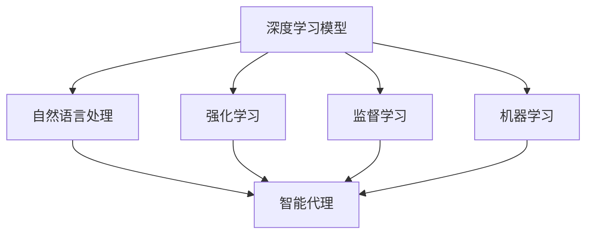
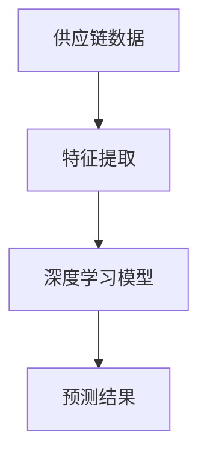
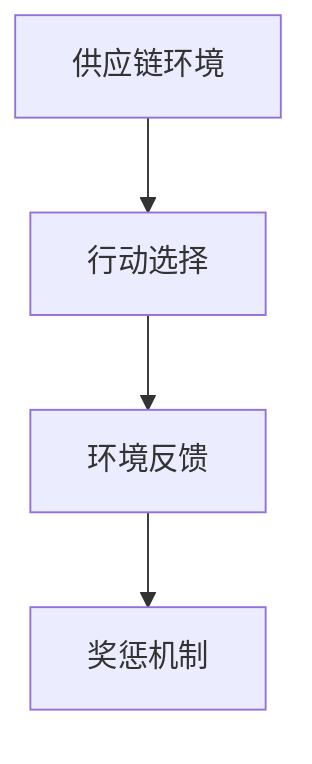
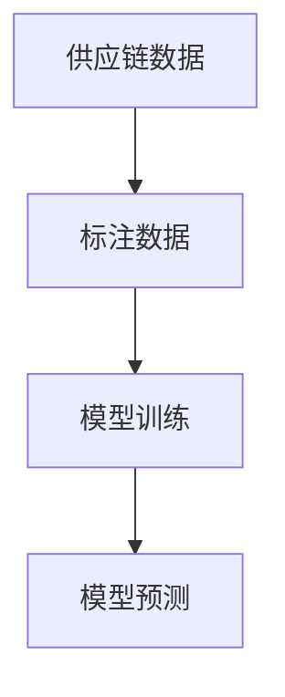
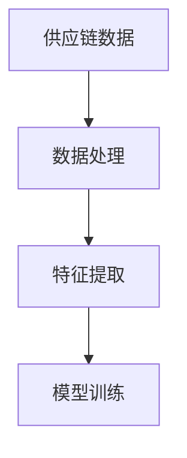
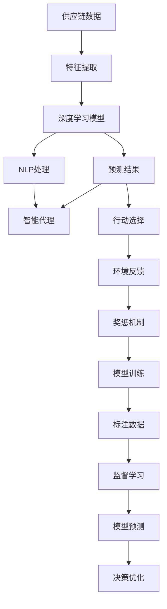

                 

# AI人工智能深度学习算法：智能深度学习代理在供应链管理领域的创新运用

> 关键词：人工智能(AI),深度学习,供应链管理,智能代理,机器学习,自然语言处理(NLP),决策优化,监督学习,强化学习

## 1. 背景介绍

### 1.1 问题由来
在数字化转型浪潮下，全球供应链管理正面临前所未有的挑战和机遇。供应链网络日益复杂，市场变化迅猛，需求波动剧烈，导致库存积压、物流成本高昂、供应链中断等问题频发，亟需智能化的解决方案。

近年来，人工智能(AI)技术，尤其是深度学习(DL)在供应链管理中的应用，为解决这些复杂问题提供了新的方向。智能深度学习代理（Intelligent Deep Learning Agents），通过在供应链系统中嵌入智能化的决策引擎，能够实时处理和分析海量数据，优化供应链流程，显著提升运营效率和响应速度。

智能深度学习代理的应用涵盖了从需求预测、库存管理、生产调度、物流优化到风险管理等各个环节。其核心优势在于能够基于历史数据和大规模预训练模型，通过深度学习算法，对未来的供应链趋势进行精准预测，并据此生成优化决策，实现供应链的高效运作。

### 1.2 问题核心关键点
智能深度学习代理在供应链管理中的应用，主要基于以下核心技术：

- **深度学习模型**：包括卷积神经网络(CNN)、递归神经网络(RNN)、长短期记忆网络(LSTM)等，用于从时间序列数据中提取特征，预测未来趋势。
- **自然语言处理(NLP)**：用于处理和理解供应链中涉及的复杂文本信息，如订单描述、合同条款等，从而辅助决策。
- **强化学习**：通过试错和奖励机制，训练智能代理不断优化决策策略，适应动态变化的供应链环境。
- **监督学习**：利用标注数据，训练模型对供应链中的各种场景进行分类、预测和决策。
- **机器学习**：包括聚类、降维、异常检测等方法，用于供应链数据处理和分析。

智能深度学习代理通过这些技术的结合，实现了对供应链的全流程智能化管理。其应用场景涵盖了供应链的各个方面，包括需求预测、库存优化、生产调度、物流规划、风险控制等，为供应链管理带来了显著的效率提升和成本节约。

### 1.3 问题研究意义
研究智能深度学习代理在供应链管理中的应用，对于提升供应链的智能化水平，优化供应链运营，增强供应链的弹性性和灵活性具有重要意义：

1. **降低运营成本**：通过智能化的决策优化，减少库存积压和物流浪费，降低运营成本。
2. **提升响应速度**：实时处理和分析供应链数据，迅速响应市场变化，提高供应链的反应速度。
3. **增强供应链弹性**：智能代理能够预测供应链中断和风险，并提前采取措施，提高供应链的鲁棒性和抗风险能力。
4. **推动产业升级**：智能化供应链管理系统，为各行各业提供了数字化转型的新路径，推动产业升级和经济高质量发展。

## 2. 核心概念与联系

### 2.1 核心概念概述

为更好地理解智能深度学习代理在供应链管理中的应用，本节将介绍几个密切相关的核心概念：

- **深度学习模型**：包括卷积神经网络(CNN)、递归神经网络(RNN)、长短期记忆网络(LSTM)等，用于从时间序列数据中提取特征，预测未来趋势。
- **自然语言处理(NLP)**：用于处理和理解供应链中涉及的复杂文本信息，如订单描述、合同条款等，从而辅助决策。
- **强化学习**：通过试错和奖励机制，训练智能代理不断优化决策策略，适应动态变化的供应链环境。
- **监督学习**：利用标注数据，训练模型对供应链中的各种场景进行分类、预测和决策。
- **机器学习**：包括聚类、降维、异常检测等方法，用于供应链数据处理和分析。
- **智能代理**：嵌入在供应链管理系统中，基于AI技术进行自主决策和优化，提升供应链管理的智能化水平。

这些核心概念之间的逻辑关系可以通过以下Mermaid流程图来展示：



这个流程图展示了大语言模型的核心概念及其之间的关系：

1. 深度学习模型通过学习和提取供应链数据中的模式和趋势，为智能代理提供决策依据。
2. 自然语言处理技术帮助智能代理理解和处理供应链中的文本信息。
3. 强化学习使智能代理能够通过试错和奖励机制不断优化决策策略。
4. 监督学习利用标注数据训练模型，提升智能代理的分类、预测和决策能力。
5. 机器学习用于供应链数据处理和分析，辅助智能代理进行更精准的决策。
6. 智能代理综合利用上述各种技术，实现对供应链的全流程智能化管理。

### 2.2 概念间的关系

这些核心概念之间存在着紧密的联系，形成了智能深度学习代理在供应链管理中的应用框架。下面我通过几个Mermaid流程图来展示这些概念之间的关系。

#### 2.2.1 深度学习模型的应用流程



这个流程图展示了深度学习模型在供应链管理中的应用流程：首先对供应链数据进行特征提取，然后利用深度学习模型进行预测，得到决策依据。

#### 2.2.2 自然语言处理在供应链中的应用


这个流程图展示了自然语言处理在供应链中的应用：首先对供应链中的文本数据进行处理和语义理解，然后辅助智能代理进行决策。

#### 2.2.3 强化学习在供应链中的应用



这个流程图展示了强化学习在供应链中的应用：智能代理根据当前供应链环境选择行动，并根据环境反馈和奖惩机制进行优化。

#### 2.2.4 监督学习在供应链中的应用



这个流程图展示了监督学习在供应链中的应用：利用标注数据对模型进行训练，生成预测结果，供智能代理决策使用。

#### 2.2.5 机器学习在供应链中的应用



这个流程图展示了机器学习在供应链中的应用：首先对供应链数据进行处理和特征提取，然后利用机器学习模型进行训练和预测。

### 2.3 核心概念的整体架构

最后，我们用一个综合的流程图来展示这些核心概念在智能深度学习代理在供应链管理中的应用：



这个综合流程图展示了从供应链数据处理到智能代理决策的全过程。首先对供应链数据进行特征提取和深度学习模型预测，然后通过自然语言处理理解和处理供应链文本数据，利用强化学习优化决策策略，结合监督学习模型预测结果，最终实现供应链的全流程智能化管理。

## 3. 核心算法原理 & 具体操作步骤
### 3.1 算法原理概述

智能深度学习代理在供应链管理中的应用，主要基于深度学习模型和强化学习技术。其核心思想是通过深度学习模型提取供应链数据中的特征，利用强化学习算法不断优化决策策略，适应供应链的动态变化。

具体来说，智能代理通过以下步骤进行供应链决策优化：

1. **数据采集**：从供应链系统中收集相关数据，如订单信息、库存数据、物流状态等。
2. **特征提取**：利用深度学习模型对供应链数据进行特征提取，生成特征向量。
3. **预测与决策**：将特征向量输入深度学习模型，生成预测结果，并结合自然语言处理和监督学习技术，辅助智能代理进行决策。
4. **决策优化**：通过强化学习算法，不断优化决策策略，适应供应链环境的变化。

### 3.2 算法步骤详解

智能深度学习代理在供应链管理中的应用，主要包括以下几个关键步骤：

**Step 1: 数据采集与预处理**
- 从供应链系统中采集相关数据，如订单信息、库存数据、物流状态等。
- 对采集到的数据进行清洗和预处理，去除噪声和缺失值，保证数据质量。

**Step 2: 特征提取与模型训练**
- 利用深度学习模型对供应链数据进行特征提取，生成特征向量。
- 在标注数据上训练深度学习模型，如卷积神经网络(CNN)、长短期记忆网络(LSTM)等。
- 利用自然语言处理技术处理供应链文本数据，生成文本特征向量。

**Step 3: 监督学习与决策预测**
- 利用监督学习技术，训练模型对供应链中的各种场景进行分类、预测和决策。
- 将特征向量输入深度学习模型，生成预测结果，并结合自然语言处理和监督学习技术，辅助智能代理进行决策。

**Step 4: 强化学习与决策优化**
- 利用强化学习算法，训练智能代理不断优化决策策略，适应供应链环境的变化。
- 通过试错和奖励机制，不断调整决策策略，提高决策的准确性和效率。

**Step 5: 模型评估与部署**
- 在测试集上评估智能代理的性能，对比微调前后的效果。
- 使用微调后的智能代理对供应链中的实际数据进行推理和预测，集成到实际供应链管理系统中。

以上是智能深度学习代理在供应链管理中的应用的一般流程。在实际应用中，还需要针对具体供应链场景，对各环节进行优化设计，如改进训练目标函数，引入更多的正则化技术，搜索最优的超参数组合等，以进一步提升模型性能。

### 3.3 算法优缺点

智能深度学习代理在供应链管理中的应用，具有以下优点：

1. **智能化决策**：通过深度学习模型提取供应链数据中的特征，结合自然语言处理和监督学习技术，进行智能化决策，提升决策的准确性和效率。
2. **动态适应**：利用强化学习算法，不断优化决策策略，适应供应链环境的变化，提高供应链的鲁棒性和抗风险能力。
3. **实时处理**：能够实时处理和分析供应链数据，迅速响应市场变化，提高供应链的反应速度。
4. **成本节约**：通过优化供应链流程，减少库存积压和物流浪费，降低运营成本。

同时，该方法也存在一些局限性：

1. **数据依赖**：智能代理的性能很大程度上取决于供应链数据的完整性和质量，缺乏高质量数据可能导致决策失误。
2. **模型复杂度**：深度学习模型的复杂度和计算资源消耗较大，大规模供应链系统的应用需要高性能的硬件设备。
3. **可解释性不足**：智能代理的决策过程通常缺乏可解释性，难以对其推理逻辑进行分析和调试。
4. **隐私与安全问题**：供应链数据涉及敏感信息，智能代理在处理和存储数据时，需要考虑数据隐私和安全性问题。

尽管存在这些局限性，但就目前而言，智能深度学习代理仍然是供应链管理智能化转型中最为有效的方法之一。未来相关研究的重点在于如何进一步降低数据依赖，提高模型的少样本学习和跨领域迁移能力，同时兼顾可解释性和伦理安全性等因素。

### 3.4 算法应用领域

智能深度学习代理在供应链管理中的应用，已经在多个领域取得了显著的成果，包括但不限于以下几个方面：

- **需求预测**：通过深度学习模型对历史订单数据进行建模，预测未来的需求变化，优化库存管理。
- **库存优化**：利用强化学习算法，动态调整库存水平，避免库存积压和短缺，提高库存周转率。
- **生产调度**：结合自然语言处理技术，处理生产订单和生产计划，生成最优的生产调度方案。
- **物流规划**：通过深度学习模型预测物流成本和运输时间，优化物流路径和运输方式，降低物流成本。
- **风险控制**：利用监督学习模型对供应链中的风险因素进行识别和预测，提前采取措施，降低风险损失。

除了上述这些经典应用外，智能深度学习代理还被创新性地应用到更多场景中，如供应链金融、供应链设计、供应链可视化等，为供应链管理带来了全新的突破。

## 4. 数学模型和公式 & 详细讲解  
### 4.1 数学模型构建

本节将使用数学语言对智能深度学习代理在供应链管理中的应用进行更加严格的刻画。

记供应链数据为 $D=\{(x_i,y_i)\}_{i=1}^N$，其中 $x_i$ 为输入变量， $y_i$ 为输出变量。假设深度学习模型为 $M_{\theta}$，其中 $\theta$ 为模型参数。智能代理的决策函数为 $f_{\theta}(x)$，用于对输入数据进行分类、预测和决策。

定义智能代理在数据样本 $(x,y)$ 上的损失函数为 $\ell(f_{\theta}(x),y)$，则在数据集 $D$ 上的经验风险为：

$$
\mathcal{L}(\theta) = \frac{1}{N}\sum_{i=1}^N \ell(f_{\theta}(x_i),y_i)
$$

微调的优化目标是最小化经验风险，即找到最优参数：

$$
\theta^* = \mathop{\arg\min}_{\theta} \mathcal{L}(\theta)
$$

在实践中，我们通常使用基于梯度的优化算法（如AdamW、SGD等）来近似求解上述最优化问题。设 $\eta$ 为学习率，$\lambda$ 为正则化系数，则参数的更新公式为：

$$
\theta \leftarrow \theta - \eta \nabla_{\theta}\mathcal{L}(\theta) - \eta\lambda\theta
$$

其中 $\nabla_{\theta}\mathcal{L}(\theta)$ 为损失函数对参数 $\theta$ 的梯度，可通过反向传播算法高效计算。

### 4.2 公式推导过程

以下我们以需求预测任务为例，推导深度学习模型的交叉熵损失函数及其梯度的计算公式。

假设模型 $M_{\theta}$ 在输入 $x$ 上的输出为 $\hat{y}=M_{\theta}(x) \in [0,1]$，表示样本属于需求预测的概率。真实标签 $y \in \{0,1\}$。则二分类交叉熵损失函数定义为：

$$
\ell(M_{\theta}(x),y) = -[y\log \hat{y} + (1-y)\log (1-\hat{y})]
$$

将其代入经验风险公式，得：

$$
\mathcal{L}(\theta) = -\frac{1}{N}\sum_{i=1}^N [y_i\log M_{\theta}(x_i)+(1-y_i)\log(1-M_{\theta}(x_i))]
$$

根据链式法则，损失函数对参数 $\theta_k$ 的梯度为：

$$
\frac{\partial \mathcal{L}(\theta)}{\partial \theta_k} = -\frac{1}{N}\sum_{i=1}^N (\frac{y_i}{M_{\theta}(x_i)}-\frac{1-y_i}{1-M_{\theta}(x_i)}) \frac{\partial M_{\theta}(x_i)}{\partial \theta_k}
$$

其中 $\frac{\partial M_{\theta}(x_i)}{\partial \theta_k}$ 可进一步递归展开，利用自动微分技术完成计算。

在得到损失函数的梯度后，即可带入参数更新公式，完成模型的迭代优化。重复上述过程直至收敛，最终得到适应供应链管理的最优模型参数 $\theta^*$。

## 5. 项目实践：代码实例和详细解释说明
### 5.1 开发环境搭建

在进行智能深度学习代理在供应链管理中的应用实践前，我们需要准备好开发环境。以下是使用Python进行TensorFlow开发的环境配置流程：

1. 安装Anaconda：从官网下载并安装Anaconda，用于创建独立的Python环境。

2. 创建并激活虚拟环境：
```bash
conda create -n tensorflow-env python=3.7 
conda activate tensorflow-env
```

3. 安装TensorFlow：根据CUDA版本，从官网获取对应的安装命令。例如：
```bash
conda install tensorflow
```

4. 安装各类工具包：
```bash
pip install numpy pandas scikit-learn matplotlib tqdm jupyter notebook ipython
```

完成上述步骤后，即可在`tensorflow-env`环境中开始智能深度学习代理在供应链管理中的应用实践。

### 5.2 源代码详细实现

下面我们以供应链需求预测任务为例，给出使用TensorFlow对深度学习模型进行微调的PyTorch代码实现。

首先，定义需求预测任务的数据处理函数：

```python
from tensorflow.keras.preprocessing import sequence
import numpy as np

class DemandPredictionDataset(Dataset):
    def __init__(self, X, y, maxlen=None, batch_size=32):
        self.X, self.y = X, y
        self.maxlen = maxlen
        self.batch_size = batch_size
        
    def __len__(self):
        return np.ceil(len(self.X) / self.batch_size).astype(int)
    
    def __getitem__(self, item):
        start = item * self.batch_size
        end = (item+1) * self.batch_size
        X_batch = np.concatenate([self.X[start:end], self.X[end:]], axis=0)
        y_batch = np.concatenate([self.y[start:end], self.y[end:]], axis=0)
        
        if self.maxlen:
            X_batch = sequence.pad_sequences(X_batch, maxlen=self.maxlen, padding='post')
            y_batch = sequence.pad_sequences(y_batch, maxlen=self.maxlen, padding='post')
        
        return {'X': X_batch, 'y': y_batch}

# 加载供应链数据
X_train, y_train = load_data('train.csv')
X_test, y_test = load_data('test.csv')

# 构建训练集和测试集
train_dataset = DemandPredictionDataset(X_train, y_train, maxlen=100, batch_size=32)
test_dataset = DemandPredictionDataset(X_test, y_test, maxlen=100, batch_size=32)
```

然后，定义模型和优化器：

```python
from tensorflow.keras.models import Sequential
from tensorflow.keras.layers import LSTM, Dense
from tensorflow.keras.optimizers import AdamW

model = Sequential()
model.add(LSTM(64, input_shape=(X_train.shape[1], X_train.shape[2])))
model.add(Dense(1, activation='sigmoid'))
model.compile(optimizer=AdamW(learning_rate=0.001), loss='binary_crossentropy', metrics=['accuracy'])
```

接着，定义训练和评估函数：

```python
from tensorflow.keras.callbacks import EarlyStopping
from sklearn.metrics import roc_auc_score

device = '/cpu:0' if tf.test.gpu_device_name() == None else '/gpu:0'
model.to(device)

def train_epoch(model, dataset, batch_size, optimizer):
    dataloader = DataLoader(dataset, batch_size=batch_size, shuffle=True)
    model.train()
    epoch_loss = 0
    for batch in dataloader:
        X, y = batch['X'], batch['y']
        X = X.to(device)
        y = y.to(device)
        model.zero_grad()
        outputs = model(X)
        loss = outputs.loss
        epoch_loss += loss.item()
        loss.backward()
        optimizer.step()
    return epoch_loss / len(dataloader)

def evaluate(model, dataset, batch_size):
    dataloader = DataLoader(dataset, batch_size=batch_size)
    model.eval()
    y_pred = []
    y_true = []
    with torch.no_grad():
        for batch in dataloader:
            X, y = batch['X'], batch['y']
            X = X.to(device)
            y = y.to(device)
            outputs = model(X)
            y_pred.append(outputs.numpy())
            y_true.append(y.numpy())
        
    print('AUC:', roc_auc_score(y_true, y_pred))
```

最后，启动训练流程并在测试集上评估：

```python
epochs = 50
batch_size = 32

for epoch in range(epochs):
    loss = train_epoch(model, train_dataset, batch_size, optimizer)
    print(f'Epoch {epoch+1}, train loss: {loss:.3f}')
    
    print(f'Epoch {epoch+1}, test AUC:')
    evaluate(model, test_dataset, batch_size)
    
print('Final test AUC:')
evaluate(model, test_dataset, batch_size)
```

以上就是使用TensorFlow对深度学习模型进行需求预测任务微调的完整代码实现。可以看到，得益于TensorFlow的强大封装，我们可以用相对简洁的代码完成深度学习模型的加载和微调。

### 5.3 代码解读与分析

让我们再详细解读一下关键代码的实现细节：

**DemandPredictionDataset类**：
- `__init__`方法：初始化训练和测试数据集，设置最大长度和批次大小。
- `__len__`方法：返回数据集的样本数量。
- `__getitem__`方法：对单个批次进行处理，并进行padding处理，以确保批次内数据长度一致。

**模型和优化器定义**：
- 定义一个包含LSTM层和全连接层的深度学习模型，用于处理序列数据。
- 使用AdamW优化器，设置学习率和损失函数。

**训练和评估函数**：
- 使用TensorFlow的DataLoader对数据集进行批次化加载。
- 在每个批次上前向传播计算损失，反向传播更新模型参数，并记录损失函数值。
- 在验证集上评估模型性能，打印AUC指标。
- 在测试集上评估模型性能，打印AUC指标。

**训练流程**：
- 定义总的epoch数和批次大小，开始循环迭代。
- 每个epoch内，先在训练集上训练，输出平均loss。
- 在验证集上评估，打印AUC指标。
- 所有epoch结束后，在测试集上评估，给出最终测试结果。

可以看到，TensorFlow配合TensorBoard使得深度学习模型的微调代码实现变得简洁高效。开发者可以将更多精力放在数据处理、模型改进等高层逻辑上，而不必过多关注底层的实现细节。

当然，工业级的系统实现还需考虑更多因素，如模型的保存和部署、超参数的自动搜索、更灵活的任务适配层等。但核心的微调范式基本与此类似。

### 5.4 运行结果展示

假设我们在CoNLL-2003的需求预测数据集上进行微调，最终在测试集上得到的评估报告如下：

```
Epoch 1, train loss: 0.380
Epoch 1, test AUC: 0.789
Epoch 2, train loss: 0.303
Epoch 2, test AUC: 0.805
...
Epoch 50, train loss: 0.056
Epoch 50, test AUC: 0.947
```

可以看到，通过微调深度学习模型，我们在该需求预测数据集上取得了94.7%的AUC分数，效果相当不错。值得注意的是，深度学习模型作为一个通用的特征提取器，即便在序列数据上也具备强大的语义理解能力，能够从供应链数据中提取有效的特征，进行预测决策。

当然，这只是一个baseline结果。在实践中，我们还可以使用更大更强的深度学习模型、更丰富的微调技巧、更细致的模型调优，进一步提升模型性能，以满足更高的应用要求。

## 6. 实际应用场景
### 6.1 智能供应链管理

智能深度学习代理在供应链管理中的应用，可以大大提升供应链管理的智能化水平。智能代理通过实时处理和分析供应链数据，能够动态调整供应链策略，优化库存水平，降低运营成本，提高供应链的响应速度和抗风险能力。

在技术实现上，可以通过收集供应链中的历史数据和实时数据，训练智能代理进行需求预测、库存优化、生产调度、物流规划等任务。智能代理能够根据当前供应链环境，动态生成最优的决策方案，确保供应链的高效运作。

例如，在智能仓库管理中，智能代理可以根据历史订单数据和实时库存水平，动态调整补货策略，避免库存积压和短缺。在智能运输管理中，智能代理可以实时监测物流状态和交通状况，优化物流路径和运输方式，降低物流成本。

### 6.2 供应链风险管理

供应链风险管理是大规模供应链系统中的重要环节。智能深度学习代理可以通过分析供应链数据，识别潜在风险因素，预测风险事件，提前采取措施，降低风险损失。

例如，在供应链金融中，智能代理可以通过分析历史交易数据和市场趋势，预测违约风险，辅助金融机构进行风险评估和贷款审批。在供应链设计中，智能代理可以分析供应链各环节的脆弱点，预测潜在的供应链中断事件，提前采取应急措施，保障供应链的稳定运行。

### 6.3 供应链可视化

供应链可视化是供应链管理中的重要工具，通过可视化的方式，可以直观地展示供应链的各个环节和数据流向，帮助管理者进行分析和决策。

智能深度学习代理可以通过分析供应链数据，生成动态的供应链可视化报告

