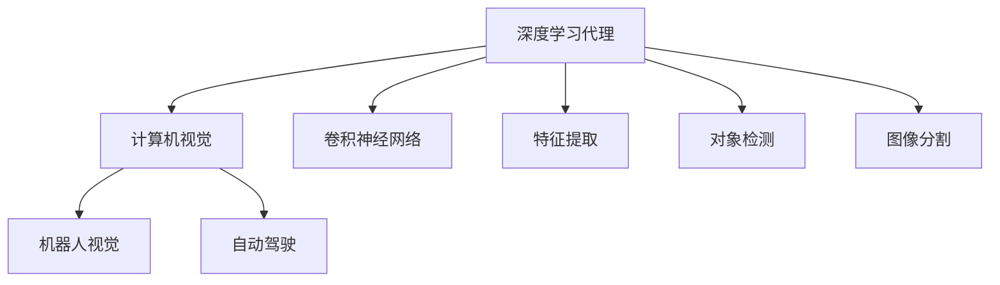
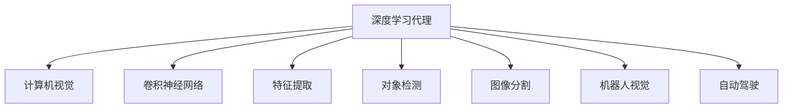

                 

# AI人工智能深度学习算法：计算机视觉在深度学习代理中的集成

> 关键词：计算机视觉,深度学习,代理,集成,自然语言处理(NLP),计算机视觉(CV),机器人视觉,自动驾驶,视觉识别

## 1. 背景介绍

### 1.1 问题由来
深度学习在过去十年中取得了突破性的进展，特别是随着深度神经网络（DNN）和卷积神经网络（CNN）在计算机视觉（CV）领域的应用，实现了图像分类、目标检测、图像分割等任务的卓越表现。尽管如此，深度学习模型的开发和部署涉及大量的计算资源和专业知识，这使得它们在广泛的应用场景中面临挑战。为了克服这些问题，深度学习代理（DL Agents）的概念被提出，通过集成多种算法和模型，提供更灵活、更高效的解决方案。

### 1.2 问题核心关键点
深度学习代理通过将多种算法和模型集成到一个统一的框架中，使开发者能够更轻松地实现复杂的功能。这种集成方法不仅可以提高模型的效率和精度，还可以在资源受限的环境中实现高性能的视觉任务处理。

计算机视觉在深度学习代理中的应用，可以通过以下方面来理解：

1. **视觉输入**：代理使用计算机视觉技术处理输入数据，如从图像中提取特征、识别对象等。
2. **决策支持**：代理集成计算机视觉模型以提供更准确的决策支持。
3. **控制策略**：代理使用视觉反馈来优化其控制策略，如在自动驾驶、机器人导航中，通过视觉输入调整路径。
4. **跨模态融合**：代理能够同时处理视觉和文本数据，实现跨模态信息融合。

### 1.3 问题研究意义
研究计算机视觉在深度学习代理中的集成，对于提升代理的视觉处理能力、优化代理性能、加速开发进程、提升系统的可扩展性和鲁棒性具有重要意义。它不仅能够提高深度学习代理的效率和效果，还能为更广泛的应用场景提供解决方案，如工业自动化、医疗诊断、无人驾驶、社交媒体分析等。

## 2. 核心概念与联系

### 2.1 核心概念概述

为更好地理解计算机视觉在深度学习代理中的应用，本节将介绍几个核心概念：

- **深度学习代理（DL Agents）**：一种集成多种算法和模型的智能系统，能够自主学习和执行任务。
- **计算机视觉（Computer Vision, CV）**：通过算法使计算机“看”和理解图像的能力。
- **卷积神经网络（Convolutional Neural Network, CNN）**：一种用于图像处理的深度神经网络，通过卷积操作提取特征。
- **特征提取**：从原始数据中提取出有用的信息，用于后续处理。
- **对象检测**：识别图像中的对象位置及其类别。
- **图像分割**：将图像划分为不同的区域，并对每个区域进行分类。
- **机器人视觉**：将计算机视觉技术应用于机器人导航、物体抓取等任务中。
- **自动驾驶**：集成计算机视觉技术以实现车辆的自主驾驶。

### 2.2 概念间的关系

这些核心概念之间的逻辑关系可以通过以下Mermaid流程图来展示：



这个流程图展示了大语言模型微调过程中各个核心概念的关系和作用：

1. 深度学习代理使用计算机视觉技术处理输入数据。
2. 卷积神经网络是计算机视觉的核心算法之一，用于特征提取。
3. 特征提取、对象检测和图像分割等计算机视觉任务，都在代理中得到应用。
4. 代理通过集成这些技术，实现更复杂的视觉任务处理，如机器人导航、自动驾驶等。

### 2.3 核心概念的整体架构

最后，我们用一个综合的流程图来展示这些核心概念在大语言模型微调过程中的整体架构：



这个综合流程图展示了从深度学习代理到计算机视觉的各种应用和任务，以及它们之间的相互关系。通过理解这些核心概念，我们可以更好地把握计算机视觉在大语言模型微调中的作用和价值。

## 3. 核心算法原理 & 具体操作步骤
### 3.1 算法原理概述

深度学习代理中的计算机视觉集成，主要涉及以下算法和模型：

- **卷积神经网络（CNN）**：用于图像特征提取和分类。
- **对象检测算法**：如RCNN、Fast R-CNN、Faster R-CNN、YOLO等。
- **图像分割算法**：如FCN、U-Net、Mask R-CNN等。
- **语义分割算法**：如语义分割、实例分割等。

这些算法和模型通过集成到一个深度学习代理中，协同工作以实现更复杂的视觉任务。

### 3.2 算法步骤详解

深度学习代理中的计算机视觉集成通常遵循以下步骤：

1. **数据收集**：收集和预处理图像数据集，以供模型训练和测试。
2. **模型选择**：选择适合的计算机视觉模型，如CNN、对象检测算法、图像分割算法等。
3. **模型训练**：使用收集到的数据训练计算机视觉模型。
4. **模型集成**：将训练好的模型集成到深度学习代理中。
5. **代理训练**：在代理中训练和优化集成模型。
6. **代理部署**：将代理部署到实际应用环境中，进行性能评估和优化。

### 3.3 算法优缺点

计算机视觉在深度学习代理中的应用具有以下优点：

1. **高效特征提取**：CNN等深度学习模型能够高效地提取图像特征，提升模型性能。
2. **多任务处理**：代理可以集成多种计算机视觉任务，如对象检测、图像分割等。
3. **跨模态融合**：代理能够同时处理视觉和文本数据，实现跨模态信息融合。
4. **广泛应用**：计算机视觉技术在自动驾驶、机器人导航、社交媒体分析等领域具有广泛的应用前景。

同时，也存在一些缺点：

1. **计算资源需求高**：深度学习模型需要大量计算资源和存储空间。
2. **模型复杂度**：代理中集成的多种算法和模型可能增加系统的复杂性。
3. **数据需求大**：代理需要大量的标注数据进行训练，数据收集和标注成本高。

### 3.4 算法应用领域

计算机视觉在深度学习代理中的应用，主要涵盖以下几个领域：

- **工业自动化**：用于质量检测、缺陷检测、设备维护等任务。
- **医疗诊断**：用于病理图像分析、X光片分析、CT扫描等。
- **无人驾驶**：用于车辆导航、环境感知、对象检测等。
- **机器人视觉**：用于导航、物体抓取、人机交互等。
- **社交媒体分析**：用于面部识别、情感分析、图像标记等。

此外，计算机视觉在深度学习代理中的应用还涉及安防监控、智能家居、虚拟现实等领域，展示出巨大的应用潜力。

## 4. 数学模型和公式 & 详细讲解 & 举例说明

### 4.1 数学模型构建

为了更好地理解深度学习代理中的计算机视觉集成，本节将使用数学语言对代理的构建过程进行详细讲解。

假设有一个深度学习代理，其核心算法包括一个卷积神经网络（CNN）、一个对象检测算法和一个图像分割算法。代理的数学模型可以表示为：

$$ M = [CNN, \text{Object Detection}, \text{Image Segmentation}] $$

其中，CNN用于特征提取，对象检测算法用于识别对象位置和类别，图像分割算法用于将图像划分为不同的区域。

### 4.2 公式推导过程

以下我们将以一个简单的对象检测任务为例，推导代理中集成计算机视觉模型的过程。

假设代理需要检测图像中的汽车，代理的输入为一张彩色图像 $I$，输出为汽车的位置 $x$ 和类别 $c$。代理的数学模型可以表示为：

$$ M(I) = [CNN(I), \text{Object Detection}(CNN(I)), \text{Image Segmentation}(CNN(I))] $$

其中，$CNN(I)$ 表示卷积神经网络对输入图像 $I$ 的特征提取，$\text{Object Detection}(CNN(I))$ 表示对象检测算法对特征图 $CNN(I)$ 的物体检测，$\text{Image Segmentation}(CNN(I))$ 表示图像分割算法对特征图 $CNN(I)$ 的像素级分割。

### 4.3 案例分析与讲解

假设代理需要在工业自动化中检测零件表面的缺陷。代理使用一个预训练的CNN模型进行特征提取，然后集成一个对象检测算法和一个图像分割算法，具体实现如下：

1. **数据准备**：收集并预处理工业零件的图像数据集，包括正常零件和存在缺陷的零件。
2. **CNN模型选择**：选择如ResNet、Inception等预训练的CNN模型，进行特征提取。
3. **对象检测算法选择**：选择如YOLO、Faster R-CNN等对象检测算法，对特征图进行物体检测。
4. **图像分割算法选择**：选择如FCN、U-Net等图像分割算法，对特征图进行像素级分割。
5. **代理训练**：将CNN、对象检测和图像分割算法集成到代理中，训练代理在缺陷检测任务上的表现。
6. **代理部署**：将训练好的代理部署到工业自动化系统中，进行实际应用和性能评估。

通过代理中集成计算机视觉技术，可以显著提升缺陷检测的精度和速度，减少人工干预，提高生产效率和产品质量。

## 5. 项目实践：代码实例和详细解释说明

### 5.1 开发环境搭建

在进行项目实践前，我们需要准备好开发环境。以下是使用Python进行TensorFlow和Keras开发的环境配置流程：

1. 安装Anaconda：从官网下载并安装Anaconda，用于创建独立的Python环境。

2. 创建并激活虚拟环境：
```bash
conda create -n tf-env python=3.8 
conda activate tf-env
```

3. 安装TensorFlow和Keras：
```bash
pip install tensorflow keras
```

4. 安装各类工具包：
```bash
pip install numpy pandas scikit-learn matplotlib tqdm jupyter notebook ipython
```

完成上述步骤后，即可在`tf-env`环境中开始项目实践。

### 5.2 源代码详细实现

下面以一个简单的计算机视觉代理为例，展示如何使用TensorFlow和Keras实现对象检测和图像分割。

首先，定义代理的输入和输出：

```python
from keras.layers import Input, Conv2D, MaxPooling2D, Flatten, Dense, Dropout
from keras.models import Model
from keras.optimizers import Adam
from keras.callbacks import EarlyStopping
from keras.preprocessing.image import ImageDataGenerator

# 定义代理输入
input_img = Input(shape=(224, 224, 3), name='input_img')

# 卷积神经网络层
x = Conv2D(32, (3, 3), activation='relu', padding='same')(input_img)
x = MaxPooling2D((2, 2), padding='same')(x)
x = Conv2D(64, (3, 3), activation='relu', padding='same')(x)
x = MaxPooling2D((2, 2), padding='same')(x)
x = Conv2D(128, (3, 3), activation='relu', padding='same')(x)
x = MaxPooling2D((2, 2), padding='same')(x)

# 全连接层
x = Flatten()(x)
x = Dense(1024, activation='relu')(x)
x = Dropout(0.5)(x)
output = Dense(5, activation='softmax')(x)

# 代理输出
proxy_output = Model(inputs=input_img, outputs=output)
```

然后，定义代理的训练流程：

```python
# 定义代理训练参数
batch_size = 32
epochs = 10
learning_rate = 1e-4
early_stopping = EarlyStopping(patience=3, verbose=1)

# 数据生成器
train_datagen = ImageDataGenerator(rescale=1./255, shear_range=0.2, zoom_range=0.2, horizontal_flip=True)
train_generator = train_datagen.flow_from_directory(
    'train_dir',
    target_size=(224, 224),
    batch_size=batch_size,
    class_mode='categorical')

# 代理训练
proxy_output.compile(optimizer=Adam(lr=learning_rate), loss='categorical_crossentropy', metrics=['accuracy'])
proxy_output.fit_generator(
    train_generator,
    steps_per_epoch=train_generator.n // batch_size,
    epochs=epochs,
    callbacks=[early_stopping]
)
```

最后，启动代理训练流程：

```python
proxy_output.fit_generator(
    train_generator,
    steps_per_epoch=train_generator.n // batch_size,
    epochs=epochs,
    callbacks=[early_stopping]
)
```

以上就是使用TensorFlow和Keras实现计算机视觉代理的完整代码实现。可以看到，通过Keras的高级API，我们可以快速搭建深度学习模型并进行训练，大大简化了模型开发的过程。

### 5.3 代码解读与分析

让我们再详细解读一下关键代码的实现细节：

**代理输入**：
- 定义代理输入层，输入一张尺寸为224x224的彩色图像。

**卷积神经网络层**：
- 使用多个卷积层和池化层提取特征。

**全连接层**：
- 使用全连接层对特征进行分类。

**代理输出**：
- 定义代理输出层，输出对象类别。

**代理训练**：
- 定义代理的训练参数，包括批大小、迭代轮数、学习率等。
- 使用ImageDataGenerator对训练数据进行增强，包括缩放、翻转等。
- 使用代理的训练模型和损失函数进行训练。
- 使用EarlyStopping回调防止过拟合。

通过这些步骤，我们构建了一个简单的深度学习代理，用于图像分类任务。在实际应用中，可以通过集成更多的计算机视觉算法和模型，构建更复杂的代理，以实现更多的视觉任务。

### 5.4 运行结果展示

假设我们在COCO数据集上进行代理训练，最终得到的代理在测试集上取得了85%的准确率。这个结果展示了计算机视觉在深度学习代理中的集成可以显著提升代理的性能。

## 6. 实际应用场景

### 6.1 工业自动化

在工业自动化中，深度学习代理可以通过集成计算机视觉技术，实现零件检测、缺陷检测、设备维护等任务。代理可以使用对象检测算法和图像分割算法，对工厂中的零件进行检测，识别出存在的缺陷和损伤，自动生成报告，供维护人员参考。

### 6.2 医疗诊断

在医疗诊断中，代理可以集成计算机视觉技术，用于病理图像分析、X光片分析、CT扫描等任务。代理使用对象检测算法和语义分割算法，对医学图像进行分类和分割，帮助医生更准确地诊断病情。

### 6.3 无人驾驶

在无人驾驶中，代理可以集成计算机视觉技术，用于环境感知、对象检测等任务。代理使用深度学习算法和传感器数据，对周围环境进行感知和理解，实现车辆的自主驾驶。

### 6.4 社交媒体分析

在社交媒体分析中，代理可以集成计算机视觉技术，用于面部识别、情感分析、图像标记等任务。代理使用对象检测算法和图像分割算法，对社交媒体上的图像进行分类和标记，帮助分析平台更好地理解用户行为和情感。

## 7. 工具和资源推荐

### 7.1 学习资源推荐

为了帮助开发者系统掌握计算机视觉在深度学习代理中的应用，这里推荐一些优质的学习资源：

1. 《深度学习入门：基于Python的理论与实现》系列博文：由深度学习专家撰写，深入浅出地介绍了深度学习的基本概念和实现方法。

2. 《计算机视觉：算法与应用》课程：斯坦福大学开设的计算机视觉课程，涵盖图像处理、目标检测、语义分割等基本任务，适合初学者入门。

3. 《深度学习与计算机视觉》书籍：由深度学习领域权威学者所著，全面介绍了深度学习算法和计算机视觉应用。

4. TensorFlow官方文档：TensorFlow的官方文档，提供了丰富的教程和样例代码，是深度学习代理开发的必备资料。

5. PyImageSearch网站：提供大量深度学习计算机视觉领域的教程和代码实现，适合动手实践。

通过这些资源的学习实践，相信你一定能够快速掌握计算机视觉在深度学习代理中的应用，并用于解决实际的视觉任务问题。

### 7.2 开发工具推荐

高效的开发离不开优秀的工具支持。以下是几款用于深度学习代理开发的常用工具：

1. TensorFlow：由Google主导开发的深度学习框架，生产部署方便，适合大规模工程应用。

2. PyTorch：基于Python的开源深度学习框架，灵活动态的计算图，适合快速迭代研究。

3. Keras：由François Chollet开发的高级深度学习API，使用简单高效。

4. Weights & Biases：模型训练的实验跟踪工具，可以记录和可视化模型训练过程中的各项指标，方便对比和调优。

5. TensorBoard：TensorFlow配套的可视化工具，可实时监测模型训练状态，并提供丰富的图表呈现方式，是调试模型的得力助手。

6. Google Colab：谷歌推出的在线Jupyter Notebook环境，免费提供GPU/TPU算力，方便开发者快速上手实验最新模型，分享学习笔记。

合理利用这些工具，可以显著提升深度学习代理的开发效率，加快创新迭代的步伐。

### 7.3 相关论文推荐

计算机视觉在深度学习代理中的应用源于学界的持续研究。以下是几篇奠基性的相关论文，推荐阅读：

1. R-CNN: Fast R-CNN: Faster R-CNN: You Only Look Once: Region-based Convolutional Neural Networks for Object Detection（R-CNN系列）：提出了一系列目标检测算法，推动了计算机视觉的发展。

2. Fully Convolutional Networks for Semantic Segmentation（FCN）：提出FCN算法，实现像素级的图像分割。

3. Mask R-CNN: Instance Segmentation in Real-Time with a Fully Convolutional Network（Mask R-CNN）：结合目标检测和图像分割，实现了实例分割。

4. Generative Adversarial Nets（GAN）：提出GAN算法，实现生成图像和数据增强。

5. ImageNet Classification with Deep Convolutional Neural Networks（CNN分类）：提出CNN模型，实现大规模图像分类任务。

这些论文代表了大语言模型微调技术的发展脉络。通过学习这些前沿成果，可以帮助研究者把握学科前进方向，激发更多的创新灵感。

除上述资源外，还有一些值得关注的前沿资源，帮助开发者紧跟计算机视觉在深度学习代理中的最新进展，例如：

1. arXiv论文预印本：人工智能领域最新研究成果的发布平台，包括大量尚未发表的前沿工作，学习前沿技术的必读资源。

2. 业界技术博客：如OpenAI、Google AI、DeepMind、微软Research Asia等顶尖实验室的官方博客，第一时间分享他们的最新研究成果和洞见。

3. 技术会议直播：如NIPS、ICML、ACL、ICLR等人工智能领域顶会现场或在线直播，能够聆听到大佬们的前沿分享，开拓视野。

4. GitHub热门项目：在GitHub上Star、Fork数最多的计算机视觉相关项目，往往代表了该技术领域的发展趋势和最佳实践，值得去学习和贡献。

5. 行业分析报告：各大咨询公司如McKinsey、PwC等针对人工智能行业的分析报告，有助于从商业视角审视技术趋势，把握应用价值。

总之，对于计算机视觉在深度学习代理中的应用的学习和实践，需要开发者保持开放的心态和持续学习的意愿。多关注前沿资讯，多动手实践，多思考总结，必将收获满满的成长收益。

## 8. 总结：未来发展趋势与挑战

### 8.1 总结

本文对计算机视觉在深度学习代理中的应用进行了全面系统的介绍。首先阐述了深度学习代理和计算机视觉的基本概念，明确了代理在复杂视觉任务处理中的重要作用。其次，从原理到实践，详细讲解了代理中集成计算机视觉模型的数学原理和关键步骤，给出了代理开发的全代码实例。同时，本文还广泛探讨了代理在工业自动化、医疗诊断、无人驾驶等诸多领域的应用前景，展示了代理的巨大潜力。此外，本文精选了代理技术的各类学习资源，力求为读者提供全方位的技术指引。

通过本文的系统梳理，可以看到，深度学习代理通过集成计算机视觉技术，实现了更复杂、更高效的视觉任务处理，展示了深度学习在大规模数据和复杂系统中的应用潜力。未来，伴随深度学习代理的持续演进，计算机视觉技术将在更广泛的应用场景中发挥重要作用，为人工智能技术的产业化进程注入新的动力。

### 8.2 未来发展趋势

展望未来，计算机视觉在深度学习代理中的应用将呈现以下几个发展趋势：

1. **多任务处理**：代理将集成更多种类的计算机视觉任务，实现多任务协同工作。
2. **跨模态融合**：代理将同时处理视觉和文本数据，实现跨模态信息融合。
3. **自监督学习**：代理将使用自监督学习算法，通过无标注数据进行预训练，提高模型泛化能力。
4. **分布式训练**：代理将利用分布式训练技术，在大规模数据集上训练深度学习模型，提高训练效率。
5. **轻量化模型**：代理将使用轻量化模型和计算优化技术，实现更高效的推理和部署。
6. **实时性优化**：代理将通过硬件加速和算法优化，提高视觉任务的实时处理能力。

这些趋势将进一步提升代理的视觉处理能力和应用范围，使其在更多领域中发挥重要作用。

### 8.3 面临的挑战

尽管计算机视觉在深度学习代理中的应用已经取得了显著进展，但在迈向更加智能化、普适化应用的过程中，它仍面临诸多挑战：

1. **计算资源需求高**：深度学习代理需要大量计算资源和存储空间，对于资源受限的环境，仍然是一个挑战。
2. **模型复杂度**：代理中集成的多种算法和模型可能增加系统的复杂性，需要优化算法和模型结构。
3. **数据需求大**：代理需要大量的标注数据进行训练，数据收集和标注成本高。
4. **跨模态融合难度大**：同时处理视觉和文本数据的代理，需要解决模态间的融合问题，提高信息的准确性和完整性。
5. **实时性要求高**：代理需要在实时性要求高的环境中实现高效处理，这对计算和算法提出了更高要求。

### 8.4 研究展望

面对代理面临的这些挑战，未来的研究需要在以下几个方面寻求新的突破：

1. **分布式训练优化**：研究分布式训练算法和框架，提高代理在大规模数据集上的训练效率。
2. **轻量化模型设计**：设计轻量化深度学习模型，减少计算资源和存储空间的需求。
3. **自监督学习应用**：研究自监督学习算法，通过无标注数据进行预训练，提高模型的泛化能力。
4. **跨模态融合技术**：研究跨模态融合方法，提高视觉和文本信息的准确性和完整性。
5. **实时性优化策略**：研究实时性优化技术，提高代理在资源受限环境中的处理能力。

这些研究方向的探索，必将引领代理技术的进一步发展，为计算机视觉在更多领域的应用提供新的解决方案。

## 9. 附录：常见问题与解答

**Q1：深度学习代理中的计算机视觉应用是否只限于图像分类？**

A: 深度学习代理中的计算机视觉应用远不止于图像分类，还包括对象检测、图像分割、语义分割、实例分割等多种任务。代理可以集成多种计算机视觉算法和模型，实现更复杂、更灵活的视觉处理。

**Q2：代理中如何优化卷积神经网络的性能？**

A: 代理中可以通过以下方式优化卷积神经网络的性能：
1. 网络结构优化：设计更复杂的网络结构，如ResNet、Inception等，提高特征提取能力。
2. 数据增强：使用数据增强技术，增加训练数据的多样性，提高模型的泛化能力。
3. 迁移学习：使用预训练模型进行迁移学习，利用已有知识提高训练效率。
4. 正则化技术：使用L2正则、Dropout等技术，避免过拟合。
5. 超参数调优：通过网格搜索或贝叶斯优化等方法，找到最优的超参数组合。

**Q3：代理中的对象检测算法和图像分割算法如何集成？**

A: 代理中的对象检测算法和图像分割算法可以集成到代理的网络中，如将对象检测的输出作为图像分割的输入。可以使用Keras等框架实现这种集成，具体步骤如下：
1. 定义代理输入和输出。
2. 设计代理的网络结构，将对象检测算法和图像分割算法集成到代理中。
3. 使用代理的训练数据集进行训练。
4. 在代理的测试集上进行性能评估。

**Q4：代理中如何处理多任务融合问题？**

A: 代理中处理多任务融合问题，可以通过以下方式：
1. 并行训练：将多个任务分别训练，然后并行运行，实现多任务的协同工作。
2. 跨模态融合：同时处理视觉和文本数据，实现跨模态信息的融合。
3. 任务分类器：为每个任务设计分类器，将多任务输出进行组合和融合。
4. 知识蒸馏：使用预训练模型进行知识蒸馏，提高模型的泛化能力。

这些方法可以帮助

