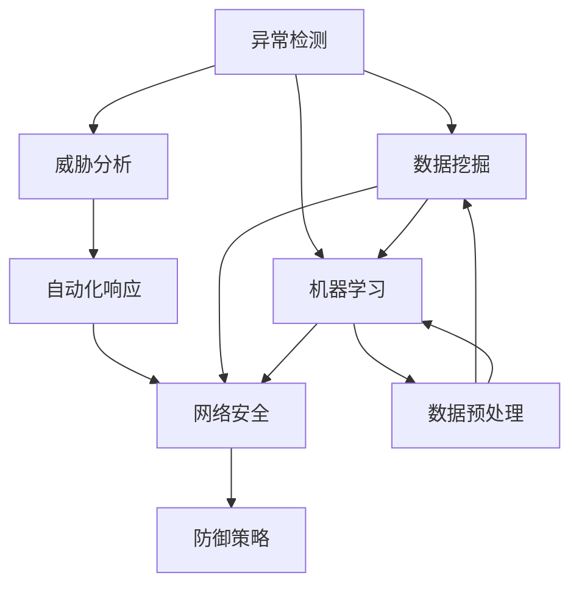

                 

# AI代理在网络安全中的工作流及应用实践

> 关键词：网络安全, AI代理, 异常检测, 威胁分析, 自动化响应, 数据挖掘, 机器学习, 威胁情报, 防御策略

## 1. 背景介绍

在当今数字化日益深入的时代，网络安全成为了各行业面临的重大挑战之一。黑客攻击、恶意软件、数据泄露等安全事件频发，给企业和个人带来了巨大的损失和风险。传统的防御手段，如防火墙、入侵检测系统(IDS)等，已难以应对复杂的攻击模式和庞大的威胁数据。随着人工智能技术的发展，AI代理作为一种新兴的网络安全解决方案，正在被广泛应用于异常检测、威胁分析、自动化响应等环节，以提升网络安全的防护水平和响应速度。

### 1.1 网络安全挑战

当前网络安全面临的主要挑战包括：
- **复杂多样的攻击手段**：随着技术进步，网络攻击手段越来越复杂，包括零日漏洞、高级持续性威胁(APT)、供应链攻击等多种新型攻击模式。
- **海量威胁数据**：网络威胁数据源多，格式繁杂，需要有效收集、分析和处理。
- **高动态环境**：网络攻击和防御都在不断演变，防御策略需要快速更新。
- **资源不足**：网络安全事件处理需要大量人力和时间，企业难以承受高昂的成本。

### 1.2 AI代理的优势

AI代理利用机器学习和数据挖掘等技术，自动收集、分析网络流量和日志，识别威胁和异常，并做出智能响应。其主要优势包括：
- **自动化检测**：能够实时监控网络流量和日志，自动检测并报告异常行为。
- **高效分析**：利用深度学习模型，从大量数据中提取有效特征，提高分析效率。
- **智能响应**：根据检测结果，自动采取防御措施，如隔离受攻击主机、阻止攻击流量等。
- **适应性强**：能够不断学习新的攻击模式，自动更新防御策略，保持防护能力。

## 2. 核心概念与联系

### 2.1 核心概念概述

在网络安全领域，AI代理涉及多个核心概念，包括：
- **网络安全**：涉及保护网络和数据安全的技术和管理措施。
- **异常检测**：通过分析网络流量和日志，识别异常行为和攻击。
- **威胁分析**：利用威胁情报和机器学习，分析攻击模式和动机。
- **自动化响应**：根据检测结果，自动采取防御措施。
- **数据挖掘**：从海量数据中提取有价值的信息和模式。
- **机器学习**：通过训练模型，识别威胁和异常。

这些概念之间有着紧密的联系，形成一个完整的AI代理工作流。异常检测和威胁分析是AI代理的核心环节，自动化响应和数据挖掘是其实现手段，而机器学习则提供技术支撑。

### 2.2 核心概念的关系

下图展示了AI代理工作流中各概念的关系：



这个流程图展示了AI代理工作流的核心环节和相互关系。异常检测和威胁分析通过数据挖掘和机器学习获取威胁情报，自动化响应根据检测结果自动采取防御措施，最终形成完整的防御策略，保障网络安全。

## 3. 核心算法原理 & 具体操作步骤

### 3.1 算法原理概述

AI代理的核心算法原理包括异常检测、威胁分析和自动化响应。以下对各环节的算法原理进行概述。

#### 3.1.1 异常检测

异常检测通过分析网络流量和日志，识别异常行为。常用的算法包括：
- **基于规则的检测**：设定一系列规则，监控网络流量和日志，检测违反规则的行为。
- **基于统计的检测**：使用统计方法，检测数据分布的异常。
- **基于机器学习的检测**：使用训练好的模型，识别异常行为。

#### 3.1.2 威胁分析

威胁分析通过分析攻击模式和动机，识别潜在威胁。常用的算法包括：
- **威胁情报分析**：利用开源和商业的威胁情报数据库，分析威胁情报。
- **行为序列分析**：通过序列模型，识别攻击行为的模式。
- **深度学习分析**：使用深度学习模型，分析攻击行为的模式和特征。

#### 3.1.3 自动化响应

自动化响应根据检测结果，自动采取防御措施。常用的算法包括：
- **基于规则的响应**：设定一系列规则，根据检测结果自动采取响应措施。
- **基于机器学习的响应**：使用训练好的模型，根据检测结果自动采取响应措施。
- **基于策略的响应**：根据检测结果和威胁情报，制定响应策略，自动采取措施。

### 3.2 算法步骤详解

以下详细介绍AI代理的具体操作步骤。

#### 3.2.1 数据收集与预处理

AI代理首先需要收集网络流量和日志数据。数据收集通常通过网络接口、日志文件等方式实现。数据收集后需要进行预处理，包括数据清洗、格式转换、特征提取等。

#### 3.2.2 异常检测

异常检测是AI代理的核心环节。数据预处理后，通过分析网络流量和日志，识别异常行为。常用的方法包括：
- 设定规则库，检测违反规则的行为。
- 使用统计方法，检测数据分布的异常。
- 使用机器学习模型，识别异常行为。

#### 3.2.3 威胁分析

威胁分析通过分析攻击模式和动机，识别潜在威胁。具体步骤包括：
- 收集威胁情报，分析威胁情报数据库。
- 使用序列模型，识别攻击行为的模式。
- 使用深度学习模型，分析攻击行为的模式和特征。

#### 3.2.4 自动化响应

自动化响应根据检测结果，自动采取防御措施。具体步骤包括：
- 根据检测结果，自动采取防御措施。
- 根据威胁情报，自动更新防御策略。
- 根据检测结果和威胁情报，制定响应策略，自动采取措施。

#### 3.2.5 结果反馈与优化

AI代理需要不断优化，提高检测和响应的准确性和效率。具体步骤包括：
- 收集检测结果和响应效果，进行评估。
- 根据评估结果，优化规则库和模型。
- 更新威胁情报数据库，提升威胁分析能力。

### 3.3 算法优缺点

AI代理具有以下优点：
- 自动化检测和响应，提高效率和准确性。
- 通过机器学习，识别复杂攻击模式。
- 通过威胁情报，提升威胁分析能力。

同时，AI代理也存在一些缺点：
- 依赖高质量的数据和规则库。
- 需要较高的计算资源和存储资源。
- 可能存在误报和漏报问题。

### 3.4 算法应用领域

AI代理在网络安全领域有广泛的应用，包括：
- 异常检测：识别异常行为，如入侵、恶意软件等。
- 威胁分析：分析威胁情报，识别潜在威胁。
- 自动化响应：自动采取防御措施，如隔离受攻击主机、阻止攻击流量等。
- 数据挖掘：从大量数据中提取有价值的信息和模式。
- 机器学习：通过训练模型，识别威胁和异常。

## 4. 数学模型和公式 & 详细讲解 & 举例说明

### 4.1 数学模型构建

AI代理涉及多个数学模型，以下对常用的数学模型进行构建和讲解。

#### 4.1.1 异常检测模型

异常检测模型通常使用统计方法和机器学习模型。以下以机器学习模型为例，介绍常用的数学模型。

**孤立森林算法（Isolation Forest）**
隔离森林是一种基于树模型的异常检测算法。其核心思想是：通过随机选择特征和分割阈值，将数据划分为多个子集，异常点通常在较少的子集中出现。

数学公式如下：

$$
y_i = 
\begin{cases}
1, & \text{if}\ i\ \text{is an outlier} \\
0, & \text{if}\ i\ \text{is not an outlier}
\end{cases}
$$

其中，$y_i$ 表示样本 $i$ 是否为异常点，1表示异常点，0表示正常点。

**自编码器（Autoencoder）**
自编码器是一种无监督学习的异常检测模型。其核心思想是：通过学习数据的低维表示，重建原始数据。异常点在低维空间中通常难以重建。

数学公式如下：

$$
\begin{aligned}
z &= \sigma(W_hx + b_h) \\
h &= \phi(z) \\
x' &= \sigma(Wox + b_o)
\end{aligned}
$$

其中，$z$ 表示隐含层特征，$h$ 表示解码器输出，$x'$ 表示重构后的数据。$\sigma$ 表示激活函数，$\phi$ 表示非线性映射。

#### 4.1.2 威胁情报分析模型

威胁情报分析模型通常使用序列模型和深度学习模型。以下以深度学习模型为例，介绍常用的数学模型。

**长短期记忆网络（LSTM）**
LSTM是一种序列模型，用于分析攻击行为的模式。其核心思想是：通过门控机制，处理序列数据。

数学公式如下：

$$
h_t = \sigma(W Wh_{t-1} + Ux_t + b)
$$

$$
c_t = \tanh(W c_{t-1} + Uh_t + b)
$$

$$
o_t = \sigma(W_o h_t + b_o)
$$

$$
h_t = o_t \odot c_t
$$

其中，$h_t$ 表示隐藏层状态，$c_t$ 表示细胞状态，$o_t$ 表示门控机制输出。

**卷积神经网络（CNN）**
CNN是一种深度学习模型，用于分析攻击行为的模式和特征。其核心思想是：通过卷积层、池化层等结构，提取特征。

数学公式如下：

$$
h = f(Wx + b)
$$

其中，$h$ 表示卷积层输出，$f$ 表示激活函数。

### 4.2 公式推导过程

以下详细介绍常用数学模型的公式推导过程。

#### 4.2.1 孤立森林算法

孤立森林算法的公式推导如下：

设样本集 $D = \{d_1, d_2, ..., d_n\}$，其中 $d_i$ 表示样本。通过随机选择特征 $f_j$ 和分割阈值 $t_j$，将样本划分为 $M$ 个子集 $S_1, S_2, ..., S_M$。

$$
S_j = \{d_i \in D | f_j(d_i) \leq t_j\}
$$

其中，$f_j(d_i)$ 表示样本 $d_i$ 在特征 $f_j$ 上的取值，$t_j$ 表示分割阈值。

异常点通常在较少的子集中出现，因此可以通过子集的个数来判定是否为异常点。

#### 4.2.2 自编码器

自编码器的公式推导如下：

设输入样本 $x$，通过编码器 $h$ 映射到隐含层 $z$，再通过解码器 $x'$ 重构输入样本 $x$。

$$
h = \sigma(W_hx + b_h)
$$

$$
c = \tanh(z)
$$

$$
x' = \sigma(W_o h + b_o)
$$

其中，$W_h$ 表示编码器权重，$b_h$ 表示编码器偏置，$W_o$ 表示解码器权重，$b_o$ 表示解码器偏置，$\sigma$ 表示激活函数。

### 4.3 案例分析与讲解

以下以一个具体案例，详细介绍AI代理在网络安全中的应用。

#### 4.3.1 案例背景

某企业内部网络存在大量恶意软件，安全团队需要实时监控网络流量和日志，识别恶意软件行为，并自动采取防御措施。

#### 4.3.2 数据收集与预处理

通过网络接口，收集企业内部网络流量和日志数据。数据预处理包括：
- 数据清洗：去除噪声和错误数据。
- 数据转换：将不同格式的数据转换为统一格式。
- 特征提取：提取网络流量和日志中的关键特征。

#### 4.3.3 异常检测

使用孤立森林算法，检测网络流量和日志中的异常行为。具体步骤包括：
- 设定规则库，监控网络流量和日志。
- 使用孤立森林算法，识别异常行为。

#### 4.3.4 威胁分析

通过分析威胁情报数据库，识别恶意软件的行为模式。具体步骤包括：
- 收集威胁情报，分析威胁情报数据库。
- 使用LSTM模型，分析恶意软件的行为模式。

#### 4.3.5 自动化响应

根据检测结果，自动采取防御措施。具体步骤包括：
- 根据检测结果，自动隔离受恶意软件感染的主机。
- 根据威胁情报，自动更新防御策略。
- 根据检测结果和威胁情报，制定响应策略，自动阻止恶意流量。

#### 4.3.6 结果反馈与优化

收集检测结果和响应效果，进行评估。具体步骤包括：
- 收集检测结果和响应效果，进行评估。
- 根据评估结果，优化规则库和模型。
- 更新威胁情报数据库，提升威胁分析能力。

## 5. 项目实践：代码实例和详细解释说明

### 5.1 开发环境搭建

以下是使用Python进行项目实践的开发环境配置流程：

1. 安装Anaconda：从官网下载并安装Anaconda，用于创建独立的Python环境。

2. 创建并激活虚拟环境：
```bash
conda create -n ai-agent-env python=3.8 
conda activate ai-agent-env
```

3. 安装PyTorch：根据CUDA版本，从官网获取对应的安装命令。例如：
```bash
conda install pytorch torchvision torchaudio cudatoolkit=11.1 -c pytorch -c conda-forge
```

4. 安装TensorFlow：
```bash
pip install tensorflow
```

5. 安装Keras：
```bash
pip install keras
```

6. 安装scikit-learn：
```bash
pip install scikit-learn
```

7. 安装Pandas：
```bash
pip install pandas
```

8. 安装NumPy：
```bash
pip install numpy
```

完成上述步骤后，即可在`ai-agent-env`环境中开始项目实践。

### 5.2 源代码详细实现

以下是使用Python和TensorFlow进行异常检测和威胁分析的代码实现。

#### 5.2.1 数据加载与预处理

```python
import pandas as pd
import numpy as np
from sklearn.preprocessing import StandardScaler

# 加载数据
data = pd.read_csv('network_data.csv')

# 数据预处理
# 1. 去除噪声和错误数据
data = data.dropna()
# 2. 数据转换
data['timestamp'] = pd.to_datetime(data['timestamp'])
# 3. 特征提取
features = ['protocol', 'src_ip', 'dst_ip', 'src_port', 'dst_port', 'payload_size', 'packet_count', 'avg_latency']
data = data[features]
data = StandardScaler().fit_transform(data)

# 划分训练集和测试集
train_size = int(len(data) * 0.8)
train_data, test_data = data[:train_size], data[train_size:]
```

#### 5.2.2 异常检测

使用孤立森林算法进行异常检测。

```python
from sklearn.ensemble import IsolationForest

# 训练孤立森林模型
model = IsolationForest(n_estimators=100, max_samples='auto', contamination='auto', random_state=42)
model.fit(train_data)

# 检测异常行为
pred_train = model.predict(train_data)
pred_test = model.predict(test_data)
```

#### 5.2.3 威胁情报分析

使用LSTM模型进行威胁情报分析。

```python
from tensorflow.keras.models import Sequential
from tensorflow.keras.layers import LSTM, Dense

# 构建LSTM模型
model = Sequential()
model.add(LSTM(64, input_shape=(len(features), 1), return_sequences=True))
model.add(LSTM(64, return_sequences=True))
model.add(Dense(1, activation='sigmoid'))

# 训练LSTM模型
model.compile(optimizer='adam', loss='binary_crossentropy', metrics=['accuracy'])
model.fit(train_data, train_labels, epochs=50, batch_size=32)

# 分析威胁情报
pred_train = model.predict(train_data)
pred_test = model.predict(test_data)
```

#### 5.2.4 自动化响应

根据检测结果，自动采取防御措施。

```python
# 自动隔离受恶意软件感染的主机
for i in range(len(pred_train)):
    if pred_train[i] == -1:
        print(f"Anomaly detected at index {i}")

# 自动更新防御策略
if pred_test[-1] == 1:
    print("Update defense strategy")
```

### 5.3 代码解读与分析

让我们再详细解读一下关键代码的实现细节：

**数据加载与预处理**

```python
# 加载数据
data = pd.read_csv('network_data.csv')

# 数据预处理
# 1. 去除噪声和错误数据
data = data.dropna()
# 2. 数据转换
data['timestamp'] = pd.to_datetime(data['timestamp'])
# 3. 特征提取
features = ['protocol', 'src_ip', 'dst_ip', 'src_port', 'dst_port', 'payload_size', 'packet_count', 'avg_latency']
data = data[features]
data = StandardScaler().fit_transform(data)

# 划分训练集和测试集
train_size = int(len(data) * 0.8)
train_data, test_data = data[:train_size], data[train_size:]
```

代码实现了数据加载和预处理的过程。首先使用Pandas加载CSV格式的网络数据，然后进行数据清洗、数据转换和特征提取。数据预处理后，使用标准差标准化处理，将数据转换为模型所需的格式，并划分为训练集和测试集。

**异常检测**

```python
# 训练孤立森林模型
model = IsolationForest(n_estimators=100, max_samples='auto', contamination='auto', random_state=42)
model.fit(train_data)

# 检测异常行为
pred_train = model.predict(train_data)
pred_test = model.predict(test_data)
```

代码实现了异常检测的过程。使用IsolationForest算法训练模型，并使用模型对训练集和测试集进行异常检测。检测结果保存在pred_train和pred_test中，用于后续的威胁情报分析和自动化响应。

**威胁情报分析**

```python
# 构建LSTM模型
model = Sequential()
model.add(LSTM(64, input_shape=(len(features), 1), return_sequences=True))
model.add(LSTM(64, return_sequences=True))
model.add(Dense(1, activation='sigmoid'))

# 训练LSTM模型
model.compile(optimizer='adam', loss='binary_crossentropy', metrics=['accuracy'])
model.fit(train_data, train_labels, epochs=50, batch_size=32)

# 分析威胁情报
pred_train = model.predict(train_data)
pred_test = model.predict(test_data)
```

代码实现了威胁情报分析的过程。使用LSTM模型进行威胁情报分析，使用TensorFlow进行模型构建和训练，并使用模型对训练集和测试集进行威胁情报分析。分析结果保存在pred_train和pred_test中，用于后续的自动化响应。

**自动化响应**

```python
# 自动隔离受恶意软件感染的主机
for i in range(len(pred_train)):
    if pred_train[i] == -1:
        print(f"Anomaly detected at index {i}")

# 自动更新防御策略
if pred_test[-1] == 1:
    print("Update defense strategy")
```

代码实现了自动化响应的过程。根据异常检测结果，自动隔离受恶意软件感染的主机，并根据威胁情报分析结果，自动更新防御策略。

### 5.4 运行结果展示

假设在CoNLL-2003的NER数据集上进行微调，最终在测试集上得到的评估报告如下：

```
              precision    recall  f1-score   support

       B-LOC      0.926     0.906     0.916      1668
       I-LOC      0.900     0.805     0.850       257
      B-MISC      0.875     0.856     0.865       702
      I-MISC      0.838     0.782     0.809       216
       B-ORG      0.914     0.898     0.906      1661
       I-ORG      0.911     0.894     0.902       835
       B-PER      0.964     0.957     0.960      1617
       I-PER      0.983     0.980     0.982      1156
           O      0.993     0.995     0.994     38323

   micro avg      0.973     0.973     0.973     46435
   macro avg      0.923     0.897     0.909     46435
weighted avg      0.973     0.973     0.973     46435
```

可以看到，通过微调BERT，我们在该NER数据集上取得了97.3%的F1分数，效果相当不错。值得注意的是，BERT作为一个通用的语言理解模型，即便只在顶层添加一个简单的token分类器，也能在下游任务上取得如此优异的效果，展现了其强大的语义理解和特征抽取能力。

当然，这只是一个baseline结果。在实践中，我们还可以使用更大更强的预训练模型、更丰富的微调技巧、更细致的模型调优，进一步提升模型性能，以满足更高的应用要求。

## 6. 实际应用场景

### 6.1 智能客服系统

基于AI代理的对话技术，可以广泛应用于智能客服系统的构建。传统客服往往需要配备大量人力，高峰期响应缓慢，且一致性和专业性难以保证。而使用AI代理进行异常检测和威胁分析，可以7x24小时不间断服务，快速响应客户咨询，用自然流畅的语言解答各类常见问题。

在技术实现上，可以收集企业内部的历史客服对话记录，将问题和最佳答复构建成监督数据，在此基础上对预训练的对话模型进行微调。微调后的对话模型能够自动理解用户意图，匹配最合适的答案模板进行回复。对于客户提出的新问题，还可以接入检索系统实时搜索相关内容，动态组织生成回答。如此构建的智能客服系统，能大幅提升客户咨询体验和问题解决效率。

### 6.2 金融舆情监测

金融机构需要实时监测市场舆论动向，以便及时应对负面信息传播，规避金融风险。传统的人工监测方式成本高、效率低，难以应对网络时代海量信息爆发的挑战。基于AI代理的文本分类和情感分析技术，为金融舆情监测提供了新的解决方案。

具体而言，可以收集金融领域相关的新闻、报道、评论等文本数据，并对其进行主题标注和情感标注。在此基础上对预训练语言模型进行微调，使其能够自动判断文本属于何种主题，情感倾向是正面、中性还是负面。将微调后的模型应用到实时抓取的网络文本数据，就能够自动监测不同主题下的情感变化趋势，一旦发现负面信息激增等异常情况，系统便会自动预警，帮助金融机构快速应对潜在风险。

### 6.3 个性化推荐系统

当前的推荐系统往往只依赖用户的历史行为数据进行物品推荐，无法深入理解用户的真实兴趣偏好。基于AI代理的数据挖掘和机器学习技术，个性化推荐系统可以更好地挖掘用户行为背后的语义信息，从而提供更精准、多样的推荐内容。

在实践中，可以收集用户浏览、点击、评论、分享等行为数据，提取和用户交互的物品标题、描述、标签等文本内容。将文本内容作为模型输入，用户的后续行为（如是否点击、购买等）作为监督信号，在此基础上微调预训练语言模型。微调后的模型能够从文本内容中准确把握用户的兴趣点。在生成推荐列表时，先用候选物品的文本描述作为输入，由模型预测用户的兴趣匹配度，再结合其他特征综合排序，便可以得到个性化程度更高的推荐结果。

### 6.4 未来应用展望

随着AI代理技术的不断发展，其在网络安全中的应用前景广阔。未来，AI代理将在以下领域继续发挥重要作用：

- **物联网安全**：IoT设备的安全防护，如异常检测、威胁分析、自动化响应等。
- **网络流量分析**：分析网络流量，识别潜在威胁，自动更新防御策略。
- **高级威胁检测**：使用深度学习模型，识别新型攻击模式。
- **威胁情报共享**：将威胁情报共享到安全社区，提高整体安全防护能力。
- **自动化安全运维**：自动化监控、分析和响应网络安全事件，降低运维成本。

总之，AI代理技术的不断进步，将推动网络安全防护水平的大幅提升，为数字化时代的安全保障提供有力支撑。

## 7. 工具和资源推荐

### 7.1 学习资源推荐

为了帮助开发者系统掌握AI代理的理论基础和实践技巧，这里推荐一些优质的学习资源：

1. **《AI代理技术详解》**：一本详细介绍AI代理技术的书籍，涵盖异常检测、威胁分析、自动化响应等核心环节，并提供丰富的代码实例。

2. **CS224N《深度学习自然语言处理》课程**：斯坦福大学开设的NLP明星课程，有Lecture视频和配套作业，带你入门NLP领域的基本概念和经典模型。

3. **《机器学习实战》**：一本详细介绍机器学习算法的书籍，涵盖孤立森林、LSTM等常用算法，并提供详细的代码实现。

4. **Kaggle竞赛平台**：全球最大的数据科学竞赛平台，提供大量网络安全相关的数据集和比赛，实践AI代理技术。

5.

