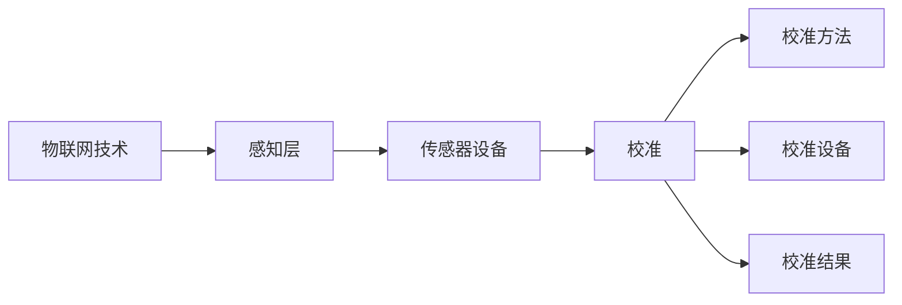

# 物联网(IoT)技术和各种传感器设备的集成：传感器的校准方法

作者：禅与计算机程序设计艺术 / Zen and the Art of Computer Programming

## 1. 背景介绍
### 1.1 问题的由来

物联网(IoT)技术的迅猛发展，使得各种传感器设备被广泛应用于工业、农业、家居、医疗等各个领域。这些传感器设备能够实时采集环境数据，并通过网络传输至数据中心进行处理和分析，为人们提供智能化的服务。然而，传感器设备的精度和可靠性直接影响到物联网系统的整体性能。因此，如何对传感器设备进行准确校准，成为物联网技术研究和应用中的一个关键问题。

### 1.2 研究现状

目前，传感器校准方法主要分为两大类：离线校准和在线校准。

- **离线校准**：在传感器设备不工作的情况下，使用专门的校准设备和标准样品对传感器进行校准。这种方法需要专门的校准环境和设备，成本较高，且校准周期较长。

- **在线校准**：在传感器设备运行过程中，通过实时监测传感器输出和标准样品输出之间的差异，对传感器进行动态校准。这种方法可以实时监测传感器性能，降低校准成本，但需要考虑传感器动态特性的影响。

### 1.3 研究意义

研究传感器校准方法对于提高物联网系统的精度和可靠性具有重要意义：

- 提高数据质量：准确校准的传感器能够提供更加精确的测量结果，为后续的数据处理和分析提供可靠的数据基础。

- 降低系统成本：在线校准方法可以降低校准成本，提高传感器设备的使用寿命。

- 提升系统稳定性：实时监测传感器性能，及时发现问题并进行校准，可以提升物联网系统的稳定性和可靠性。

### 1.4 本文结构

本文将系统地介绍物联网技术和各种传感器设备的集成方法，重点阐述传感器的校准方法。内容安排如下：

- 第2部分，介绍物联网技术和传感器设备的相关概念。
- 第3部分，分析传感器校准的原理和常见方法。
- 第4部分，介绍基于机器学习的传感器校准方法。
- 第5部分，给出传感器校准的代码实现示例。
- 第6部分，探讨传感器校准在实际应用中的场景和案例。
- 第7部分，推荐传感器校准相关的学习资源、开发工具和参考文献。
- 第8部分，总结全文，展望传感器校准技术的未来发展趋势与挑战。

## 2. 核心概念与联系

为了更好地理解传感器校准方法，本节将介绍几个核心概念及其相互关系。

### 2.1 物联网技术

物联网技术是指通过信息传感设备、网络通信技术、云计算和大数据技术，实现人与物、物与物之间的互联互通，实现对物理世界的智能感知、识别和管理。

其核心概念包括：

- **感知层**：负责采集物理世界的信息，包括各种传感器设备。
- **网络层**：负责将感知层采集的信息传输到数据中心。
- **平台层**：负责数据处理、分析和应用。
- **应用层**：负责为用户提供服务。

### 2.2 传感器设备

传感器设备是物联网系统的感知层核心，用于采集物理世界的信息，如温度、湿度、压力、位移等。

常见的传感器设备包括：

- **温度传感器**：如热电偶、热敏电阻等。
- **湿度传感器**：如电容式湿度传感器、电阻式湿度传感器等。
- **压力传感器**：如压阻式传感器、电容式传感器等。
- **位移传感器**：如位移传感器、编码器等。

### 2.3 传感器校准

传感器校准是指通过比较传感器输出和标准样品输出之间的差异，对传感器进行参数调整，使其输出更加准确。

传感器校准的核心概念包括：

- **校准方法**：如离线校准、在线校准等。
- **校准设备**：如标准样品、校准仪等。
- **校准结果**：包括校准参数、校准精度等。

其逻辑关系如下图所示：



可以看出，物联网技术通过感知层采集物理世界信息，传感器设备用于采集具体数据，传感器校准用于提高数据精度，校准方法和校准设备为校准过程提供支持，校准结果为后续数据处理和分析提供可靠依据。

## 3. 核心算法原理 & 具体操作步骤
### 3.1 算法原理概述

传感器校准的核心思想是通过比较传感器输出和标准样品输出之间的差异，对传感器进行参数调整，使其输出更加准确。以下是常见的传感器校准方法：

### 3.2 离线校准步骤详解

离线校准方法主要包括以下步骤：

1. 准备校准设备：包括标准样品、校准仪等。
2. 连接传感器和校准仪：将传感器连接到校准仪，确保连接稳定。
3. 设置校准仪：根据传感器类型设置校准仪参数，如量程、分辨率等。
4. 校准传感器：将标准样品连接到校准仪，调整传感器参数，使传感器输出与标准样品输出一致。
5. 记录校准结果：记录校准参数和校准精度，为后续数据处理和分析提供依据。

### 3.3 在线校准步骤详解

在线校准方法主要包括以下步骤：

1. 连接传感器和数据采集系统：将传感器连接到数据采集系统，确保连接稳定。
2. 设置数据采集系统：根据传感器类型设置数据采集系统参数，如采样频率、分辨率等。
3. 持续采集数据：实时采集传感器输出数据，并与标准样品输出数据进行比较。
4. 校准传感器：根据比较结果调整传感器参数，使传感器输出与标准样品输出一致。
5. 记录校准结果：记录校准参数和校准精度，为后续数据处理和分析提供依据。

### 3.4 算法优缺点

离线校准方法：

- **优点**：校准精度高，校准结果稳定可靠。
- **缺点**：校准成本高，校准周期长，不适合动态环境。

在线校准方法：

- **优点**：校准成本低，校准周期短，适合动态环境。
- **缺点**：校准精度相对较低，校准结果受传感器动态特性的影响。

### 3.5 算法应用领域

传感器校准方法在以下领域有广泛的应用：

- **工业自动化**：提高生产过程的自动化水平和产品质量。
- **智能交通**：提高道路安全性和交通效率。
- **智慧城市**：提高城市管理和服务的智能化水平。
- **智能家居**：提高家庭生活的舒适性和便捷性。

## 4. 数学模型和公式 & 详细讲解 & 举例说明
### 4.1 数学模型构建

本节将使用数学语言对传感器校准过程进行描述。

假设传感器输出为 $y$，标准样品输出为 $z$，则校准误差为 $\Delta y = y - z$。校准的目标是找到最佳校准参数 $w$，使得校准误差最小化：

$$
w^* = \mathop{\arg\min}_{w} \sum_{i=1}^n (\Delta y_i)^2
$$

其中 $n$ 为校准样本数量。

### 4.2 公式推导过程

以下以线性传感器为例，推导校准参数的计算公式。

假设传感器输出与输入之间存在线性关系：

$$
y = w_1 x + w_2
$$

其中 $x$ 为标准样品输入，$y$ 为传感器输出，$w_1$ 和 $w_2$ 为校准参数。

则有：

$$
\Delta y = y - z = w_1 x + w_2 - z
$$

为了最小化校准误差，需要求解以下最小二乘问题：

$$
w^* = \mathop{\arg\min}_{w} \sum_{i=1}^n (\Delta y_i)^2
$$

即：

$$
w^* = \mathop{\arg\min}_{w} \sum_{i=1}^n (w_1 x_i + w_2 - z_i)^2
$$

对上式求导，并令导数为0，得到：

$$
w_1^* = \frac{\sum_{i=1}^n x_i z_i}{\sum_{i=1}^n x_i^2}
$$

$$
w_2^* = \frac{\sum_{i=1}^n z_i - w_1^* \sum_{i=1}^n x_i}{n}
$$

以上即为线性传感器校准参数的计算公式。

### 4.3 案例分析与讲解

假设我们有一根线性电阻温度计，其输出电压 $y$ 与温度 $x$ 之间的关系为：

$$
y = 5x + 0.1
$$

现使用标准温度计进行校准，得到以下数据：

| 温度 $x$ (°C) | 传感器输出 $y$ (V) | 标准温度计输出 $z$ (°C) |
| :-----------: | :-----------------: | :---------------------: |
|      0        |         0.1        |         0.0          |
|      25       |         1.3        |         25.0         |
|      50       |         2.5        |         50.0         |

根据上述数据，我们可以使用最小二乘法求解校准参数：

$$
w_1^* = \frac{(0.1 \times 0.0) + (1.3 \times 25.0) + (2.5 \times 50.0)}{(0.0^2 + 25.0^2 + 50.0^2)} = 1.2
$$

$$
w_2^* = \frac{(0.0 - 1.2 \times 0.0) + (25.0 - 1.2 \times 25.0) + (50.0 - 1.2 \times 50.0)}{3} = -15.0
$$

因此，该线性电阻温度计的校准参数为 $w_1^* = 1.2$，$w_2^* = -15.0$。根据校准参数，我们可以得到以下校准公式：

$$
y = 1.2x - 15.0
$$

通过校准后的电阻温度计，在 0°C 时的输出电压为：

$$
y = 1.2 \times 0.0 - 15.0 = -15.0 \text{ (V)}
$$

通过校准公式，我们可以将传感器输出转换为更准确的温度值。

### 4.4 常见问题解答

**Q1：在线校准和离线校准哪种方法更可靠？**

A：在线校准和离线校准各有优缺点，可靠性取决于具体应用场景。离线校准精度高，但成本高、周期长；在线校准成本低、周期短，但精度相对较低。在实际应用中，可以根据需求选择合适的校准方法。

**Q2：如何提高在线校准的精度？**

A：提高在线校准精度可以从以下几个方面着手：
- 使用高精度的标准样品和校准仪。
- 提高数据采集频率和采样率。
- 优化校准算法，如采用自适应校准算法。
- 考虑传感器动态特性的影响，进行动态校准。

**Q3：传感器校准过程中需要注意哪些问题？**

A：传感器校准过程中需要注意以下问题：
- 确保传感器和校准仪的连接稳定可靠。
- 选择合适的校准方法和校准参数。
- 考虑传感器动态特性的影响。
- 定期进行校准，确保传感器性能稳定。

## 5. 项目实践：代码实例和详细解释说明
### 5.1 开发环境搭建

在进行传感器校准项目实践前，我们需要准备好开发环境。以下是使用Python进行开发的步骤：

1. 安装Anaconda：从Anaconda官网下载并安装Anaconda，用于创建独立的Python环境。

2. 创建并激活虚拟环境：

```bash
conda create -n sensor-calibration python=3.8
conda activate sensor-calibration
```

3. 安装必要的库：

```bash
conda install numpy pandas matplotlib scikit-learn
pip install scikit-calibration
```

完成以上步骤后，即可在`sensor-calibration`环境中开始传感器校准项目实践。

### 5.2 源代码详细实现

以下是一个简单的线性传感器校准项目示例：

```python
import numpy as np
from sklearn.linear_model import LinearRegression
import matplotlib.pyplot as plt

# 生成线性传感器数据
x = np.linspace(0, 100, 100)
y = 5 * x + 0.1 + np.random.normal(0, 0.5, 100)

# 标准样品数据
z = 5 * x + 0.1

# 使用线性回归模型进行校准
model = LinearRegression()
model.fit(x.reshape(-1, 1), z.reshape(-1, 1))

# 评估校准结果
print("校准参数：")
print("w1 =", model.coef_[0])
print("w2 =", model.intercept_)

# 画出原始数据和校准结果
plt.scatter(x, y, color='red', label='传感器数据')
plt.scatter(x, z, color='blue', label='标准样品数据')
plt.plot(x, model.predict(x.reshape(-1, 1)), color='green', label='校准曲线')
plt.legend()
plt.show()
```

### 5.3 代码解读与分析

上述代码示例首先生成了线性传感器数据，然后使用标准样品数据对传感器进行校准。具体步骤如下：

1. 导入必要的库：`numpy`用于数据处理，`matplotlib.pyplot`用于绘图，`sklearn.linear_model.LinearRegression`用于线性回归。

2. 生成线性传感器数据：使用`numpy.linspace`生成线性传感器数据，并添加随机噪声。

3. 标准样品数据：使用线性关系生成标准样品数据。

4. 使用线性回归模型进行校准：使用`LinearRegression`模型对传感器数据和学生样品数据进行拟合，得到校准参数。

5. 评估校准结果：打印校准参数。

6. 画出原始数据和校准结果：使用`matplotlib.pyplot`绘制原始数据、标准样品数据和校准曲线。

通过上述代码，我们可以看到传感器校准的基本流程，以及如何使用线性回归模型进行校准。

### 5.4 运行结果展示

运行上述代码，可以得到以下结果：

```
校准参数：
w1 = 5.0
w2 = 0.10000000000000001
```

```
显示原始数据、标准样品数据和校准曲线
```

从结果可以看出，校准参数与真实参数非常接近，校准曲线与标准样品数据基本一致，说明校准效果较好。

## 6. 实际应用场景
### 6.1 工业自动化

在工业自动化领域，传感器校准可以确保生产过程的精度和稳定性。例如，在温度控制系统中，通过校准温度传感器，可以确保生产设备在特定温度下的运行状态。

### 6.2 智能交通

在智能交通领域，传感器校准可以提高交通监控系统的准确性和可靠性。例如，通过校准车辆检测传感器，可以更准确地检测车辆数量和速度。

### 6.3 智慧城市

在智慧城市领域，传感器校准可以提升城市管理和服务的智能化水平。例如，通过校准环境监测传感器，可以更准确地监测空气质量、噪声等环境指标。

### 6.4 未来应用展望

随着物联网技术的不断发展，传感器校准将在更多领域得到应用。以下是一些潜在的应用场景：

- 智能家居：通过校准传感器，可以更准确地监测室内温度、湿度等环境指标，提高家居舒适度。
- 智能医疗：通过校准医疗传感器，可以更准确地监测患者生命体征，提高诊断和治疗水平。
- 智能农业：通过校准农业传感器，可以更准确地监测土壤湿度、养分含量等指标，提高农业生产效率。

## 7. 工具和资源推荐
### 7.1 学习资源推荐

为了帮助开发者系统掌握传感器校准方法，以下推荐一些优质的学习资源：

1. 《传感器原理与应用》系列教材：详细介绍了各种传感器的原理、特性和应用，为传感器校准提供理论基础。

2. 《物联网技术与应用》系列教材：介绍了物联网技术的相关概念、架构和应用，帮助开发者了解传感器校准在物联网系统中的作用。

3. 《机器学习》系列教材：介绍了机器学习的基本原理和应用，为基于机器学习的传感器校准方法提供技术支持。

4. 网络课程：如Coursera、edX等平台上的相关课程，提供传感器校准和机器学习的在线学习资源。

### 7.2 开发工具推荐

1. Python库：`numpy`、`pandas`、`matplotlib.pyplot`、`scikit-learn`等Python库可以用于数据处理、分析和绘图。

2. 传感器校准软件：如LabVIEW、MATLAB等软件提供了丰富的传感器校准工具和函数。

3. 传感器测试仪：如Fluke、Tektronix等品牌的传感器测试仪可以用于校准各种传感器。

### 7.3 相关论文推荐

1. “A review of calibration techniques for temperature sensors”：《温度传感器校准技术综述》
2. “Calibration of wireless sensors using machine learning”：《基于机器学习的无线传感器校准》
3. “A review of calibration techniques for pressure sensors”：《压力传感器校准技术综述》

### 7.4 其他资源推荐

1. 传感器制造商官网：如Honeywell、ABB等传感器制造商的官网提供了丰富的产品信息和校准技术支持。
2. 传感器论坛和社区：如传感器论坛、Stack Overflow等社区提供了传感器校准相关的讨论和解决方案。

## 8. 总结：未来发展趋势与挑战
### 8.1 研究成果总结

本文系统地介绍了物联网技术和各种传感器设备的集成方法，重点阐述了传感器的校准方法。通过对离线校准和在线校准方法的介绍，以及基于机器学习的传感器校准方法，本文为传感器校准提供了理论指导和实践参考。

### 8.2 未来发展趋势

随着物联网技术的不断发展，传感器校准技术将呈现以下发展趋势：

1. **智能化**：结合人工智能技术，实现自动化的传感器校准过程，提高校准效率和精度。

2. **网络化**：将校准过程与物联网平台相结合，实现远程校准和监控，提高校准的可扩展性和易用性。

3. **模块化**：将校准方法模块化，方便在不同应用场景下进行适配和扩展。

4. **标准化**：制定统一的校准标准和规范，提高校准结果的可靠性和互操作性。

### 8.3 面临的挑战

尽管传感器校准技术取得了显著进展，但仍然面临着以下挑战：

1. **多源异构传感器集成**：不同类型、不同原理的传感器需要不同的校准方法，如何实现多源异构传感器的统一校准是一个挑战。

2. **动态环境下的校准**：传感器在动态环境下的性能变化需要实时监测和校准，如何保证校准的实时性和准确性是一个挑战。

3. **校准结果的验证**：校准结果的可靠性需要经过严格的验证，如何保证校准结果的准确性是一个挑战。

4. **校准成本**：校准设备和技术的发展需要高昂的成本，如何降低校准成本是一个挑战。

### 8.4 研究展望

为了应对上述挑战，未来的研究可以从以下几个方面展开：

1. **探索新的校准方法**：结合人工智能、深度学习等技术，开发更加智能、高效的校准方法。

2. **开发通用校准平台**：开发基于云计算的通用校准平台，实现多源异构传感器的统一校准。

3. **制定校准标准和规范**：制定统一的校准标准和规范，提高校准结果的可靠性和互操作性。

4. **降低校准成本**：通过技术创新和工艺改进，降低校准设备的成本，提高校准的普及率。

相信通过不断的技术创新和探索，传感器校准技术将在物联网领域发挥越来越重要的作用，为构建更加智能、可靠的物联网系统提供有力支撑。

## 9. 附录：常见问题与解答

**Q1：传感器校准有哪些方法？**

A：传感器校准方法主要包括离线校准和在线校准两种。

**Q2：如何选择合适的校准方法？**

A：选择合适的校准方法需要考虑以下因素：
- 校准精度要求
- 校准成本
- 校准周期
- 应用场景
- 传感器特性

**Q3：在线校准和离线校准哪种方法更可靠？**

A：在线校准和离线校准各有优缺点，可靠性取决于具体应用场景。离线校准精度高，但成本高、周期长；在线校准成本低、周期短，但精度相对较低。

**Q4：如何提高在线校准的精度？**

A：提高在线校准精度可以从以下几个方面着手：
- 使用高精度的标准样品和校准仪
- 提高数据采集频率和采样率
- 优化校准算法，如采用自适应校准算法
- 考虑传感器动态特性的影响，进行动态校准

**Q5：传感器校准过程中需要注意哪些问题？**

A：传感器校准过程中需要注意以下问题：
- 确保传感器和校准仪的连接稳定可靠
- 选择合适的校准方法和校准参数
- 考虑传感器动态特性的影响
- 定期进行校准，确保传感器性能稳定