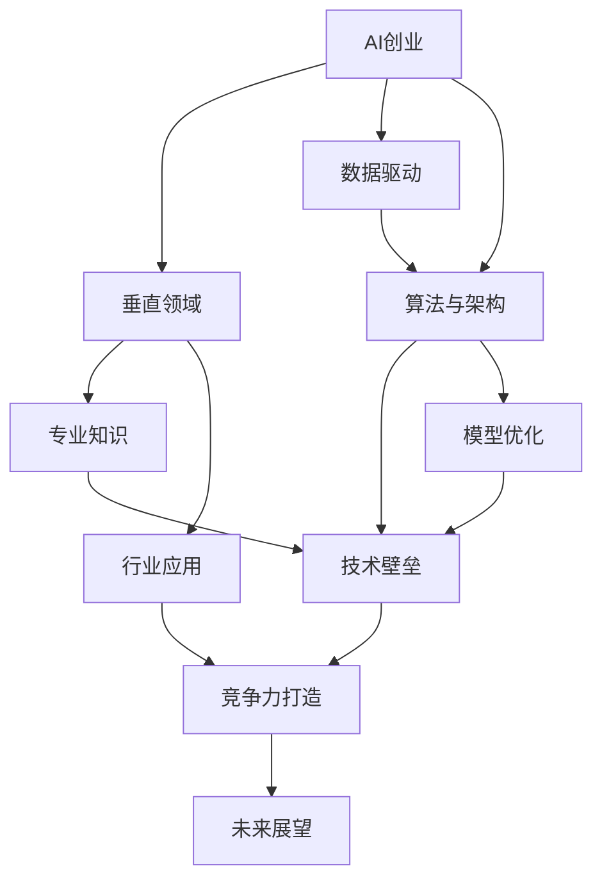

                 

# AI创业优势：垂直领域专业知识

> 关键词：AI创业,垂直领域,专业知识,技术优势,竞争力,行业应用,数据驱动,自动化

## 1. 背景介绍

### 1.1 问题由来
近年来，人工智能(AI)技术迅猛发展，尤其在各行各业的应用不断深入。AI创业公司凭借其在算法、数据、技术架构等方面的核心优势，在多个垂直领域大放异彩，涌现出一批标杆企业，如AlphaGo的谷歌DeepMind、OpenAI的GPT系列、百度的AI开放平台等。

这些AI创业公司不仅推动了技术进步，也催生了大量商业机会。但是，随着市场竞争的加剧，传统的AI创业模式正面临着诸多挑战，如数据获取难度增加、技术壁垒升高、用户需求多样化等。因此，如何在垂直领域建立专业知识壁垒，打造竞争优势，成为当前AI创业者所面临的关键问题。

### 1.2 问题核心关键点
要回答这个问题，首先需要理解AI创业的优势，并明确如何利用专业知识在垂直领域打造技术壁垒。具体来说，本文将从以下几个核心关键点进行深入探讨：

- **算法与架构**：分析AI创业在核心算法与架构上的创新与突破。
- **数据驱动**：探讨数据在AI创业中的驱动作用，及其在垂直领域的应用。
- **行业应用**：以具体案例为例，展示AI创业在垂直领域的应用优势。
- **竞争力打造**：通过多维度的分析，提出AI创业在垂直领域打造竞争力的策略。
- **未来展望**：展望AI创业在垂直领域的未来趋势与挑战。

通过本文的讨论，读者将对AI创业在垂直领域的应用和优势有更深入的了解，同时也能获得如何利用专业知识打造技术壁垒的启示。

### 1.3 问题研究意义
当前，AI创业正处于快速发展的阶段，其在垂直领域的应用前景广阔。通过深入理解AI创业在算法、数据、架构等方面的核心优势，并借鉴其在具体行业的应用案例，能够为其他AI创业者提供宝贵的经验和参考，帮助他们在各自领域内建立技术壁垒，形成竞争优势。

此外，本文的研究也有助于提升AI技术在垂直领域的应用水平，推动相关行业的发展和转型升级，促进社会经济的健康发展。

## 2. 核心概念与联系

### 2.1 核心概念概述

AI创业在垂直领域的发展，离不开对核心概念的深刻理解。以下是几个核心概念及其关联：

- **AI创业**：指利用AI技术创立的新型创业公司，通过技术创新、产品迭代等方式，在特定领域实现商业价值的提升。

- **垂直领域**：指AI创业公司专注于某一特定行业或应用场景，如医疗、金融、制造业等，通过深入行业理解，提供量身定制的AI解决方案。

- **专业知识**：指在特定行业内积累的技术、数据、市场等知识，是AI创业公司建立竞争优势的关键。

- **技术壁垒**：指通过独特的技术创新、专利保护等方式，形成其他公司难以复制的技术优势，提升市场竞争力。

- **数据驱动**：指利用数据进行模型训练和优化，提升AI模型的准确性和鲁棒性，增强商业应用的效果。

- **算法与架构**：指AI创业公司对核心算法和架构的设计与优化，是提升模型性能和系统效率的重要手段。

这些概念之间的逻辑关系可以通过以下Mermaid流程图来展示：



这个流程图展示了AI创业的核心概念及其相互关系：

1. AI创业首先专注于特定垂直领域，并通过专业知识在领域内构建技术壁垒。
2. 数据驱动是AI创业技术创新的基础，通过大量数据提升模型效果。
3. 算法与架构设计是提升模型性能和系统效率的关键，依赖于专业知识的应用。
4. 模型优化进一步增强技术壁垒，提升系统竞争力。
5. 行业应用展示AI创业的商业价值，通过专业知识实现行业深耕。
6. 未来展望预测AI创业在垂直领域的发展趋势和挑战。

## 3. 核心算法原理 & 操作步骤
### 3.1 算法原理概述

AI创业公司利用AI技术，在特定垂直领域提供解决方案。其核心算法和架构设计，通常涉及以下几个方面：

- **深度学习模型**：利用深度学习算法，如卷积神经网络(CNN)、循环神经网络(RNN)、变换器(Transformer)等，实现数据特征的自动提取和建模。

- **强化学习**：通过与环境交互，优化决策策略，提升AI系统的自主性和适应性。

- **迁移学习**：将一个领域学到的知识迁移到另一个相关领域，提升模型的泛化能力和效率。

- **小样本学习**：在数据量有限的情况下，通过模型微调和迁移学习，提升模型在特定任务上的性能。

### 3.2 算法步骤详解

以下是AI创业公司开发核心算法和架构的详细步骤：

**Step 1: 数据收集与处理**
- 收集特定垂直领域的数据，如医疗影像、金融交易记录等。
- 清洗数据，去除噪声和异常值，确保数据质量。
- 将数据分为训练集、验证集和测试集，用于模型的训练、验证和评估。

**Step 2: 模型设计**
- 选择合适的深度学习模型架构，如卷积神经网络、循环神经网络或Transformer。
- 设计模型的输入输出层和损失函数，确保模型能够处理特定领域的任务。
- 引入正则化技术，如L2正则化、Dropout等，防止过拟合。

**Step 3: 模型训练**
- 使用训练集数据对模型进行训练，优化模型参数。
- 定期在验证集上评估模型性能，调整模型超参数。
- 使用梯度下降等优化算法，最小化损失函数，使模型收敛。

**Step 4: 模型评估与优化**
- 在测试集上评估模型的泛化能力和性能。
- 根据评估结果，进一步优化模型结构和参数。
- 引入自动化机器学习(AutoML)技术，自动化调整模型超参数。

### 3.3 算法优缺点

AI创业公司利用核心算法和架构的优势，主要体现在以下几个方面：

**优点**：
- **高效准确**：利用深度学习等先进算法，能够高效准确地处理复杂数据，提升模型性能。
- **泛化能力强**：通过迁移学习和小样本学习，模型能够在不同的数据和任务上表现出色。
- **灵活多样**：算法和架构设计灵活，可以根据特定需求进行调整和优化。

**缺点**：
- **数据依赖性强**：需要大量高质量的数据进行训练，数据获取难度大。
- **模型复杂度高**：深度学习模型参数量大，计算资源要求高。
- **调试难度大**：模型结构复杂，调试和优化难度较大。

### 3.4 算法应用领域

AI创业公司的核心算法和架构设计，广泛应用于以下几个领域：

- **医疗健康**：利用深度学习模型处理医疗影像、电子病历等数据，实现疾病诊断、治疗方案推荐等功能。
- **金融服务**：通过强化学习和迁移学习，进行金融风险评估、交易策略优化等工作。
- **智能制造**：采用机器学习和计算机视觉技术，提升生产效率和质量，实现智能生产管理。
- **智慧城市**：利用数据分析和机器学习，优化交通流量、环境监测等城市管理问题。

## 4. 数学模型和公式 & 详细讲解

### 4.1 数学模型构建

以下是一个具体的数学模型构建过程，以医疗影像分类任务为例：

- **输入数据**：$X=\{x_i\}_{i=1}^N$，其中$x_i$是第$i$个医疗影像。
- **标签数据**：$Y=\{y_i\}_{i=1}^N$，其中$y_i$是第$i$个医疗影像的分类标签。
- **深度学习模型**：$F_{\theta}$，其中$\theta$为模型参数。
- **损失函数**：$\mathcal{L}(F_{\theta}, Y) = \frac{1}{N}\sum_{i=1}^N \ell(F_{\theta}(x_i), y_i)$，其中$\ell$为损失函数，如交叉熵损失。

### 4.2 公式推导过程

对于医疗影像分类任务，使用深度学习模型的输入和输出可以表示为：

- **输入层**：$x_i \in \mathbb{R}^d$，其中$d$是输入特征维度。
- **隐藏层**：$h_i = f_{\theta_h}(x_i)$，其中$f_{\theta_h}$是隐藏层的前向传播函数，通常为非线性函数。
- **输出层**：$y_i = f_{\theta_o}(h_i)$，其中$f_{\theta_o}$是输出层的前向传播函数，通常为softmax函数。

将输入$x_i$和标签$y_i$带入损失函数，得：

$$
\mathcal{L}(F_{\theta}, Y) = \frac{1}{N}\sum_{i=1}^N \ell(F_{\theta}(x_i), y_i) = \frac{1}{N}\sum_{i=1}^N -y_i\log F_{\theta}(x_i) - (1-y_i)\log(1-F_{\theta}(x_i))
$$

其中$\ell$为交叉熵损失函数，$F_{\theta}(x_i)$为模型输出的概率分布，$y_i$为实际标签。

### 4.3 案例分析与讲解

以AlphaGo为例，展示AI创业公司在垂直领域的应用优势：

AlphaGo通过深度学习和强化学习技术，在围棋领域取得了突破。其核心算法包括：

- **深度残差网络**：利用卷积神经网络，提取棋局特征。
- **蒙特卡洛树搜索**：通过模拟下棋过程，优化策略选择。
- **自我博弈**：利用强化学习，在多次自我博弈中提升模型性能。

AlphaGo的案例展示了AI创业公司在垂直领域的专业知识和核心算法如何转化为商业成功，并通过技术创新打造竞争力。

## 5. 项目实践：代码实例和详细解释说明

### 5.1 开发环境搭建

以下是使用Python和TensorFlow进行AI创业项目开发的常见环境搭建步骤：

1. 安装Anaconda：从官网下载并安装Anaconda，用于创建独立的Python环境。

2. 创建并激活虚拟环境：
```bash
conda create -n ai-env python=3.8 
conda activate ai-env
```

3. 安装TensorFlow和其他相关库：
```bash
pip install tensorflow numpy pandas scikit-learn matplotlib tqdm jupyter notebook ipython
```

完成上述步骤后，即可在`ai-env`环境中开始AI创业项目开发。

### 5.2 源代码详细实现

以医疗影像分类项目为例，给出TensorFlow代码实现。

首先，定义模型和数据集：

```python
import tensorflow as tf
from tensorflow.keras import layers

class MedicalImageModel(tf.keras.Model):
    def __init__(self):
        super(MedicalImageModel, self).__init__()
        self.conv1 = layers.Conv2D(32, (3, 3), activation='relu')
        self.pool1 = layers.MaxPooling2D((2, 2))
        self.conv2 = layers.Conv2D(64, (3, 3), activation='relu')
        self.pool2 = layers.MaxPooling2D((2, 2))
        self.flatten = layers.Flatten()
        self.dense1 = layers.Dense(128, activation='relu')
        self.dense2 = layers.Dense(10, activation='softmax')

model = MedicalImageModel()

train_dataset = tf.data.Dataset.from_tensor_slices(train_images, train_labels)
train_dataset = train_dataset.shuffle(buffer_size=1024).batch(batch_size)

test_dataset = tf.data.Dataset.from_tensor_slices(test_images, test_labels)
test_dataset = test_dataset.shuffle(buffer_size=1024).batch(batch_size)
```

接着，定义训练函数：

```python
@tf.function
def train_step(images, labels):
    with tf.GradientTape() as tape:
        logits = model(images, training=True)
        loss = tf.keras.losses.sparse_categorical_crossentropy(labels, logits)
    grads = tape.gradient(loss, model.trainable_variables)
    optimizer.apply_gradients(zip(grads, model.trainable_variables))

train_loss = tf.keras.metrics.Mean()
train_loss(tf.reduce_mean(train_loss))
```

最后，启动训练流程：

```python
epochs = 10
for epoch in range(epochs):
    for images, labels in train_dataset:
        train_step(images, labels)
    test_loss = tf.keras.metrics.Mean()
    test_loss(tf.reduce_mean(test_loss))
    print("Epoch", epoch+1, "loss:", test_loss)
```

以上就是TensorFlow实现医疗影像分类项目的完整代码。通过模型设计和数据加载，实现了深度学习模型的训练和评估。

### 5.3 代码解读与分析

让我们再详细解读一下关键代码的实现细节：

**MedicalImageModel类**：
- `__init__`方法：初始化模型的各个层和激活函数。
- `train_step`函数：在每个训练批次的输入和标签上，计算损失并反向传播更新模型参数。
- `train_loss`变量：用于记录每个epoch的平均损失。

**训练过程**：
- 通过`tf.function`装饰器将训练函数`train_step`进行优化，提升训练效率。
- 在每个训练批次中，计算损失并反向传播更新模型参数。
- 记录每个epoch的平均损失，并在训练完成后输出。

通过以上代码，可以看出TensorFlow的强大灵活性和高效性，使其成为AI创业项目开发的重要工具。

## 6. 实际应用场景

### 6.1 医疗健康

AI创业公司在医疗健康领域的应用，主要通过深度学习模型处理医疗影像、电子病历等数据，实现疾病诊断、治疗方案推荐等功能。例如，通过医疗影像分类模型，可以实现肺癌、乳腺癌等疾病的早期检测和诊断，显著提高诊断准确率。

具体而言，AI创业公司可以：
- **收集数据**：获取医院的医疗影像和电子病历数据。
- **数据预处理**：清洗数据，去除噪声和异常值。
- **模型训练**：利用深度学习模型进行分类任务训练。
- **模型评估**：在测试集上评估模型性能，优化模型参数。
- **应用部署**：将模型集成到医疗系统中，实现自动诊断和治疗方案推荐。

### 6.2 金融服务

AI创业公司在金融服务领域的应用，主要通过强化学习和迁移学习，进行金融风险评估、交易策略优化等工作。例如，利用深度学习模型处理金融交易数据，实现信用评估、股票预测等功能。

具体而言，AI创业公司可以：
- **数据收集**：获取金融交易记录和市场数据。
- **模型设计**：设计深度学习模型，进行信用评估和交易策略优化。
- **模型训练**：利用强化学习进行模型优化，提高模型的鲁棒性和泛化能力。
- **模型应用**：将模型集成到金融系统中，实现自动化风险评估和交易策略优化。

### 6.3 智能制造

AI创业公司在智能制造领域的应用，主要通过机器学习和计算机视觉技术，提升生产效率和质量，实现智能生产管理。例如，利用深度学习模型处理工业图像数据，实现设备故障检测和预测维修等功能。

具体而言，AI创业公司可以：
- **数据收集**：获取工业图像和传感器数据。
- **模型训练**：设计深度学习模型，进行设备故障检测和预测维修。
- **模型应用**：将模型集成到制造系统中，实现智能生产管理和预测维修。

### 6.4 智慧城市

AI创业公司在智慧城市领域的应用，主要通过数据分析和机器学习，优化交通流量、环境监测等城市管理问题。例如，利用深度学习模型处理城市交通数据，实现交通流量优化和交通安全预警等功能。

具体而言，AI创业公司可以：
- **数据收集**：获取城市的交通和环境数据。
- **模型设计**：设计深度学习模型，进行交通流量优化和环境监测。
- **模型应用**：将模型集成到城市管理系统中，实现智能交通管理和环境监测。

## 7. 工具和资源推荐

### 7.1 学习资源推荐

为了帮助开发者系统掌握AI创业的核心知识和技能，这里推荐一些优质的学习资源：

1. **深度学习入门**：《深度学习入门：基于Python的理论与实现》，帮助初学者掌握深度学习的基本概念和实现方法。
2. **强化学习**：《强化学习：一种现代方法》，系统介绍强化学习的基本理论和算法。
3. **计算机视觉**：《计算机视觉：算法与应用》，介绍计算机视觉的基本理论和算法实现。
4. **机器学习竞赛**：Kaggle上的机器学习竞赛，提供大量实际应用场景的实战机会。
5. **在线课程**：Coursera、edX等平台上的机器学习、深度学习、计算机视觉等课程，涵盖理论、实现和应用多个方面。
6. **开源项目**：GitHub上的开源机器学习和深度学习项目，提供丰富的学习资源和应用示例。

### 7.2 开发工具推荐

高效的开发离不开优秀的工具支持。以下是几款用于AI创业项目开发的常用工具：

1. **Python**：开源且灵活，支持丰富的第三方库和框架，适合快速迭代研究。
2. **TensorFlow**：由Google主导开发的深度学习框架，生产部署方便，适合大规模工程应用。
3. **PyTorch**：Facebook开发的深度学习框架，灵活高效，适合学术研究和实际应用。
4. **Jupyter Notebook**：交互式编程环境，适合数据探索和模型验证。
5. **Git**：版本控制系统，方便团队协作和代码管理。
6. **Docker**：容器化工具，方便模型部署和应用扩展。

### 7.3 相关论文推荐

AI创业领域的研究源于学界的持续探索。以下是几篇奠基性的相关论文，推荐阅读：

1. **AlphaGo**：DeepMind发表的AlphaGo论文，展示深度学习与强化学习的结合，实现围棋胜利。
2. **BERT**：Google发表的BERT论文，提出预训练语言模型，刷新多项NLP任务SOTA。
3. **GANs**：Ian Goodfellow发表的生成对抗网络(GANs)论文，提出生成模型新范式，推动深度学习的发展。
4. **Transformer**：Google发表的Transformer论文，提出自注意力机制，推动NLP领域的预训练大模型发展。
5. **AutoML**：Hutter等发表的AutoML论文，提出自动化机器学习框架，优化模型超参数。

## 8. 总结：未来发展趋势与挑战

### 8.1 研究成果总结

本文对AI创业在垂直领域的专业知识和技术壁垒进行了全面系统的介绍。首先阐述了AI创业在核心算法、架构和数据驱动方面的优势，并结合实际案例展示了其在医疗、金融、智能制造等领域的广泛应用。其次，本文详细介绍了AI创业项目的开发流程，并提供了具体的代码实现和解释。最后，本文探讨了AI创业面临的挑战和未来发展趋势，为AI创业者提供了宝贵的启示和指导。

通过本文的系统梳理，可以看到，AI创业在垂直领域的应用前景广阔，具有高效、准确、灵活等多重优势。然而，AI创业也面临着数据获取难度大、模型复杂度高、调试难度大等挑战。未来，AI创业需要继续深入研究核心算法和架构，同时加强数据获取和模型优化，才能在垂直领域建立技术壁垒，形成竞争优势。

### 8.2 未来发展趋势

展望未来，AI创业在垂直领域的发展将呈现以下几个趋势：

1. **算法和架构创新**：进一步提升深度学习模型的性能和效率，探索新的算法和架构设计。
2. **数据获取与利用**：通过数据增强、迁移学习等技术，提升模型泛化能力和鲁棒性。
3. **跨领域应用**：将AI技术应用于更多垂直领域，提升社会经济效益。
4. **模型优化与调优**：通过自动化机器学习和小样本学习，提升模型优化效率。
5. **伦理与安全性**：重视AI技术的安全性和伦理问题，保障模型的公平性和安全性。

### 8.3 面临的挑战

尽管AI创业在垂直领域的应用前景广阔，但在迈向更加智能化、普适化应用的过程中，它仍面临诸多挑战：

1. **数据获取难度**：高质量数据获取难度大，数据不平衡问题难以解决。
2. **模型复杂度**：深度学习模型参数量大，计算资源要求高。
3. **模型鲁棒性**：模型在复杂环境和噪声数据下的表现仍需提升。
4. **模型可解释性**：AI模型决策过程缺乏可解释性，难以满足用户需求。
5. **伦理与安全**：AI模型可能存在偏见和有害信息，需要重视伦理和安全问题。

### 8.4 研究展望

未来的研究需要在以下几个方面寻求新的突破：

1. **跨模态学习**：将AI技术应用于多模态数据，提升模型跨领域迁移能力。
2. **小样本学习**：利用迁移学习和小样本学习，提升模型在数据量有限情况下的性能。
3. **自动化机器学习**：探索自动化机器学习技术，优化模型超参数和结构。
4. **模型解释性**：研究AI模型的可解释性和透明性，提高用户信任度。
5. **安全与隐私保护**：确保AI模型的安全性，保护用户隐私数据。

## 9. 附录：常见问题与解答

**Q1：AI创业在垂直领域有哪些常见问题？**

A: AI创业在垂直领域面临的问题主要包括：
- **数据获取难度大**：高质量数据获取成本高，数据不平衡问题难以解决。
- **模型复杂度高**：深度学习模型参数量大，计算资源要求高。
- **模型鲁棒性不足**：模型在复杂环境和噪声数据下的表现仍需提升。
- **模型可解释性差**：AI模型决策过程缺乏可解释性，难以满足用户需求。
- **伦理与安全问题**：AI模型可能存在偏见和有害信息，需要重视伦理和安全问题。

**Q2：如何提升AI创业公司的竞争力？**

A: 提升AI创业公司的竞争力需要以下几个方面：
- **核心算法与架构**：持续优化核心算法和架构设计，提升模型性能和效率。
- **数据获取与利用**：利用数据增强和迁移学习等技术，提升模型泛化能力和鲁棒性。
- **跨领域应用**：将AI技术应用于更多垂直领域，提升社会经济效益。
- **模型优化与调优**：通过自动化机器学习和小样本学习，提升模型优化效率。
- **伦理与安全性**：重视AI技术的安全性和伦理问题，保障模型的公平性和安全性。

**Q3：AI创业公司如何应对数据获取难度大的问题？**

A: 应对数据获取难度大，AI创业公司可以采取以下措施：
- **数据增强**：通过数据增强技术，扩充训练集样本。
- **迁移学习**：利用已有模型进行迁移学习，减少对新数据的依赖。
- **多源数据**：整合多种数据源，提升数据质量和多样性。
- **主动学习**：利用主动学习方法，选择最有信息量的样本进行标注。
- **众包标注**：利用众包平台进行数据标注，降低成本。

**Q4：AI创业公司如何提升模型的鲁棒性和泛化能力？**

A: 提升模型的鲁棒性和泛化能力需要以下几个方面：
- **数据增强**：通过数据增强技术，扩充训练集样本。
- **迁移学习**：利用已有模型进行迁移学习，减少对新数据的依赖。
- **多模态学习**：将AI技术应用于多模态数据，提升模型跨领域迁移能力。
- **对抗训练**：引入对抗样本，提高模型鲁棒性。
- **正则化技术**：利用L2正则化、Dropout等技术，防止过拟合。

**Q5：AI创业公司如何提高模型的可解释性？**

A: 提高模型的可解释性需要以下几个方面：
- **可视化技术**：利用可视化技术，展示模型决策过程。
- **特征提取**：通过特征提取技术，分析模型学习到的特征。
- **可解释模型**：利用可解释模型，如LIME、SHAP等，解释模型决策逻辑。
- **透明性**：建立模型透明度机制，保障模型公平性和安全性。
- **用户反馈**：通过用户反馈，优化模型决策过程。

通过以上Q&A，希望能为AI创业者提供宝贵的经验和启示，帮助他们在垂直领域建立技术壁垒，形成竞争优势。

---

作者：禅与计算机程序设计艺术 / Zen and the Art of Computer Programming

