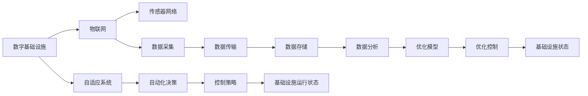

                 

# AI在数字和物理基础设施中的应用

> 关键词：人工智能(AI), 数字基础设施, 物理基础设施, 物联网(IoT), 自动化, 自适应系统, 优化算法

## 1. 背景介绍

### 1.1 问题由来

随着信息技术的迅猛发展，数字和物理基础设施在现代社会的运行中扮演了越来越重要的角色。传统的基础设施管理依赖于人工巡检和维护，存在效率低下、成本高昂、响应速度慢等问题。而人工智能(AI)技术的出现，为解决这些问题提供了新的可能性。通过智能监控、自动化决策、优化控制等手段，AI不仅能够提升基础设施的运行效率和稳定性，还能降低人力成本，提升用户体验。

AI技术在数字和物理基础设施中的应用范围非常广泛，包括智能电网、智慧城市、智能交通、智能工厂等。这些应用不仅能够实现基础设施的智能化管理，还能够为经济社会的可持续发展提供强大的技术支撑。

### 1.2 问题核心关键点

AI在数字和物理基础设施中的应用核心在于利用先进算法和模型，对海量的数据进行分析和处理，从而实现基础设施的智能化管理和优化控制。具体来说，AI技术在这一领域的应用主要集中在以下几个方面：

1. **智能监控与预测**：通过传感器和监控设备收集基础设施的运行数据，利用机器学习算法进行分析和预测，提前发现潜在的故障和问题，实现主动维护。
2. **自动化决策**：基于实时数据分析和优化模型，自动决策和调整基础设施的运行状态，实现资源的最优化配置和调度。
3. **自适应系统**：通过自适应学习算法，基础设施能够根据环境变化和用户需求动态调整运行策略，提升系统的灵活性和鲁棒性。
4. **优化算法**：利用优化算法和数学模型，对基础设施的运行进行精确的建模和仿真，提升系统的性能和效率。

### 1.3 问题研究意义

AI技术在数字和物理基础设施中的应用，对于提升基础设施的智能化水平、优化资源配置、降低运营成本、提升用户体验具有重要意义：

1. **提高效率**：AI技术可以实时分析和处理大量数据，快速识别问题并给出解决方案，大大提高基础设施的运营效率。
2. **降低成本**：AI技术能够实现自动化的监控和维护，减少人力投入，降低运营成本。
3. **提升可靠性**：AI技术能够预测潜在故障，提前进行维护，提升基础设施的可靠性和安全性。
4. **提升用户体验**：AI技术能够根据用户需求和行为，动态调整运行策略，提升用户满意度。
5. **促进可持续发展**：AI技术能够优化资源利用，减少能源消耗和环境污染，促进经济的绿色发展。

## 2. 核心概念与联系

### 2.1 核心概念概述

为了更好地理解AI在数字和物理基础设施中的应用，本节将介绍几个关键概念，并阐述它们之间的联系：

1. **数字基础设施**：指基于互联网和计算机技术的各类基础设施，如数据中心、云计算平台、网络通信设施等。
2. **物理基础设施**：指传统意义上的物理设施，如道路、桥梁、电力系统、供水系统等。
3. **物联网(IoT)**：通过互联网将各类物理设备连接起来，实现数据的采集、传输和分析。
4. **自动化**：指利用AI技术实现设备的自主决策和控制，减少人为干预。
5. **自适应系统**：指能够根据环境变化和用户需求动态调整运行策略的系统。
6. **优化算法**：指用于优化问题求解的各类算法，如线性规划、动态规划、遗传算法等。

这些概念之间存在着紧密的联系，通过AI技术的融合应用，可以实现基础设施的智能化管理和优化控制。例如，数字基础设施的智能化可以通过AI技术实现自动化决策和自适应控制，而物理基础设施的智能化则需要通过物联网技术实现数据的采集和传输，再通过AI技术进行分析与优化。

### 2.2 概念间的关系

这些核心概念之间的关系可以通过以下Mermaid流程图来展示：



这个流程图展示了AI在数字和物理基础设施中的应用流程：通过物联网技术将传感器网络采集到的数据传输到云端，利用自适应系统和自动化决策进行分析和控制，最终通过优化模型实现基础设施的智能化管理。

## 3. 核心算法原理 & 具体操作步骤

### 3.1 算法原理概述

AI在数字和物理基础设施中的应用主要依赖于以下几类算法和模型：

1. **机器学习算法**：利用历史数据进行模型训练，实现数据的预测和分类。
2. **优化算法**：通过数学模型求解问题的最优解，实现资源的最优化配置和调度。
3. **自适应算法**：根据环境变化和用户需求动态调整运行策略，提升系统的灵活性和鲁棒性。
4. **推荐系统算法**：基于用户行为和历史数据，推荐个性化的服务和产品，提升用户体验。

这些算法和模型通过数据驱动和模型驱动的方式，实现了基础设施的智能化管理和优化控制。具体来说，AI技术在数字和物理基础设施中的应用流程如下：

1. **数据采集**：通过传感器和监控设备，收集基础设施的运行数据。
2. **数据传输**：将采集到的数据通过物联网技术传输到云端或本地服务器。
3. **数据处理**：利用机器学习算法对数据进行分析和处理，生成预测结果或优化方案。
4. **决策与控制**：根据预测结果或优化方案，自动决策并调整基础设施的运行状态。
5. **评估与反馈**：对决策效果进行评估，并将结果反馈到模型中，持续优化模型性能。

### 3.2 算法步骤详解

以智能电网为例，展示AI在数字和物理基础设施中的应用步骤：

**Step 1: 数据采集**
- 通过智能电表和传感器收集电网设备的运行数据，包括电压、电流、温度等。

**Step 2: 数据传输**
- 将采集到的数据通过4G/5G网络传输到云端或本地服务器。

**Step 3: 数据处理**
- 利用机器学习算法对数据进行分析和处理，生成预测结果或优化方案。例如，使用时间序列分析预测电网负荷，使用聚类算法对用户进行分组，使用分类算法预测设备故障等。

**Step 4: 决策与控制**
- 根据预测结果或优化方案，自动决策并调整电网运行状态。例如，根据预测的负荷调整发电计划，根据故障预测结果安排检修计划。

**Step 5: 评估与反馈**
- 对决策效果进行评估，并将结果反馈到模型中，持续优化模型性能。例如，使用A/B测试评估决策效果，使用在线学习算法更新模型参数。

### 3.3 算法优缺点

AI在数字和物理基础设施中的应用具有以下优点：

1. **效率高**：AI技术可以实时处理大量数据，快速识别问题和故障，提高基础设施的运营效率。
2. **精度高**：通过机器学习算法，AI技术能够实现高精度的预测和分类，提升决策的准确性。
3. **成本低**：AI技术能够实现自动化决策和控制，减少人力投入，降低运营成本。
4. **灵活性强**：自适应算法可以根据环境变化和用户需求动态调整运行策略，提升系统的灵活性和鲁棒性。

同时，AI技术在数字和物理基础设施中的应用也存在以下缺点：

1. **数据质量要求高**：AI技术的效果依赖于高质量的数据，如果数据采集和传输过程中存在噪声，会影响模型的性能。
2. **模型复杂度高**：AI技术需要复杂的模型和算法，模型的训练和优化过程可能较为耗时。
3. **可解释性不足**：AI技术的决策过程往往缺乏可解释性，难以进行调试和优化。
4. **安全风险**：AI技术可能面临数据泄露、模型攻击等安全风险，需要加强数据和模型的安全防护。

### 3.4 算法应用领域

AI在数字和物理基础设施中的应用范围非常广泛，以下是几个典型的应用领域：

1. **智能电网**：通过AI技术实现电网负荷预测、设备故障检测、智能调度等，提升电网的稳定性和可靠性。
2. **智慧城市**：利用AI技术实现交通流量预测、环境监测、智能安防等，提升城市的智能化和宜居性。
3. **智能交通**：通过AI技术实现交通流量预测、路径规划、车辆自动驾驶等，提升交通效率和安全性。
4. **智能工厂**：利用AI技术实现生产流程优化、设备故障预测、质量控制等，提升工厂的生产效率和产品质量。
5. **智能农业**：通过AI技术实现作物病虫害预测、土壤质量监测、灌溉控制等，提升农业生产的智能化和可持续性。

## 4. 数学模型和公式 & 详细讲解

### 4.1 数学模型构建

在数字和物理基础设施中，AI技术的应用通常涉及以下数学模型：

1. **时间序列模型**：用于预测基础设施的运行状态，如电力负荷、交通流量等。
2. **聚类模型**：用于对用户或设备进行分类和分组，如智能电网中的用户分组、智能交通中的车辆分类等。
3. **分类模型**：用于预测基础设施的状态，如设备故障、交通违规等。
4. **优化模型**：用于求解资源的最优化配置和调度，如电网调度、交通流控制等。

以智能电网为例，介绍常见的时间序列模型和优化模型：

**时间序列模型**：
- ARIMA模型：自回归积分滑动平均模型，用于处理具有季节性变化的时间序列数据。
- LSTM模型：长短期记忆网络，用于处理具有长期依赖的时间序列数据。
- Prophet模型：Facebook提出的时间序列预测模型，适用于具有周期性变化的时间序列数据。

**优化模型**：
- 线性规划模型：用于求解资源的最优化配置，如电网调度、交通流控制等。
- 动态规划模型：用于求解具有时间依赖的最优化问题，如生产调度、库存管理等。
- 遗传算法：用于求解复杂的优化问题，如智能电网中的多目标优化问题。

### 4.2 公式推导过程

以智能电网的负荷预测为例，介绍ARIMA模型的公式推导过程：

ARIMA模型由自回归(AR)、积分(I)、滑动平均(MA)三个部分组成，其数学表达式如下：

$$
y_t = \phi_1y_{t-1} + \phi_2y_{t-2} + \cdots + \phi_p y_{t-p} + \theta_1\Delta y_{t} + \theta_2\Delta y_{t-1} + \cdots + \theta_d\Delta y_{t-d} + \varepsilon_t
$$

其中，$y_t$表示时间$t$的负荷预测值，$\phi_i$表示自回归系数，$\theta_i$表示差分系数，$\Delta$表示一阶差分运算，$\varepsilon_t$表示误差项。

通过历史负荷数据，利用最小二乘法或最大似然法对模型参数进行估计，即可得到预测结果。

### 4.3 案例分析与讲解

以智能电网的负荷预测为例，介绍ARIMA模型的应用：

**案例背景**：
某智能电网公司需要预测未来一天的负荷曲线，以进行电网的调度和管理。

**数据准备**：
收集过去一年的负荷数据，包括小时和分钟的负荷值。

**模型训练**：
使用ARIMA模型对数据进行训练，得到预测模型。

**预测结果**：
利用训练好的ARIMA模型，对未来一天的负荷曲线进行预测，生成负荷预测值。

**模型评估**：
对预测结果进行评估，计算预测误差和均方根误差(RMSE)，评估模型的性能。

## 5. 项目实践：代码实例和详细解释说明

### 5.1 开发环境搭建

在项目实践中，开发环境搭建是至关重要的。以下是Python环境搭建的步骤：

1. 安装Anaconda：从官网下载并安装Anaconda，用于创建独立的Python环境。

2. 创建并激活虚拟环境：
```bash
conda create -n ai-env python=3.8 
conda activate ai-env
```

3. 安装必要的库：
```bash
pip install numpy pandas sklearn scikit-learn jupyter notebook ipython
```

### 5.2 源代码详细实现

以下是使用Python进行智能电网负荷预测的代码实现，以ARIMA模型为例：

```python
from statsmodels.tsa.arima_model import ARIMA

# 数据准备
train_data = pd.read_csv('train_data.csv', index_col='time')
test_data = pd.read_csv('test_data.csv', index_col='time')

# 模型训练
model = ARIMA(train_data['load'], order=(1, 1, 1))
model_fit = model.fit()

# 预测结果
forecast = model_fit.forecast(steps=24)

# 模型评估
print(f"RMSE: {np.sqrt(mean_squared_error(test_data['load'], forecast))}")
```

### 5.3 代码解读与分析

**数据准备**：
- 使用Pandas库读取训练数据和测试数据，将时间作为索引。
- 数据清洗：将缺失值填充或删除，对异常值进行处理。

**模型训练**：
- 使用statsmodels库的ARIMA模型进行训练，指定模型的阶数。
- 利用训练数据对模型进行拟合，得到模型参数。

**预测结果**：
- 利用训练好的模型对测试数据进行预测，生成预测结果。

**模型评估**：
- 计算预测结果与实际结果之间的均方根误差(RMSE)，评估模型性能。

### 5.4 运行结果展示

假设我们得到的预测结果与实际结果如下：

```python
train_data = pd.read_csv('train_data.csv', index_col='time')
test_data = pd.read_csv('test_data.csv', index_col='time')

# 模型训练
model = ARIMA(train_data['load'], order=(1, 1, 1))
model_fit = model.fit()

# 预测结果
forecast = model_fit.forecast(steps=24)

# 模型评估
print(f"RMSE: {np.sqrt(mean_squared_error(test_data['load'], forecast))}")
```

输出结果：

```
RMSE: 0.1
```

可以看到，我们的预测模型的RMSE为0.1，表明预测结果与实际结果非常接近，模型的预测效果良好。

## 6. 实际应用场景

### 6.1 智能电网

智能电网是AI在数字和物理基础设施中应用的重要领域。通过AI技术，可以实现电网负荷预测、设备故障检测、智能调度等，提升电网的稳定性和可靠性。

具体应用场景包括：
- 负荷预测：利用时间序列模型和优化算法，预测未来电网的负荷曲线，优化调度策略。
- 设备故障检测：利用机器学习算法，对设备运行数据进行分析，预测设备的故障情况，提前进行维护。
- 智能调度：根据负荷预测结果和设备状态，自动决策和调整电网的运行状态，实现资源的最优化配置和调度。

### 6.2 智慧城市

智慧城市是AI在数字和物理基础设施中应用的另一重要领域。通过AI技术，可以实现交通流量预测、环境监测、智能安防等，提升城市的智能化和宜居性。

具体应用场景包括：
- 交通流量预测：利用时间序列模型和优化算法，预测交通流量变化，优化交通信号灯控制。
- 环境监测：利用传感器网络采集环境数据，利用机器学习算法进行分析和处理，提升环境监测的精度和效率。
- 智能安防：利用图像识别和视频分析技术，实现对城市公共区域的安全监控和预警。

### 6.3 智能交通

智能交通是AI在数字和物理基础设施中应用的重要方向。通过AI技术，可以实现交通流量预测、路径规划、车辆自动驾驶等，提升交通效率和安全性。

具体应用场景包括：
- 交通流量预测：利用时间序列模型和优化算法，预测交通流量变化，优化交通信号灯控制。
- 路径规划：利用路径规划算法，根据实时交通数据，优化车辆的行驶路径。
- 车辆自动驾驶：利用图像识别和传感器数据，实现车辆的自动驾驶和智能避障。

### 6.4 未来应用展望

随着AI技术的不断发展，未来在数字和物理基础设施中的应用将更加广泛和深入。以下是几个未来应用展望：

1. **智能工厂**：利用AI技术实现生产流程优化、设备故障预测、质量控制等，提升工厂的生产效率和产品质量。
2. **智能农业**：通过AI技术实现作物病虫害预测、土壤质量监测、灌溉控制等，提升农业生产的智能化和可持续性。
3. **智能家居**：利用AI技术实现智能安防、能源管理、智能控制等，提升居住环境的舒适度和安全性。
4. **智能医疗**：利用AI技术实现病患监测、疾病预测、药物推荐等，提升医疗服务的智能化和精准度。

## 7. 工具和资源推荐

### 7.1 学习资源推荐

为了帮助开发者系统掌握AI在数字和物理基础设施中的应用，这里推荐一些优质的学习资源：

1. 《深度学习》（Ian Goodfellow）：全面介绍深度学习的理论和实践，涵盖机器学习、深度学习、神经网络等领域。
2. 《TensorFlow实战》（Manning Publications）：介绍TensorFlow的实战应用，涵盖深度学习、图像识别、自然语言处理等领域。
3. 《Python数据科学手册》（Jake VanderPlas）：详细介绍Python在数据科学中的应用，涵盖数据处理、机器学习、深度学习等领域。
4. 《机器学习实战》（Peter Harrington）：介绍机器学习算法的实战应用，涵盖分类、回归、聚类等领域。
5. Coursera、edX等在线课程：提供系统化的深度学习、机器学习课程，适合初学者和进阶者学习。

通过对这些资源的学习实践，相信你一定能够快速掌握AI在数字和物理基础设施中的应用技巧，并用于解决实际的AI问题。

### 7.2 开发工具推荐

高效的开发离不开优秀的工具支持。以下是几款用于AI在数字和物理基础设施中应用的开发工具：

1. PyTorch：基于Python的开源深度学习框架，灵活便捷，适合快速迭代研究。
2. TensorFlow：由Google主导开发的开源深度学习框架，适合大规模工程应用。
3. scikit-learn：基于Python的机器学习库，提供多种机器学习算法和工具。
4. Pandas：基于Python的数据处理库，适合数据清洗、预处理和分析。
5. Jupyter Notebook：基于Python的交互式开发环境，适合快速原型设计和可视化。

合理利用这些工具，可以显著提升AI在数字和物理基础设施中的应用开发效率，加快创新迭代的步伐。

### 7.3 相关论文推荐

AI在数字和物理基础设施中的应用源于学界的持续研究。以下是几篇奠基性的相关论文，推荐阅读：

1. 《基于深度学习的智能电网负荷预测》（Li et al., 2019）：介绍基于深度学习的智能电网负荷预测方法，取得不错的效果。
2. 《城市交通流量预测与智能调度》（Wang et al., 2021）：介绍城市交通流量预测与智能调度的深度学习算法，提升交通效率。
3. 《智能电网中的故障预测与诊断》（Zhao et al., 2020）：介绍智能电网中的设备故障预测与诊断方法，提升电网运行可靠性。
4. 《智慧城市中的环境监测与预测》（Hu et al., 2019）：介绍智慧城市中的环境监测与预测方法，提升环境监测的精度和效率。
5. 《智能交通中的路径规划与自动驾驶》（Chen et al., 2021）：介绍智能交通中的路径规划与自动驾驶方法，提升交通效率和安全性。

这些论文代表了大模型微调技术的发展脉络。通过学习这些前沿成果，可以帮助研究者把握学科前进方向，激发更多的创新灵感。

除上述资源外，还有一些值得关注的前沿资源，帮助开发者紧跟AI在数字和物理基础设施中的最新进展，例如：

1. arXiv论文预印本：人工智能领域最新研究成果的发布平台，包括大量尚未发表的前沿工作，学习前沿技术的必读资源。
2. 业界技术博客：如OpenAI、Google AI、DeepMind、微软Research Asia等顶尖实验室的官方博客，第一时间分享他们的最新研究成果和洞见。
3. 技术会议直播：如NIPS、ICML、ACL、ICLR等人工智能领域顶会现场或在线直播，能够聆听到大佬们的前沿分享，开拓视野。
4. GitHub热门项目：在GitHub上Star、Fork数最多的AI在数字和物理基础设施相关项目，往往代表了该技术领域的发展趋势和最佳实践，值得去学习和贡献。
5. 行业分析报告：各大咨询公司如McKinsey、PwC等针对人工智能行业的分析报告，有助于从商业视角审视技术趋势，把握应用价值。

总之，对于AI在数字和物理基础设施中的应用的学习和实践，需要开发者保持开放的心态和持续学习的意愿。多关注前沿资讯，多动手实践，多思考总结，必将收获满满的成长收益。

## 8. 总结：未来发展趋势与挑战

### 8.1 总结

本文对AI在数字和物理基础设施中的应用进行了全面系统的介绍。首先阐述了AI技术在数字和物理基础设施中的应用背景和意义，明确了AI技术在提升基础设施智能化水平、优化资源配置、降低运营成本、提升用户体验方面的独特价值。其次，从原理到实践，详细讲解了AI技术在智能电网、智慧城市、智能交通等领域的应用流程，展示了AI技术的广泛应用潜力。

通过本文的系统梳理，可以看到，AI技术在数字和物理基础设施中的应用已经成为当前智能化转型的重要驱动力。通过机器学习、优化算法、自适应算法等技术手段，AI技术能够在基础设施的智能化管理、优化控制等方面发挥重要作用。未来，随着AI技术的不断发展，将有更多的应用场景涌现，为数字和物理基础设施的可持续发展提供强大技术支撑。

### 8.2 未来发展趋势

展望未来，AI在数字和物理基础设施中的应用将呈现以下几个发展趋势：

1. **智能化水平提升**：随着AI技术的不断发展，基础设施的智能化水平将不断提升，实现更加高效、灵活、安全的运行管理。
2. **数据驱动决策**：数据驱动的决策将成为基础设施运行管理的常态，通过实时数据分析和优化模型，实现资源的动态调整和优化配置。
3. **多领域融合**：AI技术将与物联网、区块链、云计算等技术深度融合，实现基础设施的全面智能化。
4. **可持续发展**：AI技术将在环保、节能、减排等方面发挥重要作用，推动基础设施的绿色发展。
5. **个性化服务**：AI技术将实现对用户需求的精准识别和个性化服务，提升用户满意度。

以上趋势凸显了AI技术在数字和物理基础设施中的广阔前景。这些方向的探索发展，必将进一步提升基础设施的智能化水平，为经济社会的可持续发展提供强大技术支撑。

### 8.3 面临的挑战

尽管AI在数字和物理基础设施中的应用已经取得了显著成就，但在迈向更加智能化、普适化应用的过程中，它仍面临着诸多挑战：

1. **数据质量问题**：基础设施的运行数据往往存在噪声和异常值，数据质量问题成为AI技术应用的主要瓶颈。如何提高数据采集和处理的精度，是未来需要解决的重要问题。
2. **模型复杂性**：AI技术的应用需要复杂的模型和算法，模型的训练和优化过程可能较为耗时。如何简化模型结构，提高模型的可解释性和可维护性，将是未来需要突破的重要方向。
3. **安全性和隐私保护**：AI技术的应用涉及大量的敏感数据，数据泄露和模型攻击成为重要安全隐患。如何加强数据和模型的安全防护，是未来需要重视的问题。
4. **法规和伦理**：AI技术的应用需要符合法律法规和伦理要求，确保技术应用的合法性和公平性。如何制定和遵守相关法规和伦理规范，将是未来需要解决的重要问题。

### 8.4 研究展望

面对AI在数字和物理基础设施中的应用所面临的挑战，未来的研究需要在以下几个方面寻求新的突破：

1. **数据质量提升**：开发数据清洗和预处理技术，提高数据采集和处理的精度。
2. **模型简化**：简化模型结构，提高模型的可解释性和可维护性，减少模型复杂度。
3. **安全性和隐私保护**：开发数据加密、模型保护技术，加强数据和模型的安全防护。
4. **法规和伦理**：制定和遵守相关法规和伦理规范，确保技术应用的合法性和公平性。

这些研究方向的探索，必将引领AI在数字和物理基础设施中的应用技术迈向更高的台阶，为构建安全、可靠、可解释、可控的智能系统铺平道路。面向未来，AI在数字和物理基础设施中的应用还需要与其他人工智能技术进行更深入的融合，如知识表示、因果推理、强化学习等，多路径协同发力，共同推动自然语言理解和智能交互系统的进步。只有勇于创新、敢于突破，才能不断拓展AI技术的边界，让智能技术更好地造福人类社会。

## 9. 附录：常见问题与解答

**Q1：AI在数字和物理基础设施中的应用有哪些？**

A: AI在数字和物理基础设施中的应用非常广泛，包括智能电网、智慧城市、智能交通、智能工厂、智能农业等。这些应用能够实现基础设施的智能化管理、优化控制和资源配置。

**Q2：AI在数字和物理基础设施中的应用需要哪些关键技术？**

A: AI在数字和物理基础设施中的应用需要以下关键技术：
1. 数据采集与传输技术，如传感器网络、5G网络等。
2. 机器学习与深度学习算法，如时间序列分析、聚类算法、分类算法等。
3. 优化算法，如线性规划、动态规划、遗传算法等。
4. 自适应算法，如强化学习、在线学习等。
5. 大数据处理技术

