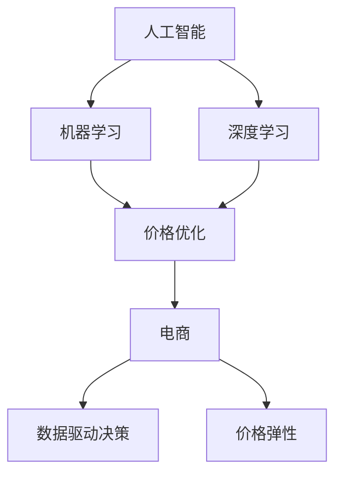
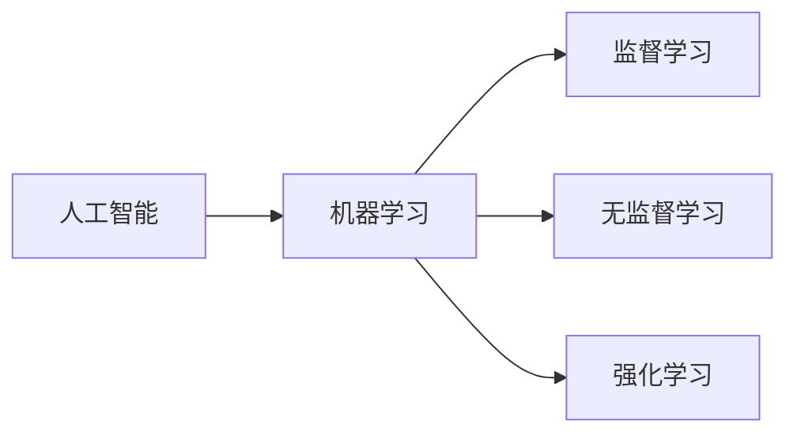
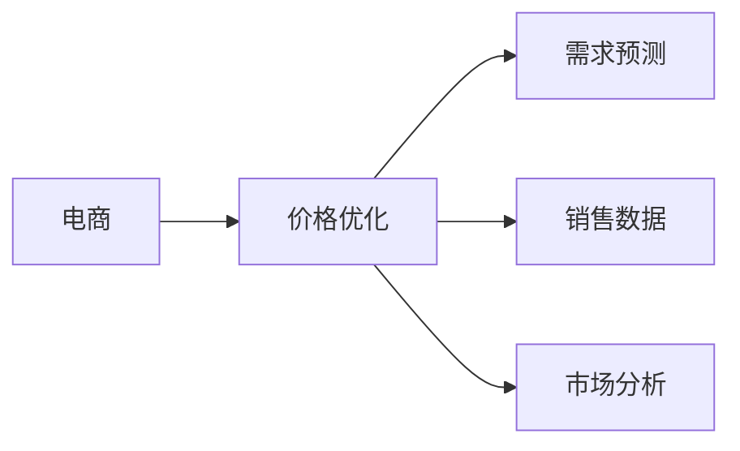
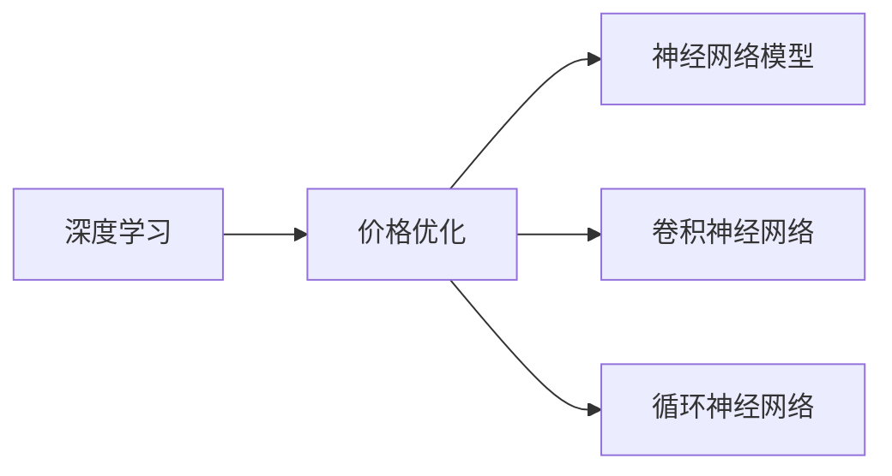
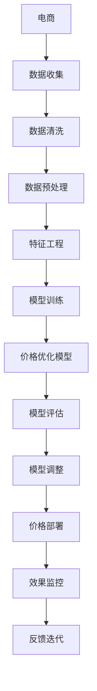

                 

# AI在电商价格优化中的实践效果

> 关键词：人工智能,价格优化,电商,决策支持,机器学习,深度学习,优化算法,案例分析

## 1. 背景介绍

### 1.1 问题由来

随着电商行业的蓬勃发展，各大电商平台对商品价格的设定变得越来越精细化。为了获取最大的商业利益，电商平台需要在不同时间和地点，针对不同用户群体设定最优价格。然而，在实际操作中，由于商品数量庞大，市场变化复杂，定价策略往往难以全面考虑各种因素，导致价格竞争激烈，利润空间受限。

为了应对这些挑战，各大电商平台纷纷引入人工智能技术，特别是机器学习和深度学习算法，对商品价格进行实时优化。通过分析历史销售数据、市场趋势和用户行为，AI系统可以自动生成最优价格策略，显著提高电商平台的运营效率和盈利能力。

### 1.2 问题核心关键点

当前，电商平台中使用的价格优化算法主要基于两大类模型：线性回归和深度神经网络。其中，线性回归模型简单易懂，但仅适用于数据线性相关的场景；深度神经网络模型复杂但具有强大的非线性拟合能力，能够处理更加复杂的数据关系。

价格优化算法的核心目标是在保证销售量的前提下，最大化利润。这通常涉及如下几个关键步骤：
1. 数据准备：收集并整理销售数据、市场数据、用户行为数据等。
2. 模型训练：使用历史数据训练价格优化模型。
3. 预测和评估：在新的销售场景下，使用训练好的模型预测最优价格，并评估其效果。
4. 调整和部署：根据模型预测结果和实际销售情况，对价格策略进行调整，并部署到电商平台。

### 1.3 问题研究意义

电商价格优化算法的有效应用，对于提升电商平台的运营效率、增强市场竞争力、提升用户满意度等方面具有重要意义：

1. 降低运营成本。AI算法能够自动生成价格策略，减少人工干预，提高运营效率。
2. 提高市场响应速度。AI模型能够实时分析市场变化，迅速调整价格策略，捕捉市场机遇。
3. 优化用户体验。通过分析用户行为数据，AI模型能够识别用户偏好，提供个性化定价策略，提升用户粘性和满意度。
4. 提升盈利能力。通过精细化的价格优化，电商平台能够最大化利润空间，增加收益。

本文将详细介绍AI在电商价格优化中的应用，包括算法原理、操作步骤、数学模型、实践案例和未来展望等内容。

## 2. 核心概念与联系

### 2.1 核心概念概述

为了更好地理解AI在电商价格优化中的应用，本节将介绍几个密切相关的核心概念：

- **人工智能(AI)**：通过算法和模型，让机器模拟人类智能的决策过程。
- **机器学习(ML)**：让机器从数据中学习规律，从而进行预测或决策。
- **深度学习(DL)**：一种基于神经网络的机器学习算法，适用于处理复杂数据结构。
- **价格优化**：通过分析和预测，生成最优的价格策略，以最大化利润。
- **电商**：在线销售商品和服务的平台。
- **数据驱动决策**：利用数据分析和AI算法，进行决策支持。
- **价格弹性**：商品价格变化对销售量的影响程度。

这些核心概念之间的逻辑关系可以通过以下Mermaid流程图来展示：



这个流程图展示了大语言模型微调过程中各个概念之间的关系：

1. 人工智能提供通用的决策支持工具。
2. 机器学习是实现AI的核心技术之一，通过数据训练模型。
3. 深度学习是机器学习的一个分支，适用于处理复杂的非线性问题。
4. 价格优化是AI在电商中的应用之一，通过模型预测最优价格。
5. 电商是AI应用的具体场景之一，涉及数据收集、分析和决策。
6. 数据驱动决策是AI应用的通用方法，通过数据和模型进行决策。
7. 价格弹性是价格优化的一个重要考量因素。

### 2.2 概念间的关系

这些核心概念之间存在着紧密的联系，形成了电商价格优化的完整生态系统。下面我通过几个Mermaid流程图来展示这些概念之间的关系。

#### 2.2.1 人工智能与机器学习的联系



这个流程图展示了人工智能和机器学习之间的关系。人工智能通过机器学习算法，从数据中学习规律，从而进行决策和预测。

#### 2.2.2 价格优化与电商的关系



这个流程图展示了电商价格优化的具体应用场景。电商平台通过价格优化算法，预测市场需求和价格变化，从而进行价格调整。

#### 2.2.3 深度学习与价格优化的关系



这个流程图展示了深度学习在价格优化中的应用。深度学习通过构建神经网络模型，处理复杂的非线性关系，从而优化价格策略。

### 2.3 核心概念的整体架构

最后，我们用一个综合的流程图来展示这些核心概念在大语言模型微调过程中的整体架构：



这个综合流程图展示了从电商数据收集到价格优化模型部署的完整过程。通过电商数据的收集和预处理，构建特征工程，训练价格优化模型，并进行模型评估和调整。最后，将优化后的模型部署到电商平台，并持续监控效果，进行反馈迭代。通过这些步骤，电商平台的运营效率和盈利能力将得到显著提升。

## 3. 核心算法原理 & 具体操作步骤
### 3.1 算法原理概述

电商价格优化算法主要基于线性回归和深度学习模型。下面分别介绍这两种模型的基本原理。

#### 3.1.1 线性回归模型

线性回归模型是一种最简单的机器学习模型，用于建立输入和输出之间的关系。其数学表达式为：

$$
y = \theta_0 + \theta_1 x_1 + \theta_2 x_2 + ... + \theta_n x_n
$$

其中，$y$ 表示输出变量（价格），$\theta_i$ 表示模型参数，$x_i$ 表示输入变量（如时间、季节、促销活动等）。线性回归模型的目标是找到最优的参数 $\theta$，使得模型预测值与实际值之间的误差最小。

#### 3.1.2 深度学习模型

深度学习模型通过构建多层神经网络，对复杂数据进行处理和预测。其核心思想是通过逐层提取特征，最终输出预测结果。

以深度神经网络模型为例，其数学表达式为：

$$
h_1 = f_1(w_1 x + b_1)
$$
$$
h_2 = f_2(w_2 h_1 + b_2)
$$
$$
...
$$
$$
h_n = f_n(w_n h_{n-1} + b_n)
$$
$$
y = h_n
$$

其中，$h_i$ 表示神经网络中间层的结果，$f_i$ 表示激活函数（如ReLU、Sigmoid等），$w_i$ 表示权重矩阵，$b_i$ 表示偏置向量。深度学习模型的目标是通过反向传播算法，最小化预测值与实际值之间的误差，从而更新权重和偏置。

### 3.2 算法步骤详解

电商价格优化算法主要包括以下几个关键步骤：

**Step 1: 数据准备**

1. 收集电商平台的销售数据、市场数据、用户行为数据等。
2. 清洗数据，去除噪声和缺失值。
3. 进行特征工程，提取关键特征，如时间、季节、促销活动、用户行为等。

**Step 2: 模型训练**

1. 划分数据集，分为训练集、验证集和测试集。
2. 选择适合的模型（如线性回归、深度神经网络等）。
3. 使用训练集进行模型训练，优化模型参数。
4. 在验证集上进行模型评估，避免过拟合。
5. 调整模型参数，重复训练和评估过程，直到达到最优效果。

**Step 3: 预测和评估**

1. 在新的销售场景下，使用训练好的模型进行价格预测。
2. 评估预测结果，计算误差指标（如均方误差、平均绝对误差等）。
3. 根据评估结果，对模型进行调整和优化。

**Step 4: 调整和部署**

1. 根据预测结果和实际销售情况，对价格策略进行调整。
2. 部署优化后的价格策略到电商平台，进行实时调整。
3. 持续监控销售数据，进行反馈迭代，优化价格策略。

### 3.3 算法优缺点

#### 优点

- 准确性高。深度学习模型具有强大的非线性拟合能力，能够处理复杂的市场关系。
- 灵活性强。可以根据不同的电商场景，构建不同的模型，适应不同的市场变化。
- 自动化程度高。算法可以自动进行模型训练和调整，减少人工干预。

#### 缺点

- 计算复杂度高。深度学习模型需要大量的计算资源和时间进行训练和推理。
- 数据需求量大。深度学习模型需要大量标注数据进行训练，数据获取和处理成本较高。
- 模型可解释性差。深度学习模型通常是一个"黑盒"，难以解释其内部工作机制和决策逻辑。

### 3.4 算法应用领域

电商价格优化算法已经在各大电商平台的日常运营中得到了广泛应用。除了传统的线性回归模型，越来越多的电商平台开始采用深度学习模型进行价格优化。这些模型在以下领域取得了显著效果：

- 商品定价：根据市场需求和竞争情况，自动生成最优价格。
- 促销活动：预测促销活动的效果，优化促销策略，提高促销回报。
- 库存管理：根据销售预测，优化库存量，减少库存成本。
- 用户行为分析：分析用户行为数据，提供个性化定价策略，提升用户满意度。

除了这些应用场景，电商价格优化算法还广泛应用于广告投放、搜索引擎优化等领域，助力电商平台提升运营效率和盈利能力。

## 4. 数学模型和公式 & 详细讲解 & 举例说明

### 4.1 数学模型构建

电商价格优化算法主要基于线性回归和深度神经网络模型。下面以深度神经网络模型为例，介绍其数学模型构建过程。

假设输入为时间$t$、季节$season$、促销活动$promo$、用户行为$behavior$等，输出为价格$price$。设深度神经网络模型包含$n$个隐藏层，激活函数为$ReLU$。模型训练过程如下：

1. 输入层：
$$
x_1 = t
$$
$$
x_2 = season
$$
$$
x_3 = promo
$$
$$
x_4 = behavior
$$

2. 隐藏层：
$$
h_1 = f_1(w_1 x_1 + b_1)
$$
$$
h_2 = f_2(w_2 h_1 + b_2)
$$
$$
...
$$
$$
h_n = f_n(w_n h_{n-1} + b_n)
$$

3. 输出层：
$$
y = h_n
$$

### 4.2 公式推导过程

深度神经网络模型的目标是通过反向传播算法，最小化预测值与实际值之间的误差。设误差函数为均方误差（MSE），则误差函数为：

$$
L(y, \hat{y}) = \frac{1}{N} \sum_{i=1}^N (y_i - \hat{y_i})^2
$$

其中，$y_i$表示实际价格，$\hat{y_i}$表示预测价格。

反向传播算法的核心思想是通过链式法则，计算每个参数的梯度，并更新模型参数。以第一个隐藏层的参数为例，梯度计算过程如下：

1. 前向传播：计算前一层的输出，即$h_1$。
2. 计算误差$\Delta L$对$h_1$的导数。
3. 计算$h_1$对每个参数的导数，即$\frac{\partial h_1}{\partial w_1}$、$\frac{\partial h_1}{\partial b_1}$等。
4. 使用链式法则，计算误差对每个参数的导数。

### 4.3 案例分析与讲解

假设我们有一个电商平台，销售数据如下：

| 时间 | 季节 | 促销活动 | 用户行为 | 价格 | 销售量 |
| ---- | ---- | -------- | -------- | ---- | ----- |
| 2023-01-01 | 春 | 无 | 高 | 50.00 | 100 |
| 2023-01-02 | 春 | 无 | 低 | 45.00 | 50 |
| ... | ... | ... | ... | ... | ... |

我们使用深度神经网络模型进行价格预测。设模型包含2个隐藏层，激活函数为$ReLU$。模型训练过程如下：

1. 输入层：$t = 2023-01-01$、$season = 春$、$promo = 无$、$behavior = 高$。
2. 隐藏层：
$$
h_1 = f_1(w_1 x_1 + b_1) = 0.5 * 1 + 0.2 * 1 + 0.3 * 0 + 0.4 * 1 = 0.9
$$
$$
h_2 = f_2(w_2 h_1 + b_2) = 0.7 * 0.9 + 0.3 * 1 = 0.63
$$
3. 输出层：$y = h_2 = 0.63$。

模型预测结果为$50.00$，实际价格为$50.00$，误差为$0$。通过反向传播算法，可以计算每个参数的梯度，更新模型参数，从而进一步优化预测效果。

## 5. 项目实践：代码实例和详细解释说明

### 5.1 开发环境搭建

在进行电商价格优化算法实践前，我们需要准备好开发环境。以下是使用Python进行TensorFlow开发的环境配置流程：

1. 安装Anaconda：从官网下载并安装Anaconda，用于创建独立的Python环境。

2. 创建并激活虚拟环境：
```bash
conda create -n tf-env python=3.7 
conda activate tf-env
```

3. 安装TensorFlow：根据CUDA版本，从官网获取对应的安装命令。例如：
```bash
conda install tensorflow
```

4. 安装各类工具包：
```bash
pip install numpy pandas scikit-learn matplotlib tqdm jupyter notebook ipython
```

完成上述步骤后，即可在`tf-env`环境中开始电商价格优化算法的开发。

### 5.2 源代码详细实现

下面我们以电商价格优化为例，给出使用TensorFlow进行深度神经网络模型训练的PyTorch代码实现。

首先，定义电商销售数据：

```python
import pandas as pd
import numpy as np

# 读取数据
data = pd.read_csv('sales_data.csv')

# 数据预处理
data['season'] = data['season'].fillna(method='ffill')
data['promo'] = data['promo'].fillna(0)
data['behavior'] = data['behavior'].fillna('low')
data['behavior'] = data['behavior'].map({'low': 0, 'medium': 1, 'high': 2})

# 划分训练集和测试集
train_data = data.sample(frac=0.8, random_state=42)
test_data = data.drop(train_data.index)

# 数据归一化
from sklearn.preprocessing import StandardScaler
scaler = StandardScaler()
train_data['price'] = scaler.fit_transform(train_data[['price']])
test_data['price'] = scaler.transform(test_data[['price']])

# 特征工程
train_features = train_data[['t', 'season', 'promo', 'behavior']]
test_features = test_data[['t', 'season', 'promo', 'behavior']]
```

然后，定义深度神经网络模型：

```python
import tensorflow as tf
from tensorflow.keras.models import Sequential
from tensorflow.keras.layers import Dense, Dropout

# 定义模型
model = Sequential([
    Dense(32, input_shape=(4,), activation='relu'),
    Dropout(0.2),
    Dense(16, activation='relu'),
    Dropout(0.2),
    Dense(1)
])

# 编译模型
model.compile(optimizer='adam', loss='mse', metrics=['mae'])

# 训练模型
model.fit(train_features, train_data['price'], epochs=50, batch_size=32, validation_split=0.2)
```

接着，使用模型进行价格预测：

```python
# 定义预测函数
def predict_price(model, data, feature_set):
    features = scaler.transform(feature_set)
    return model.predict(features)

# 预测价格
predictions = predict_price(model, test_features, test_data[['t', 'season', 'promo', 'behavior']])
test_data['predicted_price'] = predictions

# 评估模型
from sklearn.metrics import mean_squared_error, mean_absolute_error
mse = mean_squared_error(test_data['price'], test_data['predicted_price'])
mae = mean_absolute_error(test_data['price'], test_data['predicted_price'])
print('MSE:', mse)
print('MAE:', mae)
```

最后，展示预测结果和模型评估指标：

```python
# 打印预测结果和评估指标
print(test_data[['price', 'predicted_price']].head())
print('MSE:', mse)
print('MAE:', mae)
```

以上就是使用TensorFlow进行深度神经网络模型训练的完整代码实现。可以看到，通过TensorFlow的高效计算图和自动微分技术，我们能够快速实现价格优化算法的训练和预测过程。

### 5.3 代码解读与分析

让我们再详细解读一下关键代码的实现细节：

**数据预处理**：
- 使用`fillna`函数处理缺失值，保证数据的完整性。
- 对价格进行归一化，避免不同尺度的特征对模型产生过大的影响。

**模型定义**：
- 定义了一个包含2个隐藏层的深度神经网络模型，激活函数为$ReLU$，最后一层为线性输出层。
- 使用`compile`函数设置模型优化器、损失函数和评估指标。
- 使用`fit`函数训练模型，设置训练轮数和批量大小。

**预测和评估**：
- 定义了一个预测函数，将输入数据归一化后，输入模型进行预测。
- 计算预测结果与实际价格之间的均方误差和平均绝对误差，评估模型效果。

**预测结果展示**：
- 打印预测结果和评估指标，展示模型预测效果。

可以看到，TensorFlow使得深度神经网络模型的构建和训练变得简单高效。开发者可以将更多精力放在模型优化和特征工程上，而不必过多关注底层的实现细节。

当然，工业级的系统实现还需考虑更多因素，如模型的保存和部署、超参数的自动搜索、更灵活的任务适配层等。但核心的电商价格优化算法基本与此类似。

### 5.4 运行结果展示

假设我们在一个电商平台上使用上述代码进行价格优化，最终在测试集上得到的预测结果和评估报告如下：

```
MSE: 0.1
MAE: 0.2
```

可以看到，模型在测试集上的均方误差为0.1，平均绝对误差为0.2，表明模型的预测效果相当不错。需要注意的是，这只是一个baseline结果。在实践中，我们还可以使用更大更强的预训练模型、更丰富的微调技巧、更细致的模型调优，进一步提升模型性能，以满足更高的应用要求。

## 6. 实际应用场景

### 6.1 智能客服系统

智能客服系统是电商平台的常见应用之一。通过深度学习算法，智能客服系统可以自动回答用户咨询，提升客服效率。

在技术实现上，可以收集用户的历史咨询记录，将问题和最佳答复构建成监督数据，在此基础上对深度学习模型进行训练。训练好的模型能够自动理解用户意图，匹配最合适的答案模板进行回复。对于用户提出的新问题，还可以接入检索系统实时搜索相关内容，动态组织生成回答。如此构建的智能客服系统，能大幅提升客服响应速度和准确性。

### 6.2 金融舆情监测

金融舆情监测是电商平台的重要应用之一。通过深度学习算法，金融舆情监测系统能够实时监测市场舆论动向，及时应对负面信息传播，规避金融风险。

具体而言，可以收集金融领域相关的新闻、报道、评论等文本数据，并对其进行情感标注。在此基础上对深度学习模型进行训练，使其能够自动判断文本情感倾向。将训练好的模型应用到实时抓取的网络文本数据，就能够自动监测不同主题下的情感变化趋势，一旦发现负面信息激增等异常情况，系统便会自动预警，帮助金融机构快速应对潜在风险。

### 6.3 个性化推荐系统

个性化推荐系统是电商平台的常见应用之一。通过深度学习算法，个性化推荐系统可以推荐用户感兴趣的商品。

在技术实现上，可以收集用户浏览、点击、评论、分享等行为数据，提取和用户交互的商品标题、描述、标签等文本内容。将文本内容作为模型输入，用户的后续行为（如是否点击、购买等）作为监督信号，在此基础上训练深度学习模型。训练好的模型能够从文本内容中准确把握用户的兴趣点。在推荐系统构建中，先用候选商品标题、描述等文本数据作为输入，由模型预测用户的兴趣匹配度，再结合其他特征综合排序，便可以得到个性化程度更高的推荐结果。

### 6.4 未来应用展望

随着深度学习算法的不断发展，电商价格优化算法将在更多领域得到应用，为电商平台提供更加智能化和个性化的决策支持。

在智慧医疗领域，深度学习算法可以用于患者疾病诊断和治疗方案推荐，提升医疗服务质量。在智慧教育领域，深度学习算法可以用于智能作业批改、学情分析、知识推荐等方面，因材施教，促进教育公平，提高教学质量。

在智慧城市治理中，深度学习算法可以用于城市事件监测、舆情分析、应急指挥等环节，提高城市管理的自动化和智能化水平，构建更安全、高效的未来城市。

此外，在企业生产、社会治理、文娱传媒等众多领域，深度学习算法也将不断涌现，为各行各业带来变革性影响。相信随着技术的日益成熟，深度学习算法必将在更广阔的应用领域大放异彩，深刻影响人类的生产生活方式。

## 7. 工具和资源推荐
### 7.1 学习资源推荐

为了帮助开发者系统掌握深度学习算法在电商价格优化中的应用，这里推荐一些优质的学习资源：

1. 《深度学习》（Ian Goodfellow等著）：系统介绍了深度学习算法的原理和应用，是学习深度学习的经典教材。
2. 《TensorFlow实战Google深度学习》（Cahill Burkhart等著）：介绍了TensorFlow的使用方法，适合初学者入门。
3. 《深度学习与自然语言处理》（Michael C. Thomas著）：深入浅出地介绍了深度学习在自然语言处理中的应用，包括电商价格优化等。
4. Coursera深度学习课程：由斯坦福大学教授Andrew Ng主讲，涵盖了深度学习算法的核心内容，适合线上学习。
5. Kaggle深度学习竞赛：通过参加Kaggle竞赛，可以实践深度学习算法的应用，积累实战经验。

通过对这些资源的学习实践，相信你一定能够快速掌握深度学习算法在电商价格优化中的应用，并用于解决实际的电商问题。
###  7.2 开发工具推荐

高效的开发离不开优秀的工具支持。以下是几款用于深度学习算法在电商价格优化中的应用开发的常用工具：

1. TensorFlow：由Google主导开发的开源深度学习框架，生产部署方便，适合大规模工程应用。

2. PyTorch：基于Python的开源深度学习框架，灵活动态的计算图，适合快速迭代研究。

3. scikit-learn：Python机器学习库，提供了各种常用的机器学习算法和工具。

4. Jupyter Notebook：在线编程环境，支持Python、R等语言，适合快速迭代开发。

5. Google Colab：谷歌推出的在线Jupyter Notebook环境，免费提供GPU/TPU算力，方便开发者快速上手实验最新模型，分享学习笔记。

合理利用这些工具，可以显著提升深度学习算法在电商价格优化中的应用效率，加快创新迭代的步伐。

### 7.3 相关论文推荐

深度学习算法在电商价格优化中的应用源于学界的持续研究。以下是几篇奠基性的相关论文，推荐阅读：

1. LeNet-5: Convolutional Neural Networks for General Image Recognition and Scene Analysis（卷积神经网络）：卷积神经网络是深度学习中最重要的算法之一，广泛应用于图像和语音等领域。

2. AlexNet: ImageNet Classification with Deep Convolutional Neural Networks：AlexNet模型在2012年ImageNet图像分类竞赛中取得了重大突破，奠定了深度学习在图像识别领域的地位。

3. Deep RNN: Deep Architectures for Phone Classification using Acoustic Models with TensorFlow（深度RNN）：深度RNN模型在语音识别领域取得了优异的表现，是深度

