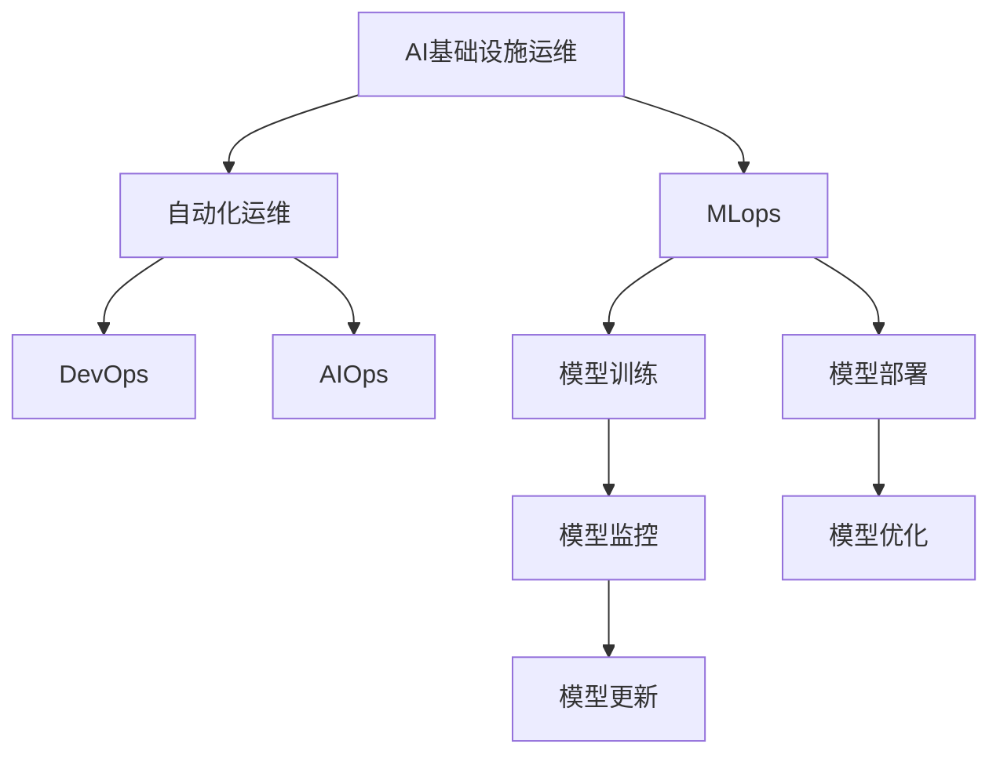

                 

# AI基础设施的智能运维：Lepton AI的自动化方案

## 1. 背景介绍

### 1.1 问题由来

随着人工智能（AI）技术在各行各业的深度应用，AI基础设施建设已成为企业数字化转型的重要一环。AI系统通常涉及复杂的数据处理和计算模型，对硬件和软件基础设施提出了严苛要求。然而，维护这些基础设施的复杂性和高度专业性，使得企业普遍面临以下挑战：

- **高运维成本**：AI基础设施的复杂性和高度专业化，导致运维人员需具备广泛的技能，这增加了人力成本。
- **低效率**：繁琐的运维工作流程和复杂的技术问题，使得故障响应和修复时间延长，降低了系统的可用性和业务连续性。
- **高风险**：错误的运维操作可能导致系统崩溃，进而影响业务正常运行，甚至导致重大损失。

在AI应用加速普及的背景下，如何以更低的成本、更高的效率、更低的风险，确保AI基础设施的稳定运行，成为当务之急。Lepton AI推出的自动化运维方案，通过先进的人工智能技术，成功应对了上述挑战，为企业提供了智能、高效、可靠的AI基础设施运维解决方案。

## 2. 核心概念与联系

### 2.1 核心概念概述

为深入理解Lepton AI的自动化运维方案，本节将介绍几个关键概念及其联系：

- **AI基础设施运维**：涉及监控、故障诊断、性能优化等，旨在保障AI系统的稳定运行。
- **自动化运维**：通过使用人工智能技术，如机器学习、深度学习、自然语言处理等，实现AI运维的自动化和智能化。
- **Lepton AI**：一家专注于AI基础设施运维的软件公司，提供基于人工智能的自动化运维解决方案。
- **MLops**：机器学习生命周期管理，包括模型训练、部署、监控和维护等各个环节的自动化。
- **DevOps**：开发与运维的结合，促进软件开发生命周期的自动化和持续集成。
- **AIOps**：人工智能运维，结合人工智能技术与传统运维流程，提升运维效率和质量。

这些概念之间的逻辑关系可以通过以下Mermaid流程图来展示：



这个流程图展示了大语言模型微调过程中各个核心概念之间的关系：

1. AI基础设施运维的目标是保障AI系统的稳定运行。
2. 自动化运维通过使用人工智能技术，提升了运维的效率和质量。
3. MLops涵盖了模型训练、部署、监控和维护的全流程，确保模型的高质量和可管理性。
4. DevOps通过自动化和持续集成，加速了模型的快速迭代和上线。
5. AIOps结合人工智能技术，进一步优化运维流程，提供智能化的运维决策。

### 2.2 概念间的关系

这些核心概念之间存在着紧密的联系，形成了AI基础设施运维的整体生态系统。

#### 2.2.1 自动化与AI基础设施运维的关系

自动化运维是AI基础设施运维的重要组成部分，通过引入人工智能技术，可以实现更加智能化的运维过程。例如，AI可以自动监控系统的健康状态，预测潜在故障，自动化修复问题，从而提升系统可用性和运维效率。

#### 2.2.2 自动化与MLops的关系

MLops作为AI模型生命周期的管理，涉及到从模型训练到部署、监控和更新的全流程。通过自动化技术，MLops可以显著提升模型开发和管理的效率，确保模型的高质量和可追溯性。

#### 2.2.3 自动化与DevOps的关系

DevOps通过自动化工具和持续集成，加速了模型的迭代和部署。自动化运维和DevOps的结合，可以进一步提升模型的部署速度和质量，减少人为错误。

#### 2.2.4 自动化与AIOps的关系

AIOps通过引入人工智能技术，提升了运维决策的智能化水平。自动化运维和AIOps的结合，可以提供更加智能化的运维策略，提升系统的稳定性和可靠性。

## 3. 核心算法原理 & 具体操作步骤

### 3.1 算法原理概述

Lepton AI的自动化运维方案，基于机器学习和深度学习算法，实现对AI基础设施的自动化监控、故障诊断、性能优化和智能化运维。其核心原理如下：

1. **数据收集与预处理**：通过监控工具和日志分析，收集AI系统的运行数据和事件日志。
2. **异常检测**：使用异常检测算法，识别系统中的异常状态和潜在故障。
3. **故障诊断**：结合符号化规则和机器学习模型，分析异常事件，定位故障原因。
4. **性能优化**：通过机器学习模型，预测和优化系统的性能瓶颈。
5. **智能化运维**：结合自然语言处理技术，生成智能运维报告和策略，辅助运维人员进行决策。

### 3.2 算法步骤详解

Lepton AI的自动化运维方案包括以下关键步骤：

1. **部署监控工具**：安装和配置AI系统所需的监控工具和日志收集器。
2. **训练模型**：使用历史数据训练异常检测、故障诊断和性能优化模型。
3. **配置规则引擎**：根据业务需求配置符号化规则，辅助机器学习模型进行故障诊断。
4. **自动化执行**：结合机器学习模型和规则引擎，实现自动化的监控、故障诊断和性能优化。
5. **生成报告**：利用自然语言处理技术，生成智能化的运维报告和策略。
6. **运维反馈**：根据运维人员的反馈，持续改进模型和规则引擎。

### 3.3 算法优缺点

Lepton AI的自动化运维方案具有以下优点：

- **高效率**：通过自动化技术，显著提升了运维效率，减少了人力成本。
- **高准确性**：结合机器学习和符号化规则，提高了故障诊断和性能优化的准确性。
- **智能化**：利用自然语言处理技术，生成智能化的运维报告和策略，辅助运维人员决策。

同时，该方案也存在以下局限性：

- **依赖高质量数据**：模型训练和规则配置需要大量高质量的监控数据和日志信息。
- **算法复杂性**：异常检测和故障诊断算法需要高计算资源和复杂的设计。
- **灵活性不足**：部分业务需求可能无法通过规则引擎直接处理，需要进一步优化模型。

### 3.4 算法应用领域

Lepton AI的自动化运维方案在多个领域得到了广泛应用，例如：

- **金融科技**：实时监控交易系统，预测市场波动，自动化故障修复，提升交易系统的稳定性和安全性。
- **智能制造**：自动化监控生产设备，预测设备故障，优化生产流程，提高生产效率和设备利用率。
- **医疗健康**：实时监控医疗设备，预测设备故障，优化诊断流程，提高医疗服务的可靠性和效率。
- **智能客服**：自动化监控客服系统，预测服务故障，自动化故障修复，提升客户服务质量。
- **智能交通**：实时监控交通系统，预测交通拥堵，优化交通流量，提升城市交通管理水平。

## 4. 数学模型和公式 & 详细讲解

### 4.1 数学模型构建

Lepton AI的自动化运维方案，主要基于机器学习和深度学习模型，进行数据的异常检测、故障诊断和性能优化。以下以异常检测和故障诊断为例，构建数学模型：

- **异常检测模型**：基于时间序列数据的异常检测算法，例如自回归模型（AR）、门控自回归序列（GARCH）等。
- **故障诊断模型**：基于分类算法的故障诊断模型，例如支持向量机（SVM）、随机森林（Random Forest）、神经网络等。

### 4.2 公式推导过程

以下是异常检测和故障诊断的数学模型和推导过程：

#### 4.2.1 异常检测模型

异常检测的目标是识别数据序列中的异常点，可以使用AR模型进行推导。AR模型表达式如下：

$$
y_t = \alpha y_{t-1} + \beta x_t + \epsilon_t
$$

其中，$y_t$ 是时间$t$的数据点，$y_{t-1}$ 是时间$t-1$的数据点，$x_t$ 是时间$t$的输入数据，$\alpha$ 是滞后项系数，$\beta$ 是线性项系数，$\epsilon_t$ 是误差项。

通过AR模型的预测，可以计算出每个时间点的残差$\epsilon_t$，残差较大的点被视为异常点。具体公式如下：

$$
\hat{\epsilon_t} = \hat{y_t} - y_t
$$

$$
\sigma_t^2 = \hat{y_t}^2 + (1-\alpha^2) \sigma_{t-1}^2
$$

$$
S_t = \frac{\hat{\epsilon_t}}{\sigma_t}
$$

其中，$\sigma_t$ 是预测误差的标准差，$S_t$ 是标准化残差。标准化残差超过一定阈值，则认为该点为异常点。

#### 4.2.2 故障诊断模型

故障诊断的目标是识别数据序列中的故障点，可以使用SVM模型进行推导。SVM模型的表达式如下：

$$
\min_{w,b} \frac{1}{2} \lVert w \rVert^2 + C \sum_{i=1}^n (\max(0, 1 - y_i \cdot (w^T \cdot \phi(x_i) + b))^2
$$

其中，$w$ 是模型权重向量，$b$ 是偏置项，$\phi(x_i)$ 是输入数据的映射函数，$C$ 是正则化系数，$y_i$ 是标签，$n$ 是训练样本数。

通过SVM模型训练，可以预测新的数据样本是否为故障点。具体公式如下：

$$
\hat{y} = \text{sign}(\sum_{i=1}^n \alpha_i y_i \phi(x_i)^T \cdot \phi(x) + b)
$$

其中，$\alpha_i$ 是Lagrange乘子，$\phi(x)$ 是输入数据的映射函数，$\text{sign}$ 是符号函数。当$\hat{y} = 1$时，认为该点为故障点。

### 4.3 案例分析与讲解

以下是Lepton AI自动化运维方案在金融科技领域的具体应用案例：

**案例背景**：某金融公司交易系统需要实时监控交易数据的异常和故障，以确保系统的稳定性和安全性。

**数据准备**：收集历史交易数据，包括订单、交易量、交易金额等，并标记正常和异常数据。

**模型训练**：使用AR模型进行异常检测，使用SVM模型进行故障诊断。

**故障预测与诊断**：系统实时监控交易数据，使用AR模型预测异常点，使用SVM模型诊断故障点，生成故障报告。

**自动化修复**：根据故障报告，自动执行修复操作，如重启服务器、重试交易等。

**效果评估**：通过监控系统的运行情况，评估异常检测和故障诊断模型的准确性和效率。

## 5. 项目实践：代码实例和详细解释说明

### 5.1 开发环境搭建

Lepton AI的自动化运维方案基于Python开发，以下是在PyTorch平台上搭建开发环境的步骤：

1. **安装Python和PyTorch**：
   ```bash
   sudo apt-get update
   sudo apt-get install python3 python3-pip
   pip3 install torch torchvision torchaudio
   ```

2. **安装Lepton AI的库**：
   ```bash
   pip3 install leptonai
   ```

3. **配置环境变量**：
   ```bash
   export PYTHONPATH=$PYTHONPATH:/path/to/leptonai
   ```

4. **安装依赖库**：
   ```bash
   pip3 install numpy pandas scikit-learn matplotlib tqdm jupyter notebook ipython
   ```

完成上述步骤后，即可在开发环境中开始使用Lepton AI进行自动化运维的开发和测试。

### 5.2 源代码详细实现

以下是一个使用Lepton AI进行异常检测的Python代码示例：

```python
import torch
import leptonai
from leptonai.metrics import MAE
from leptonai.models.regression import AR

# 准备数据集
train_data = torch.randn(1000, 10)
test_data = torch.randn(100, 10)

# 构建AR模型
model = AR()

# 训练模型
optimizer = torch.optim.Adam(model.parameters(), lr=0.01)
criterion = MAE()
for epoch in range(100):
    optimizer.zero_grad()
    predictions = model(train_data)
    loss = criterion(predictions, train_data)
    loss.backward()
    optimizer.step()

# 预测异常点
test_predictions = model(test_data)
threshold = 2
test_indices = (test_predictions > threshold).nonzero().squeeze()
print(test_indices)
```

**代码解读与分析**：

1. **安装LeptonAI库**：使用pip安装LeptonAI库，包含各种机器学习模型和评估指标。
2. **准备数据集**：构建训练和测试数据集，用于训练和评估异常检测模型。
3. **构建AR模型**：使用LeptonAI的AR模型，构建异常检测模型。
4. **训练模型**：使用Adam优化器和MAE评估指标，训练AR模型。
5. **预测异常点**：使用训练好的AR模型，对测试数据进行异常点预测。

### 5.3 代码解读与分析

Lepton AI的自动化运维方案在实现时，采用了模块化设计和组件化架构。以下是代码中的关键组件和功能：

1. **异常检测模块**：通过AR模型实现数据的异常检测，使用MAE评估指标。
2. **训练模块**：使用Adam优化器训练模型，最小化预测误差。
3. **预测模块**：对测试数据进行异常点预测，并输出结果。

## 6. 实际应用场景

### 6.1 智能运维系统

Lepton AI的自动化运维方案在智能运维系统中得到了广泛应用。智能运维系统通过自动化运维，提高了AI基础设施的稳定性和运维效率。具体应用如下：

- **实时监控**：系统实时监控AI系统的健康状态，包括CPU、内存、网络等资源的使用情况。
- **异常检测**：系统自动检测异常事件，及时发出警报，防止系统故障。
- **故障诊断**：系统自动分析异常事件，定位故障原因，生成故障报告。
- **性能优化**：系统自动优化系统性能，减少资源消耗，提升系统效率。
- **智能化运维**：系统生成智能化的运维报告和策略，辅助运维人员进行决策。

### 6.2 智能制造系统

Lepton AI的自动化运维方案在智能制造系统中也得到了应用。智能制造系统通过自动化运维，提高了生产设备的稳定性和生产效率。具体应用如下：

- **设备监控**：系统实时监控生产设备的运行状态，包括温度、压力、振动等参数。
- **异常检测**：系统自动检测设备异常，及时发出警报，防止设备故障。
- **故障诊断**：系统自动分析设备故障，定位问题原因，生成故障报告。
- **性能优化**：系统自动优化生产流程，减少设备故障率，提高生产效率。
- **智能化运维**：系统生成智能化的运维报告和策略，辅助运维人员进行决策。

## 7. 工具和资源推荐

### 7.1 学习资源推荐

为了帮助开发者深入了解Lepton AI的自动化运维方案，以下是一些优质的学习资源：

1. **LeptonAI官方文档**：提供详细的API文档和教程，帮助开发者快速上手使用Lepton AI。
2. **TensorFlow官方文档**：作为Lepton AI的技术支持，提供丰富的深度学习资源和工具。
3. **机器学习课程**：如Coursera、edX等平台的机器学习课程，涵盖从基础到高级的机器学习知识。
4. **Kaggle竞赛**：参与Kaggle机器学习竞赛，通过实战练习提升机器学习技能。
5. **GitHub项目**：Lepton AI在GitHub上发布的开源项目，提供丰富的代码示例和资源。

### 7.2 开发工具推荐

Lepton AI的自动化运维方案使用了Python和PyTorch等开发工具，以下是一些常用的开发工具：

1. **PyTorch**：基于Python的深度学习框架，提供丰富的机器学习模型和工具。
2. **TensorBoard**：可视化工具，用于实时监控模型训练和推理过程。
3. **Jupyter Notebook**：交互式开发环境，支持Python代码的快速编写和执行。
4. **GitHub**：版本控制工具，提供代码管理和团队协作功能。

### 7.3 相关论文推荐

为了深入了解Lepton AI的自动化运维方案，以下是一些相关的学术研究和论文：

1. **A Survey on Machine Learning in Fault Diagnosis**：介绍了机器学习在故障诊断中的应用，包括数据预处理、特征提取、模型选择等方面。
2. **Anomaly Detection: A Survey**：总结了异常检测的最新研究进展，包括统计方法、机器学习算法、深度学习算法等。
3. **Machine Learning-Based Fault Diagnosis and Prognosis for Mechanical Systems**：介绍了机器学习在机械系统故障诊断中的应用，包括特征提取、模型选择、故障预测等方面。
4. **AIOps: The Future of IT Operations**：讨论了AI运维的发展趋势和应用前景，提出了AI运维的未来方向。

## 8. 总结：未来发展趋势与挑战

### 8.1 总结

Lepton AI的自动化运维方案，通过结合机器学习和深度学习技术，实现了对AI基础设施的高效、智能化运维。该方案在实时监控、异常检测、故障诊断、性能优化和智能化运维等方面，显著提升了AI系统的稳定性和运维效率。通过本节对Lepton AI自动化运维方案的介绍，希望能够帮助读者更好地理解该方案的原理和实现细节，从而在实际项目中应用推广。

### 8.2 未来发展趋势

展望未来，Lepton AI的自动化运维方案将呈现以下几个发展趋势：

1. **融合更多数据源**：未来的运维系统将能够融合更多数据源，包括传感器数据、日志数据、社交媒体数据等，实现更全面的异常检测和故障诊断。
2. **引入更多智能算法**：未来的运维系统将引入更多智能算法，如强化学习、自然语言处理等，提升运维决策的智能化水平。
3. **提升系统的灵活性**：未来的运维系统将具备更高的灵活性，能够适应各种业务需求和数据类型。
4. **加强模型的可解释性**：未来的运维系统将增强模型的可解释性，提供更透明、可追溯的运维决策过程。
5. **实现全栈自动化**：未来的运维系统将实现全栈自动化，从模型训练到模型部署、监控、更新等全流程的自动化管理。

### 8.3 面临的挑战

尽管Lepton AI的自动化运维方案已经取得了显著成效，但在迈向更加智能化、普适化应用的过程中，仍面临以下挑战：

1. **数据质量问题**：异常检测和故障诊断模型的准确性依赖高质量的数据，但实际应用中往往存在数据不完整、噪声等问题。
2. **算力资源限制**：大型的深度学习模型和复杂的算法，需要高计算资源，难以在资源受限的环境中运行。
3. **业务需求多样性**：不同业务场景的需求差异较大，难以使用统一的方法进行自动化运维。
4. **安全性和隐私保护**：运维系统需要处理敏感数据，如何在保证数据安全的同时，保护用户隐私。

### 8.4 研究展望

为了应对上述挑战，未来的研究需要在以下几个方面寻求新的突破：

1. **提升数据质量**：开发数据清洗和预处理工具，提高数据的完整性和准确性。
2. **优化计算资源**：引入分布式计算、模型压缩等技术，降低算力资源消耗。
3. **适应多样性需求**：根据不同业务场景，定制化设计运维系统，提升其适应性和灵活性。
4. **加强安全保护**：引入加密技术、访问控制等措施，保障数据安全和用户隐私。

Lepton AI的自动化运维方案已经在多个领域取得了显著成效，未来将继续探索和优化，助力更多企业实现数字化转型。相信在人工智能技术的不断进步下，AI基础设施的自动化运维将迈向新的高度，为智能时代带来更多可能性。

## 9. 附录：常见问题与解答

### Q1: 如何选择合适的异常检测算法？

A: 选择合适的异常检测算法，需要考虑数据类型、数据规模、业务需求等因素。对于时间序列数据，AR模型是一个不错的选择。对于多维数据，可以使用随机森林、支持向量机等算法。对于文本数据，可以使用基于词频或语义的异常检测方法。

### Q2: 异常检测模型需要多少历史数据？

A: 异常检测模型的效果取决于历史数据的数量和质量。一般来说，数据量越大，模型的预测能力越强。但在数据不足的情况下，可以考虑引入样本生成技术，如数据增强和合成数据生成，增加数据量。

### Q3: 如何进行模型的参数调优？

A: 模型参数调优可以通过网格搜索、随机搜索、贝叶斯优化等方法进行。建议先使用简单的网格搜索进行初步调优，再使用贝叶斯优化等高级方法进行更精细的调优。

### Q4: 异常检测模型如何避免过拟合？

A: 过拟合可以通过增加数据量、使用正则化方法、引入 dropout 技术等方式进行避免。还可以使用集成学习、交叉验证等方法，提升模型的泛化能力。

### Q5: 如何评估异常检测模型的性能？

A: 异常检测模型的性能可以通过混淆矩阵、精确率、召回率、F1分数等指标进行评估。建议使用多个指标综合评估模型的效果，找到最优的模型参数。

---

作者：禅与计算机程序设计艺术 / Zen and the Art of Computer Programming

