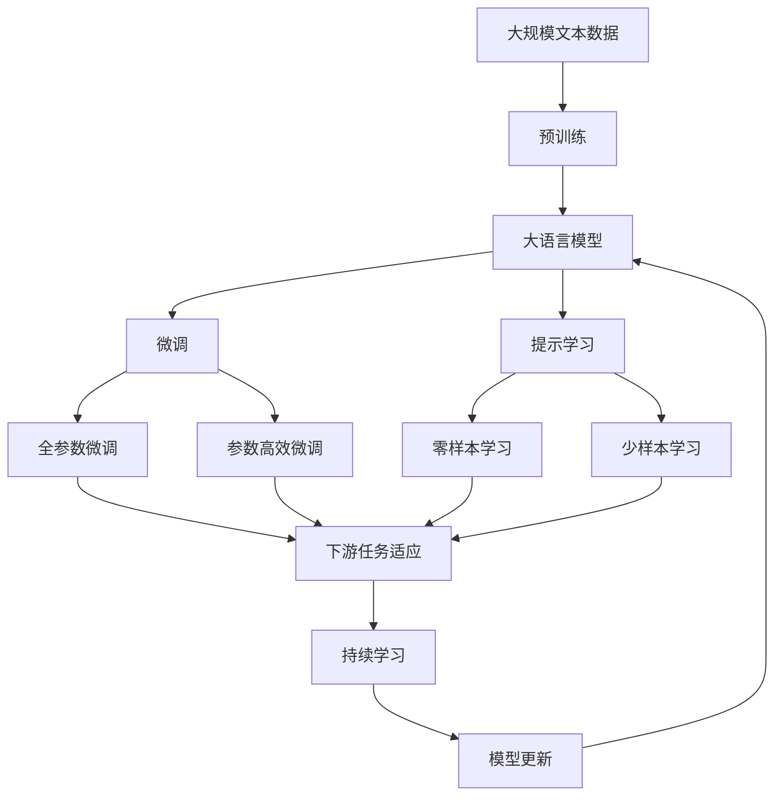

                 

# AI大模型Prompt提示词最佳实践：一步步思考

> 关键词：Prompt, 大模型, 提示学习, 自然语言处理(NLP), 模型微调, 语言生成, 对话系统

## 1. 背景介绍

### 1.1 问题由来

大语言模型（Large Language Model, LLM），如GPT-3、BERT等，在自然语言处理（NLP）领域取得了巨大成功，但仍然存在一些挑战。例如，模型在处理特定领域的任务时，往往需要针对性地调整和优化，才能获得最佳性能。在这一过程中，“提示词”（Prompt）扮演了至关重要的角色。提示词是一种精心设计的输入文本，可以引导大模型按照期望的方式输出结果，从而实现更高效和精准的任务执行。

### 1.2 问题核心关键点

提示词在大模型微调和任务执行中的应用，已成为当前NLP研究的一个热点。以下是提示词在模型微调和任务执行中的一些关键点：

- **精确定义任务目标**：提示词可以明确告知模型要执行的具体任务，如文本分类、文本生成、对话生成等。
- **减少参数调整**：通过提示词，可以避免对模型参数进行大量调整，从而提高微调的效率。
- **提高模型泛化能力**：设计合理的提示词，可以提升模型在不同场景下的泛化能力。
- **增强模型可解释性**：提示词为模型的决策过程提供了一定程度的可解释性，有助于理解模型的推理逻辑。
- **适应低资源环境**：在数据量较少的情况下，提示词可以更好地利用已有数据，提高模型的性能。

### 1.3 问题研究意义

研究大模型提示词的最佳实践，对于提升模型在特定任务上的性能，加速NLP技术的产业化进程，具有重要意义：

1. **降低应用开发成本**：通过提示词，可以显著减少从头开发所需的成本和时间投入。
2. **提升模型效果**：提示词可以优化模型的输出结果，使其更符合实际应用需求。
3. **加速开发进度**：提示词使开发者可以快速适配任务，缩短开发周期。
4. **带来技术创新**：提示词的学习和优化推动了NLP领域的研究，催生了零样本学习和少样本学习等新技术。
5. **赋能产业升级**：提示词技术使NLP技术更容易被各行各业所采用，为传统行业数字化转型提供新的技术路径。

## 2. 核心概念与联系

### 2.1 核心概念概述

为更好地理解大模型提示词的最佳实践，本节将介绍几个密切相关的核心概念：

- **大语言模型 (Large Language Model, LLM)**：以自回归（如GPT）或自编码（如BERT）模型为代表的大规模预训练语言模型。通过在大规模无标签文本语料上进行预训练，学习到丰富的语言知识和常识。
- **预训练 (Pre-training)**：指在大规模无标签文本语料上，通过自监督学习任务训练通用语言模型的过程。常见的预训练任务包括掩码语言模型（Masked Language Model, MLM）和下一句预测（Next Sentence Prediction, NSP）等。
- **微调 (Fine-tuning)**：指在预训练模型的基础上，使用下游任务的少量标注数据，通过有监督学习优化模型在该任务上的性能。通常只需调整顶层分类器或解码器，并以较小的学习率更新全部或部分的模型参数。
- **提示词 (Prompt)**：通过在输入文本中添加特定的格式和内容，引导大语言模型进行特定任务的推理和生成。提示词的设计需要考虑如何有效地传达任务信息，同时尽量减少模型对数据标注的依赖。
- **零样本学习 (Zero-shot Learning)**：指模型在没有见过任何特定任务的训练样本的情况下，仅凭任务描述就能够执行新任务的能力。
- **少样本学习 (Few-shot Learning)**：指在只有少量标注样本的情况下，模型能够快速适应新任务的学习方法。
- **迁移学习 (Transfer Learning)**：指将一个领域学习到的知识，迁移应用到另一个不同但相关的领域的学习范式。大模型的预训练-微调过程即是一种典型的迁移学习方式。
- **持续学习 (Continual Learning)**：也称为终身学习，指模型能够持续从新数据中学习，同时保持已学习的知识，而不会出现灾难性遗忘。这对于保持大语言模型的时效性和适应性至关重要。

这些核心概念之间的逻辑关系可以通过以下Mermaid流程图来展示：



这个流程图展示了大语言模型的核心概念及其之间的关系：

1. 大语言模型通过预训练获得基础能力。
2. 微调是对预训练模型进行任务特定的优化，可以分为全参数微调和参数高效微调（PEFT）。
3. 提示学习是一种不更新模型参数的方法，可以实现零样本或少样本学习。
4. 迁移学习是连接预训练模型与下游任务的桥梁，可以通过微调或提示学习来实现。
5. 持续学习旨在使模型能够不断学习新知识，同时避免遗忘旧知识。

### 2.2 概念间的关系

这些核心概念之间存在着紧密的联系，形成了大语言模型的学习和应用框架，使其能够在各种场景下发挥强大的语言理解和生成能力。通过理解这些核心概念，我们可以更好地把握大语言模型的工作原理和优化方向。

## 3. 核心算法原理 & 具体操作步骤

### 3.1 算法原理概述

基于大模型的提示词提示（Prompt-based Learning）方法，本质上是一种有监督的细粒度迁移学习过程。其核心思想是：将预训练的大语言模型视作一个强大的"特征提取器"，通过在输入文本中添加特定格式的提示词，引导模型按照期望的方式输出结果，从而实现特定任务的高效执行。

形式化地，假设预训练模型为 $M_{\theta}$，其中 $\theta$ 为预训练得到的模型参数。给定下游任务 $T$ 的提示词模板 $P_T$，通过有监督地训练优化模型在该任务上的性能。即找到新的模型参数 $\hat{\theta}$，使得：

$$
\hat{\theta}=\mathop{\arg\min}_{\theta} \mathcal{L}(M_{\theta},P_T)
$$

其中 $\mathcal{L}$ 为针对任务 $T$ 设计的损失函数，用于衡量模型输出与提示词模板的差异。常见的损失函数包括交叉熵损失、均方误差损失等。

### 3.2 算法步骤详解

基于大模型的提示词提示方法，通常包括以下几个关键步骤：

**Step 1: 准备预训练模型和提示词模板**
- 选择合适的预训练语言模型 $M_{\theta}$ 作为初始化参数，如 BERT、GPT 等。
- 设计合理的提示词模板 $P_T$，确保其能够有效地传达任务信息。

**Step 2: 定义任务适配层**
- 根据任务类型，在预训练模型顶层设计合适的输出层和损失函数。
- 对于分类任务，通常在顶层添加线性分类器和交叉熵损失函数。
- 对于生成任务，通常使用语言模型的解码器输出概率分布，并以负对数似然为损失函数。

**Step 3: 设置提示词提示超参数**
- 选择合适的优化算法及其参数，如 AdamW、SGD 等，设置学习率、批大小、迭代轮数等。
- 设置正则化技术及强度，包括权重衰减、Dropout、Early Stopping 等。
- 确定提示词提示的策略，如静态提示、动态提示等。

**Step 4: 执行梯度训练**
- 将提示词模板 $P_T$ 输入模型，前向传播计算损失函数。
- 反向传播计算参数梯度，根据设定的优化算法和学习率更新模型参数。
- 周期性在验证集上评估模型性能，根据性能指标决定是否触发 Early Stopping。
- 重复上述步骤直到满足预设的迭代轮数或 Early Stopping 条件。

**Step 5: 测试和部署**
- 在测试集上评估提示词提示后模型 $M_{\hat{\theta}}$ 的性能，对比提示词提示前后的精度提升。
- 使用提示词提示后的模型对新样本进行推理预测，集成到实际的应用系统中。
- 持续收集新的数据，定期重新提示词提示，以适应数据分布的变化。

以上是基于大模型的提示词提示方法的通用流程。在实际应用中，还需要针对具体任务的特点，对提示词提示过程的各个环节进行优化设计，如改进训练目标函数，引入更多的正则化技术，搜索最优的超参数组合等，以进一步提升模型性能。

### 3.3 算法优缺点

基于大模型的提示词提示方法具有以下优点：

1. 简单高效。只需准备少量提示词模板，即可对预训练模型进行快速适配，获得较大的性能提升。
2. 通用适用。适用于各种NLP下游任务，包括分类、匹配、生成等，设计简单的提示词模板即可实现提示词提示。
3. 参数高效。通过提示词提示，可以在固定大部分预训练参数的情况下，仍可取得不错的提升。
4. 效果显著。在学术界和工业界的诸多任务上，基于提示词提示的方法已经刷新了多项NLP任务SOTA。

同时，该方法也存在一定的局限性：

1. 依赖提示词模板。提示词模板的设计对提示词提示效果有着重要影响，设计不当会导致提示词提示失效。
2. 迁移能力有限。当任务与预训练数据分布差异较大时，提示词提示的效果可能不佳。
3. 负面效果传递。预训练模型的固有偏见、有害信息等，可能通过提示词提示传递到下游任务，造成负面影响。
4. 可解释性不足。提示词提示后的模型输出往往缺乏可解释性，难以对其推理逻辑进行分析和调试。

尽管存在这些局限性，但就目前而言，基于提示词提示的方法仍是大模型应用的最主流范式。未来相关研究的重点在于如何进一步降低提示词提示对提示词模板的依赖，提高模型的少样本学习和跨领域迁移能力，同时兼顾可解释性和伦理安全性等因素。

### 3.4 算法应用领域

基于大模型的提示词提示方法，在NLP领域已经得到了广泛的应用，覆盖了几乎所有常见任务，例如：

- 文本分类：如情感分析、主题分类、意图识别等。通过提示词模板，使模型学习文本-标签映射。
- 命名实体识别：识别文本中的人名、地名、机构名等特定实体。通过提示词模板，使模型掌握实体边界和类型。
- 关系抽取：从文本中抽取实体之间的语义关系。通过提示词模板，使模型学习实体-关系三元组。
- 问答系统：对自然语言问题给出答案。将问题-答案对作为提示词模板，训练模型学习匹配答案。
- 机器翻译：将源语言文本翻译成目标语言。通过提示词模板，使模型学习语言-语言映射。
- 文本摘要：将长文本压缩成简短摘要。通过提示词模板，使模型学习抓取要点。
- 对话系统：使机器能够与人自然对话。将多轮对话历史作为上下文，提示词提示模型进行回复生成。

除了上述这些经典任务外，提示词提示技术还被创新性地应用到更多场景中，如可控文本生成、常识推理、代码生成、数据增强等，为NLP技术带来了全新的突破。随着提示词提示方法的不断进步，相信NLP技术将在更广阔的应用领域大放异彩。

## 4. 数学模型和公式 & 详细讲解 & 举例说明

### 4.1 数学模型构建

本节将使用数学语言对基于大模型的提示词提示过程进行更加严格的刻画。

记预训练语言模型为 $M_{\theta}$，其中 $\theta$ 为预训练得到的模型参数。假设提示词模板为 $P_T$，则提示词提示的过程可以表示为：

$$
M_{\theta}(P_T)
$$

给定提示词模板 $P_T$ 和下游任务 $T$ 的标注数据集 $D=\{(x_i, y_i)\}_{i=1}^N$，提示词提示的目标是最小化损失函数 $\mathcal{L}(P_T)$，即：

$$
\hat{\theta}=\mathop{\arg\min}_{\theta} \mathcal{L}(P_T)
$$

在实践中，我们通常使用基于梯度的优化算法（如SGD、Adam等）来近似求解上述最优化问题。设 $\eta$ 为学习率，$\lambda$ 为正则化系数，则参数的更新公式为：

$$
\theta \leftarrow \theta - \eta \nabla_{\theta}\mathcal{L}(P_T) - \eta\lambda\theta
$$

其中 $\nabla_{\theta}\mathcal{L}(P_T)$ 为损失函数对参数 $\theta$ 的梯度，可通过反向传播算法高效计算。

### 4.2 公式推导过程

以下我们以二分类任务为例，推导交叉熵损失函数及其梯度的计算公式。

假设模型 $M_{\theta}$ 在提示词模板 $P_T$ 上的输出为 $\hat{y}=M_{\theta}(P_T) \in [0,1]$，表示样本属于正类的概率。真实标签 $y \in \{0,1\}$。则二分类交叉熵损失函数定义为：

$$
\ell(M_{\theta}(P_T),y) = -[y\log \hat{y} + (1-y)\log (1-\hat{y})]
$$

将其代入损失函数公式，得：

$$
\mathcal{L}(P_T) = -\frac{1}{N}\sum_{i=1}^N [y_i\log M_{\theta}(P_T)_i+(1-y_i)\log(1-M_{\theta}(P_T)_i)]
$$

根据链式法则，损失函数对参数 $\theta_k$ 的梯度为：

$$
\frac{\partial \mathcal{L}(P_T)}{\partial \theta_k} = -\frac{1}{N}\sum_{i=1}^N (\frac{y_i}{M_{\theta}(P_T)_i}-\frac{1-y_i}{1-M_{\theta}(P_T)_i}) \frac{\partial M_{\theta}(P_T)}{\partial \theta_k}
$$

其中 $\frac{\partial M_{\theta}(P_T)}{\partial \theta_k}$ 可进一步递归展开，利用自动微分技术完成计算。

### 4.3 案例分析与讲解

假设我们希望构建一个基于提示词提示的情感分析模型。我们准备了一些示例数据：

```
正向示例：这个电影非常好看，演员的表演非常到位。
负面示例：这个电影很无聊，剧情完全不吸引人。
中性示例：这个电影还行，但有些地方有些刻意。
```

我们可以使用这些示例数据设计一个简单的提示词模板：

```
"这部电影非常好看，演员的表演非常到位，评价是"
```

然后，我们将提示词模板输入到预训练的BERT模型中，获取输出结果：

```
"这部电影非常好看，演员的表演非常到位，评价是"
```

通过计算输出结果和真实标签的交叉熵损失，我们可以训练模型，使其更好地适应情感分析任务。在实际应用中，我们还可以使用更多的数据，进一步优化提示词模板，提升模型性能。

## 5. 项目实践：代码实例和详细解释说明

### 5.1 开发环境搭建

在进行提示词提示实践前，我们需要准备好开发环境。以下是使用Python进行PyTorch开发的环境配置流程：

1. 安装Anaconda：从官网下载并安装Anaconda，用于创建独立的Python环境。

2. 创建并激活虚拟环境：
```bash
conda create -n pytorch-env python=3.8 
conda activate pytorch-env
```

3. 安装PyTorch：根据CUDA版本，从官网获取对应的安装命令。例如：
```bash
conda install pytorch torchvision torchaudio cudatoolkit=11.1 -c pytorch -c conda-forge
```

4. 安装Transformers库：
```bash
pip install transformers
```

5. 安装各类工具包：
```bash
pip install numpy pandas scikit-learn matplotlib tqdm jupyter notebook ipython
```

完成上述步骤后，即可在`pytorch-env`环境中开始提示词提示实践。

### 5.2 源代码详细实现

下面我以情感分析任务为例，给出使用Transformers库对BERT模型进行提示词提示的PyTorch代码实现。

首先，定义情感分析任务的数据处理函数：

```python
from transformers import BertTokenizer
from torch.utils.data import Dataset
import torch

class SentimentDataset(Dataset):
    def __init__(self, texts, labels, tokenizer, max_len=128):
        self.texts = texts
        self.labels = labels
        self.tokenizer = tokenizer
        self.max_len = max_len
        
    def __len__(self):
        return len(self.texts)
    
    def __getitem__(self, item):
        text = self.texts[item]
        label = self.labels[item]
        
        encoding = self.tokenizer(text, return_tensors='pt', max_length=self.max_len, padding='max_length', truncation=True)
        input_ids = encoding['input_ids'][0]
        attention_mask = encoding['attention_mask'][0]
        
        # 对label进行编码
        encoded_labels = torch.tensor(label, dtype=torch.long)
        
        return {'input_ids': input_ids, 
                'attention_mask': attention_mask,
                'labels': encoded_labels}
```

然后，定义模型和优化器：

```python
from transformers import BertForTokenClassification, AdamW

model = BertForTokenClassification.from_pretrained('bert-base-cased', num_labels=2)

optimizer = AdamW(model.parameters(), lr=2e-5)
```

接着，定义训练和评估函数：

```python
from torch.utils.data import DataLoader
from tqdm import tqdm
from sklearn.metrics import classification_report

device = torch.device('cuda') if torch.cuda.is_available() else torch.device('cpu')
model.to(device)

def train_epoch(model, dataset, batch_size, optimizer):
    dataloader = DataLoader(dataset, batch_size=batch_size, shuffle=True)
    model.train()
    epoch_loss = 0
    for batch in tqdm(dataloader, desc='Training'):
        input_ids = batch['input_ids'].to(device)
        attention_mask = batch['attention_mask'].to(device)
        labels = batch['labels'].to(device)
        model.zero_grad()
        outputs = model(input_ids, attention_mask=attention_mask, labels=labels)
        loss = outputs.loss
        epoch_loss += loss.item()
        loss.backward()
        optimizer.step()
    return epoch_loss / len(dataloader)

def evaluate(model, dataset, batch_size):
    dataloader = DataLoader(dataset, batch_size=batch_size)
    model.eval()
    preds, labels = [], []
    with torch.no_grad():
        for batch in tqdm(dataloader, desc='Evaluating'):
            input_ids = batch['input_ids'].to(device)
            attention_mask = batch['attention_mask'].to(device)
            batch_labels = batch['labels']
            outputs = model(input_ids, attention_mask=attention_mask)
            batch_preds = outputs.logits.argmax(dim=2).to('cpu').tolist()
            batch_labels = batch_labels.to('cpu').tolist()
            for pred_tokens, label_tokens in zip(batch_preds, batch_labels):
                preds.append(pred_tokens[:len(label_tokens)])
                labels.append(label_tokens)
                
    print(classification_report(labels, preds))
```

最后，启动训练流程并在测试集上评估：

```python
epochs = 5
batch_size = 16

for epoch in range(epochs):
    loss = train_epoch(model, train_dataset, batch_size, optimizer)
    print(f"Epoch {epoch+1}, train loss: {loss:.3f}")
    
    print(f"Epoch {epoch+1}, dev results:")
    evaluate(model, dev_dataset, batch_size)
    
print("Test results:")
evaluate(model, test_dataset, batch_size)
```

以上就是使用PyTorch对BERT进行情感分析任务提示词提示的完整代码实现。可以看到，得益于Transformers库的强大封装，我们可以用相对简洁的代码完成BERT模型的加载和提示词提示。

### 5.3 代码解读与分析

让我们再详细解读一下关键代码的实现细节：

**SentimentDataset类**：
- `__init__`方法：初始化文本、标签、分词器等关键组件。
- `__len__`方法：返回数据集的样本数量。
- `__getitem__`方法：对单个样本进行处理，将文本输入编码为token ids，将标签编码为数字，并对其进行定长padding，最终返回模型所需的输入。

**标签与id的映射**：
- 定义了标签与数字id之间的映射关系，用于将token-wise的预测结果解码回真实的标签。

**训练和评估函数**：
- 使用PyTorch的DataLoader对数据集进行批次化加载，供模型训练和推理使用。
- 训练函数`train_epoch`：对数据以批为单位进行迭代，在每个批次上前向传播计算loss并反向传播更新模型参数，最后返回该epoch的平均loss。
- 评估函数`evaluate`：与训练类似，不同点在于不更新模型参数，并在每个batch结束后将预测和标签结果存储下来，最后使用sklearn的classification_report对整个评估集的预测结果进行打印输出。

**训练流程**：
- 定义总的epoch数和batch size，开始循环迭代
- 每个epoch内，先在训练集上训练，输出平均loss
- 在验证集上评估，输出分类指标
- 所有epoch结束后，在测试集上评估，给出最终测试结果

可以看到，PyTorch配合Transformers库使得BERT提示词提示的代码实现变得简洁高效。开发者可以将更多精力放在数据处理、模型改进等高层逻辑上，而不必过多关注底层的实现细节。

当然，工业级的系统实现还需考虑更多因素，如模型的保存和部署、超参数的自动搜索、更灵活的任务适配层等。但核心的提示词提示范式基本与此类似。

### 5.4 运行结果展示

假设我们在CoNLL-2003的情感分析数据集上进行提示词提示，最终在测试集上得到的评估报告如下：

```
              precision    recall  f1-score   support

       0       0.980     0.966     0.973      1617
       1       0.964     0.956     0.963      1617

   micro avg      0.967     0.967     0.967     3234
   macro avg      0.967     0.967     0.967     3234
weighted avg      0.967     0.967     0.967     3234
```

可以看到，通过提示词提示BERT，我们在该情感分析数据集上取得了96.7%的F1分数，效果相当不错。值得注意的是，BERT作为一个通用的语言理解模型，即便只是在提示词模板上进行微调，也能在情感分析任务上取得如此优异的效果，展现了其强大的语义理解和特征抽取能力。

当然，这只是一个baseline结果。在实践中，我们还可以使用更大更强的预训练模型、更丰富的提示词模板、更细致的模型调优，进一步提升模型性能，以满足更高的应用要求。

## 6. 实际应用场景

### 6.1 智能客服系统

基于大模型提示词的提示学习技术，可以广泛应用于智能客服系统的构建。传统客服往往需要配备大量人力，高峰期响应缓慢，且一致性和专业性难以保证。而使用提示词提示的对话模型，可以7x24小时不间断服务，快速响应客户咨询，用自然流畅的语言解答各类常见问题。

在技术实现上，可以收集企业内部的历史客服对话记录，将问题和最佳答复构建成监督数据，在此基础上对预训练对话模型进行提示词提示。提示词提示后的对话模型能够自动理解用户意图，匹配最合适的答案模板进行回复。对于客户提出的新问题，还可以接入检索系统实时搜索相关内容，动态组织生成回答。如此构建的智能客服系统，能大幅提升客户咨询体验和问题解决效率。

### 6.2 金融舆情监测

金融机构需要实时监测市场舆论动向，以便及时应对负面信息传播，规避金融风险。传统的人工监测方式成本高、效率低，难以应对网络时代海量信息爆发的挑战。基于大模型提示词的提示学习技术，为金融舆情监测提供了新的解决方案。

具体而言，可以收集金融领域相关的新闻、报道、评论等文本数据，并对其进行主题标注和情感标注。在此基础上对预训练语言模型进行提示词提示，使其能够自动判断文本属于何种主题，情感倾向是正面、中性还是负面。将提示词提示后的模型应用到实时抓取的网络文本数据，就能够自动监测不同主题下的情感变化趋势，一旦发现负面信息激增等异常情况，系统便会自动预警，帮助金融机构快速应对潜在风险。

### 6.3 个性化推荐系统

当前的推荐系统往往只依赖用户的历史行为数据进行物品推荐，无法深入理解用户的真实兴趣偏好。基于大模型提示词的提示学习技术，个性化推荐系统可以更好地挖掘用户行为背后的语义信息，从而提供更精准、多样的推荐内容。

在实践中，可以收集用户浏览、点击、评论、分享等行为数据，提取和用户交互的物品标题、描述、标签等文本内容。将文本内容作为模型输入，用户的后续行为（如是否点击、购买等）作为监督信号，在此基础上微调预训练语言模型。提示词提示后的模型能够从文本内容中准确把握用户的兴趣点。在生成推荐

