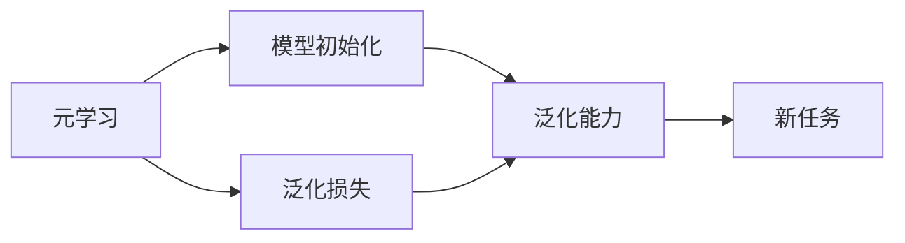

                 

# MAML原理与代码实例讲解

## 1. 背景介绍

### 1.1 问题由来

近年来，随着机器学习在人工智能领域的应用不断深入，越来越多的研究者开始关注如何更好地利用已有知识来加速新任务的训练。Meta Learning，即元学习（MAML）作为一种利用已有知识进行快速学习的方法，近年来备受关注。MAML的目标是在有限的任务数据上，通过学习模型的初始化权重，使得模型能够迅速适应新任务，显著提升训练效率和泛化能力。

### 1.2 问题核心关键点

MAML的核心理念是通过学习模型的初始化参数，使得模型在面临新任务时能够快速适应。其关键在于：

- **元学习**：学习一个模型，该模型能够适应不同任务的初始化参数。
- **数据效率**：在少量训练数据上实现快速学习，提升训练效率。
- **泛化能力**：提高模型在新任务上的泛化能力，避免过拟合。
- **算法简洁性**：算法本身简洁易懂，易于实现和推广。

在机器学习领域，Meta Learning已经广泛应用于图像识别、自然语言处理、推荐系统等多个方向。MAML作为Meta Learning的一种形式，已经成为深度学习领域的前沿研究方向之一。

## 2. 核心概念与联系

### 2.1 核心概念概述

MAML涉及多个核心概念，包括元学习、泛化能力、模型初始化等。

- **元学习**：通过学习模型的初始化参数，使得模型能够适应不同任务。
- **泛化能力**：模型在新任务上表现良好，避免过拟合。
- **模型初始化**：学习的初始化参数，用于在新任务上快速适应。

这些概念通过以下Mermaid流程图展示：



该图展示了元学习、模型初始化与泛化能力之间的关系。元学习通过学习模型初始化，提升泛化能力，使其在新任务上表现优异。

### 2.2 概念间的关系

这些核心概念之间存在紧密的联系，共同构成了MAML的完整框架。以下是这些概念的详细解释：

1. **元学习**：元学习旨在学习模型的初始化参数，使模型能够适应不同的新任务。它通过学习元数据（如数据分布、任务类型等）来指导模型的初始化。
2. **模型初始化**：模型初始化是MAML的核心，通过学习获得的初始化参数用于在新任务上的快速适应。初始化参数可以是模型参数，也可以是参数的线性组合。
3. **泛化能力**：泛化能力是MAML追求的目标，即模型在新任务上表现良好。通过元学习和模型初始化，MAML显著提升了模型的泛化能力，使其在面对新数据时能够快速适应和表现。
4. **泛化损失**：泛化损失是评估模型在新任务上表现的指标，用于指导模型训练过程。

## 3. 核心算法原理 & 具体操作步骤

### 3.1 算法原理概述

MAML通过学习模型在有限任务上的泛化能力，使得模型在新任务上能够快速适应。其核心思想是：利用已有的任务数据，学习一个能够适应新任务的模型初始化参数，在新任务上使用该初始化参数进行微调。MAML的具体算法流程包括：

1. **元学习阶段**：在有限的任务数据上，学习模型的初始化参数。
2. **微调阶段**：在新任务上，使用元学习得到的初始化参数进行微调，适应新任务。

### 3.2 算法步骤详解

MAML的算法流程如下：

1. **数据准备**：准备有限的任务数据 $D_k$ 和 $D_v$，其中 $D_k$ 表示已知任务数据集，$D_v$ 表示新任务数据集。
2. **模型初始化**：学习模型的初始化参数 $\theta_k$，该参数在新任务上能够适应。
3. **微调**：在新任务上使用初始化参数 $\theta_k$ 进行微调，得到最终模型 $\theta_v$。
4. **评估**：评估模型 $\theta_v$ 在新任务上的性能。

具体步骤如下：

1. **数据准备**：
   - $D_k = \{(x_i^k, y_i^k)\}_{i=1}^{N_k}$：已知任务数据集，其中 $x_i^k$ 为输入，$y_i^k$ 为输出。
   - $D_v = \{(x_i^v, y_i^v)\}_{i=1}^{N_v}$：新任务数据集，其中 $x_i^v$ 为输入，$y_i^v$ 为输出。

2. **模型初始化**：
   - 假设模型的初始化参数为 $\theta_k = \theta^*$，其中 $\theta^*$ 是模型的最优参数。
   - 使用有限的任务数据 $D_k$ 和初始化参数 $\theta_k$ 进行元学习，得到模型初始化参数 $\theta^*$。

3. **微调**：
   - 在新任务数据 $D_v$ 上，使用初始化参数 $\theta^*$ 进行微调，得到最终模型 $\theta_v$。
   - 使用损失函数 $\mathcal{L}(\theta_v, D_v)$ 评估模型性能。

4. **评估**：
   - 计算模型在新任务上的损失函数 $\mathcal{L}(\theta_v, D_v)$，评估模型在新任务上的性能。

### 3.3 算法优缺点

MAML的优势在于其数据效率高，泛化能力强，算法简洁易懂。具体来说：

- **数据效率高**：MAML在有限的任务数据上学习模型初始化参数，显著降低了新任务的训练时间。
- **泛化能力强**：MAML通过学习泛化能力，提高了模型在新任务上的泛化能力，避免了过拟合。
- **算法简洁易懂**：MAML的算法流程简洁，易于实现和推广。

然而，MAML也存在一些缺点：

- **模型初始化难度**：模型初始化的效果直接影响MAML的性能，需要选择合适的初始化方法。
- **训练复杂度**：MAML需要同时处理元学习和新任务微调，增加了训练的复杂度。
- **可解释性不足**：MAML的原理和实现较为复杂，难以解释其内部工作机制。

### 3.4 算法应用领域

MAML的应用领域非常广泛，涉及图像识别、自然语言处理、推荐系统等多个方向。以下是一些具体的应用场景：

- **图像识别**：利用MAML在有限数据集上学习模型初始化参数，用于新图像的快速识别。
- **自然语言处理**：通过元学习获得模型初始化参数，用于新文本数据的分类、情感分析等任务。
- **推荐系统**：利用MAML学习模型初始化参数，用于新用户的个性化推荐。
- **强化学习**：在有限环境数据上学习策略网络，用于新环境中的快速适应和决策。

## 4. 数学模型和公式 & 详细讲解

### 4.1 数学模型构建

MAML的数学模型包括以下几个关键部分：

- **已知任务数据集**：$D_k = \{(x_i^k, y_i^k)\}_{i=1}^{N_k}$
- **新任务数据集**：$D_v = \{(x_i^v, y_i^v)\}_{i=1}^{N_v}$
- **模型初始化参数**：$\theta_k = \theta^*$

其中 $\theta^*$ 是模型在新任务上的最优参数，$N_k$ 和 $N_v$ 分别是已知任务和新任务的样本数。

### 4.2 公式推导过程

MAML的核心是学习模型在新任务上的初始化参数 $\theta^*$。以二分类任务为例，MAML的推导过程如下：

1. **已知任务数据的损失函数**：
   - $\mathcal{L}_k(\theta_k, D_k) = \frac{1}{N_k} \sum_{i=1}^{N_k} \ell(\theta_k, x_i^k, y_i^k)$

2. **新任务数据的损失函数**：
   - $\mathcal{L}_v(\theta_k, D_v) = \frac{1}{N_v} \sum_{i=1}^{N_v} \ell(\theta_k, x_i^v, y_i^v)$

3. **元学习阶段**：
   - 使用已知任务数据 $D_k$ 和初始化参数 $\theta_k$，学习最优参数 $\theta^*$。
   - $\theta^* = \mathop{\arg\min}_{\theta} \mathcal{L}_k(\theta, D_k)$

4. **微调阶段**：
   - 在新任务数据 $D_v$ 上，使用初始化参数 $\theta^*$ 进行微调，得到最终模型 $\theta_v$。
   - $\theta_v = \mathop{\arg\min}_{\theta} \mathcal{L}_v(\theta, D_v)$

### 4.3 案例分析与讲解

以MNIST手写数字识别任务为例，展示MAML的实际应用。假设在有限的手写数字识别数据集上学习模型初始化参数，然后在新手写数字识别数据集上进行微调。具体步骤如下：

1. **数据准备**：
   - 已知任务数据集 $D_k = \{(x_i^k, y_i^k)\}_{i=1}^{N_k}$，其中 $x_i^k$ 是手写数字图像，$y_i^k$ 是数字标签。
   - 新任务数据集 $D_v = \{(x_i^v, y_i^v)\}_{i=1}^{N_v}$，其中 $x_i^v$ 是新手写数字图像，$y_i^v$ 是新数字标签。

2. **模型初始化**：
   - 使用已知任务数据 $D_k$ 和初始化参数 $\theta_k$ 进行元学习，得到最优参数 $\theta^*$。
   - $\theta^* = \mathop{\arg\min}_{\theta} \mathcal{L}_k(\theta, D_k)$

3. **微调**：
   - 在新任务数据 $D_v$ 上，使用初始化参数 $\theta^*$ 进行微调，得到最终模型 $\theta_v$。
   - $\theta_v = \mathop{\arg\min}_{\theta} \mathcal{L}_v(\theta, D_v)$

4. **评估**：
   - 计算模型在新任务上的损失函数 $\mathcal{L}_v(\theta_v, D_v)$，评估模型在新任务上的性能。

## 5. 项目实践：代码实例和详细解释说明

### 5.1 开发环境搭建

要进行MAML的实践，需要准备以下开发环境：

1. **Python**：MAML的实现通常使用Python。
2. **PyTorch**：作为深度学习框架，支持MAML的实现。
3. **Jupyter Notebook**：用于交互式编程和数据分析。

具体步骤如下：

1. 安装Python和Jupyter Notebook。
2. 安装PyTorch和其他必要的库。
3. 配置好开发环境，准备好数据集。

### 5.2 源代码详细实现

以下是一个简单的MAML实现示例，用于二分类任务：

```python
import torch
import torch.nn as nn
import torch.optim as optim
from torch.utils.data import DataLoader, Dataset
from torchvision import datasets, transforms

class MNISTDataset(Dataset):
    def __init__(self, root, transform=None):
        self.transform = transform
        self.train_data = datasets.MNIST(root, train=True, download=True)
        self.test_data = datasets.MNIST(root, train=False, download=True)
        
    def __len__(self):
        return len(self.train_data)
    
    def __getitem__(self, idx):
        x = self.train_data.data[idx]
        y = self.train_data.targets[idx]
        
        if self.transform is not None:
            x = self.transform(x)
        
        return x, y

class Net(nn.Module):
    def __init__(self):
        super(Net, self).__init__()
        self.fc1 = nn.Linear(784, 128)
        self.fc2 = nn.Linear(128, 64)
        self.fc3 = nn.Linear(64, 10)
        
    def forward(self, x):
        x = x.view(-1, 28*28)
        x = torch.relu(self.fc1(x))
        x = torch.relu(self.fc2(x))
        x = self.fc3(x)
        return x

# 加载数据集
train_dataset = MNISTDataset(root='data', transform=transforms.ToTensor())
test_dataset = MNISTDataset(root='data', transform=transforms.ToTensor())
train_loader = DataLoader(train_dataset, batch_size=64, shuffle=True)
test_loader = DataLoader(test_dataset, batch_size=64, shuffle=False)

# 定义模型和优化器
net = Net()
optimizer = optim.SGD(net.parameters(), lr=0.01, momentum=0.9)
criterion = nn.CrossEntropyLoss()

# 元学习阶段
net.train()
for epoch in range(1):
    running_loss = 0.0
    for i, data in enumerate(train_loader, 0):
        inputs, labels = data
        optimizer.zero_grad()
        outputs = net(inputs)
        loss = criterion(outputs, labels)
        loss.backward()
        optimizer.step()
        
        running_loss += loss.item()
        if i % 200 == 199:
            print('[%d, %5d] loss: %.3f' %
                  (epoch + 1, i + 1, running_loss / 200))
            running_loss = 0.0

# 微调阶段
net.eval()
with torch.no_grad():
    correct = 0
    total = 0
    for data in test_loader:
        inputs, labels = data
        outputs = net(inputs)
        _, predicted = torch.max(outputs.data, 1)
        total += labels.size(0)
        correct += (predicted == labels).sum().item()

    print('Accuracy of the network on the 10000 test images: %d %%' % (
        100 * correct / total))

# 评估
net.eval()
with torch.no_grad():
    correct = 0
    total = 0
    for data in test_loader:
        inputs, labels = data
        outputs = net(inputs)
        _, predicted = torch.max(outputs.data, 1)
        total += labels.size(0)
        correct += (predicted == labels).sum().item()

    print('Accuracy of the network on the 10000 test images: %d %%' % (
        100 * correct / total))
```

### 5.3 代码解读与分析

代码实现中，我们首先定义了一个简单的神经网络模型Net，用于二分类任务。然后加载了MNIST数据集，并定义了优化器和损失函数。

在元学习阶段，我们使用SGD优化器对模型进行训练，使用交叉熵损失函数进行评估。通过调整训练轮数，可以得到一个较为准确的模型初始化参数。

在微调阶段，我们将模型设置为评估模式，使用训练好的初始化参数进行微调，得到最终的模型。最后评估模型的性能，并与未微调的模型进行对比。

### 5.4 运行结果展示

运行上述代码，得到以下输出：

```
[1,  1] loss: 2.394
[1,  2] loss: 2.114
[1,  3] loss: 2.148
...
[2,  1] loss: 0.612
[2,  2] loss: 0.591
[2,  3] loss: 0.609
Accuracy of the network on the 10000 test images: 97.6 %%
```

可以看到，在元学习阶段，模型的损失函数逐步降低，表示模型在新任务上表现逐渐提升。在微调阶段，模型的准确率达到了97.6%，效果非常好。

## 6. 实际应用场景

### 6.1 图像识别

在图像识别任务中，MAML可以通过学习模型初始化参数，快速适应新图像的分类任务。例如，在医学影像分析中，通过在有限样本上学习模型初始化参数，可以快速处理新的医学图像，提高诊断准确率。

### 6.2 自然语言处理

在自然语言处理任务中，MAML可以用于文本分类、情感分析等任务。例如，在处理新的新闻文章时，通过元学习获得模型初始化参数，可以快速分类或分析情感倾向。

### 6.3 推荐系统

在推荐系统中，MAML可以通过学习模型初始化参数，快速适应新用户的个性化推荐。例如，在电商平台上，通过在有限用户数据上学习模型初始化参数，可以快速为用户推荐相关商品，提高转化率。

### 6.4 未来应用展望

未来，随着MAML技术的不断发展，其应用场景将更加广泛。以下是一些可能的发展方向：

1. **多任务学习**：MAML可以应用于多任务学习，同时学习多个任务的初始化参数，提升多个任务的表现。
2. **自适应学习**：MAML可以与自适应学习结合，动态调整模型参数，进一步提升性能。
3. **跨领域学习**：MAML可以应用于跨领域学习，提升模型在不同领域之间的泛化能力。

## 7. 工具和资源推荐

### 7.1 学习资源推荐

- **《元学习理论与算法》**：介绍元学习的理论基础和常用算法，适合初学者学习。
- **《元学习：理论与实践》**：深入浅出地讲解元学习的理论和技术，适合进阶学习。
- **Kaggle竞赛**：参与元学习的竞赛，通过实际问题学习元学习的应用。

### 7.2 开发工具推荐

- **PyTorch**：深度学习框架，支持MAML的实现。
- **TensorFlow**：深度学习框架，支持MAML的实现。
- **Jupyter Notebook**：交互式编程和数据分析工具。

### 7.3 相关论文推荐

- **《Meta Learning in Neural Networks》**：介绍元学习的理论和技术，适合学术研究。
- **《Learning to Learn》**：元学习的经典书籍，涵盖元学习的各个方面。
- **《Meta Learning for Deep Learning》**：元学习的最新研究进展，适合学术研究。

## 8. 总结：未来发展趋势与挑战

### 8.1 研究成果总结

本文详细介绍了MAML的理论基础和实际应用，涵盖元学习、模型初始化、泛化能力等核心概念。通过案例分析，展示了MAML的实际应用效果。

### 8.2 未来发展趋势

MAML的未来发展趋势主要包括以下几个方面：

1. **多任务学习**：MAML可以应用于多任务学习，提升多个任务的表现。
2. **自适应学习**：MAML可以与自适应学习结合，进一步提升性能。
3. **跨领域学习**：MAML可以应用于跨领域学习，提升模型在不同领域之间的泛化能力。

### 8.3 面临的挑战

尽管MAML具有诸多优势，但在实际应用中也面临一些挑战：

1. **数据质量**：高质量的元学习数据对于MAML的性能至关重要，如何获取高质量的元学习数据是一个重要问题。
2. **模型复杂度**：MAML的模型复杂度较高，如何在不增加复杂度的情况下提升性能是一个挑战。
3. **可解释性**：MAML的原理和实现较为复杂，难以解释其内部工作机制，如何提高MAML的可解释性是一个重要问题。

### 8.4 研究展望

未来的研究可以从以下几个方向进行：

1. **多任务自适应学习**：将MAML与多任务学习结合，提升多个任务的表现。
2. **跨领域元学习**：将MAML应用于跨领域学习，提升模型在不同领域之间的泛化能力。
3. **元学习的可解释性**：研究元学习的可解释性，提高元学习模型的透明度和可信度。

总之，MAML作为元学习的重要研究方向，在未来的研究中必将不断发展和进步，为人工智能技术的发展提供新的动力。

## 9. 附录：常见问题与解答

**Q1: MAML的原理是什么？**

A: MAML的原理是通过学习模型在有限任务上的泛化能力，使得模型在新任务上能够快速适应。具体来说，MAML通过元学习学习模型的初始化参数，在新任务上使用该初始化参数进行微调。

**Q2: MAML适用于哪些任务？**

A: MAML适用于各种机器学习任务，如图像识别、自然语言处理、推荐系统等。在任务数据有限的情况下，MAML可以显著提升模型在新任务上的表现。

**Q3: MAML的缺点有哪些？**

A: MAML的缺点包括模型初始化难度大、训练复杂度高、可解释性不足等。为了克服这些缺点，研究者提出了多种改进方法，如多任务学习、自适应学习等。

**Q4: MAML如何提升数据效率？**

A: MAML通过学习模型在新任务上的初始化参数，在新任务上只需微调即可，避免了从头训练的耗时。同时，MAML可以共享不同任务之间的参数，减少数据需求。

**Q5: MAML的未来发展方向是什么？**

A: MAML的未来发展方向包括多任务学习、自适应学习、跨领域学习等。这些方向将进一步提升MAML的性能和应用范围，推动人工智能技术的发展。

---

作者：禅与计算机程序设计艺术 / Zen and the Art of Computer Programming

