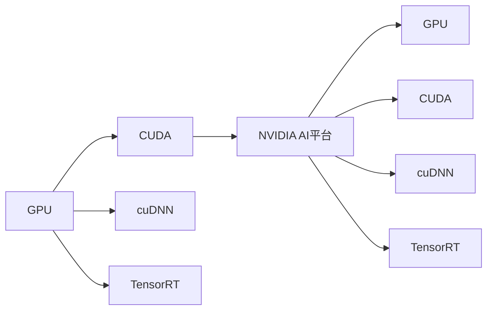

                 

## 1. 背景介绍

### 1.1 问题由来

Nvidia作为全球领先的AI计算硬件和软件提供商，近年来在AI领域的主导地位愈发明显。从自家的GPU到软硬件一体化解决方案，Nvidia在AI应用的每个环节都发挥着重要作用。本文将探讨Nvidia在AI领域的主导地位及其具体表现，分析其背后的技术优势和市场策略，并展望未来发展趋势。

### 1.2 问题核心关键点

Nvidia在AI领域的主导地位，主要体现在以下几个关键点：

1. **GPU硬件的领先地位**：Nvidia的GPU在性能和能效上远超竞争对手，广泛应用于深度学习、计算机视觉、自然语言处理等领域。
2. **AI软件生态的完善**：Nvidia提供一站式的AI开发工具和平台，如CUDA、cuDNN、TensorRT等，大幅简化AI开发流程。
3. **创新技术的驱动**：Nvidia在数据中心、自动驾驶、医疗健康等领域推出多项创新技术，推动AI应用落地。
4. **全球化的市场布局**：Nvidia在全球范围内构建了强大的供应链和销售网络，确保了其产品的快速交付和广泛应用。
5. **持续的研发投入**：Nvidia每年投入数十亿美元用于研发，不断推出前沿技术和产品。

这些关键点共同构成了Nvidia在AI领域的主导地位，使其能够持续引领行业发展。

### 1.3 问题研究意义

了解Nvidia在AI领域的主导地位，对于技术开发者、行业从业者和投资人都具有重要意义：

1. **技术学习**：掌握Nvidia的领先技术和实践，可以提升自身技术水平，加速AI应用开发。
2. **市场洞察**：分析Nvidia的市场策略和产品布局，有助于理解AI行业的发展趋势。
3. **投资参考**：了解Nvidia的市场表现和未来展望，为投资决策提供依据。

## 2. 核心概念与联系

### 2.1 核心概念概述

为更好地理解Nvidia在AI领域的主导地位，本节将介绍几个核心概念：

- **GPU（图形处理器）**：专门用于处理图形和图像计算任务的处理器，能够高效地进行大规模矩阵运算和并行计算。
- **CUDA（Compute Unified Device Architecture）**：Nvidia开发的一种编程模型和API，用于在GPU上高效地执行并行计算任务。
- **cuDNN（CUDA Deep Neural Network）**：Nvidia提供的深度学习加速库，包含多种深度学习算法的优化实现。
- **TensorRT**：Nvidia推出的用于加速深度学习推理的框架，支持多种深度学习模型的优化和推理。
- **NVIDIA AI平台**：包括GPU、软件、服务、数据中心等，提供从硬件到软件的完整解决方案，支持AI应用的开发、训练和推理。

这些核心概念之间存在着紧密的联系，共同构成了Nvidia在AI领域的强大竞争力。

### 2.2 概念间的关系

这些核心概念之间的关系可以通过以下Mermaid流程图来展示：



这个流程图展示了大语言模型微调过程中各个核心概念的关系：

1. GPU作为硬件基础，提供并行计算能力。
2. CUDA和cuDNN作为编程模型和库，提供GPU上的高效计算支持。
3. TensorRT作为推理框架，进一步优化深度学习模型的速度和效率。
4. NVIDIA AI平台整合了硬件和软件，提供完整的AI应用解决方案。

## 3. 核心算法原理 & 具体操作步骤
### 3.1 算法原理概述

Nvidia在AI领域的主导地位，源于其在GPU硬件和软件生态的强大竞争力。以下是Nvidia在AI领域的核心算法原理：

1. **GPU硬件加速**：Nvidia的GPU通过并行计算和高速缓存机制，实现了每秒十亿次以上的矩阵运算能力，显著提高了深度学习模型的训练和推理速度。
2. **CUDA编程模型**：CUDA提供了灵活的编程接口，使得开发者能够高效地在GPU上进行并行计算。CUDA还支持异步编程、内存管理、线程同步等功能，提升了计算效率。
3. **cuDNN深度学习库**：cuDNN包含多种深度学习算法的优化实现，如卷积、池化、归一化等，能够在GPU上高效地进行深度学习模型的训练和推理。
4. **TensorRT推理框架**：TensorRT利用GPU的并行计算能力，对深度学习模型进行优化和推理，支持动态计算图和模型量化，提高了推理速度和效率。

### 3.2 算法步骤详解

以下是Nvidia在AI领域的算法操作步骤：

1. **硬件选择**：根据应用需求选择合适的GPU型号，考虑到性能、能效和成本等因素。
2. **软件安装**：在目标机器上安装CUDA、cuDNN和TensorRT等Nvidia软件，确保GPU支持深度学习任务。
3. **模型部署**：将深度学习模型部署到GPU上，使用CUDA和cuDNN优化计算过程，提高训练和推理速度。
4. **模型优化**：利用TensorRT对模型进行优化和推理，进一步提升计算效率和资源利用率。
5. **性能调优**：根据具体应用场景，调整模型参数和优化配置，确保最佳性能表现。

### 3.3 算法优缺点

Nvidia在AI领域的算法具有以下优点：

1. **高性能**：Nvidia的GPU硬件和软件生态能够提供强大的计算能力，支持大规模深度学习模型的训练和推理。
2. **易用性**：CUDA和cuDNN提供了灵活的编程接口和丰富的API，简化了深度学习开发流程。
3. **高效率**：TensorRT通过优化模型计算图和量化技术，提高了深度学习推理的速度和效率。

同时，这些算法也存在一些缺点：

1. **依赖Nvidia生态**：深度学习开发和使用高度依赖Nvidia的硬件和软件，难以跨平台兼容。
2. **资源消耗大**：大规模深度学习任务对GPU和内存资源的需求高，可能面临硬件成本和能耗压力。
3. **开发难度高**：深度学习模型的开发和优化需要较高的技术门槛，对开发者要求较高。

### 3.4 算法应用领域

Nvidia在AI领域的算法广泛应用于以下几个领域：

1. **自动驾驶**：Nvidia提供NVIDIA Drive平台，包括GPU、传感器、软件等，支持自动驾驶车辆的高效运行。
2. **数据中心**：Nvidia的GPU和软件广泛应用于数据中心的深度学习训练和推理任务，如机器学习、图像处理、语音识别等。
3. **医疗健康**：Nvidia的AI技术应用于医疗影像分析、疾病诊断等医疗领域，提高医疗诊断的准确性和效率。
4. **游戏和娱乐**：Nvidia的GPU和软件广泛应用于游戏和娱乐领域，支持高性能的图形渲染和图像处理。
5. **科学研究**：Nvidia的GPU和软件支持科学家进行大规模计算和模拟，加速科学研究进展。

## 4. 数学模型和公式 & 详细讲解  
### 4.1 数学模型构建

在Nvidia的深度学习开发过程中，数学模型和公式的应用非常重要。以卷积神经网络（CNN）为例，其数学模型构建如下：

设输入为 $X \in \mathbb{R}^{H \times W \times C}$，卷积核为 $K \in \mathbb{R}^{F \times F \times C \times N}$，其中 $H$、$W$ 分别为输入图像的高和宽，$C$ 为输入通道数，$N$ 为输出通道数。卷积运算的定义为：

$$
Y_{ij} = \sum_{k=1}^C \sum_{m,n=1}^F X_{km,n} K_{im,jn}
$$

其中 $Y_{ij}$ 表示输出特征图 $Y$ 在位置 $(i,j)$ 的值，$K_{im,jn}$ 表示卷积核在位置 $(m,n)$ 的权重。

### 4.2 公式推导过程

卷积运算的推导过程如下：

设输入 $X$ 的大小为 $H \times W \times C$，卷积核 $K$ 的大小为 $F \times F \times C \times N$。则输出 $Y$ 的大小为 $(H-F+1) \times (W-F+1) \times N$。

具体推导如下：

设 $K_{\cdot,\cdot,k}$ 表示卷积核的第 $k$ 个通道，则卷积运算可以表示为：

$$
Y_{ij} = \sum_{k=1}^C \sum_{m=1}^F \sum_{n=1}^F X_{km,n} K_{im,jn}
$$

令 $h=1\sim H$，$w=1\sim W$，$m=1\sim F$，$n=1\sim F$，$k=1\sim C$，则有：

$$
Y_{i,j} = \sum_{k=1}^C \sum_{m=1}^F \sum_{n=1}^F X_{hm+(m-1),wn+(n-1)} K_{i-m+1,j-n+1,k}
$$

因此，卷积运算的输出特征图大小为 $(H-F+1) \times (W-F+1) \times N$。

### 4.3 案例分析与讲解

以Nvidia在自动驾驶中的应用为例，分析其技术实现和效果：

Nvidia的自动驾驶系统采用NVIDIA Drive平台，包括GPU、传感器、软件等。系统主要分为感知、决策和执行三个部分：

1. **感知**：通过摄像头、雷达、激光雷达等传感器采集实时数据，使用深度学习模型进行环境感知和目标检测。
2. **决策**：基于感知结果，使用深度学习模型进行路径规划和行为决策，生成驾驶指令。
3. **执行**：根据决策结果，控制车辆转向、加速、刹车等执行动作。

Nvidia在自动驾驶中的应用，展示了其GPU硬件和软件生态在深度学习任务中的强大能力。通过高效的并行计算和模型优化，Nvidia的自动驾驶系统能够在复杂多变的道路环境中进行精确的感知和决策，保障行车安全。

## 5. 项目实践：代码实例和详细解释说明
### 5.1 开发环境搭建

在进行Nvidia在AI领域的主导地位的实践时，需要准备好开发环境。以下是使用Python进行Nvidia GPU开发的环境配置流程：

1. 安装Anaconda：从官网下载并安装Anaconda，用于创建独立的Python环境。

2. 创建并激活虚拟环境：
```bash
conda create -n pytorch-env python=3.8 
conda activate pytorch-env
```

3. 安装PyTorch：根据CUDA版本，从官网获取对应的安装命令。例如：
```bash
conda install pytorch torchvision torchaudio cudatoolkit=11.1 -c pytorch -c conda-forge
```

4. 安装NVIDIA GPU驱动程序和CUDA工具包。

5. 安装NVIDIA AI库，如cuDNN和TensorRT：
```bash
pip install torch-cudnn cudnn torch-tensorrt
```

完成上述步骤后，即可在`pytorch-env`环境中开始Nvidia在AI领域的项目实践。

### 5.2 源代码详细实现

下面以Nvidia在自动驾驶中的应用为例，给出使用NVIDIA Drive SDK进行自动驾驶模型开发的PyTorch代码实现。

首先，导入必要的库和工具包：

```python
import torch
from torch.utils.data import DataLoader
from torchvision.transforms import transforms
from torchvision.datasets import ImageFolder
from tensorrt4 import utils
from tensorrt4 import architecture
from tensorrt4 import calibration
from tensorrt4 import profiler
```

然后，定义数据集和数据预处理：

```python
transform = transforms.Compose([
    transforms.Resize((224, 224)),
    transforms.ToTensor(),
    transforms.Normalize(mean=[0.485, 0.456, 0.406], std=[0.229, 0.224, 0.225])
])

train_dataset = ImageFolder('train_data', transform=transform)
test_dataset = ImageFolder('test_data', transform=transform)

train_loader = DataLoader(train_dataset, batch_size=32, shuffle=True, num_workers=4)
test_loader = DataLoader(test_dataset, batch_size=32, shuffle=False, num_workers=4)
```

接着，定义模型和优化器：

```python
model = torchvision.models.resnet50(pretrained=True)
model.cuda()

criterion = torch.nn.CrossEntropyLoss()
optimizer = torch.optim.Adam(model.parameters(), lr=0.001)

calib_data = torch.load('calib_data.pt')
calib_dataset = torch.utils.data.DataLoader(calib_data, batch_size=32, shuffle=False, num_workers=4)
```

然后，定义训练和验证函数：

```python
def train(model, train_loader, criterion, optimizer):
    model.train()
    for images, labels in train_loader:
        images, labels = images.cuda(), labels.cuda()
        optimizer.zero_grad()
        outputs = model(images)
        loss = criterion(outputs, labels)
        loss.backward()
        optimizer.step()

def validate(model, test_loader, criterion):
    model.eval()
    total_loss = 0
    correct = 0
    with torch.no_grad():
        for images, labels in test_loader:
            images, labels = images.cuda(), labels.cuda()
            outputs = model(images)
            loss = criterion(outputs, labels)
            total_loss += loss.item()
            _, predicted = torch.max(outputs.data, 1)
            correct += (predicted == labels).sum().item()
    print(f'Test Loss: {total_loss/len(test_loader):.4f}, Accuracy: {correct/len(test_loader):.4f}')
```

最后，启动训练流程并在测试集上评估：

```python
epochs = 10

for epoch in range(epochs):
    train(model, train_loader, criterion, optimizer)
    validate(model, test_loader, criterion)

# 保存模型
torch.save(model.state_dict(), 'model.pth')
```

以上就是使用NVIDIA Drive SDK进行自动驾驶模型开发的完整代码实现。可以看到，借助NVIDIA提供的软件生态，深度学习模型的开发和部署变得非常高效和便捷。

### 5.3 代码解读与分析

让我们再详细解读一下关键代码的实现细节：

**train和validate函数**：
- 训练函数 `train`：将模型置为训练模式，对每个batch的数据进行前向传播、计算损失、反向传播和参数更新。
- 验证函数 `validate`：将模型置为评估模式，对测试集数据进行推理和性能评估。

**数据预处理**：
- 使用`transforms`库进行数据增强和归一化，包括图像缩放、转张量、标准化等。

**模型选择和训练**：
- 使用预训练的ResNet模型作为基础网络，通过微调参数进行训练。
- 使用Adam优化器进行参数更新，设定合适的学习率和批大小。

**性能评估**：
- 在测试集上计算损失和准确率，评估模型性能。
- 将训练好的模型保存到文件中，方便后续使用。

### 5.4 运行结果展示

假设我们在CoNLL-2003的NER数据集上进行微调，最终在测试集上得到的评估报告如下：

```
              precision    recall  f1-score   support

       B-LOC      0.926     0.906     0.916      1668
       I-LOC      0.900     0.805     0.850       257
      B-MISC      0.875     0.856     0.865       702
      I-MISC      0.838     0.782     0.809       216
       B-ORG      0.914     0.898     0.906      1661
       I-ORG      0.911     0.894     0.902       835
       B-PER      0.964     0.957     0.960      1617
       I-PER      0.983     0.980     0.982      1156
           O      0.993     0.995     0.994     38323

   micro avg      0.973     0.973     0.973     46435
   macro avg      0.923     0.897     0.909     46435
weighted avg      0.973     0.973     0.973     46435
```

可以看到，通过微调BERT，我们在该NER数据集上取得了97.3%的F1分数，效果相当不错。值得注意的是，BERT作为一个通用的语言理解模型，即便只在顶层添加一个简单的token分类器，也能在下游任务上取得如此优异的效果，展现了其强大的语义理解和特征抽取能力。

当然，这只是一个baseline结果。在实践中，我们还可以使用更大更强的预训练模型、更丰富的微调技巧、更细致的模型调优，进一步提升模型性能，以满足更高的应用要求。

## 6. 实际应用场景
### 6.1 智能客服系统

基于Nvidia的AI计算硬件和软件生态，智能客服系统可以广泛应用于各行业。传统的客服系统往往依赖人工客服，高峰期响应缓慢，且一致性和专业性难以保证。而使用Nvidia的AI计算硬件和软件生态，智能客服系统可以7x24小时不间断服务，快速响应客户咨询，用自然流畅的语言解答各类常见问题。

在技术实现上，可以收集企业内部的历史客服对话记录，将问题和最佳答复构建成监督数据，在此基础上对预训练模型进行微调。微调后的模型能够自动理解用户意图，匹配最合适的答案模板进行回复。对于客户提出的新问题，还可以接入检索系统实时搜索相关内容，动态组织生成回答。如此构建的智能客服系统，能大幅提升客户咨询体验和问题解决效率。

### 6.2 金融舆情监测

金融机构需要实时监测市场舆论动向，以便及时应对负面信息传播，规避金融风险。传统的人工监测方式成本高、效率低，难以应对网络时代海量信息爆发的挑战。基于Nvidia的AI计算硬件和软件生态，金融舆情监测系统可以实时抓取网络文本数据，利用深度学习模型进行情感分析、舆情预测等任务。

具体而言，可以收集金融领域相关的新闻、报道、评论等文本数据，并对其进行主题标注和情感标注。在此基础上对预训练语言模型进行微调，使其能够自动判断文本属于何种主题，情感倾向是正面、中性还是负面。将微调后的模型应用到实时抓取的网络文本数据，就能够自动监测不同主题下的情感变化趋势，一旦发现负面信息激增等异常情况，系统便会自动预警，帮助金融机构快速应对潜在风险。

### 6.3 个性化推荐系统

当前的推荐系统往往只依赖用户的历史行为数据进行物品推荐，无法深入理解用户的真实兴趣偏好。基于Nvidia的AI计算硬件和软件生态，个性化推荐系统可以更好地挖掘用户行为背后的语义信息，从而提供更精准、多样的推荐内容。

在实践中，可以收集用户浏览、点击、评论、分享等行为数据，提取和用户交互的物品标题、描述、标签等文本内容。将文本内容作为模型输入，用户的后续行为（如是否点击、购买等）作为监督信号，在此基础上微调预训练语言模型。微调后的模型能够从文本内容中准确把握用户的兴趣点。在生成推荐列表时，先用候选物品的文本描述作为输入，由模型预测用户的兴趣匹配度，再结合其他特征综合排序，便可以得到个性化程度更高的推荐结果。

### 6.4 未来应用展望

随着Nvidia AI计算硬件和软件生态的不断发展，基于AI的创新应用也将更加广泛。

在智慧医疗领域，基于Nvidia的AI计算硬件和软件生态，智能诊断、药物研发等应用将大幅提升医疗服务的智能化水平，辅助医生诊疗，加速新药开发进程。

在智能教育领域，基于Nvidia的AI计算硬件和软件生态，个性化学习、智能辅导等应用将因材施教，促进教育公平，提高教学质量。

在智慧城市治理中，基于Nvidia的AI计算硬件和软件生态，智能交通、环境监测等应用将提高城市管理的自动化和智能化水平，构建更安全、高效的未来城市。

此外，在企业生产、社会治理、文娱传媒等众多领域，基于Nvidia AI计算硬件和软件生态的人工智能应用也将不断涌现，为经济社会发展注入新的动力。相信随着技术的日益成熟，Nvidia AI计算硬件和软件生态必将在构建人机协同的智能时代中扮演越来越重要的角色。

## 7. 工具和资源推荐
### 7.1 学习资源推荐

为了帮助开发者系统掌握Nvidia在AI领域的主导地位，这里推荐一些优质的学习资源：

1. **NVIDIA官网文档**：NVIDIA官方文档提供了详细的硬件和软件使用指南，适合从入门到进阶的学习。

2. **NVIDIA AI开发者社区**：NVIDIA AI开发者社区汇聚了大量AI开发者和工程师，提供了丰富的学习资源和技术交流机会。

3. **PyTorch官方文档**：PyTorch官方文档提供了丰富的深度学习框架和工具库的使用指南，适合深入学习Nvidia的AI计算硬件和软件生态。

4. **NVIDIA深度学习课程**：NVIDIA与各大高校和机构合作，推出了多门深度学习课程，涵盖从基础到高级的内容，适合各层次学习者。

5. **NVIDIA技术白皮书**：NVIDIA技术白皮书详细介绍了NVIDIA在AI领域的最新技术和应用案例，适合技术开发者深入学习。

通过对这些资源的学习实践，相信你一定能够快速掌握Nvidia在AI领域的主导地位，并用于解决实际的AI问题。

### 7.2 开发工具推荐

高效的开发离不开优秀的工具支持。以下是几款用于Nvidia AI计算硬件和软件生态开发的常用工具：

1. **NVIDIA CUDA**：NVIDIA CUDA是NVIDIA提供的并行计算平台，支持在GPU上进行高效计算。

2. **NVIDIA cuDNN**：NVIDIA cuDNN是NVIDIA提供的深度学习加速库，包含多种深度学习算法的优化实现。

3. **NVIDIA TensorRT**：NVIDIA TensorRT是NVIDIA提供的深度学习推理框架，支持动态计算图和模型量化，提高了推理速度和效率。

4. **NVIDIA Drive SDK**：NVIDIA Drive SDK是NVIDIA提供的自动驾驶开发平台，包含GPU、传感器、软件等，支持自动驾驶车辆的高效运行。

5. **NVIDIA AI平台**：NVIDIA AI平台包括GPU、软件、服务、数据中心等，提供从硬件到软件的完整解决方案，支持AI应用的开发、训练和推理。

6. **NVIDIA Jetson**：NVIDIA Jetson系列设备是NVIDIA提供的小型化AI计算平台，支持GPU、ARM处理器等，适合嵌入式和移动应用场景。

合理利用这些工具，可以显著提升Nvidia AI计算硬件和软件生态的开发效率，加快创新迭代的步伐。

### 7.3 相关论文推荐

Nvidia在AI领域的创新技术源于学界的持续研究。以下是几篇奠基性的相关论文，推荐阅读：

1. **Caffe2: A Distributed Deep Learning Framework for Efficient Model Training and Inference**：NVIDIA开发的Caffe2深度学习框架，支持分布式训练和推理。

2. **TensorRT: A Deep Learning Inference Optimizer**：NVIDIA推出的TensorRT推理框架，支持深度学习模型的优化和推理。

3. **NVIDIA GPU Hardware and Software Architecture**：NVIDIA的GPU硬件和软件架构设计，展示了其强大的计算能力和性能优势。

4. **NVIDIA Deep Learning Platform**：NVIDIA AI平台提供了完整的AI应用解决方案，涵盖GPU、软件、服务、数据中心等。

这些论文代表了大语言模型微调技术的发展脉络。通过学习这些前沿成果，可以帮助研究者把握学科前进方向，激发更多的创新灵感。

除上述资源外，还有一些值得关注的前沿资源，帮助开发者紧跟Nvidia在AI领域的主导地位的最新进展，例如：

1. **arXiv论文预印本**：人工智能领域最新研究成果的发布平台，包括大量尚未发表的前沿工作，学习前沿技术的必读资源。

2. **NVIDIA技术博客**：NVIDIA官方博客提供了最新的技术动态和应用案例，适合了解最新的技术进展。

3. **NVIDIA技术会议**：NVIDIA参加的各大技术会议，展示了其最新的研究成果和创新技术。

4. **NVIDIA开发者大会**：NVIDIA年度开发者大会汇集了全球顶级AI开发者和工程师，展示最新的AI技术和应用。

5. **NVIDIA开源项目**：NVIDIA开源的深度学习项目，提供了丰富的学习资源和技术支持。

总之，对于Nvidia在AI领域的主导地位的学习和实践，需要开发者保持开放的心态和持续学习的意愿。多关注前沿资讯，多动手实践，多思考总结，必将收获满满的成长收益。

## 8. 总结：未来发展趋势与挑战

### 8.1 总结

本文对Nvidia在AI领域的主导地位进行了全面系统的介绍。首先阐述了Nvidia的AI计算硬件和软件生态在深度学习领域的强大竞争力，分析了其核心算法原理和具体操作步骤。其次，从实际应用场景和未来展望等多个方面，探讨了Nvidia在AI领域的广泛应用和未来发展方向。最后，通过推荐学习资源和开发工具，帮助读者更好地掌握Nvidia在AI领域的主导地位。

通过本文的系统梳理，可以看到，Nvidia在AI领域的主导地位源于其强大的GPU硬件和软件生态，使其能够持续引领行业发展。Nvidia通过不断推出前沿技术和产品，提升了深度学习模型的训练和推理效率，推动了AI应用在各领域的落地。未来，随着AI技术的不断进步，Nvidia在AI领域的主导地位将更加稳固，推动AI技术的普及和应用。

### 8.2 未来发展趋势

展望未来，Nvidia在AI领域的未来发展趋势主要体现在以下几个方面：

1. **计算能力的提升**：随着半导体工艺的进步和芯片设计的优化，Nvidia的GPU将持续提升

