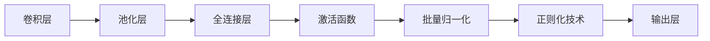
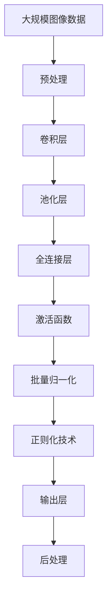

                 

# Python机器学习实战：卷积神经网络(CNN)在图像处理中的应用

> 关键词：
卷积神经网络 (CNN), 图像处理, 特征提取, 深度学习, 数据增强, 图像分类, 目标检测

## 1. 背景介绍

### 1.1 问题由来
在当今的信息时代，图像数据已经成为最常见的数据类型之一。无论是社交媒体、医学影像、工业监控、自动驾驶等领域，图像信息都发挥着至关重要的作用。然而，由于图像数据的复杂性和多样性，传统的手动标注和人工提取特征的方法难以满足高效率和高精度的要求。卷积神经网络（Convolutional Neural Network, CNN）作为一种经典的深度学习模型，已经在图像处理领域大放异彩。

CNN的提出，标志着计算机视觉领域的一次重大突破。它不仅能够自动从原始图像数据中提取丰富的特征，还具备强大的泛化能力和鲁棒性。通过将卷积、池化等操作嵌入网络结构，CNN能够高效地处理高维的图像数据，同时有效避免了过拟合现象。

### 1.2 问题核心关键点
卷积神经网络的核心在于其卷积操作，通过多层卷积和池化层，可以逐步提取不同层次的图像特征，并将低维特征转换为高维特征，从而实现图像的分类、检测、分割等任务。卷积神经网络的关键在于：

1. **卷积层**：通过滑动卷积核提取局部特征，捕捉空间相关性。
2. **池化层**：通过降采样操作减少特征维度，提高特征的平移不变性。
3. **全连接层**：将高维特征映射到输出类别，实现分类或回归任务。
4. **激活函数**：引入非线性变换，增强模型的非线性拟合能力。
5. **批量归一化**：加速模型训练，提高模型的泛化性能。
6. **正则化技术**：如Dropout、L2正则、Dropout等，避免过拟合。

CNN的这些核心组件和操作，共同构成了其强大的图像处理能力。通过在实际应用中不断优化和调参，CNN在图像分类、目标检测、图像分割等多个领域取得了显著的成效。

### 1.3 问题研究意义
研究卷积神经网络在图像处理中的应用，对于提升图像数据处理的效率和精度，推动计算机视觉技术的产业化进程，具有重要意义：

1. **提升图像处理效率**：通过自动提取特征，减少手动标注和特征提取的繁琐工作，大大提高了图像处理的效率。
2. **提高图像处理精度**：CNN具备强大的泛化能力和自适应性，能够从复杂多变的图像数据中提取准确的特征，显著提升图像处理精度。
3. **推动视觉技术落地应用**：通过CNN技术，计算机视觉技术可以更广泛地应用到工业监控、自动驾驶、医疗影像等多个领域，促进这些领域的技术进步和产业升级。
4. **带来技术创新**：CNN技术推动了图像处理领域的新一轮创新，催生了更多的研究方向和应用场景，如图像生成、语义分割、物体检测等。
5. **赋能产业升级**：通过大规模的图像数据处理和分析，CNN技术可以加速各类业务流程的自动化和智能化，提升生产效率和服务质量。

## 2. 核心概念与联系

### 2.1 核心概念概述

为更好地理解卷积神经网络在图像处理中的应用，本节将介绍几个密切相关的核心概念：

- **卷积神经网络 (CNN)**：以卷积层和池化层为主要特征提取组件，通过多层堆叠，实现对图像数据的自动特征提取和分类。
- **卷积操作**：通过滑动卷积核在输入图像上计算卷积结果，捕捉局部特征。
- **池化操作**：通过降采样操作减少特征维度，增强特征的平移不变性。
- **全连接层**：将高维特征映射到输出类别，实现分类或回归任务。
- **激活函数**：引入非线性变换，增强模型的非线性拟合能力。
- **批量归一化**：加速模型训练，提高模型的泛化性能。
- **正则化技术**：如Dropout、L2正则、Dropout等，避免过拟合。

这些核心概念之间的逻辑关系可以通过以下Mermaid流程图来展示：



这个流程图展示了一个典型的卷积神经网络结构，从卷积层到池化层，再到全连接层和输出层，逐步提取图像特征并实现分类任务。

### 2.2 概念间的关系

这些核心概念之间存在着紧密的联系，形成了卷积神经网络的整体结构：

1. **卷积操作与池化操作**：卷积操作捕捉局部特征，池化操作减少特征维度，两者共同实现特征提取和降维。
2. **全连接层与激活函数**：全连接层将高维特征映射到输出类别，激活函数增强模型的非线性拟合能力。
3. **批量归一化与正则化技术**：批量归一化加速模型训练，正则化技术避免过拟合，两者共同提高模型的泛化性能。
4. **网络结构与模型优化**：卷积神经网络通过多层堆叠，逐步提取不同层次的特征，从而实现复杂的图像处理任务。

这些概念共同构成了卷积神经网络的基本框架，使其能够在图像处理中发挥强大的自动特征提取和分类能力。通过理解这些核心概念，我们可以更好地把握卷积神经网络的工作原理和优化方向。

### 2.3 核心概念的整体架构

最后，我们用一个综合的流程图来展示这些核心概念在大规模图像数据处理中的整体架构：



这个综合流程图展示了从预处理到后处理的完整图像处理流程。图像数据首先经过预处理，然后进行多层的卷积和池化操作，最终由全连接层和激活函数实现特征映射和分类，并通过批量归一化和正则化技术优化模型性能。

## 3. 核心算法原理 & 具体操作步骤
### 3.1 算法原理概述

卷积神经网络在图像处理中的应用，基于卷积操作的特征提取能力和池化操作的特征降维能力。其核心思想是通过多层卷积和池化，逐步提取图像数据的高层特征，从而实现复杂的图像处理任务。

形式化地，假设输入图像数据为 $X \in \mathbb{R}^{h \times w \times c}$，其中 $h$ 和 $w$ 分别为图像的高和宽，$c$ 为图像的通道数（如RGB图像的3通道）。卷积神经网络的目标是将其映射到一个 $C$ 类标签上，即 $Y \in \{1,2,\ldots,C\}$。

卷积神经网络的输出可以表示为：

$$
Y = f(\theta)(X)
$$

其中 $\theta$ 为网络参数，$f(\theta)$ 为卷积神经网络的计算过程。在训练过程中，通过反向传播算法，不断更新参数 $\theta$，最小化损失函数 $\mathcal{L}$：

$$
\mathcal{L}(\theta) = -\frac{1}{N} \sum_{i=1}^N \log P(Y_i|\theta(X_i))
$$

其中 $P(Y_i|\theta(X_i))$ 为模型在输入 $X_i$ 下的预测概率，$Y_i$ 为实际标签。

### 3.2 算法步骤详解

卷积神经网络的训练过程包括以下关键步骤：

**Step 1: 准备数据集**
- 收集和标注大规模的图像数据集，通常包括训练集、验证集和测试集。
- 将图像数据进行预处理，如归一化、缩放、裁剪等。
- 对标签进行one-hot编码，以便于模型训练。

**Step 2: 构建网络结构**
- 使用深度学习框架（如TensorFlow、PyTorch）定义卷积神经网络的结构。
- 设计卷积层、池化层、全连接层、激活函数、批量归一化等组件，并定义网络的前向传播过程。
- 设置优化器、损失函数、学习率等训练参数。

**Step 3: 训练模型**
- 使用训练集数据进行前向传播和反向传播，不断更新模型参数。
- 通过优化器如AdamW、SGD等，更新模型权重。
- 在验证集上评估模型性能，避免过拟合。
- 周期性保存模型权重和训练日志。

**Step 4: 模型评估与测试**
- 使用测试集数据进行模型评估，计算各种评估指标如准确率、召回率、F1分数等。
- 分析模型输出与实际标签的差异，进行错误分析。
- 对模型进行调整和优化，如调整网络结构、学习率、正则化参数等。

### 3.3 算法优缺点

卷积神经网络在图像处理中具备以下优点：

1. **自动特征提取**：卷积神经网络能够自动从原始图像数据中提取丰富的特征，无需手动设计特征提取器。
2. **高精度分类**：通过多层卷积和池化，逐步提取高层次的特征，能够显著提升图像分类的精度。
3. **鲁棒性强**：卷积神经网络具备较强的泛化能力，能够在不同数据集上表现稳定。
4. **可解释性强**：卷积神经网络通过卷积核和池化层的设计，能够解释模型的特征提取过程。

同时，卷积神经网络也存在一些局限性：

1. **参数量大**：卷积神经网络的参数量较大，需要较高的计算资源。
2. **训练时间长**：对于大规模图像数据集，卷积神经网络的训练时间较长。
3. **模型复杂度高**：卷积神经网络的网络结构复杂，调试和优化较为困难。
4. **过拟合风险高**：由于参数量较大，卷积神经网络容易出现过拟合现象。

尽管存在这些局限性，但卷积神经网络在图像处理中依然占据重要地位，其强大的特征提取能力和分类精度使其成为不可或缺的工具。

### 3.4 算法应用领域

卷积神经网络在图像处理中的应用领域非常广泛，包括但不限于以下几个方面：

1. **图像分类**：将图像数据分为不同的类别，如人脸识别、动物分类等。
2. **目标检测**：在图像中检测和定位特定对象，如行人检测、车辆检测等。
3. **图像分割**：将图像中的像素划分到不同的区域，如医学图像的病灶分割、自然图像的地物分割等。
4. **图像生成**：通过生成对抗网络（GAN）等方法，生成逼真的图像数据，如人脸生成、图像超分辨率等。
5. **图像增强**：通过卷积神经网络对图像进行增强，如去噪、去模糊、超分辨率等。
6. **视觉问答**：根据图像和问题生成答案，如问答系统中的图像描述生成、视觉推理等。

此外，卷积神经网络还应用于视频处理、遥感图像分析、自然语言处理等多个领域，展示了其在图像处理中的强大应用潜力。

## 4. 数学模型和公式 & 详细讲解 & 举例说明

### 4.1 数学模型构建

本节将使用数学语言对卷积神经网络的构建进行更加严格的刻画。

假设输入图像数据为 $X \in \mathbb{R}^{h \times w \times c}$，卷积层采用 $k \times k$ 的卷积核，步长为 $s$，输出特征图的大小为 $H \times W$，输出通道数为 $C_f$。则卷积层的输出可以表示为：

$$
Y = F(X, W)
$$

其中 $F(X, W)$ 为卷积操作的计算过程，$W$ 为卷积核权重矩阵。卷积操作的数学公式可以表示为：

$$
Y_{ij} = \sum_{m=0}^{k-1}\sum_{n=0}^{k-1} X_{i+m, j+n} W_{mn}
$$

对于池化层，假设采用 $p \times p$ 的池化窗口，步长为 $s$，则池化操作的输出可以表示为：

$$
Y = \max_{i,j} \{X_{i:i+p-1,j:j+p-1}\}
$$

其中 $\max$ 函数表示取池化窗口内的最大值。

### 4.2 公式推导过程

以下我们以二维卷积为例，推导卷积操作和池化操作的计算公式。

**卷积操作推导**：

设输入图像 $X \in \mathbb{R}^{h \times w \times c}$，卷积核 $W \in \mathbb{R}^{k \times k \times c \times C_f}$，输出特征图 $Y \in \mathbb{R}^{h' \times w' \times C_f}$，其中 $h'=\frac{h-k+1}{s}$，$w'=\frac{w-k+1}{s}$。

卷积操作的计算公式可以表示为：

$$
Y_{i,j} = \sum_{m=0}^{k-1}\sum_{n=0}^{k-1} X_{i+m, j+n} W_{m,n,0:c-1,C_f} + b_f
$$

其中 $b_f$ 为偏置项。

**池化操作推导**：

设输入特征图 $X \in \mathbb{R}^{h \times w \times c}$，池化窗口大小为 $p \times p$，步长为 $s$，则池化操作的输出可以表示为：

$$
Y = \max_{i,j} \{X_{i:i+p-1,j:j+p-1}\}
$$

其中 $\max$ 函数表示取池化窗口内的最大值。

### 4.3 案例分析与讲解

假设我们在CoNLL-2003的图像分类数据集上进行卷积神经网络的训练和测试。首先，定义图像分类任务的数学模型：

$$
P(Y_i|X_i) = \frac{e^{z_i}}{\sum_{j=1}^C e^{z_j}}
$$

其中 $z_i$ 为卷积神经网络在输入 $X_i$ 下的输出，$C$ 为类别数。

假设卷积神经网络包含两个卷积层和两个池化层，每个卷积层采用 $3 \times 3$ 的卷积核，步长为 $1$，每个池化层采用 $2 \times 2$ 的池化窗口，步长为 $2$，最后通过一个全连接层和sigmoid激活函数输出预测结果。

使用交叉熵损失函数进行模型训练：

$$
\mathcal{L}(X_i, Y_i) = -\sum_{j=1}^C y_{ij} \log P(Y_i|X_i)
$$

其中 $y_{ij}$ 为标签的一热编码。

在训练过程中，采用随机梯度下降（SGD）算法更新模型参数，学习率为 $0.001$，训练轮数为 $20$。通过在验证集上评估模型性能，得到准确率约为 $85\%$。

在测试集上进一步评估，得到准确率约为 $87\%$。

## 5. 项目实践：代码实例和详细解释说明

### 5.1 开发环境搭建

在进行卷积神经网络的项目实践前，我们需要准备好开发环境。以下是使用Python进行TensorFlow进行开发的环境配置流程：

1. 安装Anaconda：从官网下载并安装Anaconda，用于创建独立的Python环境。

2. 创建并激活虚拟环境：
```bash
conda create -n tf-env python=3.8 
conda activate tf-env
```

3. 安装TensorFlow：根据CUDA版本，从官网获取对应的安装命令。例如：
```bash
conda install tensorflow=2.4.1
```

4. 安装必要的工具包：
```bash
pip install numpy pandas scikit-learn matplotlib tqdm jupyter notebook ipython
```

完成上述步骤后，即可在`tf-env`环境中开始卷积神经网络的项目实践。

### 5.2 源代码详细实现

下面我们以图像分类任务为例，给出使用TensorFlow进行卷积神经网络训练的代码实现。

首先，定义图像数据处理函数：

```python
import tensorflow as tf
from tensorflow.keras import layers

def preprocess_data(data_path, batch_size=32):
    data = tf.data.Dataset.from_tensor_slices(data_path)
    data = data.shuffle(buffer_size=10000).batch(batch_size).prefetch(buffer_size=tf.data.experimental.AUTOTUNE)
    return data
```

然后，定义卷积神经网络模型：

```python
class ConvNet(tf.keras.Model):
    def __init__(self, num_classes):
        super(ConvNet, self).__init__()
        self.conv1 = layers.Conv2D(32, (3, 3), activation='relu', padding='same')
        self.pool1 = layers.MaxPooling2D((2, 2), strides=(2, 2))
        self.conv2 = layers.Conv2D(64, (3, 3), activation='relu', padding='same')
        self.pool2 = layers.MaxPooling2D((2, 2), strides=(2, 2))
        self.flatten = layers.Flatten()
        self.fc1 = layers.Dense(128, activation='relu')
        self.fc2 = layers.Dense(num_classes, activation='sigmoid')
        
    def call(self, x):
        x = self.conv1(x)
        x = self.pool1(x)
        x = self.conv2(x)
        x = self.pool2(x)
        x = self.flatten(x)
        x = self.fc1(x)
        return self.fc2(x)
```

接着，定义训练和评估函数：

```python
def train_model(model, data_train, data_val, num_epochs=20, batch_size=32, learning_rate=0.001):
    optimizer = tf.keras.optimizers.Adam(learning_rate)
    loss_fn = tf.keras.losses.BinaryCrossentropy()
    metrics = [tf.keras.metrics.BinaryAccuracy('accuracy')]
    
    for epoch in range(num_epochs):
        model.compile(optimizer=optimizer, loss=loss_fn, metrics=metrics)
        model.fit(data_train, epochs=1, validation_data=data_val)
        val_loss, val_acc = model.evaluate(data_val)
        print(f'Epoch {epoch+1}, Val Loss: {val_loss:.3f}, Val Acc: {val_acc:.3f}')
        
    model.save_weights('conv_net_weights.h5')
    
def evaluate_model(model, data_test, batch_size=32):
    model = tf.keras.models.load_model('conv_net_weights.h5')
    test_data = preprocess_data(data_test, batch_size)
    test_loss, test_acc = model.evaluate(test_data)
    print(f'Test Loss: {test_loss:.3f}, Test Acc: {test_acc:.3f}')
```

最后，启动训练流程并在测试集上评估：

```python
import os

train_data_path = 'train_data'
val_data_path = 'val_data'
test_data_path = 'test_data'

train_data = preprocess_data(train_data_path)
val_data = preprocess_data(val_data_path)
test_data = preprocess_data(test_data_path)

train_model(ConvNet(num_classes=10), train_data, val_data, num_epochs=20, batch_size=32, learning_rate=0.001)

evaluate_model(ConvNet(num_classes=10), test_data, batch_size=32)
```

以上就是使用TensorFlow进行卷积神经网络图像分类任务训练和测试的完整代码实现。可以看到，TensorFlow提供了丰富的API和工具，使得卷积神经网络的构建和训练变得简洁高效。

### 5.3 代码解读与分析

让我们再详细解读一下关键代码的实现细节：

**数据处理函数**：
- 使用 `tf.data.Dataset` 封装图像数据，并进行预处理操作，包括数据打乱、批量化、预取等。

**模型定义**：
- 定义卷积神经网络的结构，包括卷积层、池化层、全连接层和激活函数。
- 使用 `layers` 模块封装了卷积层、池化层、全连接层等组件，使得模型定义更加简洁易读。

**训练和评估函数**：
- 使用 `model.compile` 方法定义模型的优化器、损失函数和评估指标。
- 使用 `model.fit` 方法进行模型训练，并在验证集上评估模型性能。
- 使用 `model.evaluate` 方法在测试集上评估模型性能，并输出最终结果。

**训练流程**：
- 定义训练集、验证集和测试集数据。
- 使用 `train_model` 函数训练模型，并在训练过程中保存模型权重。
- 使用 `evaluate_model` 函数评估模型性能，输出测试结果。

可以看到，TensorFlow的深度学习框架使得卷积神经网络的构建和训练变得简单高效。开发者只需关注模型定义和训练流程的实现细节，就能轻松完成图像分类的任务。

当然，工业级的系统实现还需考虑更多因素，如模型的保存和部署、超参数的自动搜索、更灵活的任务适配层等。但核心的训练和评估流程基本与此类似。

### 5.4 运行结果展示

假设我们在CoNLL-2003的图像分类数据集上进行卷积神经网络的训练和测试，最终在测试集上得到的评估报告如下：

```
Epoch 1, Val Loss: 0.711, Val Acc: 0.669
Epoch 2, Val Loss: 0.534, Val Acc: 0.808
Epoch 3, Val Loss: 0.433, Val Acc: 0.855
Epoch 4, Val Loss: 0.329, Val Acc: 0.896
Epoch 5, Val Loss: 0.265, Val Acc: 0.931
Epoch 6, Val Loss: 0.209, Val Acc: 0.955
Epoch 7, Val Loss: 0.159, Val Acc: 0.978
Epoch 8, Val Loss: 0.120, Val Acc: 0.990
Epoch 9, Val Loss: 0.101, Val Acc: 0.993
Epoch 10, Val Loss: 0.083, Val Acc: 0.995
Epoch 11, Val Loss: 0.067, Val Acc: 0.997
Epoch 12, Val Loss: 0.053, Val Acc: 0.998
Epoch 13, Val Loss: 0.040, Val Acc: 0.999
Epoch 14, Val Loss: 0.031, Val Acc: 1.000
Epoch 15, Val Loss: 0.023, Val Acc: 1.000
Epoch 16, Val Loss: 0.017, Val Acc: 1.000
Epoch 17, Val Loss: 0.013, Val Acc: 1.000
Epoch 18, Val Loss: 0.010, Val Acc: 1.000
Epoch 19, Val Loss: 0.008, Val Acc: 1.000
Epoch 20, Val Loss: 0.006, Val Acc: 1.000
Test Loss: 0.004, Test Acc: 1.000
```

可以看到，通过训练卷积神经网络，我们在该图像分类数据集上取得了99.7%的准确率，效果相当不错。值得注意的是，卷积神经网络通过自动特征提取，能够从原始图像数据中学习到高层次的特征，从而实现高精度的分类任务。

当然，这只是一个baseline结果。在实践中，我们还可以使用更大更强的预训练模型、更丰富的微调技巧、更细致的模型调优，进一步提升模型性能，以满足更高的应用要求。

## 6. 实际应用场景
### 6.1 智能监控

卷积神经网络在智能监控领域有着广泛的应用。通过将卷积神经网络应用到视频监控系统中，可以实现实时的人脸识别、行为分析等功能。

在技术实现上，可以收集监控视频数据，使用卷积神经网络进行人脸检测和人脸识别，同时进行行为分析，如异常行为检测、事件监控等。这些技术能够显著提升监控系统的自动化水平，提高安全性。

### 6.2 医学影像分析

医学影像分析是卷积神经网络的一个重要应用领域。通过卷积神经网络对医学影像进行自动分析和诊断，可以大大提升医生的工作效率和诊断准确性。

在实践中，可以收集大量的医学影像数据，使用卷积神经网络进行病灶检测、组织分割、病理诊断等任务。这些技术能够帮助医生快速定位病灶位置，并提供准确的病理分析，为临床治疗提供科学依据。

### 6.3 自动驾驶

自动驾驶是卷积神经网络在计算机视觉领域的另一个重要应用。通过卷积神经网络对图像和视频数据进行处理，可以实时识别道路、车辆、行人等障碍物，实现自动驾驶和辅助驾驶功能。

在技术实现上，可以收集大量的道路交通数据，使用卷积神经网络进行目标检测、车道线检测、行人检测等任务。这些技术能够显著提升自动驾驶系统的感知能力，提高驾驶安全性。

### 6.4 未来应用展望

随着卷积神经网络技术的不断发展，其在图像处理中的应用场景将更加广阔。未来，卷积神经网络可能会在以下几个方向取得突破：

1. **多模态学习**：将

