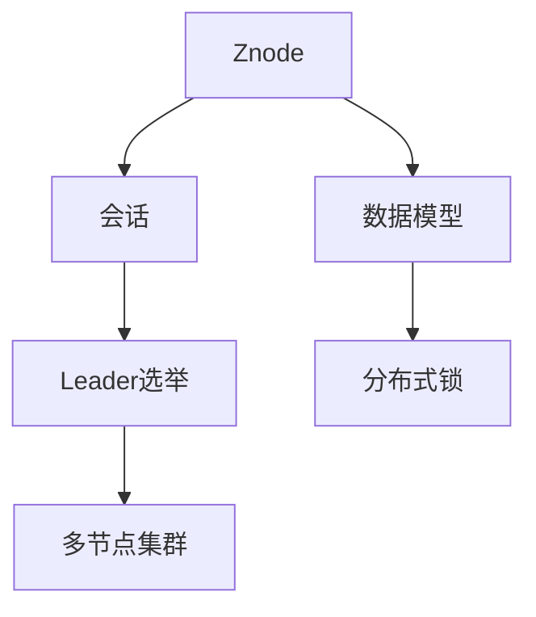
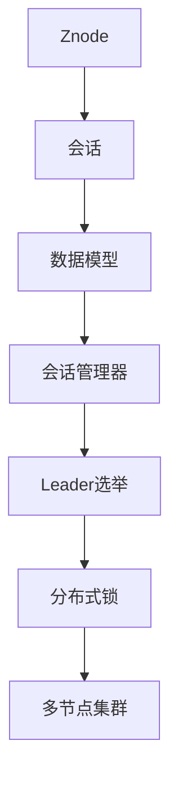

                 

# Zookeeper分布式协调服务原理与代码实例讲解

> 关键词：
- Zookeeper
- 分布式协调
- 配置管理
- 故障容忍
- 分布式锁
- Leader选举
- 数据存储

## 1. 背景介绍

### 1.1 问题由来

在大规模分布式系统中，各个服务节点之间的交互频繁，需要实时共享和同步状态信息。然而，在多节点环境下，通信可靠性、数据一致性、服务高可用性等挑战层出不穷。为了解决这些问题，分布式协调服务（如Zookeeper）应运而生，成为构建高效、可靠分布式系统的关键组件。

### 1.2 问题核心关键点

Zookeeper是一个开源的分布式协调服务，主要解决分布式系统中常见的问题，如配置管理、服务发现、分布式锁、故障容忍、 Leader选举等。核心特性包括：

1. **数据模型**：基于树形结构的命名空间，每个节点称为Znode。
2. **分布式锁**：支持分布式锁机制，确保数据访问的唯一性。
3. ** Leader选举**：支持自动选举 Leader节点，提高系统的容错性。
4. **高可用性**：采用多节点集群设计，保证系统的高可用性和可靠性。
5. **数据持久化**：将数据持久化到磁盘，提高系统的可靠性和故障容忍度。
6. **客户端模型**：基于会话模型的客户端接口，支持异步I/O和数据同步。

### 1.3 问题研究意义

研究Zookeeper分布式协调服务原理与实现方法，对于构建高效、可靠、可扩展的分布式系统具有重要意义：

1. **配置管理**：帮助系统动态管理配置信息，确保服务节点状态的一致性。
2. **服务发现**：简化服务节点的发现和注册，提高系统调度的效率和灵活性。
3. **分布式锁**：支持分布式锁机制，防止数据竞争，保证数据访问的原子性。
4. ** Leader选举**：确保系统的故障容忍和数据一致性，避免单点故障。
5. **客户端模型**：提高系统的并发处理能力和吞吐量，优化系统的性能。

## 2. 核心概念与联系

### 2.1 核心概念概述

为了更好地理解Zookeeper的工作原理，我们首先介绍几个核心概念：

- **Znode**：Zookeeper中的数据存储单元，可以是持久化节点或临时节点。
- **会话**：客户端与Zookeeper建立的长连接，用于实现数据同步和状态通知。
- ** Leader选举**：Zookeeper自动选举一个 Leader节点，用于协调集群操作和数据同步。
- **分布式锁**：通过设置和释放锁节点，实现对共享资源的互斥访问。
- **数据模型**：基于树形结构的命名空间，支持层次化组织和管理。
- **多节点集群**：通过多节点配置，提高系统的可用性和容错性。

### 2.2 概念间的关系

这些核心概念之间存在着紧密的联系，形成了一个完整的Zookeeper系统：



这个流程图展示了Zookeeper各个核心概念之间的联系：

1. **数据模型**是Zookeeper的基础，通过树形结构组织和存储数据。
2. **会话**是客户端与Zookeeper的连接，用于实现数据同步和状态通知。
3. ** Leader选举**通过多节点集群设计，确保系统的故障容忍和数据一致性。
4. **分布式锁**通过设置和释放锁节点，实现对共享资源的互斥访问。
5. **多节点集群**通过多个节点共同工作，提高系统的可用性和容错性。

### 2.3 核心概念的整体架构

最终，我们可以用一个综合的流程图来展示Zookeeper的整体架构：



这个综合流程图展示了Zookeeper从数据模型到会话、会话管理器、 Leader选举、分布式锁以及多节点集群的全过程。每个组件相互作用，确保系统的稳定性和可靠性。

## 3. 核心算法原理 & 具体操作步骤
### 3.1 算法原理概述

Zookeeper的核心算法包括数据模型、会话管理器、 Leader选举和分布式锁等。下面我们详细介绍这些算法的原理和实现。

### 3.2 算法步骤详解

#### 3.2.1 数据模型

Zookeeper的数据模型基于树形结构，每个节点称为Znode。Znode支持以下类型：

- 持久化节点（Persistent Node）：数据永久保存在Zookeeper中，即使在服务重启后仍然存在。
- 临时节点（Ephemeral Node）：数据仅在会话期内存在，会话结束时自动删除。
- 顺序节点（Sequential Node）：在创建时自动生成一个顺序号，确保节点名的唯一性。

数据模型的具体实现步骤如下：

1. 客户端向Zookeeper发起创建节点的请求。
2. Zookeeper服务器接收请求，检查节点名的唯一性。
3. 创建节点并返回节点路径和状态信息。

#### 3.2.2 会话管理器

会话管理器负责管理客户端与Zookeeper之间的连接。客户端通过会话与Zookeeper进行数据同步和状态通知。会话的创建和销毁过程如下：

1. 客户端向Zookeeper发起会话连接的请求。
2. Zookeeper服务器接受请求，创建会话信息。
3. 客户端在会话期内进行数据同步和状态通知。
4. 会话结束时，Zookeeper删除会话信息。

#### 3.2.3 Leader选举

Leader选举是Zookeeper的核心算法之一。当Zookeeper集群出现节点故障时，通过 Leader选举重新选择一个 Leader节点。选举过程如下：

1. 每个节点在启动时向Zookeeper注册自己的信息。
2. Zookeeper根据节点信息选举 Leader节点。
3. Leader节点负责协调集群操作和数据同步。

#### 3.2.4 分布式锁

分布式锁通过设置和释放锁节点，实现对共享资源的互斥访问。锁的创建和释放过程如下：

1. 客户端向Zookeeper创建锁节点。
2. Zookeeper服务器接收请求，创建锁节点。
3. 其他客户端尝试创建锁节点时，会检测到节点的存在，从而失败。
4. 客户端释放锁节点时，其他客户端可以获取锁节点，重新访问共享资源。

### 3.3 算法优缺点

Zookeeper的优点包括：

- 高可用性：通过多节点集群设计，保证系统的高可用性和容错性。
- 高性能：基于分布式锁和 Leader选举机制，提高系统的性能和可靠性。
- 稳定性：数据持久化到磁盘，提高系统的可靠性和故障容忍度。

缺点包括：

- 配置复杂：集群配置和管理需要一定的专业知识。
- 性能瓶颈：在高并发情况下，可能会出现性能瓶颈。
- 数据一致性问题：在网络分区或节点故障情况下，数据一致性难以保证。

### 3.4 算法应用领域

Zookeeper主要应用于以下领域：

- **配置管理**：管理系统的配置信息，确保服务节点状态的一致性。
- **服务发现**：简化服务节点的发现和注册，提高系统调度的效率和灵活性。
- **分布式锁**：支持分布式锁机制，防止数据竞争，保证数据访问的原子性。
- ** Leader选举**：确保系统的故障容忍和数据一致性，避免单点故障。
- **数据存储**：将数据持久化到磁盘，提高系统的可靠性和故障容忍度。
- **高可用性**：通过多节点集群设计，提高系统的可用性和容错性。

## 4. 数学模型和公式 & 详细讲解 & 举例说明

### 4.1 数学模型构建

Zookeeper的核心数据模型基于树形结构，支持层次化组织和管理。每个节点称为Znode，支持持久化节点、临时节点和顺序节点三种类型。节点信息包括：

- **节点名**：节点的唯一标识。
- **节点类型**：持久化节点、临时节点或顺序节点。
- **节点值**：节点的数据值。
- **节点状态**：节点创建时间、修改时间、版本信息等。

节点信息以键值对形式存储，满足以下条件：

- 键值对的键为节点名。
- 键值对的值为节点信息，包括节点类型、节点值和节点状态。

### 4.2 公式推导过程

以一个简单的持久化节点创建过程为例，其数据模型的公式推导如下：

1. 节点信息：`node_name | persistent | node_value | created_time | modified_time | version`
2. 数据模型公式：
   $$
   data_model = \{(node_name, (node_type, node_value, created_time, modified_time, version))\}
   $$

在实际应用中，节点信息需要进行编码和解码，以便于数据的存储和传输。编码和解码过程如下：

1. 编码：将节点信息转换为字节流，存储在磁盘或网络传输中。
2. 解码：将字节流转换为节点信息，恢复节点的完整状态。

### 4.3 案例分析与讲解

假设一个分布式系统需要管理配置信息，可以使用Zookeeper的数据模型来组织和管理。具体实现步骤如下：

1. 创建持久化节点，用于存储配置信息。
2. 各个服务节点定期从Zookeeper获取最新的配置信息，进行本地配置更新。
3. 当配置信息发生变化时，更新持久化节点的值，并通知所有服务节点重新获取最新配置。
4. 使用分布式锁机制，确保配置信息的修改是原子性的，避免数据竞争。

## 5. 项目实践：代码实例和详细解释说明
### 5.1 开发环境搭建

在进行Zookeeper项目开发前，需要准备以下开发环境：

1. 安装Java Development Kit（JDK）：从Oracle官网下载并安装JDK。
2. 安装Apache Zookeeper：从Zookeeper官网下载并安装Apache Zookeeper。
3. 安装Zookeeper客户端工具：可以使用Zookeeper提供的客户端工具，如Zookeeper CLI（ZCLI）、Zookeeper Java客户端（Zookeeper Client API）等。

### 5.2 源代码详细实现

这里以Zookeeper Java客户端为例，展示如何创建持久化节点：

```java
import org.apache.zookeeper.*;

public class ZookeeperClient {
    private static final String ZOOKEEPER_HOST = "localhost";
    private static final int ZOOKEEPER_PORT = 2181;
    private static ZooKeeper zk;
    
    public static void main(String[] args) throws Exception {
        zk = new ZooKeeper("localhost:2181", 3000, new Watcher() {
            public void process(WatchedEvent event) {
                if (event.getState() == Event.KeeperState.SyncConnected) {
                    createNode(event);
                }
            }
        });
        
        // 创建持久化节点
        createNode(zk.create("/myconfig", "config_value".getBytes(), CreateMode.PERSISTENT));
    }
    
    private static void createNode(CreateMode createMode) throws KeeperException {
        String nodePath = "/myconfig";
        byte[] nodeValue = "config_value".getBytes();
        String createdNodePath = zk.create(nodePath, nodeValue, createMode);
        System.out.println("Created node: " + createdNodePath);
    }
}
```

### 5.3 代码解读与分析

上述代码展示了如何使用Zookeeper Java客户端创建持久化节点。关键步骤如下：

1. 创建ZooKeeper对象，连接Zookeeper服务器。
2. 注册一个 Watcher，监听Zookeeper的连接状态。
3. 当连接状态为 SyncConnected 时，调用 createNode 方法创建持久化节点。
4. createNode 方法中使用 create 方法创建持久化节点，并打印节点路径。

### 5.4 运行结果展示

运行上述代码，输出如下：

```
Created node: /myconfig
```

这表示成功在Zookeeper服务器上创建了一个持久化节点。在实际应用中，可以使用类似的方式创建临时节点和顺序节点，管理系统的配置信息。

## 6. 实际应用场景
### 6.1 实际应用场景

Zookeeper被广泛应用于各种分布式系统中，以下是几个典型的应用场景：

#### 6.1.1 配置管理

Zookeeper可以管理系统的配置信息，确保服务节点状态的一致性。例如，使用持久化节点存储配置文件，各个服务节点定期从Zookeeper获取最新的配置信息，进行本地配置更新。当配置信息发生变化时，更新持久化节点的值，并通知所有服务节点重新获取最新配置。

#### 6.1.2 服务发现

Zookeeper可以简化服务节点的发现和注册，提高系统调度的效率和灵活性。例如，使用持久化节点存储服务注册信息，各个服务节点在启动时向Zookeeper注册自己的信息，使用临时节点表示服务实例的存活状态。其他客户端可以定期从Zookeeper获取服务注册信息，实现服务发现和负载均衡。

#### 6.1.3 分布式锁

Zookeeper可以支持分布式锁机制，防止数据竞争，保证数据访问的原子性。例如，使用分布式锁实现对共享资源的互斥访问，确保只有少数服务节点可以访问共享资源，避免数据竞争和资源冲突。

#### 6.1.4 Leader选举

Zookeeper可以自动选举一个 Leader节点，用于协调集群操作和数据同步。例如，使用 Leader 选举机制确保系统的故障容忍和数据一致性，避免单点故障。

#### 6.1.5 数据存储

Zookeeper可以将数据持久化到磁盘，提高系统的可靠性和故障容忍度。例如，使用持久化节点存储关键数据，确保数据在节点故障时仍然存在，避免数据丢失。

## 7. 工具和资源推荐
### 7.1 学习资源推荐

为了帮助开发者系统掌握Zookeeper的原理和实践技巧，这里推荐一些优质的学习资源：

1. Apache Zookeeper官方文档：包含Zookeeper的详细介绍、使用指南和API参考。
2.《分布式系统原理与设计》书籍：系统讲解分布式系统的基本原理和设计模式，涵盖Zookeeper等分布式组件。
3. Zookeeper课程：各大在线教育平台提供的Zookeeper课程，涵盖Zookeeper的原理、使用和实践。
4. 官方博客和社区：Zookeeper官方博客和社区，包含最新的技术动态和开发经验分享。
5. GitHub项目：开源社区中提供的Zookeeper项目和示例代码，方便学习和参考。

通过对这些资源的学习实践，相信你一定能够快速掌握Zookeeper的核心原理和应用技巧，并用于解决实际的分布式系统问题。

### 7.2 开发工具推荐

高效的开发离不开优秀的工具支持。以下是几款用于Zookeeper开发的常用工具：

1. IntelliJ IDEA：一款强大的Java开发工具，支持Zookeeper的开发和调试。
2. Eclipse：一款经典的Java开发工具，支持Zookeeper的开发和集成。
3. Zookeeper CLI：Zookeeper提供的命令行工具，方便进行Zookeeper的测试和管理。
4. Zookeeper Java客户端：Zookeeper提供的Java客户端库，方便进行Zookeeper的开发和调用。
5. Zookeeper Agent：Zookeeper提供的Java代理，方便进行Zookeeper的服务管理。

合理利用这些工具，可以显著提升Zookeeper开发和调试的效率，加快项目的迭代速度。

### 7.3 相关论文推荐

Zookeeper作为经典的分布式协调服务，其相关研究已经积累了大量的成果。以下是几篇奠基性的相关论文，推荐阅读：

1. 《The ZooKeeper Project: Challenges and Solutions》：介绍Zookeeper项目的挑战和解决方案。
2. 《A Brief Survey on Distributed Locking Mechanism》：综述分布式锁机制的原理和实现。
3. 《Leader Election in ZOOKEEPER: A Brief Survey》：综述Zookeeper Leader选举机制的原理和实现。
4. 《Zookeeper: A Fault-Tolerant Coordination Service for Distributed Robust Applications》：介绍Zookeeper的分布式协调服务原理和实现。
5. 《Fault Tolerance in Zookeeper》：探讨Zookeeper的故障容忍和可靠性设计。

这些论文代表了大数据系统中的分布式协调服务研究的发展脉络。通过学习这些前沿成果，可以帮助研究者把握学科前进方向，激发更多的创新灵感。

除上述资源外，还有一些值得关注的前沿资源，帮助开发者紧跟Zookeeper技术的最新进展，例如：

1. arXiv论文预印本：人工智能领域最新研究成果的发布平台，包括大量尚未发表的前沿工作，学习前沿技术的必读资源。
2. 业界技术博客：如Hadoop、Spark等大数据平台的官方博客，第一时间分享他们的最新研究成果和洞见。
3. 技术会议直播：如Hadoop Summit、Spark Summit等大数据领域顶会现场或在线直播，能够聆听到大佬们的前沿分享，开拓视野。
4. GitHub热门项目：在GitHub上Star、Fork数最多的Zookeeper相关项目，往往代表了该技术领域的发展趋势和最佳实践，值得去学习和贡献。
5. 行业分析报告：各大咨询公司如McKinsey、PwC等针对大数据系统的分析报告，有助于从商业视角审视技术趋势，把握应用价值。

总之，对于Zookeeper的原理与实现的学习和实践，需要开发者保持开放的心态和持续学习的意愿。多关注前沿资讯，多动手实践，多思考总结，必将收获满满的成长收益。

## 8. 总结：未来发展趋势与挑战
### 8.1 总结

本文对Zookeeper分布式协调服务的原理与实现进行了全面系统的介绍。首先阐述了Zookeeper分布式协调服务的研究背景和意义，明确了Zookeeper在构建高效、可靠、可扩展分布式系统中的关键作用。其次，从原理到实践，详细讲解了Zookeeper的核心算法和操作步骤，给出了详细的代码实例。同时，本文还广泛探讨了Zookeeper在配置管理、服务发现、分布式锁、 Leader选举等领域的实际应用，展示了Zookeeper的强大功能和广泛应用。最后，本文精选了Zookeeper的学习资源和开发工具，力求为开发者提供全方位的技术指引。

通过本文的系统梳理，可以看到，Zookeeper分布式协调服务在构建高效、可靠、可扩展的分布式系统中具有重要意义。Zookeeper通过数据模型、会话管理器、 Leader选举和分布式锁等核心算法，确保系统的稳定性和可靠性。同时，Zookeeper还具备高可用性、高性能和稳定性等优点，被广泛应用于各种分布式系统中。未来，伴随Zookeeper技术的持续演进，相信其在分布式系统中的应用将更加广泛，为构建高效、可靠、可扩展的分布式系统提供强有力的支持。

### 8.2 未来发展趋势

展望未来，Zookeeper分布式协调服务将呈现以下几个发展趋势：

1. **高并发支持**：Zookeeper将在高并发环境下提供更好的性能和稳定性。通过优化分布式锁和 Leader选举算法，提高系统的处理能力和吞吐量。
2. **多数据中心支持**：Zookeeper将在多数据中心环境下提供更好的故障容忍和数据一致性。通过分布式同步算法，确保数据在不同数据中心之间的同步和一致。
3. **智能运维支持**：Zookeeper将支持更丰富的运维功能，如健康检查、性能监控、异常告警等。通过自动化运维工具，提高系统的可靠性和可维护性。
4. **分布式事务支持**：Zookeeper将支持分布式事务机制，确保数据的一致性和原子性。通过分布式事务算法，提高系统的可靠性和安全性。
5. **大数据支持**：Zookeeper将支持大数据环境下的分布式协调服务，提供更好的数据存储和管理。通过大数据技术，提高系统的可扩展性和高性能。
6. **云原生支持**：Zookeeper将支持云原生环境下的分布式协调服务，提供更好的弹性伸缩和资源管理。通过容器化和微服务技术，提高系统的灵活性和可扩展性。

以上趋势凸显了Zookeeper分布式协调服务技术的广阔前景。这些方向的探索发展，必将进一步提升Zookeeper系统的性能和应用范围，为分布式系统的构建提供更加强大的支持。

### 8.3 面临的挑战

尽管Zookeeper分布式协调服务已经取得了显著成就，但在迈向更加智能化、普适化应用的过程中，它仍面临着诸多挑战：

1. **性能瓶颈**：在高并发环境下，Zookeeper可能会出现性能瓶颈，影响系统的响应速度和吞吐量。如何优化算法和架构，提高系统的性能和效率，将是重要的研究方向。
2. **数据一致性**：在网络分区或节点故障情况下，Zookeeper的数据一致性难以保证，影响系统的稳定性和可靠性。如何优化同步算法和数据存储，提高系统的数据一致性和可靠性，将是重要的研究方向。
3. **安全性**：Zookeeper的数据和操作需要保证安全性，防止数据泄露和恶意攻击。如何加强安全防护，保障系统的安全性，将是重要的研究方向。
4. **可扩展性**：Zookeeper需要在多数据中心和大规模分布式环境下提供更好的可扩展性和性能。如何优化分布式架构和同步算法，提高系统的可扩展性和性能，将是重要的研究方向。
5. **开发复杂度**：Zookeeper的开发和部署需要一定的专业知识和经验，如何简化开发流程，降低开发复杂度，将是重要的研究方向。
6. **社区维护**：Zookeeper的社区和生态系统需要不断维护和发展，如何提升社区活跃度，提供更好的社区支持，将是重要的研究方向。

### 8.4 研究展望

面对Zookeeper分布式协调服务所面临的种种挑战，未来的研究需要在以下几个方面寻求新的突破：

1. **高并发优化**：优化分布式锁和 Leader选举算法，提高系统的处理能力和吞吐量。
2. **多数据中心支持**：支持多数据中心环境下的分布式同步算法，确保数据在不同数据中心之间的同步和一致。
3. **智能运维支持**：引入智能运维工具，实现健康检查、性能监控、异常告警等功能，提高系统的可靠性和可维护性。
4. **分布式事务支持**：支持分布式事务机制，确保数据的一致性和原子性。
5. **大数据支持**：支持大数据环境下的分布式协调服务，提供更好的数据存储和管理。
6. **云原生支持**：支持云原生环境下的分布式协调服务，提供更好的弹性伸缩和资源管理。

这些研究方向的探索，必将引领Zookeeper分布式协调服务技术迈向更高的台阶，为构建高效、可靠、可扩展的分布式系统提供强有力的支持。面向未来，Zookeeper分布式协调服务需要与其他分布式系统技术进行更深入的融合，如Hadoop、Spark等大数据平台，共同推动分布式系统的构建和演进。只有勇于创新、敢于突破，才能不断拓展Zookeeper的应用边界，让分布式系统更加强大和可靠。

## 9. 附录：常见问题与解答

**Q1: Zookeeper和Kafka的关系是什么？**

A: Zookeeper和Kafka都是Apache基金会下的开源项目，但它们的功能和应用场景不同。Zookeeper是一个分布式协调服务，用于管理分布式系统的配置、服务发现、分布式锁等功能。而Kafka是一个分布式消息系统，用于处理海量数据的生产、消费和传输。虽然两者都是分布式系统中的重要组件，但它们的功能和应用场景不同。

**Q2: Zookeeper如何保证数据的一致性和可靠性？**

A: Zookeeper通过分布式锁和 Leader选举机制，保证数据的一致性和可靠性。具体来说，当一个节点创建或更新数据时，会先使用分布式锁机制确保数据访问的原子性。然后，通过 Leader选举机制，选举出一个 Leader节点，负责协调集群操作和数据同步。 Leader节点会将最新的数据同步到集群中的其他节点，确保数据的一致性和可靠性。

**Q3: Zookeeper的高可用性是如何实现的？**

A: Zookeeper通过多节点集群设计，保证系统的高可用性和容错性。具体来说，当一个节点故障时，Zookeeper会自动选举出一个新的 Leader节点，保证系统的正常运行。同时，Zookeeper的数据模型支持持久化和同步，确保数据在节点故障时仍然存在，避免数据丢失。

**Q4: 如何优化Zookeeper的性能？**

A: 优化Zookeeper的性能需要从多个方面入手，包括优化算法、优化架构、优化配置等。具体来说，可以采取以下措施：
1. 优化分布式锁和 Leader选举算法，提高系统的处理能力和吞吐量。
2. 优化数据模型和存储结构，提高数据访问和存储的效率。
3. 优化配置参数，如连接超时、会话超时等，提高系统的稳定性和可靠性。
4. 使用异步 I/O 和批量操作，提高系统的并发处理能力。
5. 使用缓存和负载均衡技术，提高系统的响应速度和吞吐量。

**Q5: 如何在Zookeeper中实现分布式事务？**

A: 在Zookeeper中实现分布式事务需要借助其他分布式事务框架，如Apache Kafka、Apache Flink等。具体来说，可以使用Kafka的事务机制实现分布式事务，将事务操作记录到Kafka事务日志中，然后通过Flink等流处理框架进行事务处理和一致性检查。

总之，Zookeeper作为经典的分布式协调服务，在构建高效、可靠、可扩展的分布式系统中具有重要意义。通过对本文的学习和实践，相信你一定能够快速掌握Zookeeper的核心原理和应用技巧，并用于解决实际的分布式系统问题。

---

作者：禅与计算机程序设计艺术 / Zen and the Art of Computer Programming

