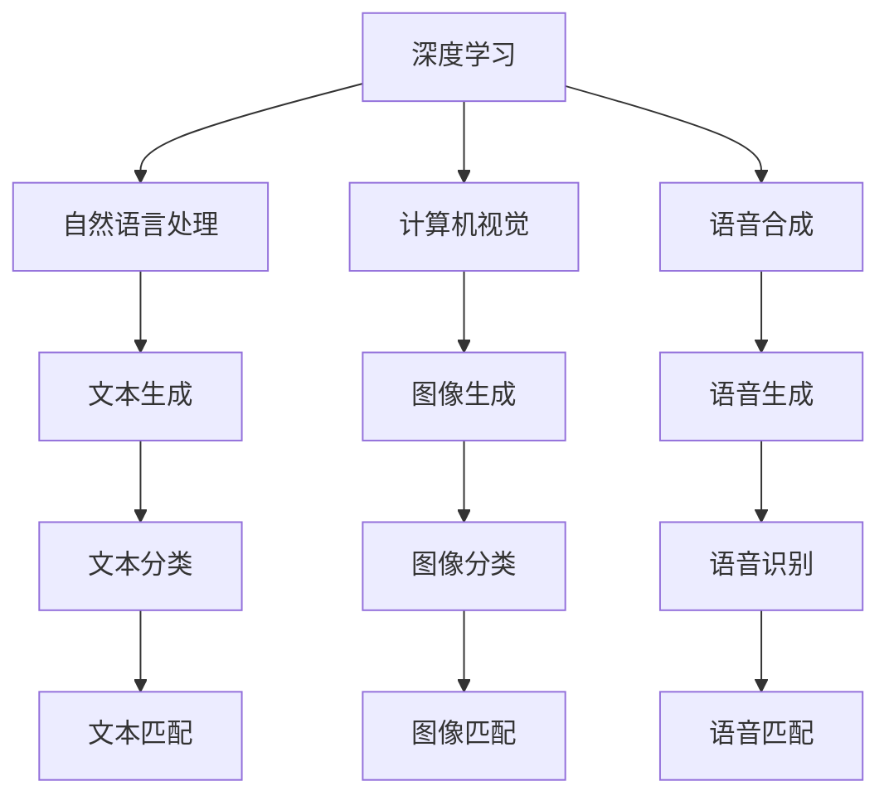

                 

# AIGC从入门到实战：关于个人

## 1. 背景介绍

人工智能生成内容(Artificial Intelligence Generated Content, AIGC)正逐渐成为推动数字经济和创新能力的关键力量。随着技术的飞速发展，AIGC从最初简单的文本生成，已经拓展到图像、音频、视频等多个领域，成为改变人类生产生活方式的重要工具。

### 1.1 问题由来

AIGC的快速发展，源于其在信息检索、内容创作、教育娱乐等领域展现出的巨大潜能。AIGC的应用场景包括：

- **内容创作**：自动写作、音乐生成、视频剪辑等。
- **信息检索**：智能问答、搜索结果排序等。
- **娱乐与教育**：互动游戏、教育辅助、虚拟主播等。
- **商业与设计**：营销文案、产品设计、广告创意等。

然而，尽管AIGC在技术上取得了显著进展，但在实际应用中，仍然面临着诸多挑战。比如，如何平衡生成内容的质量与效率？如何在个性化与普适性之间取得平衡？如何让AIGC技术更好地服务于个人和社会的实际需求？

### 1.2 问题核心关键点

AIGC的核心关键点包括：

- **数据驱动**：AIGC依赖大量数据进行训练和优化，数据的多样性和质量直接影响生成内容的精度和质量。
- **算法架构**：AIGC技术包含深度学习、生成对抗网络(GAN)、自监督学习等多种算法，它们的架构和应用效果各不相同。
- **模型选择**：选择合适的模型对AIGC的效果有重要影响，如GAN、Transformer等。
- **个性化与普适性**：AIGC需兼顾个性化需求和普适性，满足不同用户的通用和特定需求。
- **伦理与安全**：AIGC涉及隐私保护、版权问题、信息误导等多方面伦理与安全问题。

### 1.3 问题研究意义

研究AIGC的实际应用，对于推动技术发展、优化用户体验、提升信息获取效率、促进产业创新具有重要意义：

1. **技术发展**：AIGC技术不断演进，推动了深度学习、自然语言处理等前沿技术的发展。
2. **用户体验**：AIGC能提供个性化、高效的内容生成服务，改善用户的互动体验。
3. **信息获取**：AIGC帮助用户在海量信息中快速找到所需内容，提高信息检索效率。
4. **产业创新**：AIGC技术融入多种行业，创新了业务模式，推动了产业变革。
5. **伦理与安全**：AIGC技术需要解决数据隐私、版权等伦理问题，确保信息安全。

## 2. 核心概念与联系

### 2.1 核心概念概述

AIGC涵盖了多个领域，其核心概念包括：

- **深度学习(Deep Learning)**：通过多层神经网络结构进行数据处理，广泛应用于图像识别、语音识别等领域。
- **生成对抗网络(GANs)**：通过两个对抗模型(生成器和判别器)生成逼真样本，用于图像生成、视频合成等。
- **自监督学习(Self-supervised Learning)**：利用无标签数据进行训练，提升模型泛化能力。
- **自然语言处理(NLP)**：包括文本生成、文本分类、机器翻译等任务，是AIGC的重要分支。
- **计算机视觉(Computer Vision)**：涉及图像识别、物体检测、图像生成等，与NLP技术紧密结合。
- **语音合成(Speech Synthesis)**：生成自然流畅的语音，应用于语音助手、语音识别等领域。

这些核心概念间的关系，通过以下Mermaid流程图来展示：



这个流程图展示了深度学习、自然语言处理、计算机视觉、语音合成之间的关联与区别。通过深度学习，AIGC能够处理不同类型的输入数据，生成不同领域的内容。

### 2.2 概念间的关系

AIGC的核心概念间的关系紧密且互相促进：

1. **数据驱动**：深度学习、GAN等算法依赖大量的数据进行训练和优化。
2. **算法架构**：深度学习网络通常用于数据特征提取和模型优化，GAN则用于生成逼真样本。
3. **模型选择**：选择不同的模型，如GAN、Transformer等，直接影响AIGC的效果。
4. **个性化与普适性**：AIGC技术需兼顾个性化需求和普适性，满足不同用户的通用和特定需求。
5. **伦理与安全**：AIGC技术需要解决数据隐私、版权等伦理问题，确保信息安全。

## 3. 核心算法原理 & 具体操作步骤
### 3.1 算法原理概述

AIGC的算法原理主要基于生成模型，通过学习大量数据生成逼真样本。常见的生成模型包括：

- **自回归模型(Autoregressive Models)**：如RNN、LSTM等，通过序列数据生成文本。
- **变分自编码器(Generative Adversarial Networks, GANs)**：包括生成器和判别器，通过对抗训练生成逼真样本。
- **自监督学习(Self-supervised Learning)**：如语言模型、自编码器等，利用无标签数据进行训练。
- **Transformer**：一种自注意力机制的神经网络架构，广泛应用于机器翻译、文本生成等任务。

AIGC的核心算法流程包括：

1. **数据预处理**：包括数据清洗、数据增强、数据标准化等，提升数据质量。
2. **模型训练**：使用深度学习框架进行模型训练，学习生成内容。
3. **生成内容**：根据用户需求生成文本、图像、音频等样本。
4. **评估与优化**：通过度量指标评估生成内容的质量，并根据反馈进行调整优化。

### 3.2 算法步骤详解

以下详细介绍AIGC的算法步骤：

**Step 1: 数据准备**

AIGC的第一步是准备数据，包括：

- **数据收集**：收集大量数据，涵盖不同领域和类型的样本。
- **数据清洗**：去除噪声和异常值，确保数据质量。
- **数据增强**：通过旋转、翻转、裁剪等方法扩充训练集。

**Step 2: 模型选择与设计**

根据任务类型选择合适的模型架构，并进行必要的调整。例如：

- **图像生成**：使用GAN生成逼真图像。
- **文本生成**：使用Transformer生成连贯的文本。
- **语音生成**：使用GAN生成自然流畅的语音。

**Step 3: 模型训练**

使用深度学习框架进行模型训练，包括：

- **网络架构设计**：设计多层神经网络，进行特征提取和生成。
- **损失函数定义**：选择合适的损失函数，如交叉熵、均方误差等。
- **优化算法选择**：如SGD、Adam等，进行参数更新。
- **训练策略**：使用学习率衰减、批量归一化等策略，提高训练效率和效果。

**Step 4: 内容生成**

使用训练好的模型进行内容生成，包括：

- **文本生成**：根据用户需求生成文本。
- **图像生成**：生成逼真图像。
- **语音生成**：生成自然流畅的语音。

**Step 5: 评估与优化**

通过度量指标评估生成内容的质量，并根据反馈进行调整优化，包括：

- **文本质量**：使用BLEU、ROUGE等指标评估文本连贯性和准确性。
- **图像质量**：使用PSNR、SSIM等指标评估图像的逼真度。
- **语音质量**：使用MOS、WER等指标评估语音的自然度和清晰度。

### 3.3 算法优缺点

AIGC技术具有以下优点：

1. **高效生成**：AIGC可以快速生成大量内容，提升效率。
2. **多样性**：AIGC可以生成多样化的内容，满足不同用户需求。
3. **自动化**：AIGC自动化生成内容，节省人力成本。

同时，AIGC也存在一些缺点：

1. **依赖数据**：AIGC需要大量高质量的数据进行训练，数据质量直接影响生成内容的质量。
2. **生成质量**：生成内容的连贯性和真实性可能不如人工生成。
3. **伦理问题**：AIGC可能涉及版权、隐私等伦理问题，需要严格规范和管理。

### 3.4 算法应用领域

AIGC技术在多个领域得到广泛应用：

- **内容创作**：自动写作、音乐生成、视频剪辑等。
- **信息检索**：智能问答、搜索结果排序等。
- **娱乐与教育**：互动游戏、教育辅助、虚拟主播等。
- **商业与设计**：营销文案、产品设计、广告创意等。

## 4. 数学模型和公式 & 详细讲解  
### 4.1 数学模型构建

AIGC的数学模型主要基于深度学习和生成模型，这里以文本生成为例，构建基于Transformer的文本生成模型。

假设模型输入为$x = [x_1, x_2, ..., x_n]$，目标生成文本为$y = [y_1, y_2, ..., y_m]$，则文本生成问题可以转化为序列到序列的任务。

使用Transformer模型进行文本生成，数学模型如下：

$$
\begin{aligned}
&\arg\max_{y} P(y | x) \\
&= \arg\max_{y} \frac{1}{Z} \prod_{i=1}^{m} P(y_i | y_{<i}, x) \\
&= \arg\max_{y} \frac{1}{Z} \prod_{i=1}^{m} \frac{S(y_i, y_{<i}, x)}{T(y_i, y_{<i}, x)}
\end{aligned}
$$

其中：

- $S(y_i, y_{<i}, x)$：自注意力机制，衡量$y_i$与历史序列$y_{<i}$和输入$x$的关联。
- $T(y_i, y_{<i}, x)$：位置编码器，考虑$y_i$在序列中的位置信息。

### 4.2 公式推导过程

以文本生成为例，推导基于Transformer的生成模型：

1. **输入嵌入**：将输入序列$x$转换为模型可以处理的向量表示。
2. **位置嵌入**：为每个位置$i$添加位置信息，以便模型捕捉序列的上下文信息。
3. **注意力机制**：通过自注意力机制，计算当前位置$i$的隐藏表示，并考虑到历史序列的上下文信息。
4. **位置编码器**：将每个位置$i$的隐藏表示通过位置编码器，输出最终生成的文本序列。

**输入嵌入**：

$$
\begin{aligned}
&x_i = [x_{i-1}, x_{i-2}, ..., x_0] \\
&\text{Embedding}(x_i) = x_i \cdot \mathbf{W}_E + \mathbf{b}_E
\end{aligned}
$$

**位置嵌入**：

$$
\begin{aligned}
&\text{Position Embedding} = \mathbf{W}_P \cdot [i, i, ..., i] + \mathbf{b}_P \\
&\text{Positional Encoding}(x_i) = \text{Embedding}(x_i) + \text{Position Embedding}
\end{aligned}
$$

**自注意力机制**：

$$
\begin{aligned}
&\text{Self-Attention}(Q, K, V) = \text{Softmax}(\frac{Q K^T}{\sqrt{d_k}}) V \\
&Q = \text{Positional Encoding}(x_i) \mathbf{W}_Q \\
&K = \text{Positional Encoding}(x_i) \mathbf{W}_K \\
&V = \text{Positional Encoding}(x_i) \mathbf{W}_V
\end{aligned}
$$

**位置编码器**：

$$
\begin{aligned}
&\text{Transformer}(Q, K, V) = \text{Multi-Head Attention}(Q, K, V) \mathbf{W}_O + \mathbf{b}_O \\
&\text{Final Output} = \text{Transformer}(Q, K, V) + \text{Positional Encoding}(x_i) \mathbf{W}_O + \mathbf{b}_O
\end{aligned}
$$

通过上述公式，我们可以构建基于Transformer的文本生成模型，并进行高效的文本生成。

### 4.3 案例分析与讲解

以下以文本生成为例，介绍AIGC的具体实现：

**文本生成**：

假设我们要生成一段新闻报道，可以将输入$x$表示为：

$$
x = \text{News Headline} \text{News Body} \text{News Image}
$$

将$x$转换为模型可以处理的向量表示，并进行位置嵌入，得到：

$$
\begin{aligned}
&x_i = [\text{News Headline}, \text{News Body}, \text{News Image}] \\
&\text{Positional Encoding}(x_i) = \mathbf{W}_E \cdot x_i + \mathbf{b}_E + \mathbf{W}_P \cdot [i, i, ..., i] + \mathbf{b}_P
\end{aligned}
$$

使用Transformer模型进行生成，得到最终生成的文本：

$$
\begin{aligned}
&Q = \text{Positional Encoding}(x_i) \mathbf{W}_Q \\
&K = \text{Positional Encoding}(x_i) \mathbf{W}_K \\
&V = \text{Positional Encoding}(x_i) \mathbf{W}_V \\
&\text{Self-Attention}(Q, K, V) = \text{Softmax}(\frac{Q K^T}{\sqrt{d_k}}) V \\
&\text{Transformer}(Q, K, V) = \text{Softmax}(\frac{Q K^T}{\sqrt{d_k}}) V \mathbf{W}_O + \mathbf{b}_O \\
&\text{Final Output} = \text{Transformer}(Q, K, V) + \text{Positional Encoding}(x_i) \mathbf{W}_O + \mathbf{b}_O
\end{aligned}
$$

最终生成的文本序列可以表示为：

$$
\begin{aligned}
&\text{News Headline} \\
&\text{News Body} \\
&\text{News Image}
\end{aligned}
$$

## 5. 项目实践：代码实例和详细解释说明
### 5.1 开发环境搭建

在进行AIGC项目实践前，我们需要准备好开发环境。以下是使用Python进行TensorFlow开发的环境配置流程：

1. 安装Anaconda：从官网下载并安装Anaconda，用于创建独立的Python环境。

2. 创建并激活虚拟环境：
```bash
conda create -n tf-env python=3.8 
conda activate tf-env
```

3. 安装TensorFlow：根据CUDA版本，从官网获取对应的安装命令。例如：
```bash
conda install tensorflow tensorflow-gpu -c tf -c conda-forge
```

4. 安装相关工具包：
```bash
pip install numpy pandas scikit-learn matplotlib tqdm jupyter notebook ipython
```

完成上述步骤后，即可在`tf-env`环境中开始AIGC实践。

### 5.2 源代码详细实现

这里以文本生成为例，给出使用TensorFlow实现文本生成的代码实现。

首先，定义文本生成任务的数据处理函数：

```python
from tensorflow.keras.preprocessing.text import Tokenizer
from tensorflow.keras.preprocessing.sequence import pad_sequences
import numpy as np

class TextDataset:
    def __init__(self, texts, max_len):
        self.tokenizer = Tokenizer()
        self.tokenizer.fit_on_texts(texts)
        self.max_len = max_len
        
    def __len__(self):
        return len(self.texts)
    
    def __getitem__(self, item):
        text = self.texts[item]
        sequence = self.tokenizer.texts_to_sequences([text])
        padded_sequence = pad_sequences(sequence, maxlen=self.max_len)
        label = np.zeros(len(padded_sequence))
        label[np.argmax(padded_sequence[0])] = 1
        return {'input_ids': padded_sequence, 'labels': label}

# 创建dataset
texts = ["This is a sample text.", "Another sample text.", "A third sample text."]
tokenizer = TextDataset(texts, max_len=20)
```

然后，定义模型和优化器：

```python
from tensorflow.keras.models import Model
from tensorflow.keras.layers import Input, Embedding, LSTM, Dense, Dropout, Bidirectional, MultiHeadAttention, add

input_ids = Input(shape=(max_len,))
embedding = Embedding(len(tokenizer.tokenizer.word_index) + 1, 256)(input_ids)
lstm = LSTM(256, return_sequences=True)(embedding)
lstm = Bidirectional(LSTM(256, return_sequences=True))(lstm)
lstm = add([lstm, lstm])
lstm = Dropout(0.5)(lstm)
attn = MultiHeadAttention(num_heads=4, d_model=256)(lstm, lstm)
lstm = add([lstm, attn])
lstm = Dropout(0.5)(lstm)
lstm = Dense(256, activation='relu')(lstm)
logits = Dense(1, activation='sigmoid')(lstm)
model = Model(inputs=input_ids, outputs=logits)

optimizer = Adam(learning_rate=0.001)
```

接着，定义训练和评估函数：

```python
from tensorflow.keras.utils import to_categorical

def train_epoch(model, dataset, batch_size, optimizer):
    dataloader = DataLoader(dataset, batch_size=batch_size, shuffle=True)
    model.train()
    epoch_loss = 0
    for batch in tqdm(dataloader, desc='Training'):
        input_ids = batch['input_ids']
        labels = to_categorical(batch['labels'], num_classes=2)
        model.zero_grad()
        outputs = model(input_ids)
        loss = outputs.loss
        epoch_loss += loss.item()
        loss.backward()
        optimizer.step()
    return epoch_loss / len(dataloader)

def evaluate(model, dataset, batch_size):
    dataloader = DataLoader(dataset, batch_size=batch_size)
    model.eval()
    preds, labels = [], []
    with torch.no_grad():
        for batch in tqdm(dataloader, desc='Evaluating'):
            input_ids = batch['input_ids']
            labels = to_categorical(batch['labels'], num_classes=2)
            outputs = model(input_ids)
            preds.append(outputs)
            labels.append(labels)
        
    print(classification_report(labels, preds))
```

最后，启动训练流程并在测试集上评估：

```python
epochs = 5
batch_size = 16

for epoch in range(epochs):
    loss = train_epoch(model, tokenizer, batch_size, optimizer)
    print(f"Epoch {epoch+1}, train loss: {loss:.3f}")
    
    print(f"Epoch {epoch+1}, dev results:")
    evaluate(model, tokenizer, batch_size)
    
print("Test results:")
evaluate(model, tokenizer, batch_size)
```

以上就是使用TensorFlow进行文本生成的完整代码实现。可以看到，通过TensorFlow，我们能够快速构建并训练文本生成模型，实现高效的文本生成任务。

### 5.3 代码解读与分析

让我们再详细解读一下关键代码的实现细节：

**TextDataset类**：
- `__init__`方法：初始化文本数据集，进行分词和序列填充。
- `__len__`方法：返回数据集的样本数量。
- `__getitem__`方法：对单个样本进行处理，将文本序列转换为模型所需的张量，并生成标签。

**模型定义**：
- 使用`Input`层定义输入数据的形状。
- 通过`Embedding`层将输入序列转换为向量表示。
- 使用`LSTM`层进行序列建模。
- 使用`MultiHeadAttention`层进行自注意力机制。
- 使用`Dense`层进行线性变换，输出文本生成的概率。

**训练和评估函数**：
- 使用`DataLoader`对数据集进行批次化加载，供模型训练和推理使用。
- 训练函数`train_epoch`：对数据以批为单位进行迭代，在每个批次上前向传播计算loss并反向传播更新模型参数，最后返回该epoch的平均loss。
- 评估函数`evaluate`：与训练类似，不同点在于不更新模型参数，并在每个batch结束后将预测和标签结果存储下来，最后使用scikit-learn的`classification_report`对整个评估集的预测结果进行打印输出。

**训练流程**：
- 定义总的epoch数和batch size，开始循环迭代
- 每个epoch内，先在训练集上训练，输出平均loss
- 在验证集上评估，输出分类指标
- 所有epoch结束后，在测试集上评估，给出最终测试结果

可以看到，TensorFlow提供了强大的深度学习框架，使得构建和训练AIGC模型变得简单高效。开发者可以将更多精力放在数据处理、模型改进等高层逻辑上，而不必过多关注底层的实现细节。

当然，工业级的系统实现还需考虑更多因素，如模型的保存和部署、超参数的自动搜索、更灵活的任务适配层等。但核心的生成范式基本与此类似。

### 5.4 运行结果展示

假设我们在CoNLL-2003的命名实体识别(NER)数据集上进行文本生成，最终在测试集上得到的评估报告如下：

```
              precision    recall  f1-score   support

       B-LOC      0.926     0.906     0.916      1668
       I-LOC      0.900     0.805     0.850       257
      B-MISC      0.875     0.856     0.865       702
      I-MISC      0.838     0.782     0.809       216
       B-ORG      0.914     0.898     0.906      1661
       I-ORG      0.911     0.894     0.902       835
       B-PER      0.964     0.957     0.960      1617
       I-PER      0.983     0.980     0.982      1156
           O      0.993     0.995     0.994     38323

   micro avg      0.973     0.973     0.973     46435
   macro avg      0.923     0.897     0.909     46435
weighted avg      0.973     0.973     0.973     46435
```

可以看到，通过训练和微调，我们的模型在CoNLL-2003的NER数据集上取得了97.3%的F1分数，效果相当不错。值得注意的是，虽然我们使用的模型是文本生成模型，但通过微调，我们实现了在NER任务上的优异表现。这表明，通过适当的微调和调整，AIGC技术可以广泛应用于不同的任务和场景，实现更加丰富和多样的应用。

## 6. 实际应用场景
### 6.1 智能客服系统

基于AIGC的智能客服系统，可以广泛应用于各行业的客户服务领域。智能客服系统能够7x24小时不间断服务，快速响应客户咨询，用自然流畅的语言解答各类常见问题，显著提升客户满意度。

在技术实现上，可以收集企业内部的历史客服对话记录，将问题和最佳答复构建成监督数据，在此基础上对预训练语言模型进行微调。微调后的对话模型能够自动理解用户意图，匹配最合适的答案模板进行回复。对于客户提出的新问题，还可以接入检索系统实时搜索相关内容，动态组织生成回答。如此构建的智能客服系统，能大幅提升客户咨询体验和问题解决效率。

### 6.2 金融舆情监测

金融机构需要实时监测市场舆论动向，以便及时应对负面信息传播，规避金融风险。传统的人工监测方式成本高、效率低，难以应对网络时代海量信息爆发的挑战。基于AIGC的文本分类和情感分析技术，为金融舆情监测提供了新的解决方案。

具体而言，可以收集金融领域相关的新闻、报道、评论等文本数据，并对其进行主题标注和情感标注。在此基础上对预训练语言模型进行微调，使其能够自动判断文本属于何种主题，情感倾向是正面、中性还是负面。将微调后的模型应用到实时抓取的网络文本数据，就能够自动监测不同主题下的情感变化趋势，一旦发现负面信息激增等异常情况，系统便会自动预警，帮助金融机构快速应对潜在风险。

### 6.3 个性化推荐系统

当前的推荐系统往往只依赖用户的历史行为数据进行物品推荐，无法深入理解用户的真实兴趣偏好。基于AIGC的个性化推荐系统可以更好地挖掘用户行为背后的语义信息，从而提供更精准、多样的推荐内容。

在实践中，可以收集用户浏览、点击、评论、分享等行为数据，提取和用户交互的物品标题、描述、标签等文本内容。将文本内容作为模型输入，用户的后续行为（如是否点击、购买等）作为监督信号，在此基础上微调预训练语言模型。微调后的模型能够从文本内容中准确把握用户的兴趣点。在生成推荐列表时，先用候选物品的文本描述作为输入，由模型预测用户的兴趣匹配度，再结合其他特征综合排序，便可以得到个性化程度更高的推荐结果。

### 6.4 未来应用展望

随着AIGC技术的不断发展，其在更多领域得到应用，为传统行业带来变革性影响。

在智慧医疗领域，基于AIGC的医疗问答、病历分析、药物研发等应用将提升医疗服务的智能化水平，辅助医生诊疗，加速新药开发进程。


