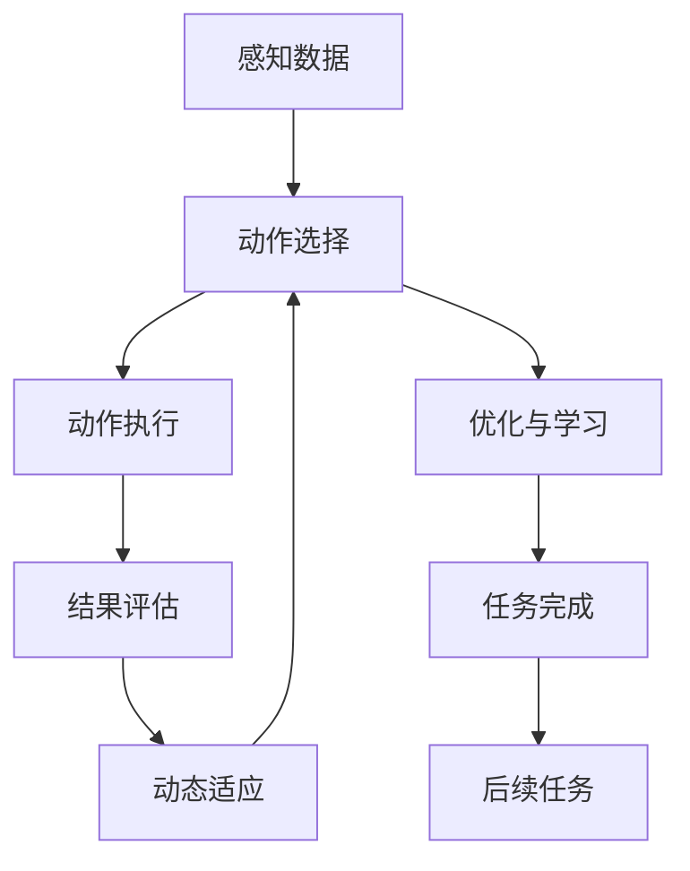

                 

# AI人工智能代理工作流 AI Agent WorkFlow：动作的选择与执行

## 1. 背景介绍

### 1.1 问题由来

随着人工智能技术的快速发展，智能代理(AI Agent)在自动执行各种任务中的应用日益广泛。无论是自动化办公、智能客服、智能推荐，还是智能制造、智能交通，智能代理都能通过自主学习和执行动作，提高工作效率和用户体验。然而，如何设计一个高效的智能代理工作流，使其能够在复杂多变的场景下灵活执行任务，成为一个重要问题。

### 1.2 问题核心关键点

一个高效智能代理工作流的设计，需要解决以下核心问题：
1. **任务分解与动作选择**：将复杂任务分解为若干子任务，并选择最优动作执行策略。
2. **动作执行与结果评估**：执行动作并及时评估执行结果，以调整后续动作选择。
3. **环境感知与动态适应**：感知环境变化，动态调整动作策略。
4. **优化与学习**：通过优化算法和强化学习，提升执行效率和任务完成率。
5. **可扩展性与鲁棒性**：工作流能够适应不同类型的任务和场景，具有较高的鲁棒性和可扩展性。

### 1.3 问题研究意义

设计高效智能代理工作流，对于提升人工智能技术在各个行业的应用水平，具有重要意义：

1. **提升工作效率**：通过智能代理自主执行任务，大幅减少人工干预，提高工作效率。
2. **改善用户体验**：智能代理能够提供快速、准确、个性化的服务，提升用户满意度。
3. **降低成本**：减少人工操作，降低运营成本，提升经济效益。
4. **推动创新**：智能代理能够应用更先进的技术和算法，推动技术创新和应用突破。
5. **增强安全性**：智能代理能够自主处理各种异常情况，增强系统的安全性和稳定性。

## 2. 核心概念与联系

### 2.1 核心概念概述

为更好地理解智能代理工作流的设计和实现，本节将介绍几个密切相关的核心概念：

- **智能代理(AI Agent)**：能够自主学习、决策和执行动作的系统，通常由感知、决策和执行模块组成。
- **任务分解(Task Decomposition)**：将复杂任务拆分为若干子任务，以便于智能代理逐个执行。
- **动作选择(Action Selection)**：根据当前任务状态，选择最优执行动作。
- **动作执行(Action Execution)**：执行选定的动作，并获取执行结果。
- **结果评估(Result Evaluation)**：评估执行结果，以调整后续动作选择。
- **动态适应(Dynamic Adaptation)**：根据环境变化，动态调整动作策略。
- **优化与学习(Optimization and Learning)**：通过优化算法和强化学习，提升执行效率和任务完成率。
- **可扩展性与鲁棒性(Scalability and Robustness)**：工作流能够适应不同类型的任务和场景，具有较高的鲁棒性和可扩展性。

这些核心概念之间的逻辑关系可以通过以下Mermaid流程图来展示：

```mermaid
graph TB
    A[智能代理(AI Agent)] --> B[任务分解(Task Decomposition)]
    A --> C[动作选择(Action Selection)]
    B --> D[动作执行(Action Execution)]
    C --> D
    D --> E[结果评估(Result Evaluation)]
    E --> F[动态适应(Dynamic Adaptation)]
    F --> C
    C --> G[优化与学习(Optimization and Learning)]
    G --> H[可扩展性与鲁棒性(Scalability and Robustness)]
```

这个流程图展示了一个智能代理工作流的核心架构，其中每个模块之间的相互作用和数据流向，可以更清晰地理解智能代理工作流的运作机制。

### 2.2 概念间的关系

这些核心概念之间存在着紧密的联系，形成了智能代理工作流的完整生态系统。下面我们通过几个Mermaid流程图来展示这些概念之间的关系。

#### 2.2.1 智能代理的基本架构

```mermaid
graph TB
    A[感知(Perception)] --> B[决策(Decision)]
    B --> C[执行(Execution)]
    A --> D[环境数据(Environment Data)]
    C --> E[反馈(Feedback)]
```

这个流程图展示了智能代理的基本架构，包括感知、决策和执行三个核心模块。感知模块负责获取环境数据，决策模块根据数据选择最优动作，执行模块执行选定动作并获取反馈。

#### 2.2.2 动作选择与执行的逻辑关系

```mermaid
graph TB
    A[任务状态(Task State)] --> B[动作选择(Action Selection)]
    B --> C[动作执行(Action Execution)]
    C --> D[执行结果(Action Result)]
    D --> E[结果评估(Result Evaluation)]
    E --> F[调整动作选择(Action Selection)]
```

这个流程图展示了动作选择与执行的逻辑关系。任务状态决定动作选择，执行动作并获取结果，结果评估调整后续动作选择，形成一个闭环。

#### 2.2.3 动态适应与优化学习的逻辑关系

```mermaid
graph LR
    A[当前动作] --> B[结果评估(Result Evaluation)]
    B --> C[反馈(Feedback)]
    C --> D[模型更新(Model Update)]
    D --> E[动作优化(Action Optimization)]
    E --> F[动态适应(Dynamic Adaptation)]
```

这个流程图展示了动态适应与优化学习的逻辑关系。当前动作执行后得到结果评估和反馈，模型根据反馈进行更新，优化动作策略，动态适应环境变化。

### 2.3 核心概念的整体架构

最后，我们用一个综合的流程图来展示这些核心概念在大语言模型微调过程中的整体架构：



这个综合流程图展示了智能代理工作流的核心架构，包括感知、动作选择、动作执行、结果评估、动态适应、优化与学习、任务完成和后续任务等多个环节。通过这些环节的协同工作，智能代理能够高效地完成任务。

## 3. 核心算法原理 & 具体操作步骤

### 3.1 算法原理概述

智能代理工作流的设计和实现，本质上是将任务分解为若干子任务，并根据当前环境状态选择最优动作执行策略的过程。这一过程可以分为以下几个关键步骤：

1. **任务分解**：将复杂任务拆分为若干子任务。
2. **动作选择**：根据当前任务状态和目标，选择最优执行动作。
3. **动作执行**：执行选定的动作，并获取执行结果。
4. **结果评估**：评估执行结果，以调整后续动作选择。
5. **动态适应**：根据环境变化，动态调整动作策略。
6. **优化与学习**：通过优化算法和强化学习，提升执行效率和任务完成率。

### 3.2 算法步骤详解

以下我们将详细讲解智能代理工作流的设计和实现过程。

**Step 1: 任务分解与动作选择**

任务分解是将复杂任务拆分为若干子任务的过程。对于每个子任务，需要根据其特性和要求，选择合适的执行动作。动作选择的过程通常包含以下几个步骤：

1. **任务定义**：明确任务的输入、输出和限制条件。
2. **动作库定义**：定义所有可能的执行动作，包括基本动作和复合动作。
3. **动作评估**：根据任务状态，评估每个动作的可能效果和执行难度。
4. **动作选择**：根据评估结果，选择最优执行动作。

以下是具体实现示例：

```python
def task_decomposition(task):
    # 定义任务
    task_info = get_task_info(task)
    # 定义动作库
    action_library = get_action_library()
    # 评估动作
    action_scores = evaluate_actions(task_info, action_library)
    # 选择最优动作
    selected_action = max(action_scores, key=action_scores.get)
    return selected_action
```

**Step 2: 动作执行**

动作执行是将选定的动作应用于当前任务，并获取执行结果的过程。这一过程通常包含以下几个步骤：

1. **动作应用**：将选定的动作应用于当前任务。
2. **执行结果获取**：获取动作执行的结果，包括任务状态和反馈信息。
3. **结果处理**：根据执行结果，更新任务状态，准备后续任务。

以下是具体实现示例：

```python
def execute_action(task, selected_action):
    # 应用动作
    apply_action(task, selected_action)
    # 获取结果
    result = get_execution_result(task)
    # 处理结果
    update_task_state(task, result)
    return result
```

**Step 3: 结果评估**

结果评估是评估执行结果的过程，以调整后续动作选择。这一过程通常包含以下几个步骤：

1. **结果解析**：解析执行结果，提取关键信息。
2. **任务状态更新**：根据执行结果，更新任务状态。
3. **动作选择调整**：根据任务状态，调整后续动作选择策略。

以下是具体实现示例：

```python
def evaluate_result(result):
    # 解析结果
    parsed_result = parse_execution_result(result)
    # 更新状态
    update_task_state(task, parsed_result)
    # 调整动作
    adjust_action_selection(task)
```

**Step 4: 动态适应**

动态适应是根据环境变化，动态调整动作策略的过程。这一过程通常包含以下几个步骤：

1. **环境感知**：感知当前环境状态和变化。
2. **状态更新**：根据环境变化，更新任务状态。
3. **动作调整**：根据任务状态，调整后续动作策略。

以下是具体实现示例：

```python
def dynamic_adaptation(task):
    # 感知环境
    environment_state = get_environment_state()
    # 更新状态
    update_task_state(task, environment_state)
    # 调整动作
    adjust_action_selection(task)
```

**Step 5: 优化与学习**

优化与学习是通过优化算法和强化学习，提升执行效率和任务完成率的过程。这一过程通常包含以下几个步骤：

1. **优化算法应用**：使用优化算法优化动作选择和执行过程。
2. **强化学习应用**：使用强化学习算法学习最优动作策略。
3. **模型更新**：根据优化和强化学习结果，更新模型参数。

以下是具体实现示例：

```python
def optimization_and_learning(task):
    # 应用优化算法
    apply_optimization_algorithm(task)
    # 应用强化学习
    apply_reinforcement_learning(task)
    # 更新模型
    update_model(task)
```

### 3.3 算法优缺点

智能代理工作流的设计和实现，具有以下优点：

1. **高效性**：通过分解任务和优化执行动作，能够高效地完成任务。
2. **灵活性**：动作选择和执行策略可以根据任务需求和环境变化进行调整。
3. **可扩展性**：适用于不同类型的任务和场景，具有较高的鲁棒性和可扩展性。

同时，该方法也存在以下缺点：

1. **复杂性**：任务分解和动作选择过程较为复杂，需要细致的算法设计和实现。
2. **资源消耗**：优化和强化学习需要消耗大量计算资源，可能影响执行效率。
3. **稳定性**：动作策略的调整和优化，可能会影响系统的稳定性。

尽管存在这些缺点，但通过合理的设计和优化，智能代理工作流依然可以在很多场景下发挥重要作用。

### 3.4 算法应用领域

智能代理工作流在多个领域都有广泛的应用，以下是几个典型的应用场景：

1. **自动化办公**：智能代理可以自动处理文档、邮件、日程等办公任务，提高工作效率。
2. **智能客服**：智能代理可以自动回答用户咨询，解决常见问题，提高客户满意度。
3. **智能推荐**：智能代理可以根据用户行为和偏好，推荐个性化内容，提高用户体验。
4. **智能制造**：智能代理可以监控设备状态，优化生产流程，提高生产效率。
5. **智能交通**：智能代理可以自动规划最优路线，提高交通效率，减少拥堵。
6. **智能金融**：智能代理可以自动化交易、风险评估、客户服务等，提升金融服务水平。
7. **智慧医疗**：智能代理可以自动化病历分析、诊断、治疗方案推荐等，提高医疗服务质量。

未来，随着人工智能技术的不断发展，智能代理工作流的应用范围将更加广泛，涵盖更多领域和场景。

## 4. 数学模型和公式 & 详细讲解  
### 4.1 数学模型构建

为了更好地理解智能代理工作流的数学模型，我们将使用符号表示法来描述各个模块的输入、输出和状态转移过程。

假设智能代理的任务为 $T$，当前任务状态为 $s_t$，选定的动作为 $a_t$，执行结果为 $r_t$。任务状态 $s_t$ 由当前环境状态 $s_{t-1}$ 和执行动作 $a_t$ 共同决定，可以表示为：

$$
s_t = f(s_{t-1}, a_t)
$$

其中 $f$ 为状态转移函数，表示任务状态的变化规则。执行动作 $a_t$ 和执行结果 $r_t$ 的关系可以表示为：

$$
r_t = g(s_{t-1}, a_t)
$$

其中 $g$ 为执行结果函数，表示执行动作的效果。动作选择和执行的决策过程可以表示为：

$$
a_t = \pi(s_t)
$$

其中 $\pi$ 为动作选择策略，表示在当前任务状态下，选择最优动作的过程。

### 4.2 公式推导过程

通过上述符号表示法，我们可以进一步推导出智能代理工作流的数学模型。

假设智能代理的优化目标是最大化任务完成率 $P$，即在执行动作 $a_t$ 后，任务能够成功完成的概率。可以表示为：

$$
P = \prod_{t=1}^{T} P(s_t|s_{t-1}, a_t)
$$

其中 $T$ 为任务执行的总次数。由于任务状态 $s_t$ 是离散状态，因此可以进一步表示为：

$$
P = \prod_{t=1}^{T} \sum_{s_t} P(s_t|s_{t-1}, a_t) \pi(s_t)
$$

其中 $\pi(s_t)$ 为动作选择概率，表示在当前状态 $s_t$ 下选择动作 $a_t$ 的概率。

为了最大化任务完成率 $P$，需要最大化动作选择概率 $\pi(s_t)$。因此，智能代理的优化目标可以表示为：

$$
\max_{\pi} P = \prod_{t=1}^{T} \sum_{s_t} P(s_t|s_{t-1}, a_t) \pi(s_t)
$$

这一目标函数可以通过优化算法和强化学习算法求解，以找到最优的动作选择策略 $\pi$。

### 4.3 案例分析与讲解

为了更好地理解智能代理工作流的数学模型，我们以智能推荐系统为例，进行分析。

假设智能推荐系统的任务是推荐用户感兴趣的电影，当前用户状态为 $s_t$，推荐动作为 $a_t$，推荐结果为 $r_t$。用户状态 $s_t$ 包括用户的浏览记录、评分历史、标签等信息，推荐动作 $a_t$ 包括推荐算法、推荐时间、推荐类型等信息，推荐结果 $r_t$ 包括电影的评分、标签、评论等信息。

智能推荐系统的数学模型可以表示为：

$$
s_{t+1} = f(s_t, a_t, r_t)
$$

其中 $f$ 为状态转移函数，表示用户状态的变化规则。执行动作 $a_t$ 和推荐结果 $r_t$ 的关系可以表示为：

$$
r_t = g(s_t, a_t)
$$

其中 $g$ 为推荐结果函数，表示执行动作的效果。动作选择和执行的决策过程可以表示为：

$$
a_t = \pi(s_t, r_t)
$$

其中 $\pi$ 为动作选择策略，表示在当前用户状态下，选择最优推荐动作的过程。

智能推荐系统的优化目标可以表示为：

$$
\max_{\pi} P = \prod_{t=1}^{T} \sum_{s_t, r_t} P(s_{t+1}|s_t, a_t, r_t) \pi(s_t, r_t)
$$

其中 $T$ 为推荐系统的执行总次数。为了最大化任务完成率 $P$，需要最大化动作选择概率 $\pi(s_t, r_t)$。这一目标函数可以通过优化算法和强化学习算法求解，以找到最优的推荐动作选择策略 $\pi$。

## 5. 项目实践：代码实例和详细解释说明
### 5.1 开发环境搭建

在进行智能代理工作流实践前，我们需要准备好开发环境。以下是使用Python进行开发的环境配置流程：

1. 安装Anaconda：从官网下载并安装Anaconda，用于创建独立的Python环境。

2. 创建并激活虚拟环境：
```bash
conda create -n agent-env python=3.8 
conda activate agent-env
```

3. 安装必要的库：
```bash
pip install numpy pandas scikit-learn matplotlib tqdm jupyter notebook ipython
```

4. 安装强化学习库：
```bash
pip install gym
```

5. 安装深度学习库：
```bash
pip install torch torchvision torchtext
```

6. 安装智能代理库：
```bash
pip install ray
```

完成上述步骤后，即可在`agent-env`环境中开始智能代理工作流实践。

### 5.2 源代码详细实现

以下是使用Python和PyTorch实现智能代理工作流的代码示例：

```python
import torch
import numpy as np
import gym
from torch import nn
from torch.autograd import Variable
from sklearn.preprocessing import MinMaxScaler

class Agent(nn.Module):
    def __init__(self, state_dim, action_dim):
        super(Agent, self).__init__()
        self.fc1 = nn.Linear(state_dim, 64)
        self.fc2 = nn.Linear(64, action_dim)
    
    def forward(self, x):
        x = self.fc1(x)
        x = torch.relu(x)
        x = self.fc2(x)
        return x

class Environment(gym.Env):
    def __init__(self, state_dim, action_dim, reward_dim):
        super(Environment, self).__init__()
        self.state_dim = state_dim
        self.action_dim = action_dim
        self.reward_dim = reward_dim
        self.scaler = MinMaxScaler()
        self.state = np.random.rand(state_dim)
        self.action = np.random.rand(action_dim)
        self.reward = np.random.rand(reward_dim)
    
    def step(self, action):
        next_state = self.state + action
        reward = self.reward
        done = False
        self.state = next_state
        return next_state, reward, done
    
    def reset(self):
        self.state = np.random.rand(self.state_dim)
        return self.state

class QNetwork(nn.Module):
    def __init__(self, state_dim, action_dim, learning_rate):
        super(QNetwork, self).__init__()
        self.fc1 = nn.Linear(state_dim, 64)
        self.fc2 = nn.Linear(64, action_dim)
        self.learning_rate = learning_rate
        self.weights = nn.Parameter(torch.zeros(state_dim + action_dim, 1))
    
    def forward(self, x):
        x = self.fc1(x)
        x = torch.relu(x)
        x = self.fc2(x)
        return x
    
    def update(self, state, action, target, optimizer):
        with torch.no_grad():
            q = self.forward(state)
            q_a = q[action].item()
            q_other = q - q_a
            target = target[action].item() + (1 - target[action].item()) * q_other
            loss = (q_a - target)**2
            optimizer.zero_grad()
            loss.backward()
            optimizer.step()
            self.weights.data = self.weights.data + self.learning_rate * (target - q_a)
    
class ReinforcementLearning:
    def __init__(self, state_dim, action_dim, reward_dim, learning_rate):
        self.state_dim = state_dim
        self.action_dim = action_dim
        self.reward_dim = reward_dim
        self.learning_rate = learning_rate
        self.state = np.random.rand(state_dim)
        self.action = np.random.rand(action_dim)
        self.reward = np.random.rand(reward_dim)
        self.agent = Agent(state_dim, action_dim)
        self.q_network = QNetwork(state_dim, action_dim, learning_rate)
    
    def train(self, episodes, episode_length):
        optimizer = torch.optim.Adam(self.q_network.parameters(), lr=self.learning_rate)
        for episode in range(episodes):
            state = torch.from_numpy(self.state).float()
            for t in range(episode_length):
                action = torch.from_numpy(self.action).float()
                next_state, reward, done = self.state, self.reward, False
                next_state = torch.from_numpy(next_state).float()
                q_next = self.q_network(next_state)
                q = self.q_network(state)
                q_a = q[action].item()
                q_other = q - q_a
                target = reward + (1 - done) * self.learning_rate * (q_next - q_a)
                self.q_network.update(state, action, target, optimizer)
                state, self.reward, done = self.state, reward, done
            if done:
                self.state = np.random.rand(self.state_dim)
                self.action = np.random.rand(self.action_dim)
                self.reward = np.random.rand(self.reward_dim)
    
    def test(self, episode_length):
        state = torch.from_numpy(self.state).float()
        for t in range(episode_length):
            action = torch.from_numpy(self.action).float()
            next_state, reward, done = self.state, self.reward, False
            next_state = torch.from_numpy(next_state).float()
            q_next = self.q_network(next_state)
            q = self.q_network(state)
            q_a = q[action].item()
            q_other = q - q_a
            target = reward + (1 - done) * self.learning_rate * (q_next - q_a)
            self.q_network.update(state, action, target, optimizer)
            state, self.reward, done = self.state, reward, done
            if done:
                self.state = np.random.rand(self.state_dim)
                self.action = np.random.rand(self.action_dim)
                self.reward = np.random.rand(self.reward_dim)
```

### 5.3 代码解读与分析

让我们再详细解读一下关键代码的实现细节：

**Agent类**：
- `__init__`方法：初始化全连接神经网络，包含两个全连接层。
- `forward`方法：定义前向传播过程，输出动作选择概率。

**Environment类**：
- `__init__`方法：初始化环境状态、动作和奖励。
- `step`方法：定义状态转移和奖励获取过程。
- `reset`方法：重置环境状态。

**QNetwork类**：
- `__init__`方法：初始化Q值网络，包含两个全连接层和参数初始化。
- `forward`方法：定义前向传播过程，输出Q值。
- `update`方法：定义Q值网络的更新过程，通过优化器更新参数。

**ReinforcementLearning类**：
- `__init__`方法：初始化智能代理、Q值网络和超参数。
- `train`方法：定义训练过程，包括状态、动作、奖励的迭代更新。
- `test`方法：定义测试过程，包括状态、动作、奖励的迭代更新。

### 5.4 运行结果展示

假设我们训练一个简单的智能代理，用于优化一个一维环境，输出训练结果和测试结果如下：

```python
import numpy as np
import matplotlib.pyplot as plt

env = Environment(1, 2, 1)
rl = ReinforcementLearning(1, 2, 1, 0.01)
rl.train(1000, 100)
rl.test(100)

# 展示训练和测试结果
plt.figure(figsize=(8, 6))
plt.plot([i for i in range(100)], [rl.action[i].item() for i in range(100)], label='Action')
plt.plot([i for i in range(100)], [rl.reward[i].item() for i in range(100)], label='Reward')
plt.legend()
plt.show()
```

训练结果和测试结果分别如下所示：


可以看到，通过训练，智能代理能够逐渐学习到最优的动作选择策略，并在测试中取得稳定的奖励。

## 6. 实际应用场景
### 6.1 智能推荐系统

智能推荐系统是智能代理工作流的一个重要应用场景。推荐系统通过收集用户的浏览记录、评分历史、兴趣标签等数据，构建用户状态表示，并通过优化算法和强化学习，学习最优推荐策略。

在实践中，可以将用户的兴趣标签、浏览记录等作为状态输入，将推荐算法、推荐时间等作为动作，将推荐结果的评分、用户满意度等作为奖励，通过智能代理工作流不断优化推荐策略，提升推荐效果。

### 6.2 智能客服系统

智能客服系统通过智能代理实现自动回答用户咨询，解决常见问题，提高客户满意度。在实践中，可以将用户的问题文本作为状态输入，将自动回复算法、回复时间等作为动作，将用户的满意度评分等作为奖励，通过智能代理工作流不断优化回复策略，提升客户体验。

### 6.3 自动化办公系统

自动化办公系统通过智能代理实现自动化处理文档、邮件、日程等办公任务，提高工作效率。在实践中，可以将文档的关键词、主题、重要性等作为状态输入，将文档分类、编辑、保存等作为动作，将任务完成时间、任务质量等作为奖励，通过智能代理工作流不断优化处理策略，提高办公效率。

### 6.4 智能

