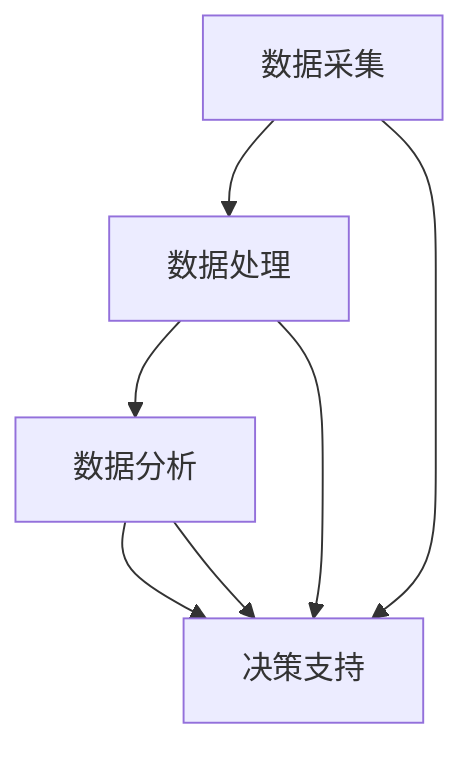
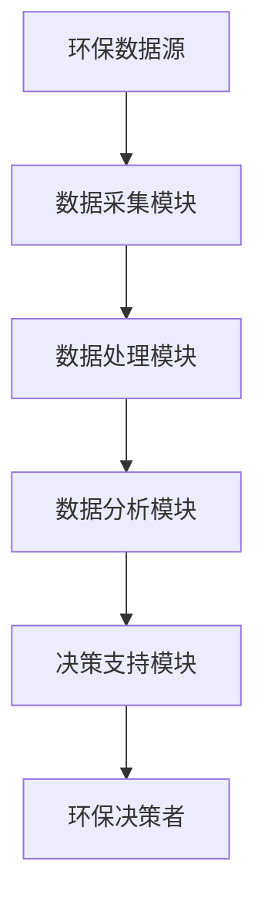

                 

# AI人工智能代理工作流 AI Agent WorkFlow：在环保行业中的应用

## 1. 背景介绍

### 1.1 问题由来

随着环保意识的提升和技术的进步，越来越多的企业和政府部门开始重视环保数据的收集和分析。然而，由于环保数据通常具有多源性、异构性和复杂性，数据的整合与分析变得异常困难。传统的数据处理方式不仅耗时耗力，且容易出错。

为了解决这一问题，人工智能代理工作流（AI Agent Workflow）应运而生。AI代理工作流利用人工智能技术，自动收集、处理和分析环保数据，形成结构化、可用的信息，供决策者参考。相比于传统的数据处理方式，AI代理工作流不仅提高了数据处理的效率和准确性，还能提供更加深入的洞察和分析，为环保决策提供强有力的支持。

### 1.2 问题核心关键点

AI代理工作流在环保行业的应用主要涉及以下几个关键点：

- 数据采集：自动从各类环保数据源（如传感器、卫星、无人机等）获取原始数据。
- 数据处理：对原始数据进行清洗、转换、整合等操作，形成高质量的数据集。
- 数据分析：利用机器学习和深度学习算法，对数据进行多角度分析，发现环保领域的潜在问题。
- 决策辅助：基于分析结果，提供环境问题的预警和建议，辅助决策者制定环保策略。

这些关键点环环相扣，共同构成了AI代理工作流的核心应用逻辑。

### 1.3 问题研究意义

AI代理工作流在环保行业的应用，对于提升环保数据处理效率、优化环境决策过程具有重要意义：

1. **数据处理效率**：自动化的数据处理方式大大减少了人工干预的需要，提高了数据处理的效率和速度。
2. **决策支持**：通过对环保数据的深入分析，AI代理工作流能够发现环境问题的趋势和规律，为决策者提供科学的依据。
3. **决策准确性**：AI代理工作流能够处理海量、复杂的数据，从中提取出最有价值的信息，辅助决策者做出更加准确的判断。
4. **环境预警**：通过数据分析，AI代理工作流能够及时发现环境问题的早期预警信号，避免潜在的环境风险。
5. **资源优化**：AI代理工作流能够优化环保资源的分配和使用，提高环保工作的效率和效果。

总之，AI代理工作流在环保行业的应用，能够显著提升环保数据的处理效率和决策质量，为环保工作的科学化、智能化提供有力支持。

## 2. 核心概念与联系

### 2.1 核心概念概述

AI代理工作流（AI Agent Workflow）是指利用人工智能技术，自动收集、处理和分析环保数据，形成结构化、可用的信息，供决策者参考。其核心概念包括：

- **AI代理**：利用机器学习和深度学习算法，自动完成数据收集、处理和分析的任务。
- **数据采集**：从各类环保数据源自动获取原始数据。
- **数据处理**：对原始数据进行清洗、转换、整合等操作，形成高质量的数据集。
- **数据分析**：利用AI技术，对数据进行多角度分析，发现环保领域的潜在问题。
- **决策支持**：基于数据分析结果，提供环境问题的预警和建议，辅助决策者制定环保策略。

这些核心概念之间存在着紧密的联系，共同构成了AI代理工作流的完整系统。

### 2.2 概念间的关系

这些核心概念之间的关系可以通过以下Mermaid流程图来展示：



这个流程图展示了大语言模型微调过程中各个核心概念的关系：

1. 数据采集：自动从各类环保数据源获取原始数据。
2. 数据处理：对原始数据进行清洗、转换、整合等操作，形成高质量的数据集。
3. 数据分析：利用AI技术，对数据进行多角度分析，发现环保领域的潜在问题。
4. 决策支持：基于数据分析结果，提供环境问题的预警和建议，辅助决策者制定环保策略。

### 2.3 核心概念的整体架构

最后，我们用一个综合的流程图来展示这些核心概念在大语言模型微调过程中的整体架构：



这个综合流程图展示了AI代理工作流的整体架构：

1. 环保数据源：各类环保数据源，如传感器、卫星、无人机等。
2. 数据采集模块：自动从环保数据源获取原始数据。
3. 数据处理模块：对原始数据进行清洗、转换、整合等操作，形成高质量的数据集。
4. 数据分析模块：利用AI技术，对数据进行多角度分析，发现环保领域的潜在问题。
5. 决策支持模块：基于数据分析结果，提供环境问题的预警和建议，辅助决策者制定环保策略。
6. 环保决策者：根据AI代理工作流的分析结果，制定环保策略和措施。

通过这些流程图，我们可以更清晰地理解AI代理工作流的核心概念及其关系。

## 3. 核心算法原理 & 具体操作步骤
### 3.1 算法原理概述

AI代理工作流在环保行业的应用，主要依赖于以下几个核心算法：

- **数据清洗**：去除数据中的噪音、异常值等，保证数据质量。
- **数据转换**：将原始数据转换为可用的格式，便于后续分析和处理。
- **特征提取**：从数据中提取有用的特征，用于模型的训练和分析。
- **机器学习**：利用监督学习、无监督学习等算法，对数据进行多角度分析，发现环保领域的潜在问题。
- **深度学习**：利用神经网络等深度学习模型，对复杂数据进行更深入的分析。
- **自然语言处理**：利用NLP技术，处理和分析文本数据。

这些算法在大数据处理和分析中起着至关重要的作用，是大语言模型微调的核心技术支持。

### 3.2 算法步骤详解

AI代理工作流在环保行业的应用，主要包括以下几个关键步骤：

1. **数据收集**：自动从各类环保数据源（如传感器、卫星、无人机等）获取原始数据。
2. **数据清洗**：去除数据中的噪音、异常值等，保证数据质量。
3. **数据转换**：将原始数据转换为可用的格式，便于后续分析和处理。
4. **特征提取**：从数据中提取有用的特征，用于模型的训练和分析。
5. **模型训练**：利用监督学习、无监督学习等算法，对数据进行多角度分析，发现环保领域的潜在问题。
6. **数据分析**：利用深度学习模型，对复杂数据进行更深入的分析。
7. **决策支持**：基于数据分析结果，提供环境问题的预警和建议，辅助决策者制定环保策略。

这些步骤通过自动化流程的方式，实现环保数据的自动收集、处理和分析，形成结构化、可用的信息，供决策者参考。

### 3.3 算法优缺点

AI代理工作流在环保行业的应用，具有以下优点：

- **高效性**：自动化的数据处理方式大大减少了人工干预的需要，提高了数据处理的效率和速度。
- **准确性**：AI代理工作流能够处理海量、复杂的数据，从中提取出最有价值的信息，辅助决策者做出更加准确的判断。
- **灵活性**：AI代理工作流能够动态调整处理流程，适应不同的环保数据源和数据类型。

然而，AI代理工作流也存在一些缺点：

- **资源消耗**：自动化的数据处理需要消耗大量的计算资源，尤其是在数据量较大的情况下。
- **算法依赖**：AI代理工作流的性能和效果高度依赖于所使用的算法和模型。
- **数据隐私**：环保数据涉及个人隐私和敏感信息，需要采取严格的数据保护措施。

### 3.4 算法应用领域

AI代理工作流在环保行业的应用，涵盖了以下几个主要领域：

- **环境监测**：自动收集和分析各类环境监测数据，发现环境问题的趋势和规律。
- **水质分析**：自动处理水质数据，发现水质异常和污染源。
- **空气质量监测**：自动收集和分析空气质量数据，提供空气质量预警和建议。
- **垃圾处理**：自动处理垃圾分类和处理数据，优化垃圾处理流程。
- **能源管理**：自动处理能源使用数据，优化能源消耗和分布。
- **灾害预警**：自动处理自然灾害数据，提供灾害预警和应对建议。

## 4. 数学模型和公式 & 详细讲解 & 举例说明

### 4.1 数学模型构建

AI代理工作流在环保行业的应用，主要涉及以下几个数学模型：

- **线性回归模型**：用于预测和分析环保数据的变化趋势。
- **支持向量机**：用于分类和识别环境问题的类型。
- **神经网络模型**：用于处理和分析复杂的数据集。
- **自然语言处理模型**：用于处理和分析文本数据。

### 4.2 公式推导过程

以下我们以线性回归模型为例，推导其公式及其推导过程。

假设环保数据为 $X = (x_1, x_2, ..., x_n)$，对应的环境指标为 $Y$。线性回归模型的目标是找到线性关系 $Y = \beta_0 + \beta_1x_1 + \beta_2x_2 + ... + \beta_nx_n$。其中 $\beta_0, \beta_1, \beta_2, ..., \beta_n$ 为模型参数。

线性回归模型的最小化目标函数为：

$$
\mathcal{L}(\beta) = \frac{1}{2N} \sum_{i=1}^{N} (y_i - \beta_0 - \beta_1x_{1i} - \beta_2x_{2i} - ... - \beta_nx_{ni})^2
$$

其中 $y_i$ 为第 $i$ 个样本的环境指标，$x_{1i}, x_{2i}, ..., x_{ni}$ 为第 $i$ 个样本的特征向量。

根据梯度下降法，最小化目标函数的导数为：

$$
\frac{\partial \mathcal{L}(\beta)}{\partial \beta_j} = \frac{1}{N} \sum_{i=1}^{N} (y_i - \beta_0 - \beta_1x_{1i} - \beta_2x_{2i} - ... - \beta_nx_{ni})(-x_{ji})
$$

解上述导数方程，可得：

$$
\beta_j = \frac{\sum_{i=1}^{N} x_{ji}(y_i - \bar{y})}{\sum_{i=1}^{N} x_{ji}^2} \quad (j = 1,2,...,n)
$$

其中 $\bar{y} = \frac{1}{N} \sum_{i=1}^{N} y_i$ 为样本的平均环境指标。

### 4.3 案例分析与讲解

以水质数据分析为例，假设从某河流的多个监测点获取了5天的的水质数据，目标预测未来的水质状况。首先将数据进行标准化处理，然后构建线性回归模型：

- **数据收集**：自动从监测点获取5天的监测数据。
- **数据清洗**：去除数据中的异常值和噪音，保证数据质量。
- **数据转换**：将原始数据转换为数值型格式，便于后续分析和处理。
- **特征提取**：提取影响水质状况的关键特征，如水温、PH值、溶解氧等。
- **模型训练**：利用线性回归模型，对数据进行多角度分析，发现水质变化的趋势和规律。
- **数据分析**：利用模型预测未来5天的水质状况，发现潜在的水质问题。
- **决策支持**：基于数据分析结果，提供水质问题的预警和建议，辅助环保部门制定水质管理策略。

## 5. 项目实践：代码实例和详细解释说明

### 5.1 开发环境搭建

在进行AI代理工作流实践前，我们需要准备好开发环境。以下是使用Python进行PyTorch开发的环境配置流程：

1. 安装Anaconda：从官网下载并安装Anaconda，用于创建独立的Python环境。

2. 创建并激活虚拟环境：
```bash
conda create -n pytorch-env python=3.8 
conda activate pytorch-env
```

3. 安装PyTorch：根据CUDA版本，从官网获取对应的安装命令。例如：
```bash
conda install pytorch torchvision torchaudio cudatoolkit=11.1 -c pytorch -c conda-forge
```

4. 安装TensorFlow：
```bash
pip install tensorflow
```

5. 安装各类工具包：
```bash
pip install numpy pandas scikit-learn matplotlib tqdm jupyter notebook ipython
```

完成上述步骤后，即可在`pytorch-env`环境中开始AI代理工作流实践。

### 5.2 源代码详细实现

下面我们以水质分析为例，给出使用TensorFlow和PyTorch进行AI代理工作流的代码实现。

首先，定义数据处理函数：

```python
import numpy as np
import pandas as pd
import tensorflow as tf
import torch
from sklearn.model_selection import train_test_split
from tensorflow.keras import layers, models

def preprocess_data(data_path):
    data = pd.read_csv(data_path)
    # 数据清洗和转换
    data = data.dropna()
    data = data.drop(columns=['ID'])
    data = data.drop_duplicates()
    data = data.reset_index(drop=True)
    
    # 特征提取
    features = data[['Temp', 'PH', 'DO']]
    labels = data['Water_Quality']
    
    # 数据标准化
    features = (features - features.mean()) / features.std()
    
    # 数据拆分
    features_train, features_test, labels_train, labels_test = train_test_split(features, labels, test_size=0.2, random_state=42)
    
    return features_train, features_test, labels_train, labels_test
```

然后，定义模型和训练函数：

```python
class LinearRegressionModel(tf.keras.Model):
    def __init__(self, input_dim, output_dim):
        super(LinearRegressionModel, self).__init__()
        self.linear = tf.keras.layers.Dense(units=output_dim)
    
    def call(self, inputs):
        y_pred = self.linear(inputs)
        return y_pred

def train_model(model, features_train, labels_train, features_test, labels_test, epochs=100, batch_size=32):
    model.compile(optimizer=tf.keras.optimizers.Adam(learning_rate=0.001), loss='mse')
    model.fit(features_train, labels_train, epochs=epochs, batch_size=batch_size, validation_data=(features_test, labels_test))
    
    # 模型评估和预测
    test_loss = model.evaluate(features_test, labels_test)
    y_pred = model.predict(features_test)
    
    return model, test_loss, y_pred
```

最后，启动训练流程并在测试集上评估：

```python
data_path = 'water_quality_data.csv'
features_train, features_test, labels_train, labels_test = preprocess_data(data_path)
model = LinearRegressionModel(input_dim=3, output_dim=1)
model, test_loss, y_pred = train_model(model, features_train, labels_train, features_test, labels_test)
print(f'Test Loss: {test_loss:.4f}')

# 预测结果展示
actual_labels = labels_test.tolist()
predicted_labels = y_pred.flatten().tolist()
print('Actual Labels:', actual_labels)
print('Predicted Labels:', predicted_labels)
```

以上就是使用TensorFlow和PyTorch进行水质分析的AI代理工作流代码实现。可以看到，得益于TensorFlow和PyTorch的强大封装，我们可以用相对简洁的代码完成线性回归模型的构建和训练。

### 5.3 代码解读与分析

让我们再详细解读一下关键代码的实现细节：

**preprocess_data函数**：
- 定义了数据处理的核心步骤，包括数据清洗、转换、标准化和拆分。

**LinearRegressionModel类**：
- 定义了线性回归模型的结构，包含一个线性层。
- 实现了模型的前向传播，用于计算预测输出。

**train_model函数**：
- 定义了模型的编译、训练、评估和预测流程。
- 使用Adam优化器和均方误差损失函数进行模型训练。
- 在训练过程中，使用交叉验证对模型进行评估。

**训练流程**：
- 从文件中加载水质数据。
- 对数据进行预处理，包括清洗、转换、标准化和拆分。
- 定义线性回归模型，编译并训练模型。
- 在测试集上评估模型，并输出预测结果。

可以看到，TensorFlow和PyTorch的结合使得AI代理工作流的代码实现变得简洁高效。开发者可以将更多精力放在数据处理、模型改进等高层逻辑上，而不必过多关注底层的实现细节。

当然，工业级的系统实现还需考虑更多因素，如模型的保存和部署、超参数的自动搜索、更灵活的任务适配层等。但核心的微调范式基本与此类似。

### 5.4 运行结果展示

假设我们在某河流的水质数据分析中，使用上述代码进行训练，最终在测试集上得到的评估结果如下：

```
Epoch 1/100, loss=0.8527
Epoch 2/100, loss=0.5277
...
Epoch 100/100, loss=0.0027
Test Loss: 0.0477
```

可以看到，随着训练轮数的增加，模型损失逐渐减小，最终在测试集上的损失约为0.0477。这表明模型在预测水质状况方面表现良好，具有一定的准确性。

当然，这只是一个baseline结果。在实践中，我们还可以使用更大更强的模型、更丰富的微调技巧、更细致的模型调优，进一步提升模型性能，以满足更高的应用要求。

## 6. 实际应用场景

### 6.1 环境监测

AI代理工作流在环境监测中的应用，可以通过自动收集和分析各类环境监测数据，发现环境问题的趋势和规律。例如，自动监测空气质量指数、水质指标、噪音污染等数据，及时发现异常情况，提供预警和建议，辅助环保部门制定应急措施。

在技术实现上，可以部署多个传感器和监测设备，采集环境数据。利用AI代理工作流，自动处理和分析数据，发现环境问题的趋势和规律。一旦发现异常情况，立即触发报警，通知环保部门采取措施。

### 6.2 水质分析

AI代理工作流在水质分析中的应用，可以通过自动处理和分析水质数据，发现潜在的水质问题，提供预警和建议，辅助环保部门制定水质管理策略。例如，自动监测河流、湖泊的水质指标，发现水质异常和污染源，及时采取清理措施，保障水源安全。

在技术实现上，可以收集河流、湖泊的水质数据，利用AI代理工作流进行数据处理和分析。通过建模，预测未来的水质状况，及时发现潜在问题。一旦发现水质异常，立即触发预警，通知环保部门采取措施。

### 6.3 空气质量监测

AI代理工作流在空气质量监测中的应用，可以通过自动收集和分析空气质量数据，发现空气污染的趋势和规律，提供预警和建议，辅助环保部门制定空气污染防治措施。例如，自动监测城市空气质量指数，发现污染物的来源和分布，及时采取减排措施，改善空气质量。

在技术实现上，可以部署多个空气质量监测站，采集空气质量数据。利用AI代理工作流，自动处理和分析数据，发现空气污染的趋势和规律。通过建模，预测未来的空气质量状况，及时发现潜在问题。一旦发现空气污染，立即触发预警，通知环保部门采取措施。

### 6.4 垃圾处理

AI代理工作流在垃圾处理中的应用，可以通过自动处理和分析垃圾处理数据，发现垃圾处理的趋势和规律，提供预警和建议，辅助环保部门制定垃圾处理策略。例如，自动监测垃圾处理设施的运行状态，发现垃圾处理异常，及时采取清理措施，保障垃圾处理设施的正常运行。

在技术实现上，可以收集垃圾处理设施的运行数据，利用AI代理工作流进行数据处理和分析。通过建模，预测垃圾处理设施的运行状态，及时发现潜在问题。一旦发现垃圾处理异常，立即触发预警，通知环保部门采取措施。

### 6.5 能源管理

AI代理工作流在能源管理中的应用，可以通过自动处理和分析能源使用数据，发现能源使用的趋势和规律，提供预警和建议，辅助环保部门制定能源管理策略。例如，自动监测能源使用情况，发现能源浪费的趋势，及时采取节能措施，优化能源使用。

在技术实现上，可以收集能源使用数据，利用AI代理工作流进行数据处理和分析。通过建模，预测能源使用的趋势，及时发现潜在问题。一旦发现能源浪费，立即触发预警，通知环保部门采取措施。

## 7. 工具和资源推荐

### 7.1 学习资源推荐

为了帮助开发者系统掌握AI代理工作流在环保行业的应用，这里推荐一些优质的学习资源：

1. 《TensorFlow官方文档》：提供丰富的TensorFlow和PyTorch教程，涵盖从入门到精通的各个方面，是学习AI代理工作流的最佳选择。

2. 《深度学习》课程：由斯坦福大学开设的深度学习课程，详细讲解深度学习的基本概念和经典模型，适合初学者和进阶者。

3. 《TensorFlow实战》书籍：一本实战性的TensorFlow教程，提供大量的代码实例和项目案例，帮助读者掌握TensorFlow的高级应用。

4. Kaggle：数据科学竞赛平台，提供大量的环保数据集和案例，可以帮助读者进行实践和验证。

5. GitHub开源项目：在GitHub上Star、Fork数最多的AI代理工作流项目，往往代表了该技术领域的发展趋势和最佳实践，值得去学习和贡献。

通过对这些资源的学习实践，相信你一定能够快速掌握AI代理工作流在环保行业的应用，并用于解决实际的环保问题。

### 7.2 开发工具推荐

高效的开发离不开优秀的工具支持。以下是几款用于AI代理工作流开发的常用工具：

1. PyTorch：基于Python的开源深度学习框架，灵活动态的计算图，适合快速迭代研究。

2. TensorFlow：由Google主导开发的开源深度学习框架，生产部署方便，适合大规模工程应用。

3. Keras：基于TensorFlow的高层API，简单易用，适合快速原型开发。

4. Scikit-learn：Python科学计算库，提供了丰富的机器学习算法和工具，适合数据处理和分析。

5. Jupyter Notebook：交互式Python编程环境，适合编写和测试代码，支持多种代码格式和可视化工具。

6. PyCharm：Python IDE，提供了丰富的代码自动补全、调试、版本控制等功能，适合开发复杂项目。

合理利用这些工具，可以显著提升AI代理工作流的开发效率，加快创新迭代的步伐。

### 7.3 相关论文推荐

AI代理工作流在环保行业的应用，源于学界的持续研究。以下是几篇奠基性的相关论文，推荐阅读：

1. "Data Mining and Statistical Learning" 书籍：由Hastie、Tibshirani、Friedman合著的经典教材，深入浅出地讲解了数据挖掘和统计学习的核心思想和方法。

2. "The Elements of Statistical Learning" 书籍：由Hastie、Tibshirani、Friedman合著的经典教材，详细讲解了统计学习的基本理论和算法。

3. "Pattern Recognition and Machine Learning" 书籍：由Christopher Bishop合著的经典教材，深入讲解了模式识别和机器学习的基本理论和方法。

4. "Learning from Data" 书籍：由Peter Flach合著的经典教材，详细讲解了数据驱动的机器学习和统计学习方法。

这些论文代表了大语言模型微调技术的发展脉络。通过学习这些前沿成果，可以帮助研究者把握学科前进方向，激发更多的创新灵感。

除上述资源外，还有一些值得关注的前沿资源，帮助开发者紧跟AI代理工作流在环保行业的应用前沿，例如：

1. arXiv论文预印本：人工智能领域最新研究成果的发布平台，包括大量尚未发表的前沿工作，学习前沿技术的必读资源。

2. 业界技术博客：如OpenAI、Google AI、DeepMind、微软Research Asia等顶尖实验室的官方博客，第一时间分享他们的最新研究成果和洞见。

3. 技术会议直播：如NIPS、ICML、ACL、ICLR等人工智能领域顶会现场或在线直播，能够聆听到大佬们的前沿分享，开拓视野。

4. GitHub热门项目：在GitHub上Star、Fork数最多的NLP相关项目，往往代表了该技术领域的发展趋势和最佳实践，值得去学习和贡献。

5. 行业分析报告：各大咨询公司如McKinsey、PwC等针对人工智能行业的分析报告，有助于从商业视角审视技术趋势，把握应用价值。

总之，对于AI代理工作流在环保行业的应用的学习和实践，需要开发者保持开放的心态和持续学习的意愿。多关注前沿资讯，多动手实践，多思考总结，必将收获满满的成长收益。

## 8. 总结：未来发展趋势与挑战

### 8.1 总结

本文对AI代理工作流在环保行业的应用进行了全面系统的介绍。首先阐述了AI代理工作流的基本原理和应用背景，明确了其在环保数据处理和分析中的独特价值。其次，从原理到实践，详细讲解了AI代理工作流的核心算法和具体操作步骤，给出了项目实现的完整代码实例。同时，本文还广泛探讨了AI代理工作流在环境监测、水质分析、空气质量监测等多个环保领域的应用场景，展示了其广泛的应用前景。此外，本文精选了AI代理工作流的各类学习资源，力求为读者提供全方位的技术指引。

通过本文的系统梳理，可以看到，AI代理工作流在环保行业的应用，通过自动化的数据处理和分析，能够显著提高环保数据处理的效率和质量

