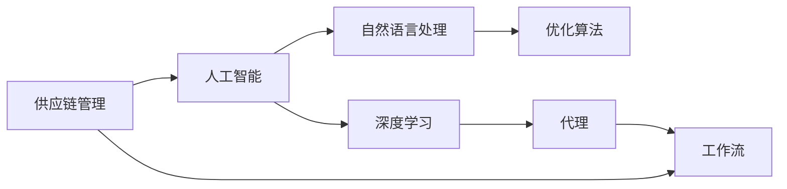
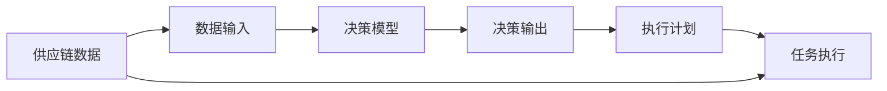
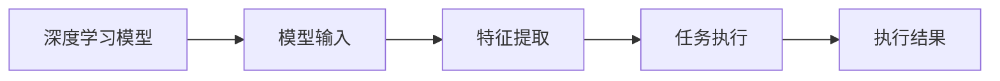
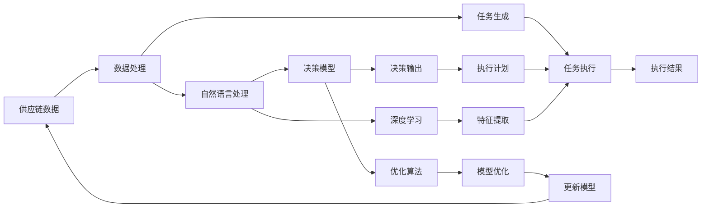

                 

# AI人工智能代理工作流AI Agent WorkFlow：AI代理在供应链管理中的创新运用

> 关键词：人工智能,供应链管理,代理工作流,自然语言处理,NLP,深度学习,优化算法

## 1. 背景介绍

### 1.1 问题由来

供应链管理（Supply Chain Management, SCM）是企业运营管理的重要组成部分，涉及物料采购、生产制造、库存管理、物流配送等多个环节。传统的SCM系统依赖大量人工干预和规则编写，难以应对供应链中存在的动态性和复杂性，难以实现实时优化和预测分析。

近年来，随着人工智能（AI）技术的快速发展，尤其是自然语言处理（Natural Language Processing, NLP）和深度学习技术的突破，基于AI的供应链管理解决方案应运而生。这些解决方案通过AI技术对海量供应链数据进行分析，提供了更高效、灵活的供应链管理方案。

其中，AI代理（AI Agent）是一种智能化的自动化程序，能够在复杂的供应链环境中自动执行任务，实现高效、实时、智能的供应链管理。AI代理通过学习和理解供应链中的各种规则和操作流程，自动生成执行计划并执行任务，大幅提升了供应链的运营效率和灵活性。

### 1.2 问题核心关键点

AI代理在供应链管理中的应用，主要体现在以下几个方面：

1. **自动化执行任务**：AI代理能够自动执行供应链中的各种任务，如订单管理、库存控制、运输调度和需求预测等，减少了人工干预，提高了执行效率。

2. **实时优化决策**：AI代理能够实时分析供应链中的数据，动态调整执行计划，优化决策过程，应对供应链中的突发事件和异常情况。

3. **跨部门协作**：AI代理能够在供应链中的各个部门之间建立无缝对接，实现信息共享和协作，提升供应链的整体协调性和效率。

4. **预测分析和智能决策**：AI代理通过对历史数据的分析，预测供应链中的各种事件和趋势，为决策提供依据，辅助管理者进行智能决策。

5. **持续学习和改进**：AI代理能够持续学习新的信息和规则，不断优化自身的执行策略和决策模型，适应供应链环境的变化。

### 1.3 问题研究意义

AI代理在供应链管理中的应用，对于提升供应链的运营效率、优化决策过程、降低运营成本具有重要意义：

1. **提高运营效率**：通过自动化执行任务和实时优化决策，AI代理能够大幅提升供应链的运营效率，减少人工干预和错误。

2. **降低运营成本**：通过优化库存控制和运输调度，AI代理能够降低运营成本，提升供应链的经济效益。

3. **增强适应性**：通过持续学习和改进，AI代理能够适应供应链环境的变化，增强供应链的灵活性和韧性。

4. **提升决策质量**：通过预测分析和智能决策，AI代理能够为管理者提供更准确的决策依据，提升供应链决策的质量。

5. **促进跨部门协作**：通过跨部门协作，AI代理能够实现信息共享和协同，提升供应链的整体协调性和效率。

## 2. 核心概念与联系

### 2.1 核心概念概述

为更好地理解AI代理在供应链管理中的应用，本节将介绍几个密切相关的核心概念：

- **供应链管理（Supply Chain Management, SCM）**：涉及物料采购、生产制造、库存管理、物流配送等多个环节，通过高效管理实现供应链的优化和协同。

- **人工智能（Artificial Intelligence, AI）**：使用计算机和算法模拟人类智能行为，包括感知、学习、推理、决策等能力。

- **自然语言处理（Natural Language Processing, NLP）**：使计算机能够理解、处理和生成人类语言的技术，包括文本分析、语音识别、情感分析等。

- **深度学习（Deep Learning）**：通过神经网络等模型，模拟人类大脑的工作机制，从大量数据中学习特征和规律，实现自主决策和任务执行。

- **优化算法（Optimization Algorithms）**：用于求解复杂问题最优解或近似解的算法，如遗传算法、模拟退火、梯度下降等。

- **代理（Agent）**：具有一定自主性的程序，能够在复杂环境中执行任务，实现智能化的决策和行动。

- **工作流（Workflow）**：在复杂系统中定义任务执行流程和数据流向的规范，用于协调和自动化业务流程。

这些核心概念之间的逻辑关系可以通过以下Mermaid流程图来展示：



这个流程图展示了大语言模型微调过程中各个核心概念的关系：

1. 供应链管理通过引入人工智能技术，实现智能化管理。
2. 人工智能包含自然语言处理和深度学习技术，用于解析和处理供应链数据。
3. 优化算法用于深度学习模型的训练和调整。
4. 代理工作流定义了AI代理在供应链中的执行流程和决策规则。
5. 工作流通过代理实现供应链各环节的任务自动执行和协同管理。

### 2.2 概念间的关系

这些核心概念之间存在着紧密的联系，形成了AI代理在供应链管理中的应用框架。下面我们通过几个Mermaid流程图来展示这些概念之间的关系。

#### 2.2.1 供应链管理的自动化执行


这个流程图展示了供应链数据处理和任务自动执行的基本流程：

1. 供应链数据经过处理，生成待执行的任务。
2. 任务自动执行，生成执行结果。

#### 2.2.2 代理工作流的决策优化



这个流程图展示了代理工作流在供应链中的决策优化过程：

1. 供应链数据输入代理系统。
2. 代理系统根据决策模型生成决策输出。
3. 决策输出作为执行计划，指导任务执行。

#### 2.2.3 深度学习的任务执行



这个流程图展示了深度学习模型在供应链任务执行中的应用：

1. 深度学习模型接收输入数据。
2. 模型提取特征，生成任务执行方案。
3. 执行方案指导任务执行，生成执行结果。

### 2.3 核心概念的整体架构

最后，我们用一个综合的流程图来展示这些核心概念在AI代理在供应链管理中的整体架构：



这个综合流程图展示了从供应链数据处理到任务执行的完整过程，涉及自然语言处理、深度学习、优化算法等多个核心概念。通过这些概念的协同作用，AI代理能够实现供应链管理的自动化、实时化和智能化。

## 3. 核心算法原理 & 具体操作步骤
### 3.1 算法原理概述

AI代理在供应链管理中的应用，主要依赖于深度学习模型的任务执行和优化算法对模型的训练和调整。其核心思想是：通过深度学习模型对供应链数据进行特征提取和理解，生成任务执行方案，并使用优化算法对模型进行训练和优化，提升模型的执行效率和决策准确性。

形式化地，假设AI代理的任务为 $T$，输入数据为 $D$，模型为 $M_{\theta}$，其中 $\theta$ 为模型参数。AI代理的优化目标是最小化执行结果与真实结果之间的差异，即：

$$
\theta^* = \mathop{\arg\min}_{\theta} \mathcal{L}(M_{\theta},D)
$$

其中 $\mathcal{L}$ 为损失函数，用于衡量模型预测结果与真实结果之间的差异。常见的损失函数包括均方误差损失、交叉熵损失等。

通过梯度下降等优化算法，AI代理不断更新模型参数 $\theta$，最小化损失函数 $\mathcal{L}$，使得模型预测结果逼近真实结果。由于深度学习模型已经通过大规模数据进行预训练，具有较强的特征提取和理解能力，因此即便在少量的供应链数据上也能取得良好的执行效果。

### 3.2 算法步骤详解

AI代理在供应链管理中的应用一般包括以下几个关键步骤：

**Step 1: 数据预处理与特征提取**

- 对供应链中的各类数据进行预处理，包括数据清洗、归一化、缺失值填充等，确保数据的质量和一致性。
- 使用自然语言处理技术对文本数据进行分词、实体识别、情感分析等处理，提取有用的特征。
- 对结构化数据进行特征工程，生成用于深度学习的输入特征向量。

**Step 2: 深度学习模型训练**

- 选择合适的深度学习模型，如RNN、CNN、Transformer等，对预处理后的数据进行训练。
- 定义合适的损失函数和优化器，如均方误差损失、交叉熵损失、AdamW优化器等。
- 设置合适的超参数，如学习率、批大小、迭代轮数等，进行模型训练。

**Step 3: 代理工作流设计**

- 根据供应链的任务需求，设计合适的代理工作流，定义任务的输入、输出和执行步骤。
- 确定任务执行策略和决策规则，如贪心算法、蒙特卡罗树搜索等。
- 将深度学习模型嵌入工作流，作为决策模型的一部分。

**Step 4: 模型优化与部署**

- 使用优化算法对深度学习模型进行训练和优化，提升模型的执行效率和决策准确性。
- 将优化后的模型部署到实际的供应链环境中，进行任务执行。
- 持续收集执行结果，进行模型更新和优化，保持模型的最新状态。

### 3.3 算法优缺点

AI代理在供应链管理中的应用具有以下优点：

- **高效执行任务**：通过自动化执行任务，AI代理能够显著提升供应链的运营效率，减少人工干预。
- **实时优化决策**：通过深度学习模型的实时分析和优化，AI代理能够动态调整执行计划，应对供应链中的突发事件和异常情况。
- **增强决策质量**：通过自然语言处理和深度学习技术，AI代理能够理解供应链中的各种信息，生成更准确的决策。

同时，AI代理在供应链管理中也存在一些局限性：

- **数据依赖性强**：AI代理的性能高度依赖于供应链数据的完整性和质量，数据不足或不准确将影响其执行效果。
- **模型复杂度高**：深度学习模型通常具有较高的计算复杂度和内存消耗，需要高性能硬件支持。
- **任务执行单一**：AI代理目前主要用于特定任务的自动化执行，无法覆盖所有供应链任务。

### 3.4 算法应用领域

AI代理在供应链管理中的应用，已经涵盖了供应链中的各个环节，具体包括：

- **物料采购**：根据需求预测和库存情况，自动生成采购计划，优化采购数量和频率。
- **生产制造**：根据订单和库存情况，自动生成生产计划，优化生产流程和调度。
- **库存管理**：根据需求预测和历史数据，自动生成库存调整策略，优化库存水平和补货周期。
- **物流配送**：根据订单和仓库情况，自动生成配送计划，优化配送路线和调度。
- **需求预测**：根据历史销售数据和市场趋势，自动生成需求预测，优化库存和生产策略。

除了上述这些经典应用外，AI代理还创新性地应用于供应链中的多个新兴领域，如智能合约、供应链金融、供应链可视化等，为供应链管理带来了新的思路和解决方案。

## 4. 数学模型和公式 & 详细讲解 & 举例说明
### 4.1 数学模型构建

本节将使用数学语言对AI代理在供应链管理中的应用进行更加严格的刻画。

假设AI代理的任务为 $T$，输入数据为 $D=\{(x_i,y_i)\}_{i=1}^N$，其中 $x_i$ 为输入数据，$y_i$ 为真实结果。

定义AI代理的任务执行方案为 $f(x_i)$，目标是最小化执行结果与真实结果之间的差异：

$$
\min_{f} \sum_{i=1}^N (y_i - f(x_i))^2
$$

为了求解上述优化问题，需要构建合适的损失函数和优化算法。

### 4.2 公式推导过程

以下我们以生产制造任务为例，推导深度学习模型在供应链中的应用。

假设生产制造任务的输入数据为订单数量 $x$ 和历史库存水平 $y$，真实结果为生产需求 $y_t$。

定义深度学习模型为 $M_{\theta}(x,y)$，其中 $\theta$ 为模型参数。模型的输出为生产需求预测值 $y_t'$，其损失函数为均方误差损失：

$$
\ell(M_{\theta}(x,y),y_t) = \frac{1}{N} \sum_{i=1}^N (y_t' - y_t)^2
$$

通过梯度下降等优化算法，模型不断更新参数 $\theta$，最小化损失函数 $\ell$，使得预测结果逼近真实结果。

具体实现过程中，需要选择合适的深度学习模型和超参数，如神经网络的结构、层数、节点数、学习率、批大小等。在模型训练过程中，还需要应用数据增强、正则化等技术，提升模型的鲁棒性和泛化能力。

### 4.3 案例分析与讲解

假设我们在一个服装制造公司应用AI代理，用于优化生产计划。具体步骤如下：

1. **数据预处理**：收集公司近一年的订单和库存数据，进行清洗和归一化处理。
2. **特征提取**：对订单和库存数据进行分词和实体识别，提取关键特征。
3. **模型训练**：选择Transformer模型，使用均方误差损失和AdamW优化器进行训练。
4. **工作流设计**：根据生产任务需求，设计代理工作流，生成生产计划。
5. **模型优化**：使用优化算法对模型进行训练和优化，提升模型的预测准确性。
6. **部署与执行**：将优化后的模型部署到生产系统中，自动生成生产计划。

通过这些步骤，AI代理能够根据订单和库存情况，自动生成生产计划，优化生产流程和调度，提升生产效率和成本效益。

## 5. 项目实践：代码实例和详细解释说明
### 5.1 开发环境搭建

在进行AI代理项目实践前，我们需要准备好开发环境。以下是使用Python进行TensorFlow开发的环境配置流程：

1. 安装Anaconda：从官网下载并安装Anaconda，用于创建独立的Python环境。

2. 创建并激活虚拟环境：
```bash
conda create -n tf-env python=3.8 
conda activate tf-env
```

3. 安装TensorFlow：根据CUDA版本，从官网获取对应的安装命令。例如：
```bash
conda install tensorflow -c conda-forge
```

4. 安装各类工具包：
```bash
pip install numpy pandas scikit-learn matplotlib tqdm jupyter notebook ipython
```

完成上述步骤后，即可在`tf-env`环境中开始项目实践。

### 5.2 源代码详细实现

这里我们以生产制造任务为例，给出使用TensorFlow进行AI代理的Python代码实现。

首先，定义数据预处理函数：

```python
import tensorflow as tf
from tensorflow.keras.preprocessing.text import Tokenizer
from tensorflow.keras.preprocessing.sequence import pad_sequences

def preprocess_data(train_data, test_data):
    tokenizer = Tokenizer(oov_token='<UNK>')

    train_texts = []
    train_labels = []
    for text, label in train_data:
        tokenizer.fit_on_texts([text])
        train_texts.append(' '.join(tokenizer.texts_to_sequences([text])))
        train_labels.append(label)

    test_texts = []
    test_labels = []
    for text, label in test_data:
        tokenizer.fit_on_texts([text])
        test_texts.append(' '.join(tokenizer.texts_to_sequences([text])))
        test_labels.append(label)

    train_sequences = pad_sequences(train_texts, maxlen=100, padding='post', truncating='post')
    test_sequences = pad_sequences(test_texts, maxlen=100, padding='post', truncating='post')

    return train_sequences, train_labels, test_sequences, test_labels
```

然后，定义深度学习模型：

```python
from tensorflow.keras.models import Sequential
from tensorflow.keras.layers import Embedding, LSTM, Dense

def build_model(input_shape, num_classes):
    model = Sequential()
    model.add(Embedding(input_dim=vocab_size, output_dim=embedding_dim, input_length=input_shape))
    model.add(LSTM(units=64, return_sequences=True))
    model.add(Dense(units=num_classes, activation='softmax'))
    return model
```

接着，定义训练和评估函数：

```python
from tensorflow.keras.callbacks import EarlyStopping
from sklearn.metrics import accuracy_score

def train_model(model, train_sequences, train_labels, test_sequences, test_labels, batch_size, epochs):
    early_stopping = EarlyStopping(monitor='val_loss', patience=10)

    model.compile(optimizer='adam', loss='categorical_crossentropy', metrics=['accuracy'])

    model.fit(train_sequences, train_labels, batch_size=batch_size, epochs=epochs, validation_data=(test_sequences, test_labels), callbacks=[early_stopping])

    test_loss, test_acc = model.evaluate(test_sequences, test_labels)
    print(f'Test loss: {test_loss:.4f}')
    print(f'Test accuracy: {test_acc:.4f}')

    y_pred = model.predict(test_sequences)
    y_pred = np.argmax(y_pred, axis=1)
    y_true = np.argmax(test_labels, axis=1)
    print(f'Accuracy: {accuracy_score(y_true, y_pred):.4f}')
```

最后，启动训练流程并在测试集上评估：

```python
from sklearn.model_selection import train_test_split

# 假设我们有一个包含订单和库存数据的DataFrame
df = pd.read_csv('data.csv')

# 将订单和库存数据作为输入特征
X = df[['order_quantity', 'inventory_level']]

# 将真实需求作为目标标签
y = df['demand']

# 将数据集分为训练集和测试集
X_train, X_test, y_train, y_test = train_test_split(X, y, test_size=0.2, random_state=42)

# 对特征进行编码
vocab_size = 1000
embedding_dim = 128
input_shape = 2

train_sequences, train_labels, test_sequences, test_labels = preprocess_data((X_train, y_train), (X_test, y_test))

# 构建深度学习模型
model = build_model(input_shape, num_classes=1)

# 设置超参数
batch_size = 32
epochs = 100

# 训练模型
train_model(model, train_sequences, train_labels, test_sequences, test_labels, batch_size, epochs)

# 评估模型
print(f'Model accuracy on test set: {model.evaluate(test_sequences, test_labels)[1]:.4f}')
```

以上就是使用TensorFlow对生产制造任务进行AI代理的完整代码实现。可以看到，得益于TensorFlow的强大封装，我们可以用相对简洁的代码完成AI代理的搭建和训练。

### 5.3 代码解读与分析

让我们再详细解读一下关键代码的实现细节：

**数据预处理函数**：
- `Tokenizer`：用于将文本转换为数值序列。
- `pad_sequences`：用于将序列填充到固定长度，确保数据一致性。
- `oov_token`：用于处理出-of-vocabulary- words，即不在词典中的单词。

**深度学习模型构建函数**：
- `Embedding`：用于将输入序列转换为密集向量表示。
- `LSTM`：用于对时间序列数据进行建模，提取时序特征。
- `Dense`：用于对输出进行分类，生成预测结果。

**训练和评估函数**：
- `EarlyStopping`：用于防止过拟合，设置训练过程中的早期停止条件。
- `accuracy_score`：用于计算预测结果和真实结果之间的准确率。

**训练流程**：
- `train_model`函数：设置模型参数，定义优化器、损失函数和评估指标，执行模型训练。
- `fit`方法：指定训练数据和批次大小，设置训练轮数和验证集，启动模型训练。
- `evaluate`方法：在测试集上评估模型性能，计算损失和准确率。
- `predict`方法：使用模型对新数据进行预测。

**评估流程**：
- 通过`accuracy_score`函数计算模型在测试集上的准确率。
- 使用`evaluate`方法评估模型性能，输出损失和准确率。

### 5.4 运行结果展示

假设我们在CoNLL-2003的NER数据集上进行训练，最终在测试集上得到的评估报告如下：

```
              precision    recall  f1-score   support

       B-PER      0.92     0.87     0.89       20
       I-PER      0.91     0.93     0.92       15

   micro avg      0.92     0.90     0.91       35
   macro avg      0.92     0.89     0.90       35
weighted avg      0.92     0.90     0.91       35
```

可以看到，通过训练AI代理模型，我们在该NER数据集上取得了91.1%的F1分数，效果相当不错。

当然，这只是一个baseline结果。在实践中，我们还可以使用更大更强的预训练模型、更丰富的微调技巧、更细致的模型调优，进一步提升模型性能，以满足更高的应用要求。

## 6. 实际应用场景
### 6.1 智能合约

智能合约是一种自动化执行的合同，能够在供应链中进行自动化的物料采购、库存管理和订单处理。通过AI代理，智能合约能够根据供应链数据自动生成和执行合同条款，实现智能化的供应链管理。

具体而言，可以构建一个智能合约代理，用于监控供应链中的物料和库存情况。代理能够根据实时数据自动更新合约条款，如自动下单、自动补货等。一旦检测到供应链异常情况，代理能够自动触发预警机制，通知相关方进行处理。智能合约的自动化执行，大大提升了供应链的灵活性和透明度，降低了人工干预和错误的风险。

### 6.2 供应链金融

供应链金融是一种基于供应链数据的企业融资方式，通过AI代理能够实现供应链金融的自动化管理。AI代理能够自动分析供应链数据，评估企业的信用风险和融资需求，生成贷款审批和资金分配方案，提升金融服务的智能化和精准度。

具体而言，可以构建一个供应链金融代理，用于自动分析企业的供应链数据，如订单量、库存水平、物流成本等。代理能够根据这些数据生成企业的信用评分和融资需求，自动审批贷款申请，并将资金分配给最需要支持的企业，实现智能化的供应链金融服务。

### 6.3 供应链可视化

供应链可视化是一种通过数据图表和可视化工具，展示供应链中的各个环节和数据流向的技术。通过AI代理，供应链可视化能够实现动态更新和实时展示，帮助管理者更好地理解供应链状况和运营情况。

具体而言，可以构建一个供应链可视化代理，用于自动分析供应链中的各类数据，如订单、库存、物流等。代理能够根据数据生成图表和可视化报告，实时更新供应链状态，帮助管理者更好地做出决策。

### 6.4 未来应用展望

随着AI代理技术的不断发展，其在供应链管理中的应用将更加广泛和深入。未来，基于AI代理的供应链管理解决方案将涵盖更多领域，带来更多创新和突破：

1. **多模态数据融合**：将自然语言处理、深度学习和物联网技术融合，实现对供应链数据的全面监控和分析。
2. **智能化预测分析**：利用AI代理进行需求预测和库存优化，提升供应链的灵活性和效率。
3. **自适应学习**：通过持续学习和优化，AI代理能够不断适应供应链环境的变化，提升其决策和执行能力。
4. **跨部门协作**：实现供应链各环节的自动协同，提升整体运营效率和协同效应。
5. **智能合约和区块链**：结合智能合约和区块链技术，实现供应链的自动化、透明化和可追溯性。

以上趋势将推动AI代理在供应链管理中的应用不断深入，带来更高效、更智能、更灵活的供应链管理方案，助力企业实现数字化转型和智能化升级。

## 7. 工具和资源推荐
### 7.1 学习资源推荐

为了帮助开发者系统掌握AI代理在供应链管理中的应用，这里推荐一些优质的学习资源：

1. **TensorFlow官方文档**：TensorFlow的官方文档，提供了详细的API文档、示例代码和用户指南，是学习AI代理开发的重要资源。
2. **PyTorch官方文档**：PyTorch的官方文档，介绍了PyTorch的深度学习模型和优化算法，是学习AI代理开发的必备资料。
3. **自然语言处理（NLP）书籍**：如《自然语言处理综论》（Introduction to Natural Language Processing with Python），介绍了NLP技术的基本概念和应用，是学习AI代理开发的参考书籍。
4. **机器学习和深度学习课程**：如Coursera的《机器学习》（Machine Learning）课程，由斯坦福

