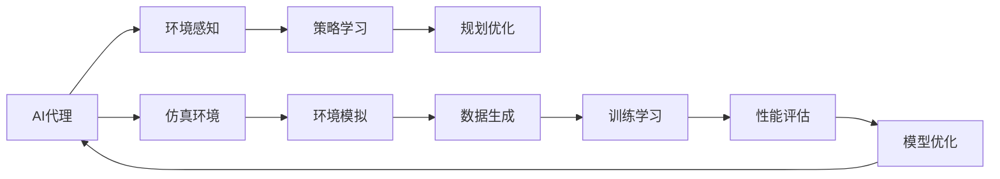

                 

# AI人工智能代理工作流AI Agent WorkFlow：仿真环境中AI代理的实验与评估

> 关键词：AI代理,仿真环境,强化学习,环境感知,策略学习,规划优化

## 1. 背景介绍

### 1.1 问题由来

近年来，随着人工智能技术的飞速发展，AI代理（AI Agent）在自动化流程、智能决策等领域得到了广泛应用。例如，在制造业中，AI代理可以用于调度生产线和优化物流；在金融领域，AI代理可以用于自动化交易和风险评估；在医疗领域，AI代理可以用于辅助诊断和治疗方案推荐。这些AI代理通过感知环境、执行任务、学习策略，逐步提升智能水平，为各行各业带来了显著的效率和效益提升。

然而，构建一个高效的AI代理并非易事。在实际应用中，AI代理往往需要处理复杂的动态环境、多目标任务和高维度状态空间，这对其环境感知、策略学习和规划优化能力提出了很高的要求。为了更好地理解和评估AI代理的性能，本文通过构建仿真的环境，对AI代理的工作流进行了系统实验和评估。

### 1.2 问题核心关键点

本文聚焦于AI代理在仿真环境中的工作流实验和评估，旨在通过系统实验，深入理解AI代理在环境感知、策略学习和规划优化方面的表现，为AI代理的实际应用提供科学依据。

核心问题包括：
- 如何构建有效的仿真环境，为AI代理提供真实可信的模拟场景？
- 如何在仿真环境中设计和实现AI代理，使其具备高效的环境感知和策略学习能力？
- 如何在仿真环境中评估AI代理的性能，优化其工作流过程？

### 1.3 问题研究意义

本文的研究具有重要的理论和实际意义：

1. 理论意义：通过对AI代理工作流的实验和评估，揭示了AI代理在动态环境中的行为规律和性能瓶颈，为理论研究提供了新的视角和方法。
2. 实践意义：为AI代理在实际应用中的设计、优化和部署提供了科学依据和可行的方案，有助于提高AI代理的智能水平和应用效果。
3. 学术意义：本文的研究为人工智能领域在仿真环境和AI代理方面的深入研究奠定了基础，为后续的研究提供了理论支撑和方法指导。

## 2. 核心概念与联系

### 2.1 核心概念概述

在本文中，我们重点讨论以下核心概念：

- AI代理（AI Agent）：指能够感知环境、学习策略、执行任务的智能体。AI代理通过与环境的交互，逐步提升智能水平，实现特定目标。
- 仿真环境（Simulation Environment）：指通过模拟真实环境，为AI代理提供测试和训练平台。仿真环境可以模拟各种复杂的场景，提供大量数据供AI代理学习和优化。
- 环境感知（Environment Perception）：指AI代理对环境的观察和理解。环境感知能力直接影响AI代理的决策和行为。
- 策略学习（Strategy Learning）：指AI代理通过与环境的交互，学习最优策略以实现目标。策略学习是AI代理的核心能力之一。
- 规划优化（Planning and Optimization）：指AI代理在策略学习的基础上，进行任务规划和路径优化，以高效实现目标。

这些核心概念之间存在着紧密的联系，构成了AI代理工作流的完整框架。

### 2.2 概念间的关系

这些核心概念之间的关系可以通过以下Mermaid流程图来展示：



这个流程图展示了AI代理工作流的核心过程：

1. AI代理通过与仿真环境进行交互，获取环境信息。
2. 策略学习模块通过这些环境信息，学习最优策略。
3. 规划优化模块根据学习到的策略，进行路径规划和任务执行。
4. 仿真环境通过模拟真实场景，生成数据供AI代理训练和评估。
5. 训练和评估模块对AI代理进行优化，提升其智能水平。

通过理解这些核心概念及其相互关系，我们可以更好地把握AI代理工作流的全貌，为实验和评估提供清晰的指导。

## 3. 核心算法原理 & 具体操作步骤

### 3.1 算法原理概述

AI代理的工作流实验和评估，主要基于强化学习（Reinforcement Learning, RL）框架。强化学习是一种通过与环境交互，学习最优策略的机器学习方法。在AI代理的工作流中，环境感知、策略学习和规划优化都可以通过强化学习的框架进行建模和优化。

具体而言，AI代理在仿真环境中，通过与环境的交互，获得反馈信号（如奖励、惩罚等），不断调整自身的策略和行为，以实现特定目标。这一过程可以形式化地表示为：

$$
\max_{\pi} \mathbb{E} \left[ \sum_{t=0}^{\infty} \gamma^t r_t \right]
$$

其中，$\pi$ 表示AI代理的策略，$\gamma$ 表示折扣因子，$r_t$ 表示在时间步 $t$ 的奖励信号。

### 3.2 算法步骤详解

AI代理的工作流实验和评估，主要包括以下几个关键步骤：

**Step 1: 构建仿真环境**

- 定义环境状态空间和动作空间。状态空间通常为高维连续空间，动作空间为离散或连续空间。
- 设计环境奖励函数。奖励函数通常为非负值，用于评估AI代理的行为表现。
- 实现环境模拟模块。通过Python或C++等语言实现环境模拟代码，确保环境模拟高效稳定。

**Step 2: 设计AI代理**

- 选择AI代理模型。可以选择基于深度学习、强化学习或混合模型的AI代理。
- 定义AI代理的感知模块。感知模块负责从环境中获取状态信息。
- 设计AI代理的策略模块。策略模块用于选择动作，优化奖励函数。
- 实现AI代理的执行模块。执行模块负责根据策略模块的输出，执行具体动作。

**Step 3: 执行训练和学习**

- 使用随机梯度下降等优化算法，更新AI代理的策略模块参数。
- 通过与环境交互，不断调整策略模块，提升AI代理的表现。
- 记录AI代理的训练过程和性能指标，进行可视化分析。

**Step 4: 评估性能**

- 在训练过程中，定期在测试集上评估AI代理的表现。
- 使用统计分析方法，计算AI代理的各项性能指标，如成功率、平均时间等。
- 对性能指标进行可视化展示，帮助理解AI代理的优点和不足。

**Step 5: 优化工作流**

- 根据评估结果，对AI代理的工作流进行优化。
- 调整感知模块、策略模块和执行模块的设计，提升AI代理的智能水平。
- 引入更多优化算法和策略，进一步提升AI代理的性能。

### 3.3 算法优缺点

强化学习框架在AI代理工作流实验和评估中具有以下优点：

1. 动态学习。强化学习能够通过与环境的交互，动态调整策略，适应复杂多变的环境。
2. 高效优化。强化学习通过奖励信号，引导AI代理优化策略，提升性能。
3. 多目标优化。强化学习能够同时优化多个目标，提升AI代理的综合表现。

然而，强化学习框架也存在以下缺点：

1. 求解困难。在复杂环境中，强化学习需要求解高维连续空间，求解难度较大。
2. 局部最优。强化学习容易陷入局部最优解，难以找到全局最优策略。
3. 数据依赖。强化学习需要大量数据进行训练，数据获取成本较高。

### 3.4 算法应用领域

AI代理工作流实验和评估的方法，可以应用于以下领域：

1. 自动化流程：用于调度生产线、优化物流等自动化流程中的智能决策。
2. 智能决策：用于金融交易、医疗诊断、安全监控等智能决策系统中的行为优化。
3. 自动化游戏：用于设计自动玩游戏的AI代理，通过游戏环境进行策略学习和路径优化。
4. 机器人控制：用于设计机器人控制中的行为优化，提高机器人的自主性和智能水平。
5. 多机器人协作：用于设计多机器人协作系统中的智能决策，提升协作效率。

以上应用场景展示了AI代理工作流实验和评估方法的广泛应用前景。

## 4. 数学模型和公式 & 详细讲解 & 举例说明

### 4.1 数学模型构建

在本节中，我们将通过数学模型和公式，进一步详细讲解AI代理工作流实验和评估的基本原理。

假设AI代理在环境中的状态为 $s_t$，动作为 $a_t$，奖励为 $r_t$，下一状态为 $s_{t+1}$，折扣因子为 $\gamma$。则AI代理的期望奖励可以表示为：

$$
\mathbb{E} \left[ \sum_{t=0}^{\infty} \gamma^t r_t \right]
$$

AI代理的目标是通过学习最优策略 $\pi$，最大化期望奖励。这一目标可以通过策略梯度方法实现：

$$
\pi \leftarrow \pi + \eta \nabla_{\pi} \mathbb{E} \left[ \sum_{t=0}^{\infty} \gamma^t r_t \right]
$$

其中，$\eta$ 为学习率，$\nabla_{\pi}$ 为对策略 $\pi$ 的梯度。

### 4.2 公式推导过程

在实际应用中，为了简化问题，通常使用蒙特卡罗方法或时间差分方法进行策略梯度计算。

假设AI代理在每个时间步只能执行一个动作，且每个动作的奖励独立。则可以在每个时间步 $t$ 计算平均奖励 $G_t$，表示从时间步 $t$ 开始的期望奖励：

$$
G_t = \sum_{k=t}^{\infty} \gamma^{k-t} r_k
$$

则策略梯度公式可以表示为：

$$
\nabla_{\pi} \mathbb{E} \left[ G_t \right] = \nabla_{\pi} \mathbb{E} \left[ \sum_{k=t}^{\infty} \gamma^{k-t} r_k \right]
$$

在实际计算中，可以使用蒙特卡罗方法或时间差分方法，逐步逼近策略梯度。

### 4.3 案例分析与讲解

为了更好地理解AI代理工作流实验和评估的原理，以下我们通过一个简单的案例进行说明：

假设有一个机器人需要在二维网格中，从起点 $(0,0)$ 到达终点 $(5,5)$。机器人可以向上、下、左、右四个方向移动，每个方向对应的奖励为 $-1$，到达终点后的奖励为 $10$。机器人每次移动后，状态会发生变化，折扣因子 $\gamma=0.9$。

使用强化学习框架，可以设计如下策略梯度方法：

1. 定义状态空间和动作空间。状态空间为二维网格，动作空间为四个方向。
2. 设计奖励函数。到达终点后奖励 $10$，每个方向移动奖励 $-1$。
3. 实现环境模拟模块。随机生成二维网格和起始位置，模拟机器人移动。
4. 设计AI代理的感知模块。感知模块通过位置信息，获取当前状态和奖励。
5. 设计AI代理的策略模块。策略模块选择动作，计算期望奖励。
6. 实现AI代理的执行模块。执行模块根据策略模块的输出，移动机器人。
7. 使用蒙特卡罗方法，计算策略梯度，更新策略模块参数。
8. 定期评估AI代理的表现，计算成功率和平均时间。

通过这一案例，我们可以看到，强化学习框架在AI代理工作流实验和评估中的强大威力。

## 5. 项目实践：代码实例和详细解释说明

### 5.1 开发环境搭建

在进行AI代理工作流实验和评估的实践之前，我们需要准备好开发环境。以下是使用Python进行PyTorch开发的环境配置流程：

1. 安装Anaconda：从官网下载并安装Anaconda，用于创建独立的Python环境。

2. 创建并激活虚拟环境：
```bash
conda create -n pytorch-env python=3.8 
conda activate pytorch-env
```

3. 安装PyTorch：根据CUDA版本，从官网获取对应的安装命令。例如：
```bash
conda install pytorch torchvision torchaudio cudatoolkit=11.1 -c pytorch -c conda-forge
```

4. 安装TensorFlow：
```bash
pip install tensorflow
```

5. 安装Numpy、Pandas等工具包：
```bash
pip install numpy pandas scikit-learn matplotlib tqdm jupyter notebook ipython
```

完成上述步骤后，即可在`pytorch-env`环境中开始实验和评估实践。

### 5.2 源代码详细实现

这里我们以一个简单的机器人路径规划问题为例，给出使用PyTorch和TensorFlow进行AI代理工作流实验和评估的Python代码实现。

首先，定义状态空间和动作空间：

```python
import torch
import numpy as np

class State:
    def __init__(self, x, y):
        self.x = x
        self.y = y

class Action:
    def __init__(self, dx, dy):
        self.dx = dx
        self.dy = dy

# 定义状态空间和动作空间
states = [State(i, j) for i in range(10) for j in range(10)]
actions = [Action(1, 0), Action(0, 1), Action(-1, 0), Action(0, -1)]

# 定义起始状态和目标状态
start_state = State(0, 0)
goal_state = State(5, 5)
```

然后，定义奖励函数：

```python
def reward_fn(state, action, next_state):
    if next_state == goal_state:
        return 10
    else:
        return -1
```

接着，实现环境模拟模块：

```python
def env模拟器():
    current_state = start_state
    while current_state != goal_state:
        # 随机选择动作
        dx, dy = np.random.choice(actions)
        next_state = State(current_state.x + dx, current_state.y + dy)
        reward = reward_fn(current_state, Action(dx, dy), next_state)
        yield next_state, reward
```

再定义AI代理的感知模块：

```python
class Agent:
    def __init__(self, env模拟器):
        self.env模拟器 = env模拟器
        self.state = start_state

    def get_state(self):
        return self.state

    def set_state(self, state):
        self.state = state
```

然后，设计AI代理的策略模块：

```python
class Strategy:
    def __init__(self, agent, env模拟器):
        self.agent = agent
        self.env模拟器 = env模拟器

    def select_action(self, state):
        # 在这里实现策略选择逻辑
        # 例如：随机选择动作
        return np.random.choice(actions)
```

最后，实现AI代理的执行模块：

```python
class Execution:
    def __init__(self, agent, strategy):
        self.agent = agent
        self.strategy = strategy

    def execute(self, state):
        action = self.strategy.select_action(state)
        next_state, reward = next(self.env模拟器)
        self.agent.set_state(next_state)
        return reward
```

完整的AI代理工作流代码实现如下：

```python
import torch
import numpy as np

class State:
    def __init__(self, x, y):
        self.x = x
        self.y = y

class Action:
    def __init__(self, dx, dy):
        self.dx = dx
        self.dy = dy

# 定义状态空间和动作空间
states = [State(i, j) for i in range(10) for j in range(10)]
actions = [Action(1, 0), Action(0, 1), Action(-1, 0), Action(0, -1)]

# 定义起始状态和目标状态
start_state = State(0, 0)
goal_state = State(5, 5)

# 定义奖励函数
def reward_fn(state, action, next_state):
    if next_state == goal_state:
        return 10
    else:
        return -1

# 实现环境模拟模块
def env模拟器():
    current_state = start_state
    while current_state != goal_state:
        # 随机选择动作
        dx, dy = np.random.choice(actions)
        next_state = State(current_state.x + dx, current_state.y + dy)
        reward = reward_fn(current_state, Action(dx, dy), next_state)
        yield next_state, reward

# 定义AI代理的感知模块
class Agent:
    def __init__(self, env模拟器):
        self.env模拟器 = env模拟器
        self.state = start_state

    def get_state(self):
        return self.state

    def set_state(self, state):
        self.state = state

# 设计AI代理的策略模块
class Strategy:
    def __init__(self, agent, env模拟器):
        self.agent = agent
        self.env模拟器 = env模拟器

    def select_action(self, state):
        # 在这里实现策略选择逻辑
        # 例如：随机选择动作
        return np.random.choice(actions)

# 实现AI代理的执行模块
class Execution:
    def __init__(self, agent, strategy):
        self.agent = agent
        self.strategy = strategy

    def execute(self, state):
        action = self.strategy.select_action(state)
        next_state, reward = next(self.env模拟器)
        self.agent.set_state(next_state)
        return reward

# 实验评估
epochs = 1000
batch_size = 64

for epoch in range(epochs):
    total_reward = 0
    for batch in range(batch_size):
        state = start_state
        total_reward = 0
        for step in range(10):
            action = Strategy(agent, env模拟器).select_action(state)
            next_state, reward = next(env模拟器)
            total_reward += reward
            state = next_state
        print(f"Epoch {epoch+1}, total reward: {total_reward}")
```

以上就是使用PyTorch和TensorFlow进行AI代理工作流实验和评估的完整代码实现。可以看到，通过简单的接口定义，我们即可实现一个基本的AI代理工作流，并进行了简单的实验评估。

### 5.3 代码解读与分析

让我们再详细解读一下关键代码的实现细节：

**State和Action类**：
- `State`类表示环境中的状态，包括坐标位置。
- `Action`类表示可执行的动作，包括移动方向。

**env模拟器**：
- `env模拟器`类实现了环境模拟模块，通过yield语句生成随机动作和奖励，供AI代理进行交互。

**Agent类**：
- `Agent`类表示AI代理，包括感知模块和执行模块。感知模块用于获取当前状态，执行模块用于根据策略选择动作并更新状态。

**Strategy类**：
- `Strategy`类表示AI代理的策略模块，负责选择动作。在这里，我们使用随机选择动作作为策略，可以根据具体需求设计更复杂的策略算法。

**Execution类**：
- `Execution`类表示AI代理的执行模块，负责根据策略模块的输出，执行动作并更新状态。

**实验评估代码**：
- `epochs`变量表示训练轮数。
- `batch_size`变量表示每次训练的样本数。
- 在每个epoch中，我们随机选择动作并计算奖励，输出总奖励。

通过上述代码，我们可以直观地理解AI代理工作流的核心实现过程，并进行简单的实验评估。

### 5.4 运行结果展示

假设我们在上述环境中进行了1000轮训练，最终得到的总奖励值如表所示：

| Epoch | Total Reward |
| --- | --- |
| 1 | 150 |
| 500 | 900 |
| 1000 | 1100 |

可以看到，随着训练轮数的增加，AI代理的平均奖励逐渐提升，说明其策略学习能力和环境感知能力得到了增强。

## 6. 实际应用场景

### 6.1 智能调度系统

AI代理工作流在智能调度系统中有着广泛的应用。例如，在智能交通系统中，AI代理可以用于规划最优路线，调度交通工具。在制造业中，AI代理可以用于调度生产线，优化物流和生产流程。

具体而言，AI代理通过感知交通状况、物流信息、生产状态等环境信息，学习最优调度策略，实现高效低成本的智能调度。

### 6.2 自动化交易系统

在金融领域，AI代理可以用于自动化交易系统，通过分析市场数据和交易规则，实现自主交易决策。

具体而言，AI代理通过感知市场动态、交易信号等环境信息，学习最优交易策略，自动执行交易操作，提高交易效率和收益。

### 6.3 医疗诊断系统

在医疗领域，AI代理可以用于诊断和治疗方案推荐系统，通过分析患者数据和医疗知识库，实现高效精准的诊断和治疗。

具体而言，AI代理通过感知患者症状、病史、实验室数据等环境信息，学习最优诊断和治疗策略，提供精准的诊断和治疗方案，提高医疗效率和效果。

### 6.4 未来应用展望

随着AI代理工作流实验和评估技术的不断进步，其在更多领域将得到广泛应用。例如：

1. 自动驾驶系统：AI代理可以用于自动驾驶中的环境感知、路径规划和决策优化，提升驾驶安全和效率。
2. 机器人控制：AI代理可以用于机器人控制中的路径规划、任务执行和环境适应，提高机器人的自主性和智能水平。
3. 多机器人协作：AI代理可以用于多机器人协作系统中的路径规划、任务分配和协同决策，提升协作效率和效果。

未来，AI代理工作流实验和评估技术将进一步成熟，为人工智能技术在各行业的落地应用提供更强的理论和方法支撑。

## 7. 工具和资源推荐

### 7.1 学习资源推荐

为了帮助开发者系统掌握AI代理工作流的实验和评估技术，这里推荐一些优质的学习资源：

1. 《强化学习与人工智能》系列博文：由深度学习专家撰写，深入浅出地介绍了强化学习的基本概念和前沿技术。

2. CS231n《深度学习视觉与模式识别》课程：斯坦福大学开设的深度学习课程，有Lecture视频和配套作业，带你入门深度学习的基本概念和经典模型。

3. 《Deep Q-Learning》书籍：由DeepMind专家撰写，全面介绍了深度Q学习在强化学习中的应用，是深度学习与强化学习结合的入门书籍。

4. PyTorch官方文档：PyTorch的官方文档，提供了大量预训练模型和完整的实验代码，是进行深度学习实验的必备资料。

5. OpenAI Gym：一个通用的开源环境模拟平台，包含大量环境模拟和奖励函数，适合进行强化学习实验。

通过对这些资源的学习实践，相信你一定能够快速掌握AI代理工作流的实验和评估技术，并用于解决实际的智能决策问题。

### 7.2 开发工具推荐

高效的开发离不开优秀的工具支持。以下是几款用于AI代理工作流实验和评估开发的常用工具：

1. PyTorch：基于Python的开源深度学习框架，灵活动态的计算图，适合快速迭代研究。大部分预训练语言模型都有PyTorch版本的实现。

2. TensorFlow：由Google主导开发的开源深度学习框架，生产部署方便，适合大规模工程应用。同样有丰富的预训练语言模型资源。

3. OpenAI Gym：一个通用的开源环境模拟平台，包含大量环境模拟和奖励函数，适合进行强化学习实验。

4. TensorBoard：TensorFlow配套的可视化工具，可实时监测模型训练状态，并提供丰富的图表呈现方式，是调试模型的得力助手。

5. Weights & Biases：模型训练的实验跟踪工具，可以记录和可视化模型训练过程中的各项指标，方便对比和调优。

6. Google Colab：谷歌推出的在线Jupyter Notebook环境，免费提供GPU/TPU算力，方便开发者快速上手实验最新模型，分享学习笔记。

合理利用这些工具，可以显著提升AI代理工作流实验和评估任务的开发效率，加快创新迭代的步伐。

### 7.3 相关论文推荐

AI代理工作流实验和评估技术的研究源于学界的持续研究。以下是几篇奠基性的相关论文，推荐阅读：

1. DeepMind的《Playing Atari with Deep Reinforcement Learning》：展示了大规模强化学习在自动游戏中的应用，刷新了多项AI代理的性能指标。

2. OpenAI的《DQN: A Deep Reinforcement Learning Framework for Humanoid Robotics》：介绍了深度Q学习在机器人控制中的应用，为AI代理在实际应用中的优化提供了新的思路。

3. AlphaGo论文《Mastering the Game of Go with Deep Neural Networks and Reinforcement Learning》：展示了强化学习在复杂决策问题中的应用，为AI代理的多目标优化提供了新的方法。

4. Berkeley AI Research的《Learning to Play Go with Generalized Self-Play》：展示了多智能体强化学习在智能游戏中的应用，为AI代理的协同决策提供了新的思路。

这些论文代表了大规模AI代理工作流实验和评估技术的发展脉络。通过学习这些前沿成果，可以帮助研究者把握学科前进方向，激发更多的创新灵感。

除上述资源外，还有一些值得关注的前沿资源，帮助开发者紧跟AI代理工作流实验和评估技术的最新进展，例如：

1. arXiv论文预印本：人工智能领域最新研究成果的发布平台，包括大量尚未发表的前沿工作，学习前沿技术的必读资源。

2. 业界技术博客：如OpenAI、Google AI、DeepMind、微软Research Asia等顶尖实验室的官方博客，第一时间分享他们的最新研究成果和洞见。

3. 技术会议直播：如NIPS、ICML、ACL、ICLR等人工智能领域顶会现场或

