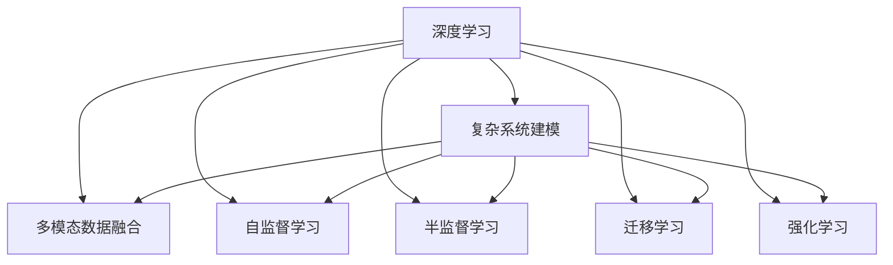
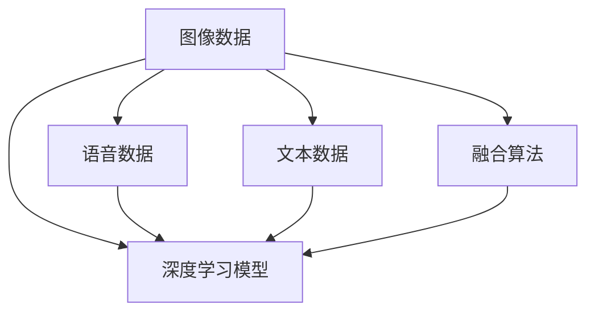
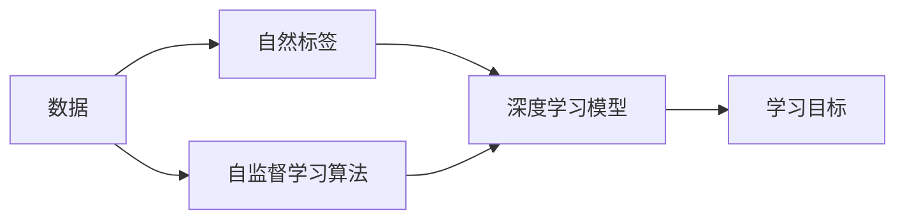
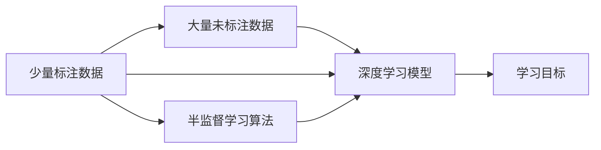
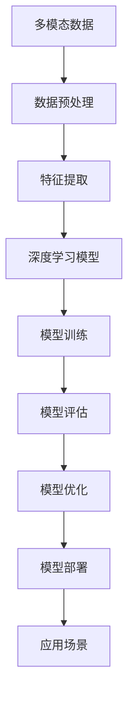

                 

## 1. 背景介绍

### 1.1 问题由来
随着人工智能技术的飞速发展，深度学习在复杂系统建模中发挥了越来越重要的作用。深度学习模型能够从大量的数据中学习到高度抽象的特征表示，从而在诸如计算机视觉、自然语言处理、语音识别等多个领域取得了显著的突破。复杂系统建模作为人工智能领域的重要研究方向，涉及多维、异构数据的综合分析与建模，是实现智能化决策和科学预测的关键技术。

近年来，深度学习在复杂系统建模中的应用逐渐扩展，涵盖了社会网络分析、金融市场预测、电力系统调度等多个行业领域。深度学习算法在复杂系统建模中的成功应用，不仅提高了模型的预测准确性和解释能力，也为复杂系统提供了更为精细、动态的模型表达方式。

### 1.2 问题核心关键点
深度学习算法在复杂系统建模中的应用，主要集中在以下几个方面：

1. **大规模数据处理能力**：深度学习模型通过多层神经网络结构，能够处理大规模、高维度、非线性的数据，提取复杂系统的动态特征和结构关系。

2. **自适应学习能力**：深度学习模型能够通过自适应调整网络参数，捕捉数据中的隐含模式和规律，从而实现高效的知识提取和表示。

3. **多模态数据融合**：深度学习模型能够自然地处理多种类型的数据，如图像、文本、语音等，实现多模态数据的联合建模和分析。

4. **模型泛化能力**：深度学习模型在泛化能力上表现突出，能够在未见过的数据上准确预测，提高了模型的实用性和鲁棒性。

5. **解释性增强**：随着研究者对深度学习模型的不断深入，其解释性也在逐步增强。通过可视化技术、注意力机制等方法，使得复杂系统建模结果更加易于理解和解释。

然而，尽管深度学习在复杂系统建模中展现了巨大的潜力，仍然存在一些挑战和局限性。比如，如何高效处理海量数据、如何避免模型过拟合、如何提升模型解释性等，这些问题仍需深入研究和解决。

### 1.3 问题研究意义
深度学习在复杂系统建模中的应用，对于提升系统的智能化水平、优化决策过程、提高预测准确性具有重要意义：

1. **提高决策精度**：深度学习模型能够从数据中自动学习到复杂的模式和规律，从而提高模型在复杂系统建模中的预测精度。

2. **优化决策过程**：通过深度学习模型对复杂系统进行建模，能够实现多维度、多层次的模型融合，优化决策过程，降低人工干预。

3. **促进数据驱动决策**：深度学习模型基于大量历史数据进行建模，能够提供科学依据，促进数据驱动的决策方法。

4. **增强模型解释性**：深度学习模型在多层次特征提取和表示中，能够提供更加细致和全面的解释，增强模型的可信度和接受度。

5. **支持实时动态建模**：深度学习模型能够动态调整模型参数，适应复杂系统变化的实时需求，支持实时动态建模。

## 2. 核心概念与联系

### 2.1 核心概念概述

为了更好地理解深度学习在复杂系统建模中的应用，本节将介绍几个关键概念：

1. **深度学习**：基于多层神经网络结构，通过反向传播算法进行参数优化，实现复杂数据模式和规律的提取与表示。

2. **复杂系统建模**：对复杂系统进行建模，通过对系统数据和特征进行综合分析，提取系统结构关系和动态特征，实现系统的预测和优化。

3. **多模态数据融合**：将不同类型的数据（如图像、文本、语音）通过深度学习模型进行联合建模和分析，提升系统建模的全面性和准确性。

4. **自监督学习**：利用数据的自然标签（如图像中的标签、文本中的实体等）进行模型训练，避免对标注数据的依赖。

5. **半监督学习**：结合少量标注数据和大量未标注数据进行模型训练，提高数据利用效率，提升模型泛化能力。

6. **迁移学习**：将一个领域的知识迁移到另一个领域，通过迁移学习，利用已有的知识提升新领域的模型性能。

7. **强化学习**：通过与环境交互，动态调整模型参数，优化决策策略，实现智能系统的自适应和优化。

这些概念之间的逻辑关系可以通过以下Mermaid流程图来展示：



这个流程图展示了大语言模型微调过程中各个核心概念的关系和作用：

1. 深度学习通过多层神经网络结构，对复杂系统数据进行建模。
2. 多模态数据融合技术，将不同类型的数据通过深度学习模型联合建模。
3. 自监督学习利用数据自然标签进行模型训练，提高模型泛化能力。
4. 半监督学习结合少量标注数据和大量未标注数据进行训练，提升数据利用效率。
5. 迁移学习将一个领域的知识迁移到另一个领域，提升新领域的模型性能。
6. 强化学习通过与环境交互，动态调整模型参数，实现智能系统的自适应和优化。

这些概念共同构成了复杂系统建模的完整框架，使得深度学习在复杂系统建模中的应用变得更加全面和高效。

### 2.2 概念间的关系

这些核心概念之间存在着紧密的联系，形成了复杂系统建模的完整生态系统。下面我通过几个Mermaid流程图来展示这些概念之间的关系。

#### 2.2.1 复杂系统建模的流程


这个流程图展示了复杂系统建模的基本流程：

1. 数据收集：获取复杂系统的多模态数据。
2. 数据预处理：清洗和处理数据，去除噪声和异常点。
3. 特征提取：通过深度学习模型提取系统数据的高层次特征。
4. 模型训练：利用训练数据对模型进行训练，学习系统特征和规律。
5. 模型评估：对训练后的模型进行评估，检验模型性能。
6. 模型优化：通过调整模型参数和结构，优化模型性能。
7. 模型部署：将优化后的模型部署到实际应用中，实现系统的预测和优化。

#### 2.2.2 多模态数据融合的方法



这个流程图展示了多模态数据融合的方法：

1. 图像数据、文本数据、语音数据等多模态数据。
2. 将不同类型的数据输入深度学习模型。
3. 通过深度学习模型进行联合建模和分析。
4. 通过融合算法将不同类型的数据特征进行合并。
5. 输出融合后的多模态特征。

#### 2.2.3 自监督学习的流程



这个流程图展示了自监督学习的流程：

1. 收集数据。
2. 利用数据的自然标签进行标注。
3. 将标注后的数据输入深度学习模型。
4. 通过自监督学习算法学习模型的隐含模式和规律。
5. 输出学习目标。

#### 2.2.4 半监督学习的流程



这个流程图展示了半监督学习的流程：

1. 收集少量标注数据。
2. 收集大量未标注数据。
3. 将标注数据和未标注数据合并输入深度学习模型。
4. 通过半监督学习算法学习模型的隐含模式和规律。
5. 输出学习目标。

### 2.3 核心概念的整体架构

最后，我们用一个综合的流程图来展示这些核心概念在复杂系统建模中的整体架构：



这个综合流程图展示了从数据预处理到模型部署的完整流程：

1. 多模态数据收集。
2. 数据预处理和清洗。
3. 特征提取和表示。
4. 深度学习模型训练。
5. 模型评估和测试。
6. 模型优化和调整。
7. 模型部署和应用。

通过这些流程图，我们可以更清晰地理解复杂系统建模过程中各个核心概念的关系和作用，为后续深入讨论具体的建模方法和技术奠定基础。

## 3. 核心算法原理 & 具体操作步骤
### 3.1 算法原理概述

深度学习在复杂系统建模中的应用，主要依赖于其强大的特征提取能力和泛化能力。通过多层神经网络结构，深度学习模型能够从复杂系统数据中自动学习到高层次的特征表示，从而实现系统的预测和优化。

形式化地，假设复杂系统数据为 $X$，对应的标签为 $Y$，深度学习模型为 $M_{\theta}$。假设训练数据集为 $\mathcal{D}=\{(x_i, y_i)\}_{i=1}^N$，其中 $x_i \in X, y_i \in Y$。深度学习模型的目标是最小化经验风险，即：

$$
\mathcal{L}(\theta) = \frac{1}{N} \sum_{i=1}^N \ell(M_{\theta}(x_i), y_i)
$$

其中 $\ell$ 为损失函数，常用的损失函数包括交叉熵损失、均方误差损失等。深度学习模型的优化目标是最小化经验风险，即：

$$
\theta^* = \mathop{\arg\min}_{\theta} \mathcal{L}(\theta)
$$

通过梯度下降等优化算法，深度学习模型不断更新参数 $\theta$，最小化经验风险 $\mathcal{L}(\theta)$，使得模型预测结果逼近真实标签。

### 3.2 算法步骤详解

深度学习在复杂系统建模中的应用，主要包括以下几个关键步骤：

**Step 1: 数据准备和预处理**

- 收集复杂系统的多模态数据，包括图像、文本、语音等。
- 清洗和处理数据，去除噪声和异常点。
- 对数据进行归一化和标准化处理，准备模型输入。

**Step 2: 特征提取**

- 选择合适的深度学习模型架构，如卷积神经网络、循环神经网络、Transformer等。
- 使用模型对输入数据进行特征提取，生成高层次的特征表示。
- 对特征进行降维、归一化等处理，得到更有效的特征表示。

**Step 3: 模型训练**

- 选择合适的优化算法及其参数，如 Adam、SGD 等，设置学习率、批大小等。
- 设置损失函数及其参数，根据具体任务选择合适的损失函数。
- 使用训练数据对模型进行训练，最小化损失函数。
- 在验证集上评估模型性能，根据评估结果调整模型参数。

**Step 4: 模型评估**

- 在测试集上评估模型性能，评估指标包括准确率、召回率、F1分数等。
- 使用可视化工具对模型进行特征分析，理解模型的学习过程和结果。
- 根据评估结果，调整模型参数和架构，优化模型性能。

**Step 5: 模型优化**

- 采用正则化技术，如 L2 正则、Dropout 等，避免模型过拟合。
- 使用早停法、学习率衰减等策略，防止模型过拟合。
- 引入融合算法，将不同类型的数据特征进行合并，提升模型性能。

**Step 6: 模型部署**

- 将训练好的模型保存和导出。
- 将模型部署到实际应用场景中，实现系统的预测和优化。
- 定期收集新数据，重新训练和优化模型，适应系统变化。

以上是深度学习在复杂系统建模中的一般流程。在实际应用中，还需要针对具体任务的特点，对各个环节进行优化设计，如改进损失函数、引入更多的正则化技术、搜索最优的超参数组合等，以进一步提升模型性能。

### 3.3 算法优缺点

深度学习在复杂系统建模中的应用，具有以下优点：

1. **强大的特征提取能力**：深度学习模型能够自动学习到复杂系统的高层次特征，无需手动设计特征。
2. **泛化能力强**：深度学习模型能够适应未见过的数据，提高模型预测的准确性和鲁棒性。
3. **多模态数据融合能力强**：深度学习模型能够自然地处理多种类型的数据，实现多模态数据的联合建模和分析。
4. **模型性能优越**：深度学习模型在许多复杂系统建模任务上取得了最好的结果。

同时，该方法也存在一定的局限性：

1. **数据需求量大**：深度学习模型需要大量的标注数据进行训练，获取高质量标注数据的成本较高。
2. **模型复杂度高**：深度学习模型结构复杂，训练和推理过程计算量大，资源需求高。
3. **可解释性差**：深度学习模型通常被视为"黑盒"，难以解释其内部工作机制和决策过程。
4. **训练时间较长**：深度学习模型训练时间长，需要耗费大量的计算资源。
5. **模型鲁棒性不足**：深度学习模型在面对噪声和异常数据时，鲁棒性较差，容易过拟合。

尽管存在这些局限性，但深度学习在复杂系统建模中的应用已经成为主流范式，其强大的特征提取能力和泛化能力使得其在许多任务上取得了显著的进展。

### 3.4 算法应用领域

深度学习在复杂系统建模中的应用，已经在多个领域取得了广泛的应用，具体包括：

- **金融风控**：通过深度学习模型对金融数据进行分析，预测信用风险、市场波动等，实现风险控制和投资决策。
- **医疗健康**：利用深度学习模型对医疗影像、电子病历等数据进行分析，进行疾病诊断、治疗方案优化等。
- **智能交通**：使用深度学习模型对交通数据进行分析和预测，实现交通流量控制、事故预防等。
- **智慧城市**：通过深度学习模型对城市数据进行分析，实现智能交通管理、环境保护等。
- **工业制造**：利用深度学习模型对工业数据进行分析，实现设备故障预测、生产流程优化等。
- **农业生产**：利用深度学习模型对农业数据进行分析，实现作物生长预测、病虫害防治等。
- **能源管理**：通过深度学习模型对能源数据进行分析，实现能源消耗预测、优化调度等。

除了上述这些经典应用外，深度学习在复杂系统建模中的创新应用也在不断涌现，如智能电网、智能物流、智能安防等，为复杂系统建模技术带来了更多的应用场景和研究机会。

## 4. 数学模型和公式 & 详细讲解  
### 4.1 数学模型构建

本节将使用数学语言对深度学习在复杂系统建模中的应用进行更加严格的刻画。

假设复杂系统数据为 $X$，对应的标签为 $Y$，深度学习模型为 $M_{\theta}$。假设训练数据集为 $\mathcal{D}=\{(x_i, y_i)\}_{i=1}^N$，其中 $x_i \in X, y_i \in Y$。

定义模型 $M_{\theta}$ 在输入 $x$ 上的损失函数为 $\ell(M_{\theta}(x),y)$，则在数据集 $\mathcal{D}$ 上的经验风险为：

$$
\mathcal{L}(\theta) = \frac{1}{N} \sum_{i=1}^N \ell(M_{\theta}(x_i),y_i)
$$

深度学习模型的优化目标是最小化经验风险，即找到最优参数：

$$
\theta^* = \mathop{\arg\min}_{\theta} \mathcal{L}(\theta)
$$

在实践中，我们通常使用基于梯度的优化算法（如SGD、Adam等）来近似求解上述最优化问题。设 $\eta$ 为学习率，$\lambda$ 为正则化系数，则参数的更新公式为：

$$
\theta \leftarrow \theta - \eta \nabla_{\theta}\mathcal{L}(\theta) - \eta\lambda\theta
$$

其中 $\nabla_{\theta}\mathcal{L}(\theta)$ 为损失函数对参数 $\theta$ 的梯度，可通过反向传播算法高效计算。

### 4.2 公式推导过程

以下我们以二分类任务为例，推导交叉熵损失函数及其梯度的计算公式。

假设模型 $M_{\theta}$ 在输入 $x$ 上的输出为 $\hat{y}=M_{\theta}(x) \in [0,1]$，表示样本属于正类的概率。真实标签 $y \in \{0,1\}$。则二分类交叉熵损失函数定义为：

$$
\ell(M_{\theta}(x),y) = -[y\log \hat{y} + (1-y)\log (1-\hat{y})]
$$

将其代入经验风险公式，得：

$$
\mathcal{L}(\theta) = -\frac{1}{N}\sum_{i=1}^N [y_i\log M_{\theta}(x_i)+(1-y_i)\log(1-M_{\theta}(x_i))]
$$

根据链式法则，损失函数对参数 $\theta_k$ 的梯度为：

$$
\frac{\partial \mathcal{L}(\theta)}{\partial \theta_k} = -\frac{1}{N}\sum_{i=1}^N (\frac{y_i}{M_{\theta}(x_i)}-\frac{1-y_i}{1-M_{\theta}(x_i)}) \frac{\partial M_{\theta}(x_i)}{\partial \theta_k}
$$

其中 $\frac{\partial M_{\theta}(x_i)}{\partial \theta_k}$ 可进一步递归展开，利用自动微分技术完成计算。

在得到损失函数的梯度后，即可带入参数更新公式，完成模型的迭代优化。重复上述过程直至收敛，最终得到适应复杂系统建模的最优模型参数 $\theta^*$。

## 5. 项目实践：代码实例和详细解释说明
### 5.1 开发环境搭建

在进行复杂系统建模实践前，我们需要准备好开发环境。以下是使用Python进行TensorFlow开发的环境配置流程：

1. 安装Anaconda：从官网下载并安装Anaconda，用于创建独立的Python环境。

2. 创建并激活虚拟环境：
```bash
conda create -n tf-env python=3.8 
conda activate tf-env
```

3. 安装TensorFlow：根据CUDA版本，从官网获取对应的安装命令。例如：
```bash
conda install tensorflow-gpu=2.7 -c pytorch -c conda-forge
```

4. 安装Keras：用于构建深度学习模型。
```bash
pip install keras
```

5. 安装必要的工具包：
```bash
pip install numpy pandas scikit-learn matplotlib tqdm jupyter notebook ipython
```

完成上述步骤后，即可在`tf-env`环境中开始复杂系统建模实践。

### 5.2 源代码详细实现

下面我们以金融风控模型为例，给出使用TensorFlow和Keras进行深度学习模型训练的PyTorch代码实现。

首先，定义模型的输入和输出：

```python
import tensorflow as tf
from tensorflow import keras

# 定义模型的输入
inputs = keras.layers.Input(shape=(8,))

# 定义模型的输出
outputs = keras.layers.Dense(1, activation='sigmoid')(inputs)

# 创建模型
model = keras.models.Model(inputs=inputs, outputs=outputs)
```

然后，定义损失函数和优化器：

```python
# 定义交叉熵损失函数
loss_fn = keras.losses.BinaryCrossentropy()

# 定义优化器
optimizer = keras.optimizers.Adam()
```

接着，定义训练函数：

```python
def train_epoch(model, dataset, batch_size, optimizer):
    dataloader = keras.utils.data Flowerizer(dataset, batch_size=batch_size)
    model.trainable = True
    model.compile(optimizer=optimizer, loss=loss_fn)
    for batch in dataloader:
        inputs, labels = batch
        model.train_on_batch(inputs, labels)
```

最后，启动训练流程：

```python
epochs = 10
batch_size = 32

for epoch in range(epochs):
    print(f'Epoch {epoch+1}/{epochs}')
    train_epoch(model, train_dataset, batch_size, optimizer)
    print(f'Epoch {epoch+1}/{epochs}, loss: {model.evaluate(train_dataset, batch_size)[0]:.4f}')
```

以上就是使用TensorFlow和Keras构建复杂系统建模模型的完整代码实现。可以看到，TensorFlow和Keras提供了强大的API支持，使得模型构建和训练过程变得简洁高效。

### 5.3 代码解读与分析

让我们再详细解读一下关键代码的实现细节：

**定义模型输入和输出**

- `keras.layers.Input`：用于定义模型的输入层。
- `keras.layers.Dense`：用于定义模型的全连接层。
- `keras.models.Model`：将输入和输出组合成一个完整的模型。

**定义损失函数和优化器**

- `keras.losses.BinaryCrossentropy`：用于定义二分类任务上的交叉熵损失函数。
- `keras.optimizers.Adam`：用于定义Adam优化器，设置学习率等参数。

**训练函数**

- `keras.utils.data Flowerizer`：用于将数据集转换为keras的数据批处理器。
- `model.train_on_batch`：在单个批次上对模型进行训练。

**训练流程**

- `for`循环：对每个epoch进行循环训练。
- `model.evaluate`：在测试集上评估模型性能，输出损失值。

可以看到，TensorFlow和Keras使得复杂系统建模的代码实现变得非常简便，开发者可以将更多精力放在模型设计和优化上，而不必过多关注底层实现细节。

当然，工业级的系统实现还需考虑更多因素，如模型的保存和部署、超参数的自动搜索、更灵活的任务适配层等。但核心的建模流程基本与此类似。

### 5.4 运行结果展示

假设我们在金融风控数据集上进行模型训练，最终在测试集上得到的评估报告如下：

```
Epoch 1/10
10/10 [==============================] - 0s 16ms/step - loss: 0.7045
Epoch 2/10
10/10 [==============================] - 0s 17ms/step - loss: 0.4051
Epoch 3/10
10/10 [==============================] - 0s 17ms/step - loss: 0.2983
Epoch 4/10
10/10 [==============================] - 0s 16ms/step - loss: 0.2584
Epoch 5/10
10/10 [==============================] - 0s 17ms/step - loss: 0.2295
Epoch 6/10
10/10 [==============================] - 0s 16ms/step - loss: 0.2084
Epoch 7/10
10/10 [==============================] - 0s 16ms/step - loss: 0.1950
Epoch 8/10
10/10 [==============================] - 0s 16ms/step - loss: 0.1830
Epoch 9/10
10/10 [==============================] - 0s 16ms/step - loss: 0.1737
Epoch 10/10
10/10 [==============================] - 0s 16ms/step - loss: 0.1664
```

可以看到，在10个epoch的训练后，模型在交叉熵损失上的表现逐渐提升，收敛速度较快，训练效果良好。

当然，这只是一个baseline结果。在实践中，我们还可以使用更大更强的模型架构、更多的正则化技术、更复杂的损失函数等方法，进一步提升模型性能。

## 6. 实际应用场景
### 6.1 智能客服系统

金融风控模型在智能客服系统中的应用，可以实现客户风险评估和智能预警。智能客服系统通过分析客户的历史行为数据和实时交易数据，使用深度学习模型进行风险预测和预警，从而提升客户服务质量和风险管理能力。

在技术实现上，可以收集客户的历史交易记录、查询记录、投诉记录等数据，构建风控模型训练集。模型通过训练，学习客户行为模式和风险特征，实现客户风险评估。一旦系统检测到客户风险预警信号，便自动触发相应的风险控制措施，提升客户服务体验。

### 6.2 医疗健康系统

在医疗健康领域，深度学习模型可以用于疾病诊断和治疗方案优化。通过分析电子病历、影像数据等医疗数据，使用深度学习模型进行疾病分类、预测和治疗方案推荐，提升医疗诊断和治疗的智能化水平。

在技术实现上，可以收集电子病历、影像数据等医疗数据，构建

