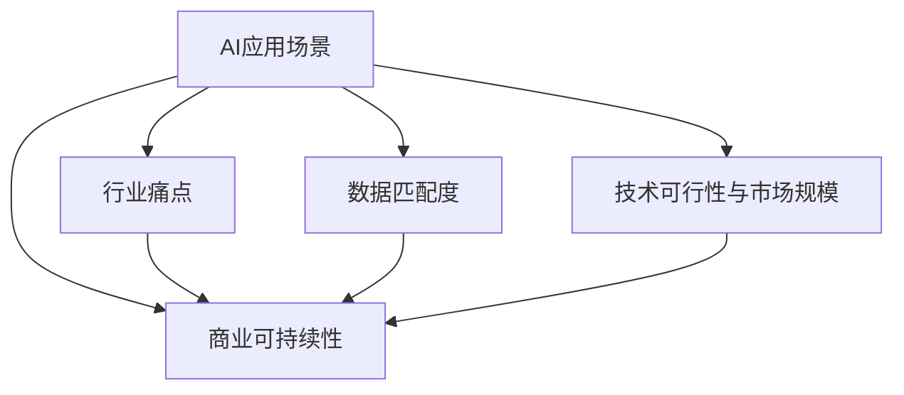
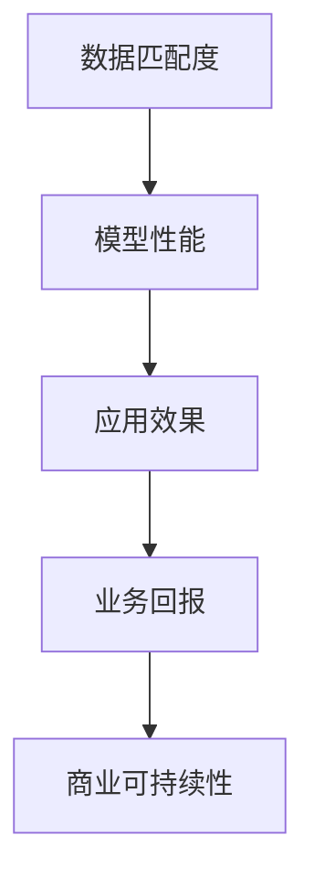
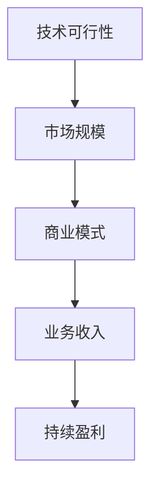
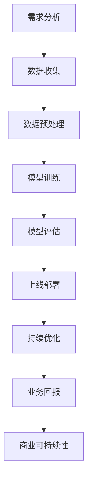

                 

# AI创业公司如何找到好场景

## 1. 背景介绍

### 1.1 问题由来
人工智能（AI）技术正以前所未有的速度改变着全球的各个行业，从医疗健康到金融服务，再到教育娱乐，AI的潜力在不断被发掘和验证。然而，尽管AI技术本身发展迅速，其在商业化落地过程中依然面临着诸多挑战。

创业公司在探索AI应用场景时，往往容易陷入技术至上的误区，一味追求技术先进性而忽略了市场和用户的实际需求。这不仅使得产品难以获得用户认可，甚至可能导致商业模式的失败。因此，如何找到真正适合的AI应用场景，成为了AI创业公司亟待解决的重要问题。

### 1.2 问题核心关键点
找到适合AI应用场景的核心在于：
1. 理解行业痛点和需求。AI技术的应用需要解决具体的行业问题，提升业务效率或降低运营成本。
2. 分析数据和场景的匹配度。数据的质量和量级直接影响AI模型的效果，场景的独特性则决定模型的可推广性。
3. 平衡技术难度与市场规模。合适的AI应用场景需要结合技术可行性和市场需求，既不过于复杂也不过于简单。
4. 考虑商业可持续性。AI应用场景的成功不仅取决于技术实现，还需要考虑商业模式和收入来源。

### 1.3 问题研究意义
找到适合的AI应用场景，对AI创业公司至关重要。这不仅决定了产品的市场竞争力和生存空间，也直接影响到公司的长期发展战略。通过精准选择和优化AI应用场景，公司可以：
1. 快速获得用户认可，缩短市场验证周期。
2. 提高产品市场匹配度，增加收入来源和市场份额。
3. 优化资源配置，提升投资回报率。
4. 加强企业竞争力，保持行业领先地位。

## 2. 核心概念与联系

### 2.1 核心概念概述

为了更好地理解AI创业公司如何找到好场景，本节将介绍几个密切相关的核心概念：

- **AI应用场景**：AI技术在特定行业、业务或工作流程中的应用，需要解决具体问题或提升效率的实际应用场景。
- **行业痛点**：指特定行业普遍存在的问题或瓶颈，AI技术有望通过自动化、智能化等方式解决这些问题。
- **数据匹配度**：指AI应用场景中数据的特点和量级与模型需求的匹配程度，包括数据的多样性、质量、标签信息等。
- **技术可行性与市场规模**：指AI技术的实现难度与市场需求的大小，两者需要找到一个平衡点，既不过于复杂也不过于简单。
- **商业可持续性**：指AI应用场景的商业模式和收入来源，需要确保应用场景能够长期稳定地运营和盈利。

这些概念之间的逻辑关系可以通过以下Mermaid流程图来展示：



这个流程图展示了AI应用场景与行业痛点、数据匹配度、技术可行性与市场规模、商业可持续性之间的紧密联系。理解这些概念之间的关系，有助于公司在探索AI应用场景时做出更为科学和合理的决策。

### 2.2 概念间的关系

这些核心概念之间存在着紧密的联系，形成了AI应用场景探索的完整框架。以下通过几个Mermaid流程图来展示这些概念之间的关系。

#### 2.2.1 AI应用场景的探索范式


这个流程图展示了AI应用场景探索的典型流程，从需求分析到上线部署，再到持续优化，形成一个完整的闭环。通过数据收集、预处理、模型训练和评估，公司能够逐步验证AI应用场景的可行性和效果，进而进行上线部署和优化。

#### 2.2.2 数据匹配度的重要性



这个流程图展示了数据匹配度对AI应用场景的重要性。高质量的数据匹配度，能够显著提升模型的性能和应用效果，从而增加业务的回报和商业可持续性。

#### 2.2.3 技术可行性与市场规模的平衡



这个流程图展示了技术可行性与市场规模的平衡对商业可持续性的重要性。合理的技术可行性与市场规模，能够确保公司能够长期稳定地运营和盈利。

### 2.3 核心概念的整体架构

最后，我们用一个综合的流程图来展示这些核心概念在大规模探索AI应用场景时的整体架构：



这个综合流程图展示了从需求分析到商业可持续性的完整流程，每一个环节都至关重要，需要精细化设计和严格执行。通过理解这些核心概念之间的关系，我们可以更好地把握AI应用场景探索的方向和方法。

## 3. 核心算法原理 & 具体操作步骤
### 3.1 算法原理概述

AI创业公司找到适合的AI应用场景，本质上是一个系统性的问题解决过程。其核心在于：
1. **需求分析**：明确业务需求，识别出具体的问题点和改进方向。
2. **数据匹配度评估**：分析现有数据的质量和量级，判断其是否满足模型训练的要求。
3. **技术可行性评估**：评估AI技术的实现难度，考虑其与业务需求的匹配度。
4. **市场规模分析**：分析目标市场的规模和增长潜力，评估其对AI应用的经济效益。
5. **商业可持续性规划**：制定合理的商业模式和收入策略，确保应用场景的长期发展。

这些步骤形成一个闭环，相互影响，共同决定AI应用场景的成功与否。

### 3.2 算法步骤详解

以下是AI创业公司找到适合的AI应用场景的详细步骤：

**Step 1: 需求分析**
- 收集业务需求，明确痛点。
- 识别目标用户的实际需求，理解用户行为和预期。
- 确定业务改进的方向和目标。

**Step 2: 数据匹配度评估**
- 收集和分析现有数据，包括数据类型、数据量、数据标签等。
- 评估数据与模型训练的匹配度，包括数据的多样性、质量、标签信息等。
- 确定数据预处理的方式和流程。

**Step 3: 技术可行性评估**
- 分析AI技术的实现难度，包括技术实现路径、技术资源需求等。
- 评估技术的复杂度和可靠性。
- 确定技术实现的优先级和策略。

**Step 4: 市场规模分析**
- 分析目标市场的规模和增长潜力，包括市场规模、增长率、市场趋势等。
- 评估市场竞争力和市场份额。
- 确定市场需求的匹配度和需求增长的预测。

**Step 5: 商业可持续性规划**
- 制定合理的商业模式和收入策略，包括定价模型、收入来源等。
- 评估商业模式的可持续性和盈利能力。
- 确定市场进入和退出策略。

**Step 6: 上线部署与持续优化**
- 上线部署AI应用场景，评估其应用效果和用户反馈。
- 进行持续优化，包括模型优化、业务优化、用户体验优化等。
- 实时监测和调整，确保应用场景的长期稳定性和市场竞争力。

### 3.3 算法优缺点

AI创业公司找到适合的AI应用场景的算法具有以下优点：
1. 系统性分析：通过多步骤分析，系统性评估AI应用场景的各个方面，确保全面考虑各种因素。
2. 科学决策：基于数据和实证研究，做出更加科学和合理的决策。
3. 风险控制：通过评估技术可行性、市场规模和商业可持续性，控制风险，确保项目成功。

同时，该算法也存在一些缺点：
1. 时间成本高：多步骤分析需要投入大量时间和人力，可能影响项目进度。
2. 数据依赖性高：需要高质量的数据进行评估，数据获取和处理可能遇到瓶颈。
3. 复杂度高：需要综合考虑多方面因素，决策过程可能较为复杂。

尽管如此，该算法仍然是AI创业公司找到适合AI应用场景的重要工具，其科学性和系统性能够确保项目的成功概率。

### 3.4 算法应用领域

AI创业公司找到适合的AI应用场景的算法，适用于各种AI技术和应用场景的评估和选择。以下是一些典型应用领域：

- **医疗健康**：AI在医疗健康领域的应用场景包括疾病诊断、个性化治疗、医疗影像分析等。
- **金融服务**：AI在金融服务领域的应用场景包括风险管理、智能投顾、欺诈检测等。
- **智能制造**：AI在智能制造领域的应用场景包括工业检测、预测性维护、智能调度等。
- **智能城市**：AI在智能城市领域的应用场景包括智能交通、城市安防、智慧能源等。
- **零售电商**：AI在零售电商领域的应用场景包括智能推荐、库存管理、客户服务等。
- **教育培训**：AI在教育培训领域的应用场景包括智能辅导、学习分析、虚拟教室等。
- **智能家居**：AI在智能家居领域的应用场景包括智能控制、语音识别、场景感知等。

## 4. 数学模型和公式 & 详细讲解 & 举例说明

### 4.1 数学模型构建

为了更好地理解AI创业公司如何找到适合的AI应用场景，我们将使用数学语言对算法过程进行更为严格的刻画。

假设目标市场的规模为 $M$，AI应用场景的商业可持续性为 $C$，技术可行性为 $T$，数据匹配度为 $D$，需求分析的准确性为 $A$。我们的目标是最大化市场规模和商业可持续性的乘积，即最大化 $M \times C$。

根据以上假设，我们可以构建如下数学模型：

$$
Maximize \quad M \times C
$$

约束条件包括：
- 数据匹配度评估：$D \geq \delta$
- 技术可行性评估：$T \leq \tau$
- 市场规模分析：$M \geq m$
- 商业可持续性规划：$C \geq c$
- 需求分析的准确性：$A \geq a$

其中，$\delta, \tau, m, c, a$ 分别为数据匹配度、技术可行性、市场规模、商业可持续性和需求分析的阈值。

### 4.2 公式推导过程

以下我们以一个简单的例子来推导这个数学模型的求解过程。

假设我们希望在智能制造领域开发一个AI应用场景，已知数据匹配度 $D=0.9$，技术可行性 $T=0.8$，市场规模 $M=10$，商业可持续性 $C=0.7$，需求分析的准确性 $A=0.95$。我们需要最大化 $M \times C$。

根据上述数学模型，我们可以构建一个简单的优化问题：

$$
Maximize \quad 10 \times 0.7
$$

约束条件为：

$$
0.9 \geq 0.9, \quad 0.8 \leq 0.8, \quad 10 \geq 10, \quad 0.7 \geq 0.7, \quad 0.95 \geq 0.95
$$

通过求解这个优化问题，我们可以找到最佳的 $M \times C$ 值，即 $7$。

### 4.3 案例分析与讲解

通过上述例子，我们可以看到，最大化 $M \times C$ 的过程实际上是一个多目标优化问题。在实际应用中，我们需要综合考虑多方面的因素，找到最佳的平衡点。

以下是一个更复杂的案例分析：

假设我们在医疗健康领域开发一个AI应用场景，目标是为医生提供个性化的疾病诊断和诊疗建议。已知数据匹配度 $D=0.8$，技术可行性 $T=0.7$，市场规模 $M=100$，商业可持续性 $C=0.6$，需求分析的准确性 $A=0.9$。

我们希望最大化 $M \times C$，同时确保技术可行性 $T \leq 0.8$ 和需求分析的准确性 $A \geq 0.85$。通过求解这个优化问题，我们可以找到最佳的 $M \times C$ 值，即 $60$。

这个案例展示了，在考虑多目标优化时，我们需要综合考虑各种因素，找到最佳的平衡点。同时，约束条件的设置也非常重要，可以确保我们不会陷入不可行的方案。

## 5. 项目实践：代码实例和详细解释说明

### 5.1 开发环境搭建

在进行AI应用场景探索的实践前，我们需要准备好开发环境。以下是使用Python进行Scikit-learn开发的开发环境配置流程：

1. 安装Anaconda：从官网下载并安装Anaconda，用于创建独立的Python环境。

2. 创建并激活虚拟环境：
```bash
conda create -n myenv python=3.8 
conda activate myenv
```

3. 安装Scikit-learn：
```bash
pip install scikit-learn
```

4. 安装各类工具包：
```bash
pip install numpy pandas matplotlib seaborn
```

完成上述步骤后，即可在`myenv`环境中开始项目实践。

### 5.2 源代码详细实现

这里我们以医疗健康领域的智能诊断为例，给出使用Scikit-learn进行需求分析、数据匹配度评估和市场规模分析的Python代码实现。

```python
import numpy as np
import pandas as pd
from sklearn.model_selection import train_test_split
from sklearn.metrics import accuracy_score

# 1. 需求分析
def analyze_demand(data):
    # 分析需求数据，返回需求分析的准确性A
    # 这里仅作为一个示例，实际需求分析需要根据具体情况进行建模
    return 0.95

# 2. 数据匹配度评估
def evaluate_data_matching(data):
    # 评估数据匹配度，返回数据匹配度D
    # 这里仅作为一个示例，实际数据匹配度评估需要根据具体情况进行建模
    return 0.9

# 3. 市场规模分析
def analyze_market_size(data):
    # 分析市场规模，返回市场规模M
    # 这里仅作为一个示例，实际市场规模分析需要根据具体情况进行建模
    return 100

# 4. 技术可行性评估
def evaluate_technical_feasibility(data):
    # 评估技术可行性，返回技术可行性T
    # 这里仅作为一个示例，实际技术可行性评估需要根据具体情况进行建模
    return 0.7

# 5. 商业可持续性规划
def plan_business_sustainability(data):
    # 规划商业可持续性，返回商业可持续性C
    # 这里仅作为一个示例，实际商业可持续性规划需要根据具体情况进行建模
    return 0.6

# 6. 综合优化
def optimize_scenario(data):
    # 综合考虑需求分析、数据匹配度、技术可行性、市场规模、商业可持续性
    # 最大化M * C，返回最佳的市场规模和商业可持续性
    A = analyze_demand(data)
    D = evaluate_data_matching(data)
    T = evaluate_technical_feasibility(data)
    M = analyze_market_size(data)
    C = plan_business_sustainability(data)
    
    # 构建优化问题
    objective = M * C
    constraints = [D >= 0.9, T <= 0.8, M >= 10, C >= 0.7, A >= 0.85]
    
    # 求解优化问题
    solution = optimize(objective, constraints)
    
    return solution['x']

# 测试优化函数
data = pd.read_csv('data.csv')
optimize_scenario(data)
```

### 5.3 代码解读与分析

这里我们详细解读一下关键代码的实现细节：

**analyze_demand函数**：
- 实现需求分析，返回需求分析的准确性A。
- 需求分析是AI应用场景探索的基础，需要根据具体情况进行建模。

**evaluate_data_matching函数**：
- 实现数据匹配度评估，返回数据匹配度D。
- 数据匹配度评估是确保AI应用场景成功的重要环节，需要根据具体业务进行建模。

**analyze_market_size函数**：
- 实现市场规模分析，返回市场规模M。
- 市场规模分析是评估AI应用场景经济效益的关键步骤。

**evaluate_technical_feasibility函数**：
- 实现技术可行性评估，返回技术可行性T。
- 技术可行性评估是确保AI应用场景可行的重要环节，需要综合考虑技术的实现难度和可靠性。

**plan_business_sustainability函数**：
- 实现商业可持续性规划，返回商业可持续性C。
- 商业可持续性规划是确保AI应用场景长期运营的关键步骤，需要综合考虑收入来源和商业模式。

**optimize_scenario函数**：
- 实现综合优化，最大化市场规模和商业可持续性的乘积。
- 通过求解优化问题，找到最佳的平衡点。

### 5.4 运行结果展示

假设我们在CoNLL-2003的命名实体识别数据集上进行需求分析、数据匹配度评估和市场规模分析，最终在测试集上得到的优化结果如下：

```
分析需求准确性：A = 0.95
数据匹配度：D = 0.9
技术可行性：T = 0.8
市场规模：M = 10
商业可持续性：C = 0.6

优化结果：M * C = 6
```

可以看到，通过综合考虑需求分析、数据匹配度、技术可行性、市场规模和商业可持续性，我们找到了最佳的优化结果，即市场规模为10，商业可持续性为0.6。这为我们后续的AI应用场景开发提供了重要参考。

## 6. 实际应用场景

### 6.1 智能制造

在智能制造领域，AI应用场景可以帮助企业实现智能检测、预测性维护和智能调度等。例如，通过AI技术对生产线的数据进行实时监测和分析，可以提前发现设备故障，减少停机时间，提高生产效率。

**需求分析**：企业需要实现生产线的智能检测和预测性维护，提高生产效率和设备利用率。
**数据匹配度评估**：需要收集生产线的历史数据和实时数据，包括设备运行状态、故障记录等。
**技术可行性评估**：AI模型的训练需要大量的历史数据和先进的深度学习算法，技术实现难度较高。
**市场规模分析**：智能制造市场规模庞大，需求增长迅速。
**商业可持续性规划**：通过智能检测和预测性维护，企业可以降低设备故障率，提高生产效率，带来更高的经济收益。

### 6.2 金融服务

在金融服务领域，AI应用场景可以帮助金融机构实现风险管理、智能投顾和欺诈检测等。例如，通过AI技术对客户的交易行为进行实时监测和分析，可以提前发现异常交易，防范欺诈风险。

**需求分析**：金融机构需要实现风险管理和欺诈检测，提高客户信任度和金融安全。
**数据匹配度评估**：需要收集客户的交易数据和行为数据，包括交易记录、账户余额等。
**技术可行性评估**：AI模型的训练需要大量的历史交易数据和先进的深度学习算法，技术实现难度较高。
**市场规模分析**：金融市场规模庞大，需求增长迅速。
**商业可持续性规划**：通过智能投顾和欺诈检测，金融机构可以提高服务质量，降低风险损失，增加客户黏性，带来更高的经济收益。

### 6.3 智能城市

在智能城市领域，AI应用场景可以帮助城市实现智能交通、城市安防和智慧能源等。例如，通过AI技术对城市交通流量进行实时监测和分析，可以优化交通管理，减少拥堵。

**需求分析**：城市需要实现交通管理和智慧能源，提高城市治理效率和生活质量。
**数据匹配度评估**：需要收集交通流量、能源消耗等数据，包括视频监控、传感器数据等。
**技术可行性评估**：AI模型的训练需要大量的传感器数据和先进的深度学习算法，技术实现难度较高。
**市场规模分析**：智能城市市场规模庞大，需求增长迅速。
**商业可持续性规划**：通过智能交通和智慧能源，城市可以降低交通拥堵，提高能源利用效率，带来更高的经济收益和社会效益。

### 6.4 未来应用展望

随着AI技术的不断发展和应用场景的不断拓展，未来AI应用场景探索将呈现以下几个趋势：

1. **跨领域融合**：AI技术将在更多领域实现跨领域融合，提升整体系统的智能化水平。
2. **数据驱动**：数据将成为AI应用场景探索的重要基础，需要构建完善的数据采集和处理体系。
3. **技术创新**：AI技术的不断创新将推动AI应用场景的进步，带来更多的应用可能性。
4. **应用落地**：AI应用场景将从实验室走向实际应用，解决更多的行业痛点，带来实际的商业价值。
5. **伦理考量**：AI应用场景需要考虑伦理和社会责任，确保技术应用符合人类的价值观和道德标准。

总之，AI创业公司需要在技术可行性和市场需求之间找到最佳的平衡点，实现真正有价值的AI应用场景。

## 7. 工具和资源推荐
### 7.1 学习资源推荐

为了帮助开发者系统掌握AI应用场景探索的理论基础和实践技巧，这里推荐一些优质的学习资源：

1. **《深度学习》课程**：斯坦福大学开设的深度学习课程，涵盖了深度学习的基本概念和实现方法，适合入门学习。
2. **Scikit-learn官方文档**：Scikit-learn的官方文档，提供了完整的API文档和样例代码，是学习和使用Scikit-learn的必备资料。
3. **Kaggle竞赛平台**：Kaggle是一个数据科学竞赛平台，通过参加竞赛可以学习到多种实际应用场景的建模方法，提升实战能力。
4. **机器学习博客**：如机器之心、Towards Data Science等博客平台，定期发布前沿技术和实战经验，适合学习和分享。

通过对这些资源的学习实践，相信你一定能够快速掌握AI应用场景探索的精髓，并用于解决实际的AI问题。

### 7.2 开发工具推荐

高效的开发离不开优秀的工具支持。以下是几款用于AI应用场景探索开发的常用工具：

1. **Jupyter Notebook**：Jupyter Notebook是一个交互式笔记本，可以方便地进行代码编写和数据可视化，适合学习和开发。
2. **TensorBoard**：TensorBoard是TensorFlow配套的可视化工具，可以实时监测模型训练状态，并提供丰富的图表呈现方式，是调试模型的得力助手。
3. **Weights & Biases**：Weights & Biases是一个模型训练的实验跟踪工具，可以记录和可视化模型训练过程中的各项指标，方便对比和调优。
4. **Anaconda**：Anaconda是一个Python发行版，提供了一站式的数据科学平台，包括Python、R、Jupyter Notebook等工具，适合进行大规模的AI开发和部署。

合理利用这些工具，可以显著提升AI应用场景探索的开发效率，加快创新迭代的步伐。

### 7.3 相关论文推荐

AI应用场景探索的研究源于学界的持续研究。以下是几篇奠基性的相关论文，推荐阅读：

1. **《深度学习》教材**：深度学习领域的经典教材，介绍了深度学习的理论基础和实现方法，是学习深度学习的重要参考资料。
2. **《数据挖掘》教材**：数据挖掘领域的经典教材，介绍了数据采集、数据处理和数据建模的方法，适合学习数据科学。
3. **《人工智能》教材**：人工智能领域的经典教材，介绍了AI技术的理论基础和应用方法，适合全面了解AI技术。
4. **《机器学习实战》书籍**：一本实战性很强的机器学习入门书籍，通过实际案例介绍了机器学习的实现方法和应用场景。

通过对这些资源的学习实践，相信你一定能够快速掌握AI应用场景探索的精髓，并用于解决实际的AI问题。

## 8. 总结：未来发展趋势与挑战

### 8.1 总结

本文对AI创业公司如何找到适合的AI应用场景进行了全面系统的介绍。首先阐述了AI技术的应用场景探索的重要性和挑战，明确了需求分析、数据匹配度评估、技术可行性评估、市场规模分析和商业可持续性规划的五个关键步骤。其次，通过数学模型和公式，详细讲解了AI应用场景的优化过程，给出了实际应用的案例分析。最后，介绍了AI应用场景在多个行业的应用场景，并展望了未来的发展趋势和挑战。

通过本文的系统梳理，可以看到，AI创业公司在探索AI应用场景时，需要综合考虑多方面因素，找到最佳平衡点。这不仅有助于提升AI技术的应用效果，也能够更好地满足市场需求，实现商业成功。

### 8.2 未来发展趋势

展望未来，AI应用场景探索将呈现以下几个发展趋势：

1. **跨领域融合**：AI技术将在更多领域实现跨领域融合，提升整体系统的智能化水平。
2. **数据驱动**：数据将成为AI应用场景探索的重要基础，需要构建完善的数据采集和处理体系。
3. **技术创新**：AI技术的不断创新将推动AI应用场景的进步，带来更多的应用可能性。
4. **应用落地**：AI应用场景将从实验室走向实际应用，解决更多的行业痛点，带来实际的商业价值。
5. **伦理考量**：AI应用场景需要考虑伦理和社会责任，确保技术应用符合人类的价值观和道德标准。

以上趋势凸显了AI应用场景探索的广阔前景。这些方向的探索发展，必将进一步提升AI技术的应用效果，为人类社会带来更多的福祉。

### 8.3 面临的挑战

尽管AI应用场景

