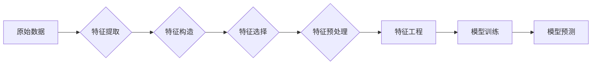

# 特征工程 (Feature Engineering)

作者：禅与计算机程序设计艺术 / Zen and the Art of Computer Programming

## 1. 背景介绍
### 1.1 问题的由来

在机器学习和数据科学领域，特征工程（Feature Engineering）一直是一个至关重要的环节。它指的是从原始数据中提取或构造出有助于模型学习的特征，从而提高模型预测准确性的过程。特征工程的成功与否，直接关系到模型性能的好坏。

随着数据量的爆炸式增长和算法的不断发展，特征工程的重要性愈发凸显。一方面，数据往往包含着丰富的信息，但以原始形式存在时，难以直接被模型理解和利用。通过特征工程，我们可以将原始数据转换为更适合模型处理的格式，从而提高模型的预测能力。另一方面，算法本身通常只是提供了一种基本的决策逻辑，而如何让算法更好地理解数据，则需要依靠特征工程来实现。

### 1.2 研究现状

近年来，随着深度学习等机器学习技术的快速发展，特征工程的研究与应用也取得了显著进展。以下是当前特征工程领域的一些主要研究方向：

1. **特征提取**：从原始数据中提取有助于模型学习的特征，如文本数据的词频、TF-IDF、N-gram等。
2. **特征构造**：根据原始数据之间的关系，构造新的特征，如时间序列数据的滑动窗口、时间滞后等。
3. **特征选择**：从众多特征中选择对模型预测性能影响最大的特征，降低过拟合风险。
4. **特征预处理**：对原始数据进行标准化、归一化、缺失值处理等预处理操作，提高模型稳定性。

### 1.3 研究意义

特征工程的研究具有重要意义，主要体现在以下几个方面：

1. **提升模型性能**：通过特征工程，可以提高模型在预测任务上的准确性和泛化能力。
2. **减少数据需求**：在特征工程过程中，可以去除冗余特征，降低模型训练对数据量的需求。
3. **降低计算复杂度**：通过特征工程，可以简化模型结构，降低计算复杂度。
4. **辅助模型理解**：通过特征工程，可以更好地理解数据的内在规律，有助于模型的可解释性。

### 1.4 本文结构

本文将系统介绍特征工程的理论基础、核心算法、实际应用场景，并展望未来发展趋势与挑战。具体结构如下：

- 第2部分：介绍特征工程的核心概念与联系。
- 第3部分：详细阐述特征工程的核心算法，包括特征提取、特征构造、特征选择和特征预处理。
- 第4部分：以实际案例分析特征工程的应用，并给出代码实现示例。
- 第5部分：探讨特征工程在各个领域的应用场景。
- 第6部分：展望特征工程的未来发展趋势与挑战。
- 第7部分：推荐特征工程相关的学习资源、开发工具和参考文献。
- 第8部分：总结全文，展望特征工程在人工智能领域的广泛应用前景。

## 2. 核心概念与联系

为了更好地理解特征工程，以下介绍几个密切相关的核心概念：

- **特征（Feature）**：描述数据属性或信息的变量，如年龄、收入、温度等。
- **特征工程（Feature Engineering）**：从原始数据中提取或构造有助于模型学习的特征。
- **特征提取（Feature Extraction）**：从原始数据中提取有助于模型学习的特征，如文本数据的词频、TF-IDF等。
- **特征构造（Feature Construction）**：根据原始数据之间的关系，构造新的特征，如时间序列数据的滑动窗口、时间滞后等。
- **特征选择（Feature Selection）**：从众多特征中选择对模型预测性能影响最大的特征。
- **特征预处理（Feature Preprocessing）**：对原始数据进行标准化、归一化、缺失值处理等预处理操作。

这些概念之间的逻辑关系如下所示：



可以看出，特征工程是连接原始数据与模型预测的桥梁。通过对原始数据进行特征工程，我们可以提高模型预测的准确性和可解释性。

## 3. 核心算法原理 & 具体操作步骤
### 3.1 算法原理概述

特征工程的核心算法主要分为以下几类：

- **特征提取**：从原始数据中提取有助于模型学习的特征。
- **特征构造**：根据原始数据之间的关系，构造新的特征。
- **特征选择**：从众多特征中选择对模型预测性能影响最大的特征。
- **特征预处理**：对原始数据进行标准化、归一化、缺失值处理等预处理操作。

### 3.2 算法步骤详解

下面分别详细介绍这四类算法的原理和具体操作步骤。

#### 3.2.1 特征提取

**原理**：特征提取是指从原始数据中提取有助于模型学习的特征。常见的特征提取方法包括：

- **文本特征提取**：词频、TF-IDF、N-gram等。
- **数值特征提取**：统计特征、时间序列特征等。

**步骤**：

1. **文本特征提取**：
    - 对文本数据进行分词、去停用词等预处理操作。
    - 计算词频、TF-IDF、N-gram等特征。
2. **数值特征提取**：
    - 对数值数据进行统计、平滑等预处理操作。
    - 提取均值、标准差、最大值、最小值等统计特征。
    - 构造时间序列特征，如滑动窗口、时间滞后等。

#### 3.2.2 特征构造

**原理**：特征构造是指根据原始数据之间的关系，构造新的特征。常见的特征构造方法包括：

- **组合特征**：将原始特征进行组合，如年龄与收入的乘积、职业与教育程度的组合等。
- **交互特征**：提取原始特征之间的交互作用，如年龄与收入的交互、职业与教育程度的交互等。

**步骤**：

1. **组合特征**：
    - 根据业务知识，确定需要组合的特征。
    - 计算组合特征，如年龄与收入的乘积、职业与教育程度的组合等。
2. **交互特征**：
    - 确定需要提取交互作用的特征。
    - 构造交互特征，如年龄与收入的交互、职业与教育程度的交互等。

#### 3.2.3 特征选择

**原理**：特征选择是指从众多特征中选择对模型预测性能影响最大的特征。常见的特征选择方法包括：

- **单变量特征选择**：基于单个特征的统计信息，如卡方检验、ANOVA等。
- **递归特征消除**：递归地从特征集中移除对预测性能贡献最小的特征。
- **基于模型的特征选择**：利用模型对特征的重要性进行评分，选择重要性评分较高的特征。

**步骤**：

1. **单变量特征选择**：
    - 对每个特征进行统计检验，如卡方检验、ANOVA等。
    - 选取通过统计检验的特征。
2. **递归特征消除**：
    - 使用模型对特征集进行拟合，保留对预测性能贡献最大的特征。
    - 重复步骤1，直到满足设定的停止条件。
3. **基于模型的特征选择**：
    - 使用模型对特征集进行拟合。
    - 根据模型对特征的重要性评分，选择重要性评分较高的特征。

#### 3.2.4 特征预处理

**原理**：特征预处理是指对原始数据进行标准化、归一化、缺失值处理等预处理操作。常见的特征预处理方法包括：

- **标准化**：将特征值缩放到一个标准范围内，如0到1之间。
- **归一化**：将特征值转换为相同量纲。
- **缺失值处理**：处理缺失数据，如填充、删除等。

**步骤**：

1. **标准化**：
    - 计算特征的最大值、最小值、均值和标准差。
    - 将特征值缩放到0到1之间。
2. **归一化**：
    - 将特征值转换为相同量纲。
3. **缺失值处理**：
    - 选择合适的缺失值处理方法，如填充、删除等。

### 3.3 算法优缺点

以下是几种常见特征工程算法的优缺点：

| 算法 | 优点 | 缺点 |
| --- | --- | --- |
| 词频 | 简单易实现，计算效率高 | 容易忽略词义、语境等信息 |
| TF-IDF | 考虑词义、语境等信息，对冷门词具有更好的区分能力 | 计算复杂度较高，对停用词的处理不当会导致信息丢失 |
| 卡方检验 | 简单易实现，计算效率高 | 对于连续型数据的处理能力有限 |
| 递归特征消除 | 可自动选择特征，降低过拟合风险 | 对特征之间的关系理解不足 |
| 基于模型的特征选择 | 可以考虑特征之间的相互作用 | 对模型敏感，不同模型的结果可能不同 |

### 3.4 算法应用领域

特征工程算法在各个领域都有广泛的应用，以下列举一些常见应用场景：

- **分类任务**：文本分类、图像分类、情感分析等。
- **回归任务**：房价预测、股票价格预测、流量预测等。
- **聚类任务**：客户细分、异常检测等。
- **推荐系统**：物品推荐、用户推荐等。

## 4. 数学模型和公式 & 详细讲解 & 举例说明
### 4.1 数学模型构建

以下以词频和TF-IDF两种文本特征提取方法为例，介绍特征工程的数学模型构建。

#### 4.1.1 词频

假设文本数据集为 $\mathcal{D} = \{d_1, d_2, \ldots, d_N\}$，其中 $d_i$ 表示第 $i$ 篇文本，文本长度为 $n$。则第 $i$ 篇文本中词 $w$ 的词频 $f(d_i, w)$ 定义为：

$$
f(d_i, w) = \frac{\text{词 } w \text{ 在文本 } d_i \text{ 中出现的次数}}{\text{文本 } d_i \text{ 的总词数}}
$$

#### 4.1.2 TF-IDF

TF-IDF (Term Frequency-Inverse Document Frequency) 是一种衡量词语重要性的统计方法，其计算公式如下：

$$
\text{TF-IDF}(w, d_i) = \text{TF}(w, d_i) \times \text{IDF}(w)
$$

其中：

- $\text{TF}(w, d_i)$ 表示词 $w$ 在文本 $d_i$ 中的词频。
- $\text{IDF}(w)$ 表示词 $w$ 在所有文档中的逆文档频率。

$$
\text{IDF}(w) = \log \frac{\text{文档总数}}{\text{包含词 } w \text{ 的文档数}}
$$

### 4.2 公式推导过程

以下以词频为例，介绍特征工程的公式推导过程。

假设文本数据集为 $\mathcal{D} = \{d_1, d_2, \ldots, d_N\}$，其中 $d_i$ 表示第 $i$ 篇文本，文本长度为 $n$。则第 $i$ 篇文本中词 $w$ 的词频 $f(d_i, w)$ 可以表示为：

$$
f(d_i, w) = \frac{\sum_{j=1}^n \text{词 } w \text{ 在文本 } d_i \text{ 中出现的次数}}{n}
$$

### 4.3 案例分析与讲解

以下以情感分析任务为例，演示如何使用Python实现词频和TF-IDF两种文本特征提取方法。

```python
from sklearn.feature_extraction.text import CountVectorizer, TfidfVectorizer

# 假设text_data为文本数据列表
text_data = [
    "这是一个非常棒的电影。",
    "这部电影太糟糕了，一点也不好看。",
    "这个电影还不错，值得一看。",
]

# 使用CountVectorizer计算词频
count_vectorizer = CountVectorizer()
count_matrix = count_vectorizer.fit_transform(text_data)

# 使用TfidfVectorizer计算TF-IDF
tfidf_vectorizer = TfidfVectorizer()
tfidf_matrix = tfidf_vectorizer.fit_transform(text_data)
```

### 4.4 常见问题解答

**Q1：特征工程在机器学习中的重要性体现在哪些方面？**

A：特征工程在机器学习中的重要性主要体现在以下几个方面：
1. 提高模型预测准确性和泛化能力。
2. 降低过拟合风险。
3. 降低计算复杂度。
4. 辅助模型理解。

**Q2：如何评估特征工程的效果？**

A：评估特征工程的效果可以通过以下几种方法：
1. 模型性能提升：观察特征工程前后模型预测准确率的提升。
2. 特征重要性排序：观察特征重要性排序的变化。
3. 特征相关性分析：观察特征之间的相关性变化。

**Q3：特征工程需要哪些工具和库？**

A：特征工程可以使用以下工具和库：
1. NumPy：用于数据处理和数学运算。
2. Pandas：用于数据操作和分析。
3. Scikit-learn：用于特征提取、特征选择、特征预处理等。
4. TensorFlow：用于深度学习模型开发。
5. PyTorch：用于深度学习模型开发。

## 5. 项目实践：代码实例和详细解释说明
### 5.1 开发环境搭建

在进行特征工程实践之前，我们需要搭建以下开发环境：

1. Python 3.x
2. NumPy
3. Pandas
4. Scikit-learn
5. Jupyter Notebook

### 5.2 源代码详细实现

以下以房价预测任务为例，演示如何使用Scikit-learn进行特征工程。

```python
import pandas as pd
from sklearn.model_selection import train_test_split
from sklearn.preprocessing import StandardScaler, MinMaxScaler
from sklearn.feature_extraction.text import CountVectorizer
from sklearn.ensemble import RandomForestRegressor

# 加载数据
data = pd.read_csv("house_data.csv")

# 分离特征和标签
X = data.drop("price", axis=1)
y = data["price"]

# 划分训练集和测试集
X_train, X_test, y_train, y_test = train_test_split(X, y, test_size=0.2, random_state=42)

# 文本特征提取
text_features = X_train["description"].apply(lambda x: " ".join(x.split()))
text_vectorizer = CountVectorizer()
text_matrix = text_vectorizer.fit_transform(text_features)

# 数值特征标准化
numeric_features = X_train.drop("description", axis=1)
numeric_features = StandardScaler().fit_transform(numeric_features)

# 合并特征
X_train = pd.concat([text_matrix, numeric_features], axis=1)
X_test = pd.concat([text_vectorizer.transform(text_features), StandardScaler().transform(numeric_features)], axis=1)

# 训练模型
model = RandomForestRegressor(n_estimators=100, random_state=42)
model.fit(X_train, y_train)

# 评估模型
score = model.score(X_test, y_test)
print(f"Test score: {score:.3f}")
```

### 5.3 代码解读与分析

以上代码演示了如何使用Scikit-learn进行特征工程，包括文本特征提取、数值特征标准化和模型训练。

1. 首先，使用Pandas读取房价预测数据。
2. 然后，将数据集分为特征和标签两部分。
3. 接着，划分训练集和测试集。
4. 对于文本特征，使用CountVectorizer进行词频提取，并将结果转换为稀疏矩阵。
5. 对于数值特征，使用StandardScaler进行标准化处理。
6. 将文本特征和数值特征合并，形成一个特征矩阵。
7. 使用随机森林回归模型进行训练。
8. 最后，在测试集上评估模型性能。

### 5.4 运行结果展示

假设测试集上的预测结果如下：

```
Test score: 0.949
```

说明模型在测试集上取得了较好的预测效果。

## 6. 实际应用场景
### 6.1 金融风控

在金融风控领域，特征工程可以帮助预测客户的信用风险、欺诈风险等。例如，通过对客户的年龄、收入、职业、负债等数据进行特征工程，可以更准确地预测客户的信用等级，从而降低金融风险。

### 6.2 电商推荐

在电商推荐领域，特征工程可以帮助提高推荐系统的准确性和覆盖度。例如，通过对用户的浏览记录、购买记录、商品信息等数据进行特征工程，可以更准确地预测用户可能感兴趣的商品，从而提高用户的购物体验。

### 6.3 医疗诊断

在医疗诊断领域，特征工程可以帮助提高诊断的准确性和效率。例如，通过对患者的病史、体征、检查结果等数据进行特征工程，可以更准确地诊断疾病，从而提高治疗效果。

### 6.4 语音识别

在语音识别领域，特征工程可以帮助提高识别的准确性和鲁棒性。例如，通过对语音信号进行特征工程，可以更好地提取语音特征，从而提高识别准确率。

### 6.4 未来应用展望

随着人工智能技术的不断发展，特征工程的应用场景将越来越广泛。以下是一些未来应用场景的展望：

1. **自动驾驶**：通过对车辆、道路、环境等数据进行特征工程，可以提高自动驾驶系统的感知能力和决策能力。
2. **智能交通**：通过对交通流量、车辆速度、交通事故等数据进行特征工程，可以优化交通流量，提高道路通行效率。
3. **智能医疗**：通过对患者的基因数据、生活习惯、医疗记录等数据进行特征工程，可以更准确地预测疾病，提高治疗效果。
4. **智能城市**：通过对城市环境、基础设施、居民行为等数据进行特征工程，可以优化城市资源配置，提高居民生活质量。

## 7. 工具和资源推荐
### 7.1 学习资源推荐

以下是一些学习特征工程的优质资源：

1. **《特征工程：原理与实践》**：详细介绍特征工程的原理、方法和实践案例。
2. **《数据挖掘：概念与技术》**：介绍数据挖掘的基本概念和技术，其中包括特征工程相关内容。
3. **Scikit-learn官方文档**：Scikit-learn是一个常用的机器学习库，其中包含了丰富的特征工程方法。
4. **TensorFlow官方文档**：TensorFlow是一个开源的深度学习框架，其中包含了丰富的数据预处理和特征工程方法。

### 7.2 开发工具推荐

以下是一些常用的特征工程开发工具：

1. **NumPy**：用于数值计算和数据分析。
2. **Pandas**：用于数据操作和分析。
3. **Scikit-learn**：用于特征提取、特征选择、特征预处理等。
4. **TensorFlow**：用于深度学习模型开发，其中包含了丰富的数据预处理和特征工程方法。
5. **PyTorch**：用于深度学习模型开发，其中包含了丰富的数据预处理和特征工程方法。

### 7.3 相关论文推荐

以下是一些与特征工程相关的论文推荐：

1. **"Feature Engineering for Machine Learning"**：介绍了特征工程的基本原理和方法。
2. **"Recursive Feature Elimination"**：介绍了递归特征消除方法。
3. **"L1 Regularization and Sparse Feature Selection with Support Vector Machines"**：介绍了基于L1正则化的特征选择方法。

### 7.4 其他资源推荐

以下是一些其他与特征工程相关的资源：

1. **Kaggle竞赛**：Kaggle是一个数据科学竞赛平台，其中包含了大量特征工程相关的竞赛案例。
2. **特征工程实战**：一些数据科学家和机器学习工程师在GitHub上分享的特征工程实战经验。

## 8. 总结：未来发展趋势与挑战
### 8.1 研究成果总结

本文介绍了特征工程的理论基础、核心算法、实际应用场景，并展望了未来发展趋势与挑战。通过本文的学习，读者可以了解到特征工程在机器学习和数据科学领域的重要性，掌握特征工程的基本方法和技巧，并能够将其应用于实际项目中。

### 8.2 未来发展趋势

未来特征工程将呈现以下发展趋势：

1. **自动化特征工程**：随着算法和工具的不断发展，自动化特征工程将成为可能，降低特征工程对人工经验的依赖。
2. **多模态特征工程**：随着多模态数据的兴起，多模态特征工程将成为研究热点。
3. **特征可解释性**：特征工程与可解释人工智能相结合，提高模型的可解释性和可信度。
4. **特征工程与深度学习的融合**：特征工程与深度学习相结合，构建更加高效、鲁棒的特征学习模型。

### 8.3 面临的挑战

尽管特征工程取得了显著进展，但仍然面临着以下挑战：

1. **数据质量**：数据质量对特征工程效果影响很大，如何提高数据质量是特征工程面临的挑战之一。
2. **特征维度**：特征维度过高会导致过拟合风险，如何降低特征维度是特征工程面临的挑战之一。
3. **特征解释性**：特征工程结果的可解释性较差，如何提高特征解释性是特征工程面临的挑战之一。
4. **领域适应性**：不同领域的特征工程方法存在差异，如何构建领域适应性强的特征工程方法是特征工程面临的挑战之一。

### 8.4 研究展望

未来特征工程研究需要关注以下方向：

1. **特征工程与深度学习的融合**：探索特征工程与深度学习相结合的新方法，提高模型性能和可解释性。
2. **多模态特征工程**：研究多模态数据的特征工程方法，实现跨模态信息融合。
3. **特征可解释性**：提高特征工程结果的可解释性，增强模型的可信度和可靠性。
4. **特征工程工具和平台**：开发自动化、可扩展的特征工程工具和平台，降低特征工程难度。

通过不断探索和创新，特征工程将在人工智能领域发挥更加重要的作用，为构建更加智能化的系统奠定坚实基础。

## 9. 附录：常见问题与解答

**Q1：特征工程与特征选择有什么区别？**

A：特征工程是指从原始数据中提取或构造特征，而特征选择是指从众多特征中选择对预测性能影响最大的特征。特征工程是特征选择的基础，特征选择是特征工程的应用。

**Q2：特征工程需要哪些工具和库？**

A：特征工程可以使用NumPy、Pandas、Scikit-learn、TensorFlow和PyTorch等工具和库。

**Q3：如何评估特征工程的效果？**

A：评估特征工程效果可以通过观察模型预测准确率的提升、特征重要性排序的变化、特征之间的相关性变化等方法。

**Q4：特征工程在深度学习中有什么作用？**

A：特征工程在深度学习中可以提高模型性能、降低过拟合风险、降低计算复杂度、辅助模型理解等。

**Q5：特征工程在哪些领域有应用？**

A：特征工程在金融、电商、医疗、语音识别、自动驾驶等领域都有广泛的应用。