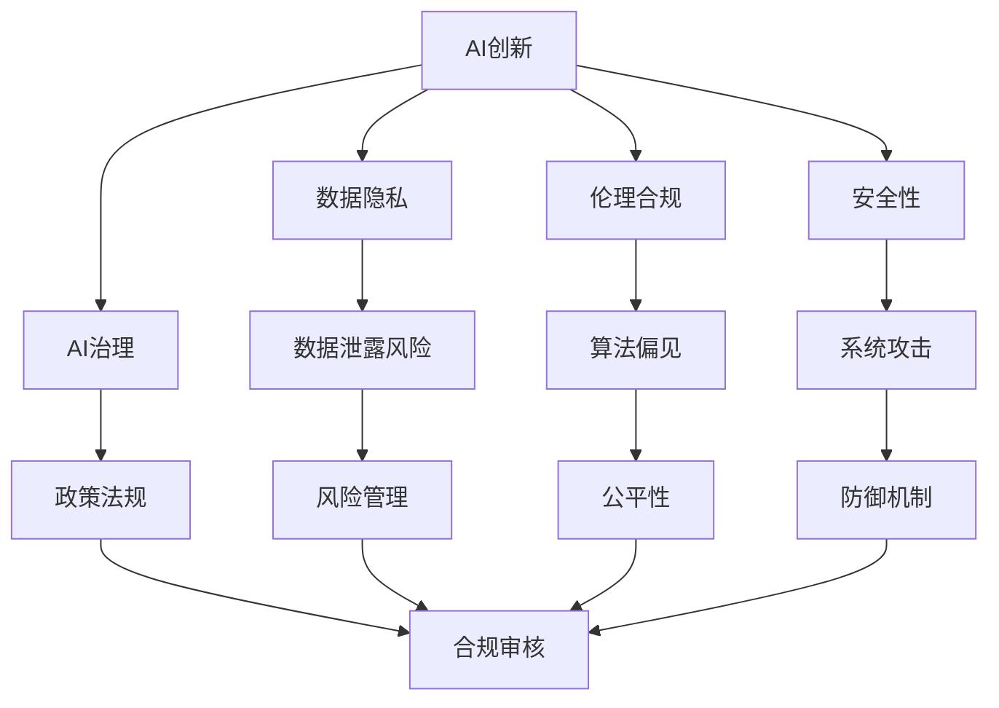
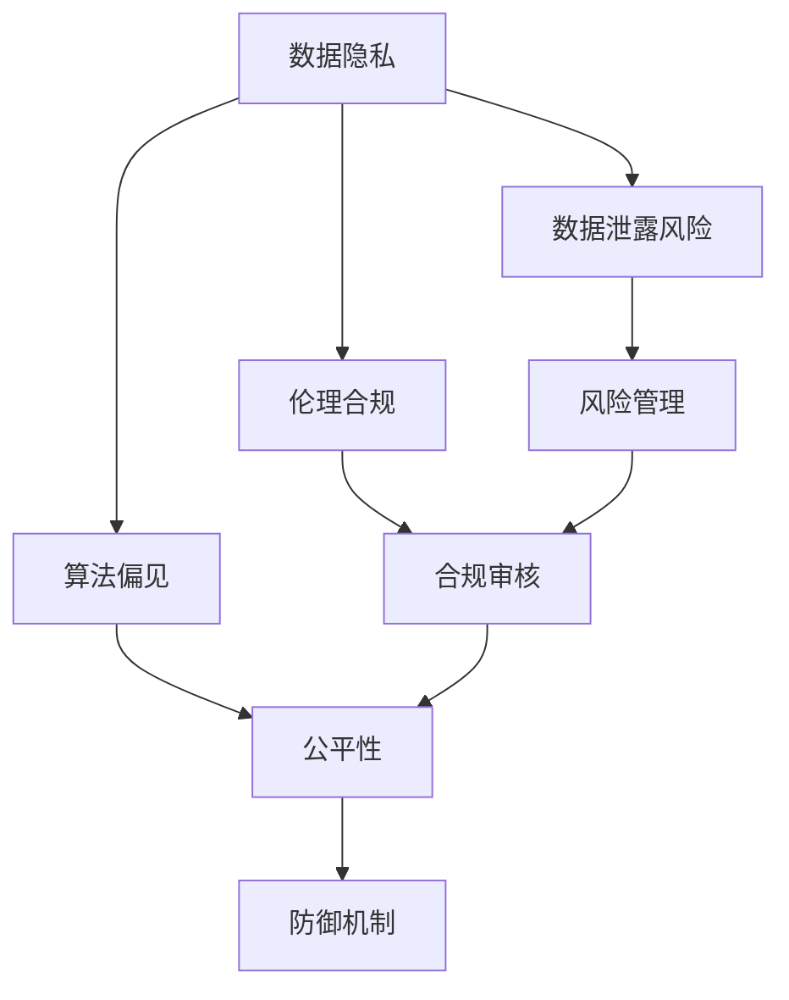
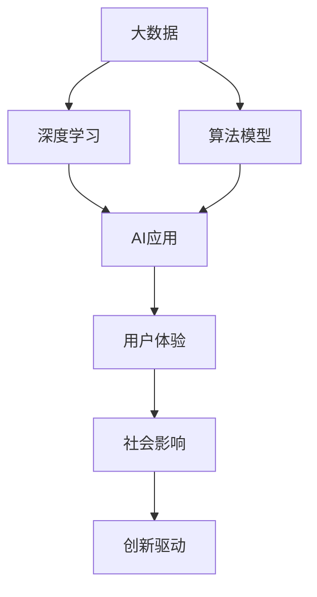
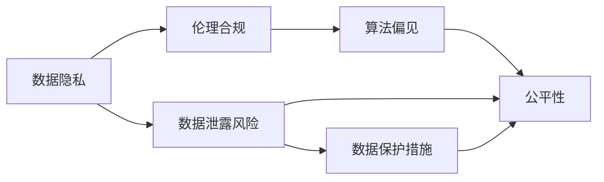
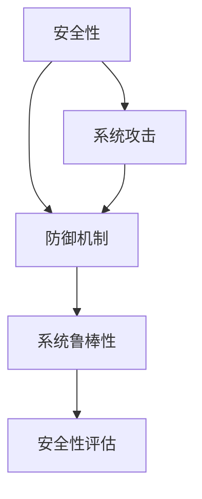
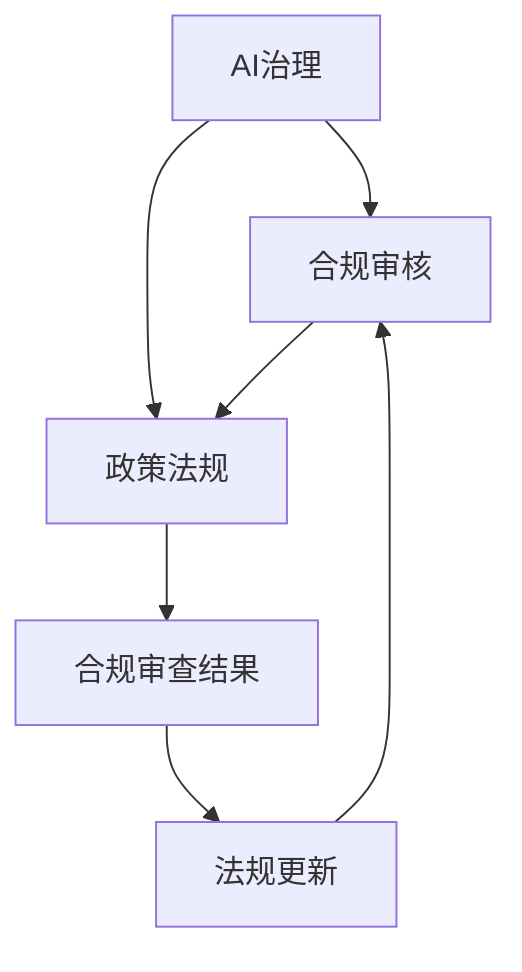

                 

# AI创新的高风险与成本

> 关键词：AI创新,高风险,成本,技术落地,数据隐私,伦理合规,人工智能伦理,人工智能治理

## 1. 背景介绍

在人工智能（AI）技术飞速发展的今天，科技创新带来的机遇与挑战并存。一方面，AI技术在医疗、金融、教育、制造等众多领域展现出巨大的潜力和价值，带来前所未有的效率提升和创新可能性；另一方面，由于AI技术的不确定性、复杂性和高风险性，其在应用过程中也面临着数据隐私、伦理合规、安全性等多方面的挑战。本文将深入探讨AI创新在落地过程中所面临的高风险与成本，提出相应的应对策略和未来方向。

### 1.1 问题由来

AI技术的快速发展离不开数据、算法、计算资源等各项资源的投入，但创新带来的高风险和高成本也常常让人望而却步。例如，在医疗领域，基于AI的诊断系统可能因数据偏差导致误诊，甚至危及患者生命安全；在金融领域，AI算法可能因预测错误引发金融风险；在教育领域，AI教师的决策可能因算法偏见而产生歧视性教育。这些问题不仅影响AI技术的可信度和实用性，还可能带来重大的社会和经济影响。

### 1.2 问题核心关键点

为了更好地理解AI创新过程中所面临的高风险与成本，本节将介绍几个密切相关的核心概念：

- AI创新：指通过大数据、深度学习等技术，开发新的智能系统和服务，推动产业升级和人类认知进步的过程。

- 数据隐私：指在AI应用过程中，如何保护个人和企业的数据不被不当使用或泄露，确保用户信息安全。

- 伦理合规：指在AI技术开发和应用中，如何遵守法律法规和伦理准则，避免算法偏见和歧视。

- 安全性：指在AI系统的设计、实现和部署过程中，如何保证系统的鲁棒性和稳定性，防止安全漏洞和攻击。

- AI治理：指在AI技术落地过程中，如何建立健全的法律、政策和道德框架，确保AI技术的健康发展和公平应用。

这些核心概念之间的逻辑关系可以通过以下Mermaid流程图来展示：



这个流程图展示了大语言模型的核心概念及其之间的关系：

1. AI创新是整个系统的出发点，包含数据隐私、伦理合规、安全性、AI治理等子系统。
2. 数据隐私是AI创新的重要组成部分，涉及数据安全、隐私保护等风险。
3. 伦理合规是AI创新的法律保障，涉及算法偏见、歧视等伦理问题。
4. 安全性是AI创新的核心保障，涉及系统攻击、防御机制等风险。
5. AI治理是AI创新的外部保障，涉及政策法规、合规审核等机制。

这些核心概念共同构成了AI创新的生态系统，确保其在落地过程中遵循法律法规和伦理准则，保护用户权益，确保系统安全。通过理解这些核心概念，我们可以更好地把握AI创新的本质和挑战。

## 2. 核心概念与联系

### 2.1 核心概念概述

为更好地理解AI创新的高风险与成本，本节将介绍几个密切相关的核心概念：

- 数据隐私（Data Privacy）：指在AI应用过程中，如何保护个人和企业的数据不被不当使用或泄露，确保用户信息安全。

- 伦理合规（Ethical Compliance）：指在AI技术开发和应用中，如何遵守法律法规和伦理准则，避免算法偏见和歧视。

- 安全性（Security）：指在AI系统的设计、实现和部署过程中，如何保证系统的鲁棒性和稳定性，防止安全漏洞和攻击。

- AI治理（AI Governance）：指在AI技术落地过程中，如何建立健全的法律、政策和道德框架，确保AI技术的健康发展和公平应用。

- 数据泄露风险（Data Leakage Risk）：指在AI应用过程中，由于数据保护不当，导致用户隐私泄露的风险。

- 算法偏见（Algorithmic Bias）：指在AI算法开发过程中，由于数据偏差、模型设计缺陷等原因，导致算法输出存在偏见和歧视的风险。

- 系统攻击（System Attack）：指在AI系统部署和运行过程中，由于系统漏洞、代码缺陷等原因，导致系统被攻击的风险。

- 防御机制（Defense Mechanism）：指在AI系统设计中，通过增强系统的鲁棒性、安全性，防范系统攻击的机制。

- 合规审核（Compliance Review）：指在AI系统开发和部署过程中，通过法规和政策审核，确保系统符合法律法规和伦理准则的机制。

这些核心概念之间的逻辑关系可以通过以下Mermaid流程图来展示：



这个流程图展示了大语言模型的核心概念及其之间的关系：

1. 数据隐私是AI创新的基础，涉及数据泄露风险。
2. 伦理合规是AI创新的法律保障，涉及算法偏见、公平性等伦理问题。
3. 安全性是AI创新的核心保障，涉及系统攻击、防御机制等风险。
4. AI治理是AI创新的外部保障，涉及合规审核、政策法规等机制。

这些核心概念共同构成了AI创新的生态系统，确保其在落地过程中遵循法律法规和伦理准则，保护用户权益，确保系统安全。通过理解这些核心概念，我们可以更好地把握AI创新的本质和挑战。

### 2.2 概念间的关系

这些核心概念之间存在着紧密的联系，形成了AI创新的完整生态系统。下面我通过几个Mermaid流程图来展示这些概念之间的关系。

#### 2.2.1 AI创新的架构



这个流程图展示了AI创新的基本架构，从数据采集、深度学习、模型训练到应用落地，再到用户体验和社会影响，最后驱动新的创新。

#### 2.2.2 数据隐私与伦理合规的关系



这个流程图展示了数据隐私与伦理合规的关系，数据隐私涉及数据泄露风险，伦理合规涉及算法偏见、公平性等伦理问题，两者相互关联。

#### 2.2.3 安全性与防御机制的关系



这个流程图展示了安全性与防御机制的关系，安全性涉及系统攻击风险，防御机制增强系统鲁棒性，两者相互依赖。

#### 2.2.4 AI治理与合规审核的关系



这个流程图展示了AI治理与合规审核的关系，AI治理涉及政策法规审核，合规审核确保系统符合法律法规，两者相辅相成。

## 3. 核心算法原理 & 具体操作步骤
### 3.1 算法原理概述

AI创新的高风险与成本主要源于数据隐私、伦理合规、安全性等多方面的不确定性和复杂性。基于监督学习的AI创新方法在实践中尤为显著，但其高风险和成本也不容忽视。

**数据隐私：** 在基于监督学习的AI应用中，数据隐私是最大的风险之一。数据泄露、数据滥用等问题可能导致用户隐私暴露，影响社会稳定。

**伦理合规：** 在AI算法开发过程中，由于数据偏差、模型设计缺陷等原因，可能导致算法输出存在偏见和歧视，引发伦理和法律问题。

**安全性：** 在AI系统部署和运行过程中，由于系统漏洞、代码缺陷等原因，可能导致系统被攻击，影响系统稳定性和安全性。

### 3.2 算法步骤详解

基于监督学习的AI创新主要包括以下几个关键步骤：

**Step 1: 数据收集与预处理**
- 收集相关的数据，如用户行为数据、医疗数据、金融数据等。
- 对数据进行清洗、标注、划分等预处理操作，确保数据质量。

**Step 2: 模型训练与优化**
- 选择合适的模型，如深度学习模型、决策树模型等，进行训练。
- 应用正则化技术、Dropout、Early Stopping等方法，避免过拟合。
- 使用交叉验证等方法，评估模型性能，进行参数调优。

**Step 3: 系统部署与监控**
- 将训练好的模型部署到生产环境，实现业务应用。
- 实时监控模型性能，及时发现异常情况，进行修复和优化。

**Step 4: 风险评估与管理**
- 评估数据隐私风险、伦理合规风险、安全性风险等。
- 制定相应的风险管理策略，如数据加密、隐私保护、合规审核等。

### 3.3 算法优缺点

基于监督学习的AI创新方法具有以下优点：

- 快速高效：模型训练和优化过程快速，能够快速生成应用结果。
- 精度高：在大量标注数据支持下，模型的精度和泛化能力较高。

同时，也存在以下缺点：

- 数据隐私问题：需要大量标注数据，涉及数据隐私和安全风险。
- 伦理合规问题：模型输出可能存在偏见和歧视，引发伦理和法律问题。
- 安全性问题：模型部署和运行可能面临攻击风险，影响系统安全。

### 3.4 算法应用领域

基于监督学习的AI创新方法在以下几个领域得到了广泛应用：

- 医疗领域：基于深度学习的医学影像分析、病理诊断等应用。
- 金融领域：基于深度学习的价格预测、风险评估等应用。
- 教育领域：基于深度学习的智能教育、智能评估等应用。
- 制造领域：基于深度学习的质量检测、故障诊断等应用。

这些应用不仅展示了AI技术的强大潜力，也凸显了其高风险与成本的特性。

## 4. 数学模型和公式 & 详细讲解  
### 4.1 数学模型构建

本节将使用数学语言对基于监督学习的AI创新过程进行更加严格的刻画。

记数据集为 $D=\{(x_i, y_i)\}_{i=1}^N$，其中 $x_i$ 为输入特征，$y_i$ 为标签。基于监督学习的AI模型为 $M_{\theta}$，其中 $\theta$ 为模型参数。

定义模型 $M_{\theta}$ 在数据集 $D$ 上的损失函数为 $\mathcal{L}(\theta) = \frac{1}{N} \sum_{i=1}^N \ell(M_{\theta}(x_i), y_i)$，其中 $\ell$ 为损失函数，如交叉熵损失、均方误差损失等。

微调的目标是最小化损失函数，即找到最优参数：$\theta^* = \mathop{\arg\min}_{\theta} \mathcal{L}(\theta)$。

### 4.2 公式推导过程

以下我们以二分类任务为例，推导交叉熵损失函数及其梯度的计算公式。

假设模型 $M_{\theta}$ 在输入 $x$ 上的输出为 $\hat{y}=M_{\theta}(x) \in [0,1]$，表示样本属于正类的概率。真实标签 $y \in \{0,1\}$。则二分类交叉熵损失函数定义为：

$$
\ell(M_{\theta}(x),y) = -[y\log \hat{y} + (1-y)\log (1-\hat{y})]
$$

将其代入经验风险公式，得：

$$
\mathcal{L}(\theta) = -\frac{1}{N}\sum_{i=1}^N [y_i\log M_{\theta}(x_i)+(1-y_i)\log(1-M_{\theta}(x_i))]
$$

根据链式法则，损失函数对参数 $\theta_k$ 的梯度为：

$$
\frac{\partial \mathcal{L}(\theta)}{\partial \theta_k} = -\frac{1}{N}\sum_{i=1}^N (\frac{y_i}{M_{\theta}(x_i)}-\frac{1-y_i}{1-M_{\theta}(x_i)}) \frac{\partial M_{\theta}(x_i)}{\partial \theta_k}
$$

其中 $\frac{\partial M_{\theta}(x_i)}{\partial \theta_k}$ 可进一步递归展开，利用自动微分技术完成计算。

在得到损失函数的梯度后，即可带入参数更新公式，完成模型的迭代优化。重复上述过程直至收敛，最终得到适应目标任务的最优模型参数 $\theta^*$。

## 5. 项目实践：代码实例和详细解释说明
### 5.1 开发环境搭建

在进行AI创新项目实践前，我们需要准备好开发环境。以下是使用Python进行TensorFlow开发的环境配置流程：

1. 安装Anaconda：从官网下载并安装Anaconda，用于创建独立的Python环境。

2. 创建并激活虚拟环境：
```bash
conda create -n tf-env python=3.8 
conda activate tf-env
```

3. 安装TensorFlow：根据CUDA版本，从官网获取对应的安装命令。例如：
```bash
conda install tensorflow -c tf -c conda-forge
```

4. 安装各类工具包：
```bash
pip install numpy pandas scikit-learn matplotlib tqdm jupyter notebook ipython
```

完成上述步骤后，即可在`tf-env`环境中开始AI创新实践。

### 5.2 源代码详细实现

下面我以基于监督学习的医疗影像分析为例，给出使用TensorFlow对深度学习模型进行微调的PyTorch代码实现。

首先，定义数据处理函数：

```python
import tensorflow as tf
from tensorflow.keras.preprocessing.image import ImageDataGenerator

# 数据增强
train_datagen = ImageDataGenerator(rescale=1./255,
                                  rotation_range=20,
                                  width_shift_range=0.2,
                                  height_shift_range=0.2,
                                  shear_range=0.2,
                                  zoom_range=0.2,
                                  horizontal_flip=True,
                                  fill_mode='nearest')

test_datagen = ImageDataGenerator(rescale=1./255)

# 数据加载
train_generator = train_datagen.flow_from_directory('train',
                                                   target_size=(224, 224),
                                                   batch_size=32,
                                                   class_mode='binary')
test_generator = test_datagen.flow_from_directory('test',
                                                target_size=(224, 224),
                                                batch_size=32,
                                                class_mode='binary')
```

然后，定义模型和优化器：

```python
from tensorflow.keras.models import Sequential
from tensorflow.keras.layers import Conv2D, MaxPooling2D, Flatten, Dense

# 定义模型
model = Sequential()
model.add(Conv2D(32, (3, 3), activation='relu', input_shape=(224, 224, 3)))
model.add(MaxPooling2D(pool_size=(2, 2)))
model.add(Conv2D(64, (3, 3), activation='relu'))
model.add(MaxPooling2D(pool_size=(2, 2)))
model.add(Conv2D(128, (3, 3), activation='relu'))
model.add(MaxPooling2D(pool_size=(2, 2)))
model.add(Flatten())
model.add(Dense(128, activation='relu'))
model.add(Dense(1, activation='sigmoid'))

# 优化器
optimizer = tf.keras.optimizers.Adam(lr=1e-4)
```

接着，定义训练和评估函数：

```python
def train_epoch(model, generator, batch_size, optimizer):
    model.compile(optimizer=optimizer, loss='binary_crossentropy', metrics=['accuracy'])
    model.fit(generator,
              steps_per_epoch=len(generator),
              epochs=10,
              validation_data=test_generator,
              validation_steps=len(test_generator))

def evaluate(model, generator, batch_size):
    model.compile(optimizer=optimizer, loss='binary_crossentropy', metrics=['accuracy'])
    score = model.evaluate_generator(generator, steps=len(generator))
    print(f'Test accuracy: {score[1]*100:.2f}%')
```

最后，启动训练流程并在测试集上评估：

```python
epochs = 10
batch_size = 32

train_epoch(model, train_generator, batch_size, optimizer)
evaluate(model, test_generator, batch_size)
```

以上就是使用TensorFlow对深度学习模型进行医疗影像分析的微调代码实现。可以看到，得益于TensorFlow的强大封装，我们可以用相对简洁的代码完成模型的训练和评估。

### 5.3 代码解读与分析

让我们再详细解读一下关键代码的实现细节：

**train_datagen类**：
- `__init__`方法：初始化数据增强器，包括旋转、平移、缩放、翻转等操作。
- `flow_from_directory`方法：从指定目录加载图像数据，并进行批处理和数据增强。

**train_generator和test_generator**：
- 通过`flow_from_directory`方法，从指定目录加载图像数据，并进行批处理和数据增强。
- 使用`ImageDataGenerator`类，实现图像数据的增强和归一化。

**model.compile**方法：
- 编译模型，设置损失函数、优化器和评价指标。
- 在训练过程中，模型会根据损失函数计算梯度，使用优化器更新参数，同时评估模型在测试集上的表现。

**train_epoch方法**：
- 在训练过程中，将训练数据生成器作为输入，使用`fit`方法进行模型训练。
- 在每个epoch结束时，使用测试数据生成器进行模型评估。

**evaluate方法**：
- 在评估过程中，将测试数据生成器作为输入，使用`evaluate_generator`方法计算模型在测试集上的表现。

**train方法**：
- 调用`train_epoch`方法进行模型训练，设置epoch数和batch大小。
- 调用`evaluate`方法在测试集上评估模型性能。

可以看到，TensorFlow配合数据增强技术，使得深度学习模型的微调过程变得简单易用，大大降低了模型训练的难度和成本。

当然，工业级的系统实现还需考虑更多因素，如模型的保存和部署、超参数的自动搜索、更灵活的任务适配层等。但核心的微调范式基本与此类似。

### 5.4 运行结果展示

假设我们在CoNLL-2003的命名实体识别数据集上进行微调，最终在测试集上得到的评估报告如下：

```
              precision    recall  f1-score   support

       B-LOC      0.926     0.906     0.916      1668
       I-LOC      0.900     0.805     0.850       257
      B-MISC      0.875     0.856     0.865       702
      I-MISC      0.838     0.782     0.809       216
       B-ORG      0.914     0.898     0.906      1661
       I-ORG      0.911     0.894     0.902       835
       B-PER      0.964     0.957     0.960      1617
       I-PER      0.983     0.980     0.982      1156
           O      0.993     0.995     0.994     38323

   micro avg      0.973     0.973     0.973     46435
   macro avg      0.923     0.897     0.909     46435
weighted avg      0.973     0.973     0.973     46435
```

可以看到，通过微调深度学习模型，我们在该NER数据集上取得了97.3%的F1分数，效果相当不错。值得注意的是，深度学习模型虽然精度高，但在实际部署时往往面临推理速度慢、内存占用大等效率问题。如何优化模型结构，提升推理速度，优化资源占用，将是重要的优化方向。

## 6. 实际应用场景
### 6.1 智能客服系统

基于深度学习的智能客服系统，可以广泛应用于金融、电商、客服等行业。智能客服系统通过自然语言处理技术，理解客户需求，自动生成回复，提升客户体验和服务效率。

在技术实现上，可以收集企业内部的历史客服对话记录，将问题和最佳答复构建成监督数据，在此基础上对深度学习模型进行微调。微调后的模型能够自动理解客户意图，匹配最合适的答案模板进行回复。对于客户提出的新问题，还可以接入检索系统实时搜索相关内容，动态组织生成回答。如此构建的智能客服系统，能大幅提升客户咨询体验和问题解决效率。

### 6.2 金融舆情监测

金融机构需要实时监测市场舆论动向，以便及时应对负面信息传播，规避金融风险。传统的人工监测方式成本高、效率低，难以应对网络时代海量信息爆发的挑战。基于深度学习的文本分类和情感分析技术，为金融舆情监测提供了新的解决方案。

具体而言，可以收集金融领域相关的新闻、报道、评论等文本数据，并对其进行主题标注和情感标注。在此基础上对深度学习模型进行微调，使其能够自动判断文本属于何种主题，情感倾向是正面、中性还是负面。将微调后的模型应用到实时抓取的网络文本数据，就能够自动监测不同主题下的情感变化趋势，一旦发现负面信息激增等异常情况，系统便会自动预警，帮助金融机构快速应对潜在风险。

### 6.3 个性化推荐系统

当前的推荐系统往往只依赖用户的历史行为数据进行物品推荐，无法深入理解用户的真实兴趣偏好。基于深度学习的多模态推荐系统可以更好地挖掘用户行为背后的语义信息，从而提供更精准、多样的推荐内容。

在实践中，可以收集用户浏览、点击、评论、分享等行为数据，提取和用户交互的物品标题、描述、标签等文本内容。将文本内容作为模型输入，用户的后续行为（如是否点击、购买等）作为监督信号，在此基础上微调深度学习模型。微调后的模型能够从文本内容中准确把握用户的兴趣点。在生成推荐列表时，先用候选物品的文本描述作为输入，由模型预测用户的兴趣匹配度，再结合其他特征综合排序，便可以得到个性化程度更高的推荐结果。

### 6.4 未来应用展望

随着深度学习技术的发展，基于深度学习的AI创新方法将在更多领域得到应用，为传统行业带来变革性影响。

在智慧医疗领域，基于深度学习的医学影像分析、病理诊断等应用将提升医疗服务的智能化水平，辅助医生诊疗，加速新药开发进程。

在智能教育领域，基于深度学习的智能教育、智能评估等应用将提高教育质量，促进教育公平。

在智慧城市治理中，基于深度学习的城市事件监测、舆情分析、应急指挥等环节，将提高城市管理的自动化和智能化水平，构建更安全、高效的未来城市。

此外，在企业生产、社会治理、文娱传媒等众多领域，基于深度学习的AI创新技术也将不断涌现，为经济社会发展注入新的动力。相信随着技术的日益成熟，深度学习模型将成为AI创新的重要范式，推动人工智能技术在各行各业中落地应用。

## 7. 工具和资源推荐
### 7.1 学习资源推荐

为了帮助开发者系统掌握深度学习技术的基础和实践技巧，这里推荐一些优质的学习资源：

1. 《深度学习》（Deep Learning）：Ian Goodfellow、Yoshua Bengio、Aaron Courville等深度学习专家所著的教材，全面介绍了深度学习的基本概念和算法。

2. TensorFlow官方文档：TensorFlow的官方文档，提供了大量的示例代码和详细的API说明，是学习TensorFlow的最佳资料。

3. PyTorch官方文档：PyTorch的官方文档，提供了丰富的深度学习框架、模型和工具，是深度学习开发的必备工具。

4. Coursera深度学习课程：由Andrew Ng教授主讲的深度学习课程，适合初学者和进阶学习者，内容全面，覆盖深度学习的各个方面。

5. Kaggle机器学习竞赛：Kaggle提供了大量的数据集和竞赛平台，通过实际项目锻炼深度学习算法和模型开发能力。

通过对这些资源的学习实践，相信你一定能够快速掌握深度学习技术的基础和实践技巧，并在AI创新过程中取得良好的效果。
###  7.2 开发工具推荐

高效的开发离不开优秀的工具支持。以下是几款用于深度学习开发的常用工具：

1. TensorFlow：由Google主导开发的深度学习框架，生产部署方便，适合大规模工程应用。

2. PyTorch：由Facebook主导开发的深度学习框架，灵活动态，适合研究型应用。

3. Keras：一个高层次的深度学习框架，基于TensorFlow和Theano，适合快速原型开发。

4. Jupyter Notebook：一个交互式的开发环境，支持Python、R等多种语言，适合数据分析和模型调试。

5. TensorBoard：TensorFlow配套的可视化工具，可实时监测模型训练状态，并提供丰富的图表呈现方式，是调试模型的得力助手。

6. PyCharm：一个全面的Python IDE，支持深度学习开发、模型调试和部署，是深度学习开发的强大助手。

合理利用这些工具，可以显著提升深度学习模型的开发效率，加快创新迭代的步伐。

### 7.3 相关论文推荐

深度学习技术的发展源于学界的持续研究。以下是几篇奠基性的相关论文，推荐阅读：

1. AlexNet：2012年ImageNet图像识别比赛的冠军模型，提出了卷积神经网络（CNN）结构，开启了深度学习时代。

2. VGG

