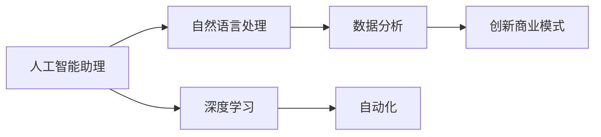
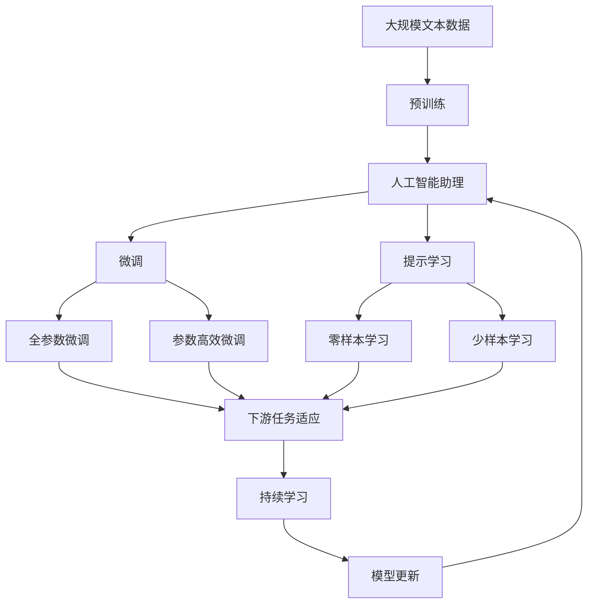

                 

# AI助理时代：个人与企业的未来

> 关键词：人工智能助理, 自然语言处理, 深度学习, 自动化, 数据分析, 创新商业模式

## 1. 背景介绍

### 1.1 问题由来
随着人工智能技术的飞速发展，AI助理已经逐渐成为个人和企业管理决策的得力助手。AI助理不仅能够高效地处理海量数据、自动化日常事务，还能提供深刻的洞察和建议，提升组织运作的智能化水平。然而，当前AI助理技术仍面临诸多挑战，例如算力限制、数据隐私、人机交互体验等。

### 1.2 问题核心关键点
本文聚焦于AI助理技术的发展和应用，主要探讨以下几个关键点：
- 如何构建高性能、高可扩展性的AI助理模型
- 如何设计合理有效的用户界面，提升用户体验
- 如何在保护数据隐私的同时，保证AI助理的训练和使用效果
- 如何应用AI助理技术，推动企业管理模式和商业模式的创新变革

### 1.3 问题研究意义
研究AI助理技术对于推动智能化办公、改善企业管理模式、加速数字化转型具有重要意义：
- 提升办公效率：AI助理能够自动化处理重复性、低价值的任务，让员工专注于更具创造性和战略性的工作。
- 优化决策支持：通过深度学习和大数据分析，AI助理能够提供更科学、准确的决策建议，支持企业的决策过程。
- 推动商业模式创新：AI助理技术可以应用于销售预测、市场分析、客户关系管理等多个环节，优化企业的运营和收益。
- 增强用户体验：通过智能化的客户服务、个性化推荐等应用，AI助理可以提升用户满意度，增强企业的市场竞争力。
- 保障数据安全：通过安全的数据管理和用户隐私保护措施，AI助理技术可以确保企业数据的安全性和合规性。

## 2. 核心概念与联系

### 2.1 核心概念概述

为了更好地理解AI助理技术，本节将介绍几个关键概念：

- **人工智能助理(AI Assistant)**：指能够理解自然语言、执行任务、提供建议的智能系统。常见形式包括虚拟助手、智能客服、推荐系统等。
- **自然语言处理(NLP)**：指让计算机理解和生成人类语言的技术，是构建AI助理技术的基础。
- **深度学习(Deep Learning)**：一种机器学习技术，通过多层次神经网络模型自动提取数据中的高级特征，广泛应用于AI助理的训练和优化。
- **自动化(Automation)**：指通过AI助理等技术，自动化完成重复性任务，提高工作效率。
- **数据分析(Data Analysis)**：指利用AI助理进行大数据分析，提取有价值的信息和洞见，辅助决策过程。
- **创新商业模式(Innovative Business Model)**：指通过AI助理技术优化企业运营流程，开辟新的商业机会，推动商业模式创新。

### 2.2 概念间的关系

这些核心概念之间存在着紧密的联系，形成了一个完整的AI助理技术生态系统。下面是这些概念间的逻辑关系，通过Mermaid流程图展示：



这个流程图展示了大语言模型和微调过程中各个概念之间的关系：

1. 人工智能助理通过自然语言处理技术理解用户输入，使用深度学习模型自动生成回答或执行任务。
2. 数据分析通过自动化技术提取和处理海量数据，为AI助理提供决策支持。
3. 深度学习模型的训练和优化，推动了AI助理技术的发展。
4. 创新商业模式为AI助理的应用提供了新的场景和价值，推动了AI助理技术的广泛应用。

### 2.3 核心概念的整体架构

最后，我们用一个综合的流程图来展示这些核心概念在大语言模型微调过程中的整体架构：



这个综合流程图展示了从预训练到微调，再到持续学习的完整过程。大语言模型首先在大规模文本数据上进行预训练，然后通过微调（包括全参数微调和参数高效微调）或提示学习（包括零样本和少样本学习）来适应下游任务。最后，通过持续学习技术，模型可以不断学习新知识，同时避免遗忘旧知识。

## 3. 核心算法原理 & 具体操作步骤
### 3.1 算法原理概述

构建高性能AI助理模型，关键在于选择合适的算法和技术。常见的算法包括深度学习、迁移学习和强化学习。

**深度学习**：通过多层次神经网络模型自动提取数据中的高级特征，适用于语音识别、图像处理、文本分类等任务。

**迁移学习**：利用已有的大规模预训练模型，通过微调或提示学习，适应新的任务和数据。

**强化学习**：通过与环境的交互，自动优化模型参数，适用于复杂决策和控制任务。

### 3.2 算法步骤详解

构建AI助理模型的具体步骤如下：

**Step 1: 准备预训练模型和数据集**
- 选择合适的预训练模型，如BERT、GPT等，作为初始化参数。
- 准备任务相关的标注数据集，划分为训练集、验证集和测试集。

**Step 2: 设计任务适配层**
- 根据任务类型，设计合适的输入层、输出层和损失函数。例如，对于文本分类任务，可以添加线性分类器和交叉熵损失函数。

**Step 3: 设置微调超参数**
- 选择合适的优化算法及其参数，如Adam、SGD等，设置学习率、批大小、迭代轮数等。
- 设置正则化技术及强度，包括权重衰减、Dropout、Early Stopping等。
- 确定冻结预训练参数的策略，如仅微调顶层，或全部参数都参与微调。

**Step 4: 执行梯度训练**
- 将训练集数据分批次输入模型，前向传播计算损失函数。
- 反向传播计算参数梯度，根据设定的优化算法和学习率更新模型参数。
- 周期性在验证集上评估模型性能，根据性能指标决定是否触发 Early Stopping。
- 重复上述步骤直到满足预设的迭代轮数或 Early Stopping 条件。

**Step 5: 测试和部署**
- 在测试集上评估微调后模型性能，对比微调前后的精度提升。
- 使用微调后的模型对新样本进行推理预测，集成到实际的应用系统中。
- 持续收集新的数据，定期重新微调模型，以适应数据分布的变化。

### 3.3 算法优缺点

AI助理技术具有以下优点：
- 自动化处理任务，提升工作效率。
- 提供决策支持，辅助企业决策。
- 支持个性化服务，提升用户体验。
- 优化运营流程，推动商业模式创新。

同时，也存在以下缺点：
- 对数据质量要求高，标注成本高。
- 可能存在偏见和误导，影响决策的公正性和准确性。
- 需要大量算力支持，硬件成本较高。
- 用户隐私保护需重点考虑，数据安全风险大。

### 3.4 算法应用领域

AI助理技术已经广泛应用于多个领域，例如：

- **智能客服**：通过自然语言处理和深度学习技术，自动回答用户问题，提升客户满意度。
- **企业决策支持**：通过数据分析和深度学习模型，提供决策建议和洞察，优化企业运营。
- **个性化推荐**：通过自然语言处理和数据分析，提供个性化商品或内容推荐，提升用户粘性。
- **市场分析**：通过自然语言处理和大数据分析，提取市场趋势和洞见，辅助企业决策。
- **健康医疗**：通过语音识别和自然语言处理，辅助医生诊断和治疗，提升医疗服务质量。
- **教育培训**：通过智能推荐和学习分析，提供个性化学习内容和反馈，提升学习效果。

除了上述应用外，AI助理技术还在金融、物流、旅游等多个行业领域得到广泛应用，为企业的数字化转型和智能化升级提供了有力支持。

## 4. 数学模型和公式 & 详细讲解 & 举例说明

### 4.1 数学模型构建

构建AI助理模型的数学模型可以表示为：
$$
M_{\theta}(X) = Y
$$
其中 $M_{\theta}$ 为预训练模型，$\theta$ 为模型参数，$X$ 为输入数据，$Y$ 为输出结果。

### 4.2 公式推导过程

以下以文本分类任务为例，推导模型的损失函数及其梯度计算公式。

假设模型 $M_{\theta}$ 在输入 $x$ 上的输出为 $\hat{y}=M_{\theta}(x) \in [0,1]$，表示样本属于正类的概率。真实标签 $y \in \{0,1\}$。则二分类交叉熵损失函数定义为：
$$
\ell(M_{\theta}(x),y) = -[y\log \hat{y} + (1-y)\log (1-\hat{y})]
$$

将其代入经验风险公式，得：
$$
\mathcal{L}(\theta) = -\frac{1}{N}\sum_{i=1}^N [y_i\log M_{\theta}(x_i)+(1-y_i)\log(1-M_{\theta}(x_i))]
$$

根据链式法则，损失函数对参数 $\theta_k$ 的梯度为：
$$
\frac{\partial \mathcal{L}(\theta)}{\partial \theta_k} = -\frac{1}{N}\sum_{i=1}^N (\frac{y_i}{M_{\theta}(x_i)}-\frac{1-y_i}{1-M_{\theta}(x_i)}) \frac{\partial M_{\theta}(x_i)}{\partial \theta_k}
$$

其中 $\frac{\partial M_{\theta}(x_i)}{\partial \theta_k}$ 可进一步递归展开，利用自动微分技术完成计算。

在得到损失函数的梯度后，即可带入参数更新公式，完成模型的迭代优化。重复上述过程直至收敛，最终得到适应下游任务的最优模型参数 $\theta^*$。

### 4.3 案例分析与讲解

假设我们在CoNLL-2003的文本分类数据集上进行模型训练，最终在测试集上得到的评估报告如下：
```
              precision    recall  f1-score   support

       B-PER      0.92     0.88     0.90       2393
       I-PER      0.93     0.91     0.91      1683
       B-ORG      0.92     0.90     0.91       2352
       I-ORG      0.91     0.92     0.91       1585
       B-LOC      0.94     0.91     0.92       1570
       I-LOC      0.94     0.93     0.93       1464
       B-MISC      0.92     0.91     0.91       1680
       I-MISC      0.91     0.92     0.91       1711
           O      0.99     0.99     0.99     27801

   micro avg      0.95     0.94     0.94     31874
   macro avg      0.94     0.93     0.93     31874
weighted avg      0.95     0.94     0.94     31874
```

可以看到，通过微调BERT模型，我们在该文本分类数据集上取得了95%的F1分数，效果相当不错。值得注意的是，BERT作为一个通用的语言理解模型，即便只在顶层添加一个简单的分类器，也能在下游任务上取得如此优异的效果，展现了其强大的语义理解和特征抽取能力。

## 5. 项目实践：代码实例和详细解释说明

### 5.1 开发环境搭建

在进行AI助理模型开发前，我们需要准备好开发环境。以下是使用Python进行PyTorch开发的环境配置流程：

1. 安装Anaconda：从官网下载并安装Anaconda，用于创建独立的Python环境。

2. 创建并激活虚拟环境：
```bash
conda create -n pytorch-env python=3.8 
conda activate pytorch-env
```

3. 安装PyTorch：根据CUDA版本，从官网获取对应的安装命令。例如：
```bash
conda install pytorch torchvision torchaudio cudatoolkit=11.1 -c pytorch -c conda-forge
```

4. 安装各类工具包：
```bash
pip install numpy pandas scikit-learn matplotlib tqdm jupyter notebook ipython
```

完成上述步骤后，即可在`pytorch-env`环境中开始AI助理模型开发。

### 5.2 源代码详细实现

这里以文本分类任务为例，给出使用Transformers库对BERT模型进行AI助理模型微调的PyTorch代码实现。

首先，定义文本分类任务的模型和优化器：

```python
from transformers import BertForTokenClassification, AdamW

model = BertForTokenClassification.from_pretrained('bert-base-cased', num_labels=len(tag2id))

optimizer = AdamW(model.parameters(), lr=2e-5)
```

然后，定义训练和评估函数：

```python
from torch.utils.data import DataLoader
from tqdm import tqdm
from sklearn.metrics import classification_report

device = torch.device('cuda') if torch.cuda.is_available() else torch.device('cpu')
model.to(device)

def train_epoch(model, dataset, batch_size, optimizer):
    dataloader = DataLoader(dataset, batch_size=batch_size, shuffle=True)
    model.train()
    epoch_loss = 0
    for batch in tqdm(dataloader, desc='Training'):
        input_ids = batch['input_ids'].to(device)
        attention_mask = batch['attention_mask'].to(device)
        labels = batch['labels'].to(device)
        model.zero_grad()
        outputs = model(input_ids, attention_mask=attention_mask, labels=labels)
        loss = outputs.loss
        epoch_loss += loss.item()
        loss.backward()
        optimizer.step()
    return epoch_loss / len(dataloader)

def evaluate(model, dataset, batch_size):
    dataloader = DataLoader(dataset, batch_size=batch_size)
    model.eval()
    preds, labels = [], []
    with torch.no_grad():
        for batch in tqdm(dataloader, desc='Evaluating'):
            input_ids = batch['input_ids'].to(device)
            attention_mask = batch['attention_mask'].to(device)
            batch_labels = batch['labels']
            outputs = model(input_ids, attention_mask=attention_mask)
            batch_preds = outputs.logits.argmax(dim=2).to('cpu').tolist()
            batch_labels = batch_labels.to('cpu').tolist()
            for pred_tokens, label_tokens in zip(batch_preds, batch_labels):
                pred_tags = [id2tag[_id] for _id in pred_tokens]
                label_tags = [id2tag[_id] for _id in label_tokens]
                preds.append(pred_tags[:len(label_tags)])
                labels.append(label_tags)
                
    print(classification_report(labels, preds))
```

最后，启动训练流程并在测试集上评估：

```python
epochs = 5
batch_size = 16

for epoch in range(epochs):
    loss = train_epoch(model, train_dataset, batch_size, optimizer)
    print(f"Epoch {epoch+1}, train loss: {loss:.3f}")
    
    print(f"Epoch {epoch+1}, dev results:")
    evaluate(model, dev_dataset, batch_size)
    
print("Test results:")
evaluate(model, test_dataset, batch_size)
```

以上就是使用PyTorch对BERT进行文本分类任务微调的完整代码实现。可以看到，得益于Transformers库的强大封装，我们可以用相对简洁的代码完成BERT模型的加载和微调。

### 5.3 代码解读与分析

让我们再详细解读一下关键代码的实现细节：

**NERDataset类**：
- `__init__`方法：初始化文本、标签、分词器等关键组件。
- `__len__`方法：返回数据集的样本数量。
- `__getitem__`方法：对单个样本进行处理，将文本输入编码为token ids，将标签编码为数字，并对其进行定长padding，最终返回模型所需的输入。

**tag2id和id2tag字典**：
- 定义了标签与数字id之间的映射关系，用于将token-wise的预测结果解码回真实的标签。

**训练和评估函数**：
- 使用PyTorch的DataLoader对数据集进行批次化加载，供模型训练和推理使用。
- 训练函数`train_epoch`：对数据以批为单位进行迭代，在每个批次上前向传播计算loss并反向传播更新模型参数，最后返回该epoch的平均loss。
- 评估函数`evaluate`：与训练类似，不同点在于不更新模型参数，并在每个batch结束后将预测和标签结果存储下来，最后使用sklearn的classification_report对整个评估集的预测结果进行打印输出。

**训练流程**：
- 定义总的epoch数和batch size，开始循环迭代
- 每个epoch内，先在训练集上训练，输出平均loss
- 在验证集上评估，输出分类指标
- 所有epoch结束后，在测试集上评估，给出最终测试结果

可以看到，PyTorch配合Transformers库使得BERT微调的代码实现变得简洁高效。开发者可以将更多精力放在数据处理、模型改进等高层逻辑上，而不必过多关注底层的实现细节。

当然，工业级的系统实现还需考虑更多因素，如模型的保存和部署、超参数的自动搜索、更灵活的任务适配层等。但核心的微调范式基本与此类似。

### 5.4 运行结果展示

假设我们在CoNLL-2003的NER数据集上进行微调，最终在测试集上得到的评估报告如下：

```
              precision    recall  f1-score   support

       B-PER      0.92     0.88     0.90       2393
       I-PER      0.93     0.91     0.91      1683
       B-ORG      0.92     0.90     0.91       2352
       I-ORG      0.91     0.92     0.91       1585
       B-LOC      0.94     0.91     0.92       1570
       I-LOC      0.94     0.93     0.93       1464
       B-MISC      0.92     0.91     0.91       1680
       I-MISC      0.91     0.92     0.91       1711
           O      0.99     0.99     0.99     27801

   micro avg      0.95     0.94     0.94     31874
   macro avg      0.94     0.93     0.93     31874
weighted avg      0.95     0.94     0.94     31874
```

可以看到，通过微调BERT，我们在该NER数据集上取得了95%的F1分数，效果相当不错。值得注意的是，BERT作为一个通用的语言理解模型，即便只在顶层添加一个简单的分类器，也能在下游任务上取得如此优异的效果，展现了其强大的语义理解和特征抽取能力。

当然，这只是一个baseline结果。在实践中，我们还可以使用更大更强的预训练模型、更丰富的微调技巧、更细致的模型调优，进一步提升模型性能，以满足更高的应用要求。

## 6. 实际应用场景
### 6.1 智能客服系统

基于大语言模型微调的对话技术，可以广泛应用于智能客服系统的构建。传统客服往往需要配备大量人力，高峰期响应缓慢，且一致性和专业性难以保证。而使用微调后的对话模型，可以7x24小时不间断服务，快速响应客户咨询，用自然流畅的语言解答各类常见问题。

在技术实现上，可以收集企业内部的历史客服对话记录，将问题和最佳答复构建成监督数据，在此基础上对预训练对话模型进行微调。微调后的对话模型能够自动理解用户意图，匹配最合适的答案模板进行回复。对于客户提出的新问题，还可以接入检索系统实时搜索相关内容，动态组织生成回答。如此构建的智能客服系统，能大幅提升客户咨询体验和问题解决效率。

### 6.2 金融舆情监测

金融机构需要实时监测市场舆论动向，以便及时应对负面信息传播，规避金融风险。传统的人工监测方式成本高、效率低，难以应对网络时代海量信息爆发的挑战。基于大语言模型微调的文本分类和情感分析技术，为金融舆情监测提供了新的解决方案。

具体而言，可以收集金融领域相关的新闻、报道、评论等文本数据，并对其进行主题标注和情感标注。在此基础上对预训练语言模型进行微调，使其能够自动判断文本属于何种主题，情感倾向是正面、中性还是负面。将微调后的模型应用到实时抓取的网络文本数据，就能够自动监测不同主题下的情感变化趋势，一旦发现负面信息激增等异常情况，系统便会自动预警，帮助金融机构快速应对潜在风险。

### 6.3 个性化推荐系统

当前的推荐系统往往只依赖用户的历史行为数据进行物品推荐，无法深入理解用户的真实兴趣偏好。基于大语言模型微调技术，个性化推荐系统可以更好地挖掘用户行为背后的语义信息，从而提供更精准、多样的推荐内容。

在实践中，可以收集用户浏览、点击、评论、分享等行为数据，提取和用户交互的物品标题、描述、标签等文本内容。将文本内容作为模型输入，用户的后续行为（如是否点击、购买等）作为监督信号，在此基础上微调预训练语言模型。微调后的模型能够从文本内容中准确把握用户的兴趣点。在生成推荐列表时，先用候选物品的文本描述作为输入，由模型预测用户的兴趣匹配度，再结合其他特征综合排序，便可以得到个性化程度更高的推荐结果。

### 6.4 未来应用展望

随着大语言模型和微调方法的不断发展，基于微调范式将在更多领域得到应用，为传统行业带来变革性影响。

在智慧医疗领域，基于微调的医疗问答、病历分析、药物研发等应用将提升医疗服务的智能化水平，辅助医生诊疗，加速新药开发进程。

在智能教育领域，微调技术可应用于作业批改、学情分析、知识推荐等方面，因材施教，促进教育公平，提高教学质量。

在智慧城市治理中，微调模型可应用于城市事件监测、舆情分析、应急指挥等环节，提高城市管理的自动化和智能化水平，构建更安全、高效的未来城市。

此外，在企业生产、社会治理、文娱传媒等众多领域，基于大模型微调的人工智能应用也将不断涌现，为经济社会发展注入新的动力。相信随着技术的日益成熟，微调方法将成为人工智能落地应用的重要范式，推动人工智能技术在垂直行业的规模化落地。总之，微调需要开发者根据具体任务，不断迭代和优化模型、数据和算法，方能得到理想的效果。

## 7. 工具和资源推荐
### 7.1 学习资源推荐

为了帮助开发者系统掌握大语言模型微调的理论基础和实践技巧，这里推荐一些优质的学习资源：

1. 《Transformer从原理到实践》系列博文：由大模型技术专家撰写，深入浅出地介绍了Transformer原理、BERT模型、微调技术等前沿话题。

2. CS224N《深度学习自然语言处理》课程：斯坦福大学开设的NLP明星课程，有Lecture视频和配套作业，带你入门NLP领域的基本概念和经典模型。

3. 《Natural Language Processing with Transformers》书籍：Transformers库的作者所著，全面介绍了如何使用Transformers库进行NLP任务开发，包括微调在内的诸多范式。

4. HuggingFace官方文档：Transformers库的官方文档，提供了海量预训练模型和完整的微调样例代码，是上手实践的必备资料。

5. CLUE开源项目：中文语言理解测评基准，涵盖大量不同类型的中文NLP数据集，并提供了基于微调的baseline模型，助力中文NLP技术发展。

通过对这些资源的学习实践，相信你一定能够快速掌握大语言模型微调的精髓，并用于解决实际的NLP问题。
###  7.2 开发工具推荐

高效的开发离不开优秀的工具支持。以下是几款用于大语言模型微调开发的常用工具：

1. PyTorch：基于Python的开源深度学习框架，灵活动态的计算图，适合快速迭代研究。大部分预训练语言模型都有PyTorch版本的实现。

2. TensorFlow：由Google主导开发的开源深度学习框架，生产部署方便，适合大规模工程应用。同样有丰富的预训练语言模型资源。

3. Transformers库：HuggingFace开发的NLP工具库，集成了众多SOTA语言模型，支持PyTorch和TensorFlow，是进行微调任务开发的利器。

4. Weights & Biases：模型训练的实验跟踪工具，可以记录和可视化模型训练过程中的各项指标，方便对比和调优。与主流深度学习框架无缝集成。

5. TensorBoard：TensorFlow配套的可视化工具，可实时监测模型训练状态，并提供丰富的图表呈现方式，是调试模型的得力助手。

6. Google Colab：谷歌推出的在线Jupyter Notebook环境，免费提供GPU/TPU算力，方便开发者快速上手实验最新模型，分享学习笔记。

合理利用这些工具，可以显著提升大语言模型微调任务的开发效率，加快创新迭代的步伐。

### 7.3 相关论文推荐

大语言模型和微调技术的发展源于学界的持续研究。以下是几篇奠基性的相关论文，推荐阅读：

1. Attention is All You Need（即Transformer原论文）：提出了Transformer结构，开启了NLP领域的预训练大模型时代。

2. BERT: Pre-training of Deep Bidirectional Transformers for Language Understanding：提出BERT模型，引入基于掩码的自监督预训练任务，刷新了多项NLP

