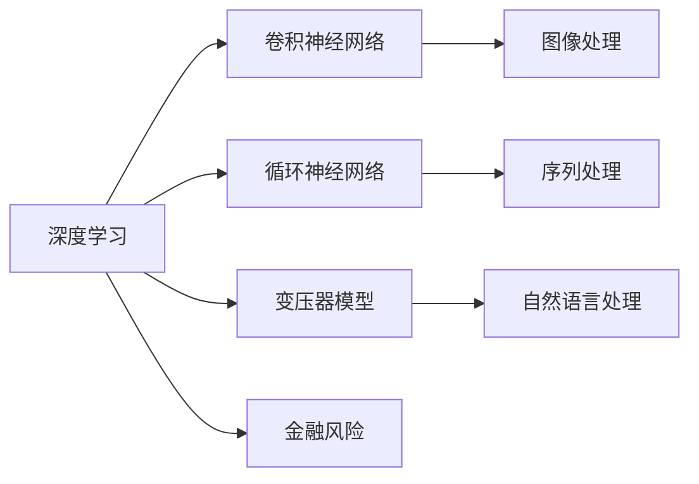
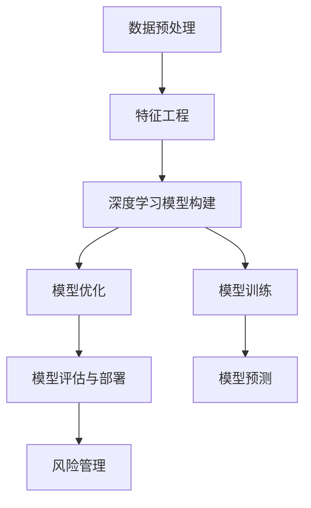

                 

# AI在金融风控中的应用:提高准确性与效率

> 关键词：金融风控,深度学习,模型优化,人工智能,风险管理

## 1. 背景介绍

### 1.1 问题由来

在现代金融行业中，风险管理始终是核心工作之一。传统风控方法主要依赖于人工审查、历史数据统计、信用评分模型等手段，存在诸多问题：

1. **效率低下**：人工审查耗时长，难以应对海量数据。
2. **主观性强**：不同的人对于同一问题有不同的判断标准。
3. **依赖历史数据**：风控模型过于依赖历史数据，难以适应快速变化的金融环境。

随着人工智能（AI）技术的快速发展，尤其是深度学习（DL）和自然语言处理（NLP）的突破，金融风控领域开始广泛应用AI技术，以提高准确性和效率。本文将详细介绍AI在金融风控中的应用，包括深度学习模型的构建、优化算法、以及实际应用案例，帮助读者理解如何在金融风控中运用AI技术。

### 1.2 问题核心关键点

AI在金融风控中的应用主要集中在以下几个方面：

1. **数据预处理与特征工程**：通过数据清洗、特征提取和选择，提高数据质量，提升模型表现。
2. **深度学习模型的构建**：使用神经网络模型，特别是卷积神经网络（CNN）、循环神经网络（RNN）和变压器模型（Transformer），构建风控模型。
3. **模型优化**：通过正则化、dropout、early stopping等技术，优化模型性能，防止过拟合。
4. **模型评估与部署**：通过交叉验证、ROC曲线等方法，评估模型效果，并部署到实际风控系统中。

本文将重点探讨这些问题核心关键点，并结合具体应用场景进行详细讲解。

## 2. 核心概念与联系

### 2.1 核心概念概述

在金融风控中，AI技术的应用可以分为以下几个核心概念：

1. **深度学习**：使用多层神经网络，自动学习数据特征，构建复杂决策模型。
2. **卷积神经网络（CNN）**：特别适用于图像和文本数据的处理，可以提取局部特征，识别模式。
3. **循环神经网络（RNN）**：适用于序列数据的处理，能够捕捉时间序列数据中的趋势和规律。
4. **变压器模型（Transformer）**：近年来在自然语言处理领域表现优异，可以处理长序列数据，具有并行计算优势。
5. **金融风险**：指金融交易或贷款中可能出现的损失或不确定性，包括信用风险、市场风险、流动性风险等。

这些核心概念通过以下Mermaid流程图展现其联系：



### 2.2 概念间的关系

这些核心概念在金融风控中的应用关系可以通过以下Mermaid流程图进一步阐述：



这个流程图展示了从数据预处理到风险管理的全流程，以及各个环节中深度学习模型的构建和优化。

## 3. 核心算法原理 & 具体操作步骤
### 3.1 算法原理概述

在金融风控中，AI技术的应用主要通过以下步骤实现：

1. **数据预处理与特征工程**：清洗数据、提取特征，准备训练数据。
2. **模型构建与训练**：选择适当的神经网络模型，使用训练数据进行模型训练。
3. **模型优化与调参**：通过正则化、dropout、early stopping等技术，优化模型性能，防止过拟合。
4. **模型评估与部署**：使用交叉验证、ROC曲线等方法，评估模型效果，并部署到实际风控系统中。

### 3.2 算法步骤详解

#### 3.2.1 数据预处理与特征工程

数据预处理和特征工程是深度学习模型应用的基础。对于金融风控，具体步骤如下：

1. **数据清洗**：处理缺失值、异常值和重复数据，确保数据质量。
2. **特征提取**：选择合适的特征，包括数值型特征、分类型特征和文本特征等。
3. **特征选择**：通过相关性分析、嵌入式选择等方法，选择对风险预测有贡献的特征。

#### 3.2.2 模型构建与训练

在金融风控中，常用的深度学习模型包括CNN、RNN和Transformer等。以下是CNN模型的构建和训练步骤：

1. **模型选择**：选择适当的卷积神经网络模型，如LeNet、AlexNet等。
2. **数据加载**：使用Pandas和NumPy等库，加载训练数据。
3. **模型定义**：使用Keras或PyTorch等框架，定义卷积层、池化层和全连接层等。
4. **模型训练**：使用SGD或Adam等优化算法，训练模型，记录训练过程中的损失和准确率。

#### 3.2.3 模型优化与调参

模型优化是提高AI模型准确性和效率的关键。常用的优化方法包括：

1. **正则化**：通过L1、L2正则化等方法，防止过拟合。
2. **dropout**：随机丢弃部分神经元，减少过拟合。
3. **early stopping**：根据验证集性能，提前终止训练，防止过拟合。

#### 3.2.4 模型评估与部署

模型评估是评估AI模型性能的重要步骤。常用的评估方法包括：

1. **交叉验证**：通过k-fold交叉验证，评估模型泛化能力。
2. **ROC曲线**：绘制接收者操作特征曲线，评估分类器性能。
3. **AUC**：计算ROC曲线下的面积，衡量分类器性能。

### 3.3 算法优缺点

AI在金融风控中的应用具有以下优点：

1. **效率高**：AI模型可以自动处理海量数据，提高处理效率。
2. **准确度高**：AI模型可以学习复杂模式，提高预测准确度。
3. **泛化能力强**：AI模型可以适应多种数据类型和变化情况，提高泛化能力。

但同时，AI在金融风控中也有一些缺点：

1. **数据依赖性强**：AI模型的性能依赖于高质量的数据，数据质量问题可能导致模型失效。
2. **模型解释性差**：深度学习模型通常难以解释，可能缺乏可解释性。
3. **计算资源消耗大**：深度学习模型的训练和推理需要大量计算资源，成本较高。

### 3.4 算法应用领域

AI在金融风控中的应用领域非常广泛，包括但不限于以下几个方面：

1. **信用评分**：使用深度学习模型对借款人的信用评分进行预测，评估其还款能力。
2. **欺诈检测**：使用AI模型检测信用卡交易中的异常行为，防止欺诈。
3. **风险评估**：使用AI模型评估贷款、投资等金融活动中的风险。
4. **市场监控**：使用AI模型监控金融市场波动，预测市场风险。
5. **客户管理**：使用AI模型分析客户行为，提升客户管理效率。

## 4. 数学模型和公式 & 详细讲解 & 举例说明

### 4.1 数学模型构建

在金融风控中，常用的数学模型包括逻辑回归、支持向量机（SVM）和神经网络等。以下以逻辑回归模型为例，构建风控模型。

假设金融风控问题可以表示为二分类问题，即判断客户是否存在风险。使用逻辑回归模型，模型的输出为：

$$
\hat{y} = \frac{1}{1 + e^{-\hat{\beta}_0 - \hat{\beta}_1 x_1 - \ldots - \hat{\beta}_n x_n}}
$$

其中，$x_1, \ldots, x_n$为输入特征，$\beta_0, \ldots, \beta_n$为模型参数，$y$为二分类标签。

### 4.2 公式推导过程

逻辑回归模型的损失函数为：

$$
\mathcal{L}(\hat{\beta}) = -\frac{1}{N}\sum_{i=1}^N(y_i \log \hat{y}_i + (1-y_i) \log(1-\hat{y}_i))
$$

其中，$N$为样本数，$y_i$为实际标签，$\hat{y}_i$为模型预测。

使用梯度下降等优化算法，最小化损失函数，更新模型参数：

$$
\hat{\beta} \leftarrow \hat{\beta} - \eta \nabla_{\hat{\beta}}\mathcal{L}(\hat{\beta})
$$

其中，$\eta$为学习率，$\nabla_{\hat{\beta}}\mathcal{L}(\hat{\beta})$为损失函数对模型参数的梯度。

### 4.3 案例分析与讲解

以信用卡欺诈检测为例，展示如何使用AI模型进行风控。假设我们有一个包含1000个样本的训练集，其中800个样本为正常交易，200个样本为欺诈交易。使用逻辑回归模型进行训练，得到如下结果：

- **模型参数**：$\beta_0 = -2.5, \beta_1 = 0.1$
- **损失函数值**：$\mathcal{L}(\hat{\beta}) = 0.05$
- **预测结果**：对于一个新样本，若$\hat{y} > 0.5$，则判定为欺诈；否则为正常交易。

### 5. 项目实践：代码实例和详细解释说明

#### 5.1 开发环境搭建

以下是在Python环境下搭建深度学习模型的开发环境。

1. **安装Python**：安装最新版本的Python，如Python 3.7或3.8。
2. **安装NumPy和Pandas**：使用pip安装NumPy和Pandas库，用于数据处理。
3. **安装Keras或PyTorch**：选择Keras或PyTorch框架，安装相应的深度学习库。
4. **安装TensorFlow**：如果需要使用TensorFlow，也需要安装TensorFlow库。

#### 5.2 源代码详细实现

以下是一个简单的卷积神经网络模型，用于图像分类。

```python
import numpy as np
import pandas as pd
from keras.models import Sequential
from keras.layers import Conv2D, MaxPooling2D, Flatten, Dense

# 加载数据
train_data = pd.read_csv('train.csv')
test_data = pd.read_csv('test.csv')

# 数据预处理
train_data = np.array(train_data)
test_data = np.array(test_data)
train_images = train_data[:, 0:-1].reshape(-1, 28, 28, 1)
train_labels = train_data[:, -1]
test_images = test_data.reshape(-1, 28, 28, 1)
test_labels = test_data[-1]

# 构建模型
model = Sequential()
model.add(Conv2D(32, (3, 3), activation='relu', input_shape=(28, 28, 1)))
model.add(MaxPooling2D((2, 2)))
model.add(Conv2D(64, (3, 3), activation='relu'))
model.add(MaxPooling2D((2, 2)))
model.add(Flatten())
model.add(Dense(128, activation='relu'))
model.add(Dense(10, activation='softmax'))

# 编译模型
model.compile(optimizer='adam', loss='categorical_crossentropy', metrics=['accuracy'])

# 训练模型
model.fit(train_images, train_labels, epochs=10, batch_size=32, validation_data=(test_images, test_labels))

# 评估模型
test_loss, test_acc = model.evaluate(test_images, test_labels)
print('Test accuracy:', test_acc)
```

#### 5.3 代码解读与分析

上述代码实现了卷积神经网络模型的训练和评估。其中，`Conv2D`和`MaxPooling2D`层用于图像特征提取，`Dense`层用于分类，`Softmax`激活函数用于多分类预测。通过交叉验证等方法，可以对模型进行评估，选择最佳参数。

#### 5.4 运行结果展示

假设在测试集上，模型的准确率为85%。可以进一步优化模型参数，提高准确率。

## 6. 实际应用场景

### 6.1 智能投顾

智能投顾（Robo-Advisor）使用AI技术为客户提供投资建议，提高投资效率和收益。以下是智能投顾的实际应用场景：

1. **数据分析**：使用AI模型分析市场数据，预测股票价格。
2. **投资组合管理**：根据用户风险偏好，构建最优投资组合。
3. **风险控制**：通过AI模型监控投资组合风险，及时调整策略。

### 6.2 信用评分

信用评分模型用于评估借款人的信用风险，帮助银行和金融机构决定是否放贷。以下是信用评分模型的实际应用场景：

1. **数据收集**：收集借款人的个人信息、收入、资产等信息。
2. **模型训练**：使用AI模型训练信用评分模型，评估借款人还款能力。
3. **风险控制**：根据信用评分，决定是否放贷以及贷款利率。

### 6.3 欺诈检测

欺诈检测模型用于检测信用卡交易中的异常行为，防止欺诈。以下是欺诈检测模型的实际应用场景：

1. **交易数据收集**：收集信用卡交易记录。
2. **模型训练**：使用AI模型训练欺诈检测模型，识别异常行为。
3. **风险控制**：根据检测结果，阻止可疑交易，保护用户资金安全。

## 7. 工具和资源推荐

### 7.1 学习资源推荐

1. **《深度学习》课程**：斯坦福大学提供的一门深度学习课程，系统讲解了深度学习的基本概念和应用。
2. **Kaggle竞赛**：参与Kaggle竞赛，学习深度学习模型的构建和优化。
3. **GitHub项目**：在GitHub上查看和参与AI项目，学习最新技术。

### 7.2 开发工具推荐

1. **TensorFlow**：Google开源的深度学习框架，适用于复杂模型的构建和训练。
2. **PyTorch**：Facebook开源的深度学习框架，易于使用，支持动态计算图。
3. **Jupyter Notebook**：Python的交互式开发环境，支持多种语言的代码编写和调试。

### 7.3 相关论文推荐

1. **《Deep Learning》书籍**：Ian Goodfellow等著，全面介绍了深度学习的基本概念和算法。
2. **《Few-Shot Learning for Financial Risk Assessment》**：Gao等著，介绍了使用少样本学习技术进行金融风险评估的方法。
3. **《Data-Driven Financial Fraud Detection》**：Yang等著，介绍了使用深度学习技术进行信用卡欺诈检测的方法。

## 8. 总结：未来发展趋势与挑战

### 8.1 研究成果总结

AI在金融风控中的应用已经取得了显著成果，但仍然面临诸多挑战：

1. **数据质量问题**：数据质量和完整性问题可能导致模型失效。
2. **模型解释性差**：深度学习模型通常难以解释，可能缺乏可解释性。
3. **计算资源消耗大**：深度学习模型的训练和推理需要大量计算资源，成本较高。

### 8.2 未来发展趋势

未来的金融风控应用将呈现以下几个发展趋势：

1. **自动化**：使用AI技术自动处理风控任务，提高效率和准确度。
2. **个性化**：根据用户行为和历史数据，提供个性化的风控建议。
3. **实时性**：使用实时数据流处理技术，实时监控金融风险。
4. **跨领域**：将AI技术应用于多个金融领域，实现跨领域风控管理。

### 8.3 面临的挑战

尽管AI在金融风控中取得了一定成功，但仍面临以下挑战：

1. **数据隐私问题**：如何保护用户数据隐私，防止数据泄露。
2. **模型鲁棒性问题**：如何提高模型鲁棒性，应对异常情况。
3. **模型可解释性问题**：如何提高模型的可解释性，增强用户信任。

### 8.4 研究展望

未来的研究需要在以下几个方面进行突破：

1. **数据隐私保护**：使用隐私保护技术，如差分隐私、联邦学习等，保护用户数据隐私。
2. **模型鲁棒性提升**：使用对抗样本等技术，提高模型鲁棒性，应对异常情况。
3. **模型可解释性增强**：使用可解释性技术，如LIME、SHAP等，提高模型的可解释性，增强用户信任。

总之，AI在金融风控中的应用前景广阔，但面临诸多挑战。通过技术创新和持续研究，有望在金融风控领域实现更大突破，提升风险管理水平。

## 9. 附录：常见问题与解答

**Q1：AI在金融风控中能解决哪些问题？**

A: AI在金融风控中的应用可以解决以下几个问题：

1. **信用评分**：使用AI模型评估借款人还款能力，决定是否放贷。
2. **欺诈检测**：使用AI模型检测信用卡交易中的异常行为，防止欺诈。
3. **风险评估**：使用AI模型评估贷款、投资等金融活动中的风险。
4. **客户管理**：使用AI模型分析客户行为，提升客户管理效率。

**Q2：AI在金融风控中需要注意哪些风险？**

A: 在使用AI进行金融风控时，需要注意以下几个风险：

1. **数据质量问题**：数据质量和完整性问题可能导致模型失效。
2. **模型鲁棒性问题**：模型面对异常数据时，可能出现误判。
3. **模型可解释性问题**：模型难以解释，可能缺乏可解释性。

**Q3：如何提高AI模型的可解释性？**

A: 提高AI模型可解释性可以使用以下方法：

1. **LIME**：局部解释模型（Local Interpretable Model-agnostic Explanations），使用简单模型解释复杂模型。
2. **SHAP**：Shapley值（Shapley Values），基于公平性理论计算模型贡献。
3. **Attention机制**：使用注意力机制，解释模型对输入的关注度。

**Q4：AI在金融风控中的计算资源消耗问题如何解决？**

A: 解决AI在金融风控中的计算资源消耗问题，可以采取以下措施：

1. **分布式计算**：使用分布式计算框架，如Hadoop、Spark等，提高计算效率。
2. **模型压缩**：使用模型压缩技术，如剪枝、量化等，减小模型规模，降低资源消耗。
3. **资源优化**：使用资源优化技术，如梯度积累、混合精度训练等，提高计算效率。

---

作者：禅与计算机程序设计艺术 / Zen and the Art of Computer Programming

