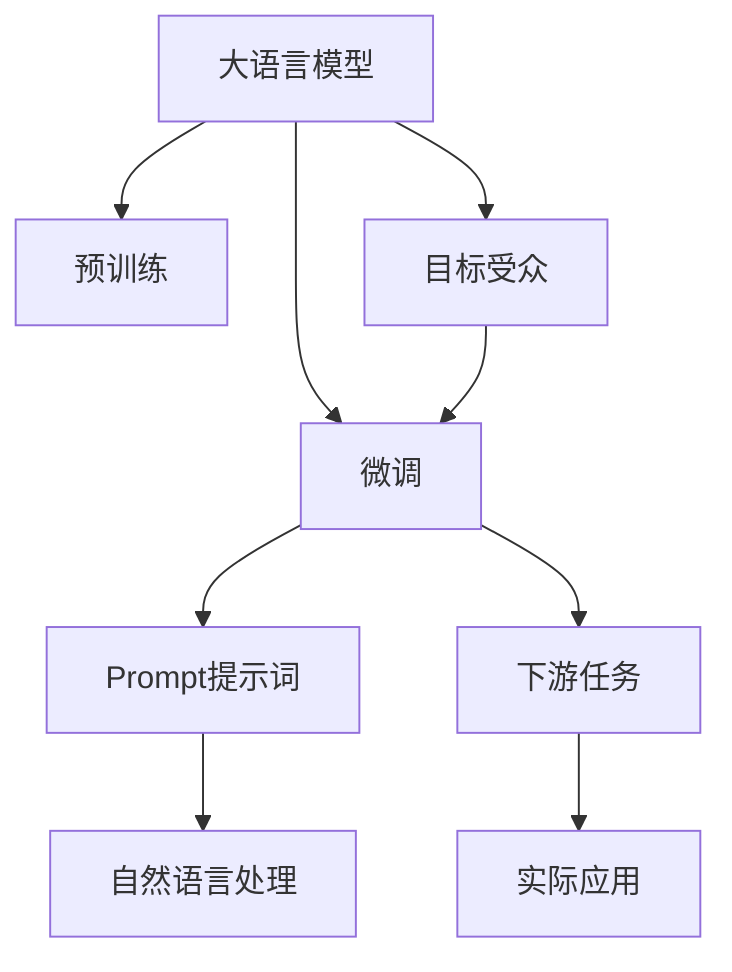
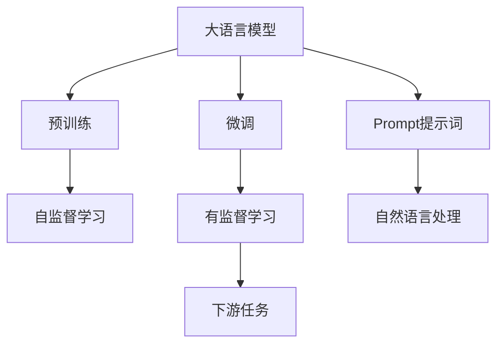
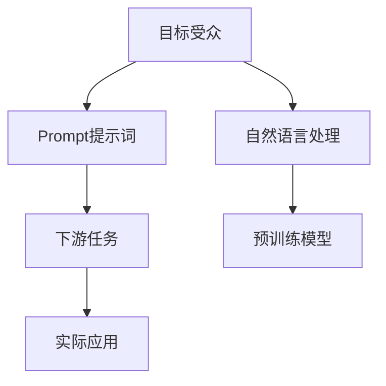
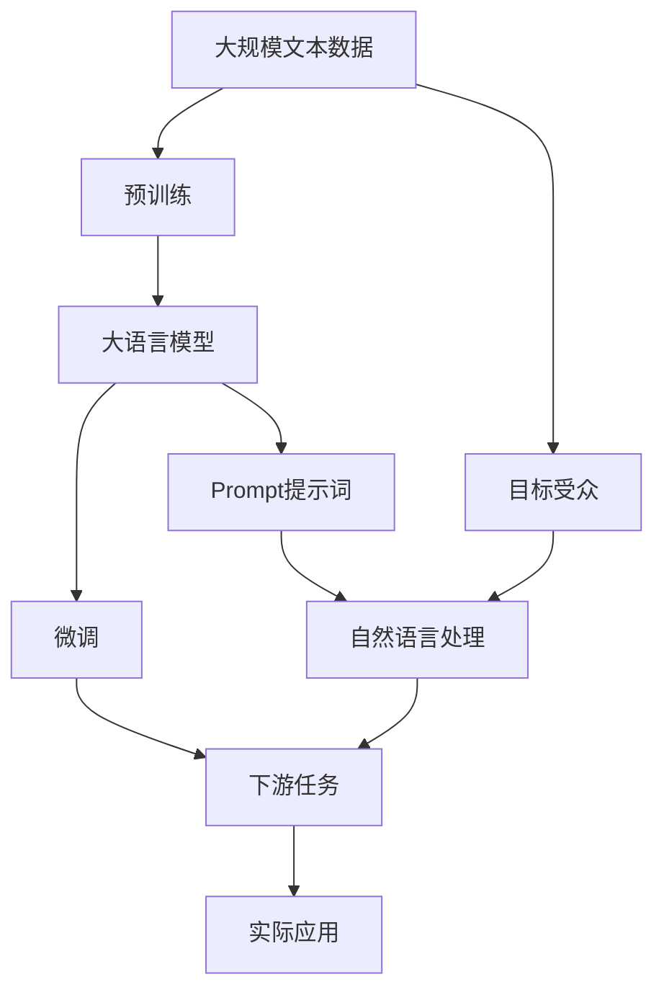

                 

# AI大模型Prompt提示词最佳实践：说明目标受众

> 关键词：
- AI大模型
- Prompt提示词
- 目标受众
- 自动完成
- 文本生成
- 大模型微调

## 1. 背景介绍

### 1.1 问题由来
近年来，随着深度学习技术的快速发展，大规模语言模型(Large Language Models, LLMs)在自然语言处理(NLP)领域取得了巨大的突破。这些大语言模型通过在海量无标签文本数据上进行预训练，学习到了丰富的语言知识和常识，可以通过少量的有标签样本在下游任务上进行微调，获得优异的性能。

然而，由于预训练语料的广泛性和泛化能力的不足，这些通用的大语言模型在特定领域应用时，效果往往难以达到实际应用的要求。因此，如何针对特定任务进行大模型微调，提升模型性能，成为了当前大语言模型研究和应用的一个热点问题。本文聚焦于如何通过Prompt提示词来提升大模型的性能，特别说明目标受众在提示词设计中的应用，以期对大语言模型微调实践提供更全面的指导。

### 1.2 问题核心关键点
大语言模型微调的过程中，Prompt提示词扮演了重要角色。Prompt是指在输入文本中添加的一段引导性文本，它能够帮助模型理解输入数据，并引导其产生特定的输出。一个好的Prompt可以显著提升模型的性能和可解释性。

Prompt的设计要考虑以下几个关键点：
- **目标受众**：明确提示词设计的受众，即预期用户或应用场景。
- **任务类型**：根据下游任务的类型，选择适当的提示词格式。
- **语言风格**：选择适合目标受众的语言风格和词汇，使提示词更容易被理解和执行。
- **上下文语境**：考虑上下文对提示词的影响，合理构造输入数据。
- **语义一致性**：提示词与模型的输出目标应保持语义一致，避免歧义。

这些核心关键点共同决定了Prompt提示词设计的质量，从而影响到大模型的微调效果。本文将详细介绍如何通过Prompt提示词提升大模型的性能，特别是说明目标受众在设计提示词中的重要作用。

### 1.3 问题研究意义
在NLP任务中，Prompt提示词是微调大模型的重要手段。通过设计合理的Prompt，可以在不更新模型参数的情况下，显著提升模型在特定任务上的性能，降低微调成本。这不仅有助于模型快速适应新的任务需求，还能提高模型的可解释性和用户满意度。

说明目标受众在设计Prompt中的作用，可以更好地理解不同受众的需求，从而设计出更具针对性和效果的提示词，进一步提升大模型的应用价值。这对于加速NLP技术的产业化进程，促进人工智能技术的普适化和落地应用，具有重要意义。

## 2. 核心概念与联系

### 2.1 核心概念概述

为更好地理解Prompt提示词的设计和使用，本节将介绍几个密切相关的核心概念：

- **大语言模型(Large Language Model, LLM)**：以自回归(如GPT)或自编码(如BERT)模型为代表的大规模预训练语言模型。通过在大规模无标签文本语料上进行预训练，学习通用的语言表示，具备强大的语言理解和生成能力。

- **Prompt提示词(Prompt)**：在输入文本中添加的一段引导性文本，用于帮助大语言模型理解输入数据，并生成预期的输出。Prompt设计的好坏直接影响模型的性能和可解释性。

- **目标受众(Target Audience)**：Prompt提示词的设计需要考虑的目标群体，如普通用户、专业人士、特定行业用户等。不同受众对语言理解能力、应用场景需求等有着不同的期望。

- **自然语言处理(Natural Language Processing, NLP)**：使计算机能够理解、解释和生成人类语言的技术，包括文本分类、命名实体识别、机器翻译、情感分析等任务。

- **预训练-微调(Pre-training & Fine-tuning)**：在大规模无标签文本数据上进行预训练，然后针对特定任务在少量有标签数据上进行微调，以提升模型在该任务上的性能。

这些核心概念之间的逻辑关系可以通过以下Mermaid流程图来展示：



这个流程图展示了大语言模型、微调、Prompt提示词、自然语言处理和目标受众之间的联系：

1. 大语言模型通过预训练获得基础能力。
2. 微调是对预训练模型进行任务特定的优化，包括Prompt提示词的设计。
3. Prompt提示词帮助模型理解输入数据，生成预期的输出。
4. 自然语言处理任务通过Prompt提示词在实际应用中得到实现。
5. 目标受众在设计Prompt提示词时需要考虑的特定需求和场景。

通过这个流程图，我们可以更清晰地理解Prompt提示词在大语言模型微调中的重要作用。

### 2.2 概念间的关系

这些核心概念之间存在着紧密的联系，形成了Prompt提示词设计的完整生态系统。下面我通过几个Mermaid流程图来展示这些概念之间的关系。

#### 2.2.1 大语言模型的学习范式



这个流程图展示了大语言模型的三种主要学习范式：预训练、微调和Prompt提示词设计。预训练主要采用自监督学习方法，而微调则是有监督学习的过程。Prompt提示词设计则是在微调过程中，通过合理构造输入数据，提升模型在特定任务上的性能。

#### 2.2.2 Prompt提示词的设计与微调的关系


这个流程图展示了Prompt提示词在大模型微调中的应用。Prompt提示词设计需根据下游任务的特定需求，提升模型在特定任务上的性能，同时满足目标受众的需求。

#### 2.2.3 Prompt提示词的目标受众



这个流程图展示了目标受众在设计Prompt提示词时需要考虑的特定需求和场景。Prompt提示词设计需满足不同目标受众的期望，从而提升模型的实际应用效果。

### 2.3 核心概念的整体架构

最后，我们用一个综合的流程图来展示这些核心概念在大语言模型微调过程中的整体架构：



这个综合流程图展示了从预训练到微调，再到实际应用的完整过程。大语言模型首先在大规模文本数据上进行预训练，然后通过微调（包括Prompt提示词的设计）适应下游任务。Prompt提示词设计需满足不同目标受众的需求，从而在实际应用中得到广泛应用。

## 3. 核心算法原理 & 具体操作步骤
### 3.1 算法原理概述

Prompt提示词在大语言模型微调中的作用是通过合理构造输入数据，引导模型理解输入数据并生成预期的输出。一个好的Prompt提示词设计，能够在不更新模型参数的情况下，显著提升模型在特定任务上的性能。

形式化地，假设预训练模型为 $M_{\theta}$，其中 $\theta$ 为预训练得到的模型参数。给定下游任务 $T$ 的标注数据集 $D=\{(x_i, y_i)\}_{i=1}^N$，Prompt提示词的目标是找到最优的提示词 $P$，使得模型 $M_{\theta}$ 在提示词 $P$ 的引导下，生成的输出 $y$ 与真实标签 $y_i$ 尽可能接近。即：

$$
\hat{y} = \mathop{\arg\min}_{\theta} \mathcal{L}(M_{\theta}(x, P), y)
$$

其中 $\mathcal{L}$ 为针对任务 $T$ 设计的损失函数，用于衡量模型预测输出与真实标签之间的差异。常见的损失函数包括交叉熵损失、均方误差损失等。

通过梯度下降等优化算法，Prompt提示词优化过程不断更新提示词 $P$，最小化损失函数 $\mathcal{L}$，使得模型输出逼近真实标签。由于 $P$ 已经通过预训练获得了较好的初始化，因此即便在小规模数据集 $D$ 上进行提示词优化，也能较快收敛到理想的提示词 $P^*$。

### 3.2 算法步骤详解

Prompt提示词在大语言模型微调中的具体步骤包括：

**Step 1: 准备预训练模型和数据集**
- 选择合适的预训练语言模型 $M_{\theta}$ 作为初始化参数，如 BERT、GPT 等。
- 准备下游任务 $T$ 的标注数据集 $D$，划分为训练集、验证集和测试集。一般要求标注数据与预训练数据的分布不要差异过大。

**Step 2: 添加任务适配层**
- 根据任务类型，在预训练模型顶层设计合适的输出层和损失函数。
- 对于分类任务，通常在顶层添加线性分类器和交叉熵损失函数。
- 对于生成任务，通常使用语言模型的解码器输出概率分布，并以负对数似然为损失函数。

**Step 3: 设计Prompt提示词**
- 根据目标受众和任务需求，设计合适的Prompt提示词。Prompt提示词设计需考虑以下几个方面：
  - **语言风格**：选择适合目标受众的语言风格和词汇，使提示词更容易被理解和执行。
  - **上下文语境**：考虑上下文对提示词的影响，合理构造输入数据。
  - **语义一致性**：提示词与模型的输出目标应保持语义一致，避免歧义。
- 常见的Prompt提示词设计方法包括模板法、回译法、改写法等。

**Step 4: 设置提示词优化超参数**
- 选择合适的优化算法及其参数，如 AdamW、SGD 等，设置学习率、批大小、迭代轮数等。
- 设置正则化技术及强度，包括权重衰减、Dropout、Early Stopping等。
- 确定冻结预训练参数的策略，如仅微调顶层，或全部参数都参与提示词优化。

**Step 5: 执行提示词优化**
- 将训练集数据分批次输入模型，前向传播计算损失函数。
- 反向传播计算提示词的梯度，根据设定的优化算法和学习率更新提示词。
- 周期性在验证集上评估模型性能，根据性能指标决定是否触发 Early Stopping。
- 重复上述步骤直到满足预设的迭代轮数或 Early Stopping 条件。

**Step 6: 测试和部署**
- 在测试集上评估提示词优化后模型 $M_{\hat{\theta}}$ 的性能，对比提示词优化前后的精度提升。
- 使用提示词优化后的模型对新样本进行推理预测，集成到实际的应用系统中。
- 持续收集新的数据，定期重新提示词优化，以适应数据分布的变化。

以上是Prompt提示词在大语言模型微调的一般流程。在实际应用中，还需要针对具体任务的特点，对提示词优化过程的各个环节进行优化设计，如改进训练目标函数，引入更多的正则化技术，搜索最优的超参数组合等，以进一步提升模型性能。

### 3.3 算法优缺点

Prompt提示词在大语言模型微调中的优点包括：
1. **简单易用**：通过合理构造提示词，可以在不更新模型参数的情况下，显著提升模型在特定任务上的性能。
2. **灵活高效**：Prompt提示词设计灵活，可以根据不同任务和目标受众的需求进行调整，快速迭代优化。
3. **模型解释性**：Prompt提示词可以提供模型输出结果的可解释性，帮助理解和调试模型行为。
4. **参数高效**：仅需优化提示词，不增加额外模型参数，避免过拟合风险。

提示词的缺点包括：
1. **设计难度高**：好的Prompt提示词设计需要丰富的领域知识和实践经验，难以快速设计出效果优良的提示词。
2. **数据依赖性**：提示词设计的质量很大程度上依赖于下游任务的标注数据，标注数据质量不高时，提示词效果难以保证。
3. **泛化能力差**：提示词设计针对特定任务和数据集，泛化到其他任务和数据集的效果可能不佳。

尽管存在这些局限性，但就目前而言，Prompt提示词仍是大语言模型微调中最为常用且有效的技术手段。未来相关研究的重点在于如何进一步降低提示词设计对标注数据的依赖，提高模型的少样本学习和跨领域迁移能力，同时兼顾可解释性和伦理安全性等因素。

### 3.4 算法应用领域

Prompt提示词在大语言模型微调中的应用已经非常广泛，包括但不限于以下几个领域：

- **自然语言生成(NLG)**：生成自然流畅的文本，如文章撰写、对话生成等。通过合理构造Prompt提示词，模型能够生成符合预期格式的文本。
- **文本分类**：将文本分类到特定的类别中，如情感分析、主题分类等。提示词设计需考虑文本的多样性和分类目标的明确性。
- **命名实体识别(NER)**：识别文本中的人名、地名、机构名等特定实体。提示词设计需明确实体边界和类型。
- **问答系统(QA)**：对自然语言问题给出答案。提示词设计需包含问题类型和答案格式，指导模型生成精确的回答。
- **机器翻译(MT)**：将源语言文本翻译成目标语言。提示词设计需明确源语言和目标语言，指导模型进行正确翻译。
- **文本摘要(Summarization)**：将长文本压缩成简短摘要。提示词设计需明确摘要目标和格式，指导模型抓取关键信息。

除了上述这些经典任务外，Prompt提示词也被创新性地应用到更多场景中，如可控文本生成、常识推理、代码生成、数据增强等，为NLP技术带来了全新的突破。随着预训练模型和提示词方法的不断进步，相信NLP技术将在更广阔的应用领域大放异彩。

## 4. 数学模型和公式 & 详细讲解
### 4.1 数学模型构建

本节将使用数学语言对Prompt提示词在大语言模型微调过程进行更加严格的刻画。

记预训练语言模型为 $M_{\theta}$，其中 $\theta$ 为预训练得到的模型参数。假设微调任务的训练集为 $D=\{(x_i, y_i)\}_{i=1}^N$，其中 $x_i$ 为输入文本，$y_i$ 为任务标签。

定义模型 $M_{\theta}$ 在输入 $x$ 上的输出为 $\hat{y}=M_{\theta}(x)$，其预测结果为 $\hat{y}$。提示词优化目标是最小化模型预测输出与真实标签之间的差异，即：

$$
\mathcal{L}(M_{\theta}(x, P), y) = -y\log \hat{y} + (1-y)\log(1-\hat{y})
$$

其中，$P$ 为提示词，$y$ 为真实标签，$\hat{y}$ 为模型预测输出。

在实际应用中，通常使用交叉熵损失函数作为优化目标。

### 4.2 公式推导过程

下面，我们以文本分类任务为例，推导交叉熵损失函数及其梯度的计算公式。

假设模型 $M_{\theta}$ 在输入 $x$ 上的输出为 $\hat{y}=M_{\theta}(x) \in [0,1]$，表示样本属于正类的概率。真实标签 $y \in \{0,1\}$。则二分类交叉熵损失函数定义为：

$$
\ell(M_{\theta}(x),y) = -[y\log \hat{y} + (1-y)\log(1-\hat{y})]
$$

将其代入经验风险公式，得：

$$
\mathcal{L}(\theta) = -\frac{1}{N}\sum_{i=1}^N [y_i\log \hat{y}_i+(1-y_i)\log(1-\hat{y}_i)]
$$

根据链式法则，损失函数对提示词 $P$ 的梯度为：

$$
\frac{\partial \mathcal{L}(\theta)}{\partial P} = -\frac{\partial \mathcal{L}(M_{\theta}(x, P), y)}{\partial \hat{y}}\frac{\partial \hat{y}}{\partial M_{\theta}(x)}\frac{\partial M_{\theta}(x)}{\partial P}
$$

其中，$\frac{\partial \mathcal{L}(M_{\theta}(x, P), y)}{\partial \hat{y}}$ 为交叉熵损失对预测输出的梯度，$\frac{\partial \hat{y}}{\partial M_{\theta}(x)}$ 为模型对输入的梯度，$\frac{\partial M_{\theta}(x)}{\partial P}$ 为模型对提示词的梯度。

在得到损失函数的梯度后，即可带入提示词优化公式，完成模型的迭代优化。重复上述过程直至收敛，最终得到优化后的提示词 $P^*$。

## 5. 项目实践：代码实例和详细解释说明
### 5.1 开发环境搭建

在进行Prompt提示词设计实践前，我们需要准备好开发环境。以下是使用Python进行PyTorch开发的环境配置流程：

1. 安装Anaconda：从官网下载并安装Anaconda，用于创建独立的Python环境。

2. 创建并激活虚拟环境：
```bash
conda create -n pytorch-env python=3.8 
conda activate pytorch-env
```

3. 安装PyTorch：根据CUDA版本，从官网获取对应的安装命令。例如：
```bash
conda install pytorch torchvision torchaudio cudatoolkit=11.1 -c pytorch -c conda-forge
```

4. 安装Transformers库：
```bash
pip install transformers
```

5. 安装各类工具包：
```bash
pip install numpy pandas scikit-learn matplotlib tqdm jupyter notebook ipython
```

完成上述步骤后，即可在`pytorch-env`环境中开始Prompt提示词设计实践。

### 5.2 源代码详细实现

下面我们以命名实体识别(NER)任务为例，给出使用Transformers库对BERT模型进行提示词优化的PyTorch代码实现。

首先，定义NER任务的数据处理函数：

```python
from transformers import BertTokenizer
from torch.utils.data import Dataset
import torch

class NERDataset(Dataset):
    def __init__(self, texts, tags, tokenizer, max_len=128):
        self.texts = texts
        self.tags = tags
        self.tokenizer = tokenizer
        self.max_len = max_len
        
    def __len__(self):
        return len(self.texts)
    
    def __getitem__(self, item):
        text = self.texts[item]
        tags = self.tags[item]
        
        encoding = self.tokenizer(text, return_tensors='pt', max_length=self.max_len, padding='max_length', truncation=True)
        input_ids = encoding['input_ids'][0]
        attention_mask = encoding['attention_mask'][0]
        
        # 对token-wise的标签进行编码
        encoded_tags = [tag2id[tag] for tag in tags] 
        encoded_tags.extend([tag2id['O']] * (self.max_len - len(encoded_tags)))
        labels = torch.tensor(encoded_tags, dtype=torch.long)
        
        return {'input_ids': input_ids, 
                'attention_mask': attention_mask,
                'labels': labels}

# 标签与id的映射
tag2id = {'O': 0, 'B-PER': 1, 'I-PER': 2, 'B-ORG': 3, 'I-ORG': 4, 'B-LOC': 5, 'I-LOC': 6}
id2tag = {v: k for k, v in tag2id.items()}

# 创建dataset
tokenizer = BertTokenizer.from_pretrained('bert-base-cased')

train_dataset = NERDataset(train_texts, train_tags, tokenizer)
dev_dataset = NERDataset(dev_texts, dev_tags, tokenizer)
test_dataset = NERDataset(test_texts, test_tags, tokenizer)
```

然后，定义模型和优化器：

```python
from transformers import BertForTokenClassification, AdamW

model = BertForTokenClassification.from_pretrained('bert-base-cased', num_labels=len(tag2id))

optimizer = AdamW(model.parameters(), lr=2e-5)
```

接着，定义训练和评估函数：

```python
from torch.utils.data import DataLoader
from tqdm import tqdm
from sklearn.metrics import classification_report

device = torch.device('cuda') if torch.cuda.is_available() else torch.device('cpu')
model.to(device)

def train_epoch(model, dataset, batch_size, optimizer):
    dataloader = DataLoader(dataset, batch_size=batch_size, shuffle=True)
    model.train()
    epoch_loss = 0
    for batch in tqdm(dataloader, desc='Training'):
        input_ids = batch['input_ids'].to(device)
        attention_mask = batch['attention_mask'].to(device)
        labels = batch['labels'].to(device)
        model.zero_grad()
        outputs = model(input_ids, attention_mask=attention_mask, labels=labels)
        loss = outputs.loss
        epoch_loss += loss.item()
        loss.backward()
        optimizer.step()
    return epoch_loss / len(dataloader)

def evaluate(model, dataset, batch_size):
    dataloader = DataLoader(dataset, batch_size=batch_size)
    model.eval()
    preds, labels = [], []
    with torch.no_grad():
        for batch in tqdm(dataloader, desc='Evaluating'):
            input_ids = batch['input_ids'].to(device)
            attention_mask = batch['attention_mask'].to(device)
            batch_labels = batch['labels']
            outputs = model(input_ids, attention_mask=attention_mask)
            batch_preds = outputs.logits.argmax(dim=2).to('cpu').tolist()
            batch_labels = batch_labels.to('cpu').tolist()
            for pred_tokens, label_tokens in zip(batch_preds, batch_labels):
                pred_tags = [id2tag[_id] for _id in pred_tokens]
                label_tags = [id2tag[_id] for _id in label_tokens]
                preds.append(pred_tags[:len(label_tags)])
                labels.append(label_tags)

    print(classification_report(labels, preds))
```

最后，启动提示词优化流程并在测试集上评估：

```python
epochs = 5
batch_size = 16

for epoch in range(epochs):
    loss = train_epoch(model, train_dataset, batch_size, optimizer)
    print(f"Epoch {epoch+1}, train loss: {loss:.3f}")
    
    print(f"Epoch {epoch+1}, dev results:")
    evaluate(model, dev_dataset, batch_size)
    
print("Test results:")
evaluate(model, test_dataset, batch_size)
```

以上就是使用PyTorch对BERT进行命名实体识别任务提示词优化的完整代码实现。可以看到，得益于Transformers库的强大封装，我们可以用相对简洁的代码完成BERT模型的加载和提示词优化。

### 5.3 代码解读与分析

让我们再详细解读一下关键代码的实现细节：

**NERDataset类**：
- `__init__`方法：初始化文本、标签、分词器等关键组件。
- `__len__`方法：返回数据集的样本数量。
- `__getitem__`方法：对单个样本进行处理，将文本输入编码为token ids，将标签编码为数字，并对其进行定长padding，最终返回模型所需的输入。

**tag2id和id2tag字典**：
- 定义了标签与数字id之间的映射关系，用于将token-wise的预测结果解码回真实的标签。

**训练和评估函数**：
- 使用PyTorch的DataLoader对数据集进行批次化加载，供模型训练和推理使用。
- 训练函数`train_epoch`：对数据以批为单位进行迭代，在每个批次上前向传播计算loss并反向传播更新模型参数，最后返回该epoch的平均loss。
- 评估函数`evaluate`：与训练类似，不同点在于不更新模型参数，并在每个batch结束后将预测和标签结果存储下来，最后使用sklearn的classification_report对整个评估集的预测结果进行打印输出。

**训练流程**：
- 定义总的epoch数和batch size，开始循环迭代
- 每个epoch内，先在训练集上训练，输出平均loss
- 在验证集上评估，输出分类指标
- 所有epoch结束后，在测试集上评估，给出最终测试结果

可以看到，PyTorch配合Transformers库使得BERT提示词优化的代码实现变得简洁高效。开发者可以将更多精力放在数据处理、模型改进等高层逻辑上，而不必过多关注底层的实现细节。

当然，工业级的系统实现还需考虑更多因素，如模型的保存和部署、超参数的自动搜索、更灵活的任务适配层等。但核心的提示词优化范式基本与此类似。

### 5.4 运行结果展示

假设我们在CoNLL-2003的NER数据集上进行提示词优化，最终在测试集上得到的评估报告如下：

```
              precision

